# Exploratory Data Analysis

[<< Go back](../README.md)
## Feature : target
- **Feature type** : categorical
- **Missing** : 0.0%
- **Unique** : 2
- **Count** :347
- **Unique** :2
- **Top** :real
- **Freq** :183

## Feature : return_mean1
- **Feature type** : continous
- **Missing** : 0.0%
- **Unique** : 347
- **Count** :347.0
- **Mean** :0.06835523060896433
- **Std** :0.1727239373426986
- **Min** :-0.9047265107760961
- **25%th Percentile** : -0.025783560072018666
- **50%th Percentile** : 0.07484186795708678
- **75%th Percentile** : 0.1560130483203084
- **Max** :0.6405394819243933

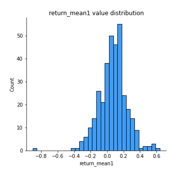
## Feature : return_mean2
- **Feature type** : continous
- **Missing** : 0.0%
- **Unique** : 347
- **Count** :347.0
- **Mean** :-0.007009910103753183
- **Std** :0.11990295947760099
- **Min** :-0.3393917268522109
- **25%th Percentile** : -0.0957145264839016
- **50%th Percentile** : -0.0029583569093686226
- **75%th Percentile** : 0.06930280391916949
- **Max** :0.6801605239983173

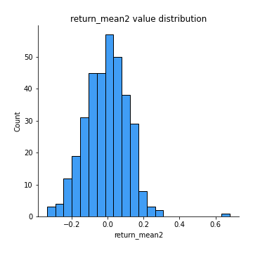
## Feature : return_sd1
- **Feature type** : continous
- **Missing** : 0.0%
- **Unique** : 347
- **Count** :347.0
- **Mean** :1.613347010712698
- **Std** :0.36309122954295825
- **Min** :0.8733078831717243
- **25%th Percentile** : 1.4651651224748945
- **50%th Percentile** : 1.569385787444456
- **75%th Percentile** : 1.673282599120209
- **Max** :3.332494027875222

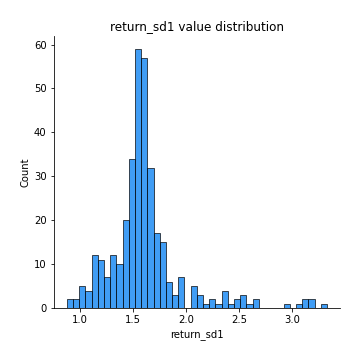
## Feature : return_sd2
- **Feature type** : continous
- **Missing** : 0.0%
- **Unique** : 347
- **Count** :347.0
- **Mean** :1.6414947764751437
- **Std** :0.43477723653774986
- **Min** :0.8198779632289204
- **25%th Percentile** : 1.473662983559465
- **50%th Percentile** : 1.561194078752647
- **75%th Percentile** : 1.6651093797701824
- **Max** :4.59233049161685

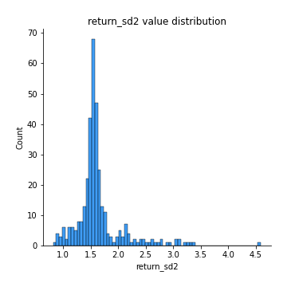
## Feature : return_skew1
- **Feature type** : continous
- **Missing** : 0.0%
- **Unique** : 347
- **Count** :347.0
- **Mean** :-0.150158480164432
- **Std** :0.5878248049270686
- **Min** :-2.5068500114696386
- **25%th Percentile** : -0.35708464620783076
- **50%th Percentile** : -0.1211477280586517
- **75%th Percentile** : 0.0707801489312797
- **Max** :2.351757728252051

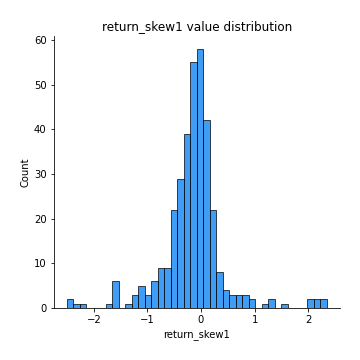
## Feature : return_skew2
- **Feature type** : continous
- **Missing** : 0.0%
- **Unique** : 347
- **Count** :347.0
- **Mean** :-0.2733822111755548
- **Std** :1.0284998808628287
- **Min** :-7.3762354994385335
- **25%th Percentile** : -0.39532210765236386
- **50%th Percentile** : -0.04943587728103609
- **75%th Percentile** : 0.10286482081538223
- **Max** :4.1920266082732045

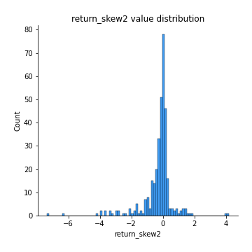
## Feature : return_kurtosis1
- **Feature type** : continous
- **Missing** : 0.0%
- **Unique** : 347
- **Count** :347.0
- **Mean** :2.379642439415417
- **Std** :4.162024511906642
- **Min** :-0.6048471160988145
- **25%th Percentile** : -0.013156899901509256
- **50%th Percentile** : 0.9910776814597702
- **75%th Percentile** : 2.678812472527533
- **Max** :23.612665658846073

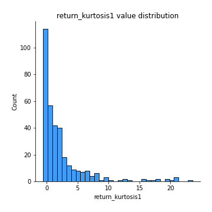
## Feature : return_kurtosis2
- **Feature type** : continous
- **Missing** : 0.0%
- **Unique** : 347
- **Count** :347.0
- **Mean** :4.2338631088619305
- **Std** :9.428821901066929
- **Min** :-0.6013221869333996
- **25%th Percentile** : -0.006077465377777536
- **50%th Percentile** : 0.9966328054964189
- **75%th Percentile** : 3.6557789302663313
- **Max** :94.01659180149953

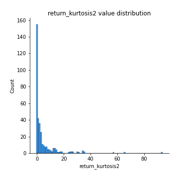
## Feature : return_autocorrelation_1_lag1
- **Feature type** : continous
- **Missing** : 0.0%
- **Unique** : 347
- **Count** :347.0
- **Mean** :0.143380226954976
- **Std** :0.1841956273179196
- **Min** :-0.2110198016529991
- **25%th Percentile** : -0.027523563148759513
- **50%th Percentile** : 0.091378391138176
- **75%th Percentile** : 0.3279642952600742
- **Max** :0.46356537880913234

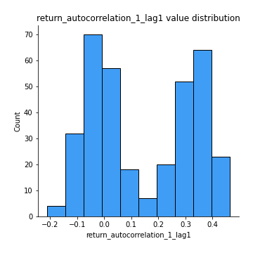
## Feature : return_autocorrelation_1_lag2
- **Feature type** : continous
- **Missing** : 0.0%
- **Unique** : 347
- **Count** :347.0
- **Mean** :0.14199877706603403
- **Std** :0.1800227210811168
- **Min** :-0.18815240041143846
- **25%th Percentile** : -0.022718584270073672
- **50%th Percentile** : 0.08477024380903611
- **75%th Percentile** : 0.3184260652385166
- **Max** :0.47777197746496286

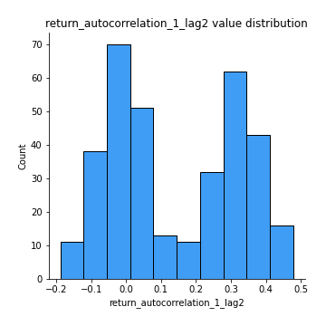
## Feature : return_autocorrelation_1_lag3
- **Feature type** : continous
- **Missing** : 0.0%
- **Unique** : 347
- **Count** :347.0
- **Mean** :0.15609971216828938
- **Std** :0.16421564198378355
- **Min** :-0.1817944619132489
- **25%th Percentile** : 0.017694654133131274
- **50%th Percentile** : 0.09737260112514783
- **75%th Percentile** : 0.31777676959775236
- **Max** :0.45051425841613546

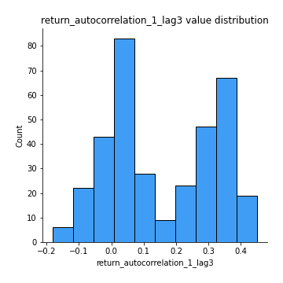
## Feature : return_autocorrelation_2_lag1
- **Feature type** : continous
- **Missing** : 0.0%
- **Unique** : 347
- **Count** :347.0
- **Mean** :0.007231929574295879
- **Std** :0.06886409720514129
- **Min** :-0.17778763204400128
- **25%th Percentile** : -0.03965199850582067
- **50%th Percentile** : 0.011218149718501496
- **75%th Percentile** : 0.05531882439059792
- **Max** :0.19188280394394067

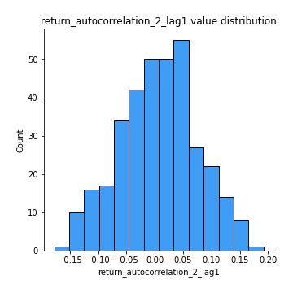
## Feature : return_autocorrelation_2_lag2
- **Feature type** : continous
- **Missing** : 0.0%
- **Unique** : 347
- **Count** :347.0
- **Mean** :-0.0026801033648707812
- **Std** :0.06765045897646464
- **Min** :-0.1922204096694299
- **25%th Percentile** : -0.04684980515301582
- **50%th Percentile** : -0.0023127865855016665
- **75%th Percentile** : 0.0443316423948755
- **Max** :0.19901717211235712

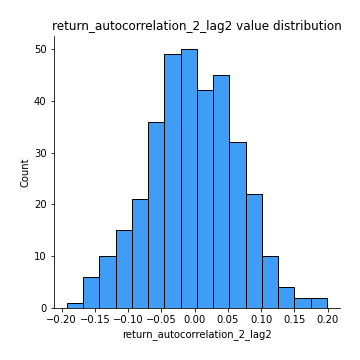
## Feature : return_autocorrelation_2_lag3
- **Feature type** : continous
- **Missing** : 0.0%
- **Unique** : 347
- **Count** :347.0
- **Mean** :0.007256863913021915
- **Std** :0.06169964913170007
- **Min** :-0.1794902936808312
- **25%th Percentile** : -0.03472522809303509
- **50%th Percentile** : 0.009430441449745378
- **75%th Percentile** : 0.04890154640983234
- **Max** :0.20205753622966244

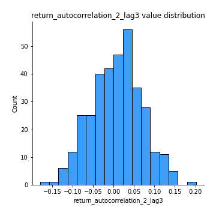
## Feature : return_correlation_ts1_lag_0
- **Feature type** : continous
- **Missing** : 0.0%
- **Unique** : 347
- **Count** :347.0
- **Mean** :0.5732891920256767
- **Std** :0.28705157194391717
- **Min** :-0.10256711281206837
- **25%th Percentile** : 0.3381206377935342
- **50%th Percentile** : 0.5977353242009235
- **75%th Percentile** : 0.845629905752584
- **Max** :0.9937227277077512

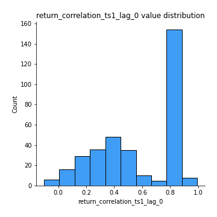
## Feature : return_correlation_ts1_lag_1
- **Feature type** : continous
- **Missing** : 0.0%
- **Unique** : 347
- **Count** :347.0
- **Mean** :0.030732916946767677
- **Std** :0.0719046322177558
- **Min** :-0.15425283552105754
- **25%th Percentile** : -0.01800841540029375
- **50%th Percentile** : 0.027530496834379668
- **75%th Percentile** : 0.07977220997071036
- **Max** :0.2406746625963181

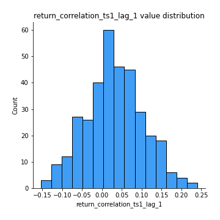
## Feature : return_correlation_ts1_lag_2
- **Feature type** : continous
- **Missing** : 0.0%
- **Unique** : 347
- **Count** :347.0
- **Mean** :0.026159446592408993
- **Std** :0.07526498262347432
- **Min** :-0.16038742223567365
- **25%th Percentile** : -0.0270770325361489
- **50%th Percentile** : 0.022558741222576804
- **75%th Percentile** : 0.08118321158664074
- **Max** :0.21257114249031794

## Feature : return_correlation_ts1_lag_3
- **Feature type** : continous
- **Missing** : 0.0%
- **Unique** : 347
- **Count** :347.0
- **Mean** :0.03372942543381624
- **Std** :0.07202486541868912
- **Min** :-0.21147540839842804
- **25%th Percentile** : -0.013884080283474654
- **50%th Percentile** : 0.03735431413211815
- **75%th Percentile** : 0.08412625181323187
- **Max** :0.23808054096877584

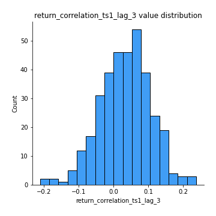
## Feature : return_correlation_ts2_lag_1
- **Feature type** : continous
- **Missing** : 0.0%
- **Unique** : 347
- **Count** :347.0
- **Mean** :0.037835513826732205
- **Std** :0.0739506317070139
- **Min** :-0.17665751184419612
- **25%th Percentile** : -0.007779271293844507
- **50%th Percentile** : 0.03838635024174895
- **75%th Percentile** : 0.08843358788206249
- **Max** :0.24974876525096

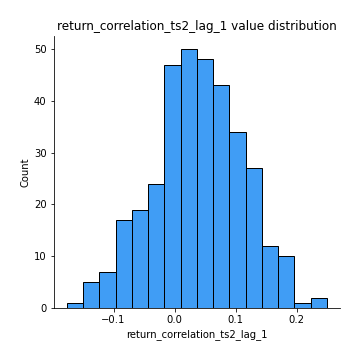
## Feature : return_correlation_ts2_lag_2
- **Feature type** : continous
- **Missing** : 0.0%
- **Unique** : 347
- **Count** :347.0
- **Mean** :0.02634455517857045
- **Std** :0.07749329900005707
- **Min** :-0.2757460186107768
- **25%th Percentile** : -0.02409607193374775
- **50%th Percentile** : 0.020260685365682006
- **75%th Percentile** : 0.07974103124224576
- **Max** :0.22577809021888814

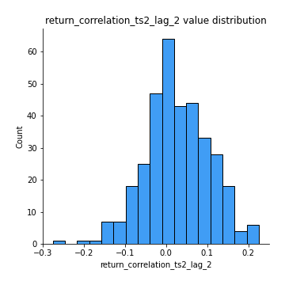
## Feature : return_correlation_ts2_lag_3
- **Feature type** : continous
- **Missing** : 0.0%
- **Unique** : 347
- **Count** :347.0
- **Mean** :0.0382961284683036
- **Std** :0.06786045194124975
- **Min** :-0.17697863431182184
- **25%th Percentile** : -0.0047570761634427
- **50%th Percentile** : 0.03971238203047736
- **75%th Percentile** : 0.08193612626831721
- **Max** :0.215075574532051

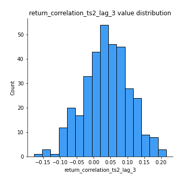
## Feature : sqreturn_autocorrelation_ts1_lag1
- **Feature type** : continous
- **Missing** : 0.0%
- **Unique** : 347
- **Count** :347.0
- **Mean** :0.06409117536154389
- **Std** :0.08041002758689263
- **Min** :-0.09335970962854255
- **25%th Percentile** : 0.006192248347219539
- **50%th Percentile** : 0.055428908673183765
- **75%th Percentile** : 0.10385270228630915
- **Max** :0.4170324090514868

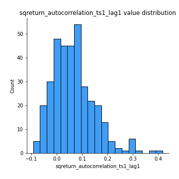
## Feature : sqreturn_autocorrelation_ts1_lag2
- **Feature type** : continous
- **Missing** : 0.0%
- **Unique** : 347
- **Count** :347.0
- **Mean** :0.04475370428706711
- **Std** :0.06901469796922918
- **Min** :-0.09826625095154932
- **25%th Percentile** : -0.007639934462936196
- **50%th Percentile** : 0.033132103885984934
- **75%th Percentile** : 0.09006604110800082
- **Max** :0.32836952056190194

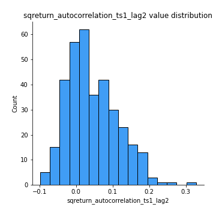
## Feature : sqreturn_autocorrelation_ts1_lag3
- **Feature type** : continous
- **Missing** : 0.0%
- **Unique** : 347
- **Count** :347.0
- **Mean** :0.03661771502434941
- **Std** :0.0674385995755529
- **Min** :-0.10614165941430269
- **25%th Percentile** : -0.011467573088582206
- **50%th Percentile** : 0.028528360860915834
- **75%th Percentile** : 0.07104493994421573
- **Max** :0.3627817362523898

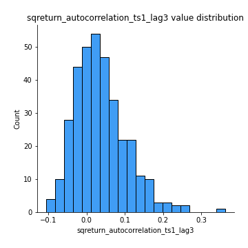
## Feature : sqreturn_autocorrelation_ts2_lag1
- **Feature type** : continous
- **Missing** : 0.0%
- **Unique** : 347
- **Count** :347.0
- **Mean** :0.023347528307926666
- **Std** :0.06857742789112116
- **Min** :-0.12306429040556716
- **25%th Percentile** : -0.020232140341233565
- **50%th Percentile** : 0.015488459753505305
- **75%th Percentile** : 0.05807226441016572
- **Max** :0.3459234668044924

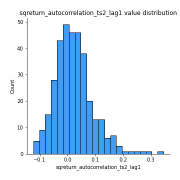
## Feature : sqreturn_autocorrelation_ts2_lag2
- **Feature type** : continous
- **Missing** : 0.0%
- **Unique** : 347
- **Count** :347.0
- **Mean** :0.010243934388126994
- **Std** :0.061878347883779085
- **Min** :-0.1450868632213829
- **25%th Percentile** : -0.026089178908170717
- **50%th Percentile** : 0.003705453782719749
- **75%th Percentile** : 0.043661204751936855
- **Max** :0.25057436061622956

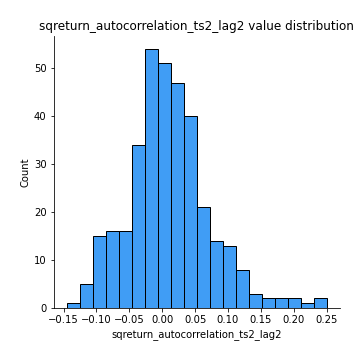
## Feature : sqreturn_autocorrelation_ts2_lag3
- **Feature type** : continous
- **Missing** : 0.0%
- **Unique** : 347
- **Count** :347.0
- **Mean** :0.006629630664542162
- **Std** :0.06306033308421526
- **Min** :-0.13339445826386795
- **25%th Percentile** : -0.031061285416900414
- **50%th Percentile** : -0.0031817119415238114
- **75%th Percentile** : 0.03544537597468342
- **Max** :0.3463122340368414

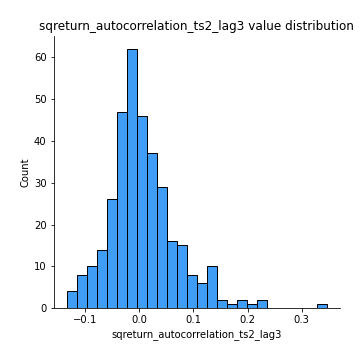
## Feature : sqreturn_correlation_ts1_lag_0
- **Feature type** : continous
- **Missing** : 0.0%
- **Unique** : 347
- **Count** :347.0
- **Mean** :0.5732891920256767
- **Std** :0.28705157194391717
- **Min** :-0.10256711281206837
- **25%th Percentile** : 0.3381206377935342
- **50%th Percentile** : 0.5977353242009235
- **75%th Percentile** : 0.845629905752584
- **Max** :0.9937227277077512

## Feature : sqreturn_correlation_ts1_lag_1
- **Feature type** : continous
- **Missing** : 0.0%
- **Unique** : 347
- **Count** :347.0
- **Mean** :0.030732916946767677
- **Std** :0.0719046322177558
- **Min** :-0.15425283552105754
- **25%th Percentile** : -0.01800841540029375
- **50%th Percentile** : 0.027530496834379668
- **75%th Percentile** : 0.07977220997071036
- **Max** :0.2406746625963181

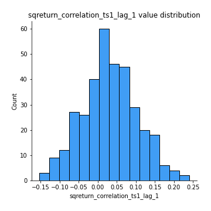
## Feature : sqreturn_correlation_ts1_lag_2
- **Feature type** : continous
- **Missing** : 0.0%
- **Unique** : 347
- **Count** :347.0
- **Mean** :0.026159446592408993
- **Std** :0.07526498262347432
- **Min** :-0.16038742223567365
- **25%th Percentile** : -0.0270770325361489
- **50%th Percentile** : 0.022558741222576804
- **75%th Percentile** : 0.08118321158664074
- **Max** :0.21257114249031794

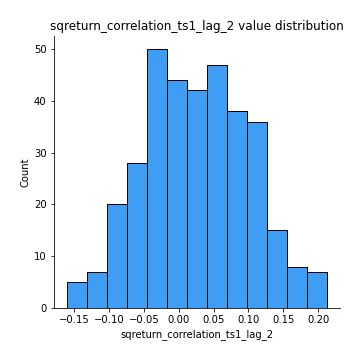
## Feature : sqreturn_correlation_ts1_lag_3
- **Feature type** : continous
- **Missing** : 0.0%
- **Unique** : 347
- **Count** :347.0
- **Mean** :0.03372942543381624
- **Std** :0.07202486541868912
- **Min** :-0.21147540839842804
- **25%th Percentile** : -0.013884080283474654
- **50%th Percentile** : 0.03735431413211815
- **75%th Percentile** : 0.08412625181323187
- **Max** :0.23808054096877584

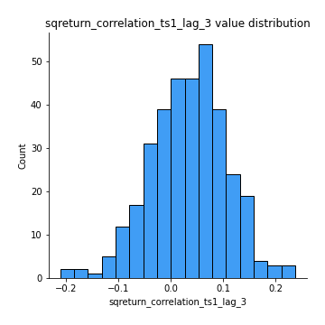
## Feature : sqreturn_correlation_ts2_lag_1
- **Feature type** : continous
- **Missing** : 0.0%
- **Unique** : 347
- **Count** :347.0
- **Mean** :0.037835513826732205
- **Std** :0.0739506317070139
- **Min** :-0.17665751184419612
- **25%th Percentile** : -0.007779271293844507
- **50%th Percentile** : 0.03838635024174895
- **75%th Percentile** : 0.08843358788206249
- **Max** :0.24974876525096

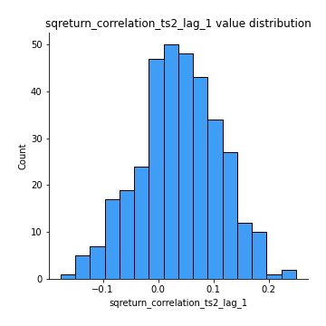
## Feature : sqreturn_correlation_ts2_lag_2
- **Feature type** : continous
- **Missing** : 0.0%
- **Unique** : 347
- **Count** :347.0
- **Mean** :0.02634455517857045
- **Std** :0.07749329900005707
- **Min** :-0.2757460186107768
- **25%th Percentile** : -0.02409607193374775
- **50%th Percentile** : 0.020260685365682006
- **75%th Percentile** : 0.07974103124224576
- **Max** :0.22577809021888814

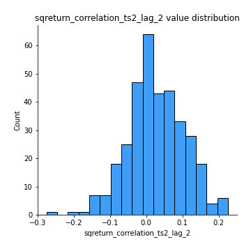
## Feature : sqreturn_correlation_ts2_lag_3
- **Feature type** : continous
- **Missing** : 0.0%
- **Unique** : 347
- **Count** :347.0
- **Mean** :0.0382961284683036
- **Std** :0.06786045194124975
- **Min** :-0.17697863431182184
- **25%th Percentile** : -0.0047570761634427
- **50%th Percentile** : 0.03971238203047736
- **75%th Percentile** : 0.08193612626831721
- **Max** :0.215075574532051

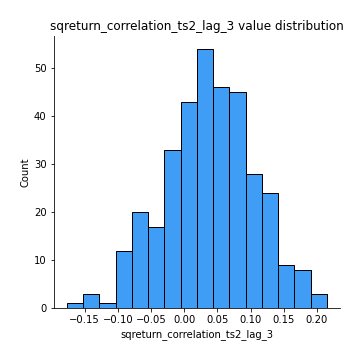
## Feature : price2_granger_cause_price1
- **Feature type** : continous
- **Missing** : 0.0%
- **Unique** : 347
- **Count** :347.0
- **Mean** :0.15973491965387604
- **Std** :0.26487492229497267
- **Min** :1.7698678857246064e-37
- **25%th Percentile** : 8.530543475309675e-05
- **50%th Percentile** : 0.010385956929857288
- **75%th Percentile** : 0.20777430732486754
- **Max** :0.9898380228448623

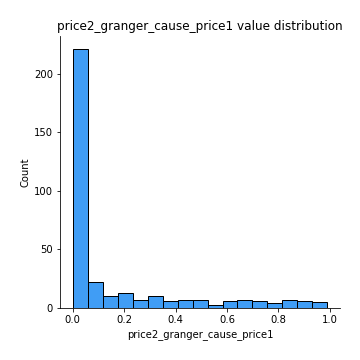
## Feature : price1_granger_cause_price2
- **Feature type** : continous
- **Missing** : 0.0%
- **Unique** : 347
- **Count** :347.0
- **Mean** :0.24875052066186487
- **Std** :0.27003333750540004
- **Min** :9.596583540360167e-06
- **25%th Percentile** : 0.02768341411861336
- **50%th Percentile** : 0.14838065171253062
- **75%th Percentile** : 0.3794152057866257
- **Max** :0.9991946101031356

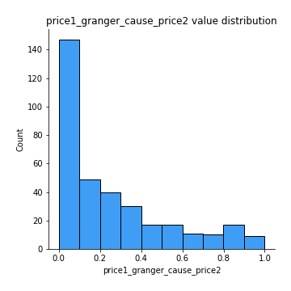

[<< Go back](../README.md)
