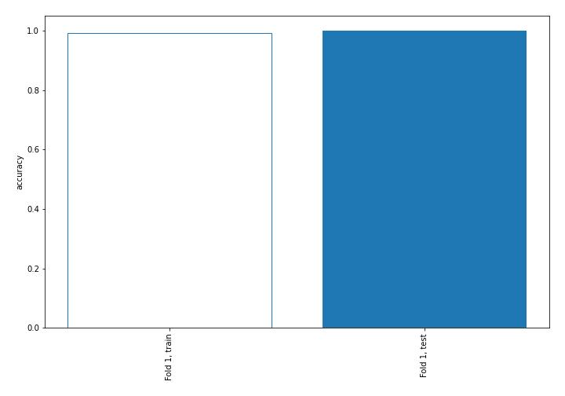
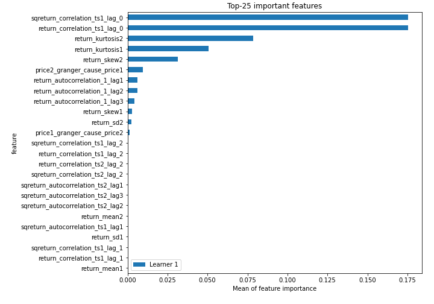
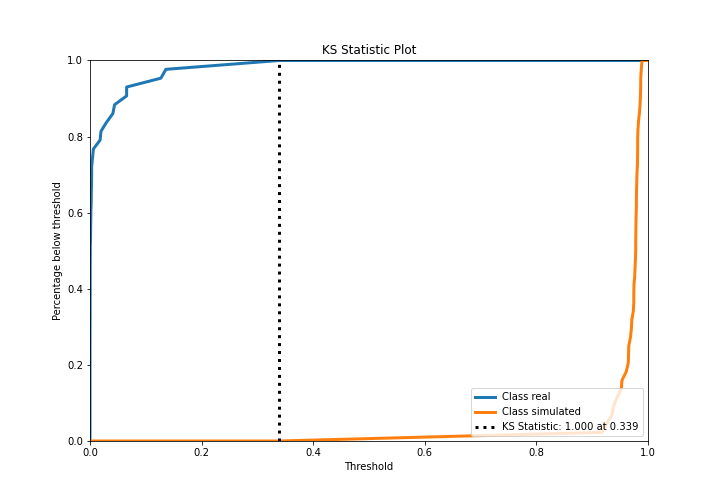
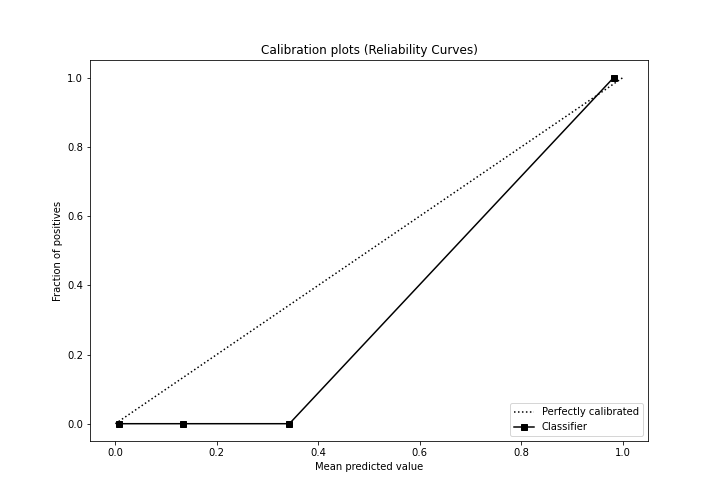
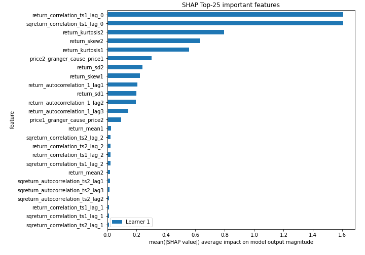
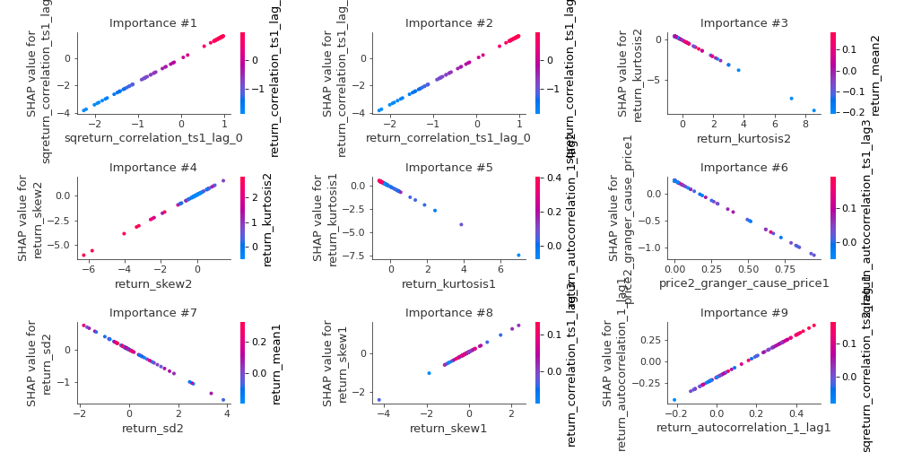
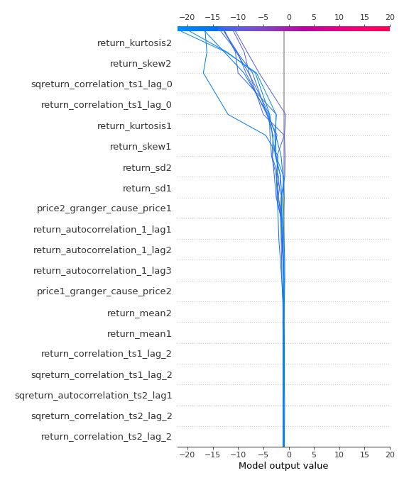
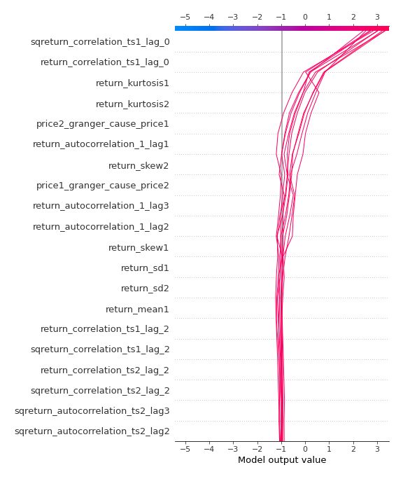
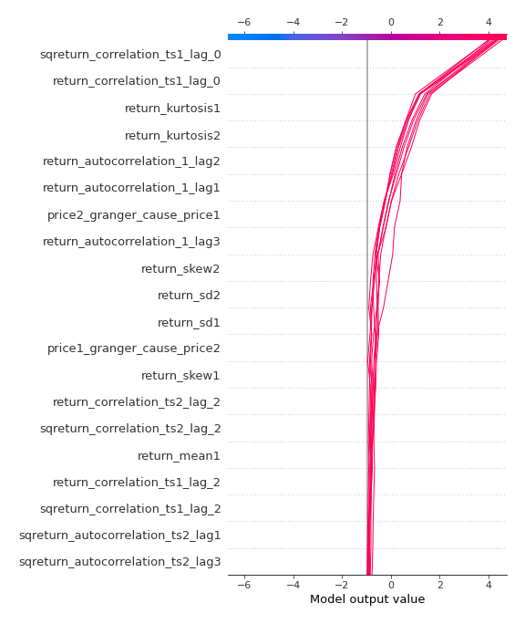

# Summary of 3_Linear

[<< Go back](../README.md)

## Logistic Regression (Linear)
- **n_jobs**: -1
- **explain_level**: 2

## Validation
 - **validation_type**: split
 - **train_ratio**: 0.75
 - **shuffle**: True
 - **stratify**: True

## Optimized metric
accuracy

## Training time

4.5 seconds

## Metric details
|           |     score |     threshold |
|:----------|----------:|--------------:|
| logloss   | 0.0263839 | nan           |
| auc       | 1         | nan           |
| f1        | 1         |   0.502784    |
| accuracy  | 1         |   0.502784    |
| precision | 1         |   0.502784    |
| recall    | 1         |   5.72624e-10 |
| mcc       | 1         |   0.502784    |

## Confusion matrix (at threshold=0.502784)
|                      |   Predicted as real |   Predicted as simulated |
|:---------------------|--------------------:|-------------------------:|
| Labeled as real      |                  43 |                        0 |
| Labeled as simulated |                   0 |                       44 |

## Learning curves

## Coefficients
| feature                           |   Learner_1 |
|:----------------------------------|------------:|
| return_correlation_ts1_lag_0      |  1.65401    |
| sqreturn_correlation_ts1_lag_0    |  1.65401    |
| return_autocorrelation_1_lag2     |  1.25427    |
| return_autocorrelation_1_lag1     |  1.2081     |
| return_skew2                      |  0.967789   |
| return_autocorrelation_1_lag3     |  0.921998   |
| return_skew1                      |  0.588219   |
| return_correlation_ts1_lag_2      |  0.358183   |
| sqreturn_correlation_ts1_lag_2    |  0.358183   |
| return_correlation_ts2_lag_2      |  0.34868    |
| sqreturn_correlation_ts2_lag_2    |  0.34868    |
| return_correlation_ts1_lag_1      |  0.226305   |
| sqreturn_correlation_ts1_lag_1    |  0.226305   |
| return_correlation_ts2_lag_1      |  0.203831   |
| sqreturn_correlation_ts2_lag_1    |  0.203831   |
| return_mean1                      |  0.181598   |
| return_autocorrelation_2_lag2     |  0.13896    |
| return_correlation_ts2_lag_3      |  0.013362   |
| sqreturn_correlation_ts2_lag_3    |  0.013362   |
| return_autocorrelation_2_lag1     | -0.00544247 |
| sqreturn_autocorrelation_ts1_lag2 | -0.0234175  |
| sqreturn_correlation_ts1_lag_3    | -0.0469768  |
| return_correlation_ts1_lag_3      | -0.0469768  |
| sqreturn_autocorrelation_ts1_lag3 | -0.0654979  |
| sqreturn_autocorrelation_ts1_lag1 | -0.155277   |
| return_autocorrelation_2_lag3     | -0.189874   |
| return_mean2                      | -0.192208   |
| sqreturn_autocorrelation_ts2_lag2 | -0.2794     |
| sqreturn_autocorrelation_ts2_lag1 | -0.318518   |
| sqreturn_autocorrelation_ts2_lag3 | -0.348571   |
| return_sd1                        | -0.395185   |
| price1_granger_cause_price2       | -0.397389   |
| return_sd2                        | -0.398516   |
| return_kurtosis2                  | -1.01836    |
| return_kurtosis1                  | -1.0486     |
| intercept                         | -1.39417    |
| price2_granger_cause_price1       | -1.45222    |

## Permutation-based Importance

## Confusion Matrix

## Normalized Confusion Matrix

## ROC Curve

## Kolmogorov-Smirnov Statistic

## Precision-Recall Curve

## Calibration Curve

## Cumulative Gains Curve

## Lift Curve

## SHAP Importance

## SHAP Dependence plots

### Dependence (Fold 1)

## SHAP Decision plots

### Top-10 Worst decisions for class 0 (Fold 1)

### Top-10 Best decisions for class 0 (Fold 1)

### Top-10 Worst decisions for class 1 (Fold 1)

### Top-10 Best decisions for class 1 (Fold 1)

[<< Go back](../README.md)
