# Exploratory Data Analysis

[<< Go back](../README.md)
## Feature : target
- **Feature type** : categorical
- **Missing** : 0.0%
- **Unique** : 2
- **Count** :347
- **Unique** :2
- **Top** :simulated
- **Freq** :176

## Feature : return_mean1
- **Feature type** : continous
- **Missing** : 0.0%
- **Unique** : 347
- **Count** :347.0
- **Mean** :0.06722408939411255
- **Std** :0.1756575921541293
- **Min** :-0.8164581514032508
- **25%th Percentile** : -0.03218961521002657
- **50%th Percentile** : 0.068275572360279
- **75%th Percentile** : 0.17023840192081574
- **Max** :0.6031398463639887

## Feature : return_mean2
- **Feature type** : continous
- **Missing** : 0.0%
- **Unique** : 347
- **Count** :347.0
- **Mean** :-0.0020585833058928363
- **Std** :0.12339465440771322
- **Min** :-0.3439835398279146
- **25%th Percentile** : -0.0843771021874982
- **50%th Percentile** : -0.001356102229215324
- **75%th Percentile** : 0.08869182598346542
- **Max** :0.6801605239983173

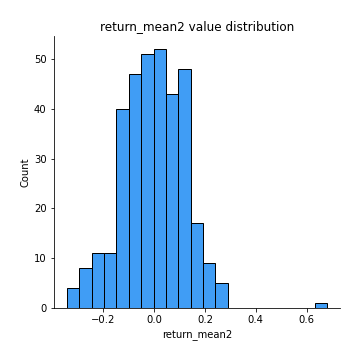
## Feature : return_sd1
- **Feature type** : continous
- **Missing** : 0.0%
- **Unique** : 347
- **Count** :347.0
- **Mean** :1.6203092816675673
- **Std** :0.35191634765384433
- **Min** :0.8102430347636637
- **25%th Percentile** : 1.4902850992440224
- **50%th Percentile** : 1.5871852777991065
- **75%th Percentile** : 1.6856908229167056
- **Max** :3.181425034216533

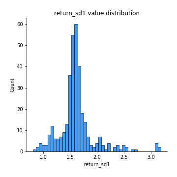
## Feature : return_sd2
- **Feature type** : continous
- **Missing** : 0.0%
- **Unique** : 347
- **Count** :347.0
- **Mean** :1.62035296771234
- **Std** :0.3842494865811123
- **Min** :0.8198779632289204
- **25%th Percentile** : 1.486253715652442
- **50%th Percentile** : 1.566893237492509
- **75%th Percentile** : 1.6455045186592603
- **Max** :4.59233049161685

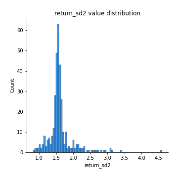
## Feature : return_skew1
- **Feature type** : continous
- **Missing** : 0.0%
- **Unique** : 347
- **Count** :347.0
- **Mean** :-0.23303154440144866
- **Std** :0.6975624666009838
- **Min** :-4.239645236578449
- **25%th Percentile** : -0.41675637402661825
- **50%th Percentile** : -0.14224135899903426
- **75%th Percentile** : 0.016706568187954053
- **Max** :2.351757728252051

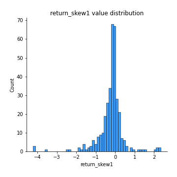
## Feature : return_skew2
- **Feature type** : continous
- **Missing** : 0.0%
- **Unique** : 347
- **Count** :347.0
- **Mean** :-0.2367592340732589
- **Std** :0.9766147686173549
- **Min** :-6.262899561987459
- **25%th Percentile** : -0.30590176964767823
- **50%th Percentile** : -0.04751706551863533
- **75%th Percentile** : 0.09044845333469409
- **Max** :4.1920266082732045

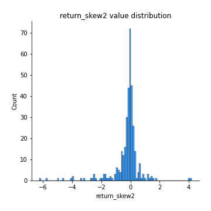
## Feature : return_kurtosis1
- **Feature type** : continous
- **Missing** : 0.0%
- **Unique** : 347
- **Count** :347.0
- **Mean** :2.6448363865019258
- **Std** :5.436662869720253
- **Min** :-0.6442042718921703
- **25%th Percentile** : -0.0747451859045074
- **50%th Percentile** : 0.7353616102368257
- **75%th Percentile** : 2.9097651549436074
- **Max** :40.485294874464934

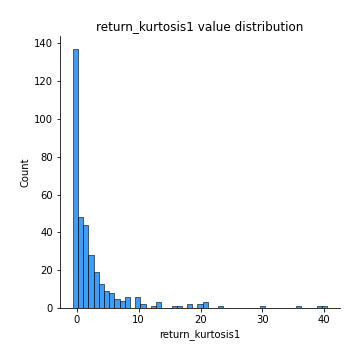
## Feature : return_kurtosis2
- **Feature type** : continous
- **Missing** : 0.0%
- **Unique** : 347
- **Count** :347.0
- **Mean** :3.7478396802372353
- **Std** :8.292050952352191
- **Min** :-0.5445929832780476
- **25%th Percentile** : -0.024669717320696893
- **50%th Percentile** : 0.5464160809260301
- **75%th Percentile** : 3.3451525378866567
- **Max** :64.99818629655663

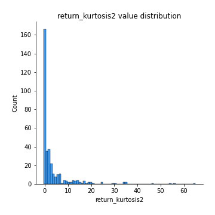
## Feature : return_autocorrelation_1_lag1
- **Feature type** : continous
- **Missing** : 0.0%
- **Unique** : 347
- **Count** :347.0
- **Mean** :0.15666942311001192
- **Std** :0.18309841933753157
- **Min** :-0.2110198016529991
- **25%th Percentile** : -0.018497057396311183
- **50%th Percentile** : 0.18006797231146454
- **75%th Percentile** : 0.32881668381377005
- **Max** :0.490910902118294

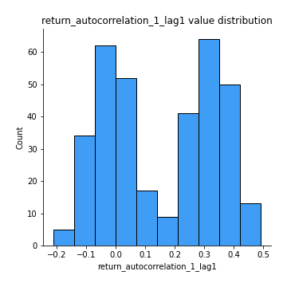
## Feature : return_autocorrelation_1_lag2
- **Feature type** : continous
- **Missing** : 0.0%
- **Unique** : 347
- **Count** :347.0
- **Mean** :0.15301904114544446
- **Std** :0.18037857005015667
- **Min** :-0.1563842210038999
- **25%th Percentile** : -0.020979982010415964
- **50%th Percentile** : 0.1551356232854039
- **75%th Percentile** : 0.3203153803192649
- **Max** :0.49010831401082816

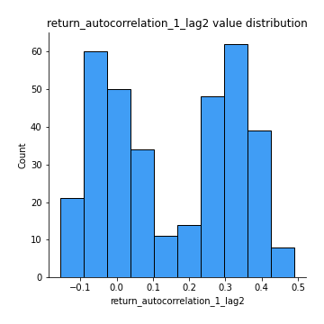
## Feature : return_autocorrelation_1_lag3
- **Feature type** : continous
- **Missing** : 0.0%
- **Unique** : 347
- **Count** :347.0
- **Mean** :0.16882213561238438
- **Std** :0.16438998496076593
- **Min** :-0.1654833157463618
- **25%th Percentile** : 0.023044808186232012
- **50%th Percentile** : 0.1700067137039338
- **75%th Percentile** : 0.31484577360858623
- **Max** :0.5445898726581716

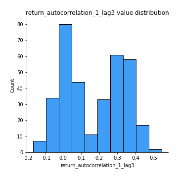
## Feature : return_autocorrelation_2_lag1
- **Feature type** : continous
- **Missing** : 0.0%
- **Unique** : 347
- **Count** :347.0
- **Mean** :0.0021812594441504673
- **Std** :0.07101676126654108
- **Min** :-0.2364404317158175
- **25%th Percentile** : -0.049279436828581255
- **50%th Percentile** : 0.001184780149601786
- **75%th Percentile** : 0.054569990922736344
- **Max** :0.2024676054184499

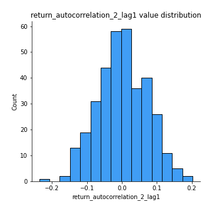
## Feature : return_autocorrelation_2_lag2
- **Feature type** : continous
- **Missing** : 0.0%
- **Unique** : 347
- **Count** :347.0
- **Mean** :-0.0031709695142780043
- **Std** :0.07080282986953929
- **Min** :-0.1758721664122366
- **25%th Percentile** : -0.04692038606006564
- **50%th Percentile** : -0.005047197565245276
- **75%th Percentile** : 0.04752804567205021
- **Max** :0.18152571427164418

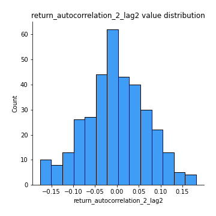
## Feature : return_autocorrelation_2_lag3
- **Feature type** : continous
- **Missing** : 0.0%
- **Unique** : 347
- **Count** :347.0
- **Mean** :0.010666214157901614
- **Std** :0.06155647412761594
- **Min** :-0.1794902936808312
- **25%th Percentile** : -0.024916997457033102
- **50%th Percentile** : 0.011484225685642828
- **75%th Percentile** : 0.047878470570155374
- **Max** :0.20205753622966244

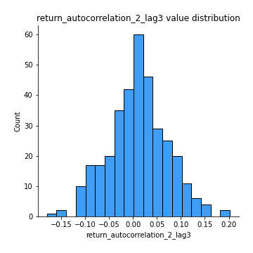
## Feature : return_correlation_ts1_lag_0
- **Feature type** : continous
- **Missing** : 0.0%
- **Unique** : 347
- **Count** :347.0
- **Mean** :0.5871613212254135
- **Std** :0.2939806865705398
- **Min** :-0.07366870340906873
- **25%th Percentile** : 0.3380361619663287
- **50%th Percentile** : 0.7866073866001781
- **75%th Percentile** : 0.8528606545600907
- **Max** :0.9937227277077512

## Feature : return_correlation_ts1_lag_1
- **Feature type** : continous
- **Missing** : 0.0%
- **Unique** : 347
- **Count** :347.0
- **Mean** :0.03432018271324863
- **Std** :0.07682832105057065
- **Min** :-0.18856827637524448
- **25%th Percentile** : -0.01714841157345274
- **50%th Percentile** : 0.027372400476865514
- **75%th Percentile** : 0.08464939935101541
- **Max** :0.22776751021641498

## Feature : return_correlation_ts1_lag_2
- **Feature type** : continous
- **Missing** : 0.0%
- **Unique** : 347
- **Count** :347.0
- **Mean** :0.03042238971547523
- **Std** :0.07679479850300953
- **Min** :-0.172871336111873
- **25%th Percentile** : -0.02658694575465028
- **50%th Percentile** : 0.03414060989856177
- **75%th Percentile** : 0.08464810212709525
- **Max** :0.2412758892543598

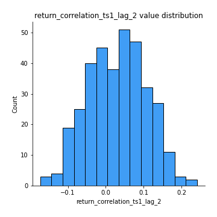
## Feature : return_correlation_ts1_lag_3
- **Feature type** : continous
- **Missing** : 0.0%
- **Unique** : 347
- **Count** :347.0
- **Mean** :0.03808009105653523
- **Std** :0.07445729904202111
- **Min** :-0.18059033867783728
- **25%th Percentile** : -0.010163494188875088
- **50%th Percentile** : 0.040967583529040334
- **75%th Percentile** : 0.08608678894875897
- **Max** :0.2566243193538154

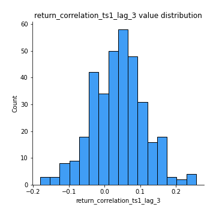
## Feature : return_correlation_ts2_lag_1
- **Feature type** : continous
- **Missing** : 0.0%
- **Unique** : 347
- **Count** :347.0
- **Mean** :0.040258591848697435
- **Std** :0.07580169941580171
- **Min** :-0.17665751184419612
- **25%th Percentile** : -0.006426988440036416
- **50%th Percentile** : 0.03721150731339276
- **75%th Percentile** : 0.08948307740590891
- **Max** :0.3425036902091001

## Feature : return_correlation_ts2_lag_2
- **Feature type** : continous
- **Missing** : 0.0%
- **Unique** : 347
- **Count** :347.0
- **Mean** :0.029122937296976886
- **Std** :0.07882834376858738
- **Min** :-0.18793480063267962
- **25%th Percentile** : -0.026304553157162035
- **50%th Percentile** : 0.027632489878156644
- **75%th Percentile** : 0.084316587860611
- **Max** :0.22902391157565052

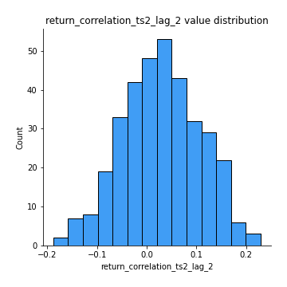
## Feature : return_correlation_ts2_lag_3
- **Feature type** : continous
- **Missing** : 0.0%
- **Unique** : 347
- **Count** :347.0
- **Mean** :0.044536766914131116
- **Std** :0.06857444452410713
- **Min** :-0.13287767820660334
- **25%th Percentile** : -0.0013763009956434193
- **50%th Percentile** : 0.041515582009032194
- **75%th Percentile** : 0.08711128295227598
- **Max** :0.2674722750048605

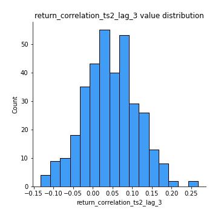
## Feature : sqreturn_autocorrelation_ts1_lag1
- **Feature type** : continous
- **Missing** : 0.0%
- **Unique** : 347
- **Count** :347.0
- **Mean** :0.05834537885449339
- **Std** :0.08216559035358505
- **Min** :-0.140052651698142
- **25%th Percentile** : 0.0032339170339944715
- **50%th Percentile** : 0.039077174169653464
- **75%th Percentile** : 0.10294202346954764
- **Max** :0.4170324090514868

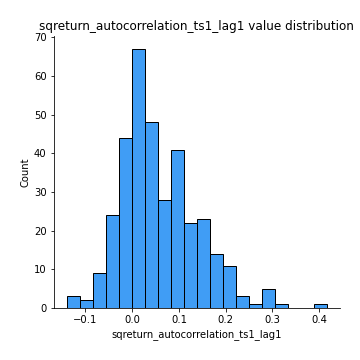
## Feature : sqreturn_autocorrelation_ts1_lag2
- **Feature type** : continous
- **Missing** : 0.0%
- **Unique** : 347
- **Count** :347.0
- **Mean** :0.044581925449934424
- **Std** :0.07529293637885523
- **Min** :-0.1392382776748105
- **25%th Percentile** : -0.010572914632335496
- **50%th Percentile** : 0.03276037172328548
- **75%th Percentile** : 0.08781179063482965
- **Max** :0.34775803632966384

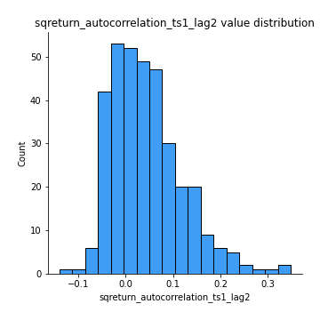
## Feature : sqreturn_autocorrelation_ts1_lag3
- **Feature type** : continous
- **Missing** : 0.0%
- **Unique** : 347
- **Count** :347.0
- **Mean** :0.03812059061564356
- **Std** :0.069867095184752
- **Min** :-0.15174984313872555
- **25%th Percentile** : -0.009762999615020692
- **50%th Percentile** : 0.029692634947835965
- **75%th Percentile** : 0.0765618729360405
- **Max** :0.2883297965531157

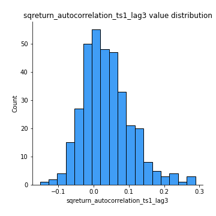
## Feature : sqreturn_autocorrelation_ts2_lag1
- **Feature type** : continous
- **Missing** : 0.0%
- **Unique** : 347
- **Count** :347.0
- **Mean** :0.02575747660706315
- **Std** :0.07890074895681923
- **Min** :-0.1434160857817953
- **25%th Percentile** : -0.02035983389385644
- **50%th Percentile** : 0.017449381532190517
- **75%th Percentile** : 0.06103211040667224
- **Max** :0.36991568023038357

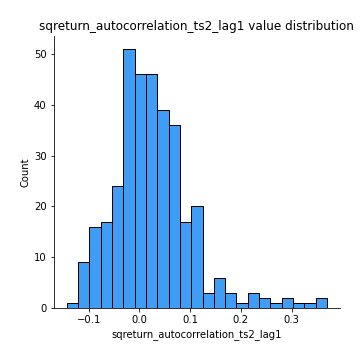
## Feature : sqreturn_autocorrelation_ts2_lag2
- **Feature type** : continous
- **Missing** : 0.0%
- **Unique** : 347
- **Count** :347.0
- **Mean** :0.010490097410989486
- **Std** :0.06073079240546797
- **Min** :-0.1357584289201846
- **25%th Percentile** : -0.0225539269255872
- **50%th Percentile** : 0.0031089801985009955
- **75%th Percentile** : 0.042215939187441494
- **Max** :0.28672056150180414

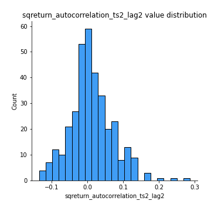
## Feature : sqreturn_autocorrelation_ts2_lag3
- **Feature type** : continous
- **Missing** : 0.0%
- **Unique** : 347
- **Count** :347.0
- **Mean** :0.00491700983454358
- **Std** :0.06665919198517294
- **Min** :-0.14371688736901608
- **25%th Percentile** : -0.03448776644007222
- **50%th Percentile** : -0.0037536748795020066
- **75%th Percentile** : 0.03473611799614946
- **Max** :0.3463122340368414

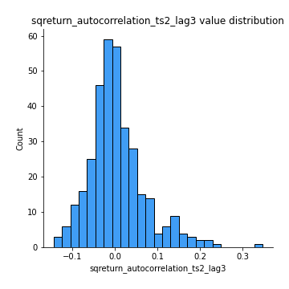
## Feature : sqreturn_correlation_ts1_lag_0
- **Feature type** : continous
- **Missing** : 0.0%
- **Unique** : 347
- **Count** :347.0
- **Mean** :0.5871613212254135
- **Std** :0.2939806865705398
- **Min** :-0.07366870340906873
- **25%th Percentile** : 0.3380361619663287
- **50%th Percentile** : 0.7866073866001781
- **75%th Percentile** : 0.8528606545600907
- **Max** :0.9937227277077512

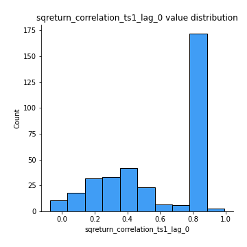
## Feature : sqreturn_correlation_ts1_lag_1
- **Feature type** : continous
- **Missing** : 0.0%
- **Unique** : 347
- **Count** :347.0
- **Mean** :0.03432018271324863
- **Std** :0.07682832105057065
- **Min** :-0.18856827637524448
- **25%th Percentile** : -0.01714841157345274
- **50%th Percentile** : 0.027372400476865514
- **75%th Percentile** : 0.08464939935101541
- **Max** :0.22776751021641498

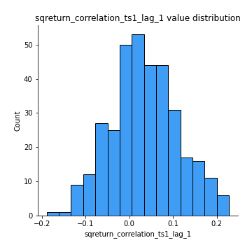
## Feature : sqreturn_correlation_ts1_lag_2
- **Feature type** : continous
- **Missing** : 0.0%
- **Unique** : 347
- **Count** :347.0
- **Mean** :0.03042238971547523
- **Std** :0.07679479850300953
- **Min** :-0.172871336111873
- **25%th Percentile** : -0.02658694575465028
- **50%th Percentile** : 0.03414060989856177
- **75%th Percentile** : 0.08464810212709525
- **Max** :0.2412758892543598

## Feature : sqreturn_correlation_ts1_lag_3
- **Feature type** : continous
- **Missing** : 0.0%
- **Unique** : 347
- **Count** :347.0
- **Mean** :0.03808009105653523
- **Std** :0.07445729904202111
- **Min** :-0.18059033867783728
- **25%th Percentile** : -0.010163494188875088
- **50%th Percentile** : 0.040967583529040334
- **75%th Percentile** : 0.08608678894875897
- **Max** :0.2566243193538154

## Feature : sqreturn_correlation_ts2_lag_1
- **Feature type** : continous
- **Missing** : 0.0%
- **Unique** : 347
- **Count** :347.0
- **Mean** :0.040258591848697435
- **Std** :0.07580169941580171
- **Min** :-0.17665751184419612
- **25%th Percentile** : -0.006426988440036416
- **50%th Percentile** : 0.03721150731339276
- **75%th Percentile** : 0.08948307740590891
- **Max** :0.3425036902091001

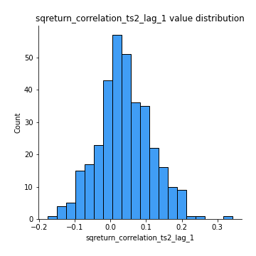
## Feature : sqreturn_correlation_ts2_lag_2
- **Feature type** : continous
- **Missing** : 0.0%
- **Unique** : 347
- **Count** :347.0
- **Mean** :0.029122937296976886
- **Std** :0.07882834376858738
- **Min** :-0.18793480063267962
- **25%th Percentile** : -0.026304553157162035
- **50%th Percentile** : 0.027632489878156644
- **75%th Percentile** : 0.084316587860611
- **Max** :0.22902391157565052

## Feature : sqreturn_correlation_ts2_lag_3
- **Feature type** : continous
- **Missing** : 0.0%
- **Unique** : 347
- **Count** :347.0
- **Mean** :0.044536766914131116
- **Std** :0.06857444452410713
- **Min** :-0.13287767820660334
- **25%th Percentile** : -0.0013763009956434193
- **50%th Percentile** : 0.041515582009032194
- **75%th Percentile** : 0.08711128295227598
- **Max** :0.2674722750048605

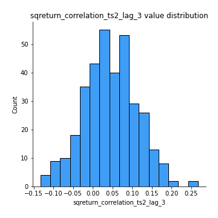
## Feature : price2_granger_cause_price1
- **Feature type** : continous
- **Missing** : 0.0%
- **Unique** : 347
- **Count** :347.0
- **Mean** :0.14618822913840443
- **Std** :0.25423871048218166
- **Min** :8.562882667172425e-16
- **25%th Percentile** : 4.8161130449419863e-05
- **50%th Percentile** : 0.005936974261447555
- **75%th Percentile** : 0.17214970020597586
- **Max** :0.9898380228448623

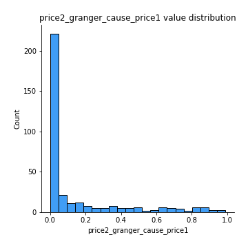
## Feature : price1_granger_cause_price2
- **Feature type** : continous
- **Missing** : 0.0%
- **Unique** : 347
- **Count** :347.0
- **Mean** :0.23253545164491413
- **Std** :0.2659059222585611
- **Min** :1.2012269232170316e-11
- **25%th Percentile** : 0.018916486102821407
- **50%th Percentile** : 0.10771979569675805
- **75%th Percentile** : 0.3837427714351479
- **Max** :0.9661247773448545

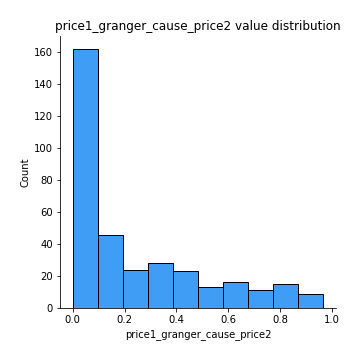

[<< Go back](../README.md)
