# Summary of 2_DecisionTree

[<< Go back](../README.md)

## Decision Tree
- **n_jobs**: -1
- **criterion**: gini
- **max_depth**: 3
- **explain_level**: 2

## Validation
 - **validation_type**: split
 - **train_ratio**: 0.75
 - **shuffle**: True
 - **stratify**: True

## Optimized metric
accuracy

## Training time

13.1 seconds

## Metric details
|           |    score |   threshold |
|:----------|---------:|------------:|
| logloss   | 1.33243  |  nan        |
| auc       | 0.774074 |  nan        |
| f1        | 0.828283 |    0.465385 |
| accuracy  | 0.804598 |    0.465385 |
| precision | 0.759259 |    0.465385 |
| recall    | 0.933333 |    0        |
| mcc       | 0.619549 |    0.465385 |

## Confusion matrix (at threshold=0.465385)
|                      |   Predicted as real |   Predicted as simulated |
|:---------------------|--------------------:|-------------------------:|
| Labeled as real      |                  29 |                       13 |
| Labeled as simulated |                   4 |                       41 |

## Learning curves
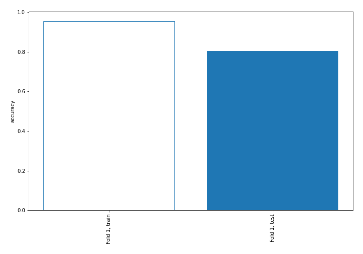

## Decision Tree 

### Tree #1
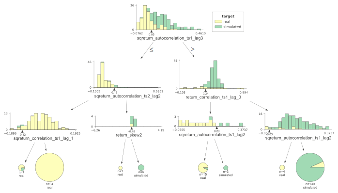

### Rules

if (sqreturn_autocorrelation_ts1_lag3 > 0.049) and (return_correlation_ts1_lag_0 > 0.337) and (sqreturn_autocorrelation_ts1_lag2 > -0.026) then class: simulated (proba: 93.08%) | based on 130 samples

if (sqreturn_autocorrelation_ts1_lag3 <= 0.049) and (sqreturn_autocorrelation_ts2_lag2 <= 0.149) and (sqreturn_correlation_ts1_lag_1 > -0.117) then class: real (proba: 100.0%) | based on 94 samples

if (sqreturn_autocorrelation_ts1_lag3 > 0.049) and (return_correlation_ts1_lag_0 <= 0.337) and (sqreturn_autocorrelation_ts1_lag2 <= 0.2) then class: real (proba: 93.33%) | based on 15 samples

if (sqreturn_autocorrelation_ts1_lag3 <= 0.049) and (sqreturn_autocorrelation_ts2_lag2 <= 0.149) and (sqreturn_correlation_ts1_lag_1 <= -0.117) then class: real (proba: 71.43%) | based on 7 samples

if (sqreturn_autocorrelation_ts1_lag3 <= 0.049) and (sqreturn_autocorrelation_ts2_lag2 > 0.149) and (return_skew2 > -0.484) then class: simulated (proba: 100.0%) | based on 6 samples

if (sqreturn_autocorrelation_ts1_lag3 > 0.049) and (return_correlation_ts1_lag_0 > 0.337) and (sqreturn_autocorrelation_ts1_lag2 <= -0.026) then class: real (proba: 100.0%) | based on 4 samples

if (sqreturn_autocorrelation_ts1_lag3 > 0.049) and (return_correlation_ts1_lag_0 <= 0.337) and (sqreturn_autocorrelation_ts1_lag2 > 0.2) then class: simulated (proba: 100.0%) | based on 3 samples

if (sqreturn_autocorrelation_ts1_lag3 <= 0.049) and (sqreturn_autocorrelation_ts2_lag2 > 0.149) and (return_skew2 <= -0.484) then class: real (proba: 100.0%) | based on 1 samples

## Permutation-based Importance
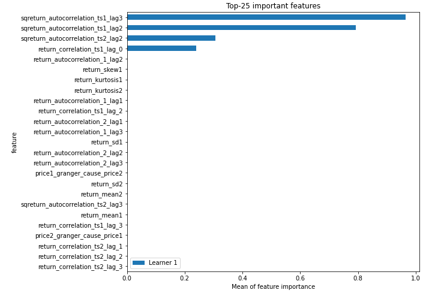
## Confusion Matrix

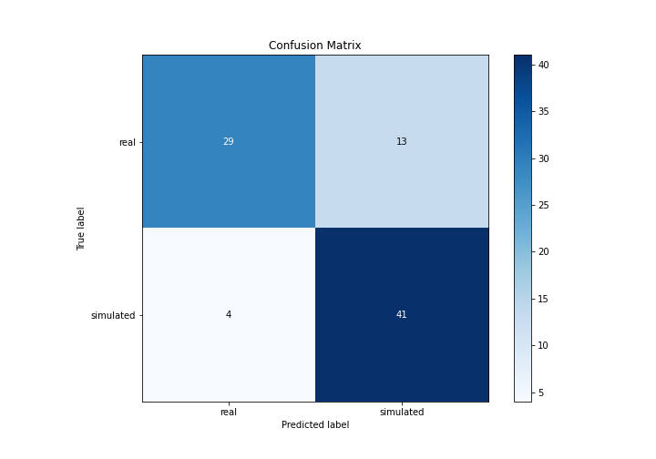

## Normalized Confusion Matrix

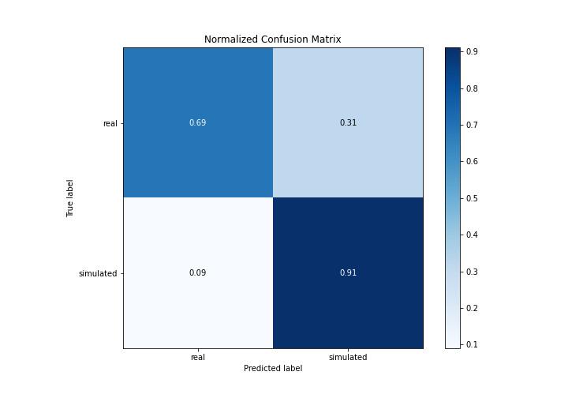

## ROC Curve

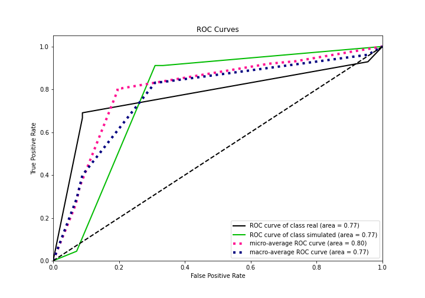

## Kolmogorov-Smirnov Statistic

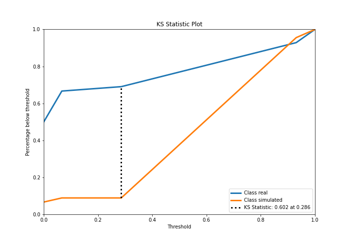

## Precision-Recall Curve

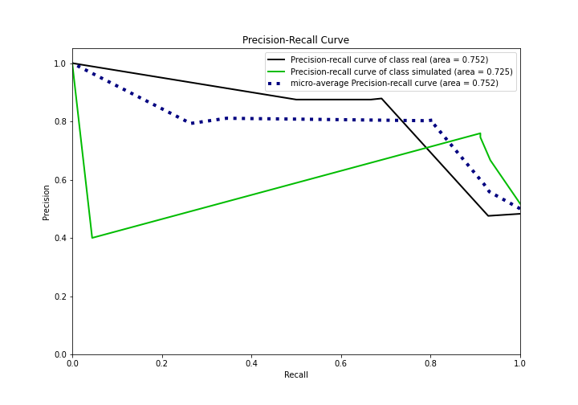

## Calibration Curve

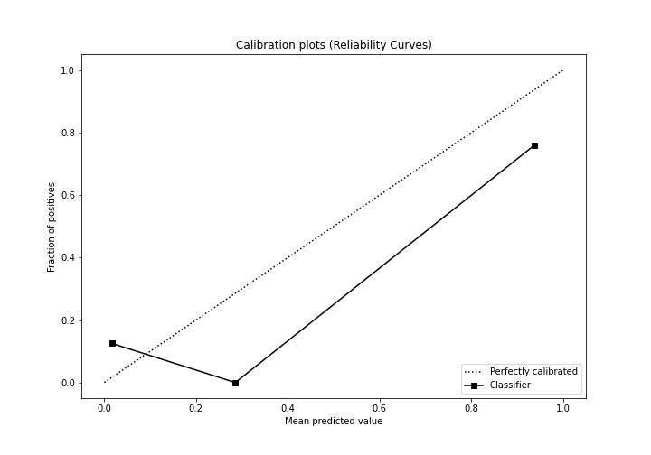

## Cumulative Gains Curve

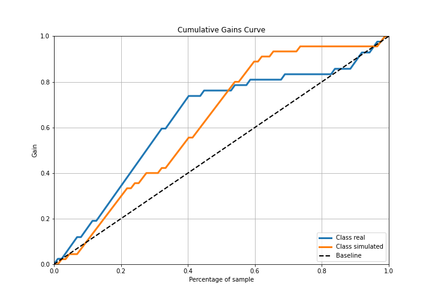

## Lift Curve

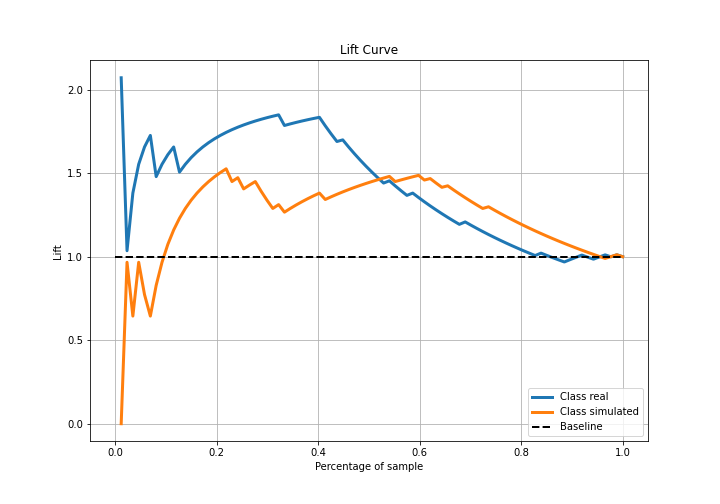

## SHAP Importance
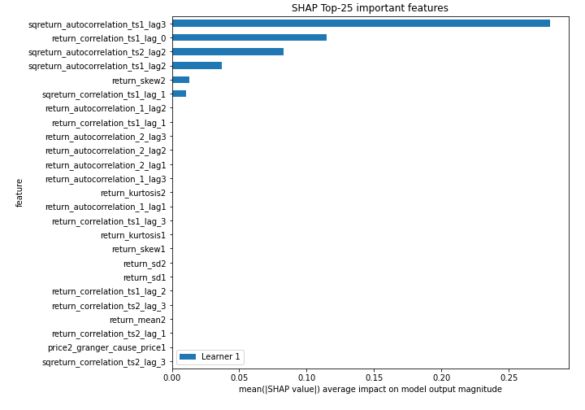

## SHAP Dependence plots

### Dependence (Fold 1)
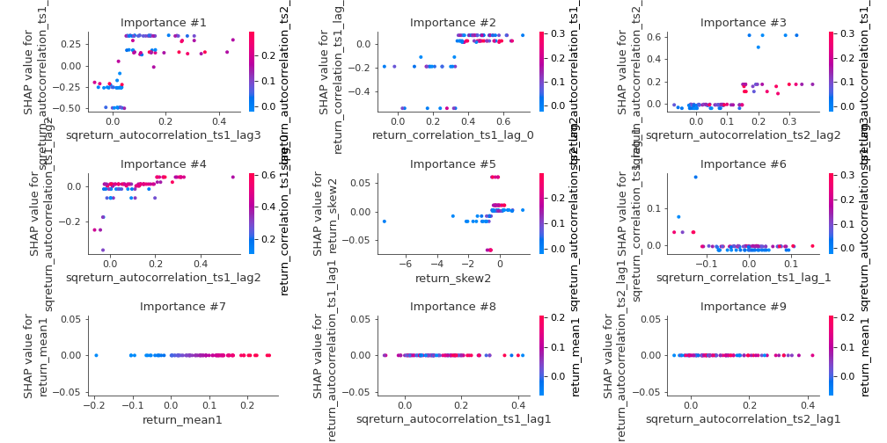

## SHAP Decision plots

### Top-10 Worst decisions for class 0 (Fold 1)
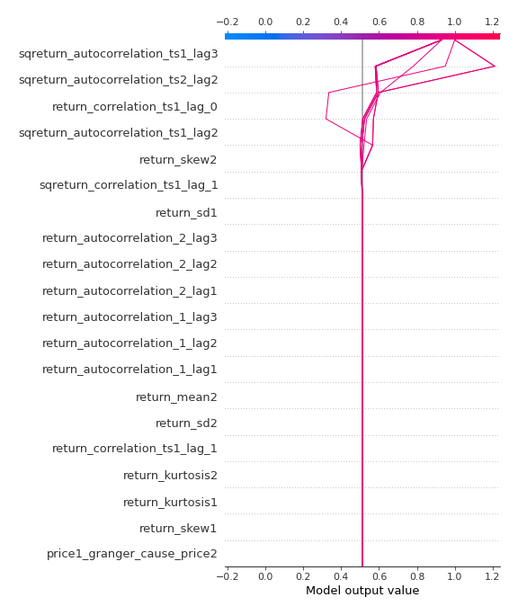
### Top-10 Best decisions for class 0 (Fold 1)
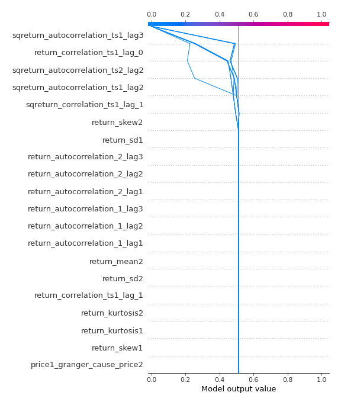
### Top-10 Worst decisions for class 1 (Fold 1)
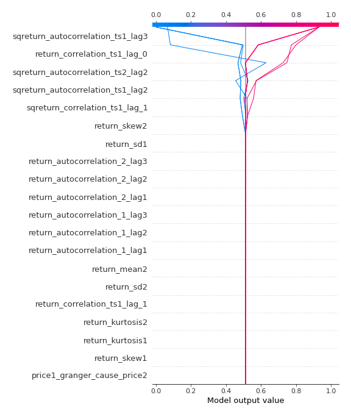
### Top-10 Best decisions for class 1 (Fold 1)
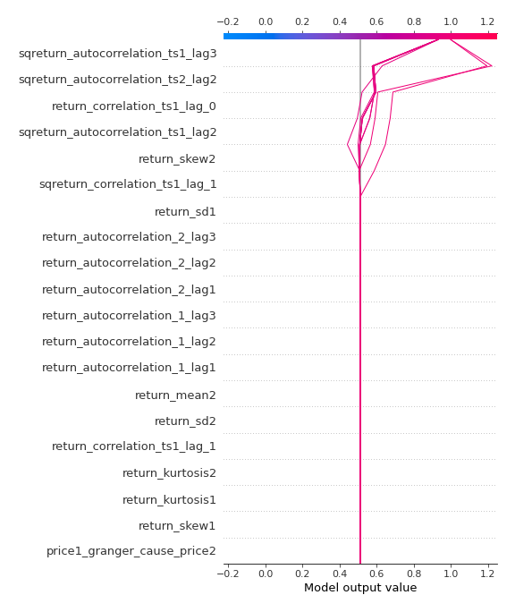

[<< Go back](../README.md)
