# Exploratory Data Analysis

[<< Go back](../README.md)
## Feature : target
- **Feature type** : categorical
- **Missing** : 0.0%
- **Unique** : 2
- **Count** :347
- **Unique** :2
- **Top** :simulated
- **Freq** :178

## Feature : return_mean1
- **Feature type** : continous
- **Missing** : 0.0%
- **Unique** : 347
- **Count** :347.0
- **Mean** :0.06594015022760821
- **Std** :0.10463121023233189
- **Min** :-0.23482450846197694
- **25%th Percentile** : 0.0027520038527032295
- **50%th Percentile** : 0.08130637296395041
- **75%th Percentile** : 0.13941479410191887
- **Max** :0.3602793017097547

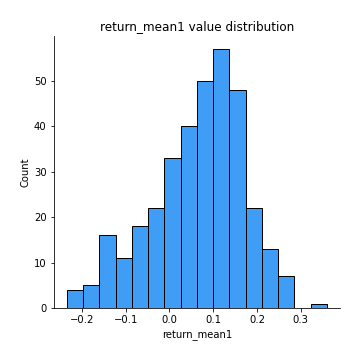
## Feature : return_mean2
- **Feature type** : continous
- **Missing** : 0.0%
- **Unique** : 347
- **Count** :347.0
- **Mean** :0.05267732654726273
- **Std** :0.1038232809735173
- **Min** :-0.3393917268522109
- **25%th Percentile** : -0.002251156525292242
- **50%th Percentile** : 0.056815642417235065
- **75%th Percentile** : 0.11474920419673151
- **Max** :0.6801605239983173

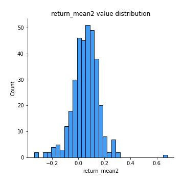
## Feature : return_sd1
- **Feature type** : continous
- **Missing** : 0.0%
- **Unique** : 347
- **Count** :347.0
- **Mean** :1.5169609279016785
- **Std** :0.4710051309934281
- **Min** :0.3229891541307405
- **25%th Percentile** : 1.2081207570372265
- **50%th Percentile** : 1.4596749713677757
- **75%th Percentile** : 1.7639850367918526
- **Max** :3.332494027875222

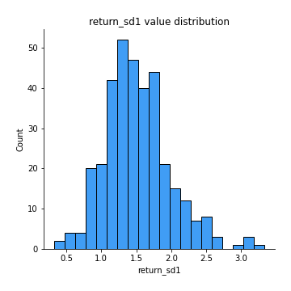
## Feature : return_sd2
- **Feature type** : continous
- **Missing** : 0.0%
- **Unique** : 347
- **Count** :347.0
- **Mean** :1.7112136608227266
- **Std** :0.4999818837614693
- **Min** :0.4999455489752719
- **25%th Percentile** : 1.3902331194475521
- **50%th Percentile** : 1.6508192369719439
- **75%th Percentile** : 1.9835696223698815
- **Max** :4.59233049161685

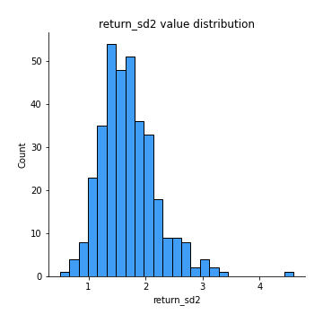
## Feature : return_skew1
- **Feature type** : continous
- **Missing** : 0.0%
- **Unique** : 347
- **Count** :347.0
- **Mean** :-0.35903073226396043
- **Std** :0.7365573856239895
- **Min** :-4.239645236578449
- **25%th Percentile** : -0.569480211170641
- **50%th Percentile** : -0.3308404696112431
- **75%th Percentile** : -0.08659012825051435
- **Max** :2.351757728252051

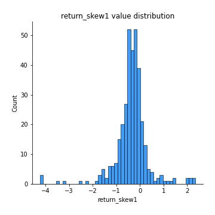
## Feature : return_skew2
- **Feature type** : continous
- **Missing** : 0.0%
- **Unique** : 347
- **Count** :347.0
- **Mean** :-0.4141066528262889
- **Std** :1.0622489093074952
- **Min** :-7.3762354994385335
- **25%th Percentile** : -0.6079849026102497
- **50%th Percentile** : -0.28914475681289475
- **75%th Percentile** : 0.0022229383972979092
- **Max** :4.1920266082732045

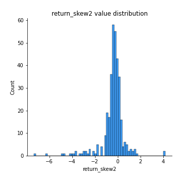
## Feature : return_kurtosis1
- **Feature type** : continous
- **Missing** : 0.0%
- **Unique** : 347
- **Count** :347.0
- **Mean** :3.7284063417211306
- **Std** :5.339261455000338
- **Min** :0.26326278609896425
- **25%th Percentile** : 1.3119074453304402
- **50%th Percentile** : 2.0199827152687075
- **75%th Percentile** : 3.7162913805080233
- **Max** :40.485294874464934

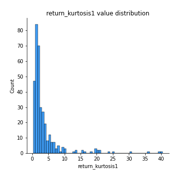
## Feature : return_kurtosis2
- **Feature type** : continous
- **Missing** : 0.0%
- **Unique** : 347
- **Count** :347.0
- **Mean** :5.2982554853414605
- **Std** :9.703796428421764
- **Min** :-0.23872662051874727
- **25%th Percentile** : 1.2816150624532048
- **50%th Percentile** : 2.2163047109878042
- **75%th Percentile** : 4.546202049687523
- **Max** :94.01659180149953

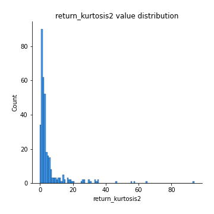
## Feature : return_autocorrelation_1_lag1
- **Feature type** : continous
- **Missing** : 0.0%
- **Unique** : 347
- **Count** :347.0
- **Mean** :-0.004806305325301035
- **Std** :0.07616939267910797
- **Min** :-0.2110198016529991
- **25%th Percentile** : -0.05784591034930067
- **50%th Percentile** : -0.0015590454299117332
- **75%th Percentile** : 0.043060308513632226
- **Max** :0.2668442218983721

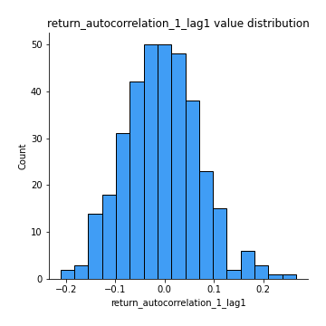
## Feature : return_autocorrelation_1_lag2
- **Feature type** : continous
- **Missing** : 0.0%
- **Unique** : 347
- **Count** :347.0
- **Mean** :-0.007200285513998005
- **Std** :0.08241913534741907
- **Min** :-0.2923786280675801
- **25%th Percentile** : -0.05812921634317662
- **50%th Percentile** : -0.006513754155405519
- **75%th Percentile** : 0.04527227065361242
- **Max** :0.2926555982956458

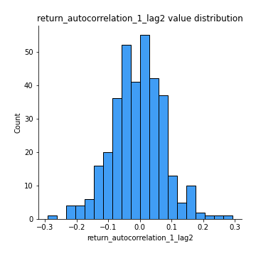
## Feature : return_autocorrelation_1_lag3
- **Feature type** : continous
- **Missing** : 0.0%
- **Unique** : 347
- **Count** :347.0
- **Mean** :0.008313176128336782
- **Std** :0.0728755291076726
- **Min** :-0.23007915029948858
- **25%th Percentile** : -0.04046348517209579
- **50%th Percentile** : 0.013681953387976427
- **75%th Percentile** : 0.05610156180972656
- **Max** :0.21720014513726638

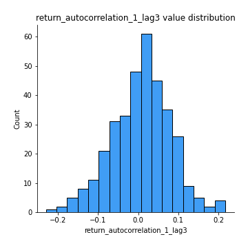
## Feature : return_autocorrelation_2_lag1
- **Feature type** : continous
- **Missing** : 0.0%
- **Unique** : 347
- **Count** :347.0
- **Mean** :-0.003822354292115328
- **Std** :0.07441270637897765
- **Min** :-0.2093956539058918
- **25%th Percentile** : -0.05554188152870357
- **50%th Percentile** : -0.004562572311699981
- **75%th Percentile** : 0.04962049958139919
- **Max** :0.20769511208728028

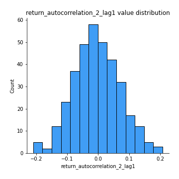
## Feature : return_autocorrelation_2_lag2
- **Feature type** : continous
- **Missing** : 0.0%
- **Unique** : 347
- **Count** :347.0
- **Mean** :-0.01184013843675165
- **Std** :0.07814805440623912
- **Min** :-0.26007222001920227
- **25%th Percentile** : -0.06569213807213753
- **50%th Percentile** : -0.013733601265606927
- **75%th Percentile** : 0.03527999716742067
- **Max** :0.28638976059134325

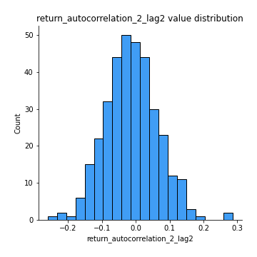
## Feature : return_autocorrelation_2_lag3
- **Feature type** : continous
- **Missing** : 0.0%
- **Unique** : 347
- **Count** :347.0
- **Mean** :-0.0009461744250789572
- **Std** :0.06357191472807484
- **Min** :-0.18807125258370663
- **25%th Percentile** : -0.04177838271449063
- **50%th Percentile** : 0.0002155391086813539
- **75%th Percentile** : 0.04387654502542106
- **Max** :0.20205753622966244

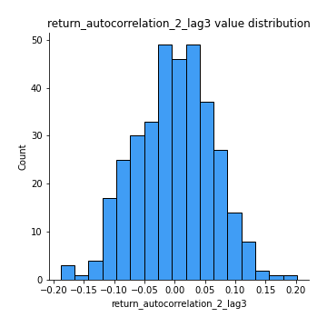
## Feature : return_correlation_ts1_lag_0
- **Feature type** : continous
- **Missing** : 0.0%
- **Unique** : 347
- **Count** :347.0
- **Mean** :0.4048682133033926
- **Std** :0.15756650879249695
- **Min** :-0.10256711281206837
- **25%th Percentile** : 0.3297543715114788
- **50%th Percentile** : 0.4380570163325529
- **75%th Percentile** : 0.5068478205033804
- **Max** :0.9937227277077512

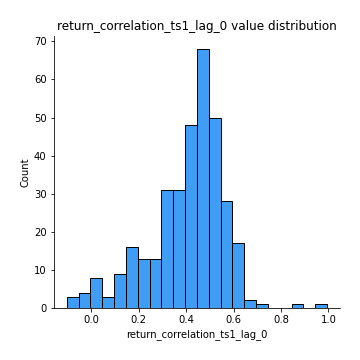
## Feature : return_correlation_ts1_lag_1
- **Feature type** : continous
- **Missing** : 0.0%
- **Unique** : 347
- **Count** :347.0
- **Mean** :-0.004015052203773277
- **Std** :0.0679415794203177
- **Min** :-0.18856827637524448
- **25%th Percentile** : -0.051198829820375547
- **50%th Percentile** : -0.0008098593223397935
- **75%th Percentile** : 0.039782234270093864
- **Max** :0.19254726557342539

## Feature : return_correlation_ts1_lag_2
- **Feature type** : continous
- **Missing** : 0.0%
- **Unique** : 347
- **Count** :347.0
- **Mean** :-0.008469371959899864
- **Std** :0.07282565326940287
- **Min** :-0.31881758292893636
- **25%th Percentile** : -0.051145917776811003
- **50%th Percentile** : -0.00957337399330707
- **75%th Percentile** : 0.03841596502116444
- **Max** :0.2033093813968284

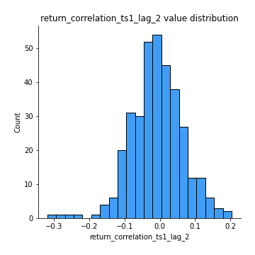
## Feature : return_correlation_ts1_lag_3
- **Feature type** : continous
- **Missing** : 0.0%
- **Unique** : 347
- **Count** :347.0
- **Mean** :0.002474017193626531
- **Std** :0.06954107633199455
- **Min** :-0.21147540839842804
- **25%th Percentile** : -0.038947423718854596
- **50%th Percentile** : 0.010244798254426658
- **75%th Percentile** : 0.04944223828532508
- **Max** :0.23808054096877584

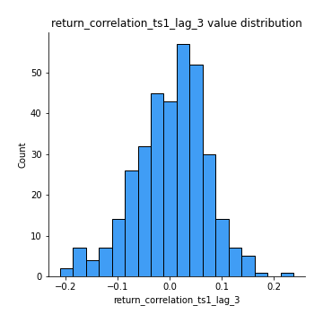
## Feature : return_correlation_ts2_lag_1
- **Feature type** : continous
- **Missing** : 0.0%
- **Unique** : 347
- **Count** :347.0
- **Mean** :0.0025434605947072053
- **Std** :0.07844215803222171
- **Min** :-0.22065549847076374
- **25%th Percentile** : -0.0516244873602236
- **50%th Percentile** : 0.008547430946806716
- **75%th Percentile** : 0.062226191943408296
- **Max** :0.3425036902091001

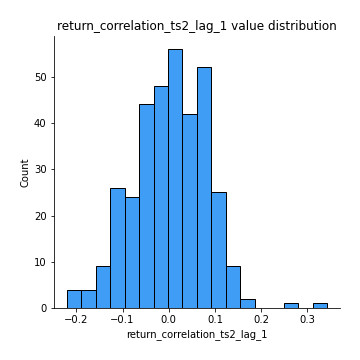
## Feature : return_correlation_ts2_lag_2
- **Feature type** : continous
- **Missing** : 0.0%
- **Unique** : 347
- **Count** :347.0
- **Mean** :-0.003712050713757348
- **Std** :0.07961422463403495
- **Min** :-0.2279927153548214
- **25%th Percentile** : -0.05391165289896151
- **50%th Percentile** : -0.0016356531139401747
- **75%th Percentile** : 0.04952855506310008
- **Max** :0.2087976350468132

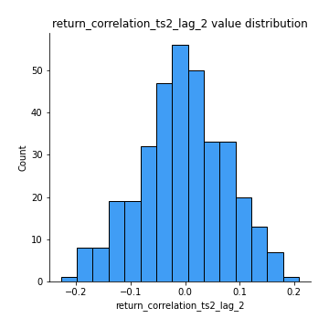
## Feature : return_correlation_ts2_lag_3
- **Feature type** : continous
- **Missing** : 0.0%
- **Unique** : 347
- **Count** :347.0
- **Mean** :0.007043920833908604
- **Std** :0.06720746555037642
- **Min** :-0.21512643992416172
- **25%th Percentile** : -0.038561254552532925
- **50%th Percentile** : 0.009696554156235352
- **75%th Percentile** : 0.05346290733711445
- **Max** :0.18815859879455182

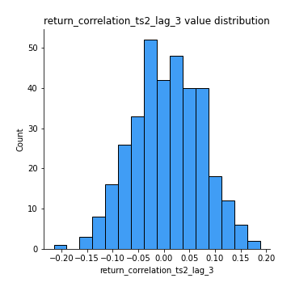
## Feature : sqreturn_autocorrelation_ts1_lag1
- **Feature type** : continous
- **Missing** : 0.0%
- **Unique** : 347
- **Count** :347.0
- **Mean** :0.11840358734124998
- **Std** :0.10331955786986606
- **Min** :-0.07115358608636999
- **25%th Percentile** : 0.03254154125860594
- **50%th Percentile** : 0.10672636897461583
- **75%th Percentile** : 0.18254839330703465
- **Max** :0.47775273933826884

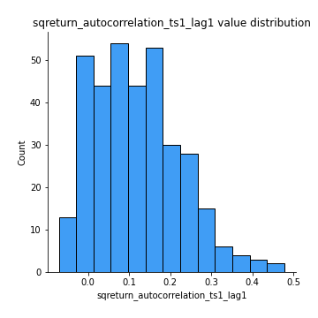
## Feature : sqreturn_autocorrelation_ts1_lag2
- **Feature type** : continous
- **Missing** : 0.0%
- **Unique** : 347
- **Count** :347.0
- **Mean** :0.10584381465325261
- **Std** :0.10042495308086646
- **Min** :-0.06594883862904495
- **25%th Percentile** : 0.02040373389343946
- **50%th Percentile** : 0.09515545112664643
- **75%th Percentile** : 0.1687618260591554
- **Max** :0.540529806490309

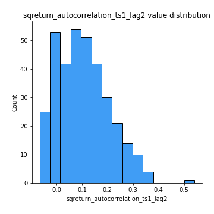
## Feature : sqreturn_autocorrelation_ts1_lag3
- **Feature type** : continous
- **Missing** : 0.0%
- **Unique** : 347
- **Count** :347.0
- **Mean** :0.0954308680427853
- **Std** :0.10439192558541203
- **Min** :-0.07624495748065484
- **25%th Percentile** : 0.017795210573347174
- **50%th Percentile** : 0.0763500027213934
- **75%th Percentile** : 0.1537463180796972
- **Max** :0.46097601304518226

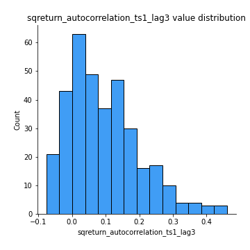
## Feature : sqreturn_autocorrelation_ts2_lag1
- **Feature type** : continous
- **Missing** : 0.0%
- **Unique** : 347
- **Count** :347.0
- **Mean** :0.10288188999378806
- **Std** :0.10516090071356456
- **Min** :-0.07808490782609163
- **25%th Percentile** : 0.019487654867266453
- **50%th Percentile** : 0.08332453974505154
- **75%th Percentile** : 0.15902803869699705
- **Max** :0.572383551996907

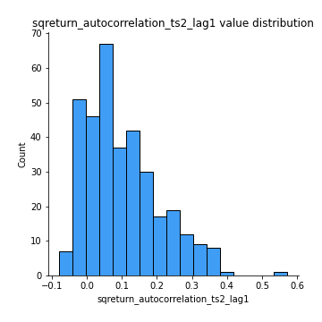
## Feature : sqreturn_autocorrelation_ts2_lag2
- **Feature type** : continous
- **Missing** : 0.0%
- **Unique** : 347
- **Count** :347.0
- **Mean** :0.08873427614625715
- **Std** :0.10471913495731157
- **Min** :-0.10054631197559977
- **25%th Percentile** : 0.002400512864294345
- **50%th Percentile** : 0.07268216062449338
- **75%th Percentile** : 0.15461934158001658
- **Max** :0.6850573891704962

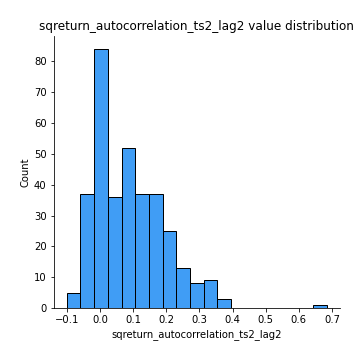
## Feature : sqreturn_autocorrelation_ts2_lag3
- **Feature type** : continous
- **Missing** : 0.0%
- **Unique** : 347
- **Count** :347.0
- **Mean** :0.0786943390899
- **Std** :0.10326735108658557
- **Min** :-0.08011187436939253
- **25%th Percentile** : -0.0031429517703769347
- **50%th Percentile** : 0.056665849303399365
- **75%th Percentile** : 0.13552392420075346
- **Max** :0.6347062645642155

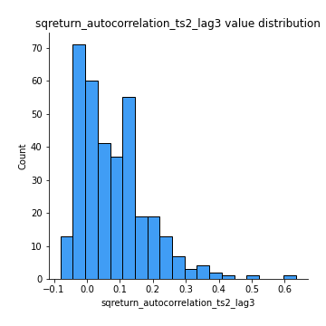
## Feature : sqreturn_correlation_ts1_lag_0
- **Feature type** : continous
- **Missing** : 0.0%
- **Unique** : 347
- **Count** :347.0
- **Mean** :0.4048682133033926
- **Std** :0.15756650879249695
- **Min** :-0.10256711281206837
- **25%th Percentile** : 0.3297543715114788
- **50%th Percentile** : 0.4380570163325529
- **75%th Percentile** : 0.5068478205033804
- **Max** :0.9937227277077512

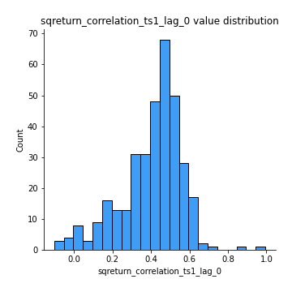
## Feature : sqreturn_correlation_ts1_lag_1
- **Feature type** : continous
- **Missing** : 0.0%
- **Unique** : 347
- **Count** :347.0
- **Mean** :-0.004015052203773277
- **Std** :0.0679415794203177
- **Min** :-0.18856827637524448
- **25%th Percentile** : -0.051198829820375547
- **50%th Percentile** : -0.0008098593223397935
- **75%th Percentile** : 0.039782234270093864
- **Max** :0.19254726557342539

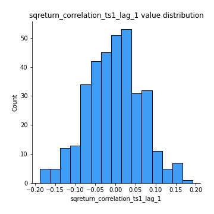
## Feature : sqreturn_correlation_ts1_lag_2
- **Feature type** : continous
- **Missing** : 0.0%
- **Unique** : 347
- **Count** :347.0
- **Mean** :-0.008469371959899864
- **Std** :0.07282565326940287
- **Min** :-0.31881758292893636
- **25%th Percentile** : -0.051145917776811003
- **50%th Percentile** : -0.00957337399330707
- **75%th Percentile** : 0.03841596502116444
- **Max** :0.2033093813968284

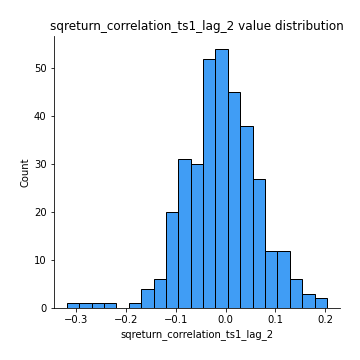
## Feature : sqreturn_correlation_ts1_lag_3
- **Feature type** : continous
- **Missing** : 0.0%
- **Unique** : 347
- **Count** :347.0
- **Mean** :0.002474017193626531
- **Std** :0.06954107633199455
- **Min** :-0.21147540839842804
- **25%th Percentile** : -0.038947423718854596
- **50%th Percentile** : 0.010244798254426658
- **75%th Percentile** : 0.04944223828532508
- **Max** :0.23808054096877584

## Feature : sqreturn_correlation_ts2_lag_1
- **Feature type** : continous
- **Missing** : 0.0%
- **Unique** : 347
- **Count** :347.0
- **Mean** :0.0025434605947072053
- **Std** :0.07844215803222171
- **Min** :-0.22065549847076374
- **25%th Percentile** : -0.0516244873602236
- **50%th Percentile** : 0.008547430946806716
- **75%th Percentile** : 0.062226191943408296
- **Max** :0.3425036902091001

## Feature : sqreturn_correlation_ts2_lag_2
- **Feature type** : continous
- **Missing** : 0.0%
- **Unique** : 347
- **Count** :347.0
- **Mean** :-0.003712050713757348
- **Std** :0.07961422463403495
- **Min** :-0.2279927153548214
- **25%th Percentile** : -0.05391165289896151
- **50%th Percentile** : -0.0016356531139401747
- **75%th Percentile** : 0.04952855506310008
- **Max** :0.2087976350468132

## Feature : sqreturn_correlation_ts2_lag_3
- **Feature type** : continous
- **Missing** : 0.0%
- **Unique** : 347
- **Count** :347.0
- **Mean** :0.007043920833908604
- **Std** :0.06720746555037642
- **Min** :-0.21512643992416172
- **25%th Percentile** : -0.038561254552532925
- **50%th Percentile** : 0.009696554156235352
- **75%th Percentile** : 0.05346290733711445
- **Max** :0.18815859879455182

## Feature : price2_granger_cause_price1
- **Feature type** : continous
- **Missing** : 0.0%
- **Unique** : 347
- **Count** :347.0
- **Mean** :0.26908823082472555
- **Std** :0.29373584633387967
- **Min** :2.4312048970873696e-09
- **25%th Percentile** : 0.01894326082788329
- **50%th Percentile** : 0.14633433415012811
- **75%th Percentile** : 0.445785967553401
- **Max** :0.9936394599549504

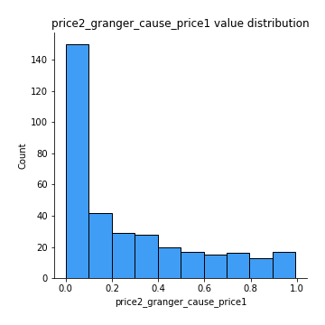
## Feature : price1_granger_cause_price2
- **Feature type** : continous
- **Missing** : 0.0%
- **Unique** : 347
- **Count** :347.0
- **Mean** :0.2785187701374501
- **Std** :0.2793834105753547
- **Min** :1.2012269232170316e-11
- **25%th Percentile** : 0.03744556161256152
- **50%th Percentile** : 0.1735464845474365
- **75%th Percentile** : 0.4658481626476024
- **Max** :0.9981695787337505

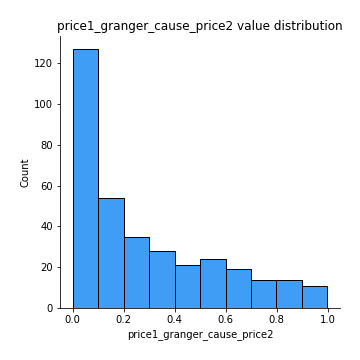

[<< Go back](../README.md)
