# Summary of 3_Linear

[<< Go back](../README.md)

## Logistic Regression (Linear)
- **n_jobs**: -1
- **explain_level**: 2

## Validation
 - **validation_type**: split
 - **train_ratio**: 0.75
 - **shuffle**: True
 - **stratify**: True

## Optimized metric
accuracy

## Training time

6.2 seconds

## Metric details
|           |    score |     threshold |
|:----------|---------:|--------------:|
| logloss   | 0.134579 | nan           |
| auc       | 1        | nan           |
| f1        | 1        |   0.727147    |
| accuracy  | 1        |   0.727147    |
| precision | 1        |   0.727147    |
| recall    | 1        |   2.56827e-16 |
| mcc       | 1        |   0.727147    |

## Confusion matrix (at threshold=0.727147)
|                      |   Predicted as real |   Predicted as simulated |
|:---------------------|--------------------:|-------------------------:|
| Labeled as real      |                  44 |                        0 |
| Labeled as simulated |                   0 |                       43 |

## Learning curves
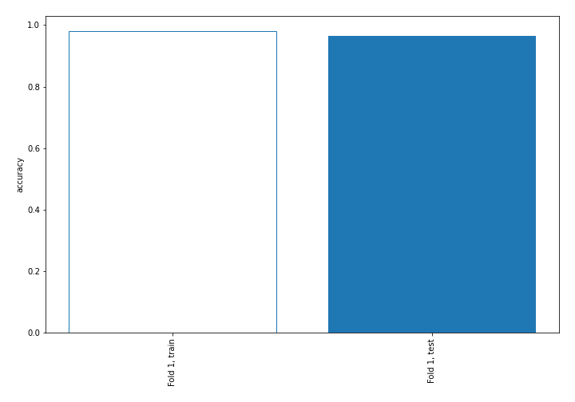

## Coefficients
| feature                           |   Learner_1 |
|:----------------------------------|------------:|
| return_skew1                      |  1.59251    |
| return_skew2                      |  1.00954    |
| return_autocorrelation_1_lag2     |  0.699713   |
| return_autocorrelation_1_lag1     |  0.463843   |
| sqreturn_correlation_ts1_lag_2    |  0.397192   |
| return_correlation_ts1_lag_2      |  0.397192   |
| sqreturn_correlation_ts1_lag_1    |  0.340658   |
| return_correlation_ts1_lag_1      |  0.340658   |
| sqreturn_correlation_ts2_lag_1    |  0.31702    |
| return_correlation_ts2_lag_1      |  0.31702    |
| sqreturn_correlation_ts2_lag_2    |  0.292526   |
| return_correlation_ts2_lag_2      |  0.292526   |
| return_autocorrelation_2_lag2     |  0.269085   |
| return_autocorrelation_2_lag1     |  0.229294   |
| return_correlation_ts2_lag_3      |  0.13083    |
| sqreturn_correlation_ts2_lag_3    |  0.13083    |
| sqreturn_correlation_ts1_lag_3    |  0.0630687  |
| return_correlation_ts1_lag_3      |  0.0630687  |
| return_autocorrelation_1_lag3     |  0.0342687  |
| return_autocorrelation_2_lag3     |  0.00732586 |
| return_sd2                        | -0.0310006  |
| return_correlation_ts1_lag_0      | -0.0514076  |
| sqreturn_correlation_ts1_lag_0    | -0.0514076  |
| return_mean1                      | -0.21674    |
| price1_granger_cause_price2       | -0.297233   |
| price2_granger_cause_price1       | -0.303277   |
| sqreturn_autocorrelation_ts1_lag3 | -0.409487   |
| sqreturn_autocorrelation_ts2_lag3 | -0.455642   |
| return_sd1                        | -0.471695   |
| sqreturn_autocorrelation_ts1_lag2 | -0.649432   |
| sqreturn_autocorrelation_ts2_lag2 | -0.71653    |
| sqreturn_autocorrelation_ts2_lag1 | -0.812686   |
| return_mean2                      | -1.02043    |
| sqreturn_autocorrelation_ts1_lag1 | -1.10786    |
| intercept                         | -1.48391    |
| return_kurtosis2                  | -3.45059    |
| return_kurtosis1                  | -4.14926    |

## Permutation-based Importance
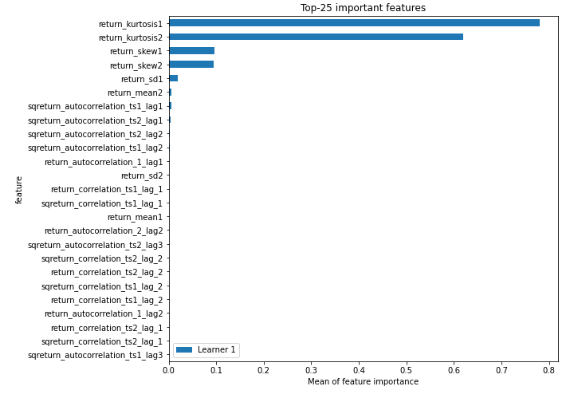
## Confusion Matrix

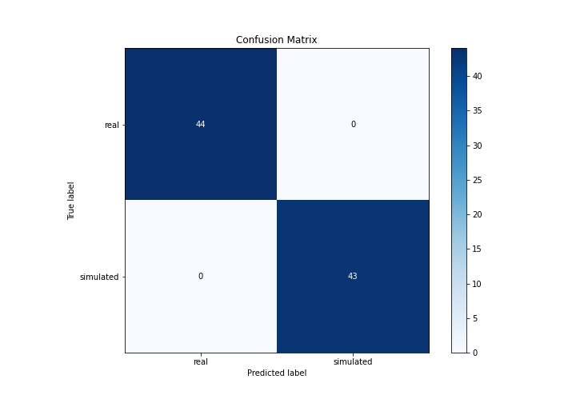

## Normalized Confusion Matrix

## ROC Curve

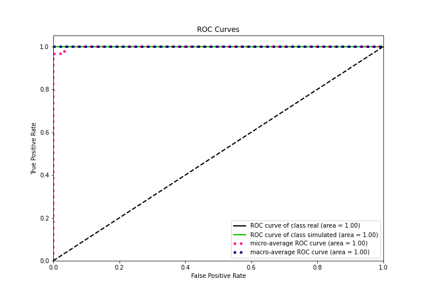

## Kolmogorov-Smirnov Statistic

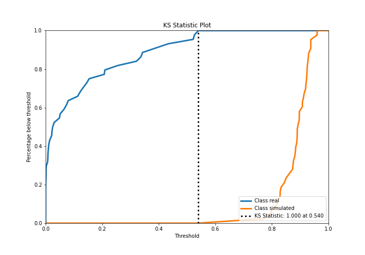

## Precision-Recall Curve

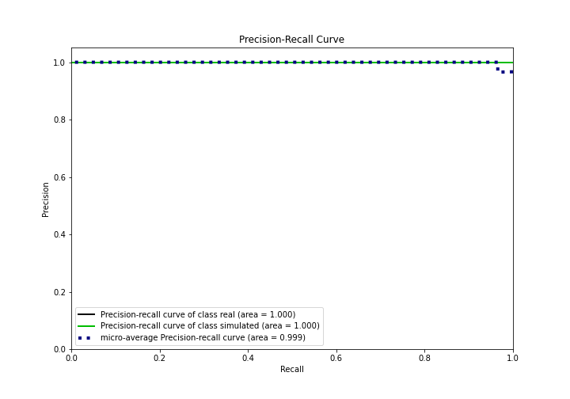

## Calibration Curve

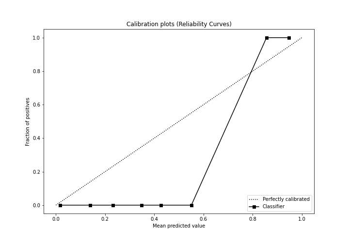

## Cumulative Gains Curve

## Lift Curve

## SHAP Importance

## SHAP Dependence plots

### Dependence (Fold 1)
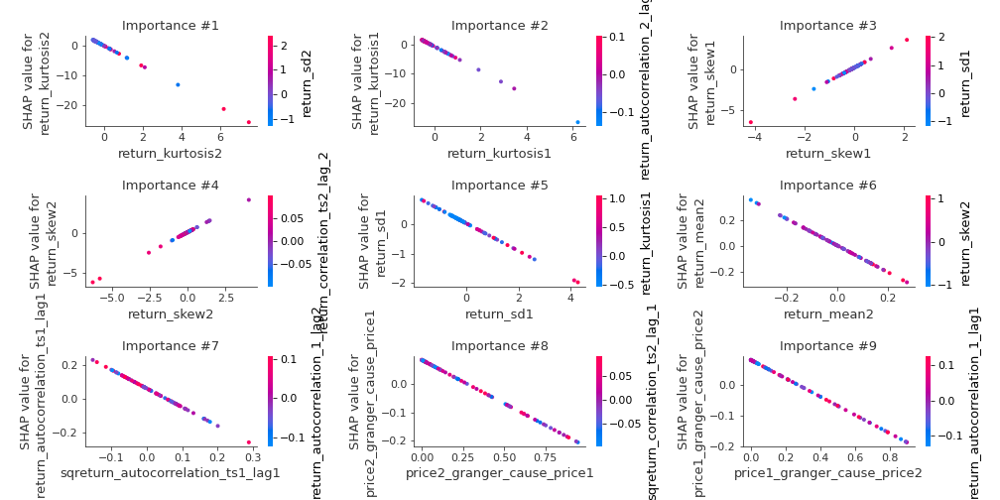

## SHAP Decision plots

### Top-10 Worst decisions for class 0 (Fold 1)

### Top-10 Best decisions for class 0 (Fold 1)
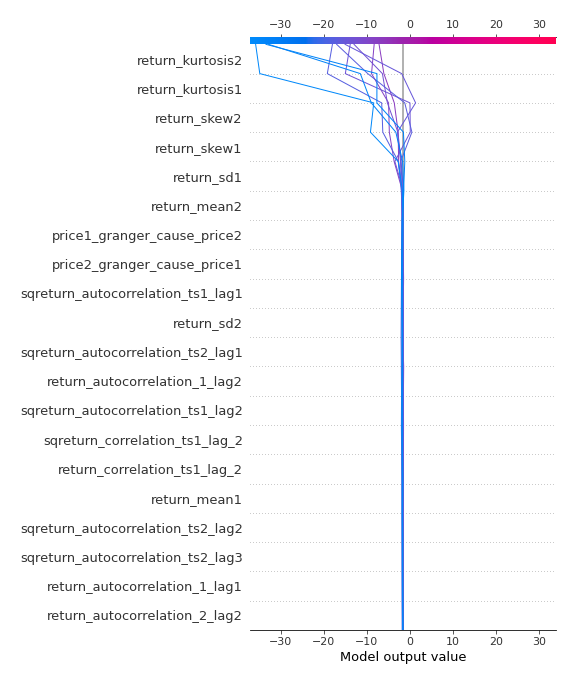
### Top-10 Worst decisions for class 1 (Fold 1)
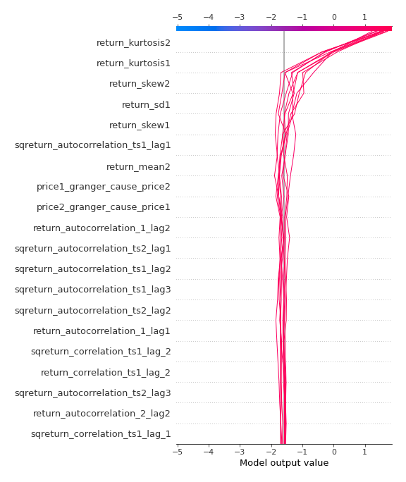
### Top-10 Best decisions for class 1 (Fold 1)
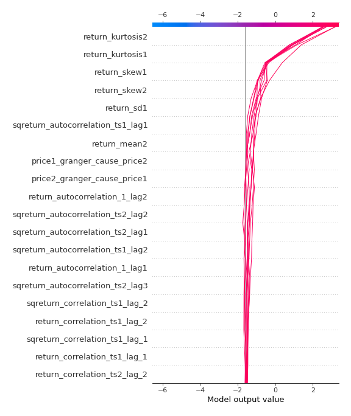

[<< Go back](../README.md)
