# Exploratory Data Analysis

[<< Go back](../README.md)
## Feature : target
- **Feature type** : categorical
- **Missing** : 0.0%
- **Unique** : 2
- **Count** :347
- **Unique** :2
- **Top** :real
- **Freq** :176

## Feature : return_mean1
- **Feature type** : continous
- **Missing** : 0.0%
- **Unique** : 347
- **Count** :347.0
- **Mean** :0.02927791094989044
- **Std** :0.11342675176918228
- **Min** :-0.3739620579312554
- **25%th Percentile** : -0.0369249376325672
- **50%th Percentile** : 0.03811415868198544
- **75%th Percentile** : 0.10619937514808084
- **Max** :0.3602793017097547

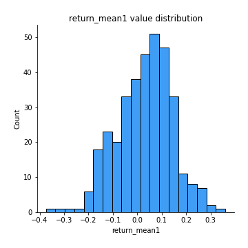
## Feature : return_mean2
- **Feature type** : continous
- **Missing** : 0.0%
- **Unique** : 347
- **Count** :347.0
- **Mean** :-0.013500216213550319
- **Std** :0.13139084851445323
- **Min** :-0.5494894586780561
- **25%th Percentile** : -0.0961555552357488
- **50%th Percentile** : -0.014066100255757875
- **75%th Percentile** : 0.07031440430418245
- **Max** :0.6801605239983173

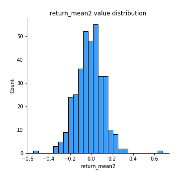
## Feature : return_sd1
- **Feature type** : continous
- **Missing** : 0.0%
- **Unique** : 347
- **Count** :347.0
- **Mean** :1.5628593345924222
- **Std** :0.3816933082774282
- **Min** :0.8733078831717243
- **25%th Percentile** : 1.3968827737511396
- **50%th Percentile** : 1.4627585508158472
- **75%th Percentile** : 1.6184556900085996
- **Max** :3.332494027875222

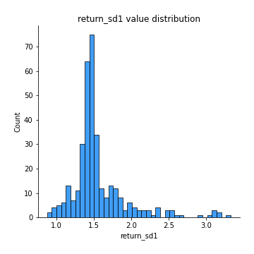
## Feature : return_sd2
- **Feature type** : continous
- **Missing** : 0.0%
- **Unique** : 347
- **Count** :347.0
- **Mean** :1.6558232444639907
- **Std** :0.4182705010742206
- **Min** :0.8198779632289204
- **25%th Percentile** : 1.490579927380359
- **50%th Percentile** : 1.578842460663459
- **75%th Percentile** : 1.6721594866736975
- **Max** :4.59233049161685

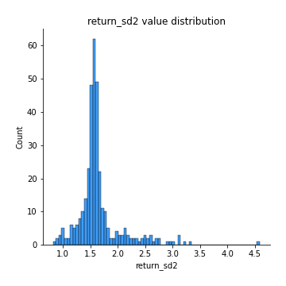
## Feature : return_skew1
- **Feature type** : continous
- **Missing** : 0.0%
- **Unique** : 347
- **Count** :347.0
- **Mean** :-0.1687040950619489
- **Std** :0.6989427730146628
- **Min** :-4.239645236578449
- **25%th Percentile** : -0.33567036117486626
- **50%th Percentile** : -0.06357785043380655
- **75%th Percentile** : 0.0890240558888028
- **Max** :2.1285977762978217

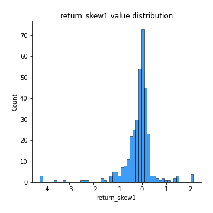
## Feature : return_skew2
- **Feature type** : continous
- **Missing** : 0.0%
- **Unique** : 347
- **Count** :347.0
- **Mean** :-0.23108721993679973
- **Std** :0.9668446618935352
- **Min** :-6.262899561987459
- **25%th Percentile** : -0.29998933191357013
- **50%th Percentile** : -0.04463402097701672
- **75%th Percentile** : 0.1292420421906706
- **Max** :4.0310261345618

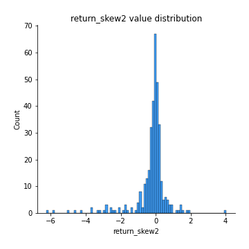
## Feature : return_kurtosis1
- **Feature type** : continous
- **Missing** : 0.0%
- **Unique** : 347
- **Count** :347.0
- **Mean** :2.4699110389793995
- **Std** :5.339818496466297
- **Min** :-0.6488325240526098
- **25%th Percentile** : -0.06084105443503729
- **50%th Percentile** : 0.6396650237769328
- **75%th Percentile** : 2.678812472527533
- **Max** :40.485294874464934

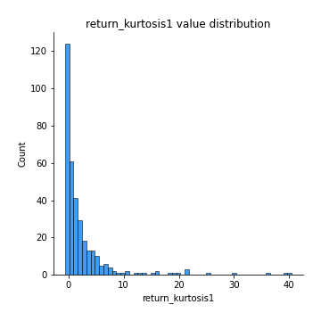
## Feature : return_kurtosis2
- **Feature type** : continous
- **Missing** : 0.0%
- **Unique** : 347
- **Count** :347.0
- **Mean** :3.8897213231650447
- **Std** :8.704685429466196
- **Min** :-0.7702300346629034
- **25%th Percentile** : -0.007178742484130085
- **50%th Percentile** : 0.6747180068769385
- **75%th Percentile** : 3.188619372175843
- **Max** :64.99818629655663

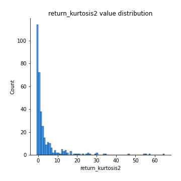
## Feature : return_autocorrelation_1_lag1
- **Feature type** : continous
- **Missing** : 0.0%
- **Unique** : 347
- **Count** :347.0
- **Mean** :-0.0004824745845634196
- **Std** :0.06957950277812244
- **Min** :-0.2110198016529991
- **25%th Percentile** : -0.04482748029316218
- **50%th Percentile** : 0.0016758044485925057
- **75%th Percentile** : 0.04437246980646364
- **Max** :0.24709421506182525

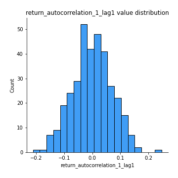
## Feature : return_autocorrelation_1_lag2
- **Feature type** : continous
- **Missing** : 0.0%
- **Unique** : 347
- **Count** :347.0
- **Mean** :-0.002677485477449035
- **Std** :0.06850265712872898
- **Min** :-0.15455782934121354
- **25%th Percentile** : -0.04769181945041778
- **50%th Percentile** : -0.0034060581053329667
- **75%th Percentile** : 0.04527227065361242
- **Max** :0.21123611097039302

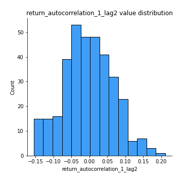
## Feature : return_autocorrelation_1_lag3
- **Feature type** : continous
- **Missing** : 0.0%
- **Unique** : 347
- **Count** :347.0
- **Mean** :0.014868471721588375
- **Std** :0.06428089740894373
- **Min** :-0.18159449599530486
- **25%th Percentile** : -0.021992187723164247
- **50%th Percentile** : 0.021433490961958294
- **75%th Percentile** : 0.056295811934240284
- **Max** :0.2215017366421156

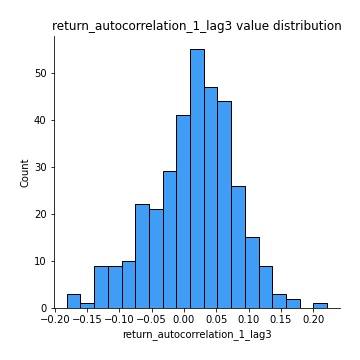
## Feature : return_autocorrelation_2_lag1
- **Feature type** : continous
- **Missing** : 0.0%
- **Unique** : 347
- **Count** :347.0
- **Mean** :0.004980988868241746
- **Std** :0.06451492883126865
- **Min** :-0.17778763204400128
- **25%th Percentile** : -0.03629385600227775
- **50%th Percentile** : 0.0027338558700057956
- **75%th Percentile** : 0.051061353701241596
- **Max** :0.2024676054184499

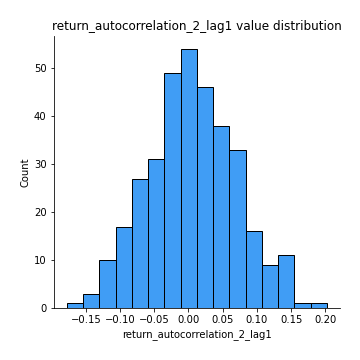
## Feature : return_autocorrelation_2_lag2
- **Feature type** : continous
- **Missing** : 0.0%
- **Unique** : 347
- **Count** :347.0
- **Mean** :0.0009082021871582547
- **Std** :0.06794326438803967
- **Min** :-0.1758721664122366
- **25%th Percentile** : -0.0435812180350279
- **50%th Percentile** : 0.0008260263761318355
- **75%th Percentile** : 0.04567002711571471
- **Max** :0.19042370919107313

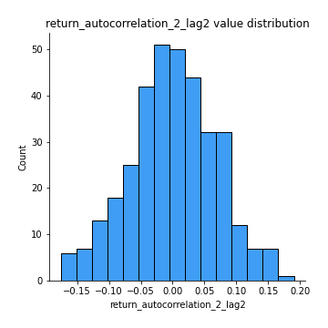
## Feature : return_autocorrelation_2_lag3
- **Feature type** : continous
- **Missing** : 0.0%
- **Unique** : 347
- **Count** :347.0
- **Mean** :0.014901132158378025
- **Std** :0.06203904504127681
- **Min** :-0.1798960840760737
- **25%th Percentile** : -0.022947330752371573
- **50%th Percentile** : 0.019285668983042435
- **75%th Percentile** : 0.05531229104879214
- **Max** :0.197042256781848

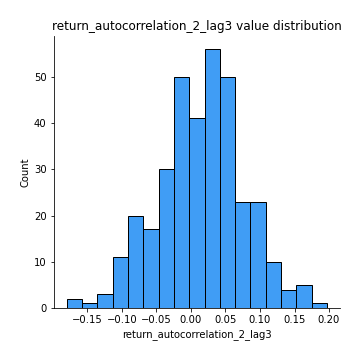
## Feature : return_correlation_ts1_lag_0
- **Feature type** : continous
- **Missing** : 0.0%
- **Unique** : 347
- **Count** :347.0
- **Mean** :0.33589563907389713
- **Std** :0.1321795335660705
- **Min** :-0.10256711281206837
- **25%th Percentile** : 0.2783275458567321
- **50%th Percentile** : 0.3455405997682833
- **75%th Percentile** : 0.3974601018749
- **Max** :0.9937227277077512

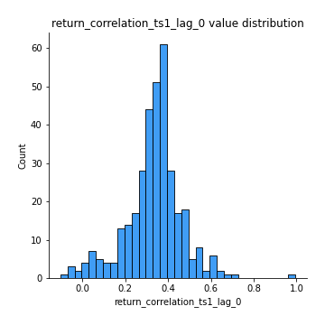
## Feature : return_correlation_ts1_lag_1
- **Feature type** : continous
- **Missing** : 0.0%
- **Unique** : 347
- **Count** :347.0
- **Mean** :0.003987613758715458
- **Std** :0.06376190296167901
- **Min** :-0.18856827637524448
- **25%th Percentile** : -0.04252785344843117
- **50%th Percentile** : 0.00622048639934591
- **75%th Percentile** : 0.04640648992896907
- **Max** :0.1819668991973155

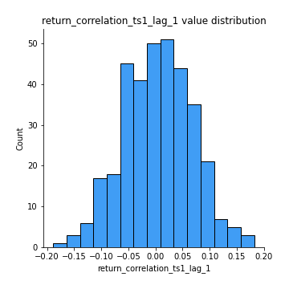
## Feature : return_correlation_ts1_lag_2
- **Feature type** : continous
- **Missing** : 0.0%
- **Unique** : 347
- **Count** :347.0
- **Mean** :0.004338513644698658
- **Std** :0.0661712033792136
- **Min** :-0.16038742223567365
- **25%th Percentile** : -0.03965763554070775
- **50%th Percentile** : 0.003962338677774113
- **75%th Percentile** : 0.04927189142138271
- **Max** :0.1825444936402338

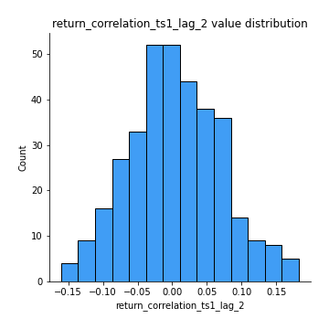
## Feature : return_correlation_ts1_lag_3
- **Feature type** : continous
- **Missing** : 0.0%
- **Unique** : 347
- **Count** :347.0
- **Mean** :0.014589381301123984
- **Std** :0.06912921225845055
- **Min** :-0.21147540839842804
- **25%th Percentile** : -0.03274991639113755
- **50%th Percentile** : 0.016606398576914965
- **75%th Percentile** : 0.06067143115577624
- **Max** :0.23808054096877584

## Feature : return_correlation_ts2_lag_1
- **Feature type** : continous
- **Missing** : 0.0%
- **Unique** : 347
- **Count** :347.0
- **Mean** :0.011038834565928015
- **Std** :0.06847522607629249
- **Min** :-0.17665751184419612
- **25%th Percentile** : -0.036403759206210466
- **50%th Percentile** : 0.012693978765068116
- **75%th Percentile** : 0.0605425912604448
- **Max** :0.3425036902091001

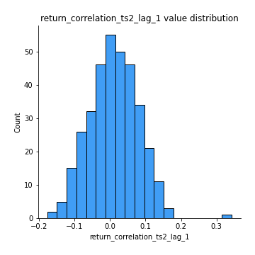
## Feature : return_correlation_ts2_lag_2
- **Feature type** : continous
- **Missing** : 0.0%
- **Unique** : 347
- **Count** :347.0
- **Mean** :0.0012661341497328174
- **Std** :0.06699195473633353
- **Min** :-0.2757460186107768
- **25%th Percentile** : -0.040184321163254384
- **50%th Percentile** : -0.0007742611676065837
- **75%th Percentile** : 0.04414751380675147
- **Max** :0.19125694312518468

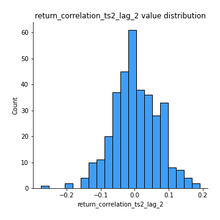
## Feature : return_correlation_ts2_lag_3
- **Feature type** : continous
- **Missing** : 0.0%
- **Unique** : 347
- **Count** :347.0
- **Mean** :0.016569671715198138
- **Std** :0.06331855777094987
- **Min** :-0.13344359675322365
- **25%th Percentile** : -0.02634897960621298
- **50%th Percentile** : 0.015309791519149147
- **75%th Percentile** : 0.06277069319744877
- **Max** :0.18231371185660605

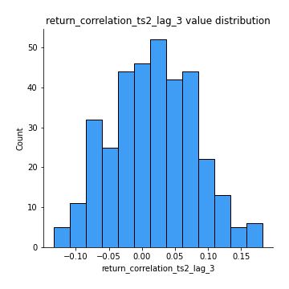
## Feature : sqreturn_autocorrelation_ts1_lag1
- **Feature type** : continous
- **Missing** : 0.0%
- **Unique** : 347
- **Count** :347.0
- **Mean** :0.029473344511951417
- **Std** :0.08663394614878707
- **Min** :-0.15328605980817755
- **25%th Percentile** : -0.028040341307827538
- **50%th Percentile** : 0.011486913259153405
- **75%th Percentile** : 0.0757568677112917
- **Max** :0.4170324090514868

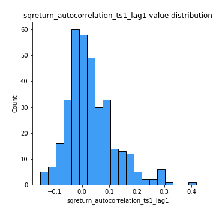
## Feature : sqreturn_autocorrelation_ts1_lag2
- **Feature type** : continous
- **Missing** : 0.0%
- **Unique** : 347
- **Count** :347.0
- **Mean** :0.02399550580985335
- **Std** :0.07415593140872756
- **Min** :-0.13960508338568864
- **25%th Percentile** : -0.03380701769981158
- **50%th Percentile** : 0.015465238670980831
- **75%th Percentile** : 0.06896168153438326
- **Max** :0.32836952056190194

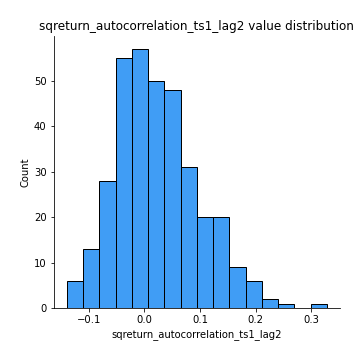
## Feature : sqreturn_autocorrelation_ts1_lag3
- **Feature type** : continous
- **Missing** : 0.0%
- **Unique** : 347
- **Count** :347.0
- **Mean** :0.011329046645741284
- **Std** :0.06525418342389087
- **Min** :-0.15550024753822617
- **25%th Percentile** : -0.03063877664262387
- **50%th Percentile** : 0.005104862050562074
- **75%th Percentile** : 0.04678480405004529
- **Max** :0.36579865351615615

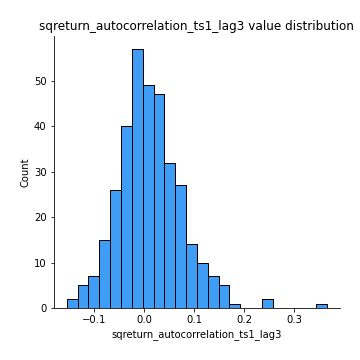
## Feature : sqreturn_autocorrelation_ts2_lag1
- **Feature type** : continous
- **Missing** : 0.0%
- **Unique** : 347
- **Count** :347.0
- **Mean** :0.026230713718351624
- **Std** :0.07711675220559328
- **Min** :-0.1362279341397881
- **25%th Percentile** : -0.023143176951802617
- **50%th Percentile** : 0.017128604476531962
- **75%th Percentile** : 0.065352232286154
- **Max** :0.36991568023038357

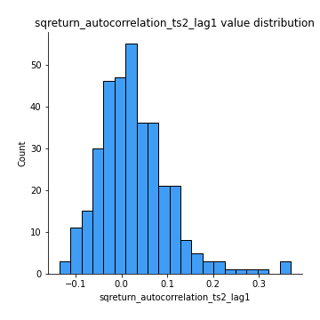
## Feature : sqreturn_autocorrelation_ts2_lag2
- **Feature type** : continous
- **Missing** : 0.0%
- **Unique** : 347
- **Count** :347.0
- **Mean** :0.013409090934279305
- **Std** :0.06458828526863339
- **Min** :-0.13539427094068932
- **25%th Percentile** : -0.02765607653175925
- **50%th Percentile** : 0.007624787728562305
- **75%th Percentile** : 0.04429826518582644
- **Max** :0.28672056150180414

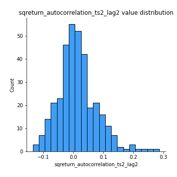
## Feature : sqreturn_autocorrelation_ts2_lag3
- **Feature type** : continous
- **Missing** : 0.0%
- **Unique** : 347
- **Count** :347.0
- **Mean** :0.009972927291918352
- **Std** :0.06456726627144697
- **Min** :-0.12468440762070136
- **25%th Percentile** : -0.029752929839623358
- **50%th Percentile** : -0.0020668752600599065
- **75%th Percentile** : 0.0448185470632555
- **Max** :0.3463122340368414

## Feature : sqreturn_correlation_ts1_lag_0
- **Feature type** : continous
- **Missing** : 0.0%
- **Unique** : 347
- **Count** :347.0
- **Mean** :0.33589563907389713
- **Std** :0.1321795335660705
- **Min** :-0.10256711281206837
- **25%th Percentile** : 0.2783275458567321
- **50%th Percentile** : 0.3455405997682833
- **75%th Percentile** : 0.3974601018749
- **Max** :0.9937227277077512

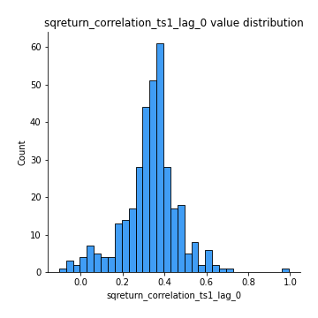
## Feature : sqreturn_correlation_ts1_lag_1
- **Feature type** : continous
- **Missing** : 0.0%
- **Unique** : 347
- **Count** :347.0
- **Mean** :0.003987613758715458
- **Std** :0.06376190296167901
- **Min** :-0.18856827637524448
- **25%th Percentile** : -0.04252785344843117
- **50%th Percentile** : 0.00622048639934591
- **75%th Percentile** : 0.04640648992896907
- **Max** :0.1819668991973155

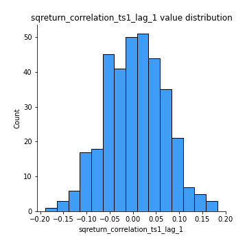
## Feature : sqreturn_correlation_ts1_lag_2
- **Feature type** : continous
- **Missing** : 0.0%
- **Unique** : 347
- **Count** :347.0
- **Mean** :0.004338513644698658
- **Std** :0.0661712033792136
- **Min** :-0.16038742223567365
- **25%th Percentile** : -0.03965763554070775
- **50%th Percentile** : 0.003962338677774113
- **75%th Percentile** : 0.04927189142138271
- **Max** :0.1825444936402338

## Feature : sqreturn_correlation_ts1_lag_3
- **Feature type** : continous
- **Missing** : 0.0%
- **Unique** : 347
- **Count** :347.0
- **Mean** :0.014589381301123984
- **Std** :0.06912921225845055
- **Min** :-0.21147540839842804
- **25%th Percentile** : -0.03274991639113755
- **50%th Percentile** : 0.016606398576914965
- **75%th Percentile** : 0.06067143115577624
- **Max** :0.23808054096877584

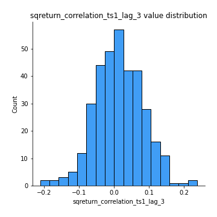
## Feature : sqreturn_correlation_ts2_lag_1
- **Feature type** : continous
- **Missing** : 0.0%
- **Unique** : 347
- **Count** :347.0
- **Mean** :0.011038834565928015
- **Std** :0.06847522607629249
- **Min** :-0.17665751184419612
- **25%th Percentile** : -0.036403759206210466
- **50%th Percentile** : 0.012693978765068116
- **75%th Percentile** : 0.0605425912604448
- **Max** :0.3425036902091001

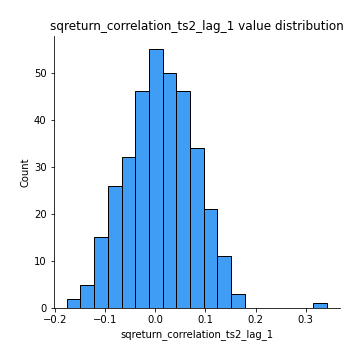
## Feature : sqreturn_correlation_ts2_lag_2
- **Feature type** : continous
- **Missing** : 0.0%
- **Unique** : 347
- **Count** :347.0
- **Mean** :0.0012661341497328174
- **Std** :0.06699195473633353
- **Min** :-0.2757460186107768
- **25%th Percentile** : -0.040184321163254384
- **50%th Percentile** : -0.0007742611676065837
- **75%th Percentile** : 0.04414751380675147
- **Max** :0.19125694312518468

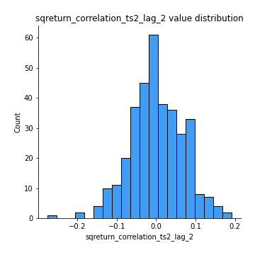
## Feature : sqreturn_correlation_ts2_lag_3
- **Feature type** : continous
- **Missing** : 0.0%
- **Unique** : 347
- **Count** :347.0
- **Mean** :0.016569671715198138
- **Std** :0.06331855777094987
- **Min** :-0.13344359675322365
- **25%th Percentile** : -0.02634897960621298
- **50%th Percentile** : 0.015309791519149147
- **75%th Percentile** : 0.06277069319744877
- **Max** :0.18231371185660605

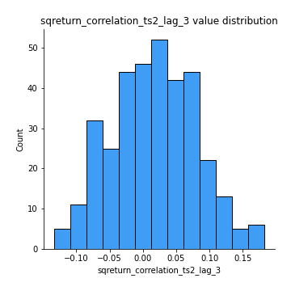
## Feature : price2_granger_cause_price1
- **Feature type** : continous
- **Missing** : 0.0%
- **Unique** : 347
- **Count** :347.0
- **Mean** :0.27559742239111856
- **Std** :0.29005993162809857
- **Min** :2.4312048970873696e-09
- **25%th Percentile** : 0.024721376989282024
- **50%th Percentile** : 0.16997531716495493
- **75%th Percentile** : 0.4736049668405501
- **Max** :0.9898380228448623

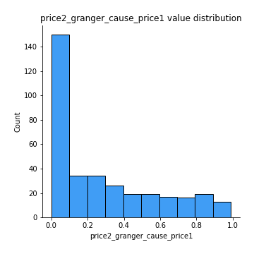
## Feature : price1_granger_cause_price2
- **Feature type** : continous
- **Missing** : 0.0%
- **Unique** : 347
- **Count** :347.0
- **Mean** :0.2768329047262543
- **Std** :0.2971102525710664
- **Min** :1.2012269232170316e-11
- **25%th Percentile** : 0.02185538064426
- **50%th Percentile** : 0.1639796602305013
- **75%th Percentile** : 0.4756450416294381
- **Max** :0.9952419702414824

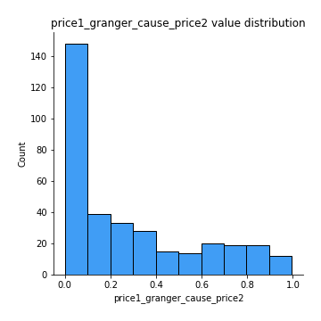

[<< Go back](../README.md)
