# Exploratory Data Analysis

[<< Go back](../README.md)
## Feature : target
- **Feature type** : categorical
- **Missing** : 0.0%
- **Unique** : 2
- **Count** :347
- **Unique** :2
- **Top** :simulated
- **Freq** :178

## Feature : return_mean1
- **Feature type** : continous
- **Missing** : 0.0%
- **Unique** : 347
- **Count** :347.0
- **Mean** :0.03526090474432403
- **Std** :0.11732530985014909
- **Min** :-0.37853543228992415
- **25%th Percentile** : -0.035404068885325116
- **50%th Percentile** : 0.04098900581681626
- **75%th Percentile** : 0.12513989412086796
- **Max** :0.3948618510445334

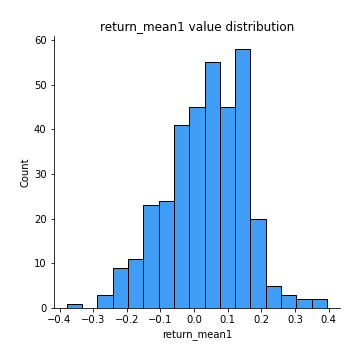
## Feature : return_mean2
- **Feature type** : continous
- **Missing** : 0.0%
- **Unique** : 347
- **Count** :347.0
- **Mean** :0.014079496845835988
- **Std** :0.12256338786953865
- **Min** :-0.3393917268522109
- **25%th Percentile** : -0.06342462721665446
- **50%th Percentile** : 0.011073824340230045
- **75%th Percentile** : 0.10105576958934967
- **Max** :0.6801605239983173

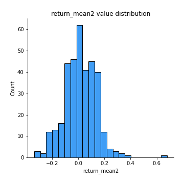
## Feature : return_sd1
- **Feature type** : continous
- **Missing** : 0.0%
- **Unique** : 347
- **Count** :347.0
- **Mean** :1.6463941580341073
- **Std** :0.3495844468704184
- **Min** :0.8102430347636637
- **25%th Percentile** : 1.5165323641149606
- **50%th Percentile** : 1.6367396959190472
- **75%th Percentile** : 1.7378324690830964
- **Max** :3.332494027875222

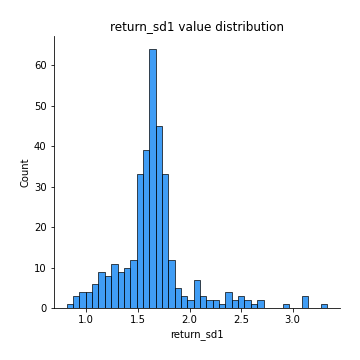
## Feature : return_sd2
- **Feature type** : continous
- **Missing** : 0.0%
- **Unique** : 347
- **Count** :347.0
- **Mean** :1.6713116114915485
- **Std** :0.399481043668769
- **Min** :0.9060171249911689
- **25%th Percentile** : 1.5126443535367922
- **50%th Percentile** : 1.6377821757733007
- **75%th Percentile** : 1.7383520883346422
- **Max** :4.59233049161685

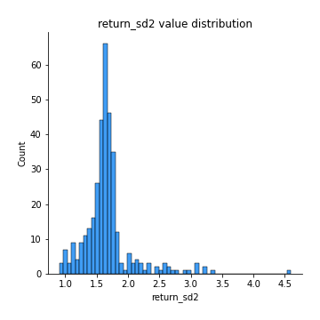
## Feature : return_skew1
- **Feature type** : continous
- **Missing** : 0.0%
- **Unique** : 347
- **Count** :347.0
- **Mean** :-0.17119809284154672
- **Std** :0.7325639897339584
- **Min** :-4.239645236578449
- **25%th Percentile** : -0.3302219559757308
- **50%th Percentile** : -0.09312421423545825
- **75%th Percentile** : 0.0888426505834802
- **Max** :2.351757728252051

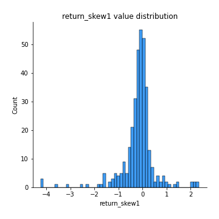
## Feature : return_skew2
- **Feature type** : continous
- **Missing** : 0.0%
- **Unique** : 347
- **Count** :347.0
- **Mean** :-0.2813131321396591
- **Std** :1.0722972961800468
- **Min** :-7.3762354994385335
- **25%th Percentile** : -0.37827455978813973
- **50%th Percentile** : -0.06653488350233605
- **75%th Percentile** : 0.09874435390062433
- **Max** :4.1920266082732045

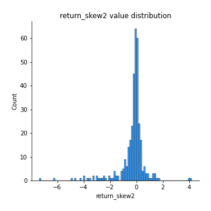
## Feature : return_kurtosis1
- **Feature type** : continous
- **Missing** : 0.0%
- **Unique** : 347
- **Count** :347.0
- **Mean** :2.7903697482376715
- **Std** :5.582276593378137
- **Min** :-0.5685148726987794
- **25%th Percentile** : 0.09586888032188656
- **50%th Percentile** : 1.0659570120367512
- **75%th Percentile** : 2.7047782485883083
- **Max** :40.485294874464934

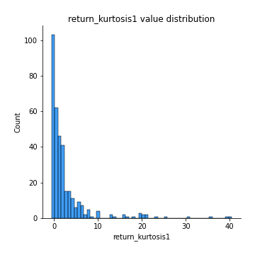
## Feature : return_kurtosis2
- **Feature type** : continous
- **Missing** : 0.0%
- **Unique** : 347
- **Count** :347.0
- **Mean** :4.432294569686897
- **Std** :10.011413259514276
- **Min** :-0.5251663717893047
- **25%th Percentile** : 0.06064575570019204
- **50%th Percentile** : 0.8290806700500002
- **75%th Percentile** : 3.8586921564822534
- **Max** :94.01659180149953

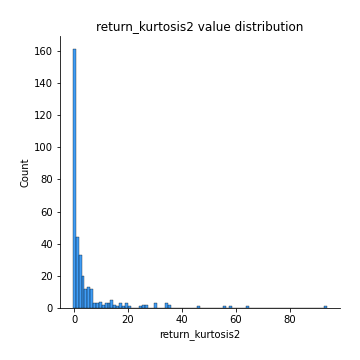
## Feature : return_autocorrelation_1_lag1
- **Feature type** : continous
- **Missing** : 0.0%
- **Unique** : 347
- **Count** :347.0
- **Mean** :0.004993218177403579
- **Std** :0.07106528568190792
- **Min** :-0.25177078814480547
- **25%th Percentile** : -0.04254958298569397
- **50%th Percentile** : 0.008282263571147955
- **75%th Percentile** : 0.05724674087953455
- **Max** :0.20132571463207988

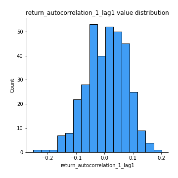
## Feature : return_autocorrelation_1_lag2
- **Feature type** : continous
- **Missing** : 0.0%
- **Unique** : 347
- **Count** :347.0
- **Mean** :0.0037511371109324202
- **Std** :0.06913333438942404
- **Min** :-0.18815240041143846
- **25%th Percentile** : -0.045394889464448876
- **50%th Percentile** : 0.003121782073640644
- **75%th Percentile** : 0.050405494082668825
- **Max** :0.27182551601960603

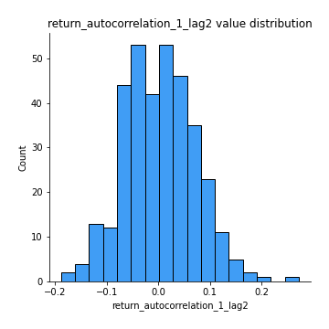
## Feature : return_autocorrelation_1_lag3
- **Feature type** : continous
- **Missing** : 0.0%
- **Unique** : 347
- **Count** :347.0
- **Mean** :0.017264094759427247
- **Std** :0.06211783649044974
- **Min** :-0.1817944619132489
- **25%th Percentile** : -0.01816175176347376
- **50%th Percentile** : 0.020299682300300204
- **75%th Percentile** : 0.054509404002651106
- **Max** :0.17514033413395239

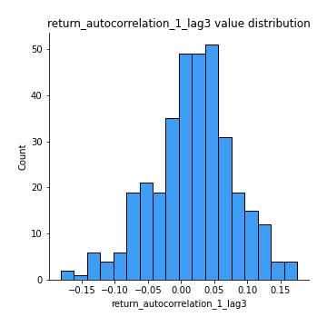
## Feature : return_autocorrelation_2_lag1
- **Feature type** : continous
- **Missing** : 0.0%
- **Unique** : 347
- **Count** :347.0
- **Mean** :0.01175782995867378
- **Std** :0.06726913337269158
- **Min** :-0.15425534446794
- **25%th Percentile** : -0.03346079060252794
- **50%th Percentile** : 0.011218149718501496
- **75%th Percentile** : 0.05940215127626257
- **Max** :0.2024676054184499

## Feature : return_autocorrelation_2_lag2
- **Feature type** : continous
- **Missing** : 0.0%
- **Unique** : 347
- **Count** :347.0
- **Mean** :0.0028079912873269345
- **Std** :0.06949856683026354
- **Min** :-0.1758721664122366
- **25%th Percentile** : -0.04365609653095315
- **50%th Percentile** : 0.004503901879969208
- **75%th Percentile** : 0.05133831278990411
- **Max** :0.20066280491610552

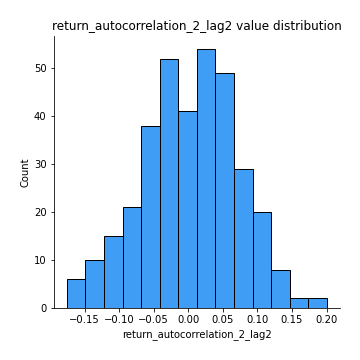
## Feature : return_autocorrelation_2_lag3
- **Feature type** : continous
- **Missing** : 0.0%
- **Unique** : 347
- **Count** :347.0
- **Mean** :0.016339658571353857
- **Std** :0.06204684791272508
- **Min** :-0.16114473830656556
- **25%th Percentile** : -0.0239917795070497
- **50%th Percentile** : 0.01975968459479943
- **75%th Percentile** : 0.058275893533123915
- **Max** :0.20205753622966244

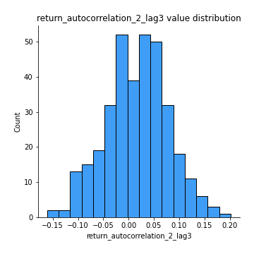
## Feature : return_correlation_ts1_lag_0
- **Feature type** : continous
- **Missing** : 0.0%
- **Unique** : 347
- **Count** :347.0
- **Mean** :0.304313138441317
- **Std** :0.13745971709162935
- **Min** :-0.10256711281206837
- **25%th Percentile** : 0.22841088695510864
- **50%th Percentile** : 0.3009439392045645
- **75%th Percentile** : 0.37381417966694364
- **Max** :0.9937227277077512

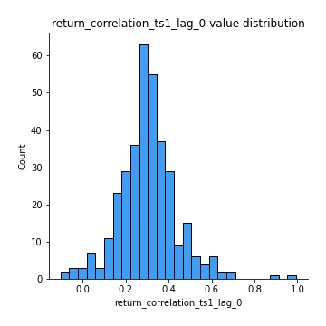
## Feature : return_correlation_ts1_lag_1
- **Feature type** : continous
- **Missing** : 0.0%
- **Unique** : 347
- **Count** :347.0
- **Mean** :0.014190765948964604
- **Std** :0.06505073100056621
- **Min** :-0.18856827637524448
- **25%th Percentile** : -0.03019347537165591
- **50%th Percentile** : 0.012103936019248017
- **75%th Percentile** : 0.06153129277987436
- **Max** :0.1971429402370841

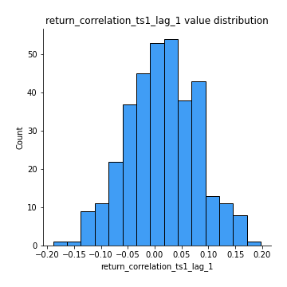
## Feature : return_correlation_ts1_lag_2
- **Feature type** : continous
- **Missing** : 0.0%
- **Unique** : 347
- **Count** :347.0
- **Mean** :0.008522732492317364
- **Std** :0.06541617245782741
- **Min** :-0.14326176299733834
- **25%th Percentile** : -0.03467394472361689
- **50%th Percentile** : 0.005904083679897087
- **75%th Percentile** : 0.050103907202647215
- **Max** :0.17974071501626168

## Feature : return_correlation_ts1_lag_3
- **Feature type** : continous
- **Missing** : 0.0%
- **Unique** : 347
- **Count** :347.0
- **Mean** :0.018487365180118655
- **Std** :0.0669353965296881
- **Min** :-0.21147540839842804
- **25%th Percentile** : -0.023328511596990578
- **50%th Percentile** : 0.01651823703708127
- **75%th Percentile** : 0.059010496873722645
- **Max** :0.23808054096877584

## Feature : return_correlation_ts2_lag_1
- **Feature type** : continous
- **Missing** : 0.0%
- **Unique** : 347
- **Count** :347.0
- **Mean** :0.012083805468936972
- **Std** :0.0659034797849384
- **Min** :-0.1541309618343512
- **25%th Percentile** : -0.031235629177739754
- **50%th Percentile** : 0.010371321649904374
- **75%th Percentile** : 0.056348516931391666
- **Max** :0.3425036902091001

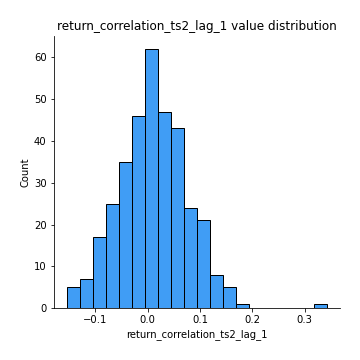
## Feature : return_correlation_ts2_lag_2
- **Feature type** : continous
- **Missing** : 0.0%
- **Unique** : 347
- **Count** :347.0
- **Mean** :0.006434506238800789
- **Std** :0.06640368601317062
- **Min** :-0.18381967289455395
- **25%th Percentile** : -0.03877149240645887
- **50%th Percentile** : 0.006288550952215767
- **75%th Percentile** : 0.05018145339955335
- **Max** :0.16778665817564664

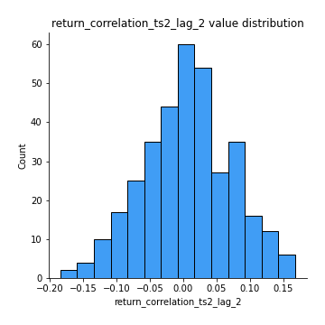
## Feature : return_correlation_ts2_lag_3
- **Feature type** : continous
- **Missing** : 0.0%
- **Unique** : 347
- **Count** :347.0
- **Mean** :0.018193660413698978
- **Std** :0.06064481022940942
- **Min** :-0.148342620728748
- **25%th Percentile** : -0.0222402018875422
- **50%th Percentile** : 0.015622421488701192
- **75%th Percentile** : 0.060073943666327255
- **Max** :0.19181875581650684

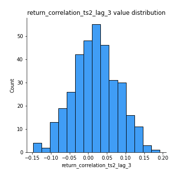
## Feature : sqreturn_autocorrelation_ts1_lag1
- **Feature type** : continous
- **Missing** : 0.0%
- **Unique** : 347
- **Count** :347.0
- **Mean** :0.03219824685666795
- **Std** :0.08340348429435511
- **Min** :-0.12524254146072256
- **25%th Percentile** : -0.025363195778193504
- **50%th Percentile** : 0.016990945893094037
- **75%th Percentile** : 0.07831100389991832
- **Max** :0.4170324090514868

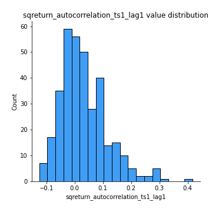
## Feature : sqreturn_autocorrelation_ts1_lag2
- **Feature type** : continous
- **Missing** : 0.0%
- **Unique** : 347
- **Count** :347.0
- **Mean** :0.02280766676547682
- **Std** :0.07084533909552407
- **Min** :-0.14303258189458248
- **25%th Percentile** : -0.022871219341261552
- **50%th Percentile** : 0.006527571743635394
- **75%th Percentile** : 0.06339516989272267
- **Max** :0.32836952056190194

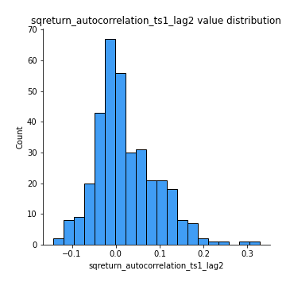
## Feature : sqreturn_autocorrelation_ts1_lag3
- **Feature type** : continous
- **Missing** : 0.0%
- **Unique** : 347
- **Count** :347.0
- **Mean** :0.01162054534624111
- **Std** :0.05853175032342265
- **Min** :-0.1134249507055599
- **25%th Percentile** : -0.026443897291865928
- **50%th Percentile** : 0.005572901206249373
- **75%th Percentile** : 0.03949921503530005
- **Max** :0.23856108238097126

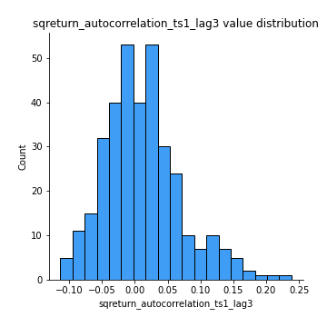
## Feature : sqreturn_autocorrelation_ts2_lag1
- **Feature type** : continous
- **Missing** : 0.0%
- **Unique** : 347
- **Count** :347.0
- **Mean** :0.02611073534204321
- **Std** :0.07817939583475295
- **Min** :-0.13535664956468055
- **25%th Percentile** : -0.020232140341233565
- **50%th Percentile** : 0.013146654267328282
- **75%th Percentile** : 0.06059023807020137
- **Max** :0.36991568023038357

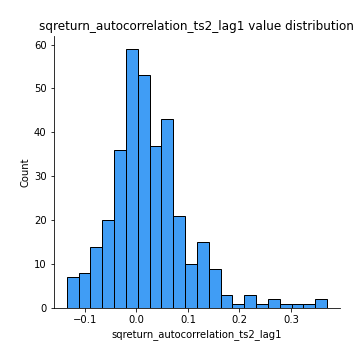
## Feature : sqreturn_autocorrelation_ts2_lag2
- **Feature type** : continous
- **Missing** : 0.0%
- **Unique** : 347
- **Count** :347.0
- **Mean** :0.009255234230781775
- **Std** :0.05897800033636631
- **Min** :-0.13479098761273647
- **25%th Percentile** : -0.028229130644619946
- **50%th Percentile** : 0.0005972973616548966
- **75%th Percentile** : 0.038667446502990706
- **Max** :0.28672056150180414

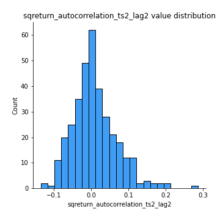
## Feature : sqreturn_autocorrelation_ts2_lag3
- **Feature type** : continous
- **Missing** : 0.0%
- **Unique** : 347
- **Count** :347.0
- **Mean** :0.005125637710227262
- **Std** :0.0582353459086306
- **Min** :-0.15134222347587387
- **25%th Percentile** : -0.03325554982748258
- **50%th Percentile** : -0.0024031567833282196
- **75%th Percentile** : 0.036335316672154755
- **Max** :0.231605349758384

## Feature : sqreturn_correlation_ts1_lag_0
- **Feature type** : continous
- **Missing** : 0.0%
- **Unique** : 347
- **Count** :347.0
- **Mean** :0.304313138441317
- **Std** :0.13745971709162935
- **Min** :-0.10256711281206837
- **25%th Percentile** : 0.22841088695510864
- **50%th Percentile** : 0.3009439392045645
- **75%th Percentile** : 0.37381417966694364
- **Max** :0.9937227277077512

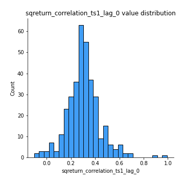
## Feature : sqreturn_correlation_ts1_lag_1
- **Feature type** : continous
- **Missing** : 0.0%
- **Unique** : 347
- **Count** :347.0
- **Mean** :0.014190765948964604
- **Std** :0.06505073100056621
- **Min** :-0.18856827637524448
- **25%th Percentile** : -0.03019347537165591
- **50%th Percentile** : 0.012103936019248017
- **75%th Percentile** : 0.06153129277987436
- **Max** :0.1971429402370841

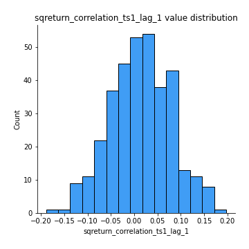
## Feature : sqreturn_correlation_ts1_lag_2
- **Feature type** : continous
- **Missing** : 0.0%
- **Unique** : 347
- **Count** :347.0
- **Mean** :0.008522732492317364
- **Std** :0.06541617245782741
- **Min** :-0.14326176299733834
- **25%th Percentile** : -0.03467394472361689
- **50%th Percentile** : 0.005904083679897087
- **75%th Percentile** : 0.050103907202647215
- **Max** :0.17974071501626168

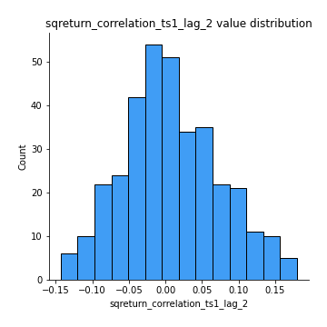
## Feature : sqreturn_correlation_ts1_lag_3
- **Feature type** : continous
- **Missing** : 0.0%
- **Unique** : 347
- **Count** :347.0
- **Mean** :0.018487365180118655
- **Std** :0.0669353965296881
- **Min** :-0.21147540839842804
- **25%th Percentile** : -0.023328511596990578
- **50%th Percentile** : 0.01651823703708127
- **75%th Percentile** : 0.059010496873722645
- **Max** :0.23808054096877584

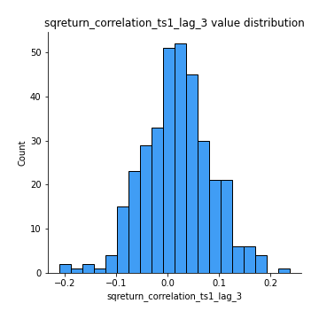
## Feature : sqreturn_correlation_ts2_lag_1
- **Feature type** : continous
- **Missing** : 0.0%
- **Unique** : 347
- **Count** :347.0
- **Mean** :0.012083805468936972
- **Std** :0.0659034797849384
- **Min** :-0.1541309618343512
- **25%th Percentile** : -0.031235629177739754
- **50%th Percentile** : 0.010371321649904374
- **75%th Percentile** : 0.056348516931391666
- **Max** :0.3425036902091001

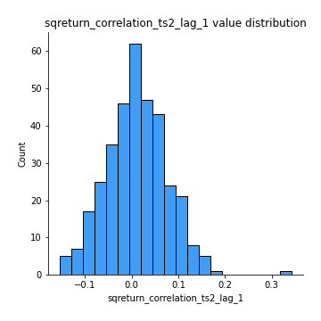
## Feature : sqreturn_correlation_ts2_lag_2
- **Feature type** : continous
- **Missing** : 0.0%
- **Unique** : 347
- **Count** :347.0
- **Mean** :0.006434506238800789
- **Std** :0.06640368601317062
- **Min** :-0.18381967289455395
- **25%th Percentile** : -0.03877149240645887
- **50%th Percentile** : 0.006288550952215767
- **75%th Percentile** : 0.05018145339955335
- **Max** :0.16778665817564664

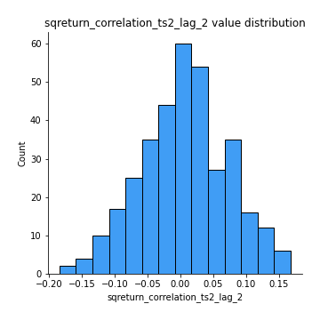
## Feature : sqreturn_correlation_ts2_lag_3
- **Feature type** : continous
- **Missing** : 0.0%
- **Unique** : 347
- **Count** :347.0
- **Mean** :0.018193660413698978
- **Std** :0.06064481022940942
- **Min** :-0.148342620728748
- **25%th Percentile** : -0.0222402018875422
- **50%th Percentile** : 0.015622421488701192
- **75%th Percentile** : 0.060073943666327255
- **Max** :0.19181875581650684

## Feature : price2_granger_cause_price1
- **Feature type** : continous
- **Missing** : 0.0%
- **Unique** : 347
- **Count** :347.0
- **Mean** :0.2345056144550727
- **Std** :0.2710948639235015
- **Min** :8.357055113318669e-10
- **25%th Percentile** : 0.011536272892788682
- **50%th Percentile** : 0.11809007815499167
- **75%th Percentile** : 0.3681524313186709
- **Max** :0.9898380228448623

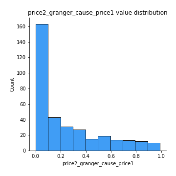
## Feature : price1_granger_cause_price2
- **Feature type** : continous
- **Missing** : 0.0%
- **Unique** : 347
- **Count** :347.0
- **Mean** :0.234415796183092
- **Std** :0.2776604774712351
- **Min** :1.2012269232170316e-11
- **25%th Percentile** : 0.016281426108475373
- **50%th Percentile** : 0.10470340240092488
- **75%th Percentile** : 0.3678026393450753
- **Max** :0.9871292066441198

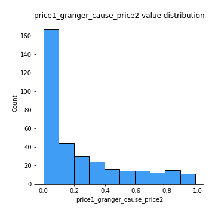

[<< Go back](../README.md)
