# Summary of 3_Linear

[<< Go back](../README.md)

## Logistic Regression (Linear)
- **n_jobs**: -1
- **explain_level**: 2

## Validation
 - **validation_type**: split
 - **train_ratio**: 0.75
 - **shuffle**: True
 - **stratify**: True

## Optimized metric
accuracy

## Training time

3.4 seconds

## Metric details
|           |    score |     threshold |
|:----------|---------:|--------------:|
| logloss   | 0.205536 | nan           |
| auc       | 0.984144 | nan           |
| f1        | 0.964706 |   0.602687    |
| accuracy  | 0.965517 |   0.602687    |
| precision | 1        |   0.858508    |
| recall    | 1        |   2.95603e-09 |
| mcc       | 0.931253 |   0.602687    |

## Confusion matrix (at threshold=0.602687)
|                      |   Predicted as real |   Predicted as simulated |
|:---------------------|--------------------:|-------------------------:|
| Labeled as real      |                  43 |                        1 |
| Labeled as simulated |                   2 |                       41 |

## Learning curves
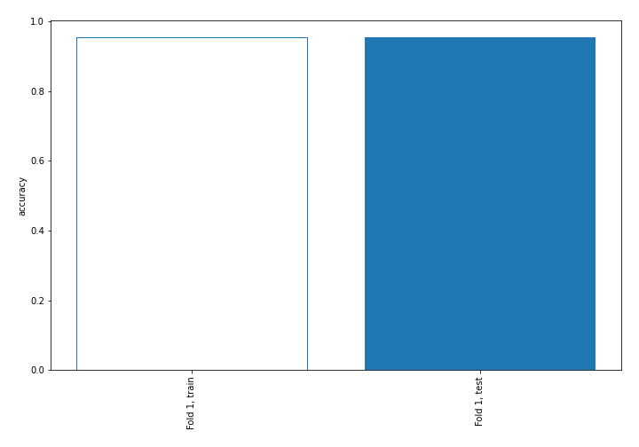

## Coefficients
| feature                           |   Learner_1 |
|:----------------------------------|------------:|
| return_skew1                      |   1.167     |
| return_correlation_ts1_lag_2      |   0.764131  |
| sqreturn_correlation_ts1_lag_2    |   0.764131  |
| return_autocorrelation_1_lag2     |   0.671535  |
| return_correlation_ts1_lag_1      |   0.571972  |
| sqreturn_correlation_ts1_lag_1    |   0.571972  |
| return_autocorrelation_1_lag1     |   0.556531  |
| return_autocorrelation_2_lag2     |   0.488668  |
| return_correlation_ts2_lag_1      |   0.431714  |
| sqreturn_correlation_ts2_lag_1    |   0.431714  |
| return_autocorrelation_2_lag1     |   0.407744  |
| return_correlation_ts2_lag_2      |   0.293949  |
| sqreturn_correlation_ts2_lag_2    |   0.293949  |
| return_sd1                        |   0.286675  |
| return_autocorrelation_1_lag3     |   0.281116  |
| sqreturn_correlation_ts2_lag_3    |   0.242331  |
| return_correlation_ts2_lag_3      |   0.242331  |
| return_skew2                      |   0.208274  |
| intercept                         |   0.124941  |
| sqreturn_correlation_ts1_lag_3    |   0.123336  |
| return_correlation_ts1_lag_3      |   0.123336  |
| return_sd2                        |   0.056981  |
| return_autocorrelation_2_lag3     |  -0.0796305 |
| return_mean1                      |  -0.0965022 |
| return_mean2                      |  -0.439465  |
| price1_granger_cause_price2       |  -0.456819  |
| sqreturn_autocorrelation_ts2_lag3 |  -0.590937  |
| sqreturn_autocorrelation_ts1_lag3 |  -0.709305  |
| price2_granger_cause_price1       |  -0.903074  |
| sqreturn_correlation_ts1_lag_0    |  -0.996111  |
| return_correlation_ts1_lag_0      |  -0.996111  |
| sqreturn_autocorrelation_ts2_lag2 |  -1.16635   |
| sqreturn_autocorrelation_ts1_lag2 |  -1.31902   |
| sqreturn_autocorrelation_ts2_lag1 |  -1.41433   |
| sqreturn_autocorrelation_ts1_lag1 |  -1.59594   |
| return_kurtosis1                  |  -2.3874    |
| return_kurtosis2                  |  -3.07611   |

## Permutation-based Importance
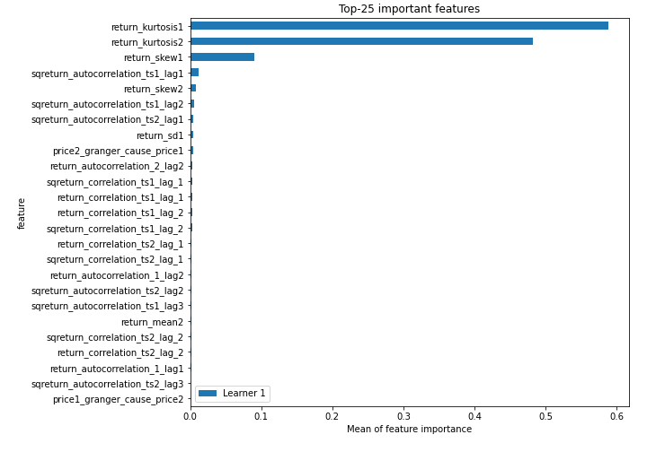
## Confusion Matrix

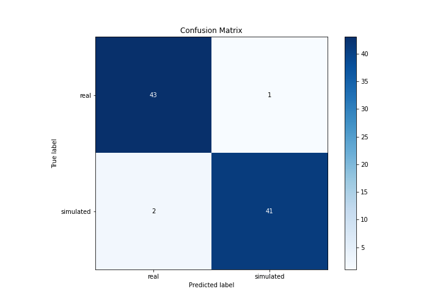

## Normalized Confusion Matrix

## ROC Curve

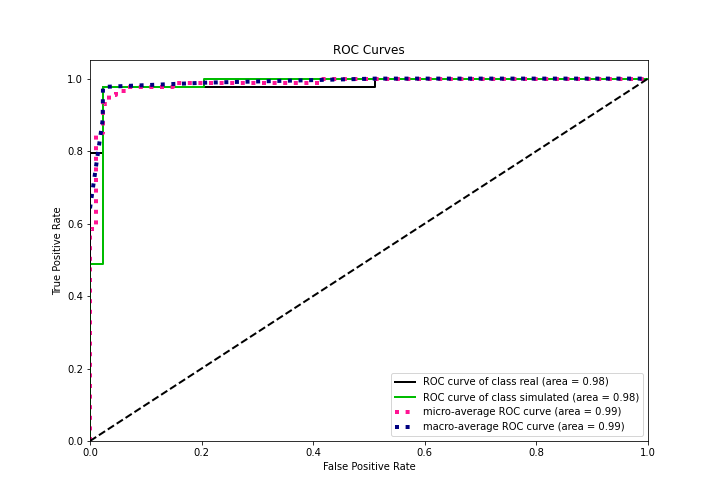

## Kolmogorov-Smirnov Statistic

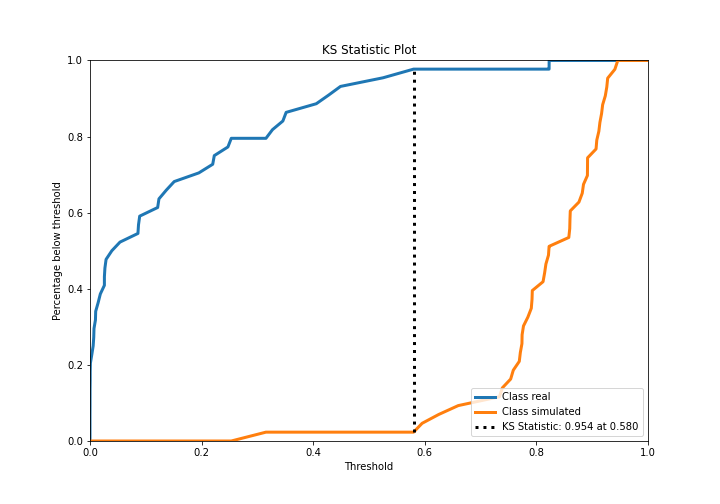

## Precision-Recall Curve

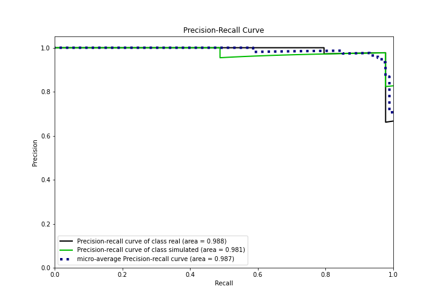

## Calibration Curve

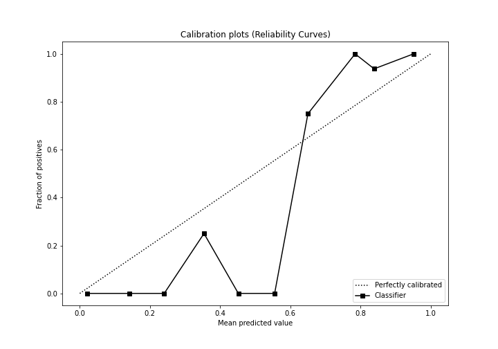

## Cumulative Gains Curve

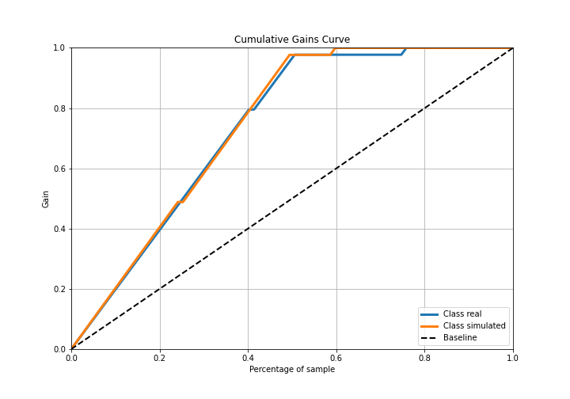

## Lift Curve

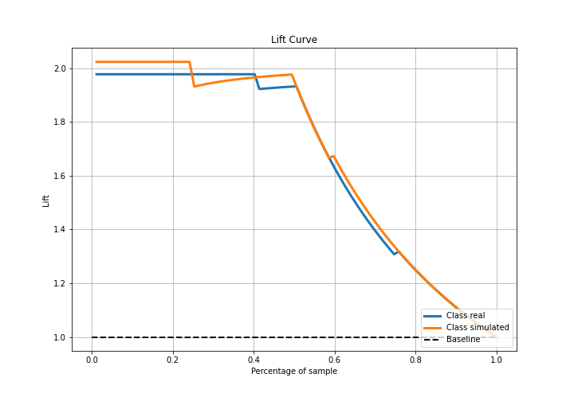

## SHAP Importance
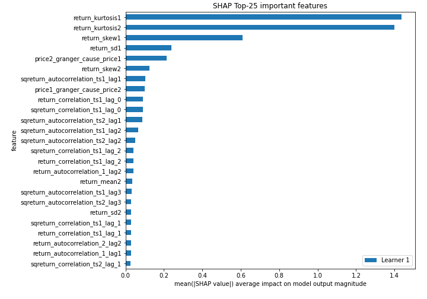

## SHAP Dependence plots

### Dependence (Fold 1)
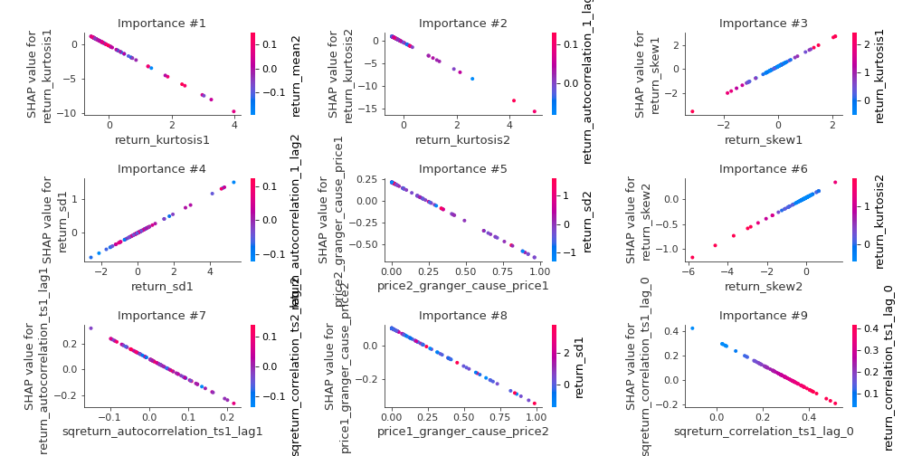

## SHAP Decision plots

### Top-10 Worst decisions for class 0 (Fold 1)
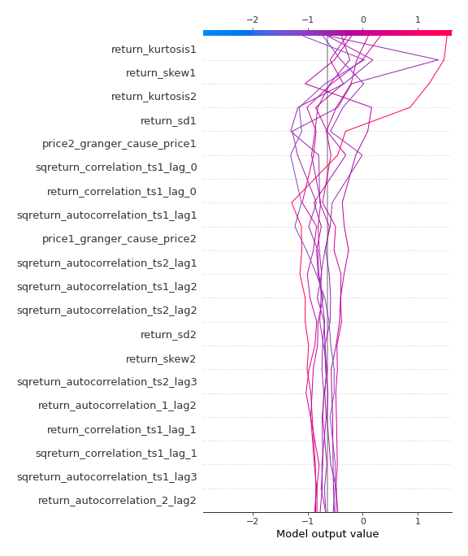
### Top-10 Best decisions for class 0 (Fold 1)
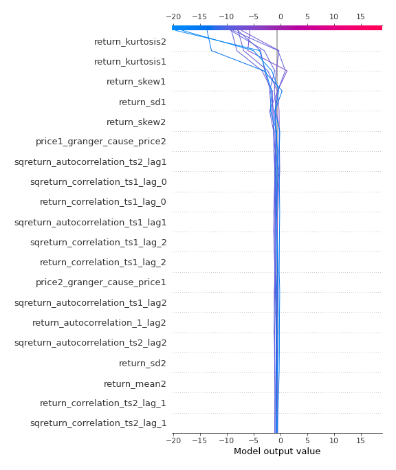
### Top-10 Worst decisions for class 1 (Fold 1)
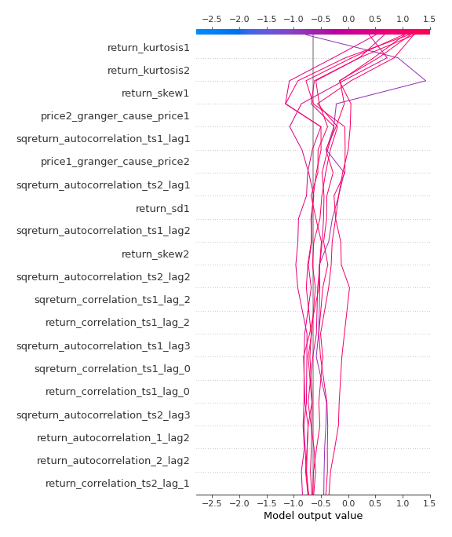
### Top-10 Best decisions for class 1 (Fold 1)
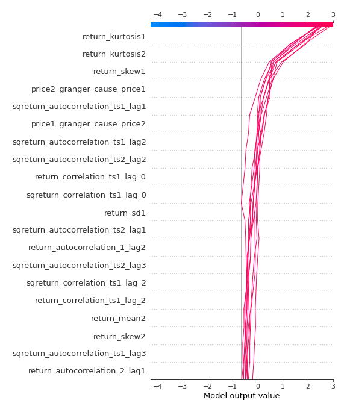

[<< Go back](../README.md)
