# Exploratory Data Analysis

[<< Go back](../README.md)
## Feature : target
- **Feature type** : categorical
- **Missing** : 0.0%
- **Unique** : 2
- **Count** :347
- **Unique** :2
- **Top** :real
- **Freq** :175

## Feature : return_mean1
- **Feature type** : continous
- **Missing** : 0.0%
- **Unique** : 347
- **Count** :347.0
- **Mean** :0.026483518649792596
- **Std** :0.11466882687368611
- **Min** :-0.297638839829253
- **25%th Percentile** : -0.049264089221114915
- **50%th Percentile** : 0.03300613091701441
- **75%th Percentile** : 0.11168770844742476
- **Max** :0.3602793017097547

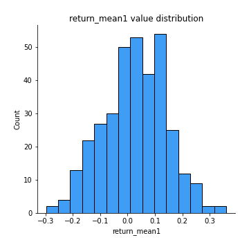
## Feature : return_mean2
- **Feature type** : continous
- **Missing** : 0.0%
- **Unique** : 347
- **Count** :347.0
- **Mean** :0.008730838453620687
- **Std** :0.11756757090551914
- **Min** :-0.3439835398279146
- **25%th Percentile** : -0.06405831807647798
- **50%th Percentile** : 0.014771908135520562
- **75%th Percentile** : 0.08077600206365537
- **Max** :0.6801605239983173

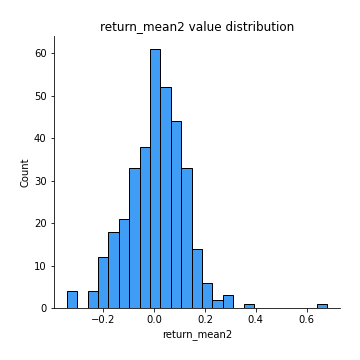
## Feature : return_sd1
- **Feature type** : continous
- **Missing** : 0.0%
- **Unique** : 347
- **Count** :347.0
- **Mean** :1.6514678888468697
- **Std** :0.35947330129997
- **Min** :0.8102430347636637
- **25%th Percentile** : 1.5217099983768292
- **50%th Percentile** : 1.634966603381324
- **75%th Percentile** : 1.7441790077809074
- **Max** :3.332494027875222

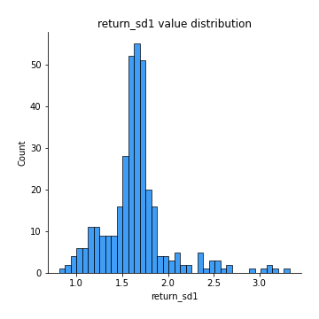
## Feature : return_sd2
- **Feature type** : continous
- **Missing** : 0.0%
- **Unique** : 347
- **Count** :347.0
- **Mean** :1.690839957975773
- **Std** :0.4138014904434368
- **Min** :0.8198779632289204
- **25%th Percentile** : 1.5237546443439918
- **50%th Percentile** : 1.6501089163100517
- **75%th Percentile** : 1.7481180770720819
- **Max** :4.59233049161685

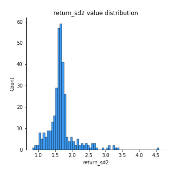
## Feature : return_skew1
- **Feature type** : continous
- **Missing** : 0.0%
- **Unique** : 347
- **Count** :347.0
- **Mean** :-0.18714930329006207
- **Std** :0.7396597131634395
- **Min** :-4.239645236578449
- **25%th Percentile** : -0.3611962994310737
- **50%th Percentile** : -0.08172154826438417
- **75%th Percentile** : 0.10071763153489338
- **Max** :2.3044235031125564

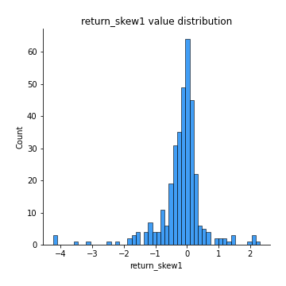
## Feature : return_skew2
- **Feature type** : continous
- **Missing** : 0.0%
- **Unique** : 347
- **Count** :347.0
- **Mean** :-0.30940777901377897
- **Std** :1.0613830366581793
- **Min** :-7.3762354994385335
- **25%th Percentile** : -0.37827455978813973
- **50%th Percentile** : -0.07211160386607515
- **75%th Percentile** : 0.10926932011288748
- **Max** :4.0310261345618

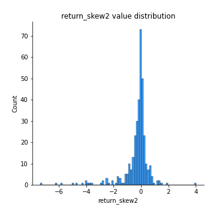
## Feature : return_kurtosis1
- **Feature type** : continous
- **Missing** : 0.0%
- **Unique** : 347
- **Count** :347.0
- **Mean** :2.912258772231455
- **Std** :5.589883095051971
- **Min** :-0.7017846537632995
- **25%th Percentile** : 0.10720009530238195
- **50%th Percentile** : 1.0281664230830532
- **75%th Percentile** : 2.988300666588839
- **Max** :40.485294874464934

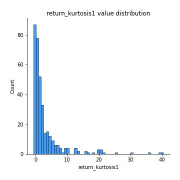
## Feature : return_kurtosis2
- **Feature type** : continous
- **Missing** : 0.0%
- **Unique** : 347
- **Count** :347.0
- **Mean** :4.189861208471727
- **Std** :9.946600306901352
- **Min** :-0.5632765306604277
- **25%th Percentile** : 0.04521219667423937
- **50%th Percentile** : 1.0223212413189713
- **75%th Percentile** : 3.5545018475823262
- **Max** :94.01659180149953

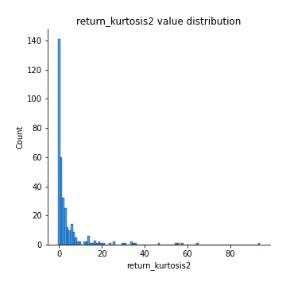
## Feature : return_autocorrelation_1_lag1
- **Feature type** : continous
- **Missing** : 0.0%
- **Unique** : 347
- **Count** :347.0
- **Mean** :0.002067605655272015
- **Std** :0.06791913812996879
- **Min** :-0.2110198016529991
- **25%th Percentile** : -0.046772051918166344
- **50%th Percentile** : 0.0032048053886365993
- **75%th Percentile** : 0.0457631114534485
- **Max** :0.1839883651127944

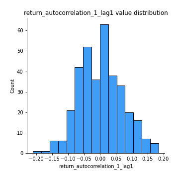
## Feature : return_autocorrelation_1_lag2
- **Feature type** : continous
- **Missing** : 0.0%
- **Unique** : 347
- **Count** :347.0
- **Mean** :0.0022967947604259774
- **Std** :0.07112682180258835
- **Min** :-0.18815240041143846
- **25%th Percentile** : -0.04682050806599166
- **50%th Percentile** : 0.0015095014394105263
- **75%th Percentile** : 0.05414641221784962
- **Max** :0.21123611097039302

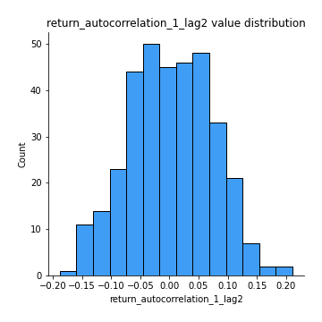
## Feature : return_autocorrelation_1_lag3
- **Feature type** : continous
- **Missing** : 0.0%
- **Unique** : 347
- **Count** :347.0
- **Mean** :0.02022265819555119
- **Std** :0.06442574169656762
- **Min** :-0.18700112562648932
- **25%th Percentile** : -0.015247547494190291
- **50%th Percentile** : 0.023588479843301913
- **75%th Percentile** : 0.06468744079130101
- **Max** :0.1873808922105763

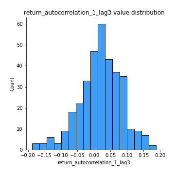
## Feature : return_autocorrelation_2_lag1
- **Feature type** : continous
- **Missing** : 0.0%
- **Unique** : 347
- **Count** :347.0
- **Mean** :0.01081895761860177
- **Std** :0.06946816326236194
- **Min** :-0.17778763204400128
- **25%th Percentile** : -0.03326708573157923
- **50%th Percentile** : 0.011394297607712007
- **75%th Percentile** : 0.05855383331268184
- **Max** :0.1877728597669003

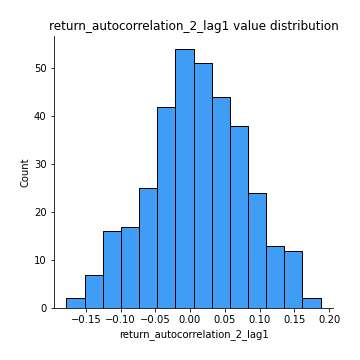
## Feature : return_autocorrelation_2_lag2
- **Feature type** : continous
- **Missing** : 0.0%
- **Unique** : 347
- **Count** :347.0
- **Mean** :0.005672794268816242
- **Std** :0.06826237792871574
- **Min** :-0.1758721664122366
- **25%th Percentile** : -0.04050919442493783
- **50%th Percentile** : 0.008885287301905324
- **75%th Percentile** : 0.05099809493054384
- **Max** :0.17400893367680986

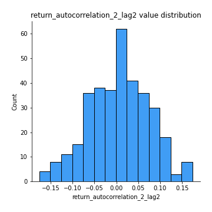
## Feature : return_autocorrelation_2_lag3
- **Feature type** : continous
- **Missing** : 0.0%
- **Unique** : 347
- **Count** :347.0
- **Mean** :0.015606852157050247
- **Std** :0.06453567277942972
- **Min** :-0.1798960840760737
- **25%th Percentile** : -0.02421950870652472
- **50%th Percentile** : 0.01565696597840974
- **75%th Percentile** : 0.05808667672659917
- **Max** :0.20220138248593864

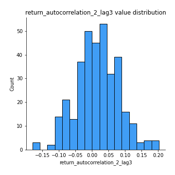
## Feature : return_correlation_ts1_lag_0
- **Feature type** : continous
- **Missing** : 0.0%
- **Unique** : 347
- **Count** :347.0
- **Mean** :0.3017136034927953
- **Std** :0.12728979716117172
- **Min** :-0.10256711281206837
- **25%th Percentile** : 0.23179968418769903
- **50%th Percentile** : 0.2963806237922425
- **75%th Percentile** : 0.36736063614125003
- **Max** :0.7227330027882508

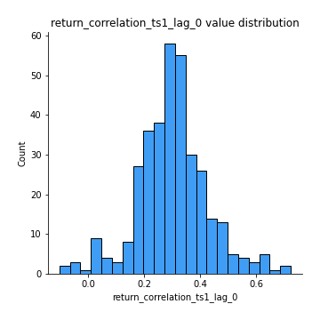
## Feature : return_correlation_ts1_lag_1
- **Feature type** : continous
- **Missing** : 0.0%
- **Unique** : 347
- **Count** :347.0
- **Mean** :0.013288358699009975
- **Std** :0.06444691134919944
- **Min** :-0.15763599636262018
- **25%th Percentile** : -0.03257444160528968
- **50%th Percentile** : 0.016691011395935155
- **75%th Percentile** : 0.05238319264011962
- **Max** :0.21403763493852637

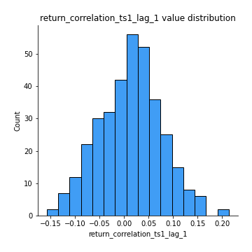
## Feature : return_correlation_ts1_lag_2
- **Feature type** : continous
- **Missing** : 0.0%
- **Unique** : 347
- **Count** :347.0
- **Mean** :0.01197305764168164
- **Std** :0.06902997136027864
- **Min** :-0.172871336111873
- **25%th Percentile** : -0.03424734789282686
- **50%th Percentile** : 0.014542299666950238
- **75%th Percentile** : 0.05743702334839075
- **Max** :0.19044597218104758

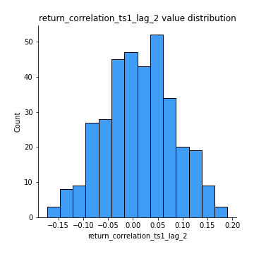
## Feature : return_correlation_ts1_lag_3
- **Feature type** : continous
- **Missing** : 0.0%
- **Unique** : 347
- **Count** :347.0
- **Mean** :0.016386773186513902
- **Std** :0.06901956487715827
- **Min** :-0.21147540839842804
- **25%th Percentile** : -0.030164094131247033
- **50%th Percentile** : 0.0174708025153031
- **75%th Percentile** : 0.058917077863223866
- **Max** :0.23808054096877584

## Feature : return_correlation_ts2_lag_1
- **Feature type** : continous
- **Missing** : 0.0%
- **Unique** : 347
- **Count** :347.0
- **Mean** :0.0163224705636984
- **Std** :0.0727052025896067
- **Min** :-0.17665751184419612
- **25%th Percentile** : -0.035328252741860106
- **50%th Percentile** : 0.014246365742466733
- **75%th Percentile** : 0.06535396821830777
- **Max** :0.3425036902091001

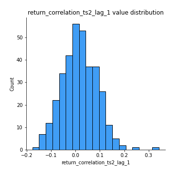
## Feature : return_correlation_ts2_lag_2
- **Feature type** : continous
- **Missing** : 0.0%
- **Unique** : 347
- **Count** :347.0
- **Mean** :0.008889779026497416
- **Std** :0.06902607384174728
- **Min** :-0.2757460186107768
- **25%th Percentile** : -0.030159358982027287
- **50%th Percentile** : 0.006288550952215767
- **75%th Percentile** : 0.05091266462509195
- **Max** :0.24472764024706184

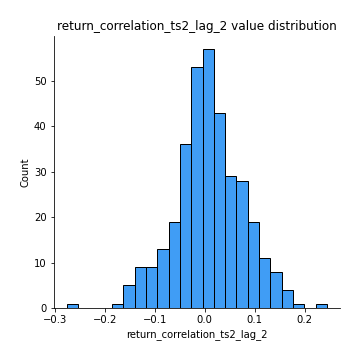
## Feature : return_correlation_ts2_lag_3
- **Feature type** : continous
- **Missing** : 0.0%
- **Unique** : 347
- **Count** :347.0
- **Mean** :0.020537433507145895
- **Std** :0.05719719705466154
- **Min** :-0.11563277594740727
- **25%th Percentile** : -0.021899482002906354
- **50%th Percentile** : 0.01906054338874816
- **75%th Percentile** : 0.06281896613185504
- **Max** :0.18227042221329348

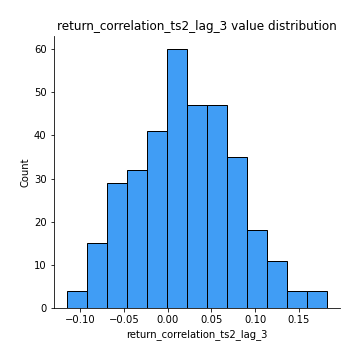
## Feature : sqreturn_autocorrelation_ts1_lag1
- **Feature type** : continous
- **Missing** : 0.0%
- **Unique** : 347
- **Count** :347.0
- **Mean** :0.034458498890722264
- **Std** :0.08181014286832371
- **Min** :-0.1486068613787847
- **25%th Percentile** : -0.023149689959542863
- **50%th Percentile** : 0.020759785037591117
- **75%th Percentile** : 0.07913393243618119
- **Max** :0.4170324090514868

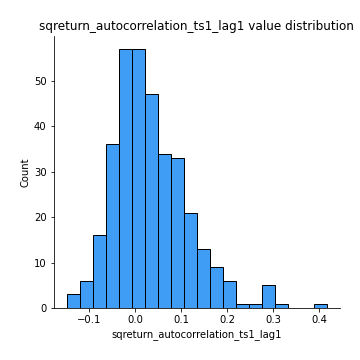
## Feature : sqreturn_autocorrelation_ts1_lag2
- **Feature type** : continous
- **Missing** : 0.0%
- **Unique** : 347
- **Count** :347.0
- **Mean** :0.01803269948357706
- **Std** :0.06863720469735447
- **Min** :-0.13936414109478765
- **25%th Percentile** : -0.029117483009388545
- **50%th Percentile** : 0.006363705846493107
- **75%th Percentile** : 0.05751856849571338
- **Max** :0.29415594530501293

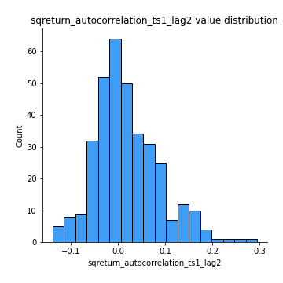
## Feature : sqreturn_autocorrelation_ts1_lag3
- **Feature type** : continous
- **Missing** : 0.0%
- **Unique** : 347
- **Count** :347.0
- **Mean** :0.011117650239960088
- **Std** :0.06285108575161837
- **Min** :-0.13922945107993434
- **25%th Percentile** : -0.03413587383948222
- **50%th Percentile** : 0.0005341391549706467
- **75%th Percentile** : 0.04308715832805038
- **Max** :0.36579865351615615

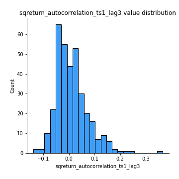
## Feature : sqreturn_autocorrelation_ts2_lag1
- **Feature type** : continous
- **Missing** : 0.0%
- **Unique** : 347
- **Count** :347.0
- **Mean** :0.02579264648061527
- **Std** :0.07500442763303963
- **Min** :-0.133027351927754
- **25%th Percentile** : -0.02130473082061421
- **50%th Percentile** : 0.015488459753505305
- **75%th Percentile** : 0.06526553386859707
- **Max** :0.3533869018400006

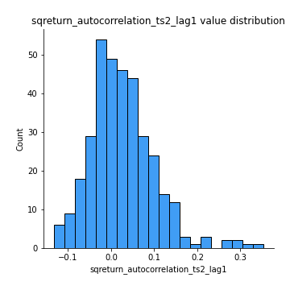
## Feature : sqreturn_autocorrelation_ts2_lag2
- **Feature type** : continous
- **Missing** : 0.0%
- **Unique** : 347
- **Count** :347.0
- **Mean** :0.008636594590190578
- **Std** :0.05742526081688898
- **Min** :-0.13673805865920308
- **25%th Percentile** : -0.028007729226061824
- **50%th Percentile** : -0.0014273963397883284
- **75%th Percentile** : 0.040228133737705896
- **Max** :0.2357173664732939

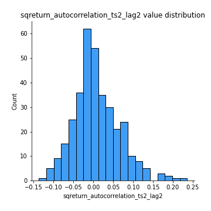
## Feature : sqreturn_autocorrelation_ts2_lag3
- **Feature type** : continous
- **Missing** : 0.0%
- **Unique** : 347
- **Count** :347.0
- **Mean** :0.008293454643503324
- **Std** :0.0639028806416403
- **Min** :-0.11712199996057304
- **25%th Percentile** : -0.03277737817203839
- **50%th Percentile** : -0.0020668752600599065
- **75%th Percentile** : 0.039907666861455166
- **Max** :0.3463122340368414

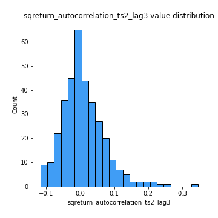
## Feature : sqreturn_correlation_ts1_lag_0
- **Feature type** : continous
- **Missing** : 0.0%
- **Unique** : 347
- **Count** :347.0
- **Mean** :0.3017136034927953
- **Std** :0.12728979716117172
- **Min** :-0.10256711281206837
- **25%th Percentile** : 0.23179968418769903
- **50%th Percentile** : 0.2963806237922425
- **75%th Percentile** : 0.36736063614125003
- **Max** :0.7227330027882508

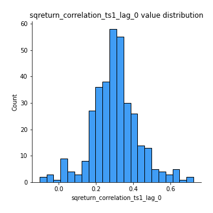
## Feature : sqreturn_correlation_ts1_lag_1
- **Feature type** : continous
- **Missing** : 0.0%
- **Unique** : 347
- **Count** :347.0
- **Mean** :0.013288358699009975
- **Std** :0.06444691134919944
- **Min** :-0.15763599636262018
- **25%th Percentile** : -0.03257444160528968
- **50%th Percentile** : 0.016691011395935155
- **75%th Percentile** : 0.05238319264011962
- **Max** :0.21403763493852637

## Feature : sqreturn_correlation_ts1_lag_2
- **Feature type** : continous
- **Missing** : 0.0%
- **Unique** : 347
- **Count** :347.0
- **Mean** :0.01197305764168164
- **Std** :0.06902997136027864
- **Min** :-0.172871336111873
- **25%th Percentile** : -0.03424734789282686
- **50%th Percentile** : 0.014542299666950238
- **75%th Percentile** : 0.05743702334839075
- **Max** :0.19044597218104758

## Feature : sqreturn_correlation_ts1_lag_3
- **Feature type** : continous
- **Missing** : 0.0%
- **Unique** : 347
- **Count** :347.0
- **Mean** :0.016386773186513902
- **Std** :0.06901956487715827
- **Min** :-0.21147540839842804
- **25%th Percentile** : -0.030164094131247033
- **50%th Percentile** : 0.0174708025153031
- **75%th Percentile** : 0.058917077863223866
- **Max** :0.23808054096877584

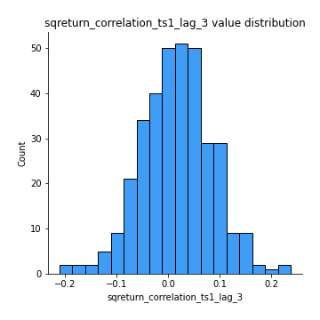
## Feature : sqreturn_correlation_ts2_lag_1
- **Feature type** : continous
- **Missing** : 0.0%
- **Unique** : 347
- **Count** :347.0
- **Mean** :0.0163224705636984
- **Std** :0.0727052025896067
- **Min** :-0.17665751184419612
- **25%th Percentile** : -0.035328252741860106
- **50%th Percentile** : 0.014246365742466733
- **75%th Percentile** : 0.06535396821830777
- **Max** :0.3425036902091001

## Feature : sqreturn_correlation_ts2_lag_2
- **Feature type** : continous
- **Missing** : 0.0%
- **Unique** : 347
- **Count** :347.0
- **Mean** :0.008889779026497416
- **Std** :0.06902607384174728
- **Min** :-0.2757460186107768
- **25%th Percentile** : -0.030159358982027287
- **50%th Percentile** : 0.006288550952215767
- **75%th Percentile** : 0.05091266462509195
- **Max** :0.24472764024706184

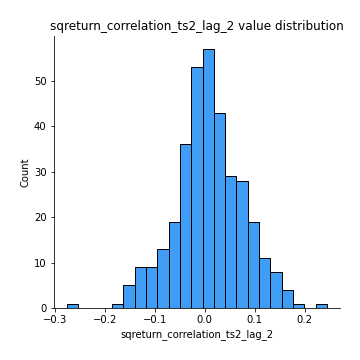
## Feature : sqreturn_correlation_ts2_lag_3
- **Feature type** : continous
- **Missing** : 0.0%
- **Unique** : 347
- **Count** :347.0
- **Mean** :0.020537433507145895
- **Std** :0.05719719705466154
- **Min** :-0.11563277594740727
- **25%th Percentile** : -0.021899482002906354
- **50%th Percentile** : 0.01906054338874816
- **75%th Percentile** : 0.06281896613185504
- **Max** :0.18227042221329348

## Feature : price2_granger_cause_price1
- **Feature type** : continous
- **Missing** : 0.0%
- **Unique** : 347
- **Count** :347.0
- **Mean** :0.25168022138053964
- **Std** :0.28477325085711497
- **Min** :2.4312048970873696e-09
- **25%th Percentile** : 0.015386547447080987
- **50%th Percentile** : 0.1316572284002982
- **75%th Percentile** : 0.4142456036151156
- **Max** :0.9896589131294532

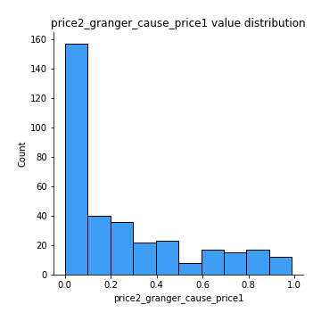
## Feature : price1_granger_cause_price2
- **Feature type** : continous
- **Missing** : 0.0%
- **Unique** : 347
- **Count** :347.0
- **Mean** :0.23967421366087122
- **Std** :0.27228137816560355
- **Min** :1.2012269232170316e-11
- **25%th Percentile** : 0.013853559669375133
- **50%th Percentile** : 0.12932250540293164
- **75%th Percentile** : 0.3686227025460043
- **Max** :0.9873041351762191

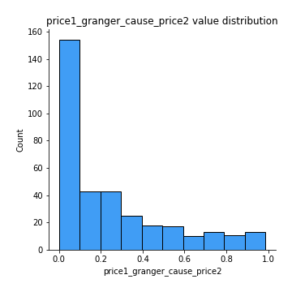

[<< Go back](../README.md)
