# Summary of 3_Linear

[<< Go back](../README.md)

## Logistic Regression (Linear)
- **n_jobs**: -1
- **explain_level**: 2

## Validation
 - **validation_type**: split
 - **train_ratio**: 0.75
 - **shuffle**: True
 - **stratify**: True

## Optimized metric
accuracy

## Training time

3.7 seconds

## Metric details
|           |    score |     threshold |
|:----------|---------:|--------------:|
| logloss   | 0.162288 | nan           |
| auc       | 0.995758 | nan           |
| f1        | 0.964706 |   0.411563    |
| accuracy  | 0.965517 |   0.411563    |
| precision | 1        |   0.902841    |
| recall    | 1        |   5.63387e-10 |
| mcc       | 0.933299 |   0.411563    |

## Confusion matrix (at threshold=0.411563)
|                      |   Predicted as real |   Predicted as simulated |
|:---------------------|--------------------:|-------------------------:|
| Labeled as real      |                  43 |                        3 |
| Labeled as simulated |                   0 |                       41 |

## Learning curves
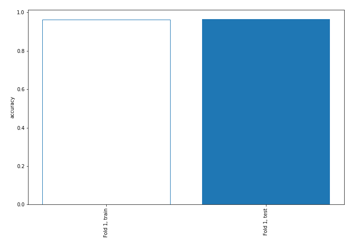

## Coefficients
| feature                           |   Learner_1 |
|:----------------------------------|------------:|
| return_skew1                      |   1.77537   |
| return_autocorrelation_1_lag2     |   0.820562  |
| return_autocorrelation_1_lag1     |   0.745409  |
| sqreturn_correlation_ts1_lag_1    |   0.555417  |
| return_correlation_ts1_lag_1      |   0.555417  |
| sqreturn_correlation_ts1_lag_2    |   0.535439  |
| return_correlation_ts1_lag_2      |   0.535439  |
| return_skew2                      |   0.516798  |
| return_correlation_ts2_lag_2      |   0.491229  |
| sqreturn_correlation_ts2_lag_2    |   0.491229  |
| return_autocorrelation_2_lag2     |   0.461299  |
| return_autocorrelation_2_lag1     |   0.383346  |
| sqreturn_correlation_ts2_lag_1    |   0.334773  |
| return_correlation_ts2_lag_1      |   0.334773  |
| return_mean1                      |   0.204278  |
| return_sd2                        |   0.184106  |
| return_sd1                        |   0.148916  |
| sqreturn_correlation_ts1_lag_3    |   0.0129896 |
| return_correlation_ts1_lag_3      |   0.0129896 |
| return_autocorrelation_1_lag3     |  -0.013274  |
| return_autocorrelation_2_lag3     |  -0.0890465 |
| return_mean2                      |  -0.151419  |
| sqreturn_correlation_ts2_lag_3    |  -0.265245  |
| return_correlation_ts2_lag_3      |  -0.265245  |
| intercept                         |  -0.371149  |
| sqreturn_autocorrelation_ts1_lag3 |  -0.581268  |
| price1_granger_cause_price2       |  -0.648846  |
| price2_granger_cause_price1       |  -0.675384  |
| sqreturn_correlation_ts1_lag_0    |  -0.700664  |
| return_correlation_ts1_lag_0      |  -0.700664  |
| sqreturn_autocorrelation_ts2_lag3 |  -0.757675  |
| sqreturn_autocorrelation_ts1_lag2 |  -0.962346  |
| sqreturn_autocorrelation_ts2_lag2 |  -0.976472  |
| sqreturn_autocorrelation_ts2_lag1 |  -1.08763   |
| sqreturn_autocorrelation_ts1_lag1 |  -1.49479   |
| return_kurtosis2                  |  -2.669     |
| return_kurtosis1                  |  -2.9941    |

## Permutation-based Importance
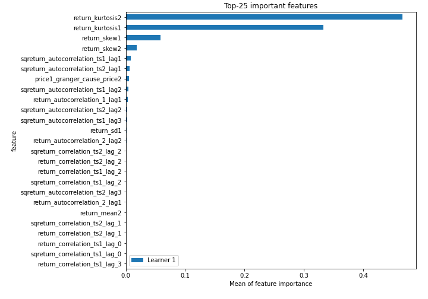
## Confusion Matrix

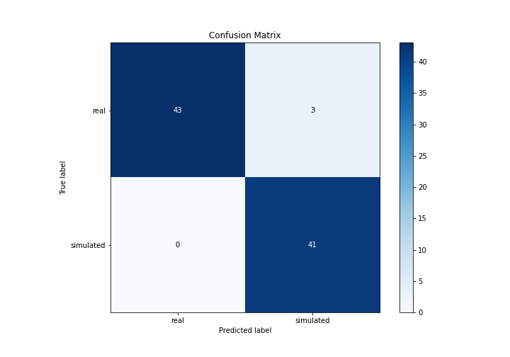

## Normalized Confusion Matrix

## ROC Curve

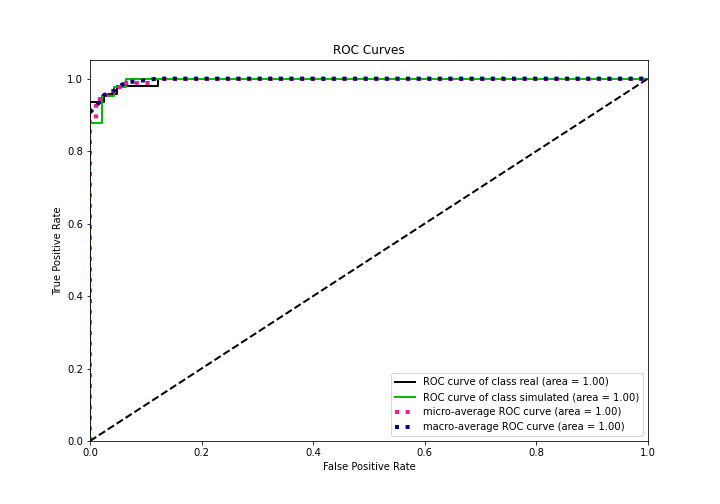

## Kolmogorov-Smirnov Statistic

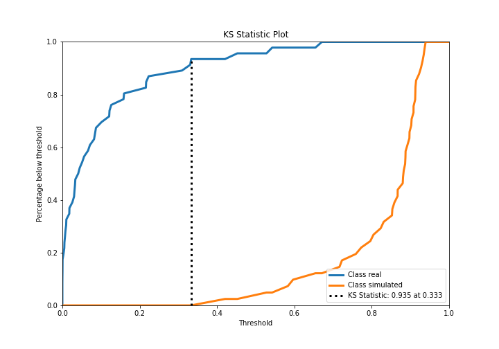

## Precision-Recall Curve

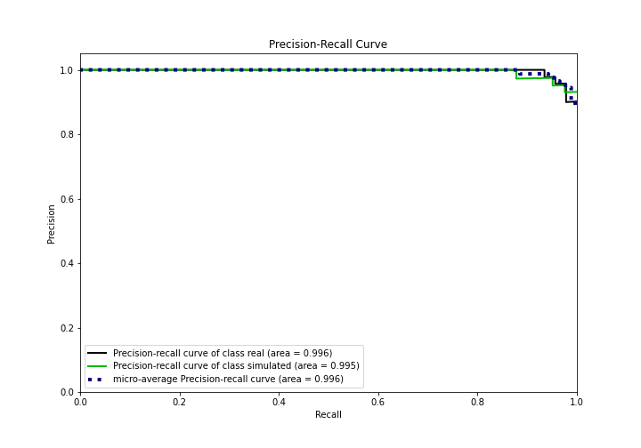

## Calibration Curve

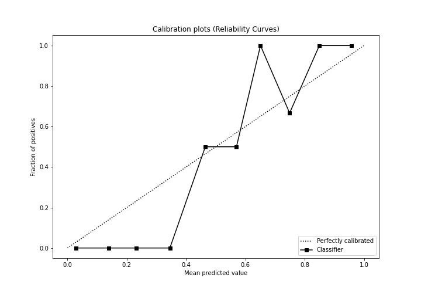

## Cumulative Gains Curve

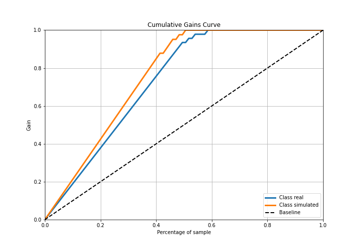

## Lift Curve

## SHAP Importance
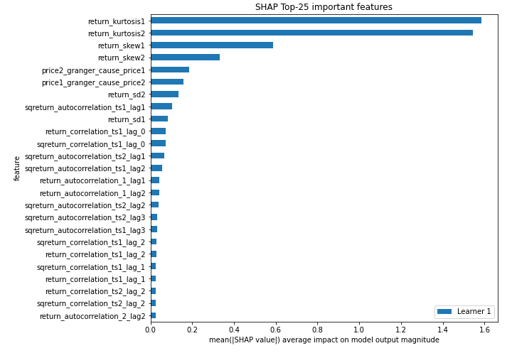

## SHAP Dependence plots

### Dependence (Fold 1)
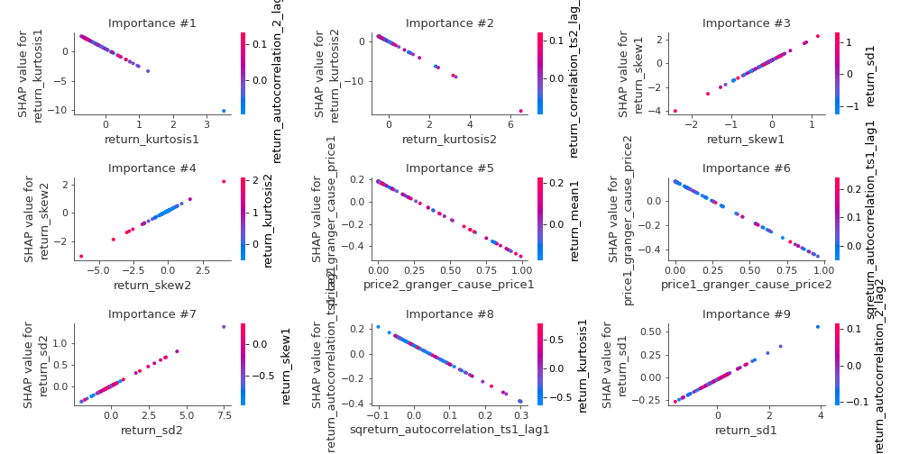

## SHAP Decision plots

### Top-10 Worst decisions for class 0 (Fold 1)
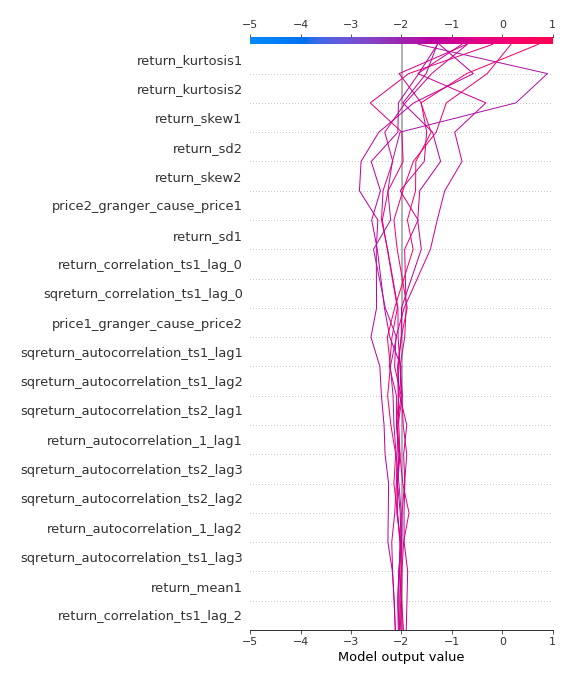
### Top-10 Best decisions for class 0 (Fold 1)

### Top-10 Worst decisions for class 1 (Fold 1)
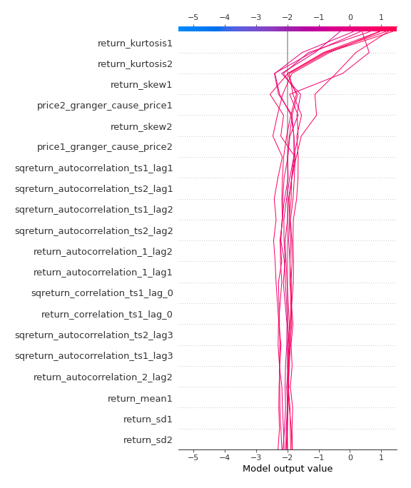
### Top-10 Best decisions for class 1 (Fold 1)
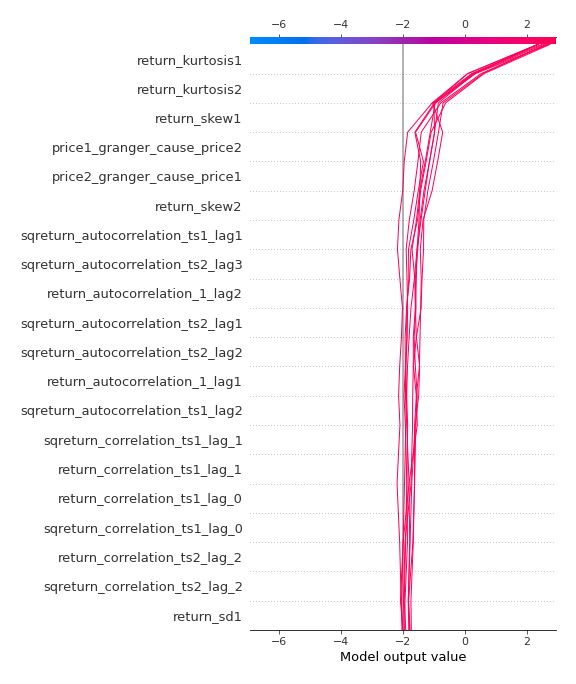

[<< Go back](../README.md)
