# Exploratory Data Analysis

[<< Go back](../README.md)
## Feature : target
- **Feature type** : categorical
- **Missing** : 0.0%
- **Unique** : 2
- **Count** :347
- **Unique** :2
- **Top** :real
- **Freq** :183

## Feature : return_mean1
- **Feature type** : continous
- **Missing** : 0.0%
- **Unique** : 347
- **Count** :347.0
- **Mean** :0.03203616069176513
- **Std** :0.11701251703841133
- **Min** :-0.33078016216013423
- **25%th Percentile** : -0.040024311472765514
- **50%th Percentile** : 0.04682970549818338
- **75%th Percentile** : 0.11933075518603899
- **Max** :0.3602793017097547

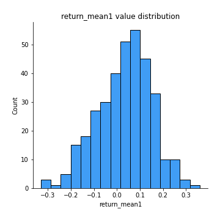
## Feature : return_mean2
- **Feature type** : continous
- **Missing** : 0.0%
- **Unique** : 347
- **Count** :347.0
- **Mean** :0.012181547174997857
- **Std** :0.1238919889488518
- **Min** :-0.5118605987974881
- **25%th Percentile** : -0.06259675603298509
- **50%th Percentile** : 0.01458979652329942
- **75%th Percentile** : 0.095737070136536
- **Max** :0.6801605239983173

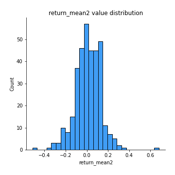
## Feature : return_sd1
- **Feature type** : continous
- **Missing** : 0.0%
- **Unique** : 347
- **Count** :347.0
- **Mean** :1.642213143688336
- **Std** :0.3612352184413511
- **Min** :0.8733078831717243
- **25%th Percentile** : 1.5004516017956764
- **50%th Percentile** : 1.6239519936028382
- **75%th Percentile** : 1.7200524994085895
- **Max** :3.332494027875222

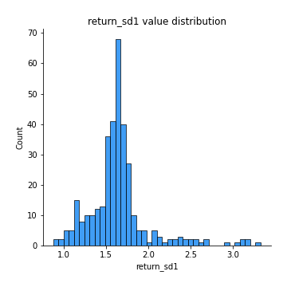
## Feature : return_sd2
- **Feature type** : continous
- **Missing** : 0.0%
- **Unique** : 347
- **Count** :347.0
- **Mean** :1.6871341322544617
- **Std** :0.42976725013020617
- **Min** :0.8198779632289204
- **25%th Percentile** : 1.5168730646772437
- **50%th Percentile** : 1.6438971396992546
- **75%th Percentile** : 1.7436469874708216
- **Max** :4.59233049161685

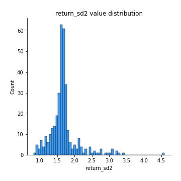
## Feature : return_skew1
- **Feature type** : continous
- **Missing** : 0.0%
- **Unique** : 347
- **Count** :347.0
- **Mean** :-0.11945580381824981
- **Std** :0.5853108554479151
- **Min** :-2.5068500114696386
- **25%th Percentile** : -0.35679561176032504
- **50%th Percentile** : -0.06979018061824388
- **75%th Percentile** : 0.12086339804818055
- **Max** :2.351757728252051

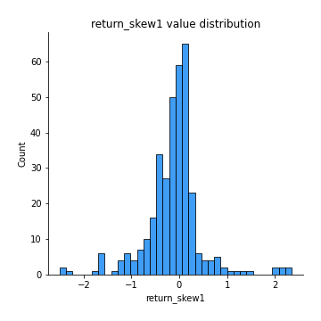
## Feature : return_skew2
- **Feature type** : continous
- **Missing** : 0.0%
- **Unique** : 347
- **Count** :347.0
- **Mean** :-0.2904864885037041
- **Std** :1.0325115887249516
- **Min** :-7.3762354994385335
- **25%th Percentile** : -0.4187212150539634
- **50%th Percentile** : -0.09632630748274318
- **75%th Percentile** : 0.07273798305062142
- **Max** :4.1920266082732045

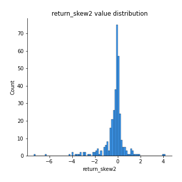
## Feature : return_kurtosis1
- **Feature type** : continous
- **Missing** : 0.0%
- **Unique** : 347
- **Count** :347.0
- **Mean** :2.445694681456186
- **Std** :4.026131934179393
- **Min** :-0.5242725291406605
- **25%th Percentile** : 0.11017047242879396
- **50%th Percentile** : 1.1215975038719685
- **75%th Percentile** : 2.8689848608081436
- **Max** :23.612665658846073

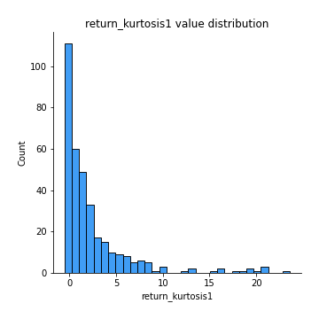
## Feature : return_kurtosis2
- **Feature type** : continous
- **Missing** : 0.0%
- **Unique** : 347
- **Count** :347.0
- **Mean** :4.340336064936062
- **Std** :9.432531511971314
- **Min** :-0.5570399398099584
- **25%th Percentile** : 0.05182312092326735
- **50%th Percentile** : 1.1080890409609423
- **75%th Percentile** : 3.780767926449108
- **Max** :94.01659180149953

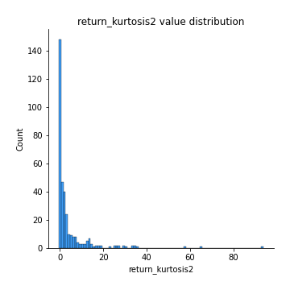
## Feature : return_autocorrelation_1_lag1
- **Feature type** : continous
- **Missing** : 0.0%
- **Unique** : 347
- **Count** :347.0
- **Mean** :0.004862234451562102
- **Std** :0.06985229293846645
- **Min** :-0.2110198016529991
- **25%th Percentile** : -0.04557057478669295
- **50%th Percentile** : 0.006369792626959657
- **75%th Percentile** : 0.048739991644569394
- **Max** :0.20132571463207988

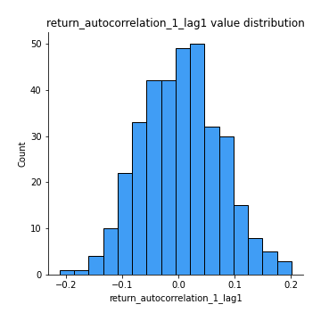
## Feature : return_autocorrelation_1_lag2
- **Feature type** : continous
- **Missing** : 0.0%
- **Unique** : 347
- **Count** :347.0
- **Mean** :0.0022208087398964166
- **Std** :0.0671095330309006
- **Min** :-0.18815240041143846
- **25%th Percentile** : -0.04342314180863037
- **50%th Percentile** : -0.0001919126933868021
- **75%th Percentile** : 0.049064539899822915
- **Max** :0.21123611097039302

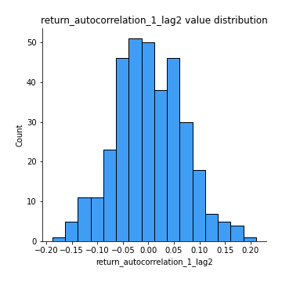
## Feature : return_autocorrelation_1_lag3
- **Feature type** : continous
- **Missing** : 0.0%
- **Unique** : 347
- **Count** :347.0
- **Mean** :0.015142469332227529
- **Std** :0.06269947440675114
- **Min** :-0.1817944619132489
- **25%th Percentile** : -0.026102923854057714
- **50%th Percentile** : 0.02098152194791798
- **75%th Percentile** : 0.05972478701487356
- **Max** :0.17514033413395239

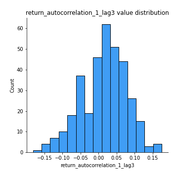
## Feature : return_autocorrelation_2_lag1
- **Feature type** : continous
- **Missing** : 0.0%
- **Unique** : 347
- **Count** :347.0
- **Mean** :0.01164593958116927
- **Std** :0.0663049663333136
- **Min** :-0.17778763204400128
- **25%th Percentile** : -0.03166453743997224
- **50%th Percentile** : 0.011218149718501496
- **75%th Percentile** : 0.05648485131854858
- **Max** :0.17275605168868305

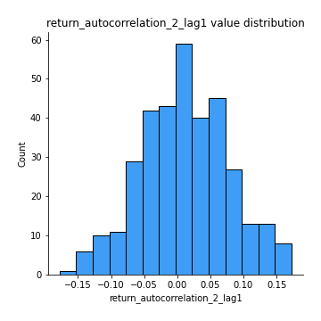
## Feature : return_autocorrelation_2_lag2
- **Feature type** : continous
- **Missing** : 0.0%
- **Unique** : 347
- **Count** :347.0
- **Mean** :0.00224566852644683
- **Std** :0.06951146492593656
- **Min** :-0.19638251082464045
- **25%th Percentile** : -0.04337760885367038
- **50%th Percentile** : 0.0037265079466781512
- **75%th Percentile** : 0.04708699253857283
- **Max** :0.21164178753780125

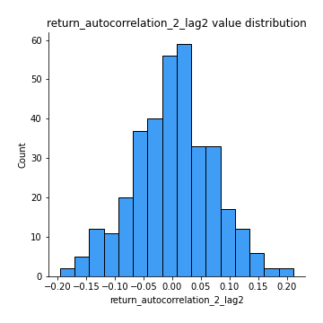
## Feature : return_autocorrelation_2_lag3
- **Feature type** : continous
- **Missing** : 0.0%
- **Unique** : 347
- **Count** :347.0
- **Mean** :0.0145486601295683
- **Std** :0.061197715865336004
- **Min** :-0.1794902936808312
- **25%th Percentile** : -0.025672227794161964
- **50%th Percentile** : 0.018417297584848134
- **75%th Percentile** : 0.05587832522477787
- **Max** :0.20205753622966244

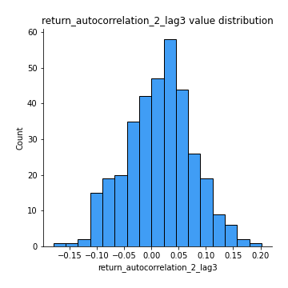
## Feature : return_correlation_ts1_lag_0
- **Feature type** : continous
- **Missing** : 0.0%
- **Unique** : 347
- **Count** :347.0
- **Mean** :0.3110404814595932
- **Std** :0.13490205023265933
- **Min** :-0.10256711281206837
- **25%th Percentile** : 0.23388703204412992
- **50%th Percentile** : 0.30706793110805136
- **75%th Percentile** : 0.3836791528949441
- **Max** :0.9937227277077512

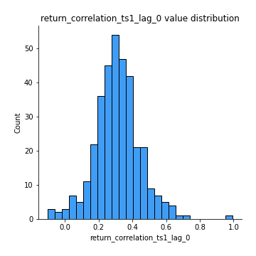
## Feature : return_correlation_ts1_lag_1
- **Feature type** : continous
- **Missing** : 0.0%
- **Unique** : 347
- **Count** :347.0
- **Mean** :0.010373210147191728
- **Std** :0.06593252974546146
- **Min** :-0.15677175865116447
- **25%th Percentile** : -0.03467412746674627
- **50%th Percentile** : 0.005241753428187819
- **75%th Percentile** : 0.05243029864057688
- **Max** :0.2574383176141838

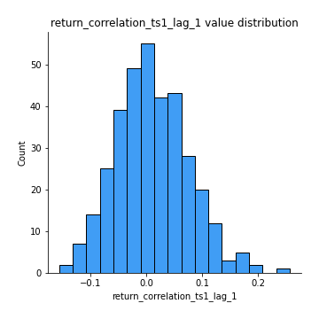
## Feature : return_correlation_ts1_lag_2
- **Feature type** : continous
- **Missing** : 0.0%
- **Unique** : 347
- **Count** :347.0
- **Mean** :0.007560755245517343
- **Std** :0.06655335254426634
- **Min** :-0.16038742223567365
- **25%th Percentile** : -0.03679620883518681
- **50%th Percentile** : 0.00470539678439776
- **75%th Percentile** : 0.05401327459266454
- **Max** :0.18937102858178073

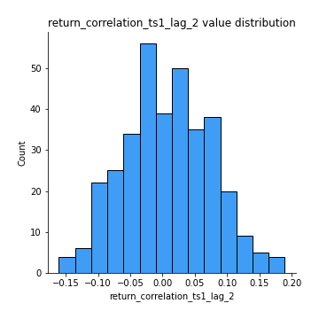
## Feature : return_correlation_ts1_lag_3
- **Feature type** : continous
- **Missing** : 0.0%
- **Unique** : 347
- **Count** :347.0
- **Mean** :0.016434460641800253
- **Std** :0.06532390960458391
- **Min** :-0.21147540839842804
- **25%th Percentile** : -0.02530010568718978
- **50%th Percentile** : 0.017456713032193767
- **75%th Percentile** : 0.05669304871496353
- **Max** :0.23808054096877584

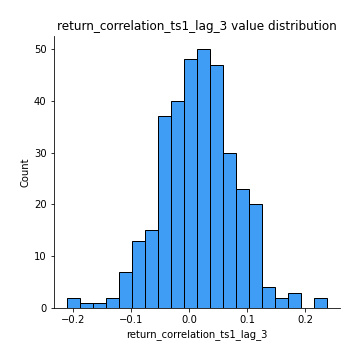
## Feature : return_correlation_ts2_lag_1
- **Feature type** : continous
- **Missing** : 0.0%
- **Unique** : 347
- **Count** :347.0
- **Mean** :0.014800317616443737
- **Std** :0.06555287895546655
- **Min** :-0.17665751184419612
- **25%th Percentile** : -0.028723969956049977
- **50%th Percentile** : 0.013522318745555617
- **75%th Percentile** : 0.06226644592167983
- **Max** :0.17362568353307611

## Feature : return_correlation_ts2_lag_2
- **Feature type** : continous
- **Missing** : 0.0%
- **Unique** : 347
- **Count** :347.0
- **Mean** :0.0065793876579689015
- **Std** :0.0661396236753482
- **Min** :-0.2757460186107768
- **25%th Percentile** : -0.03160374244796638
- **50%th Percentile** : 0.003886520561515649
- **75%th Percentile** : 0.05040535189748774
- **Max** :0.17540204331826031

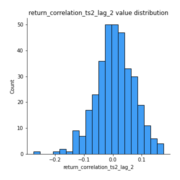
## Feature : return_correlation_ts2_lag_3
- **Feature type** : continous
- **Missing** : 0.0%
- **Unique** : 347
- **Count** :347.0
- **Mean** :0.01537343814053865
- **Std** :0.06166148386370305
- **Min** :-0.17697863431182184
- **25%th Percentile** : -0.024740207457888255
- **50%th Percentile** : 0.016473119730738887
- **75%th Percentile** : 0.056651768709158515
- **Max** :0.18227042221329348

## Feature : sqreturn_autocorrelation_ts1_lag1
- **Feature type** : continous
- **Missing** : 0.0%
- **Unique** : 347
- **Count** :347.0
- **Mean** :0.035088576165466415
- **Std** :0.08503585546294799
- **Min** :-0.13232952939560144
- **25%th Percentile** : -0.02397591754921992
- **50%th Percentile** : 0.01728004688693481
- **75%th Percentile** : 0.08151207683146403
- **Max** :0.4170324090514868

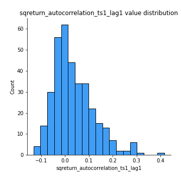
## Feature : sqreturn_autocorrelation_ts1_lag2
- **Feature type** : continous
- **Missing** : 0.0%
- **Unique** : 347
- **Count** :347.0
- **Mean** :0.018419788526254616
- **Std** :0.07077267768953639
- **Min** :-0.16670613539505258
- **25%th Percentile** : -0.028911378418600708
- **50%th Percentile** : 0.005536495748600666
- **75%th Percentile** : 0.056942935581344
- **Max** :0.32836952056190194

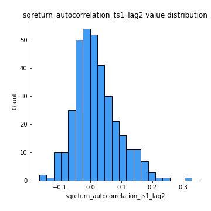
## Feature : sqreturn_autocorrelation_ts1_lag3
- **Feature type** : continous
- **Missing** : 0.0%
- **Unique** : 347
- **Count** :347.0
- **Mean** :0.011627355516488636
- **Std** :0.0648508587341389
- **Min** :-0.13867426340622796
- **25%th Percentile** : -0.031687480795172945
- **50%th Percentile** : 0.0032304897496262595
- **75%th Percentile** : 0.05157297255497825
- **Max** :0.23856108238097126

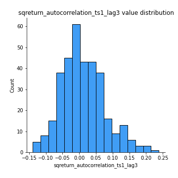
## Feature : sqreturn_autocorrelation_ts2_lag1
- **Feature type** : continous
- **Missing** : 0.0%
- **Unique** : 347
- **Count** :347.0
- **Mean** :0.025326240696935277
- **Std** :0.07192446198358626
- **Min** :-0.17810651839886768
- **25%th Percentile** : -0.022960283644363026
- **50%th Percentile** : 0.014416991287045357
- **75%th Percentile** : 0.06247955842898524
- **Max** :0.3459234668044924

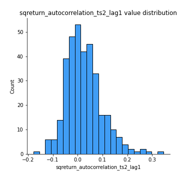
## Feature : sqreturn_autocorrelation_ts2_lag2
- **Feature type** : continous
- **Missing** : 0.0%
- **Unique** : 347
- **Count** :347.0
- **Mean** :0.008533332930109957
- **Std** :0.06132316873850239
- **Min** :-0.1433589892012732
- **25%th Percentile** : -0.02561213501429923
- **50%th Percentile** : -0.001541939948100058
- **75%th Percentile** : 0.03716811702979448
- **Max** :0.25057436061622956

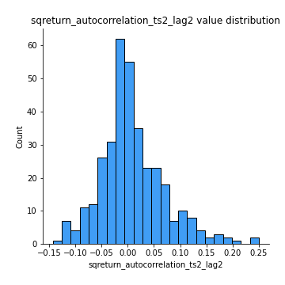
## Feature : sqreturn_autocorrelation_ts2_lag3
- **Feature type** : continous
- **Missing** : 0.0%
- **Unique** : 347
- **Count** :347.0
- **Mean** :0.006453609815004211
- **Std** :0.061928948185103354
- **Min** :-0.1474818674781312
- **25%th Percentile** : -0.02971354739725229
- **50%th Percentile** : -0.001065838486750333
- **75%th Percentile** : 0.03310361607129354
- **Max** :0.3463122340368414

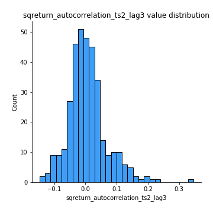
## Feature : sqreturn_correlation_ts1_lag_0
- **Feature type** : continous
- **Missing** : 0.0%
- **Unique** : 347
- **Count** :347.0
- **Mean** :0.3110404814595932
- **Std** :0.13490205023265933
- **Min** :-0.10256711281206837
- **25%th Percentile** : 0.23388703204412992
- **50%th Percentile** : 0.30706793110805136
- **75%th Percentile** : 0.3836791528949441
- **Max** :0.9937227277077512

## Feature : sqreturn_correlation_ts1_lag_1
- **Feature type** : continous
- **Missing** : 0.0%
- **Unique** : 347
- **Count** :347.0
- **Mean** :0.010373210147191728
- **Std** :0.06593252974546146
- **Min** :-0.15677175865116447
- **25%th Percentile** : -0.03467412746674627
- **50%th Percentile** : 0.005241753428187819
- **75%th Percentile** : 0.05243029864057688
- **Max** :0.2574383176141838

## Feature : sqreturn_correlation_ts1_lag_2
- **Feature type** : continous
- **Missing** : 0.0%
- **Unique** : 347
- **Count** :347.0
- **Mean** :0.007560755245517343
- **Std** :0.06655335254426634
- **Min** :-0.16038742223567365
- **25%th Percentile** : -0.03679620883518681
- **50%th Percentile** : 0.00470539678439776
- **75%th Percentile** : 0.05401327459266454
- **Max** :0.18937102858178073

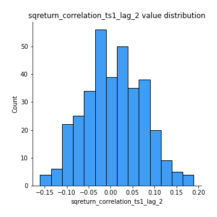
## Feature : sqreturn_correlation_ts1_lag_3
- **Feature type** : continous
- **Missing** : 0.0%
- **Unique** : 347
- **Count** :347.0
- **Mean** :0.016434460641800253
- **Std** :0.06532390960458391
- **Min** :-0.21147540839842804
- **25%th Percentile** : -0.02530010568718978
- **50%th Percentile** : 0.017456713032193767
- **75%th Percentile** : 0.05669304871496353
- **Max** :0.23808054096877584

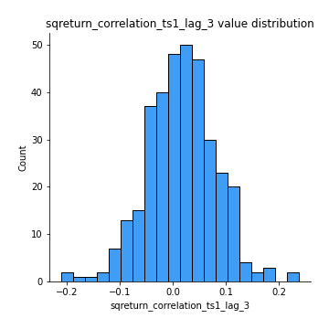
## Feature : sqreturn_correlation_ts2_lag_1
- **Feature type** : continous
- **Missing** : 0.0%
- **Unique** : 347
- **Count** :347.0
- **Mean** :0.014800317616443737
- **Std** :0.06555287895546655
- **Min** :-0.17665751184419612
- **25%th Percentile** : -0.028723969956049977
- **50%th Percentile** : 0.013522318745555617
- **75%th Percentile** : 0.06226644592167983
- **Max** :0.17362568353307611

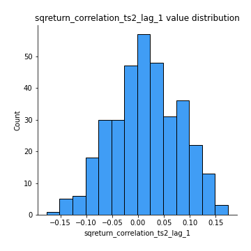
## Feature : sqreturn_correlation_ts2_lag_2
- **Feature type** : continous
- **Missing** : 0.0%
- **Unique** : 347
- **Count** :347.0
- **Mean** :0.0065793876579689015
- **Std** :0.0661396236753482
- **Min** :-0.2757460186107768
- **25%th Percentile** : -0.03160374244796638
- **50%th Percentile** : 0.003886520561515649
- **75%th Percentile** : 0.05040535189748774
- **Max** :0.17540204331826031

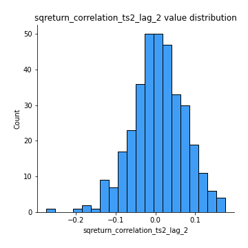
## Feature : sqreturn_correlation_ts2_lag_3
- **Feature type** : continous
- **Missing** : 0.0%
- **Unique** : 347
- **Count** :347.0
- **Mean** :0.01537343814053865
- **Std** :0.06166148386370305
- **Min** :-0.17697863431182184
- **25%th Percentile** : -0.024740207457888255
- **50%th Percentile** : 0.016473119730738887
- **75%th Percentile** : 0.056651768709158515
- **Max** :0.18227042221329348

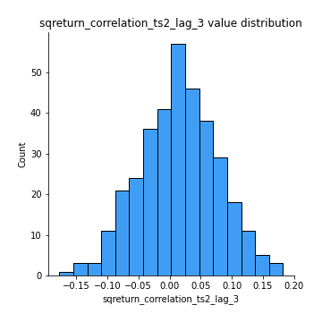
## Feature : price2_granger_cause_price1
- **Feature type** : continous
- **Missing** : 0.0%
- **Unique** : 347
- **Count** :347.0
- **Mean** :0.25012406292334005
- **Std** :0.28855310124475514
- **Min** :4.572943499866704e-06
- **25%th Percentile** : 0.016885740686667164
- **50%th Percentile** : 0.110759348549784
- **75%th Percentile** : 0.41971862060022114
- **Max** :0.9898380228448623

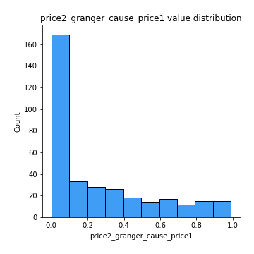
## Feature : price1_granger_cause_price2
- **Feature type** : continous
- **Missing** : 0.0%
- **Unique** : 347
- **Count** :347.0
- **Mean** :0.26027537158110925
- **Std** :0.2838014156329682
- **Min** :1.946402129003528e-06
- **25%th Percentile** : 0.016961658346416095
- **50%th Percentile** : 0.14134078470401001
- **75%th Percentile** : 0.4303396226793946
- **Max** :0.9857283881749882

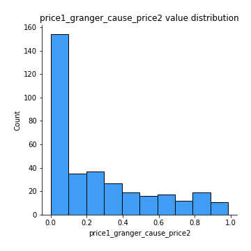

[<< Go back](../README.md)
