# Summary of 3_Linear

[<< Go back](../README.md)

## Logistic Regression (Linear)
- **n_jobs**: -1
- **explain_level**: 2

## Validation
 - **validation_type**: split
 - **train_ratio**: 0.75
 - **shuffle**: True
 - **stratify**: True

## Optimized metric
accuracy

## Training time

4.5 seconds

## Metric details
|           |    score |     threshold |
|:----------|---------:|--------------:|
| logloss   | 0.194425 | nan           |
| auc       | 0.991015 | nan           |
| f1        | 0.955556 |   0.614625    |
| accuracy  | 0.954023 |   0.614625    |
| precision | 1        |   0.815219    |
| recall    | 1        |   1.01181e-17 |
| mcc       | 0.911988 |   0.815219    |

## Confusion matrix (at threshold=0.614625)
|                      |   Predicted as real |   Predicted as simulated |
|:---------------------|--------------------:|-------------------------:|
| Labeled as real      |                  40 |                        3 |
| Labeled as simulated |                   1 |                       43 |

## Learning curves
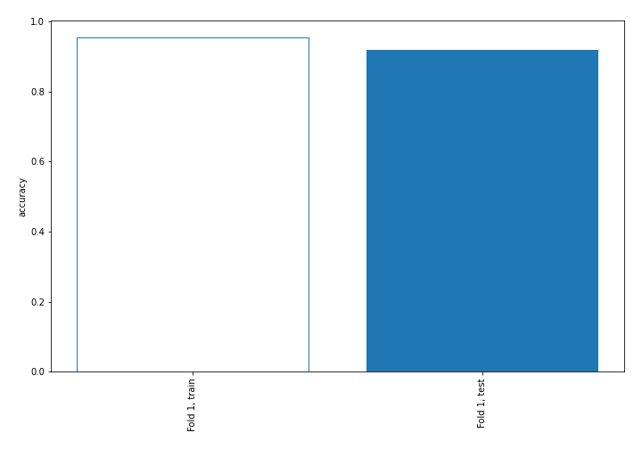

## Coefficients
| feature                           |   Learner_1 |
|:----------------------------------|------------:|
| return_skew2                      |   1.10663   |
| return_autocorrelation_2_lag2     |   0.96374   |
| return_autocorrelation_1_lag1     |   0.824317  |
| return_correlation_ts2_lag_2      |   0.737598  |
| sqreturn_correlation_ts2_lag_2    |   0.737598  |
| return_skew1                      |   0.676328  |
| return_autocorrelation_1_lag2     |   0.657081  |
| sqreturn_correlation_ts1_lag_2    |   0.63973   |
| return_correlation_ts1_lag_2      |   0.63973   |
| sqreturn_correlation_ts1_lag_1    |   0.576189  |
| return_correlation_ts1_lag_1      |   0.576189  |
| sqreturn_correlation_ts2_lag_1    |   0.319361  |
| return_correlation_ts2_lag_1      |   0.319361  |
| return_autocorrelation_2_lag1     |   0.302245  |
| return_sd1                        |   0.240697  |
| return_sd2                        |   0.218236  |
| return_autocorrelation_1_lag3     |   0.171639  |
| sqreturn_correlation_ts1_lag_3    |  -0.0489782 |
| return_correlation_ts1_lag_3      |  -0.0489782 |
| intercept                         |  -0.0525828 |
| return_autocorrelation_2_lag3     |  -0.130184  |
| sqreturn_correlation_ts2_lag_3    |  -0.131405  |
| return_correlation_ts2_lag_3      |  -0.131405  |
| return_mean1                      |  -0.286033  |
| sqreturn_autocorrelation_ts2_lag2 |  -0.382204  |
| sqreturn_autocorrelation_ts1_lag3 |  -0.425521  |
| price1_granger_cause_price2       |  -0.460653  |
| sqreturn_autocorrelation_ts2_lag3 |  -0.495923  |
| price2_granger_cause_price1       |  -0.55702   |
| return_mean2                      |  -0.627945  |
| sqreturn_autocorrelation_ts1_lag2 |  -0.820807  |
| return_correlation_ts1_lag_0      |  -0.898891  |
| sqreturn_correlation_ts1_lag_0    |  -0.898891  |
| sqreturn_autocorrelation_ts1_lag1 |  -1.15342   |
| sqreturn_autocorrelation_ts2_lag1 |  -1.23571   |
| return_kurtosis1                  |  -2.28779   |
| return_kurtosis2                  |  -3.76566   |

## Permutation-based Importance
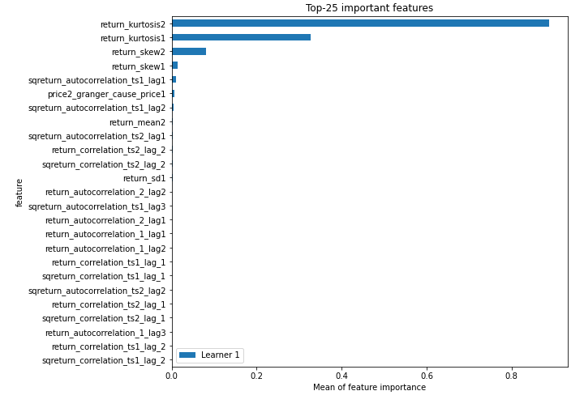
## Confusion Matrix

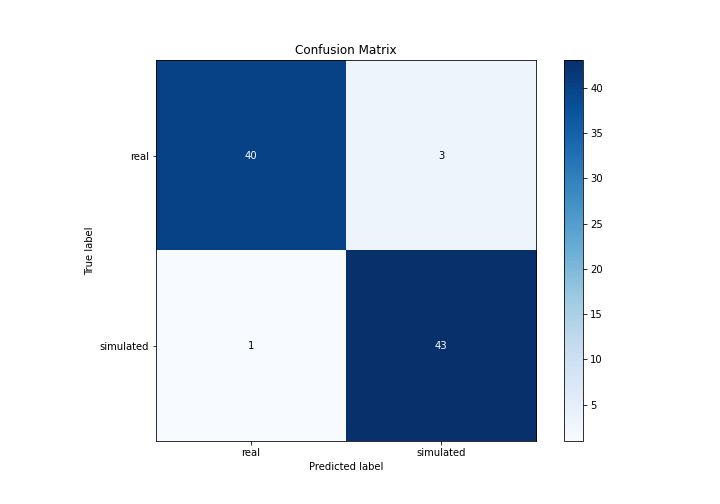

## Normalized Confusion Matrix

## ROC Curve

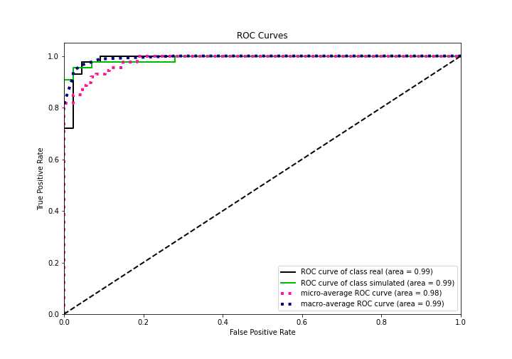

## Kolmogorov-Smirnov Statistic

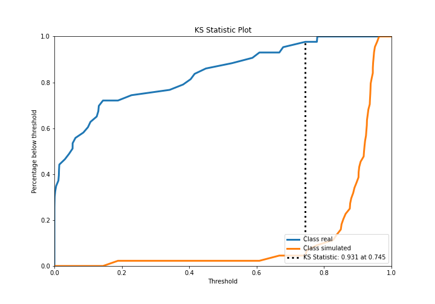

## Precision-Recall Curve

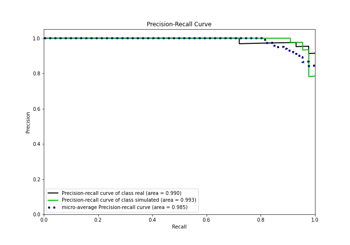

## Calibration Curve

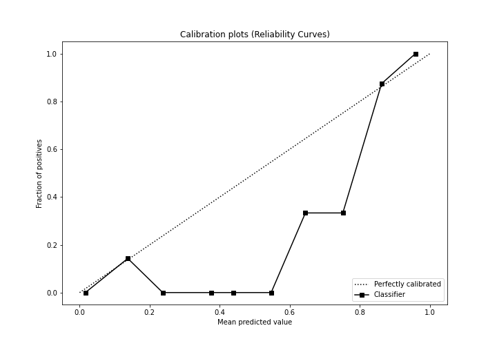

## Cumulative Gains Curve

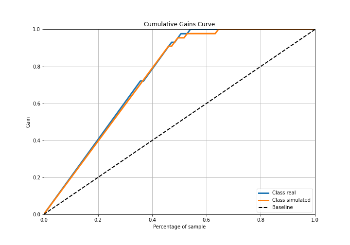

## Lift Curve

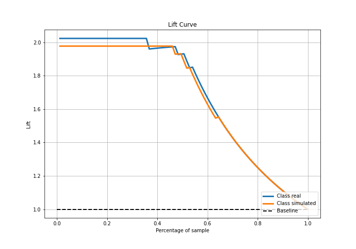

## SHAP Importance
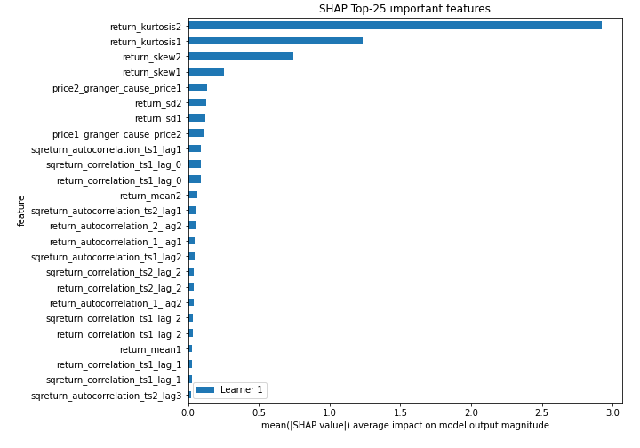

## SHAP Dependence plots

### Dependence (Fold 1)
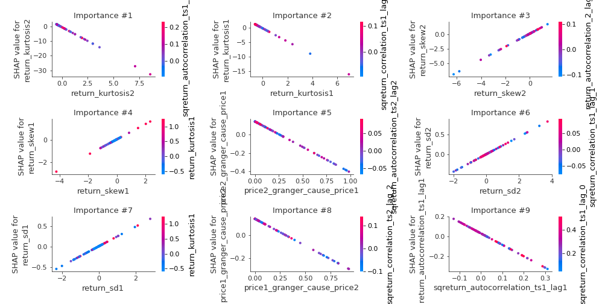

## SHAP Decision plots

### Top-10 Worst decisions for class 0 (Fold 1)
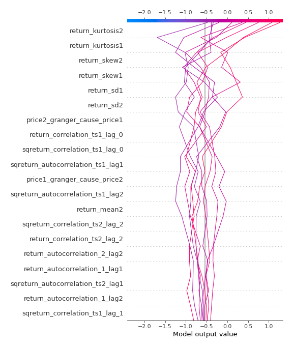
### Top-10 Best decisions for class 0 (Fold 1)
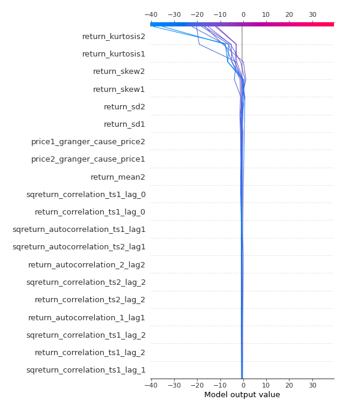
### Top-10 Worst decisions for class 1 (Fold 1)
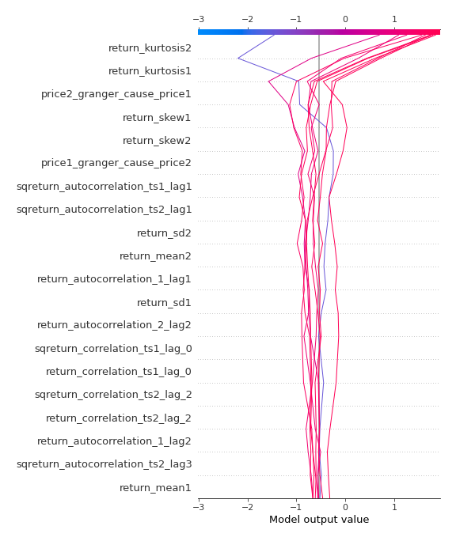
### Top-10 Best decisions for class 1 (Fold 1)
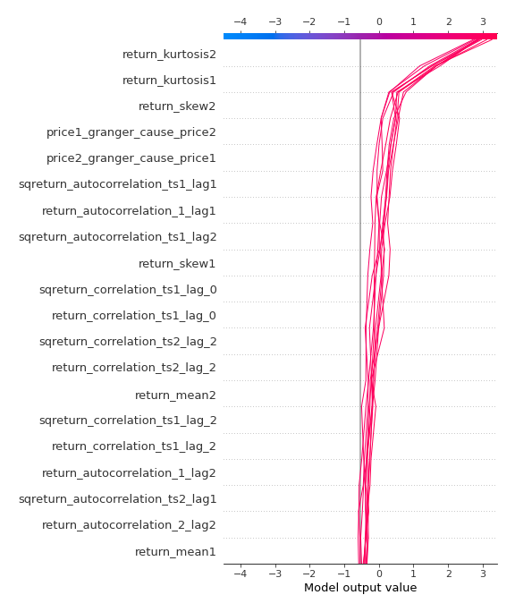

[<< Go back](../README.md)
