# Exploratory Data Analysis

[<< Go back](../README.md)
## Feature : target
- **Feature type** : categorical
- **Missing** : 0.0%
- **Unique** : 2
- **Count** :347
- **Unique** :2
- **Top** :simulated
- **Freq** :176

## Feature : return_mean1
- **Feature type** : continous
- **Missing** : 0.0%
- **Unique** : 347
- **Count** :347.0
- **Mean** :0.031070585172225416
- **Std** :0.11535736817171144
- **Min** :-0.4097588046067063
- **25%th Percentile** : -0.040386834380782194
- **50%th Percentile** : 0.040860365603503354
- **75%th Percentile** : 0.12140669542784582
- **Max** :0.30379791345108903

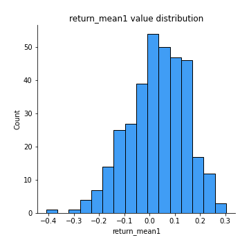
## Feature : return_mean2
- **Feature type** : continous
- **Missing** : 0.0%
- **Unique** : 347
- **Count** :347.0
- **Mean** :0.00986933282214025
- **Std** :0.12511564504930991
- **Min** :-0.5379326982346427
- **25%th Percentile** : -0.06665928372004082
- **50%th Percentile** : 0.011073824340230045
- **75%th Percentile** : 0.09446556700660907
- **Max** :0.6801605239983173

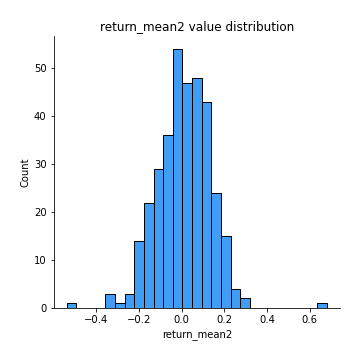
## Feature : return_sd1
- **Feature type** : continous
- **Missing** : 0.0%
- **Unique** : 347
- **Count** :347.0
- **Mean** :1.6476282110804594
- **Std** :0.34987515123104007
- **Min** :0.8102430347636637
- **25%th Percentile** : 1.5324092482604512
- **50%th Percentile** : 1.6408765357571575
- **75%th Percentile** : 1.7192418169636081
- **Max** :3.181425034216533

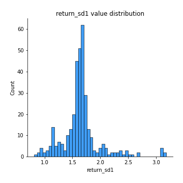
## Feature : return_sd2
- **Feature type** : continous
- **Missing** : 0.0%
- **Unique** : 347
- **Count** :347.0
- **Mean** :1.6694298244062131
- **Std** :0.38068852414858506
- **Min** :0.8198779632289204
- **25%th Percentile** : 1.531929844010158
- **50%th Percentile** : 1.6449047043131344
- **75%th Percentile** : 1.7376716555501543
- **Max** :4.59233049161685

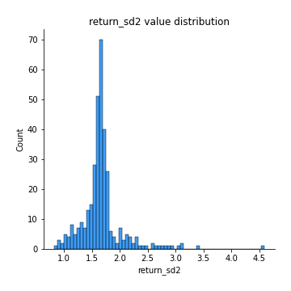
## Feature : return_skew1
- **Feature type** : continous
- **Missing** : 0.0%
- **Unique** : 347
- **Count** :347.0
- **Mean** :-0.20433597283022595
- **Std** :0.7142889862507708
- **Min** :-4.239645236578449
- **25%th Percentile** : -0.39929999410950934
- **50%th Percentile** : -0.08669460940929194
- **75%th Percentile** : 0.07825226194202232
- **Max** :2.351757728252051

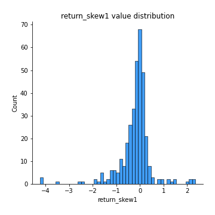
## Feature : return_skew2
- **Feature type** : continous
- **Missing** : 0.0%
- **Unique** : 347
- **Count** :347.0
- **Mean** :-0.2388555643493047
- **Std** :0.980524786186037
- **Min** :-6.262899561987459
- **25%th Percentile** : -0.356084462319054
- **50%th Percentile** : -0.08002252350210938
- **75%th Percentile** : 0.13067658079667469
- **Max** :4.1920266082732045

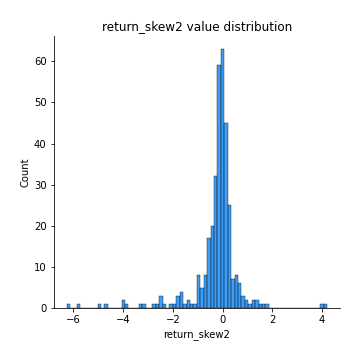
## Feature : return_kurtosis1
- **Feature type** : continous
- **Missing** : 0.0%
- **Unique** : 347
- **Count** :347.0
- **Mean** :2.772117213484739
- **Std** :5.433289796725572
- **Min** :-0.48593802508289174
- **25%th Percentile** : 0.038169229440118135
- **50%th Percentile** : 0.9910776814597702
- **75%th Percentile** : 2.985109086498946
- **Max** :40.485294874464934

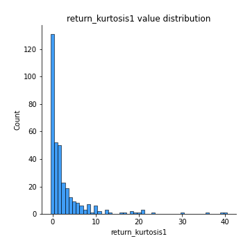
## Feature : return_kurtosis2
- **Feature type** : continous
- **Missing** : 0.0%
- **Unique** : 347
- **Count** :347.0
- **Mean** :3.8182190440121953
- **Std** :8.268526180431067
- **Min** :-0.5488381388555199
- **25%th Percentile** : -0.009700774216262253
- **50%th Percentile** : 0.994978050955547
- **75%th Percentile** : 3.368817505233867
- **Max** :64.99818629655663

## Feature : return_autocorrelation_1_lag1
- **Feature type** : continous
- **Missing** : 0.0%
- **Unique** : 347
- **Count** :347.0
- **Mean** :0.005808533489460347
- **Std** :0.07077989063534394
- **Min** :-0.2110198016529991
- **25%th Percentile** : -0.04380018856888828
- **50%th Percentile** : 0.0027867633689262483
- **75%th Percentile** : 0.05367880794972184
- **Max** :0.20132571463207988

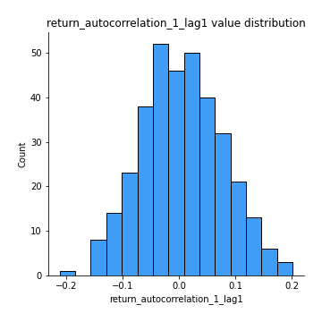
## Feature : return_autocorrelation_1_lag2
- **Feature type** : continous
- **Missing** : 0.0%
- **Unique** : 347
- **Count** :347.0
- **Mean** :0.00251129547915429
- **Std** :0.07294760212436642
- **Min** :-0.1716795527150684
- **25%th Percentile** : -0.05121162202102868
- **50%th Percentile** : 0.006418404159945965
- **75%th Percentile** : 0.0529287763342466
- **Max** :0.21123611097039302

## Feature : return_autocorrelation_1_lag3
- **Feature type** : continous
- **Missing** : 0.0%
- **Unique** : 347
- **Count** :347.0
- **Mean** :0.018765365181547464
- **Std** :0.06280333308238875
- **Min** :-0.1654833157463618
- **25%th Percentile** : -0.022642634554670006
- **50%th Percentile** : 0.02098152194791798
- **75%th Percentile** : 0.058523154716367126
- **Max** :0.23567964153278467

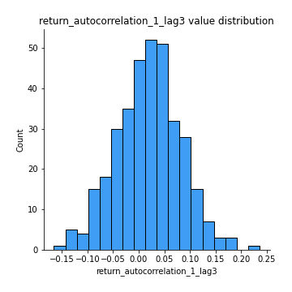
## Feature : return_autocorrelation_2_lag1
- **Feature type** : continous
- **Missing** : 0.0%
- **Unique** : 347
- **Count** :347.0
- **Mean** :0.006005803681668682
- **Std** :0.06840471508452385
- **Min** :-0.2364404317158175
- **25%th Percentile** : -0.035625118944051334
- **50%th Percentile** : 0.005177440432900092
- **75%th Percentile** : 0.052171654083890615
- **Max** :0.2024676054184499

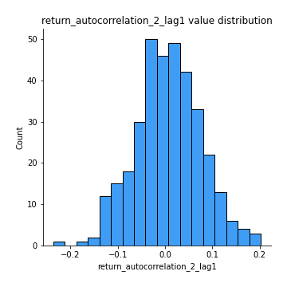
## Feature : return_autocorrelation_2_lag2
- **Feature type** : continous
- **Missing** : 0.0%
- **Unique** : 347
- **Count** :347.0
- **Mean** :0.0055058291440982475
- **Std** :0.06702642447321976
- **Min** :-0.1758721664122366
- **25%th Percentile** : -0.03695640430645382
- **50%th Percentile** : 0.0020578097902031233
- **75%th Percentile** : 0.04979011868347809
- **Max** :0.2534069713923979

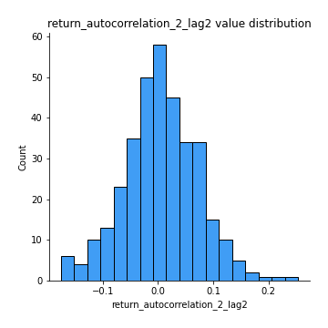
## Feature : return_autocorrelation_2_lag3
- **Feature type** : continous
- **Missing** : 0.0%
- **Unique** : 347
- **Count** :347.0
- **Mean** :0.014293661825660041
- **Std** :0.06319772205002687
- **Min** :-0.1794902936808312
- **25%th Percentile** : -0.025839847506780953
- **50%th Percentile** : 0.014728689473186039
- **75%th Percentile** : 0.0562333821359315
- **Max** :0.20205753622966244

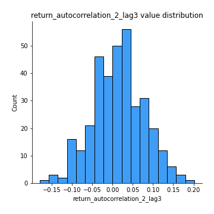
## Feature : return_correlation_ts1_lag_0
- **Feature type** : continous
- **Missing** : 0.0%
- **Unique** : 347
- **Count** :347.0
- **Mean** :0.3013296173636256
- **Std** :0.13394718660467012
- **Min** :-0.07366870340906873
- **25%th Percentile** : 0.2309494066099522
- **50%th Percentile** : 0.29595208773288695
- **75%th Percentile** : 0.36528931467559816
- **Max** :0.9937227277077512

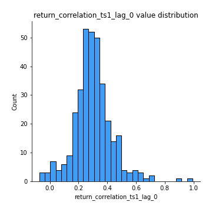
## Feature : return_correlation_ts1_lag_1
- **Feature type** : continous
- **Missing** : 0.0%
- **Unique** : 347
- **Count** :347.0
- **Mean** :0.01263913927657541
- **Std** :0.06455020684040083
- **Min** :-0.18856827637524448
- **25%th Percentile** : -0.035006262516169416
- **50%th Percentile** : 0.011292403262317655
- **75%th Percentile** : 0.05758319891048045
- **Max** :0.17827877053006067

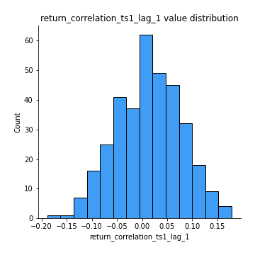
## Feature : return_correlation_ts1_lag_2
- **Feature type** : continous
- **Missing** : 0.0%
- **Unique** : 347
- **Count** :347.0
- **Mean** :0.010421167056603613
- **Std** :0.06690676795518713
- **Min** :-0.172871336111873
- **25%th Percentile** : -0.03322630152170822
- **50%th Percentile** : 0.009225288045935118
- **75%th Percentile** : 0.0575662899923163
- **Max** :0.19444824447965361

## Feature : return_correlation_ts1_lag_3
- **Feature type** : continous
- **Missing** : 0.0%
- **Unique** : 347
- **Count** :347.0
- **Mean** :0.016458626979281334
- **Std** :0.06955844808200569
- **Min** :-0.18059033867783728
- **25%th Percentile** : -0.03135209914421593
- **50%th Percentile** : 0.017456713032193767
- **75%th Percentile** : 0.06080893249945031
- **Max** :0.24005637612321024

## Feature : return_correlation_ts2_lag_1
- **Feature type** : continous
- **Missing** : 0.0%
- **Unique** : 347
- **Count** :347.0
- **Mean** :0.014556035000079527
- **Std** :0.06521158533776708
- **Min** :-0.18474062103125932
- **25%th Percentile** : -0.026867574194051898
- **50%th Percentile** : 0.013708905812133935
- **75%th Percentile** : 0.057257078800010644
- **Max** :0.3425036902091001

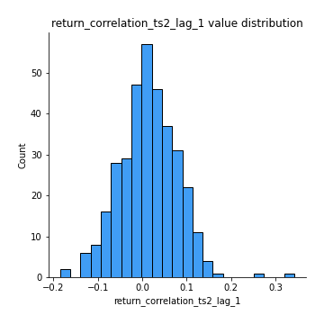
## Feature : return_correlation_ts2_lag_2
- **Feature type** : continous
- **Missing** : 0.0%
- **Unique** : 347
- **Count** :347.0
- **Mean** :0.007450268957474875
- **Std** :0.06707576415918237
- **Min** :-0.18793480063267962
- **25%th Percentile** : -0.03504754365119677
- **50%th Percentile** : 0.005765421286400751
- **75%th Percentile** : 0.04979354939373598
- **Max** :0.26138657611065624

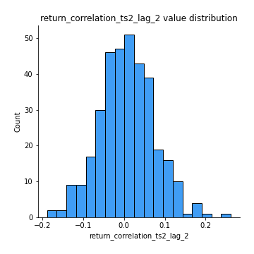
## Feature : return_correlation_ts2_lag_3
- **Feature type** : continous
- **Missing** : 0.0%
- **Unique** : 347
- **Count** :347.0
- **Mean** :0.0180724251401288
- **Std** :0.0639198005549982
- **Min** :-0.13287767820660334
- **25%th Percentile** : -0.025360109153317656
- **50%th Percentile** : 0.015441128936240075
- **75%th Percentile** : 0.06528730215295839
- **Max** :0.19496389760697808

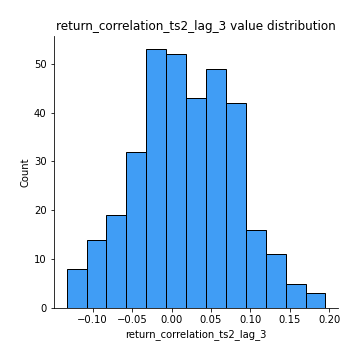
## Feature : sqreturn_autocorrelation_ts1_lag1
- **Feature type** : continous
- **Missing** : 0.0%
- **Unique** : 347
- **Count** :347.0
- **Mean** :0.030039240771856587
- **Std** :0.08401881808496374
- **Min** :-0.1275879465128882
- **25%th Percentile** : -0.024589477079604016
- **50%th Percentile** : 0.01618406565257178
- **75%th Percentile** : 0.07898180297134502
- **Max** :0.4170324090514868

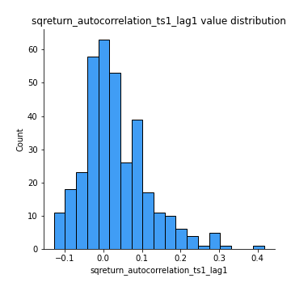
## Feature : sqreturn_autocorrelation_ts1_lag2
- **Feature type** : continous
- **Missing** : 0.0%
- **Unique** : 347
- **Count** :347.0
- **Mean** :0.016878359572747317
- **Std** :0.06721639238342861
- **Min** :-0.13770898085078254
- **25%th Percentile** : -0.026596693764436505
- **50%th Percentile** : 0.007913183720226032
- **75%th Percentile** : 0.05078217798683582
- **Max** :0.29415594530501293

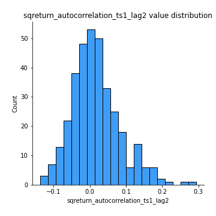
## Feature : sqreturn_autocorrelation_ts1_lag3
- **Feature type** : continous
- **Missing** : 0.0%
- **Unique** : 347
- **Count** :347.0
- **Mean** :0.008765594264188293
- **Std** :0.061846872706337624
- **Min** :-0.1559822960731647
- **25%th Percentile** : -0.030954498140158295
- **50%th Percentile** : 0.0032304897496262595
- **75%th Percentile** : 0.04460427787687598
- **Max** :0.22466908740066305

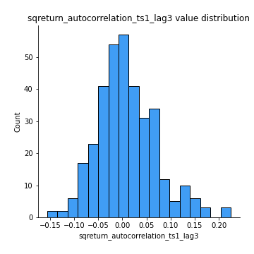
## Feature : sqreturn_autocorrelation_ts2_lag1
- **Feature type** : continous
- **Missing** : 0.0%
- **Unique** : 347
- **Count** :347.0
- **Mean** :0.029137390979965885
- **Std** :0.07933239759706813
- **Min** :-0.15563900625434482
- **25%th Percentile** : -0.019206590198797616
- **50%th Percentile** : 0.019672519929279743
- **75%th Percentile** : 0.06469600399899364
- **Max** :0.36991568023038357

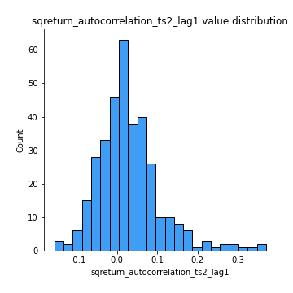
## Feature : sqreturn_autocorrelation_ts2_lag2
- **Feature type** : continous
- **Missing** : 0.0%
- **Unique** : 347
- **Count** :347.0
- **Mean** :0.01063288756971344
- **Std** :0.06007332293870087
- **Min** :-0.1576987009798018
- **25%th Percentile** : -0.025175475612853188
- **50%th Percentile** : 0.00264177172381178
- **75%th Percentile** : 0.04366171283176061
- **Max** :0.28672056150180414

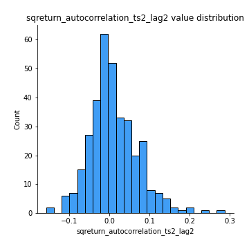
## Feature : sqreturn_autocorrelation_ts2_lag3
- **Feature type** : continous
- **Missing** : 0.0%
- **Unique** : 347
- **Count** :347.0
- **Mean** :0.009186453225716316
- **Std** :0.06461356078392033
- **Min** :-0.1329690762088284
- **25%th Percentile** : -0.0327845796296278
- **50%th Percentile** : -0.0025493608461148605
- **75%th Percentile** : 0.03875651756201059
- **Max** :0.3463122340368414

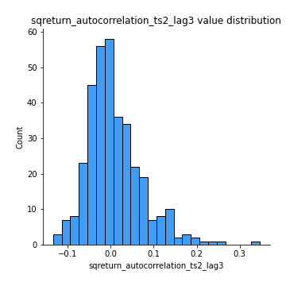
## Feature : sqreturn_correlation_ts1_lag_0
- **Feature type** : continous
- **Missing** : 0.0%
- **Unique** : 347
- **Count** :347.0
- **Mean** :0.3013296173636256
- **Std** :0.13394718660467012
- **Min** :-0.07366870340906873
- **25%th Percentile** : 0.2309494066099522
- **50%th Percentile** : 0.29595208773288695
- **75%th Percentile** : 0.36528931467559816
- **Max** :0.9937227277077512

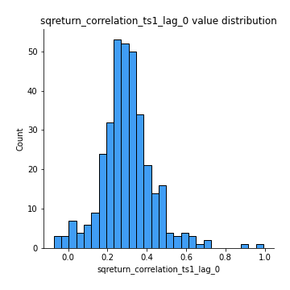
## Feature : sqreturn_correlation_ts1_lag_1
- **Feature type** : continous
- **Missing** : 0.0%
- **Unique** : 347
- **Count** :347.0
- **Mean** :0.01263913927657541
- **Std** :0.06455020684040083
- **Min** :-0.18856827637524448
- **25%th Percentile** : -0.035006262516169416
- **50%th Percentile** : 0.011292403262317655
- **75%th Percentile** : 0.05758319891048045
- **Max** :0.17827877053006067

## Feature : sqreturn_correlation_ts1_lag_2
- **Feature type** : continous
- **Missing** : 0.0%
- **Unique** : 347
- **Count** :347.0
- **Mean** :0.010421167056603613
- **Std** :0.06690676795518713
- **Min** :-0.172871336111873
- **25%th Percentile** : -0.03322630152170822
- **50%th Percentile** : 0.009225288045935118
- **75%th Percentile** : 0.0575662899923163
- **Max** :0.19444824447965361

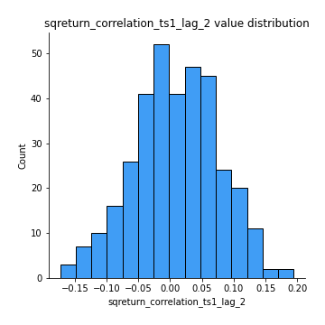
## Feature : sqreturn_correlation_ts1_lag_3
- **Feature type** : continous
- **Missing** : 0.0%
- **Unique** : 347
- **Count** :347.0
- **Mean** :0.016458626979281334
- **Std** :0.06955844808200569
- **Min** :-0.18059033867783728
- **25%th Percentile** : -0.03135209914421593
- **50%th Percentile** : 0.017456713032193767
- **75%th Percentile** : 0.06080893249945031
- **Max** :0.24005637612321024

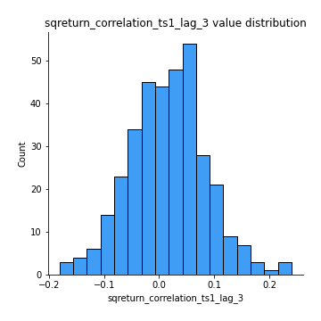
## Feature : sqreturn_correlation_ts2_lag_1
- **Feature type** : continous
- **Missing** : 0.0%
- **Unique** : 347
- **Count** :347.0
- **Mean** :0.014556035000079527
- **Std** :0.06521158533776708
- **Min** :-0.18474062103125932
- **25%th Percentile** : -0.026867574194051898
- **50%th Percentile** : 0.013708905812133935
- **75%th Percentile** : 0.057257078800010644
- **Max** :0.3425036902091001

## Feature : sqreturn_correlation_ts2_lag_2
- **Feature type** : continous
- **Missing** : 0.0%
- **Unique** : 347
- **Count** :347.0
- **Mean** :0.007450268957474875
- **Std** :0.06707576415918237
- **Min** :-0.18793480063267962
- **25%th Percentile** : -0.03504754365119677
- **50%th Percentile** : 0.005765421286400751
- **75%th Percentile** : 0.04979354939373598
- **Max** :0.26138657611065624

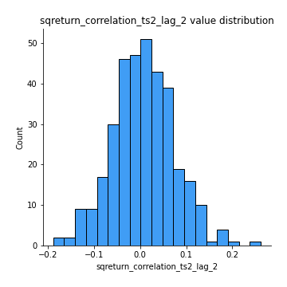
## Feature : sqreturn_correlation_ts2_lag_3
- **Feature type** : continous
- **Missing** : 0.0%
- **Unique** : 347
- **Count** :347.0
- **Mean** :0.0180724251401288
- **Std** :0.0639198005549982
- **Min** :-0.13287767820660334
- **25%th Percentile** : -0.025360109153317656
- **50%th Percentile** : 0.015441128936240075
- **75%th Percentile** : 0.06528730215295839
- **Max** :0.19496389760697808

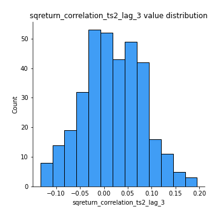
## Feature : price2_granger_cause_price1
- **Feature type** : continous
- **Missing** : 0.0%
- **Unique** : 347
- **Count** :347.0
- **Mean** :0.2488175065933409
- **Std** :0.28771664919722684
- **Min** :2.4312048970873696e-09
- **25%th Percentile** : 0.015987498475940175
- **50%th Percentile** : 0.10669967983231103
- **75%th Percentile** : 0.42766043227064016
- **Max** :0.9913375284277419

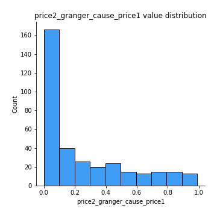
## Feature : price1_granger_cause_price2
- **Feature type** : continous
- **Missing** : 0.0%
- **Unique** : 347
- **Count** :347.0
- **Mean** :0.23408864230560644
- **Std** :0.27108600341643674
- **Min** :1.2012269232170316e-11
- **25%th Percentile** : 0.01708717059490686
- **50%th Percentile** : 0.10732010248986379
- **75%th Percentile** : 0.3922198755209877
- **Max** :0.9874171622258732

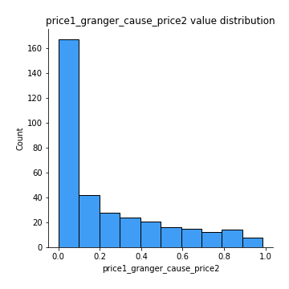

[<< Go back](../README.md)
