# Summary of 3_Linear

[<< Go back](../README.md)

## Logistic Regression (Linear)
- **n_jobs**: -1
- **explain_level**: 2

## Validation
 - **validation_type**: split
 - **train_ratio**: 0.75
 - **shuffle**: True
 - **stratify**: True

## Optimized metric
accuracy

## Training time

4.6 seconds

## Metric details
|           |    score |     threshold |
|:----------|---------:|--------------:|
| logloss   | 0.217733 | nan           |
| auc       | 0.986786 | nan           |
| f1        | 0.964706 |   0.660661    |
| accuracy  | 0.965517 |   0.660661    |
| precision | 1        |   0.805502    |
| recall    | 1        |   5.96007e-15 |
| mcc       | 0.931253 |   0.660661    |

## Confusion matrix (at threshold=0.660661)
|                      |   Predicted as real |   Predicted as simulated |
|:---------------------|--------------------:|-------------------------:|
| Labeled as real      |                  43 |                        1 |
| Labeled as simulated |                   2 |                       41 |

## Learning curves
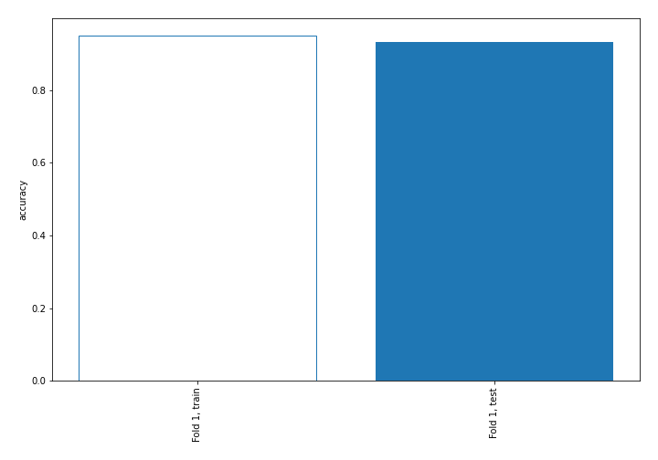

## Coefficients
| feature                           |   Learner_1 |
|:----------------------------------|------------:|
| return_skew1                      |   0.919791  |
| return_skew2                      |   0.870864  |
| return_autocorrelation_1_lag2     |   0.635487  |
| sqreturn_correlation_ts1_lag_1    |   0.593182  |
| return_correlation_ts1_lag_1      |   0.593182  |
| return_autocorrelation_1_lag1     |   0.580372  |
| sqreturn_correlation_ts1_lag_2    |   0.390346  |
| return_correlation_ts1_lag_2      |   0.390346  |
| return_correlation_ts2_lag_2      |   0.370535  |
| sqreturn_correlation_ts2_lag_2    |   0.370535  |
| return_autocorrelation_2_lag2     |   0.353622  |
| return_autocorrelation_2_lag1     |   0.343646  |
| sqreturn_correlation_ts2_lag_1    |   0.315952  |
| return_correlation_ts2_lag_1      |   0.315952  |
| return_autocorrelation_1_lag3     |   0.249448  |
| return_correlation_ts2_lag_3      |   0.222918  |
| sqreturn_correlation_ts2_lag_3    |   0.222918  |
| return_sd2                        |   0.167119  |
| return_sd1                        |   0.12727   |
| sqreturn_correlation_ts1_lag_3    |   0.122395  |
| return_correlation_ts1_lag_3      |   0.122395  |
| return_autocorrelation_2_lag3     |   0.0791303 |
| return_mean1                      |   0.0646694 |
| sqreturn_autocorrelation_ts2_lag3 |  -0.356776  |
| intercept                         |  -0.432625  |
| sqreturn_autocorrelation_ts1_lag3 |  -0.439481  |
| price2_granger_cause_price1       |  -0.484758  |
| sqreturn_correlation_ts1_lag_0    |  -0.615579  |
| return_correlation_ts1_lag_0      |  -0.615579  |
| return_mean2                      |  -0.630811  |
| price1_granger_cause_price2       |  -0.76864   |
| sqreturn_autocorrelation_ts2_lag2 |  -0.805981  |
| sqreturn_autocorrelation_ts2_lag1 |  -1.03258   |
| sqreturn_autocorrelation_ts1_lag2 |  -1.03838   |
| sqreturn_autocorrelation_ts1_lag1 |  -1.55972   |
| return_kurtosis1                  |  -2.43779   |
| return_kurtosis2                  |  -3.57546   |

## Permutation-based Importance

## Confusion Matrix

## Normalized Confusion Matrix

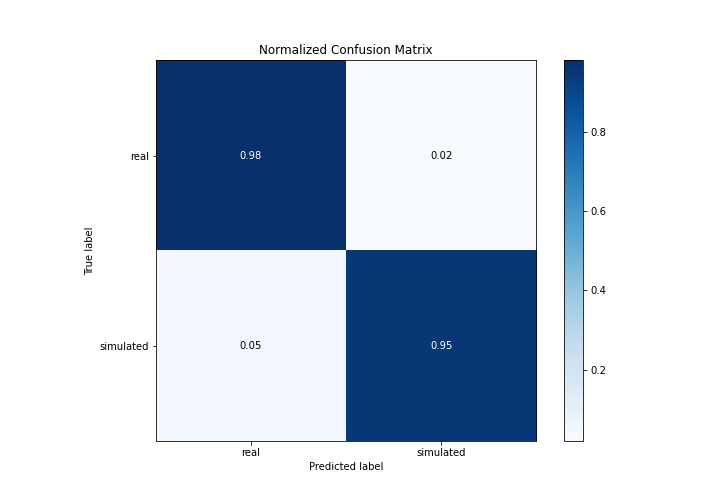

## ROC Curve

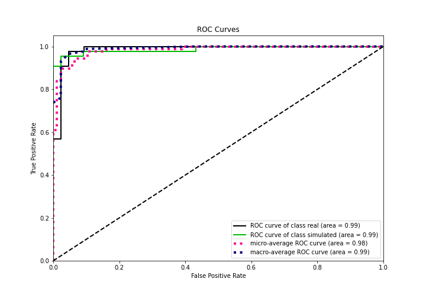

## Kolmogorov-Smirnov Statistic

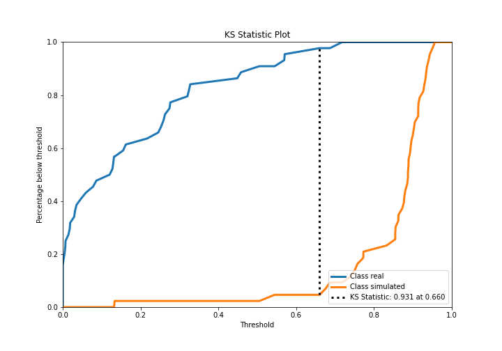

## Precision-Recall Curve

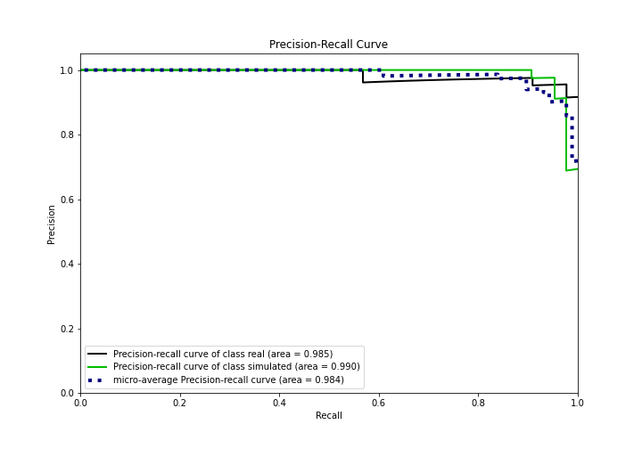

## Calibration Curve

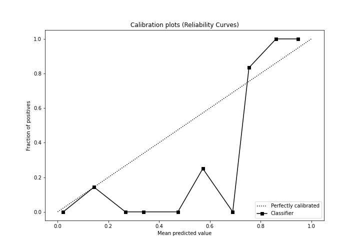

## Cumulative Gains Curve

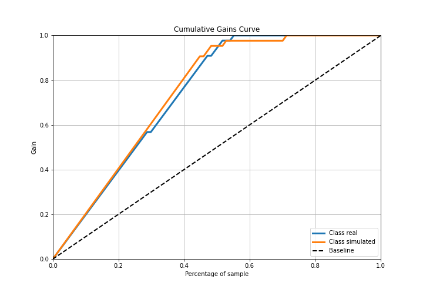

## Lift Curve

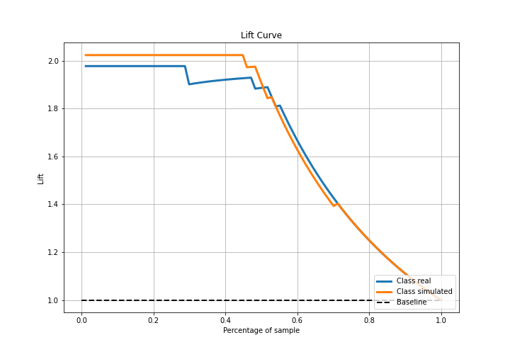

## SHAP Importance
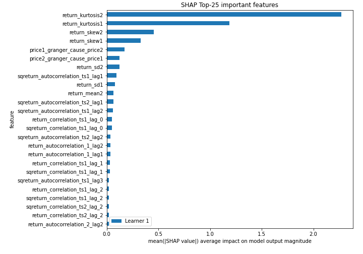

## SHAP Dependence plots

### Dependence (Fold 1)
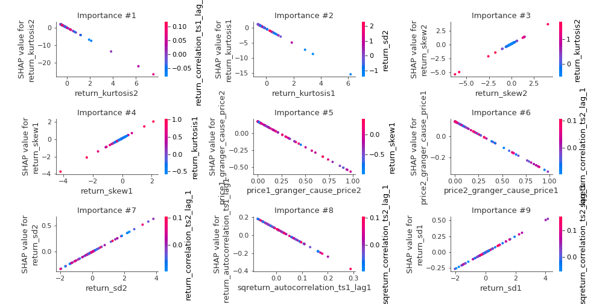

## SHAP Decision plots

### Top-10 Worst decisions for class 0 (Fold 1)
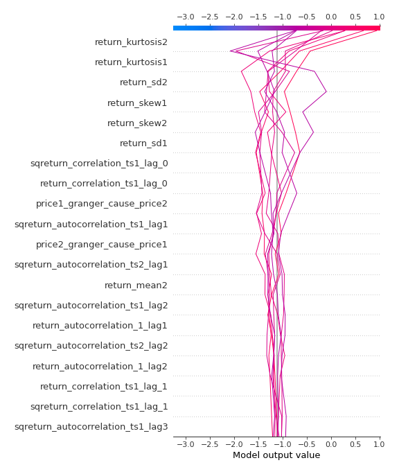
### Top-10 Best decisions for class 0 (Fold 1)
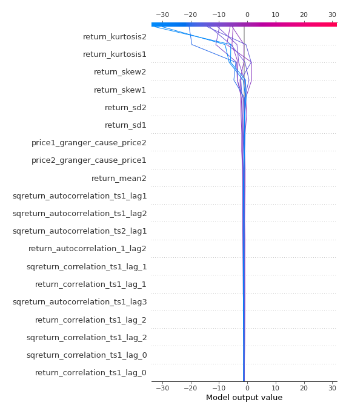
### Top-10 Worst decisions for class 1 (Fold 1)
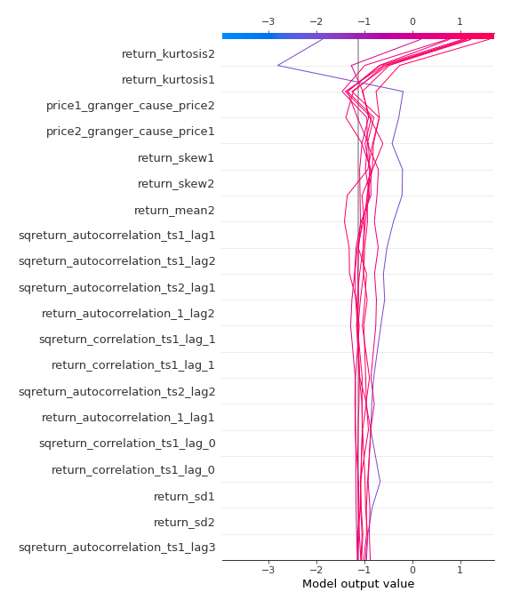
### Top-10 Best decisions for class 1 (Fold 1)
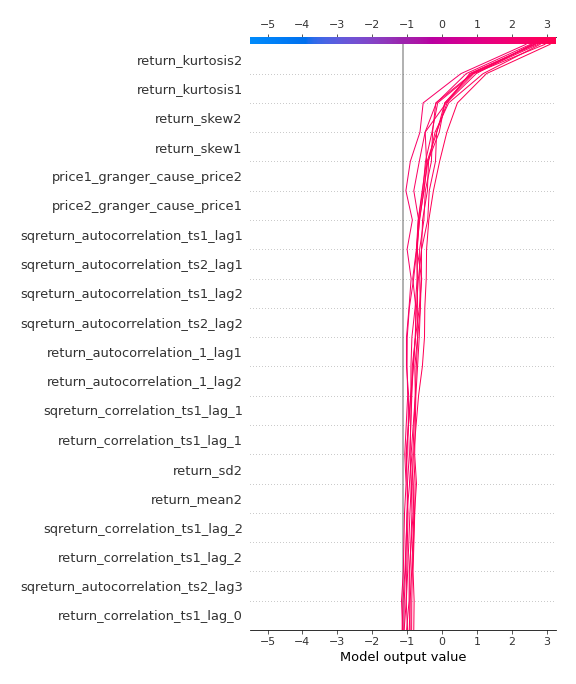

[<< Go back](../README.md)
