# Exploratory Data Analysis

[<< Go back](../README.md)
## Feature : target
- **Feature type** : categorical
- **Missing** : 0.0%
- **Unique** : 2
- **Count** :347
- **Unique** :2
- **Top** :real
- **Freq** :176

## Feature : return_mean1
- **Feature type** : continous
- **Missing** : 0.0%
- **Unique** : 347
- **Count** :347.0
- **Mean** :0.029687179437514793
- **Std** :0.12041093136830645
- **Min** :-0.4110436268506934
- **25%th Percentile** : -0.03953514289645561
- **50%th Percentile** : 0.04682970549818338
- **75%th Percentile** : 0.11431765937367824
- **Max** :0.3602793017097547

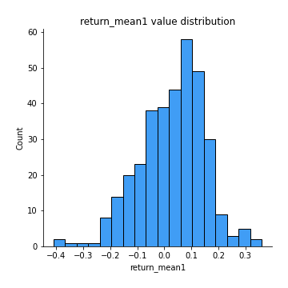
## Feature : return_mean2
- **Feature type** : continous
- **Missing** : 0.0%
- **Unique** : 347
- **Count** :347.0
- **Mean** :0.007354081666864889
- **Std** :0.12313059379591258
- **Min** :-0.37470080279801543
- **25%th Percentile** : -0.0646640336256267
- **50%th Percentile** : 0.010481945123182441
- **75%th Percentile** : 0.09430882354111977
- **Max** :0.6801605239983173

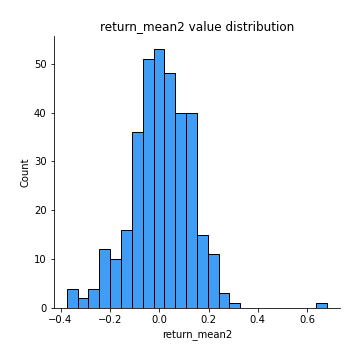
## Feature : return_sd1
- **Feature type** : continous
- **Missing** : 0.0%
- **Unique** : 347
- **Count** :347.0
- **Mean** :1.6637886930548318
- **Std** :0.3664271307915697
- **Min** :0.8733078831717243
- **25%th Percentile** : 1.525213266731754
- **50%th Percentile** : 1.6419983623894945
- **75%th Percentile** : 1.7391172085186286
- **Max** :3.332494027875222

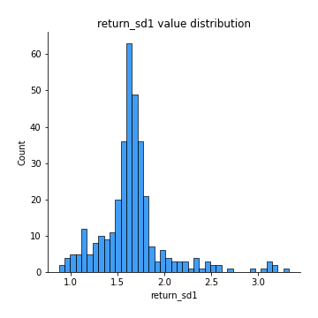
## Feature : return_sd2
- **Feature type** : continous
- **Missing** : 0.0%
- **Unique** : 347
- **Count** :347.0
- **Mean** :1.7016514652525438
- **Std** :0.4131068041864834
- **Min** :0.8198779632289204
- **25%th Percentile** : 1.5355461521635372
- **50%th Percentile** : 1.649564619334243
- **75%th Percentile** : 1.7525438169555931
- **Max** :4.59233049161685

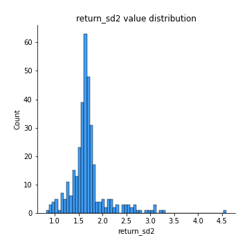
## Feature : return_skew1
- **Feature type** : continous
- **Missing** : 0.0%
- **Unique** : 347
- **Count** :347.0
- **Mean** :-0.16929984065887654
- **Std** :0.7139049498910599
- **Min** :-4.239645236578449
- **25%th Percentile** : -0.35927750326243313
- **50%th Percentile** : -0.07001673303057639
- **75%th Percentile** : 0.11450488890508949
- **Max** :2.1285977762978217

## Feature : return_skew2
- **Feature type** : continous
- **Missing** : 0.0%
- **Unique** : 347
- **Count** :347.0
- **Mean** :-0.22733774797656867
- **Std** :0.9694166971576677
- **Min** :-6.262899561987459
- **25%th Percentile** : -0.30713321122894777
- **50%th Percentile** : -0.05129706803512534
- **75%th Percentile** : 0.13234874277127684
- **Max** :4.0310261345618

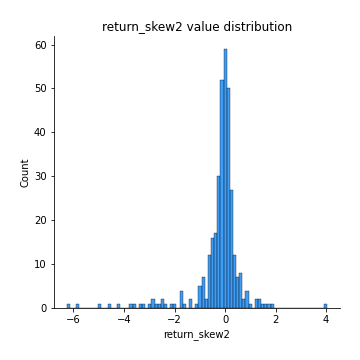
## Feature : return_kurtosis1
- **Feature type** : continous
- **Missing** : 0.0%
- **Unique** : 347
- **Count** :347.0
- **Mean** :2.659379987054981
- **Std** :5.33567069204713
- **Min** :-0.655012242449843
- **25%th Percentile** : 0.11053136744296621
- **50%th Percentile** : 0.9879688172165082
- **75%th Percentile** : 2.8909858215319697
- **Max** :40.485294874464934

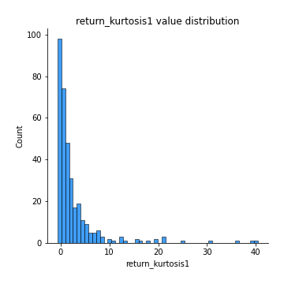
## Feature : return_kurtosis2
- **Feature type** : continous
- **Missing** : 0.0%
- **Unique** : 347
- **Count** :347.0
- **Mean** :3.9862565719884997
- **Std** :8.66904530889121
- **Min** :-0.5302379156240598
- **25%th Percentile** : 0.10251435622371541
- **50%th Percentile** : 0.9437745404143922
- **75%th Percentile** : 3.300904838680441
- **Max** :64.99818629655663

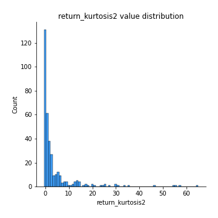
## Feature : return_autocorrelation_1_lag1
- **Feature type** : continous
- **Missing** : 0.0%
- **Unique** : 347
- **Count** :347.0
- **Mean** :0.006938764760887357
- **Std** :0.07436258833318028
- **Min** :-0.2110198016529991
- **25%th Percentile** : -0.0402264992708915
- **50%th Percentile** : 0.007147242717364994
- **75%th Percentile** : 0.05354071154923913
- **Max** :0.21925054842278865

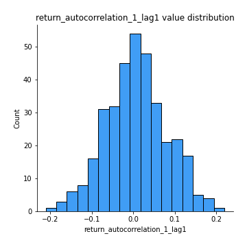
## Feature : return_autocorrelation_1_lag2
- **Feature type** : continous
- **Missing** : 0.0%
- **Unique** : 347
- **Count** :347.0
- **Mean** :-0.00014206314467824456
- **Std** :0.06896727653861164
- **Min** :-0.1622318488586277
- **25%th Percentile** : -0.04682050806599166
- **50%th Percentile** : 0.0012136781678008396
- **75%th Percentile** : 0.04541154628461965
- **Max** :0.21123611097039302

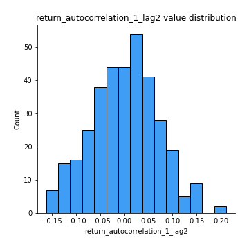
## Feature : return_autocorrelation_1_lag3
- **Feature type** : continous
- **Missing** : 0.0%
- **Unique** : 347
- **Count** :347.0
- **Mean** :0.02550041210021765
- **Std** :0.0639768480074252
- **Min** :-0.1654833157463618
- **25%th Percentile** : -0.011315248415542798
- **50%th Percentile** : 0.025994458826609904
- **75%th Percentile** : 0.06472151378703406
- **Max** :0.265778016464009

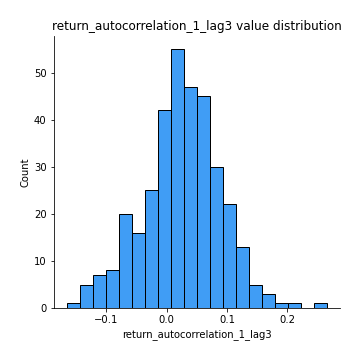
## Feature : return_autocorrelation_2_lag1
- **Feature type** : continous
- **Missing** : 0.0%
- **Unique** : 347
- **Count** :347.0
- **Mean** :0.008513529801971292
- **Std** :0.06733518562548439
- **Min** :-0.17778763204400128
- **25%th Percentile** : -0.03485661492087652
- **50%th Percentile** : 0.0045963948455223025
- **75%th Percentile** : 0.05753215173386894
- **Max** :0.2024676054184499

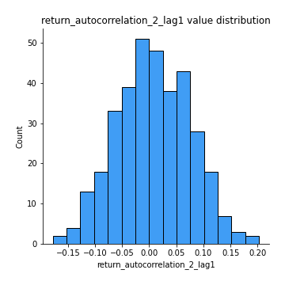
## Feature : return_autocorrelation_2_lag2
- **Feature type** : continous
- **Missing** : 0.0%
- **Unique** : 347
- **Count** :347.0
- **Mean** :0.0028079246217253807
- **Std** :0.06813936810085583
- **Min** :-0.18074956551719543
- **25%th Percentile** : -0.043762673531802104
- **50%th Percentile** : 0.0016561765366824063
- **75%th Percentile** : 0.04904471880308817
- **Max** :0.16813134720340392

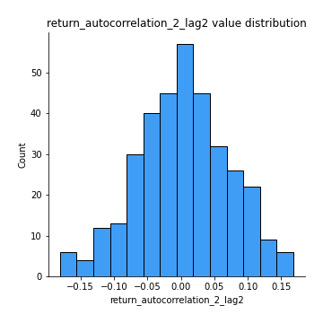
## Feature : return_autocorrelation_2_lag3
- **Feature type** : continous
- **Missing** : 0.0%
- **Unique** : 347
- **Count** :347.0
- **Mean** :0.015185534556890515
- **Std** :0.06596092158955838
- **Min** :-0.19049810479884746
- **25%th Percentile** : -0.025949954397210505
- **50%th Percentile** : 0.01578501982644527
- **75%th Percentile** : 0.05714296287382282
- **Max** :0.2638869839754576

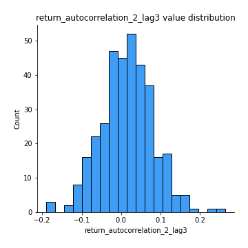
## Feature : return_correlation_ts1_lag_0
- **Feature type** : continous
- **Missing** : 0.0%
- **Unique** : 347
- **Count** :347.0
- **Mean** :0.30297539523071865
- **Std** :0.13385352868488765
- **Min** :-0.10256711281206837
- **25%th Percentile** : 0.22896548722935048
- **50%th Percentile** : 0.2953362314480694
- **75%th Percentile** : 0.3620756749824958
- **Max** :0.9937227277077512

## Feature : return_correlation_ts1_lag_1
- **Feature type** : continous
- **Missing** : 0.0%
- **Unique** : 347
- **Count** :347.0
- **Mean** :0.012824232108903972
- **Std** :0.06661026507737988
- **Min** :-0.18856827637524448
- **25%th Percentile** : -0.035279498944089174
- **50%th Percentile** : 0.010227068266878912
- **75%th Percentile** : 0.06598312676788194
- **Max** :0.18295460057509072

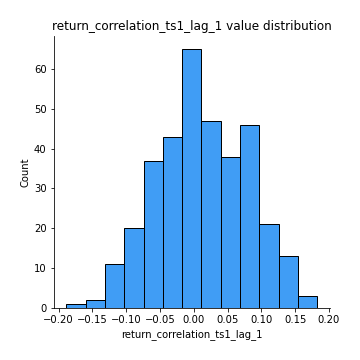
## Feature : return_correlation_ts1_lag_2
- **Feature type** : continous
- **Missing** : 0.0%
- **Unique** : 347
- **Count** :347.0
- **Mean** :0.00932140190965034
- **Std** :0.06713254919696589
- **Min** :-0.17543728074367104
- **25%th Percentile** : -0.037417168529704184
- **50%th Percentile** : 0.007930483357218314
- **75%th Percentile** : 0.05172279168593846
- **Max** :0.17974071501626168

## Feature : return_correlation_ts1_lag_3
- **Feature type** : continous
- **Missing** : 0.0%
- **Unique** : 347
- **Count** :347.0
- **Mean** :0.02004193653923403
- **Std** :0.06883079165983991
- **Min** :-0.21147540839842804
- **25%th Percentile** : -0.02530550888311043
- **50%th Percentile** : 0.02025475436048913
- **75%th Percentile** : 0.06422703613849583
- **Max** :0.23808054096877584

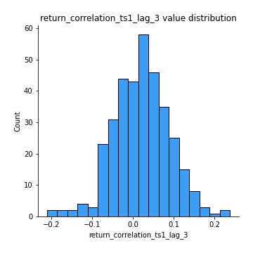
## Feature : return_correlation_ts2_lag_1
- **Feature type** : continous
- **Missing** : 0.0%
- **Unique** : 347
- **Count** :347.0
- **Mean** :0.015683060482758422
- **Std** :0.07134688964626545
- **Min** :-0.17665751184419612
- **25%th Percentile** : -0.03452784504179842
- **50%th Percentile** : 0.014922710403638616
- **75%th Percentile** : 0.06352908089627149
- **Max** :0.3425036902091001

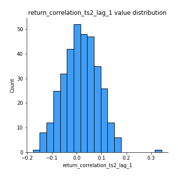
## Feature : return_correlation_ts2_lag_2
- **Feature type** : continous
- **Missing** : 0.0%
- **Unique** : 347
- **Count** :347.0
- **Mean** :0.0054910254333126
- **Std** :0.06511573800598636
- **Min** :-0.2757460186107768
- **25%th Percentile** : -0.03636692657597272
- **50%th Percentile** : 0.004784155476793254
- **75%th Percentile** : 0.04618315696701587
- **Max** :0.18051382329194504

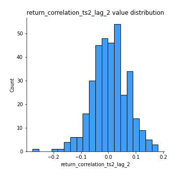
## Feature : return_correlation_ts2_lag_3
- **Feature type** : continous
- **Missing** : 0.0%
- **Unique** : 347
- **Count** :347.0
- **Mean** :0.02058874446165289
- **Std** :0.06639656042349204
- **Min** :-0.15180996729466312
- **25%th Percentile** : -0.026308581605953875
- **50%th Percentile** : 0.022598171968423494
- **75%th Percentile** : 0.06413816778601891
- **Max** :0.20157143087228013

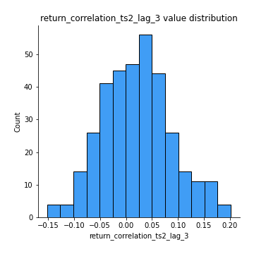
## Feature : sqreturn_autocorrelation_ts1_lag1
- **Feature type** : continous
- **Missing** : 0.0%
- **Unique** : 347
- **Count** :347.0
- **Mean** :0.03099919623093437
- **Std** :0.08190741593139711
- **Min** :-0.12182286345030802
- **25%th Percentile** : -0.02455629507332088
- **50%th Percentile** : 0.008929676079173334
- **75%th Percentile** : 0.068796372651635
- **Max** :0.4170324090514868

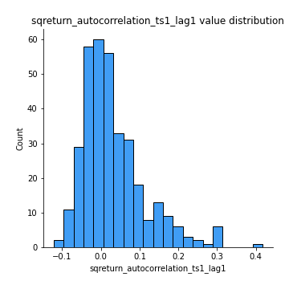
## Feature : sqreturn_autocorrelation_ts1_lag2
- **Feature type** : continous
- **Missing** : 0.0%
- **Unique** : 347
- **Count** :347.0
- **Mean** :0.01977422184519761
- **Std** :0.07194227003801588
- **Min** :-0.1300531340828596
- **25%th Percentile** : -0.030908544907134964
- **50%th Percentile** : 0.00721207236997169
- **75%th Percentile** : 0.05863019883390083
- **Max** :0.32836952056190194

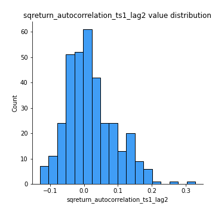
## Feature : sqreturn_autocorrelation_ts1_lag3
- **Feature type** : continous
- **Missing** : 0.0%
- **Unique** : 347
- **Count** :347.0
- **Mean** :0.012040250276730067
- **Std** :0.06480417842635677
- **Min** :-0.14543898048152362
- **25%th Percentile** : -0.032048379709956734
- **50%th Percentile** : 0.005104862050562074
- **75%th Percentile** : 0.045312800445266935
- **Max** :0.36579865351615615

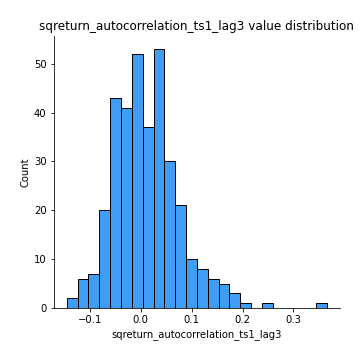
## Feature : sqreturn_autocorrelation_ts2_lag1
- **Feature type** : continous
- **Missing** : 0.0%
- **Unique** : 347
- **Count** :347.0
- **Mean** :0.027714326569998757
- **Std** :0.07758877307938124
- **Min** :-0.14877835407921983
- **25%th Percentile** : -0.021835904093276858
- **50%th Percentile** : 0.0193714578467071
- **75%th Percentile** : 0.06501436845223743
- **Max** :0.36991568023038357

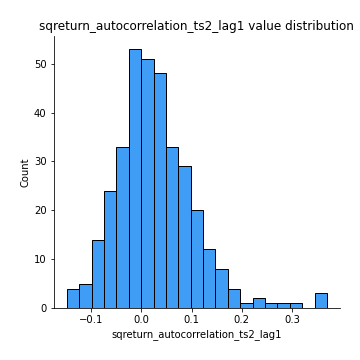
## Feature : sqreturn_autocorrelation_ts2_lag2
- **Feature type** : continous
- **Missing** : 0.0%
- **Unique** : 347
- **Count** :347.0
- **Mean** :0.01592457357345073
- **Std** :0.06526955957629753
- **Min** :-0.12018518991712382
- **25%th Percentile** : -0.021979957395953112
- **50%th Percentile** : 0.008912821427981612
- **75%th Percentile** : 0.04644165437456044
- **Max** :0.28672056150180414

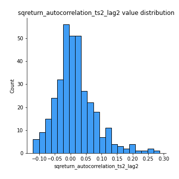
## Feature : sqreturn_autocorrelation_ts2_lag3
- **Feature type** : continous
- **Missing** : 0.0%
- **Unique** : 347
- **Count** :347.0
- **Mean** :0.008692031098612059
- **Std** :0.06644380712329594
- **Min** :-0.14986604751765353
- **25%th Percentile** : -0.029867624578923824
- **50%th Percentile** : -0.0037668111868120083
- **75%th Percentile** : 0.04229425723535038
- **Max** :0.3463122340368414

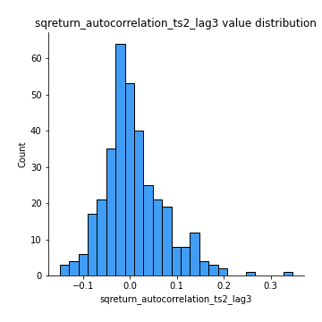
## Feature : sqreturn_correlation_ts1_lag_0
- **Feature type** : continous
- **Missing** : 0.0%
- **Unique** : 347
- **Count** :347.0
- **Mean** :0.30297539523071865
- **Std** :0.13385352868488765
- **Min** :-0.10256711281206837
- **25%th Percentile** : 0.22896548722935048
- **50%th Percentile** : 0.2953362314480694
- **75%th Percentile** : 0.3620756749824958
- **Max** :0.9937227277077512

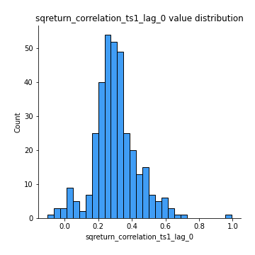
## Feature : sqreturn_correlation_ts1_lag_1
- **Feature type** : continous
- **Missing** : 0.0%
- **Unique** : 347
- **Count** :347.0
- **Mean** :0.012824232108903972
- **Std** :0.06661026507737988
- **Min** :-0.18856827637524448
- **25%th Percentile** : -0.035279498944089174
- **50%th Percentile** : 0.010227068266878912
- **75%th Percentile** : 0.06598312676788194
- **Max** :0.18295460057509072

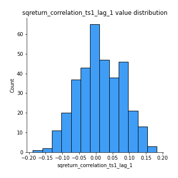
## Feature : sqreturn_correlation_ts1_lag_2
- **Feature type** : continous
- **Missing** : 0.0%
- **Unique** : 347
- **Count** :347.0
- **Mean** :0.00932140190965034
- **Std** :0.06713254919696589
- **Min** :-0.17543728074367104
- **25%th Percentile** : -0.037417168529704184
- **50%th Percentile** : 0.007930483357218314
- **75%th Percentile** : 0.05172279168593846
- **Max** :0.17974071501626168

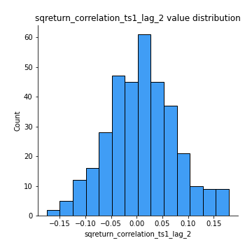
## Feature : sqreturn_correlation_ts1_lag_3
- **Feature type** : continous
- **Missing** : 0.0%
- **Unique** : 347
- **Count** :347.0
- **Mean** :0.02004193653923403
- **Std** :0.06883079165983991
- **Min** :-0.21147540839842804
- **25%th Percentile** : -0.02530550888311043
- **50%th Percentile** : 0.02025475436048913
- **75%th Percentile** : 0.06422703613849583
- **Max** :0.23808054096877584

## Feature : sqreturn_correlation_ts2_lag_1
- **Feature type** : continous
- **Missing** : 0.0%
- **Unique** : 347
- **Count** :347.0
- **Mean** :0.015683060482758422
- **Std** :0.07134688964626545
- **Min** :-0.17665751184419612
- **25%th Percentile** : -0.03452784504179842
- **50%th Percentile** : 0.014922710403638616
- **75%th Percentile** : 0.06352908089627149
- **Max** :0.3425036902091001

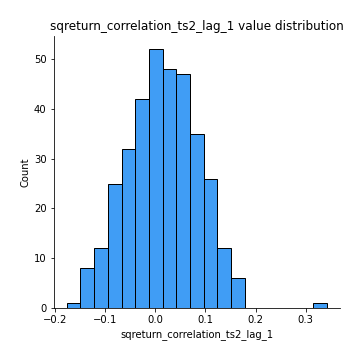
## Feature : sqreturn_correlation_ts2_lag_2
- **Feature type** : continous
- **Missing** : 0.0%
- **Unique** : 347
- **Count** :347.0
- **Mean** :0.0054910254333126
- **Std** :0.06511573800598636
- **Min** :-0.2757460186107768
- **25%th Percentile** : -0.03636692657597272
- **50%th Percentile** : 0.004784155476793254
- **75%th Percentile** : 0.04618315696701587
- **Max** :0.18051382329194504

## Feature : sqreturn_correlation_ts2_lag_3
- **Feature type** : continous
- **Missing** : 0.0%
- **Unique** : 347
- **Count** :347.0
- **Mean** :0.02058874446165289
- **Std** :0.06639656042349204
- **Min** :-0.15180996729466312
- **25%th Percentile** : -0.026308581605953875
- **50%th Percentile** : 0.022598171968423494
- **75%th Percentile** : 0.06413816778601891
- **Max** :0.20157143087228013

## Feature : price2_granger_cause_price1
- **Feature type** : continous
- **Missing** : 0.0%
- **Unique** : 347
- **Count** :347.0
- **Mean** :0.2606548980408899
- **Std** :0.2877861247331608
- **Min** :2.4312048970873696e-09
- **25%th Percentile** : 0.016746515538493458
- **50%th Percentile** : 0.1187311574606459
- **75%th Percentile** : 0.4687502490986834
- **Max** :0.9898380228448623

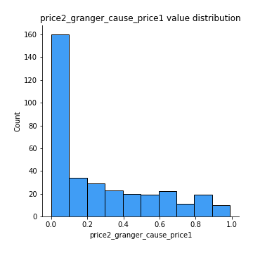
## Feature : price1_granger_cause_price2
- **Feature type** : continous
- **Missing** : 0.0%
- **Unique** : 347
- **Count** :347.0
- **Mean** :0.24057954222519914
- **Std** :0.2811637985082755
- **Min** :1.2012269232170316e-11
- **25%th Percentile** : 0.01509365899065138
- **50%th Percentile** : 0.11493847099291839
- **75%th Percentile** : 0.38198048494969516
- **Max** :0.9923880500679446

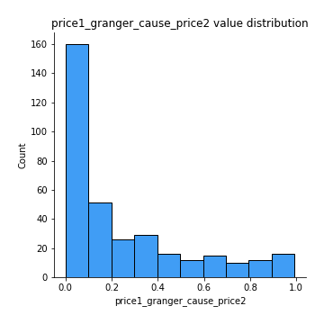

[<< Go back](../README.md)
