# Summary of 3_Linear

[<< Go back](../README.md)

## Logistic Regression (Linear)
- **n_jobs**: -1
- **explain_level**: 2

## Validation
 - **validation_type**: split
 - **train_ratio**: 0.75
 - **shuffle**: True
 - **stratify**: True

## Optimized metric
accuracy

## Training time

4.4 seconds

## Metric details
|           |    score |   threshold |
|:----------|---------:|------------:|
| logloss   | 0.197125 | nan         |
| auc       | 0.998414 | nan         |
| f1        | 0.977273 |   0.419337  |
| accuracy  | 0.977011 |   0.489547  |
| precision | 1        |   0.874521  |
| recall    | 1        |   8.558e-06 |
| mcc       | 0.95505  |   0.419337  |

## Confusion matrix (at threshold=0.489547)
|                      |   Predicted as real |   Predicted as simulated |
|:---------------------|--------------------:|-------------------------:|
| Labeled as real      |                  43 |                        1 |
| Labeled as simulated |                   1 |                       42 |

## Learning curves
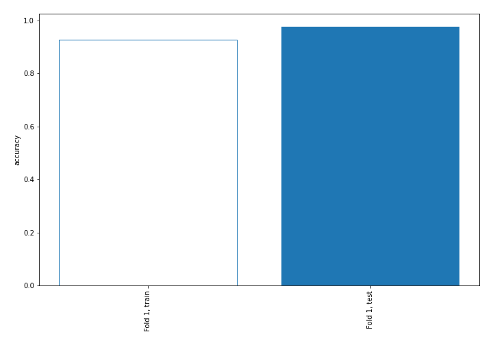

## Coefficients
| feature                           |   Learner_1 |
|:----------------------------------|------------:|
| sqreturn_autocorrelation_ts1_lag3 |   2.55833   |
| sqreturn_autocorrelation_ts2_lag3 |   2.07575   |
| sqreturn_autocorrelation_ts1_lag2 |   1.98931   |
| sqreturn_autocorrelation_ts2_lag2 |   1.9469    |
| return_correlation_ts1_lag_0      |   1.82324   |
| sqreturn_correlation_ts1_lag_0    |   1.82324   |
| return_mean2                      |   1.39554   |
| sqreturn_autocorrelation_ts1_lag1 |   1.37222   |
| sqreturn_autocorrelation_ts2_lag1 |   1.16786   |
| return_autocorrelation_1_lag1     |   0.634118  |
| return_sd2                        |   0.600007  |
| return_mean1                      |   0.560744  |
| return_correlation_ts1_lag_2      |   0.545455  |
| sqreturn_correlation_ts1_lag_2    |   0.545455  |
| return_autocorrelation_1_lag2     |   0.536674  |
| sqreturn_correlation_ts1_lag_1    |   0.0888523 |
| return_correlation_ts1_lag_1      |   0.0888523 |
| price1_granger_cause_price2       |   0.0456512 |
| return_correlation_ts2_lag_2      |   0.0263424 |
| sqreturn_correlation_ts2_lag_2    |   0.0263424 |
| return_autocorrelation_1_lag3     |  -0.042426  |
| sqreturn_correlation_ts2_lag_1    |  -0.0881584 |
| return_correlation_ts2_lag_1      |  -0.0881584 |
| return_autocorrelation_2_lag2     |  -0.159241  |
| sqreturn_correlation_ts1_lag_3    |  -0.213622  |
| return_correlation_ts1_lag_3      |  -0.213622  |
| return_autocorrelation_2_lag1     |  -0.253212  |
| return_skew2                      |  -0.348852  |
| return_correlation_ts2_lag_3      |  -0.37541   |
| sqreturn_correlation_ts2_lag_3    |  -0.37541   |
| price2_granger_cause_price1       |  -0.385195  |
| return_skew1                      |  -0.510598  |
| return_sd1                        |  -0.572042  |
| return_autocorrelation_2_lag3     |  -0.821729  |
| return_kurtosis1                  |  -0.922276  |
| return_kurtosis2                  |  -2.18258   |
| intercept                         |  -3.38994   |

## Permutation-based Importance
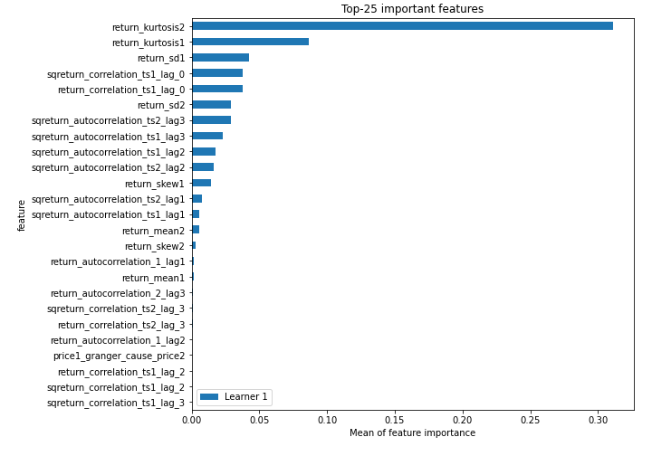
## Confusion Matrix

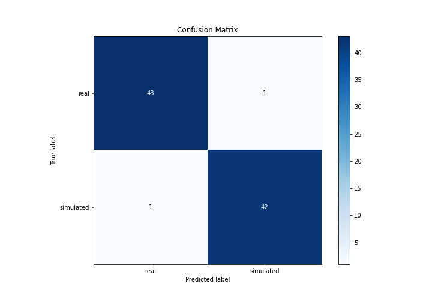

## Normalized Confusion Matrix

## ROC Curve

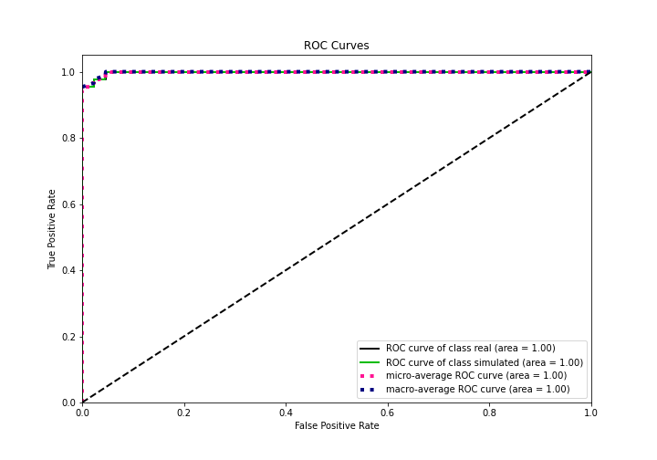

## Kolmogorov-Smirnov Statistic

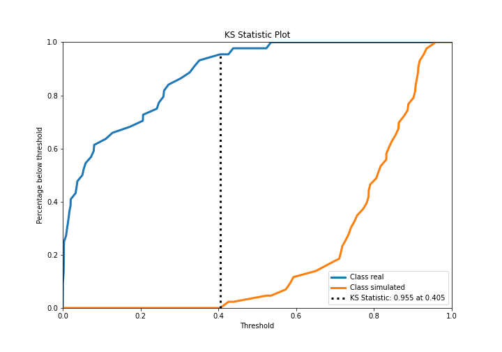

## Precision-Recall Curve

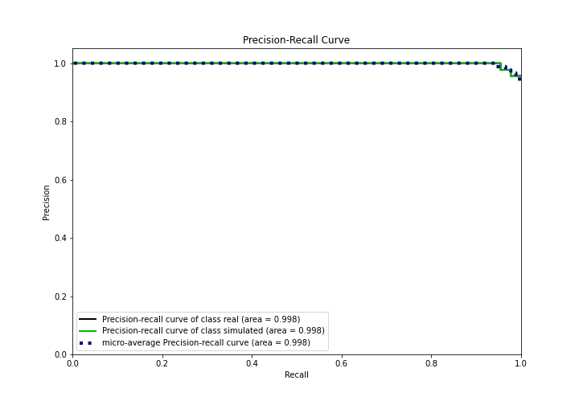

## Calibration Curve

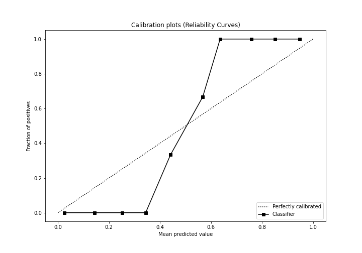

## Cumulative Gains Curve

## Lift Curve

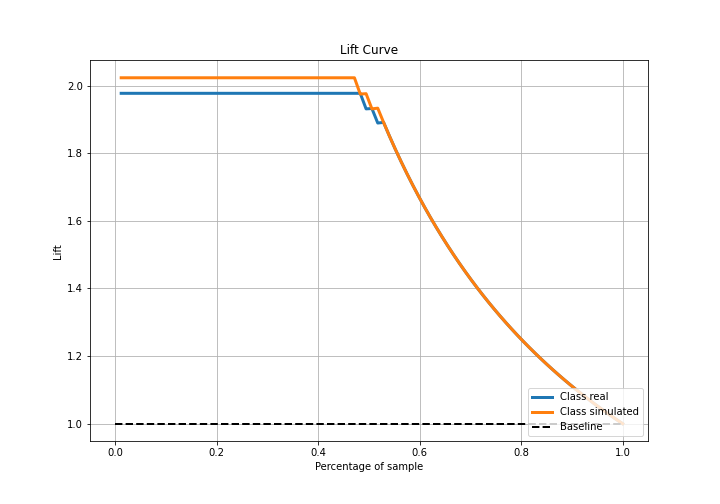

## SHAP Importance
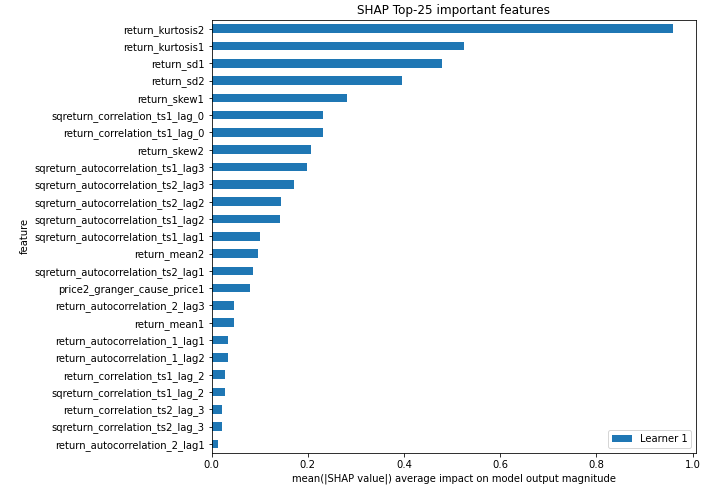

## SHAP Dependence plots

### Dependence (Fold 1)
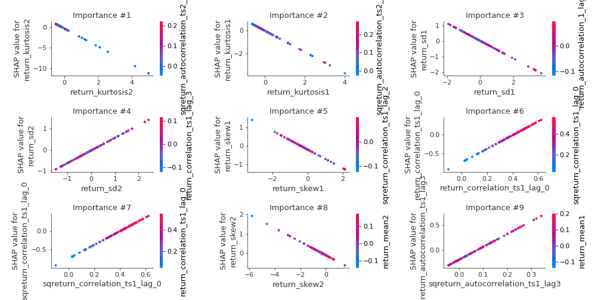

## SHAP Decision plots

### Top-10 Worst decisions for class 0 (Fold 1)
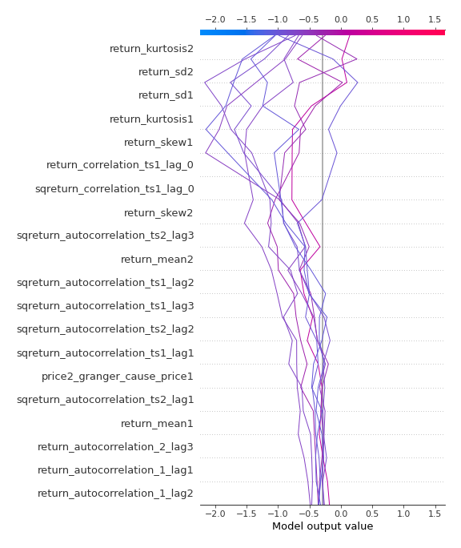
### Top-10 Best decisions for class 0 (Fold 1)
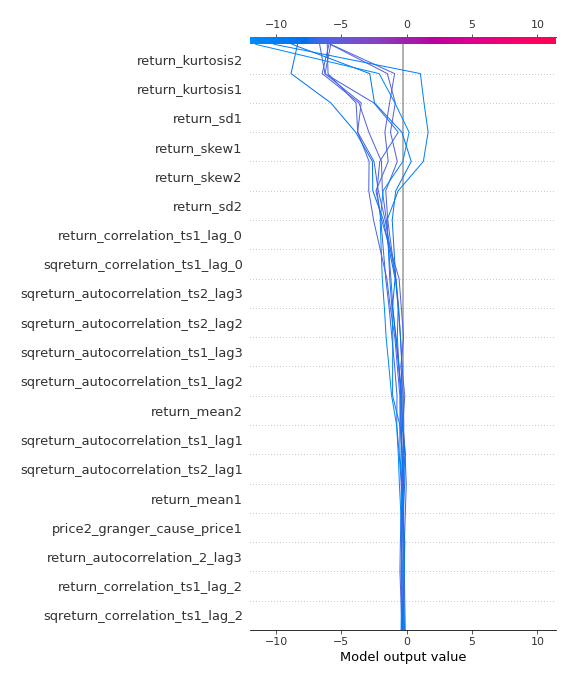
### Top-10 Worst decisions for class 1 (Fold 1)
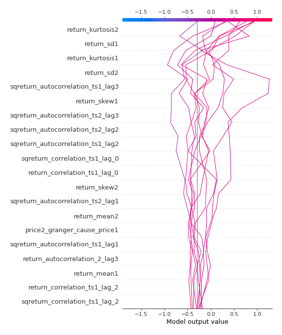
### Top-10 Best decisions for class 1 (Fold 1)
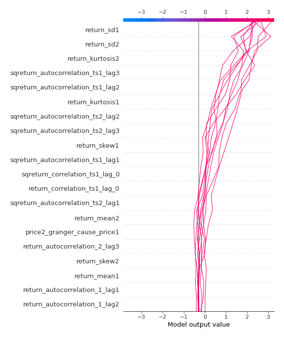

[<< Go back](../README.md)
