# Exploratory Data Analysis

[<< Go back](../README.md)
## Feature : target
- **Feature type** : categorical
- **Missing** : 0.0%
- **Unique** : 2
- **Count** :347
- **Unique** :2
- **Top** :real
- **Freq** :175

## Feature : return_mean1
- **Feature type** : continous
- **Missing** : 0.0%
- **Unique** : 347
- **Count** :347.0
- **Mean** :0.05743139042586964
- **Std** :0.10914905335663681
- **Min** :-0.297638839829253
- **25%th Percentile** : -0.012134660945419234
- **50%th Percentile** : 0.0722997840422221
- **75%th Percentile** : 0.13163462209157328
- **Max** :0.3602793017097547

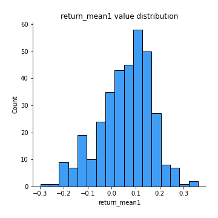
## Feature : return_mean2
- **Feature type** : continous
- **Missing** : 0.0%
- **Unique** : 347
- **Count** :347.0
- **Mean** :0.05022898657036083
- **Std** :0.10583584754318541
- **Min** :-0.3439835398279146
- **25%th Percentile** : -0.003576268965925203
- **50%th Percentile** : 0.0557957619327508
- **75%th Percentile** : 0.10982028042785644
- **Max** :0.6801605239983173

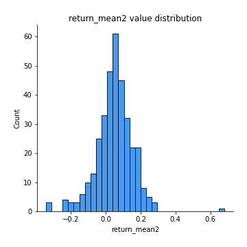
## Feature : return_sd1
- **Feature type** : continous
- **Missing** : 0.0%
- **Unique** : 347
- **Count** :347.0
- **Mean** :1.5507886192791493
- **Std** :0.5041088317816079
- **Min** :0.4186670799398369
- **25%th Percentile** : 1.2053783243646083
- **50%th Percentile** : 1.50662850560653
- **75%th Percentile** : 1.825376971240328
- **Max** :3.332494027875222

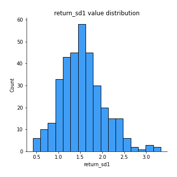
## Feature : return_sd2
- **Feature type** : continous
- **Missing** : 0.0%
- **Unique** : 347
- **Count** :347.0
- **Mean** :1.771797208021137
- **Std** :0.5537044494770146
- **Min** :0.5964940585020683
- **25%th Percentile** : 1.387256469422514
- **50%th Percentile** : 1.686661760292425
- **75%th Percentile** : 2.1049104434517605
- **Max** :4.59233049161685

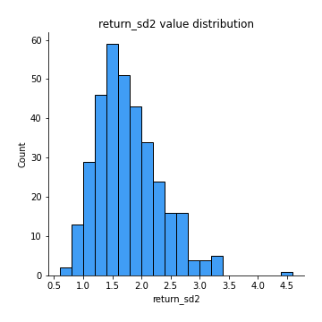
## Feature : return_skew1
- **Feature type** : continous
- **Missing** : 0.0%
- **Unique** : 347
- **Count** :347.0
- **Mean** :-0.37643041507880265
- **Std** :0.730448772943019
- **Min** :-4.239645236578449
- **25%th Percentile** : -0.5710113311681926
- **50%th Percentile** : -0.3525098193893167
- **75%th Percentile** : -0.10712637311496617
- **Max** :2.3044235031125564

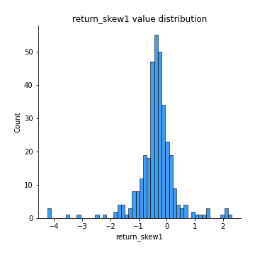
## Feature : return_skew2
- **Feature type** : continous
- **Missing** : 0.0%
- **Unique** : 347
- **Count** :347.0
- **Mean** :-0.44705502699480587
- **Std** :1.0452147133934926
- **Min** :-7.3762354994385335
- **25%th Percentile** : -0.5971212456142232
- **50%th Percentile** : -0.2994943929883844
- **75%th Percentile** : -0.024551684830540814
- **Max** :4.0310261345618

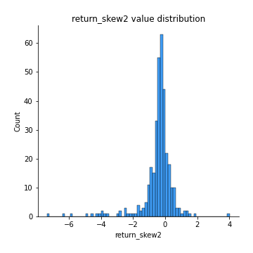
## Feature : return_kurtosis1
- **Feature type** : continous
- **Missing** : 0.0%
- **Unique** : 347
- **Count** :347.0
- **Mean** :3.741930619574612
- **Std** :5.317922480889868
- **Min** :-0.148045217131473
- **25%th Percentile** : 1.3113598503897705
- **50%th Percentile** : 1.9907256873151007
- **75%th Percentile** : 3.858892957093764
- **Max** :40.485294874464934

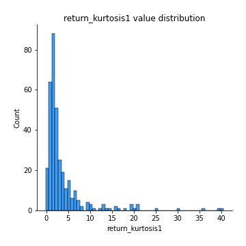
## Feature : return_kurtosis2
- **Feature type** : continous
- **Missing** : 0.0%
- **Unique** : 347
- **Count** :347.0
- **Mean** :5.047433764200678
- **Std** :9.682761162066553
- **Min** :-0.1693240760286967
- **25%th Percentile** : 1.2478884986948746
- **50%th Percentile** : 2.1395046177948225
- **75%th Percentile** : 4.5098371496721885
- **Max** :94.01659180149953

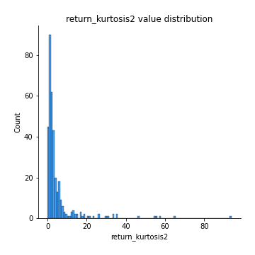
## Feature : return_autocorrelation_1_lag1
- **Feature type** : continous
- **Missing** : 0.0%
- **Unique** : 347
- **Count** :347.0
- **Mean** :-0.003643344999282966
- **Std** :0.07453127702608879
- **Min** :-0.2110198016529991
- **25%th Percentile** : -0.053095577915971984
- **50%th Percentile** : -0.0006243177732292048
- **75%th Percentile** : 0.04139887236479031
- **Max** :0.24117299325656508

## Feature : return_autocorrelation_1_lag2
- **Feature type** : continous
- **Missing** : 0.0%
- **Unique** : 347
- **Count** :347.0
- **Mean** :-0.009281211518968208
- **Std** :0.07699414808607986
- **Min** :-0.20962679836682638
- **25%th Percentile** : -0.05922612556964914
- **50%th Percentile** : -0.016727906203027016
- **75%th Percentile** : 0.044379367292249575
- **Max** :0.24977235987150093

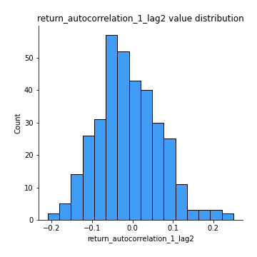
## Feature : return_autocorrelation_1_lag3
- **Feature type** : continous
- **Missing** : 0.0%
- **Unique** : 347
- **Count** :347.0
- **Mean** :0.011574105397892717
- **Std** :0.06996658023121335
- **Min** :-0.20011235328011573
- **25%th Percentile** : -0.03454196793967777
- **50%th Percentile** : 0.01629696322935137
- **75%th Percentile** : 0.05599394568879841
- **Max** :0.17514033413395239

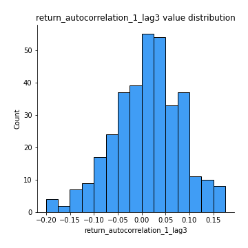
## Feature : return_autocorrelation_2_lag1
- **Feature type** : continous
- **Missing** : 0.0%
- **Unique** : 347
- **Count** :347.0
- **Mean** :-0.007786326646417429
- **Std** :0.07432821214360695
- **Min** :-0.17778763204400128
- **25%th Percentile** : -0.061939970225242856
- **50%th Percentile** : -0.00563982239545521
- **75%th Percentile** : 0.046318519854474334
- **Max** :0.1877728597669003

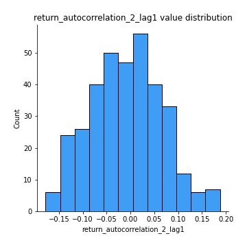
## Feature : return_autocorrelation_2_lag2
- **Feature type** : continous
- **Missing** : 0.0%
- **Unique** : 347
- **Count** :347.0
- **Mean** :-0.012688898115787325
- **Std** :0.07164939710813713
- **Min** :-0.25776985107221567
- **25%th Percentile** : -0.05962132467845113
- **50%th Percentile** : -0.01032757754370766
- **75%th Percentile** : 0.03312240303935393
- **Max** :0.2629304970047986

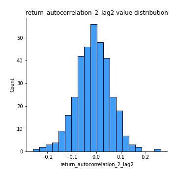
## Feature : return_autocorrelation_2_lag3
- **Feature type** : continous
- **Missing** : 0.0%
- **Unique** : 347
- **Count** :347.0
- **Mean** :-0.0012078164990134263
- **Std** :0.0700418140222139
- **Min** :-0.1798960840760737
- **25%th Percentile** : -0.047663778720982895
- **50%th Percentile** : 0.0007110275268207789
- **75%th Percentile** : 0.05197779517901766
- **Max** :0.23774983587462192

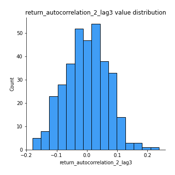
## Feature : return_correlation_ts1_lag_0
- **Feature type** : continous
- **Missing** : 0.0%
- **Unique** : 347
- **Count** :347.0
- **Mean** :0.3972451655696684
- **Std** :0.15237871788335072
- **Min** :-0.10256711281206837
- **25%th Percentile** : 0.3205786448063934
- **50%th Percentile** : 0.4384490152074282
- **75%th Percentile** : 0.504190631167307
- **Max** :0.7227330027882508

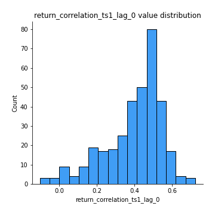
## Feature : return_correlation_ts1_lag_1
- **Feature type** : continous
- **Missing** : 0.0%
- **Unique** : 347
- **Count** :347.0
- **Mean** :-0.0038762105485109968
- **Std** :0.06790222747840648
- **Min** :-0.20762790983488352
- **25%th Percentile** : -0.0514475679903167
- **50%th Percentile** : -0.00024243483539062766
- **75%th Percentile** : 0.04393314697396457
- **Max** :0.18734984004006802

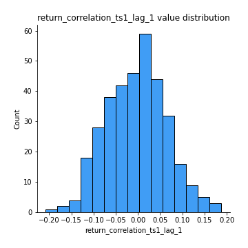
## Feature : return_correlation_ts1_lag_2
- **Feature type** : continous
- **Missing** : 0.0%
- **Unique** : 347
- **Count** :347.0
- **Mean** :-0.0030967723680427675
- **Std** :0.07227963984024638
- **Min** :-0.2118197273158841
- **25%th Percentile** : -0.04663491228330001
- **50%th Percentile** : -0.0053145646560008655
- **75%th Percentile** : 0.04457113813086831
- **Max** :0.22587845643056864

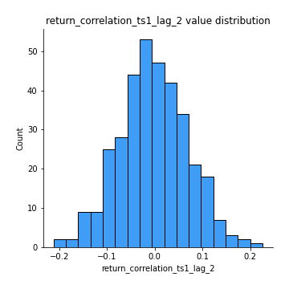
## Feature : return_correlation_ts1_lag_3
- **Feature type** : continous
- **Missing** : 0.0%
- **Unique** : 347
- **Count** :347.0
- **Mean** :0.00424570316295192
- **Std** :0.07505962276326335
- **Min** :-0.2494699688483193
- **25%th Percentile** : -0.04004590421996411
- **50%th Percentile** : 0.00898543924464915
- **75%th Percentile** : 0.05288208582159324
- **Max** :0.23808054096877584

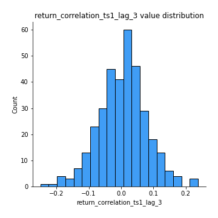
## Feature : return_correlation_ts2_lag_1
- **Feature type** : continous
- **Missing** : 0.0%
- **Unique** : 347
- **Count** :347.0
- **Mean** :0.004218837835918578
- **Std** :0.08018596944094172
- **Min** :-0.20655854884447394
- **25%th Percentile** : -0.05420924469436618
- **50%th Percentile** : 0.0034835533768496946
- **75%th Percentile** : 0.061340070564255396
- **Max** :0.3425036902091001

## Feature : return_correlation_ts2_lag_2
- **Feature type** : continous
- **Missing** : 0.0%
- **Unique** : 347
- **Count** :347.0
- **Mean** :-0.003839639458765839
- **Std** :0.07412226622649834
- **Min** :-0.2757460186107768
- **25%th Percentile** : -0.047829646826821684
- **50%th Percentile** : -0.0013781773801266263
- **75%th Percentile** : 0.04385501219857789
- **Max** :0.31824948393319535

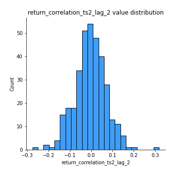
## Feature : return_correlation_ts2_lag_3
- **Feature type** : continous
- **Missing** : 0.0%
- **Unique** : 347
- **Count** :347.0
- **Mean** :0.006429171427201321
- **Std** :0.07203787439784974
- **Min** :-0.2114125199941742
- **25%th Percentile** : -0.0405369737540809
- **50%th Percentile** : 0.006885373371801316
- **75%th Percentile** : 0.05178293295210788
- **Max** :0.22244761360005497

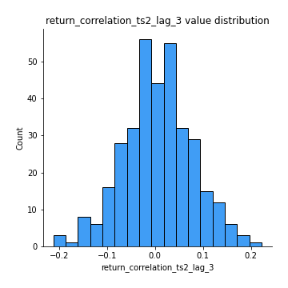
## Feature : sqreturn_autocorrelation_ts1_lag1
- **Feature type** : continous
- **Missing** : 0.0%
- **Unique** : 347
- **Count** :347.0
- **Mean** :0.11055125728574276
- **Std** :0.09895761976367926
- **Min** :-0.06641170505474243
- **25%th Percentile** : 0.03151422258295999
- **50%th Percentile** : 0.10014462039915177
- **75%th Percentile** : 0.1723209261996812
- **Max** :0.44082309401528863

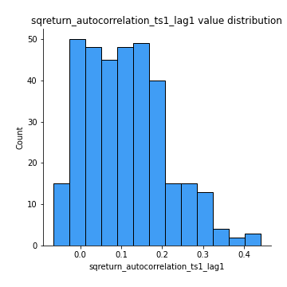
## Feature : sqreturn_autocorrelation_ts1_lag2
- **Feature type** : continous
- **Missing** : 0.0%
- **Unique** : 347
- **Count** :347.0
- **Mean** :0.09600348042891417
- **Std** :0.09954587163896128
- **Min** :-0.06594883862904495
- **25%th Percentile** : 0.01644342909527801
- **50%th Percentile** : 0.07888379584687576
- **75%th Percentile** : 0.15367733503680142
- **Max** :0.4217879451921531

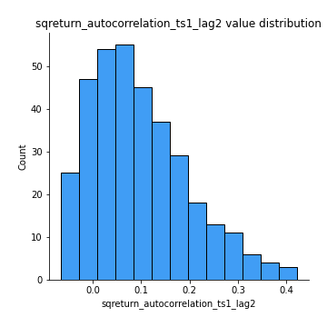
## Feature : sqreturn_autocorrelation_ts1_lag3
- **Feature type** : continous
- **Missing** : 0.0%
- **Unique** : 347
- **Count** :347.0
- **Mean** :0.08584058025498971
- **Std** :0.09875883021244974
- **Min** :-0.07624495748065484
- **25%th Percentile** : 0.005044134680439606
- **50%th Percentile** : 0.06785785456979972
- **75%th Percentile** : 0.14377477677130535
- **Max** :0.39346595742444773

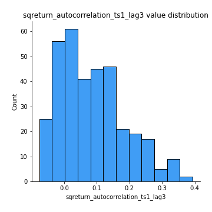
## Feature : sqreturn_autocorrelation_ts2_lag1
- **Feature type** : continous
- **Missing** : 0.0%
- **Unique** : 347
- **Count** :347.0
- **Mean** :0.09473810685371259
- **Std** :0.09183836696422265
- **Min** :-0.08781931655212678
- **25%th Percentile** : 0.022750028800117512
- **50%th Percentile** : 0.07895890651614394
- **75%th Percentile** : 0.14893437195454393
- **Max** :0.4439565002711306

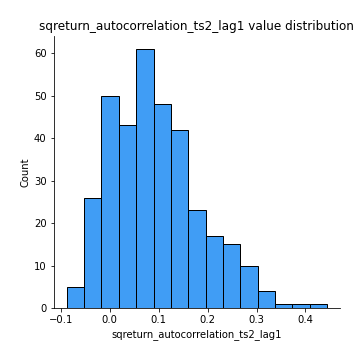
## Feature : sqreturn_autocorrelation_ts2_lag2
- **Feature type** : continous
- **Missing** : 0.0%
- **Unique** : 347
- **Count** :347.0
- **Mean** :0.076581051743637
- **Std** :0.09043066606757703
- **Min** :-0.10054631197559977
- **25%th Percentile** : 0.0022843805808303638
- **50%th Percentile** : 0.05877421450751531
- **75%th Percentile** : 0.13228415085466372
- **Max** :0.4357732148044449

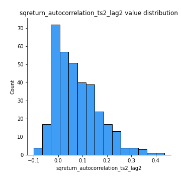
## Feature : sqreturn_autocorrelation_ts2_lag3
- **Feature type** : continous
- **Missing** : 0.0%
- **Unique** : 347
- **Count** :347.0
- **Mean** :0.07319497377417622
- **Std** :0.0959020544438915
- **Min** :-0.09756858950376449
- **25%th Percentile** : -0.008001835293375737
- **50%th Percentile** : 0.04850171591721507
- **75%th Percentile** : 0.13609432975193886
- **Max** :0.4026265807345804

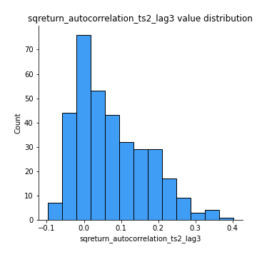
## Feature : sqreturn_correlation_ts1_lag_0
- **Feature type** : continous
- **Missing** : 0.0%
- **Unique** : 347
- **Count** :347.0
- **Mean** :0.3972451655696684
- **Std** :0.15237871788335072
- **Min** :-0.10256711281206837
- **25%th Percentile** : 0.3205786448063934
- **50%th Percentile** : 0.4384490152074282
- **75%th Percentile** : 0.504190631167307
- **Max** :0.7227330027882508

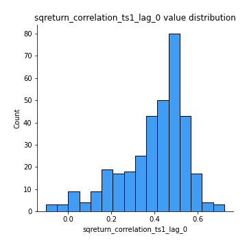
## Feature : sqreturn_correlation_ts1_lag_1
- **Feature type** : continous
- **Missing** : 0.0%
- **Unique** : 347
- **Count** :347.0
- **Mean** :-0.0038762105485109968
- **Std** :0.06790222747840648
- **Min** :-0.20762790983488352
- **25%th Percentile** : -0.0514475679903167
- **50%th Percentile** : -0.00024243483539062766
- **75%th Percentile** : 0.04393314697396457
- **Max** :0.18734984004006802

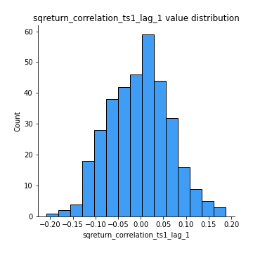
## Feature : sqreturn_correlation_ts1_lag_2
- **Feature type** : continous
- **Missing** : 0.0%
- **Unique** : 347
- **Count** :347.0
- **Mean** :-0.0030967723680427675
- **Std** :0.07227963984024638
- **Min** :-0.2118197273158841
- **25%th Percentile** : -0.04663491228330001
- **50%th Percentile** : -0.0053145646560008655
- **75%th Percentile** : 0.04457113813086831
- **Max** :0.22587845643056864

## Feature : sqreturn_correlation_ts1_lag_3
- **Feature type** : continous
- **Missing** : 0.0%
- **Unique** : 347
- **Count** :347.0
- **Mean** :0.00424570316295192
- **Std** :0.07505962276326335
- **Min** :-0.2494699688483193
- **25%th Percentile** : -0.04004590421996411
- **50%th Percentile** : 0.00898543924464915
- **75%th Percentile** : 0.05288208582159324
- **Max** :0.23808054096877584

## Feature : sqreturn_correlation_ts2_lag_1
- **Feature type** : continous
- **Missing** : 0.0%
- **Unique** : 347
- **Count** :347.0
- **Mean** :0.004218837835918578
- **Std** :0.08018596944094172
- **Min** :-0.20655854884447394
- **25%th Percentile** : -0.05420924469436618
- **50%th Percentile** : 0.0034835533768496946
- **75%th Percentile** : 0.061340070564255396
- **Max** :0.3425036902091001

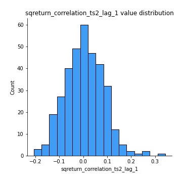
## Feature : sqreturn_correlation_ts2_lag_2
- **Feature type** : continous
- **Missing** : 0.0%
- **Unique** : 347
- **Count** :347.0
- **Mean** :-0.003839639458765839
- **Std** :0.07412226622649834
- **Min** :-0.2757460186107768
- **25%th Percentile** : -0.047829646826821684
- **50%th Percentile** : -0.0013781773801266263
- **75%th Percentile** : 0.04385501219857789
- **Max** :0.31824948393319535

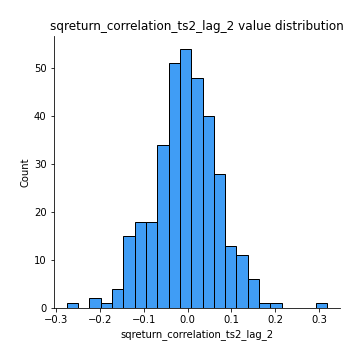
## Feature : sqreturn_correlation_ts2_lag_3
- **Feature type** : continous
- **Missing** : 0.0%
- **Unique** : 347
- **Count** :347.0
- **Mean** :0.006429171427201321
- **Std** :0.07203787439784974
- **Min** :-0.2114125199941742
- **25%th Percentile** : -0.0405369737540809
- **50%th Percentile** : 0.006885373371801316
- **75%th Percentile** : 0.05178293295210788
- **Max** :0.22244761360005497

## Feature : price2_granger_cause_price1
- **Feature type** : continous
- **Missing** : 0.0%
- **Unique** : 347
- **Count** :347.0
- **Mean** :0.260559481632404
- **Std** :0.2849426426238636
- **Min** :2.4312048970873696e-09
- **25%th Percentile** : 0.01894326082788329
- **50%th Percentile** : 0.17111695591819015
- **75%th Percentile** : 0.4227078590697356
- **Max** :0.9955994539953537

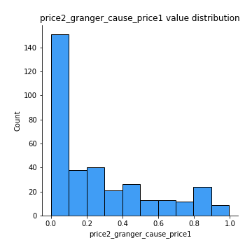
## Feature : price1_granger_cause_price2
- **Feature type** : continous
- **Missing** : 0.0%
- **Unique** : 347
- **Count** :347.0
- **Mean** :0.2788420130005616
- **Std** :0.28932713292009526
- **Min** :1.2012269232170316e-11
- **25%th Percentile** : 0.02607262282185563
- **50%th Percentile** : 0.20491413805024683
- **75%th Percentile** : 0.4414711727435079
- **Max** :0.9966417862361986

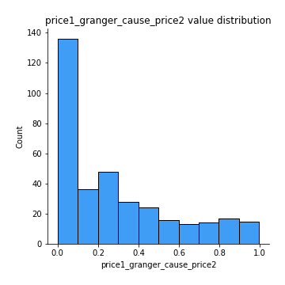

[<< Go back](../README.md)
