# Summary of 2_DecisionTree

[<< Go back](../README.md)

## Decision Tree
- **n_jobs**: -1
- **criterion**: gini
- **max_depth**: 3
- **explain_level**: 2

## Validation
 - **validation_type**: split
 - **train_ratio**: 0.75
 - **shuffle**: True
 - **stratify**: True

## Optimized metric
accuracy

## Training time

6.5 seconds

## Metric details
|           |    score |   threshold |
|:----------|---------:|------------:|
| logloss   | 1.20267  |  nan        |
| auc       | 0.783669 |  nan        |
| f1        | 0.795181 |    0.196839 |
| accuracy  | 0.804598 |    0.196839 |
| precision | 0.785714 |    0.196839 |
| recall    | 0.95122  |    0        |
| mcc       | 0.608581 |    0.196839 |

## Confusion matrix (at threshold=0.196839)
|                      |   Predicted as real |   Predicted as simulated |
|:---------------------|--------------------:|-------------------------:|
| Labeled as real      |                  37 |                        9 |
| Labeled as simulated |                   8 |                       33 |

## Learning curves
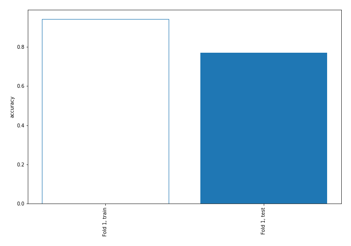

## Decision Tree 

### Tree #1
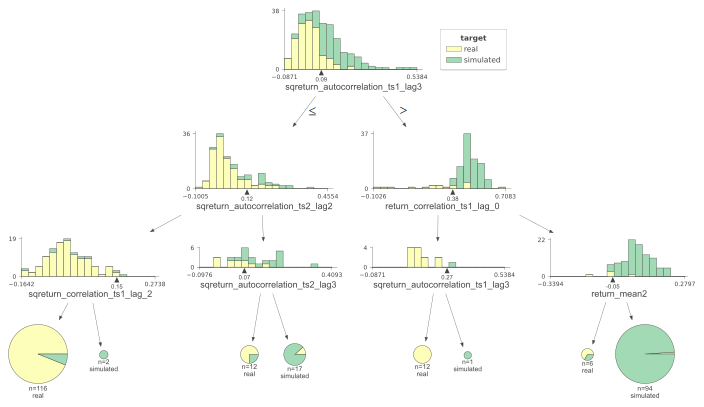

### Rules

if (sqreturn_autocorrelation_ts1_lag3 <= 0.087) and (sqreturn_autocorrelation_ts2_lag2 <= 0.116) and (sqreturn_correlation_ts1_lag_2 <= 0.149) then class: real (proba: 93.97%) | based on 116 samples

if (sqreturn_autocorrelation_ts1_lag3 > 0.087) and (return_correlation_ts1_lag_0 > 0.384) and (return_mean2 > -0.052) then class: simulated (proba: 98.94%) | based on 94 samples

if (sqreturn_autocorrelation_ts1_lag3 <= 0.087) and (sqreturn_autocorrelation_ts2_lag2 > 0.116) and (sqreturn_autocorrelation_ts2_lag3 > 0.075) then class: simulated (proba: 88.24%) | based on 17 samples

if (sqreturn_autocorrelation_ts1_lag3 > 0.087) and (return_correlation_ts1_lag_0 <= 0.384) and (sqreturn_autocorrelation_ts1_lag3 <= 0.266) then class: real (proba: 100.0%) | based on 12 samples

if (sqreturn_autocorrelation_ts1_lag3 <= 0.087) and (sqreturn_autocorrelation_ts2_lag2 > 0.116) and (sqreturn_autocorrelation_ts2_lag3 <= 0.075) then class: real (proba: 75.0%) | based on 12 samples

if (sqreturn_autocorrelation_ts1_lag3 > 0.087) and (return_correlation_ts1_lag_0 > 0.384) and (return_mean2 <= -0.052) then class: real (proba: 66.67%) | based on 6 samples

if (sqreturn_autocorrelation_ts1_lag3 <= 0.087) and (sqreturn_autocorrelation_ts2_lag2 <= 0.116) and (sqreturn_correlation_ts1_lag_2 > 0.149) then class: simulated (proba: 100.0%) | based on 2 samples

if (sqreturn_autocorrelation_ts1_lag3 > 0.087) and (return_correlation_ts1_lag_0 <= 0.384) and (sqreturn_autocorrelation_ts1_lag3 > 0.266) then class: simulated (proba: 100.0%) | based on 1 samples

## Permutation-based Importance
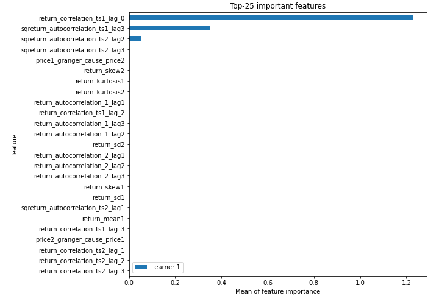
## Confusion Matrix

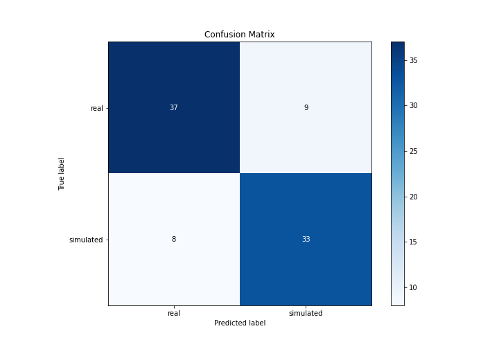

## Normalized Confusion Matrix

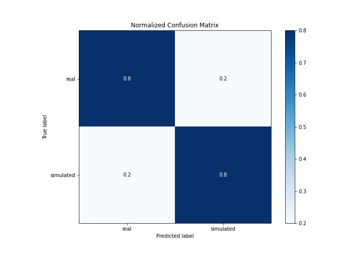

## ROC Curve

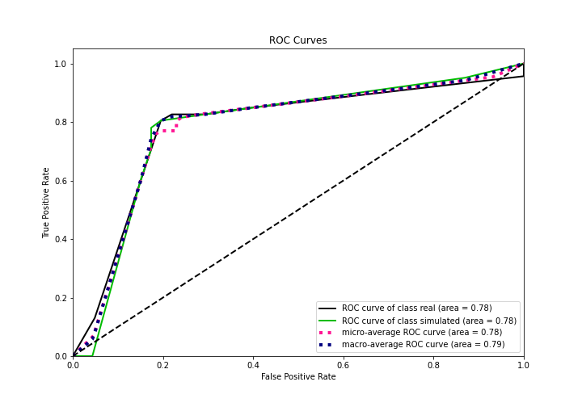

## Kolmogorov-Smirnov Statistic

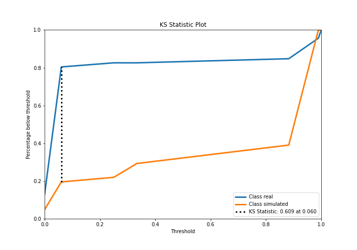

## Precision-Recall Curve

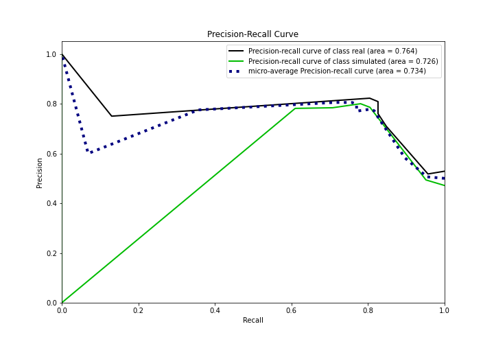

## Calibration Curve

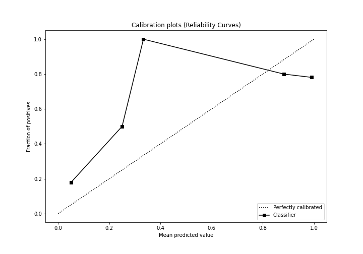

## Cumulative Gains Curve

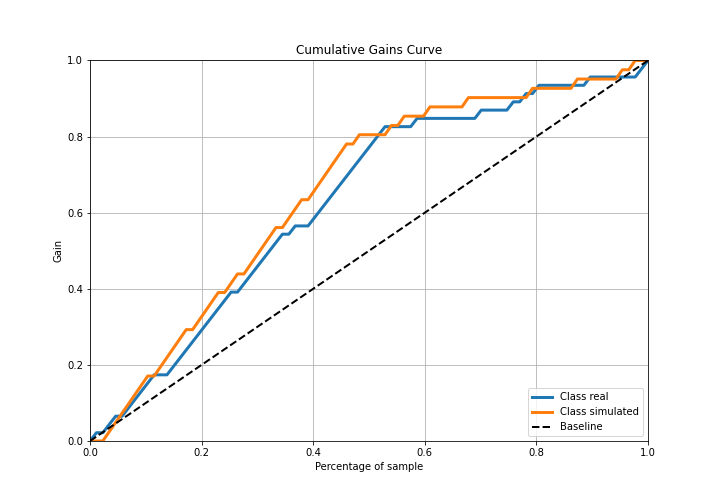

## Lift Curve

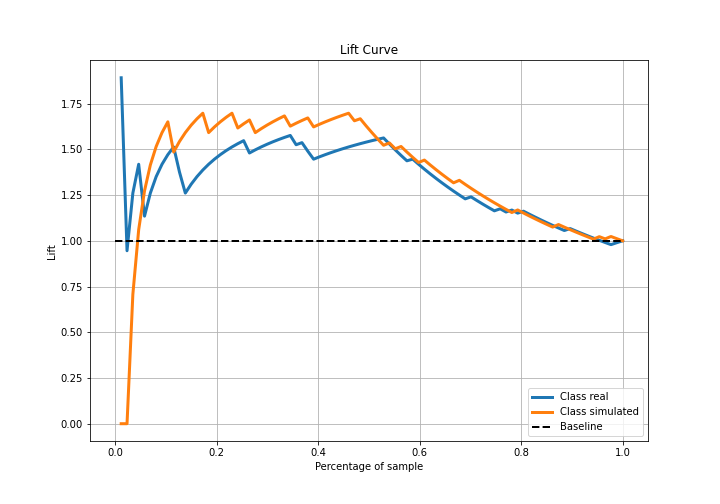

## SHAP Importance
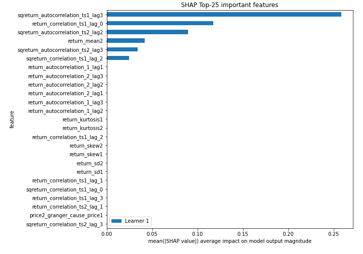

## SHAP Dependence plots

### Dependence (Fold 1)
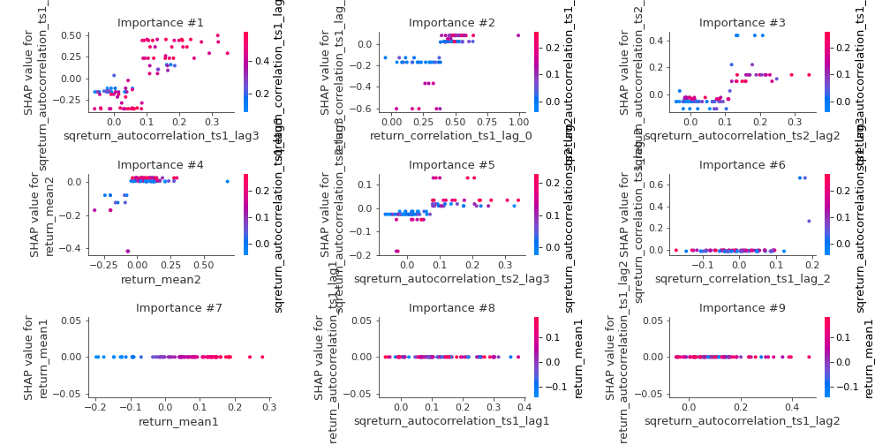

## SHAP Decision plots

### Top-10 Worst decisions for class 0 (Fold 1)

### Top-10 Best decisions for class 0 (Fold 1)
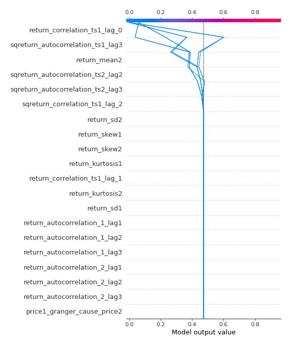
### Top-10 Worst decisions for class 1 (Fold 1)
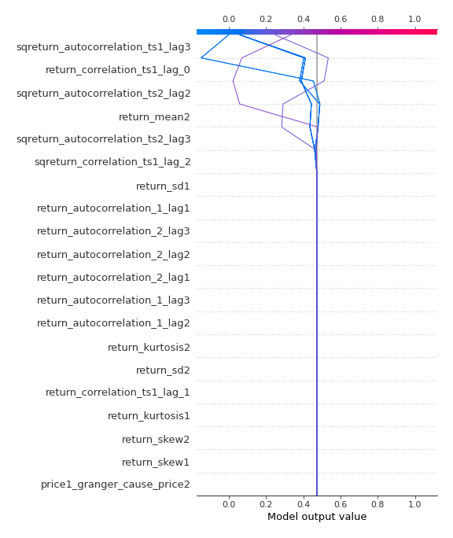
### Top-10 Best decisions for class 1 (Fold 1)
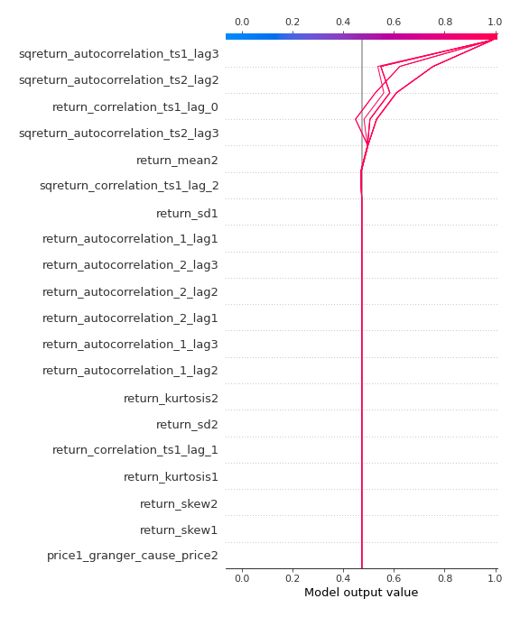

[<< Go back](../README.md)
