# Summary of 3_Linear

[<< Go back](../README.md)

## Logistic Regression (Linear)
- **n_jobs**: -1
- **explain_level**: 2

## Validation
 - **validation_type**: split
 - **train_ratio**: 0.75
 - **shuffle**: True
 - **stratify**: True

## Optimized metric
accuracy

## Training time

6.6 seconds

## Metric details
|           |    score |     threshold |
|:----------|---------:|--------------:|
| logloss   | 0.30363  | nan           |
| auc       | 0.953871 | nan           |
| f1        | 0.898876 |   0.382795    |
| accuracy  | 0.896552 |   0.382795    |
| precision | 1        |   0.897819    |
| recall    | 1        |   6.14876e-08 |
| mcc       | 0.804689 |   0.382795    |

## Confusion matrix (at threshold=0.382795)
|                      |   Predicted as real |   Predicted as simulated |
|:---------------------|--------------------:|-------------------------:|
| Labeled as real      |                  38 |                        8 |
| Labeled as simulated |                   1 |                       40 |

## Learning curves

## Coefficients
| feature                           |   Learner_1 |
|:----------------------------------|------------:|
| sqreturn_autocorrelation_ts1_lag2 |   2.12536   |
| sqreturn_autocorrelation_ts2_lag3 |   2.07643   |
| sqreturn_autocorrelation_ts1_lag3 |   1.98683   |
| sqreturn_autocorrelation_ts2_lag2 |   1.86121   |
| return_correlation_ts1_lag_0      |   1.75152   |
| sqreturn_correlation_ts1_lag_0    |   1.75152   |
| return_mean1                      |   1.28258   |
| return_mean2                      |   1.26881   |
| sqreturn_autocorrelation_ts2_lag1 |   1.13508   |
| sqreturn_autocorrelation_ts1_lag1 |   0.904166  |
| return_autocorrelation_1_lag1     |   0.825692  |
| return_sd2                        |   0.747649  |
| return_autocorrelation_1_lag2     |   0.675113  |
| return_correlation_ts1_lag_1      |   0.428584  |
| sqreturn_correlation_ts1_lag_1    |   0.428584  |
| sqreturn_correlation_ts1_lag_2    |   0.34269   |
| return_correlation_ts1_lag_2      |   0.34269   |
| return_correlation_ts2_lag_2      |   0.332142  |
| sqreturn_correlation_ts2_lag_2    |   0.332142  |
| return_autocorrelation_2_lag1     |   0.19787   |
| price1_granger_cause_price2       |   0.0706907 |
| return_skew2                      |   0.0619499 |
| return_correlation_ts2_lag_1      |  -0.133974  |
| sqreturn_correlation_ts2_lag_1    |  -0.133974  |
| price2_granger_cause_price1       |  -0.205431  |
| return_autocorrelation_1_lag3     |  -0.225033  |
| return_autocorrelation_2_lag2     |  -0.273056  |
| return_correlation_ts2_lag_3      |  -0.507637  |
| sqreturn_correlation_ts2_lag_3    |  -0.507637  |
| sqreturn_correlation_ts1_lag_3    |  -0.524411  |
| return_correlation_ts1_lag_3      |  -0.524411  |
| return_sd1                        |  -0.556596  |
| return_skew1                      |  -0.688193  |
| return_autocorrelation_2_lag3     |  -0.86337   |
| return_kurtosis1                  |  -0.908432  |
| return_kurtosis2                  |  -2.49667   |
| intercept                         |  -3.52135   |

## Permutation-based Importance
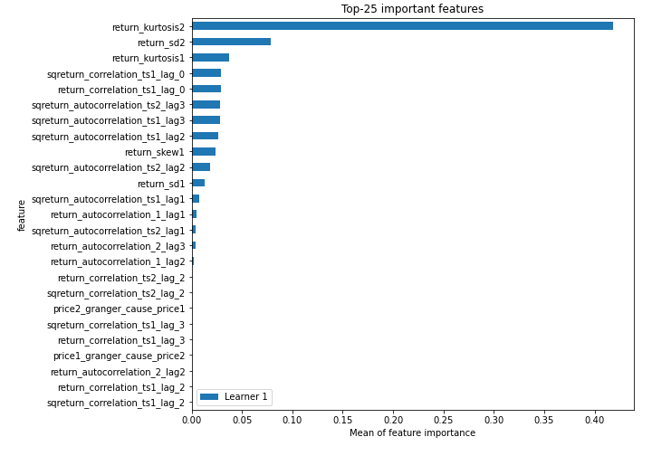
## Confusion Matrix

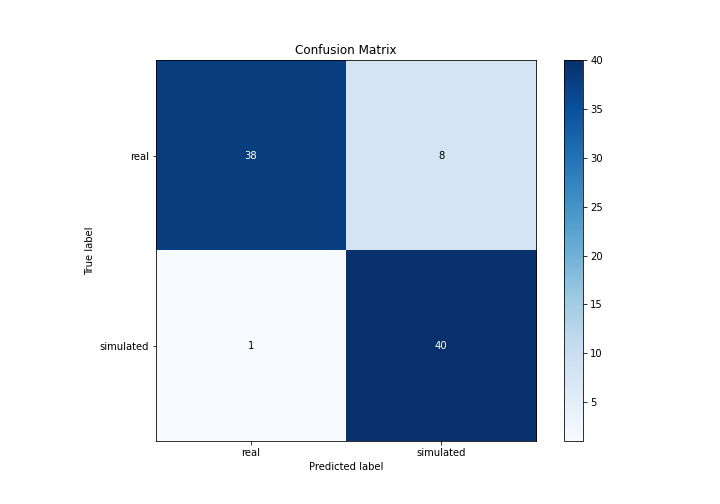

## Normalized Confusion Matrix

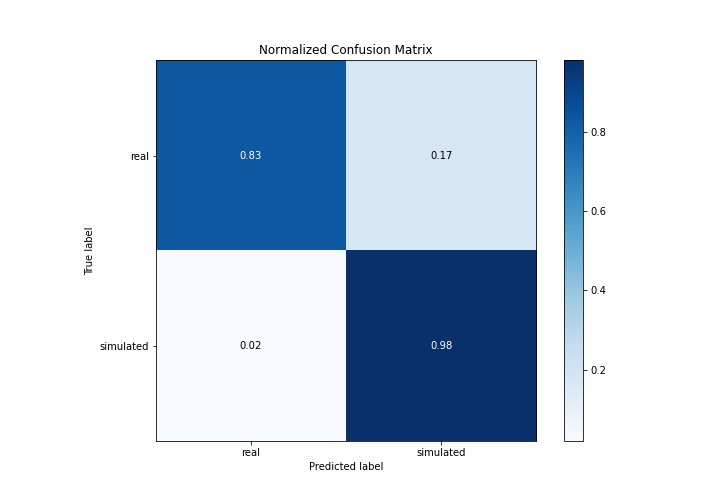

## ROC Curve

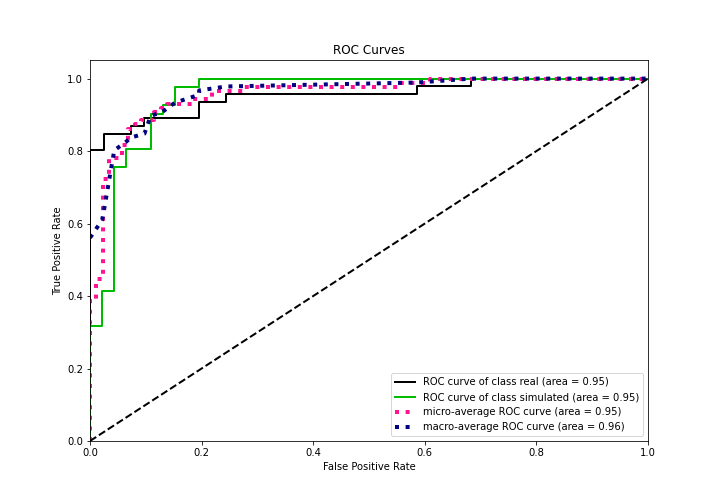

## Kolmogorov-Smirnov Statistic

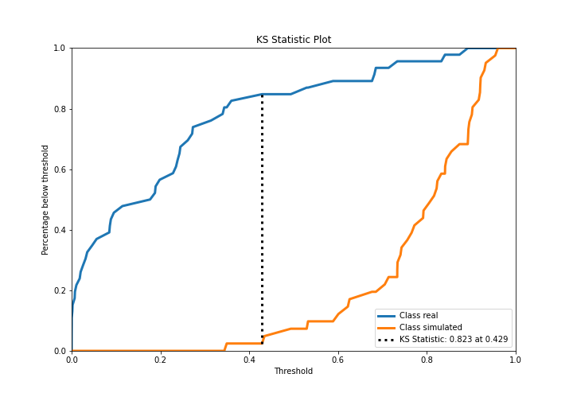

## Precision-Recall Curve

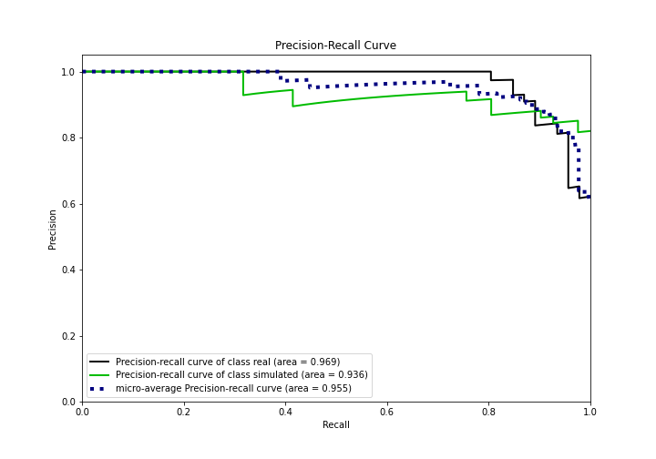

## Calibration Curve

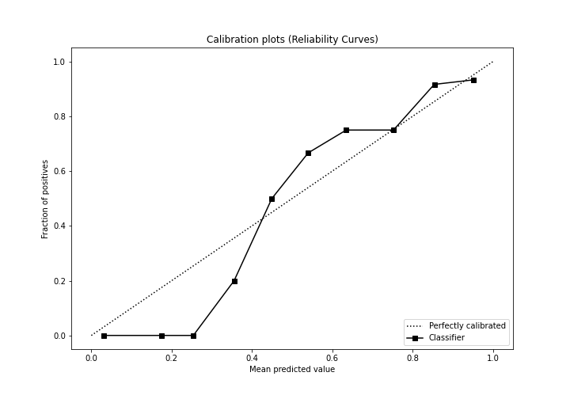

## Cumulative Gains Curve

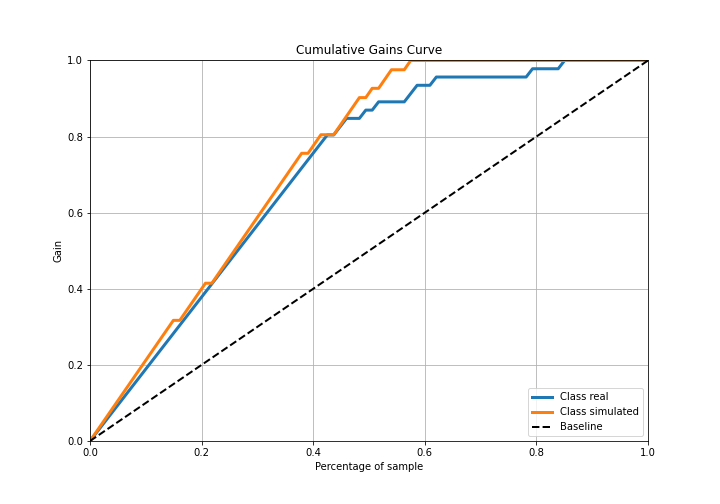

## Lift Curve

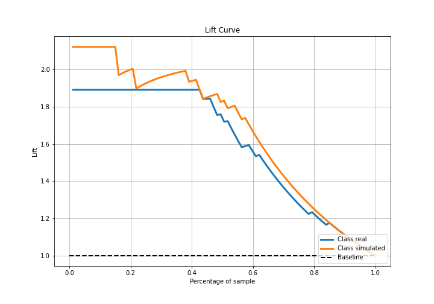

## SHAP Importance
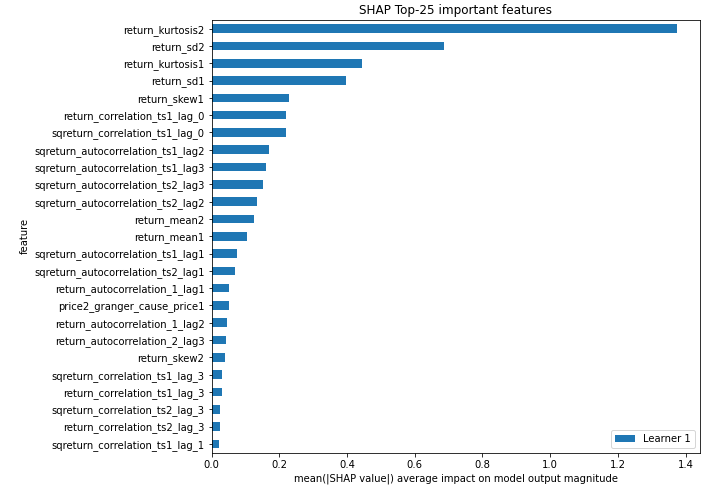

## SHAP Dependence plots

### Dependence (Fold 1)
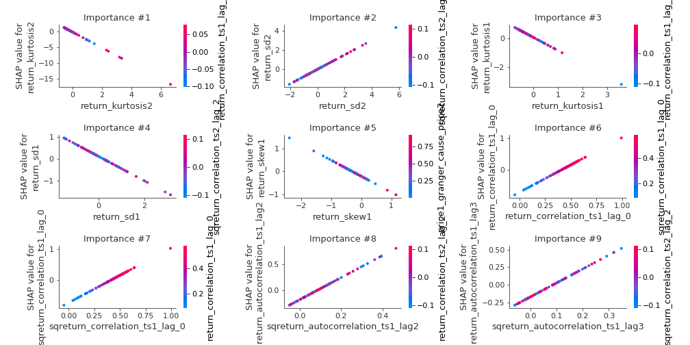

## SHAP Decision plots

### Top-10 Worst decisions for class 0 (Fold 1)
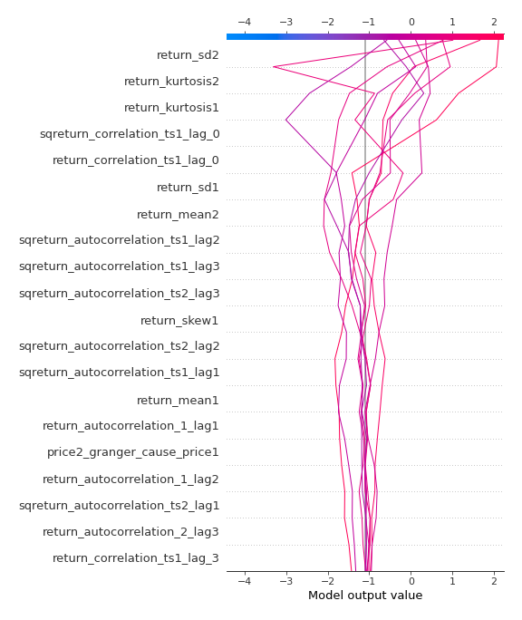
### Top-10 Best decisions for class 0 (Fold 1)
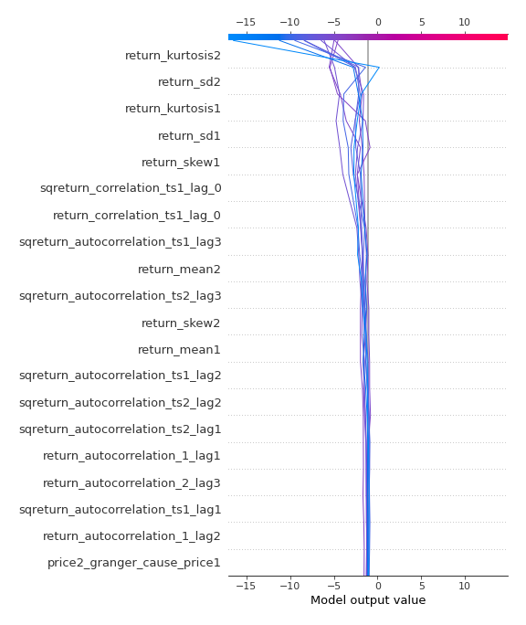
### Top-10 Worst decisions for class 1 (Fold 1)
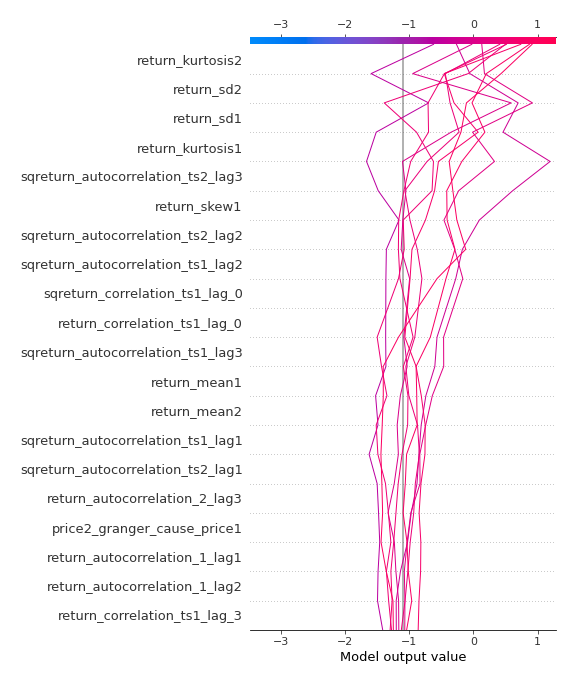
### Top-10 Best decisions for class 1 (Fold 1)
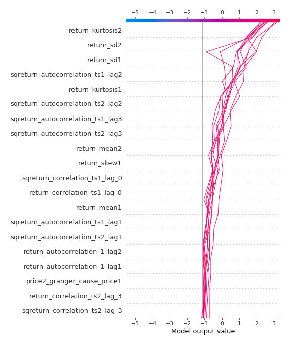

[<< Go back](../README.md)
