# Exploratory Data Analysis

[<< Go back](../README.md)
## Feature : target
- **Feature type** : categorical
- **Missing** : 0.0%
- **Unique** : 2
- **Count** :347
- **Unique** :2
- **Top** :real
- **Freq** :183

## Feature : return_mean1
- **Feature type** : continous
- **Missing** : 0.0%
- **Unique** : 347
- **Count** :347.0
- **Mean** :0.058399869451881394
- **Std** :0.1049166501235048
- **Min** :-0.297638839829253
- **25%th Percentile** : -0.004298745075121279
- **50%th Percentile** : 0.06468822693598675
- **75%th Percentile** : 0.13270220974296
- **Max** :0.3602793017097547

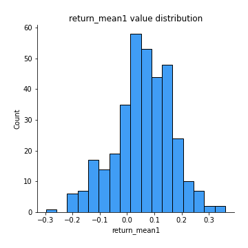
## Feature : return_mean2
- **Feature type** : continous
- **Missing** : 0.0%
- **Unique** : 347
- **Count** :347.0
- **Mean** :0.04477947781341094
- **Std** :0.1028163213926773
- **Min** :-0.3393917268522109
- **25%th Percentile** : -0.011912351665234668
- **50%th Percentile** : 0.047501921840103024
- **75%th Percentile** : 0.10906292516170132
- **Max** :0.6801605239983173

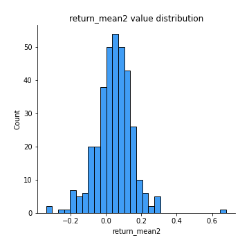
## Feature : return_sd1
- **Feature type** : continous
- **Missing** : 0.0%
- **Unique** : 347
- **Count** :347.0
- **Mean** :1.586984653999616
- **Std** :0.48206230647547593
- **Min** :0.45446000532433556
- **25%th Percentile** : 1.2508674173635392
- **50%th Percentile** : 1.5322068271671554
- **75%th Percentile** : 1.831739873503118
- **Max** :3.332494027875222

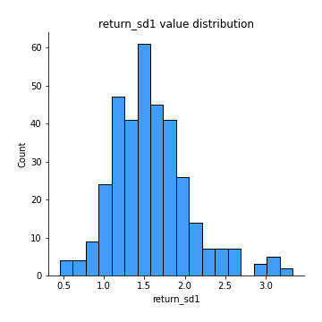
## Feature : return_sd2
- **Feature type** : continous
- **Missing** : 0.0%
- **Unique** : 347
- **Count** :347.0
- **Mean** :1.773957131505924
- **Std** :0.5332967055576443
- **Min** :0.7368116082512621
- **25%th Percentile** : 1.4029723078118628
- **50%th Percentile** : 1.686661760292425
- **75%th Percentile** : 2.0589835941739065
- **Max** :4.59233049161685

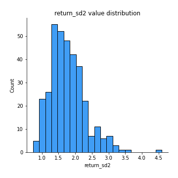
## Feature : return_skew1
- **Feature type** : continous
- **Missing** : 0.0%
- **Unique** : 347
- **Count** :347.0
- **Mean** :-0.2924155809154169
- **Std** :0.5969476236347308
- **Min** :-2.5068500114696386
- **25%th Percentile** : -0.5555627906125669
- **50%th Percentile** : -0.3315932204015068
- **75%th Percentile** : -0.07144667211771526
- **Max** :2.351757728252051

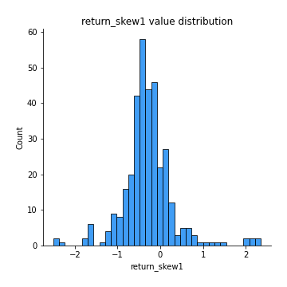
## Feature : return_skew2
- **Feature type** : continous
- **Missing** : 0.0%
- **Unique** : 347
- **Count** :347.0
- **Mean** :-0.39832609890206816
- **Std** :1.0137124499811345
- **Min** :-7.3762354994385335
- **25%th Percentile** : -0.576047474362064
- **50%th Percentile** : -0.2894033440438487
- **75%th Percentile** : -0.02614563683931878
- **Max** :4.1920266082732045

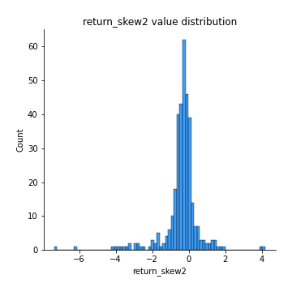
## Feature : return_kurtosis1
- **Feature type** : continous
- **Missing** : 0.0%
- **Unique** : 347
- **Count** :347.0
- **Mean** :3.224723549016248
- **Std** :3.7514623413266115
- **Min** :-0.13867316064273894
- **25%th Percentile** : 1.2435371217076738
- **50%th Percentile** : 2.044049617976586
- **75%th Percentile** : 3.5052722941280923
- **Max** :23.612665658846073

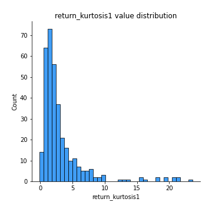
## Feature : return_kurtosis2
- **Feature type** : continous
- **Missing** : 0.0%
- **Unique** : 347
- **Count** :347.0
- **Mean** :5.018646256002414
- **Std** :9.13946335206888
- **Min** :-0.1693240760286967
- **25%th Percentile** : 1.2317385939107077
- **50%th Percentile** : 2.06380390000637
- **75%th Percentile** : 4.493023712907215
- **Max** :94.01659180149953

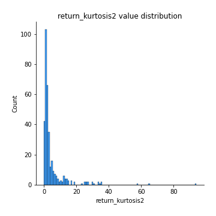
## Feature : return_autocorrelation_1_lag1
- **Feature type** : continous
- **Missing** : 0.0%
- **Unique** : 347
- **Count** :347.0
- **Mean** :-0.00048374756579332726
- **Std** :0.07510759326833498
- **Min** :-0.21377373672059352
- **25%th Percentile** : -0.05189029967455813
- **50%th Percentile** : -0.00011984553289102969
- **75%th Percentile** : 0.04784070390958513
- **Max** :0.24786027420256496

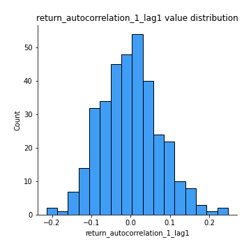
## Feature : return_autocorrelation_1_lag2
- **Feature type** : continous
- **Missing** : 0.0%
- **Unique** : 347
- **Count** :347.0
- **Mean** :-0.003352238158289411
- **Std** :0.07871364249834446
- **Min** :-0.23567848308813505
- **25%th Percentile** : -0.05078607014705119
- **50%th Percentile** : -0.005825860453568807
- **75%th Percentile** : 0.04655899579674211
- **Max** :0.24132278173941418

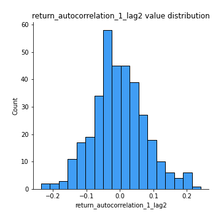
## Feature : return_autocorrelation_1_lag3
- **Feature type** : continous
- **Missing** : 0.0%
- **Unique** : 347
- **Count** :347.0
- **Mean** :0.009205584543430389
- **Std** :0.07076357952501063
- **Min** :-0.18845872083418275
- **25%th Percentile** : -0.037772676417308707
- **50%th Percentile** : 0.019204299981847285
- **75%th Percentile** : 0.05322602303899461
- **Max** :0.185938807794466

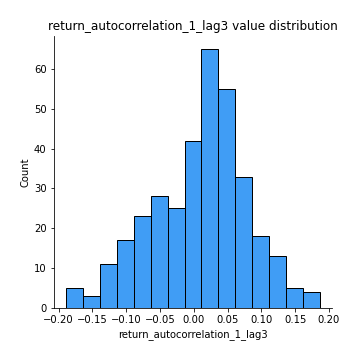
## Feature : return_autocorrelation_2_lag1
- **Feature type** : continous
- **Missing** : 0.0%
- **Unique** : 347
- **Count** :347.0
- **Mean** :0.0015921920792392507
- **Std** :0.07629308530882616
- **Min** :-0.21286387174509197
- **25%th Percentile** : -0.05168259016716429
- **50%th Percentile** : 0.0031299698033875763
- **75%th Percentile** : 0.05268507503686644
- **Max** :0.2064957206601241

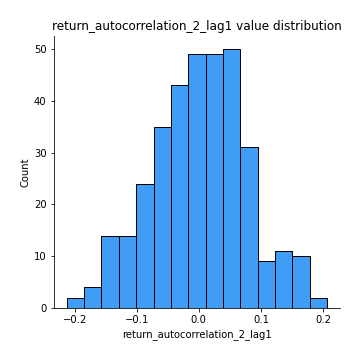
## Feature : return_autocorrelation_2_lag2
- **Feature type** : continous
- **Missing** : 0.0%
- **Unique** : 347
- **Count** :347.0
- **Mean** :-0.009192522202912211
- **Std** :0.07535719143548661
- **Min** :-0.1845098905304381
- **25%th Percentile** : -0.06037900114763089
- **50%th Percentile** : -0.009071653355097848
- **75%th Percentile** : 0.042658512698300816
- **Max** :0.2024462153199002

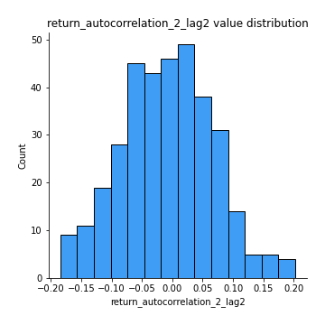
## Feature : return_autocorrelation_2_lag3
- **Feature type** : continous
- **Missing** : 0.0%
- **Unique** : 347
- **Count** :347.0
- **Mean** :-0.00408222367859537
- **Std** :0.06812251273848595
- **Min** :-0.17968973195182641
- **25%th Percentile** : -0.050368542864376704
- **50%th Percentile** : 0.000998733388631658
- **75%th Percentile** : 0.03789597580648009
- **Max** :0.21858071163715415

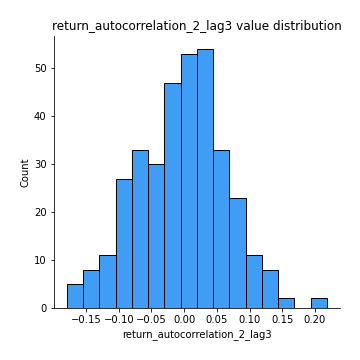
## Feature : return_correlation_ts1_lag_0
- **Feature type** : continous
- **Missing** : 0.0%
- **Unique** : 347
- **Count** :347.0
- **Mean** :0.40735861508902405
- **Std** :0.1545199099736424
- **Min** :-0.10256711281206837
- **25%th Percentile** : 0.3381206377935342
- **50%th Percentile** : 0.45371984612128546
- **75%th Percentile** : 0.5073840955111388
- **Max** :0.9937227277077512

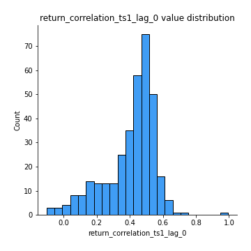
## Feature : return_correlation_ts1_lag_1
- **Feature type** : continous
- **Missing** : 0.0%
- **Unique** : 347
- **Count** :347.0
- **Mean** :-0.0013076406146373108
- **Std** :0.06666963294665246
- **Min** :-0.3128217186996028
- **25%th Percentile** : -0.04851345528602168
- **50%th Percentile** : 0.0008139726892200632
- **75%th Percentile** : 0.04120969430651895
- **Max** :0.20191820742213096

## Feature : return_correlation_ts1_lag_2
- **Feature type** : continous
- **Missing** : 0.0%
- **Unique** : 347
- **Count** :347.0
- **Mean** :-0.0027317341635569
- **Std** :0.07323624701292776
- **Min** :-0.17203468869004446
- **25%th Percentile** : -0.050576300225886064
- **50%th Percentile** : -0.0064971847165958664
- **75%th Percentile** : 0.04556526159512942
- **Max** :0.27381503564333554

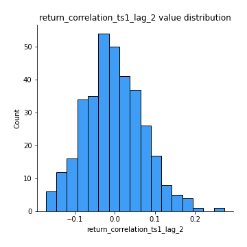
## Feature : return_correlation_ts1_lag_3
- **Feature type** : continous
- **Missing** : 0.0%
- **Unique** : 347
- **Count** :347.0
- **Mean** :-0.0029389553211244387
- **Std** :0.07342517420931605
- **Min** :-0.21147540839842804
- **25%th Percentile** : -0.05309807440880701
- **50%th Percentile** : -0.0016858901457401023
- **75%th Percentile** : 0.04458655432440328
- **Max** :0.23808054096877584

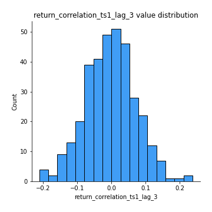
## Feature : return_correlation_ts2_lag_1
- **Feature type** : continous
- **Missing** : 0.0%
- **Unique** : 347
- **Count** :347.0
- **Mean** :0.004750151180928211
- **Std** :0.07745434487113992
- **Min** :-0.30532918426056777
- **25%th Percentile** : -0.044378387161022215
- **50%th Percentile** : 0.006920488677543257
- **75%th Percentile** : 0.05052784646471148
- **Max** :0.2970372040451145

## Feature : return_correlation_ts2_lag_2
- **Feature type** : continous
- **Missing** : 0.0%
- **Unique** : 347
- **Count** :347.0
- **Mean** :-0.002412437752550379
- **Std** :0.07174768103146231
- **Min** :-0.2757460186107768
- **25%th Percentile** : -0.047010716092927146
- **50%th Percentile** : -0.0016370384673697852
- **75%th Percentile** : 0.04037429844031156
- **Max** :0.21274551680606457

## Feature : return_correlation_ts2_lag_3
- **Feature type** : continous
- **Missing** : 0.0%
- **Unique** : 347
- **Count** :347.0
- **Mean** :0.007271361625031917
- **Std** :0.0690377614473048
- **Min** :-0.21559973242203426
- **25%th Percentile** : -0.0420999727318678
- **50%th Percentile** : 0.010597547745120556
- **75%th Percentile** : 0.05412467936719835
- **Max** :0.2022754653646845

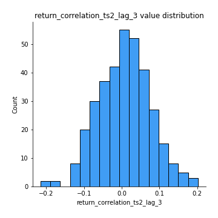
## Feature : sqreturn_autocorrelation_ts1_lag1
- **Feature type** : continous
- **Missing** : 0.0%
- **Unique** : 347
- **Count** :347.0
- **Mean** :0.10951863441572142
- **Std** :0.0991917808721177
- **Min** :-0.0641667707236835
- **25%th Percentile** : 0.035384725220173864
- **50%th Percentile** : 0.0989423884974122
- **75%th Percentile** : 0.16236313212487802
- **Max** :0.5110814630258395

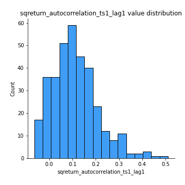
## Feature : sqreturn_autocorrelation_ts1_lag2
- **Feature type** : continous
- **Missing** : 0.0%
- **Unique** : 347
- **Count** :347.0
- **Mean** :0.09946768803792796
- **Std** :0.10921746976981811
- **Min** :-0.08684405202664229
- **25%th Percentile** : 0.016243903241423593
- **50%th Percentile** : 0.07855679724046187
- **75%th Percentile** : 0.1552215195541902
- **Max** :0.5184730021317373

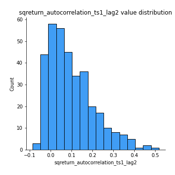
## Feature : sqreturn_autocorrelation_ts1_lag3
- **Feature type** : continous
- **Missing** : 0.0%
- **Unique** : 347
- **Count** :347.0
- **Mean** :0.08539338573665406
- **Std** :0.10011665404561067
- **Min** :-0.08711242405535644
- **25%th Percentile** : 0.008444375862577439
- **50%th Percentile** : 0.06785785456979972
- **75%th Percentile** : 0.1415349904476183
- **Max** :0.5383964224926251

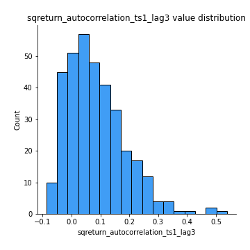
## Feature : sqreturn_autocorrelation_ts2_lag1
- **Feature type** : continous
- **Missing** : 0.0%
- **Unique** : 347
- **Count** :347.0
- **Mean** :0.08885241011720858
- **Std** :0.08989844167224935
- **Min** :-0.07808490782609163
- **25%th Percentile** : 0.01955464064425599
- **50%th Percentile** : 0.07194632285563687
- **75%th Percentile** : 0.13552066399833546
- **Max** :0.36877558876411237

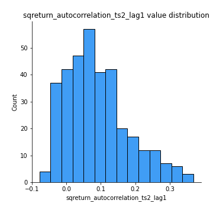
## Feature : sqreturn_autocorrelation_ts2_lag2
- **Feature type** : continous
- **Missing** : 0.0%
- **Unique** : 347
- **Count** :347.0
- **Mean** :0.0816728224811396
- **Std** :0.09392957235161876
- **Min** :-0.10054631197559977
- **25%th Percentile** : 0.0028327784962325075
- **50%th Percentile** : 0.06430188834551988
- **75%th Percentile** : 0.14453941914248902
- **Max** :0.45541122437784964

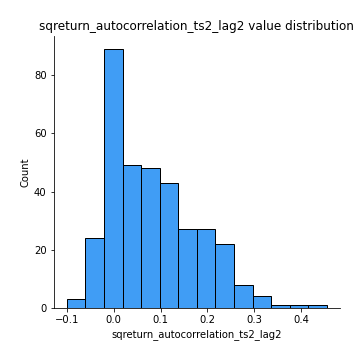
## Feature : sqreturn_autocorrelation_ts2_lag3
- **Feature type** : continous
- **Missing** : 0.0%
- **Unique** : 347
- **Count** :347.0
- **Mean** :0.07460023758085181
- **Std** :0.10242352521310567
- **Min** :-0.09756858950376449
- **25%th Percentile** : -0.007145065034073484
- **50%th Percentile** : 0.045760459250462224
- **75%th Percentile** : 0.1325558491451338
- **Max** :0.4093446336563594

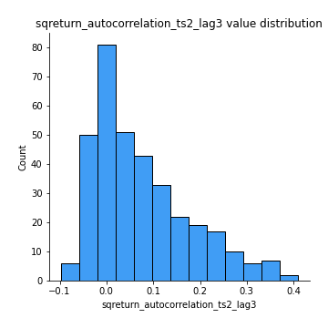
## Feature : sqreturn_correlation_ts1_lag_0
- **Feature type** : continous
- **Missing** : 0.0%
- **Unique** : 347
- **Count** :347.0
- **Mean** :0.40735861508902405
- **Std** :0.1545199099736424
- **Min** :-0.10256711281206837
- **25%th Percentile** : 0.3381206377935342
- **50%th Percentile** : 0.45371984612128546
- **75%th Percentile** : 0.5073840955111388
- **Max** :0.9937227277077512

## Feature : sqreturn_correlation_ts1_lag_1
- **Feature type** : continous
- **Missing** : 0.0%
- **Unique** : 347
- **Count** :347.0
- **Mean** :-0.0013076406146373108
- **Std** :0.06666963294665246
- **Min** :-0.3128217186996028
- **25%th Percentile** : -0.04851345528602168
- **50%th Percentile** : 0.0008139726892200632
- **75%th Percentile** : 0.04120969430651895
- **Max** :0.20191820742213096

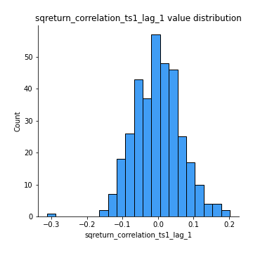
## Feature : sqreturn_correlation_ts1_lag_2
- **Feature type** : continous
- **Missing** : 0.0%
- **Unique** : 347
- **Count** :347.0
- **Mean** :-0.0027317341635569
- **Std** :0.07323624701292776
- **Min** :-0.17203468869004446
- **25%th Percentile** : -0.050576300225886064
- **50%th Percentile** : -0.0064971847165958664
- **75%th Percentile** : 0.04556526159512942
- **Max** :0.27381503564333554

## Feature : sqreturn_correlation_ts1_lag_3
- **Feature type** : continous
- **Missing** : 0.0%
- **Unique** : 347
- **Count** :347.0
- **Mean** :-0.0029389553211244387
- **Std** :0.07342517420931605
- **Min** :-0.21147540839842804
- **25%th Percentile** : -0.05309807440880701
- **50%th Percentile** : -0.0016858901457401023
- **75%th Percentile** : 0.04458655432440328
- **Max** :0.23808054096877584

## Feature : sqreturn_correlation_ts2_lag_1
- **Feature type** : continous
- **Missing** : 0.0%
- **Unique** : 347
- **Count** :347.0
- **Mean** :0.004750151180928211
- **Std** :0.07745434487113992
- **Min** :-0.30532918426056777
- **25%th Percentile** : -0.044378387161022215
- **50%th Percentile** : 0.006920488677543257
- **75%th Percentile** : 0.05052784646471148
- **Max** :0.2970372040451145

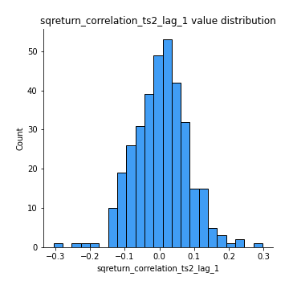
## Feature : sqreturn_correlation_ts2_lag_2
- **Feature type** : continous
- **Missing** : 0.0%
- **Unique** : 347
- **Count** :347.0
- **Mean** :-0.002412437752550379
- **Std** :0.07174768103146231
- **Min** :-0.2757460186107768
- **25%th Percentile** : -0.047010716092927146
- **50%th Percentile** : -0.0016370384673697852
- **75%th Percentile** : 0.04037429844031156
- **Max** :0.21274551680606457

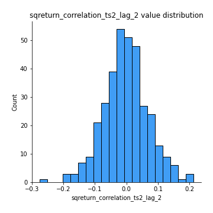
## Feature : sqreturn_correlation_ts2_lag_3
- **Feature type** : continous
- **Missing** : 0.0%
- **Unique** : 347
- **Count** :347.0
- **Mean** :0.007271361625031917
- **Std** :0.0690377614473048
- **Min** :-0.21559973242203426
- **25%th Percentile** : -0.0420999727318678
- **50%th Percentile** : 0.010597547745120556
- **75%th Percentile** : 0.05412467936719835
- **Max** :0.2022754653646845

## Feature : price2_granger_cause_price1
- **Feature type** : continous
- **Missing** : 0.0%
- **Unique** : 347
- **Count** :347.0
- **Mean** :0.28011127113975964
- **Std** :0.2910210770167423
- **Min** :7.791947861298711e-08
- **25%th Percentile** : 0.031653402725225155
- **50%th Percentile** : 0.17383804286962573
- **75%th Percentile** : 0.4713586687545478
- **Max** :0.9901355201614307

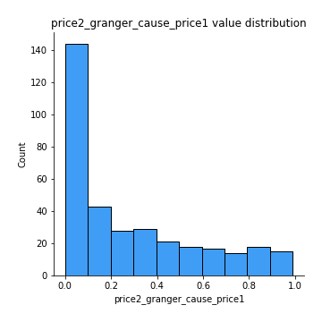
## Feature : price1_granger_cause_price2
- **Feature type** : continous
- **Missing** : 0.0%
- **Unique** : 347
- **Count** :347.0
- **Mean** :0.30499251240461656
- **Std** :0.2997454054277789
- **Min** :2.8814044435504064e-08
- **25%th Percentile** : 0.027867278559025863
- **50%th Percentile** : 0.22205094981714096
- **75%th Percentile** : 0.5380552620793257
- **Max** :0.9875372336928148

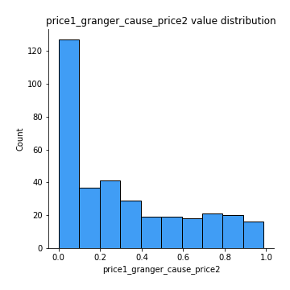

[<< Go back](../README.md)
