# Summary of 3_Linear

[<< Go back](../README.md)

## Logistic Regression (Linear)
- **n_jobs**: -1
- **explain_level**: 2

## Validation
 - **validation_type**: split
 - **train_ratio**: 0.75
 - **shuffle**: True
 - **stratify**: True

## Optimized metric
accuracy

## Training time

6.1 seconds

## Metric details
|           |    score |     threshold |
|:----------|---------:|--------------:|
| logloss   | 0.23763  | nan           |
| auc       | 0.98203  | nan           |
| f1        | 0.955556 |   0.507078    |
| accuracy  | 0.954023 |   0.507078    |
| precision | 1        |   0.867542    |
| recall    | 1        |   9.24624e-09 |
| mcc       | 0.908948 |   0.507078    |

## Confusion matrix (at threshold=0.507078)
|                      |   Predicted as real |   Predicted as simulated |
|:---------------------|--------------------:|-------------------------:|
| Labeled as real      |                  40 |                        3 |
| Labeled as simulated |                   1 |                       43 |

## Learning curves
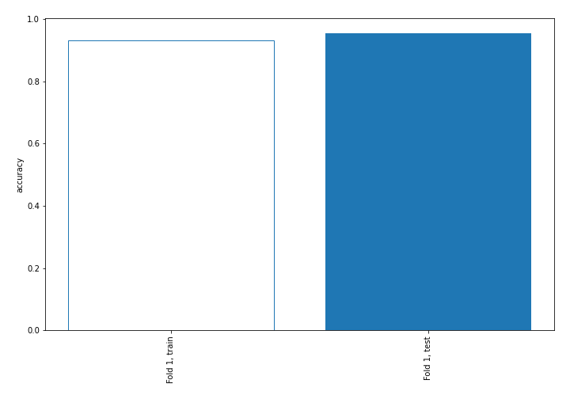

## Coefficients
| feature                           |   Learner_1 |
|:----------------------------------|------------:|
| sqreturn_autocorrelation_ts1_lag3 |  2.47759    |
| sqreturn_autocorrelation_ts1_lag2 |  2.32092    |
| sqreturn_autocorrelation_ts2_lag2 |  2.06777    |
| sqreturn_autocorrelation_ts2_lag3 |  1.82113    |
| sqreturn_autocorrelation_ts1_lag1 |  1.48546    |
| sqreturn_autocorrelation_ts2_lag1 |  1.19546    |
| return_correlation_ts1_lag_0      |  1.19417    |
| sqreturn_correlation_ts1_lag_0    |  1.19417    |
| return_mean2                      |  1.02137    |
| return_mean1                      |  0.891121   |
| return_sd2                        |  0.615008   |
| return_autocorrelation_1_lag2     |  0.598643   |
| return_autocorrelation_1_lag1     |  0.441897   |
| return_correlation_ts1_lag_2      |  0.343834   |
| sqreturn_correlation_ts1_lag_2    |  0.343834   |
| return_correlation_ts2_lag_2      |  0.299053   |
| sqreturn_correlation_ts2_lag_2    |  0.299053   |
| sqreturn_correlation_ts1_lag_1    |  0.00597564 |
| return_correlation_ts1_lag_1      |  0.00597564 |
| return_correlation_ts2_lag_1      | -0.111128   |
| sqreturn_correlation_ts2_lag_1    | -0.111128   |
| return_autocorrelation_2_lag1     | -0.152562   |
| return_skew2                      | -0.159204   |
| return_autocorrelation_2_lag2     | -0.176244   |
| return_autocorrelation_1_lag3     | -0.208949   |
| return_autocorrelation_2_lag3     | -0.255262   |
| price2_granger_cause_price1       | -0.31069    |
| price1_granger_cause_price2       | -0.376731   |
| return_sd1                        | -0.444808   |
| return_skew1                      | -0.466423   |
| return_correlation_ts2_lag_3      | -0.524098   |
| sqreturn_correlation_ts2_lag_3    | -0.524098   |
| return_correlation_ts1_lag_3      | -0.604949   |
| sqreturn_correlation_ts1_lag_3    | -0.604949   |
| return_kurtosis1                  | -1.21263    |
| return_kurtosis2                  | -2.27854    |
| intercept                         | -2.83253    |

## Permutation-based Importance
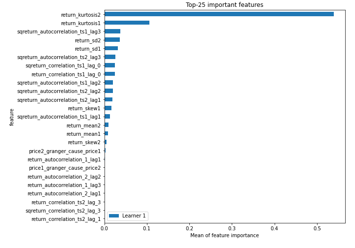
## Confusion Matrix

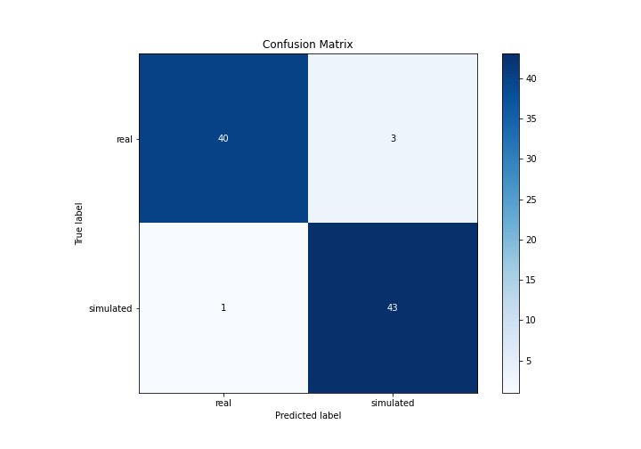

## Normalized Confusion Matrix

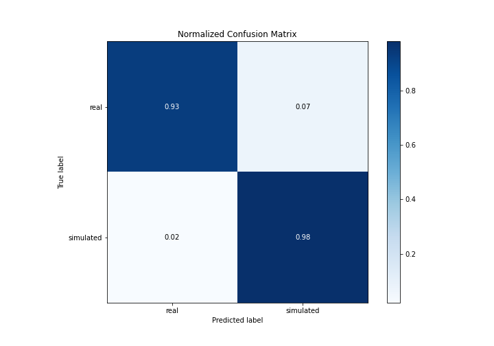

## ROC Curve

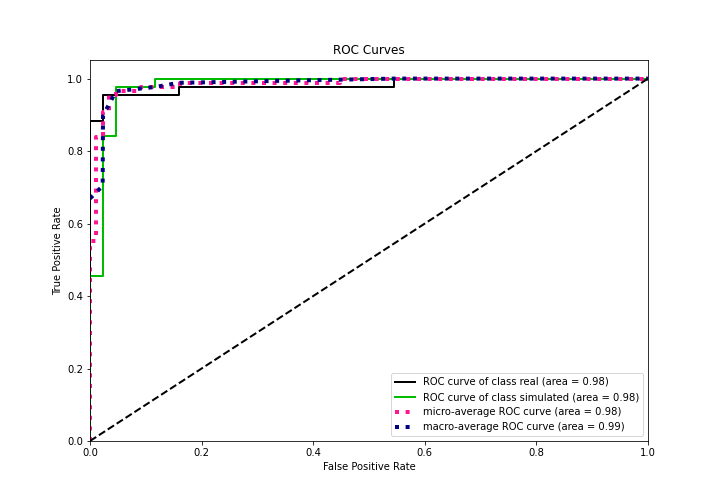

## Kolmogorov-Smirnov Statistic

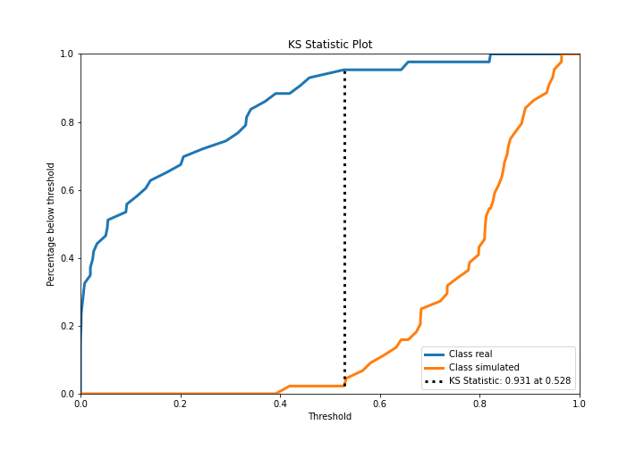

## Precision-Recall Curve

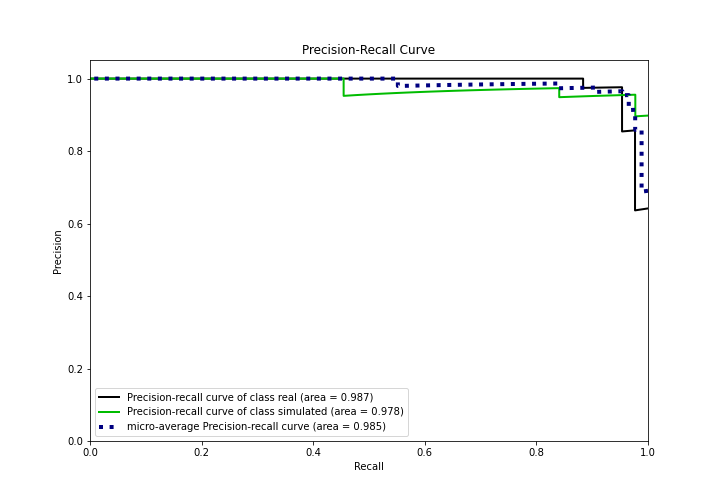

## Calibration Curve

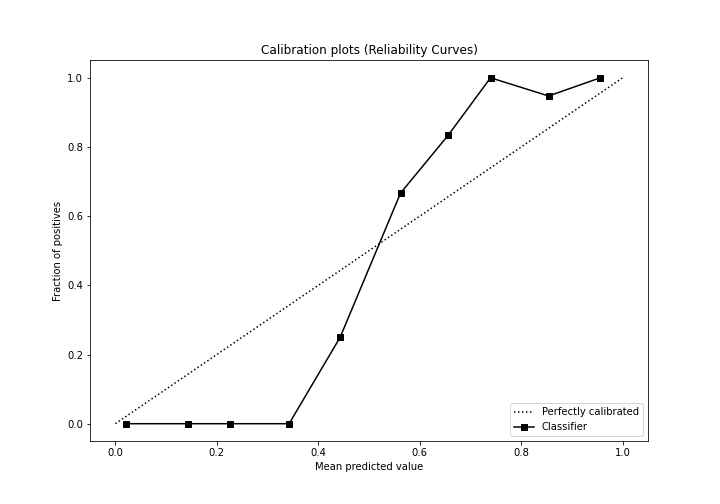

## Cumulative Gains Curve

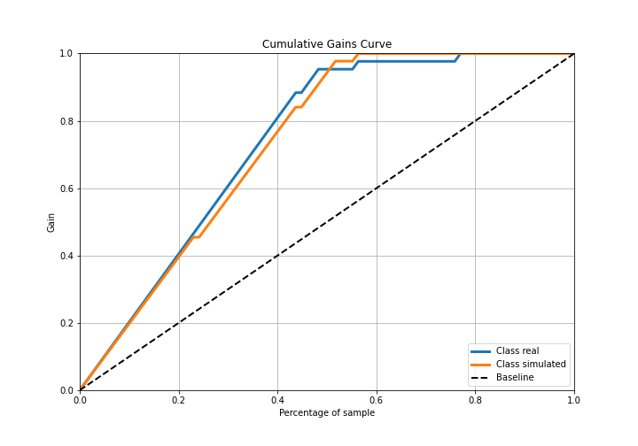

## Lift Curve

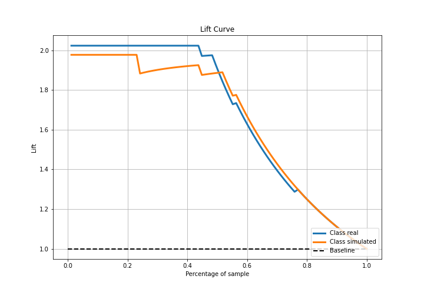

## SHAP Importance
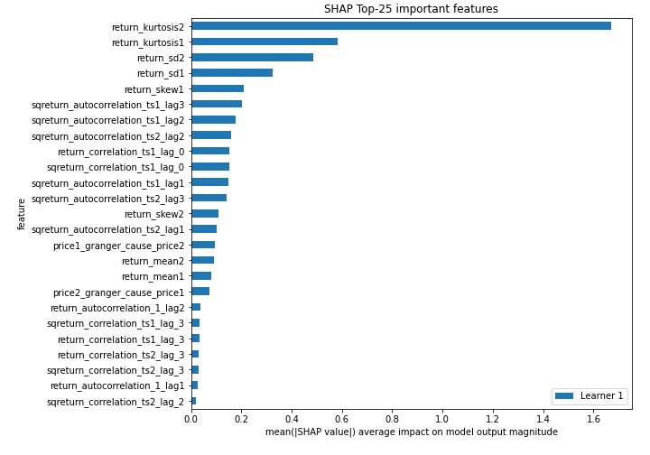

## SHAP Dependence plots

### Dependence (Fold 1)
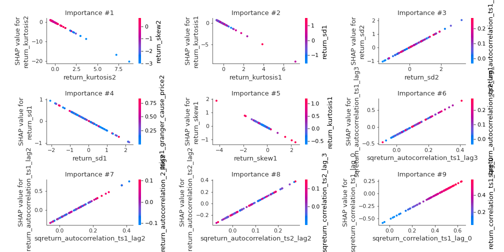

## SHAP Decision plots

### Top-10 Worst decisions for class 0 (Fold 1)
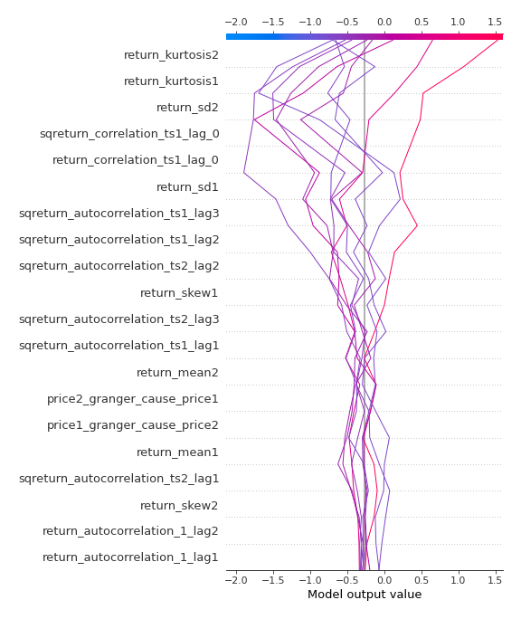
### Top-10 Best decisions for class 0 (Fold 1)
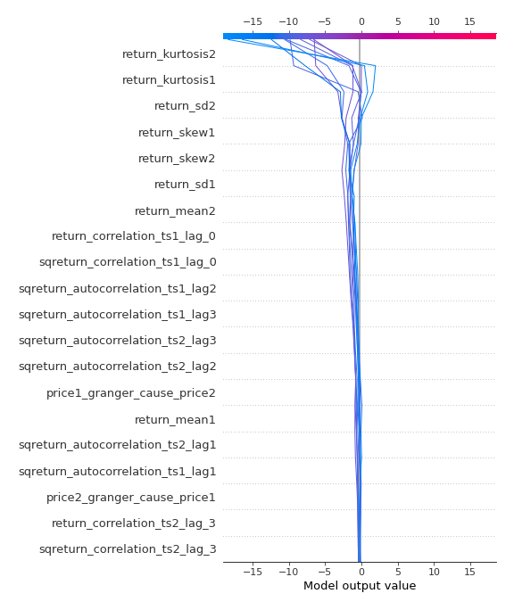
### Top-10 Worst decisions for class 1 (Fold 1)
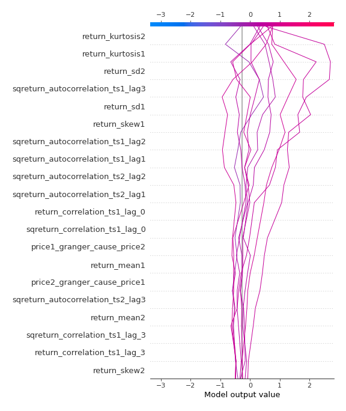
### Top-10 Best decisions for class 1 (Fold 1)

[<< Go back](../README.md)
