# Exploratory Data Analysis

[<< Go back](../README.md)
## Feature : target
- **Feature type** : categorical
- **Missing** : 0.0%
- **Unique** : 2
- **Count** :347
- **Unique** :2
- **Top** :simulated
- **Freq** :176

## Feature : return_mean1
- **Feature type** : continous
- **Missing** : 0.0%
- **Unique** : 347
- **Count** :347.0
- **Mean** :0.05426038899900984
- **Std** :0.10460972093451185
- **Min** :-0.23482450846197694
- **25%th Percentile** : -0.011001449356520396
- **50%th Percentile** : 0.059616891829367344
- **75%th Percentile** : 0.13350024129528085
- **Max** :0.2862586627119317

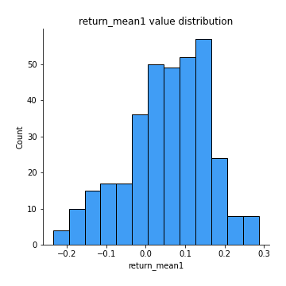
## Feature : return_mean2
- **Feature type** : continous
- **Missing** : 0.0%
- **Unique** : 347
- **Count** :347.0
- **Mean** :0.051342766962175095
- **Std** :0.10959122952497172
- **Min** :-0.3439835398279146
- **25%th Percentile** : -0.0062055889296550116
- **50%th Percentile** : 0.0557957619327508
- **75%th Percentile** : 0.1184817457649877
- **Max** :0.6801605239983173

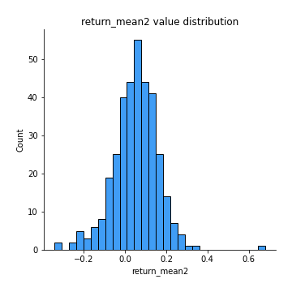
## Feature : return_sd1
- **Feature type** : continous
- **Missing** : 0.0%
- **Unique** : 347
- **Count** :347.0
- **Mean** :1.5977181402625449
- **Std** :0.49128539083112727
- **Min** :0.3095815563993974
- **25%th Percentile** : 1.2378131166571884
- **50%th Percentile** : 1.5554225037588227
- **75%th Percentile** : 1.838997512035505
- **Max** :3.181425034216533

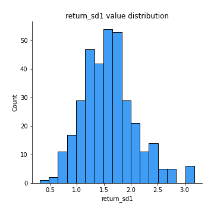
## Feature : return_sd2
- **Feature type** : continous
- **Missing** : 0.0%
- **Unique** : 347
- **Count** :347.0
- **Mean** :1.7754375870908083
- **Std** :0.5102557381348822
- **Min** :0.7530760368427902
- **25%th Percentile** : 1.418357529464509
- **50%th Percentile** : 1.6976964045527783
- **75%th Percentile** : 2.1017449368809746
- **Max** :4.59233049161685

## Feature : return_skew1
- **Feature type** : continous
- **Missing** : 0.0%
- **Unique** : 347
- **Count** :347.0
- **Mean** :-0.3800068345524494
- **Std** :0.7048188448621348
- **Min** :-4.239645236578449
- **25%th Percentile** : -0.598424058873148
- **50%th Percentile** : -0.33665653334184475
- **75%th Percentile** : -0.10922274340646912
- **Max** :2.351757728252051

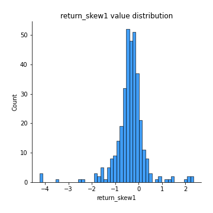
## Feature : return_skew2
- **Feature type** : continous
- **Missing** : 0.0%
- **Unique** : 347
- **Count** :347.0
- **Mean** :-0.35128792820889837
- **Std** :0.9732856580747711
- **Min** :-6.262899561987459
- **25%th Percentile** : -0.515396180149349
- **50%th Percentile** : -0.2374626607959604
- **75%th Percentile** : -0.012127147642076435
- **Max** :4.1920266082732045

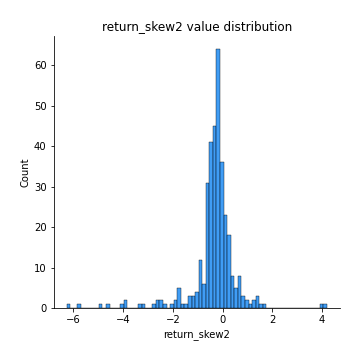
## Feature : return_kurtosis1
- **Feature type** : continous
- **Missing** : 0.0%
- **Unique** : 347
- **Count** :347.0
- **Mean** :3.6660343290303827
- **Std** :5.151986833005102
- **Min** :-0.17879128099825925
- **25%th Percentile** : 1.268356732809583
- **50%th Percentile** : 2.0930296340156667
- **75%th Percentile** : 3.73602029401185
- **Max** :40.485294874464934

## Feature : return_kurtosis2
- **Feature type** : continous
- **Missing** : 0.0%
- **Unique** : 347
- **Count** :347.0
- **Mean** :4.673557886702331
- **Std** :7.978461691298608
- **Min** :0.024044458596995
- **25%th Percentile** : 1.2192593679735086
- **50%th Percentile** : 1.97007783202171
- **75%th Percentile** : 4.088961474799145
- **Max** :64.99818629655663

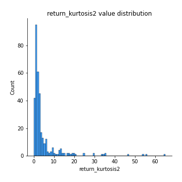
## Feature : return_autocorrelation_1_lag1
- **Feature type** : continous
- **Missing** : 0.0%
- **Unique** : 347
- **Count** :347.0
- **Mean** :-0.008040940989510624
- **Std** :0.07236557910253846
- **Min** :-0.2110198016529991
- **25%th Percentile** : -0.05826324877699555
- **50%th Percentile** : -0.006110183357708507
- **75%th Percentile** : 0.038640766830488706
- **Max** :0.20132571463207988

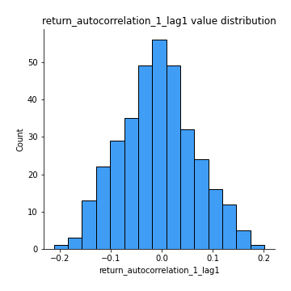
## Feature : return_autocorrelation_1_lag2
- **Feature type** : continous
- **Missing** : 0.0%
- **Unique** : 347
- **Count** :347.0
- **Mean** :-0.01135192853165805
- **Std** :0.07402485956764589
- **Min** :-0.23830163091983192
- **25%th Percentile** : -0.0577103181865162
- **50%th Percentile** : -0.013559508049519074
- **75%th Percentile** : 0.040469986987930535
- **Max** :0.21123611097039302

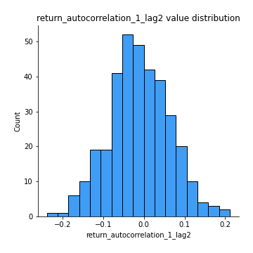
## Feature : return_autocorrelation_1_lag3
- **Feature type** : continous
- **Missing** : 0.0%
- **Unique** : 347
- **Count** :347.0
- **Mean** :0.010192338507970298
- **Std** :0.07098687925538694
- **Min** :-0.19628019805192318
- **25%th Percentile** : -0.040053046841460174
- **50%th Percentile** : 0.011408563666666297
- **75%th Percentile** : 0.0576260868702452
- **Max** :0.24759040579370856

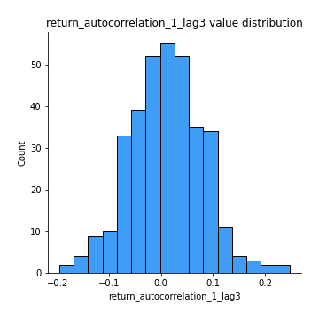
## Feature : return_autocorrelation_2_lag1
- **Feature type** : continous
- **Missing** : 0.0%
- **Unique** : 347
- **Count** :347.0
- **Mean** :-0.012090893102238416
- **Std** :0.07033799440476898
- **Min** :-0.2364404317158175
- **25%th Percentile** : -0.061939970225242856
- **50%th Percentile** : -0.013015120225783019
- **75%th Percentile** : 0.04125233217661396
- **Max** :0.2024676054184499

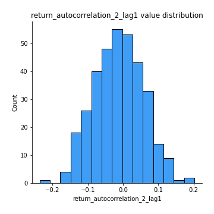
## Feature : return_autocorrelation_2_lag2
- **Feature type** : continous
- **Missing** : 0.0%
- **Unique** : 347
- **Count** :347.0
- **Mean** :-0.011988833000918695
- **Std** :0.06766720256923563
- **Min** :-0.1758721664122366
- **25%th Percentile** : -0.058574076044725046
- **50%th Percentile** : -0.012481596693324626
- **75%th Percentile** : 0.03195764888142154
- **Max** :0.19929489872264558

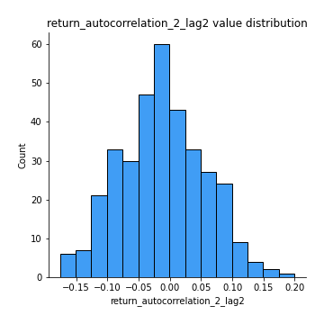
## Feature : return_autocorrelation_2_lag3
- **Feature type** : continous
- **Missing** : 0.0%
- **Unique** : 347
- **Count** :347.0
- **Mean** :0.010084451762513658
- **Std** :0.0737894162843355
- **Min** :-0.2878452714607122
- **25%th Percentile** : -0.02705298080628171
- **50%th Percentile** : 0.013820571758099658
- **75%th Percentile** : 0.05692929571285754
- **Max** :0.261950295399502

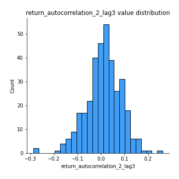
## Feature : return_correlation_ts1_lag_0
- **Feature type** : continous
- **Missing** : 0.0%
- **Unique** : 347
- **Count** :347.0
- **Mean** :0.4057063730862689
- **Std** :0.16023521238597385
- **Min** :-0.07366870340906873
- **25%th Percentile** : 0.33503478695443234
- **50%th Percentile** : 0.4478948314510611
- **75%th Percentile** : 0.5077645006594547
- **Max** :0.9937227277077512

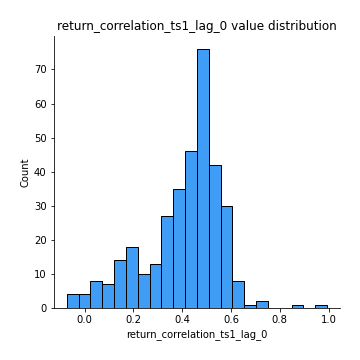
## Feature : return_correlation_ts1_lag_1
- **Feature type** : continous
- **Missing** : 0.0%
- **Unique** : 347
- **Count** :347.0
- **Mean** :-0.010244491287697692
- **Std** :0.06598818633036997
- **Min** :-0.20458459146107666
- **25%th Percentile** : -0.05431400561189152
- **50%th Percentile** : -0.005280611188037847
- **75%th Percentile** : 0.0369623744571449
- **Max** :0.159100778661096

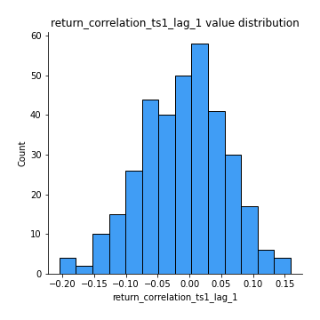
## Feature : return_correlation_ts1_lag_2
- **Feature type** : continous
- **Missing** : 0.0%
- **Unique** : 347
- **Count** :347.0
- **Mean** :-0.006462220457707433
- **Std** :0.07115412791347081
- **Min** :-0.19568457386478816
- **25%th Percentile** : -0.05871602203921141
- **50%th Percentile** : -0.006909697032052656
- **75%th Percentile** : 0.04229730491136607
- **Max** :0.17974071501626168

## Feature : return_correlation_ts1_lag_3
- **Feature type** : continous
- **Missing** : 0.0%
- **Unique** : 347
- **Count** :347.0
- **Mean** :0.003261378916651427
- **Std** :0.07832550200123221
- **Min** :-0.24943572588328833
- **25%th Percentile** : -0.04338214090182036
- **50%th Percentile** : 0.00604747683478236
- **75%th Percentile** : 0.05350447227316893
- **Max** :0.23808054096877584

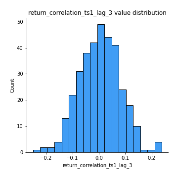
## Feature : return_correlation_ts2_lag_1
- **Feature type** : continous
- **Missing** : 0.0%
- **Unique** : 347
- **Count** :347.0
- **Mean** :0.0017223442233841705
- **Std** :0.07370581802633885
- **Min** :-0.21574859570772106
- **25%th Percentile** : -0.048857904387970844
- **50%th Percentile** : -0.0011388140081186598
- **75%th Percentile** : 0.047665816628032154
- **Max** :0.3425036902091001

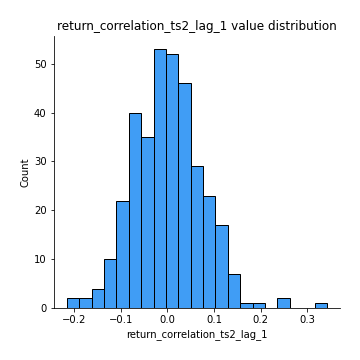
## Feature : return_correlation_ts2_lag_2
- **Feature type** : continous
- **Missing** : 0.0%
- **Unique** : 347
- **Count** :347.0
- **Mean** :-0.006230785123907871
- **Std** :0.07239110402499747
- **Min** :-0.21152732207407113
- **25%th Percentile** : -0.05615472976761438
- **50%th Percentile** : -0.004673731972622636
- **75%th Percentile** : 0.04228205823889549
- **Max** :0.1971503093940994

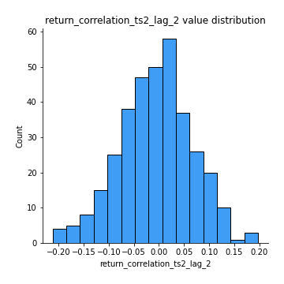
## Feature : return_correlation_ts2_lag_3
- **Feature type** : continous
- **Missing** : 0.0%
- **Unique** : 347
- **Count** :347.0
- **Mean** :0.012070975947319578
- **Std** :0.07359402460657082
- **Min** :-0.2704891050804987
- **25%th Percentile** : -0.032578622253361444
- **50%th Percentile** : 0.01387193197972959
- **75%th Percentile** : 0.06481486543046919
- **Max** :0.22488842036394519

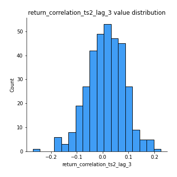
## Feature : sqreturn_autocorrelation_ts1_lag1
- **Feature type** : continous
- **Missing** : 0.0%
- **Unique** : 347
- **Count** :347.0
- **Mean** :0.11450975160768403
- **Std** :0.10595853865824478
- **Min** :-0.06641170505474243
- **25%th Percentile** : 0.028302205388362568
- **50%th Percentile** : 0.09454334185095535
- **75%th Percentile** : 0.18219413082968045
- **Max** :0.4445271945610282

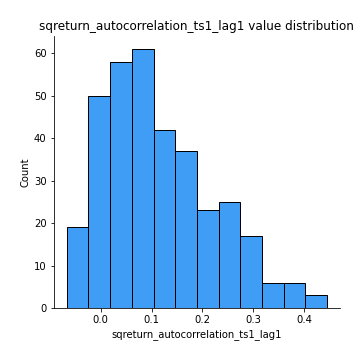
## Feature : sqreturn_autocorrelation_ts1_lag2
- **Feature type** : continous
- **Missing** : 0.0%
- **Unique** : 347
- **Count** :347.0
- **Mean** :0.09803796290974695
- **Std** :0.10127240597419977
- **Min** :-0.08684405202664229
- **25%th Percentile** : 0.015614582508928422
- **50%th Percentile** : 0.0852997728420849
- **75%th Percentile** : 0.16818674134960843
- **Max** :0.4162248498247765

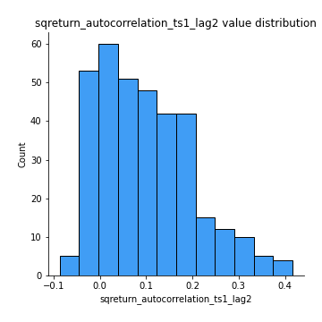
## Feature : sqreturn_autocorrelation_ts1_lag3
- **Feature type** : continous
- **Missing** : 0.0%
- **Unique** : 347
- **Count** :347.0
- **Mean** :0.0938354636021133
- **Std** :0.10371658592117827
- **Min** :-0.08904611924599068
- **25%th Percentile** : 0.013562887170017131
- **50%th Percentile** : 0.07437654727261049
- **75%th Percentile** : 0.15611919659297027
- **Max** :0.4825310413279063

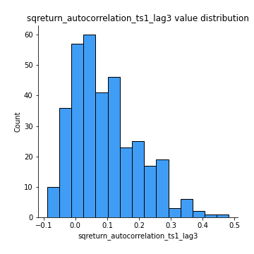
## Feature : sqreturn_autocorrelation_ts2_lag1
- **Feature type** : continous
- **Missing** : 0.0%
- **Unique** : 347
- **Count** :347.0
- **Mean** :0.10691978116488296
- **Std** :0.10299072530474375
- **Min** :-0.07808490782609163
- **25%th Percentile** : 0.026452180052967914
- **50%th Percentile** : 0.0838098198421987
- **75%th Percentile** : 0.1725967731493671
- **Max** :0.5372427209030046

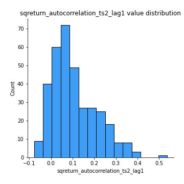
## Feature : sqreturn_autocorrelation_ts2_lag2
- **Feature type** : continous
- **Missing** : 0.0%
- **Unique** : 347
- **Count** :347.0
- **Mean** :0.07832707034453538
- **Std** :0.09062328551797437
- **Min** :-0.10054631197559977
- **25%th Percentile** : 0.002660534379112506
- **50%th Percentile** : 0.06221346487247295
- **75%th Percentile** : 0.13673512659902748
- **Max** :0.3975371443626248

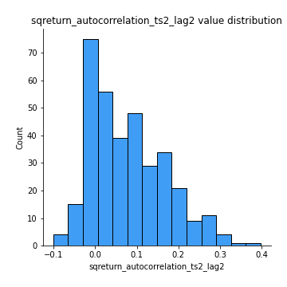
## Feature : sqreturn_autocorrelation_ts2_lag3
- **Feature type** : continous
- **Missing** : 0.0%
- **Unique** : 347
- **Count** :347.0
- **Mean** :0.07735249847661264
- **Std** :0.09711537622626874
- **Min** :-0.09756858950376449
- **25%th Percentile** : -0.0016772735209325046
- **50%th Percentile** : 0.05914497809194892
- **75%th Percentile** : 0.14172369710984775
- **Max** :0.3612320119844153

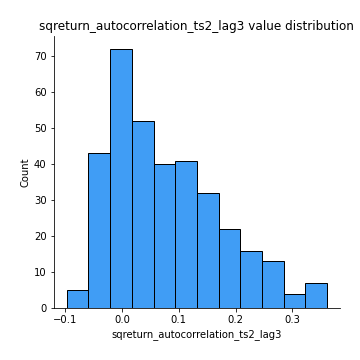
## Feature : sqreturn_correlation_ts1_lag_0
- **Feature type** : continous
- **Missing** : 0.0%
- **Unique** : 347
- **Count** :347.0
- **Mean** :0.4057063730862689
- **Std** :0.16023521238597385
- **Min** :-0.07366870340906873
- **25%th Percentile** : 0.33503478695443234
- **50%th Percentile** : 0.4478948314510611
- **75%th Percentile** : 0.5077645006594547
- **Max** :0.9937227277077512

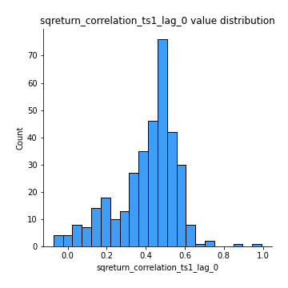
## Feature : sqreturn_correlation_ts1_lag_1
- **Feature type** : continous
- **Missing** : 0.0%
- **Unique** : 347
- **Count** :347.0
- **Mean** :-0.010244491287697692
- **Std** :0.06598818633036997
- **Min** :-0.20458459146107666
- **25%th Percentile** : -0.05431400561189152
- **50%th Percentile** : -0.005280611188037847
- **75%th Percentile** : 0.0369623744571449
- **Max** :0.159100778661096

## Feature : sqreturn_correlation_ts1_lag_2
- **Feature type** : continous
- **Missing** : 0.0%
- **Unique** : 347
- **Count** :347.0
- **Mean** :-0.006462220457707433
- **Std** :0.07115412791347081
- **Min** :-0.19568457386478816
- **25%th Percentile** : -0.05871602203921141
- **50%th Percentile** : -0.006909697032052656
- **75%th Percentile** : 0.04229730491136607
- **Max** :0.17974071501626168

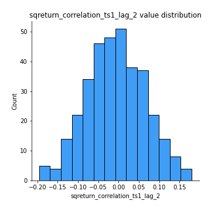
## Feature : sqreturn_correlation_ts1_lag_3
- **Feature type** : continous
- **Missing** : 0.0%
- **Unique** : 347
- **Count** :347.0
- **Mean** :0.003261378916651427
- **Std** :0.07832550200123221
- **Min** :-0.24943572588328833
- **25%th Percentile** : -0.04338214090182036
- **50%th Percentile** : 0.00604747683478236
- **75%th Percentile** : 0.05350447227316893
- **Max** :0.23808054096877584

## Feature : sqreturn_correlation_ts2_lag_1
- **Feature type** : continous
- **Missing** : 0.0%
- **Unique** : 347
- **Count** :347.0
- **Mean** :0.0017223442233841705
- **Std** :0.07370581802633885
- **Min** :-0.21574859570772106
- **25%th Percentile** : -0.048857904387970844
- **50%th Percentile** : -0.0011388140081186598
- **75%th Percentile** : 0.047665816628032154
- **Max** :0.3425036902091001

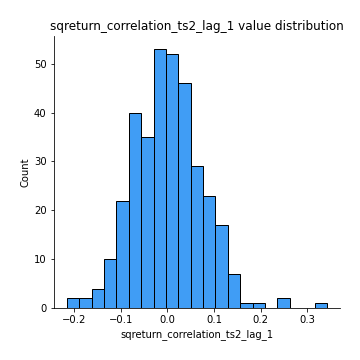
## Feature : sqreturn_correlation_ts2_lag_2
- **Feature type** : continous
- **Missing** : 0.0%
- **Unique** : 347
- **Count** :347.0
- **Mean** :-0.006230785123907871
- **Std** :0.07239110402499747
- **Min** :-0.21152732207407113
- **25%th Percentile** : -0.05615472976761438
- **50%th Percentile** : -0.004673731972622636
- **75%th Percentile** : 0.04228205823889549
- **Max** :0.1971503093940994

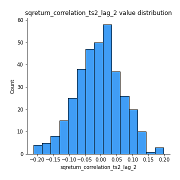
## Feature : sqreturn_correlation_ts2_lag_3
- **Feature type** : continous
- **Missing** : 0.0%
- **Unique** : 347
- **Count** :347.0
- **Mean** :0.012070975947319578
- **Std** :0.07359402460657082
- **Min** :-0.2704891050804987
- **25%th Percentile** : -0.032578622253361444
- **50%th Percentile** : 0.01387193197972959
- **75%th Percentile** : 0.06481486543046919
- **Max** :0.22488842036394519

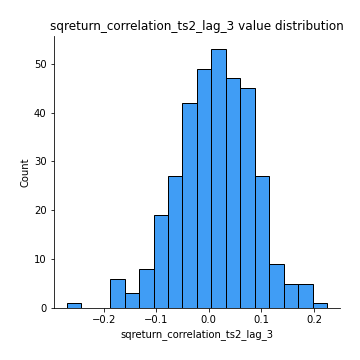
## Feature : price2_granger_cause_price1
- **Feature type** : continous
- **Missing** : 0.0%
- **Unique** : 347
- **Count** :347.0
- **Mean** :0.2715781286301373
- **Std** :0.291805202940915
- **Min** :2.4312048970873696e-09
- **25%th Percentile** : 0.01964281592812108
- **50%th Percentile** : 0.1668978777524171
- **75%th Percentile** : 0.44229783522296545
- **Max** :0.9898380228448623

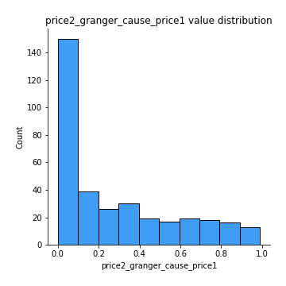
## Feature : price1_granger_cause_price2
- **Feature type** : continous
- **Missing** : 0.0%
- **Unique** : 347
- **Count** :347.0
- **Mean** :0.2783414952489394
- **Std** :0.2899917063039595
- **Min** :1.2012269232170316e-11
- **25%th Percentile** : 0.027432725313746797
- **50%th Percentile** : 0.17032687280509884
- **75%th Percentile** : 0.4503550270397204
- **Max** :0.994825986110415

[<< Go back](../README.md)
