# Summary of 2_DecisionTree

[<< Go back](../README.md)

## Decision Tree
- **n_jobs**: -1
- **criterion**: gini
- **max_depth**: 3
- **explain_level**: 2

## Validation
 - **validation_type**: split
 - **train_ratio**: 0.75
 - **shuffle**: True
 - **stratify**: True

## Optimized metric
accuracy

## Training time

8.9 seconds

## Metric details
|           |    score |   threshold |
|:----------|---------:|------------:|
| logloss   | 0.625035 |  nan        |
| auc       | 0.845666 |  nan        |
| f1        | 0.847059 |    0.463303 |
| accuracy  | 0.850575 |    0.463303 |
| precision | 0.857143 |    0.463303 |
| recall    | 0.976744 |    0        |
| mcc       | 0.701216 |    0.463303 |

## Confusion matrix (at threshold=0.463303)
|                      |   Predicted as real |   Predicted as simulated |
|:---------------------|--------------------:|-------------------------:|
| Labeled as real      |                  38 |                        6 |
| Labeled as simulated |                   7 |                       36 |

## Learning curves
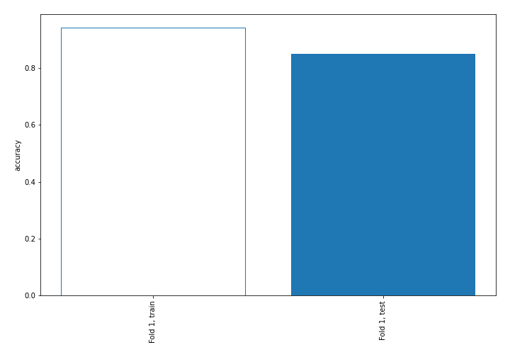

## Decision Tree 

### Tree #1
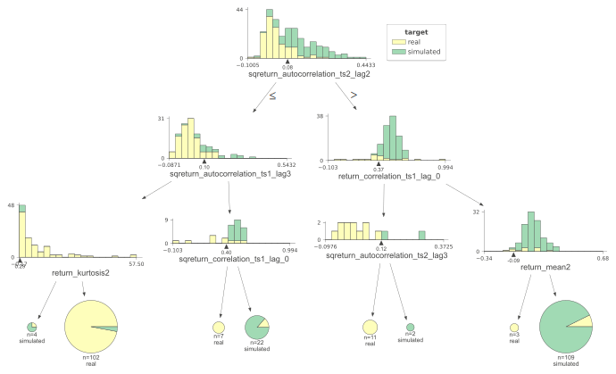

### Rules

if (sqreturn_autocorrelation_ts2_lag2 > 0.083) and (return_correlation_ts1_lag_0 > 0.371) and (return_mean2 > -0.087) then class: simulated (proba: 92.66%) | based on 109 samples

if (sqreturn_autocorrelation_ts2_lag2 <= 0.083) and (sqreturn_autocorrelation_ts1_lag3 <= 0.102) and (return_kurtosis2 > 0.29) then class: real (proba: 97.06%) | based on 102 samples

if (sqreturn_autocorrelation_ts2_lag2 <= 0.083) and (sqreturn_autocorrelation_ts1_lag3 > 0.102) and (sqreturn_correlation_ts1_lag_0 > 0.399) then class: simulated (proba: 86.36%) | based on 22 samples

if (sqreturn_autocorrelation_ts2_lag2 > 0.083) and (return_correlation_ts1_lag_0 <= 0.371) and (sqreturn_autocorrelation_ts2_lag3 <= 0.125) then class: real (proba: 100.0%) | based on 11 samples

if (sqreturn_autocorrelation_ts2_lag2 <= 0.083) and (sqreturn_autocorrelation_ts1_lag3 > 0.102) and (sqreturn_correlation_ts1_lag_0 <= 0.399) then class: real (proba: 100.0%) | based on 7 samples

if (sqreturn_autocorrelation_ts2_lag2 <= 0.083) and (sqreturn_autocorrelation_ts1_lag3 <= 0.102) and (return_kurtosis2 <= 0.29) then class: simulated (proba: 75.0%) | based on 4 samples

if (sqreturn_autocorrelation_ts2_lag2 > 0.083) and (return_correlation_ts1_lag_0 > 0.371) and (return_mean2 <= -0.087) then class: real (proba: 100.0%) | based on 3 samples

if (sqreturn_autocorrelation_ts2_lag2 > 0.083) and (return_correlation_ts1_lag_0 <= 0.371) and (sqreturn_autocorrelation_ts2_lag3 > 0.125) then class: simulated (proba: 100.0%) | based on 2 samples

## Permutation-based Importance
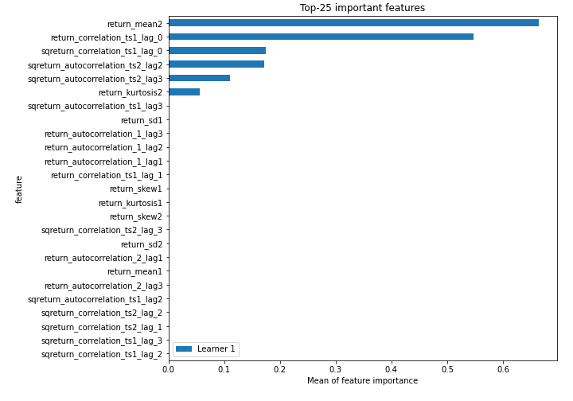
## Confusion Matrix

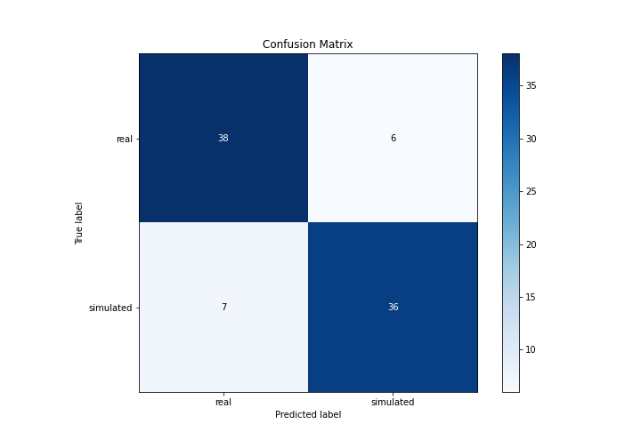

## Normalized Confusion Matrix

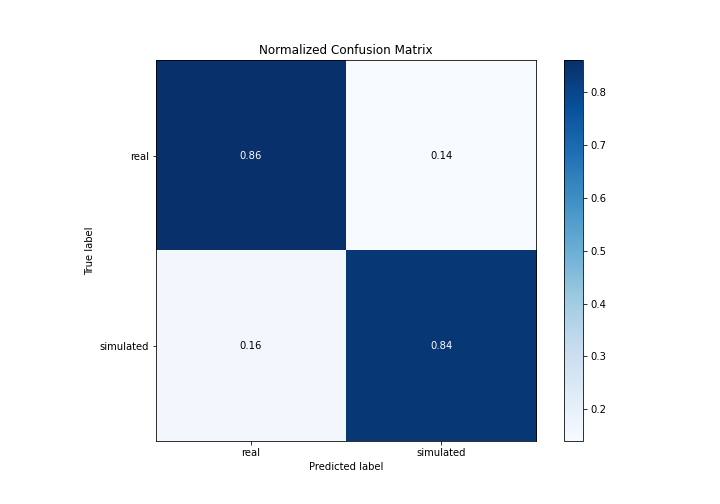

## ROC Curve

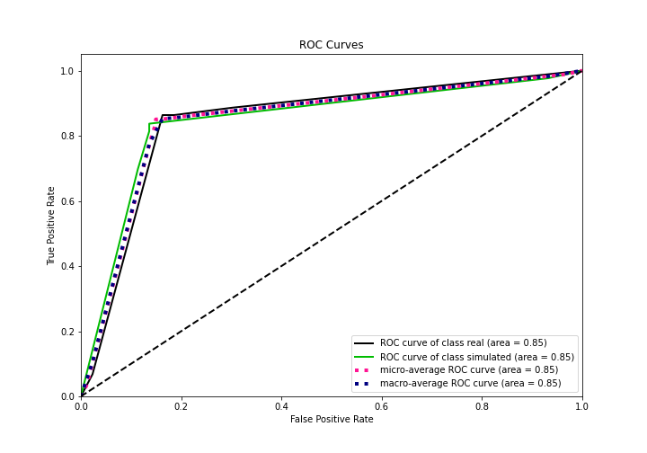

## Kolmogorov-Smirnov Statistic

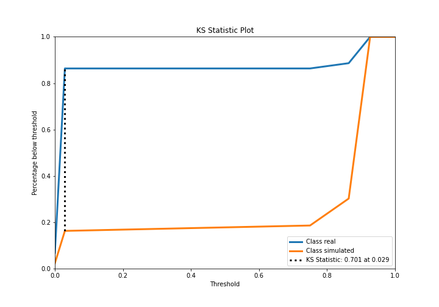

## Precision-Recall Curve

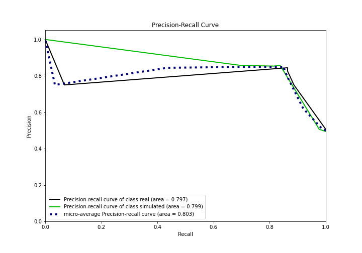

## Calibration Curve

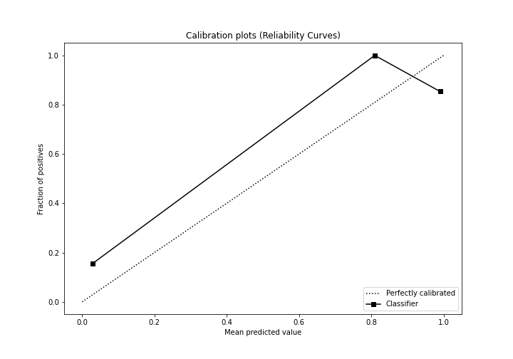

## Cumulative Gains Curve

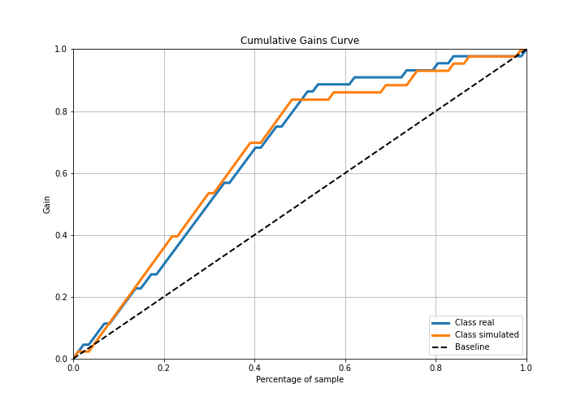

## Lift Curve

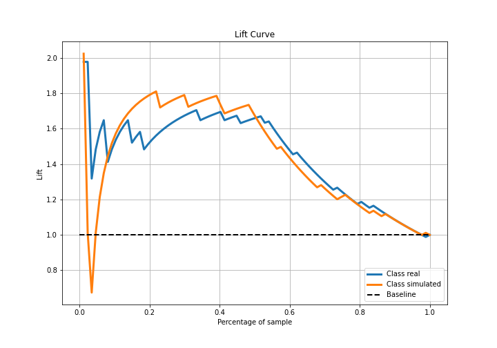

## SHAP Importance
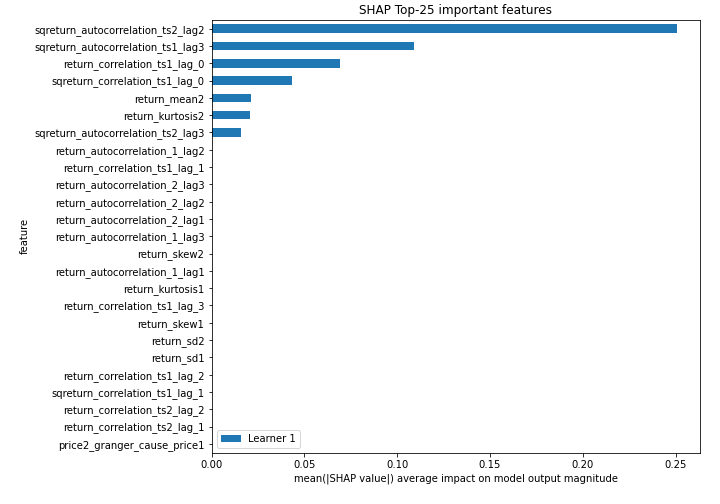

## SHAP Dependence plots

### Dependence (Fold 1)
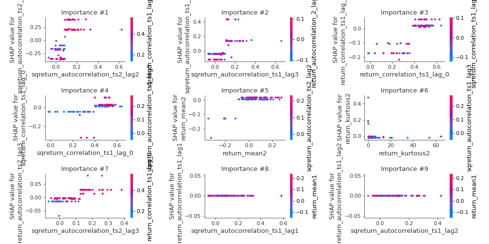

## SHAP Decision plots

### Top-10 Worst decisions for class 0 (Fold 1)
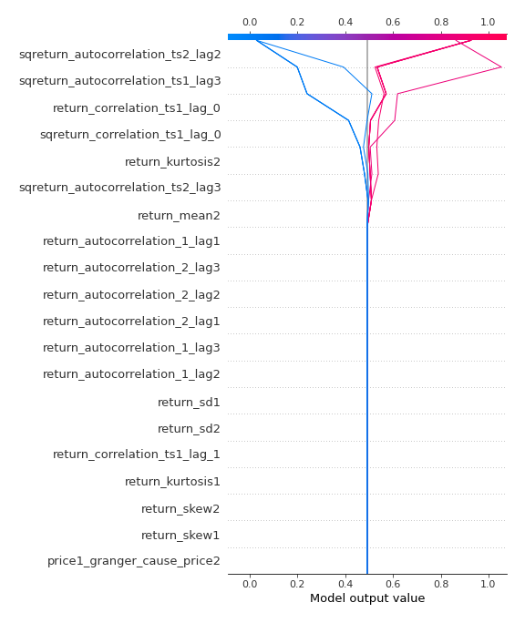
### Top-10 Best decisions for class 0 (Fold 1)
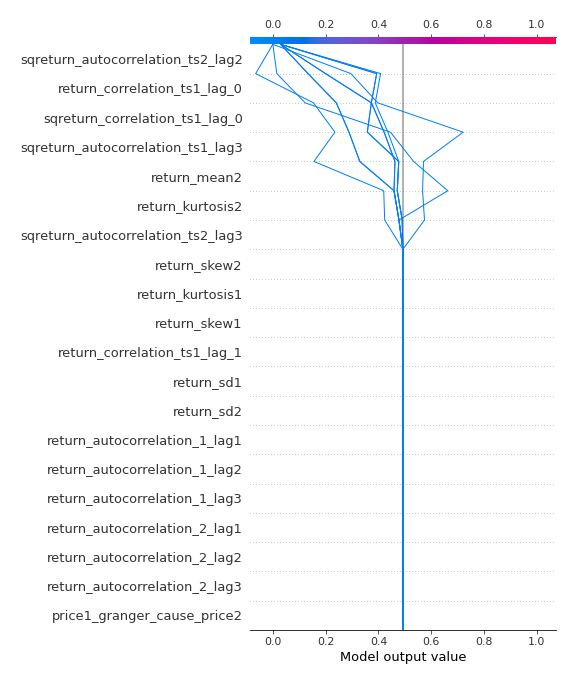
### Top-10 Worst decisions for class 1 (Fold 1)
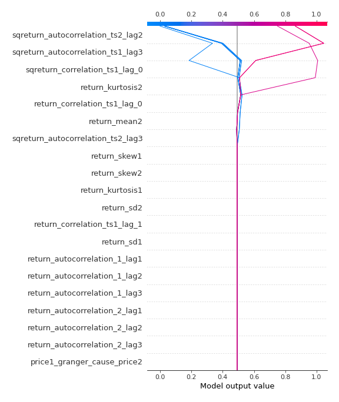
### Top-10 Best decisions for class 1 (Fold 1)
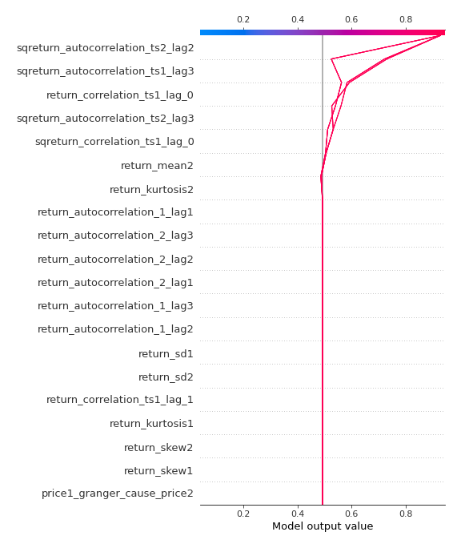

[<< Go back](../README.md)
