# Summary of 3_Linear

[<< Go back](../README.md)

## Logistic Regression (Linear)
- **n_jobs**: -1
- **explain_level**: 2

## Validation
 - **validation_type**: split
 - **train_ratio**: 0.75
 - **shuffle**: True
 - **stratify**: True

## Optimized metric
accuracy

## Training time

8.3 seconds

## Metric details
|           |    score |     threshold |
|:----------|---------:|--------------:|
| logloss   | 0.278461 | nan           |
| auc       | 0.981501 | nan           |
| f1        | 0.91954  |   0.597897    |
| accuracy  | 0.91954  |   0.597897    |
| precision | 1        |   0.725183    |
| recall    | 1        |   1.51139e-07 |
| mcc       | 0.849881 |   0.707514    |

## Confusion matrix (at threshold=0.597897)
|                      |   Predicted as real |   Predicted as simulated |
|:---------------------|--------------------:|-------------------------:|
| Labeled as real      |                  40 |                        4 |
| Labeled as simulated |                   3 |                       40 |

## Learning curves
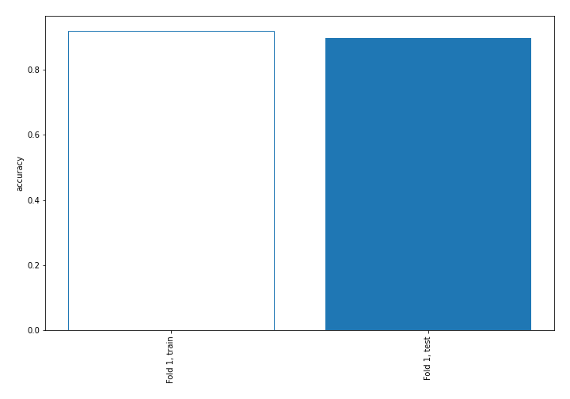

## Coefficients
| feature                           |   Learner_1 |
|:----------------------------------|------------:|
| sqreturn_autocorrelation_ts1_lag3 |   2.51936   |
| sqreturn_autocorrelation_ts1_lag2 |   1.9623    |
| sqreturn_autocorrelation_ts2_lag2 |   1.93422   |
| return_correlation_ts1_lag_0      |   1.87094   |
| sqreturn_correlation_ts1_lag_0    |   1.87094   |
| sqreturn_autocorrelation_ts2_lag3 |   1.59561   |
| sqreturn_autocorrelation_ts2_lag1 |   1.25289   |
| return_mean2                      |   1.16634   |
| sqreturn_autocorrelation_ts1_lag1 |   0.846323  |
| return_mean1                      |   0.803252  |
| return_autocorrelation_1_lag1     |   0.71949   |
| return_autocorrelation_1_lag2     |   0.655688  |
| return_sd2                        |   0.547969  |
| sqreturn_correlation_ts1_lag_1    |   0.178545  |
| return_correlation_ts1_lag_1      |   0.178545  |
| sqreturn_correlation_ts2_lag_2    |   0.131156  |
| return_correlation_ts2_lag_2      |   0.131156  |
| return_correlation_ts2_lag_1      |   0.056622  |
| sqreturn_correlation_ts2_lag_1    |   0.056622  |
| return_autocorrelation_2_lag1     |  -0.0144007 |
| return_correlation_ts1_lag_2      |  -0.103989  |
| sqreturn_correlation_ts1_lag_2    |  -0.103989  |
| return_skew2                      |  -0.1875    |
| sqreturn_correlation_ts1_lag_3    |  -0.271035  |
| return_correlation_ts1_lag_3      |  -0.271035  |
| price1_granger_cause_price2       |  -0.374392  |
| return_autocorrelation_1_lag3     |  -0.404739  |
| return_correlation_ts2_lag_3      |  -0.416941  |
| sqreturn_correlation_ts2_lag_3    |  -0.416941  |
| return_skew1                      |  -0.51644   |
| return_autocorrelation_2_lag3     |  -0.52664   |
| price2_granger_cause_price1       |  -0.626104  |
| return_sd1                        |  -0.672365  |
| return_autocorrelation_2_lag2     |  -0.682577  |
| return_kurtosis1                  |  -1.04513   |
| return_kurtosis2                  |  -2.20925   |
| intercept                         |  -3.29326   |

## Permutation-based Importance
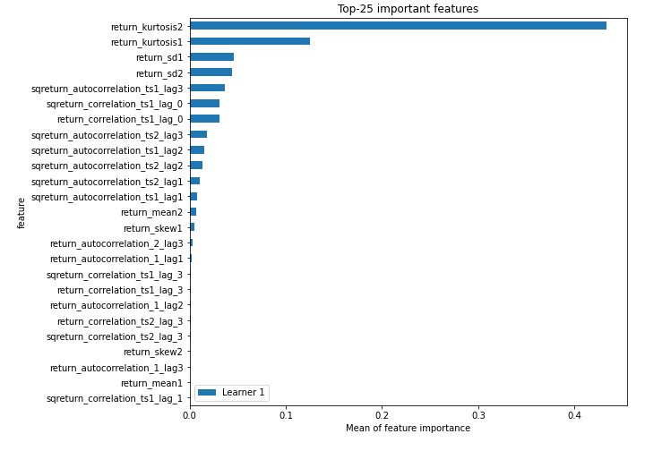
## Confusion Matrix

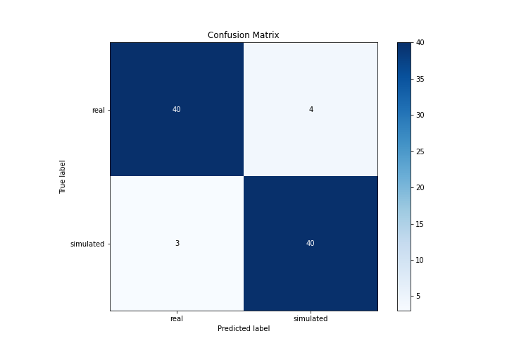

## Normalized Confusion Matrix

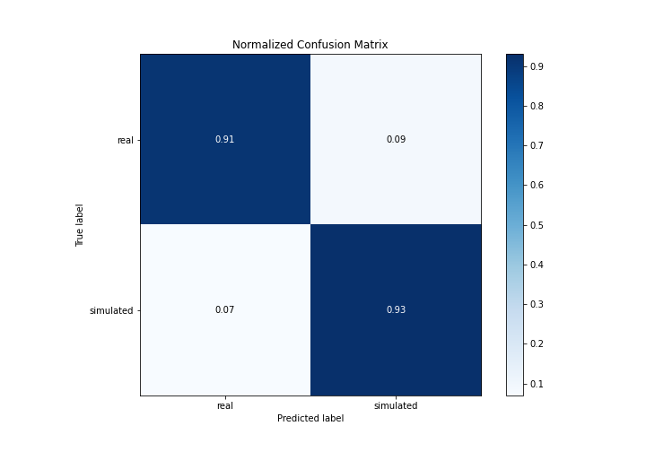

## ROC Curve

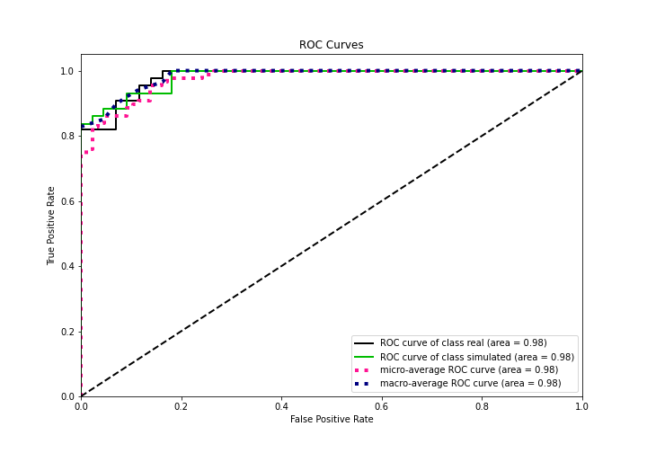

## Kolmogorov-Smirnov Statistic

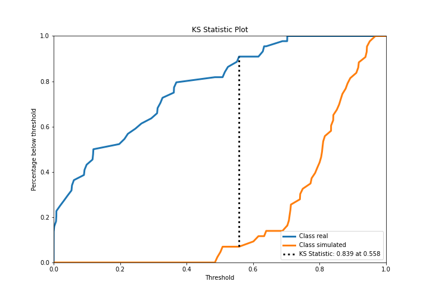

## Precision-Recall Curve

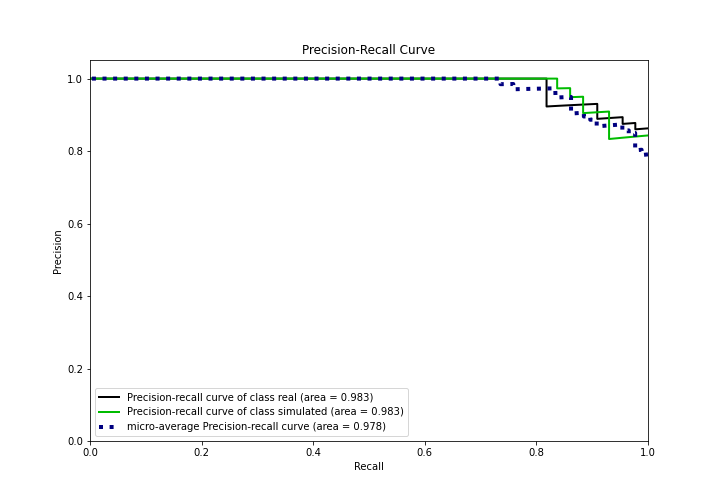

## Calibration Curve

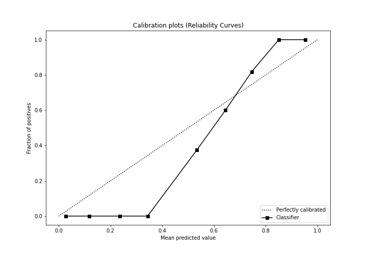

## Cumulative Gains Curve

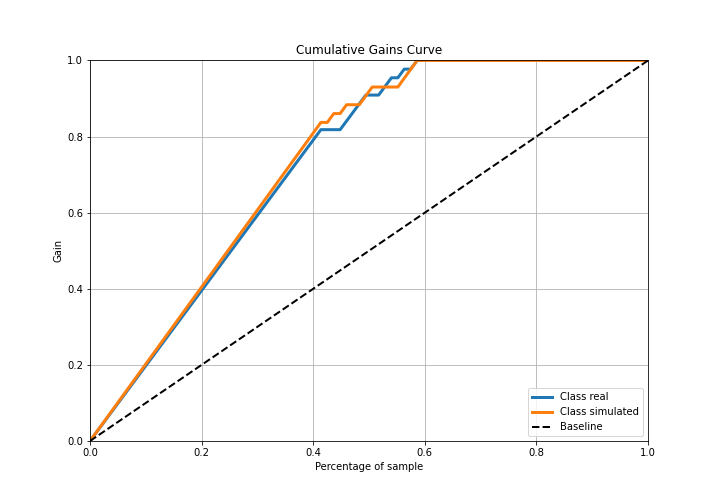

## Lift Curve

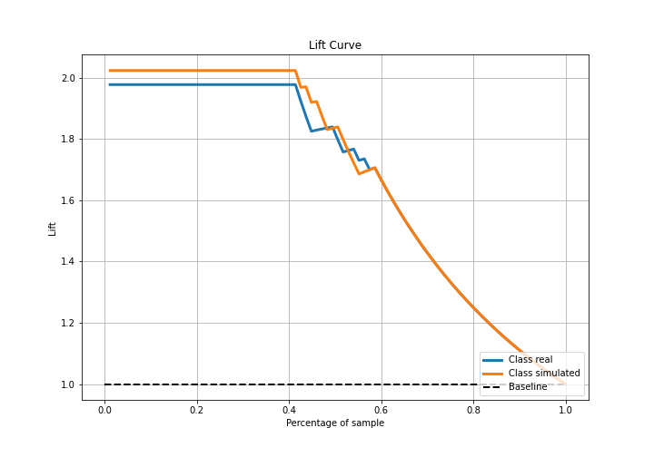

## SHAP Importance
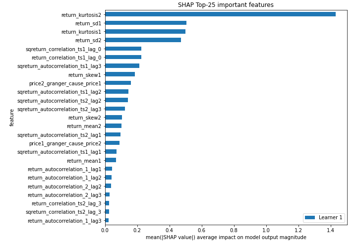

## SHAP Dependence plots

### Dependence (Fold 1)
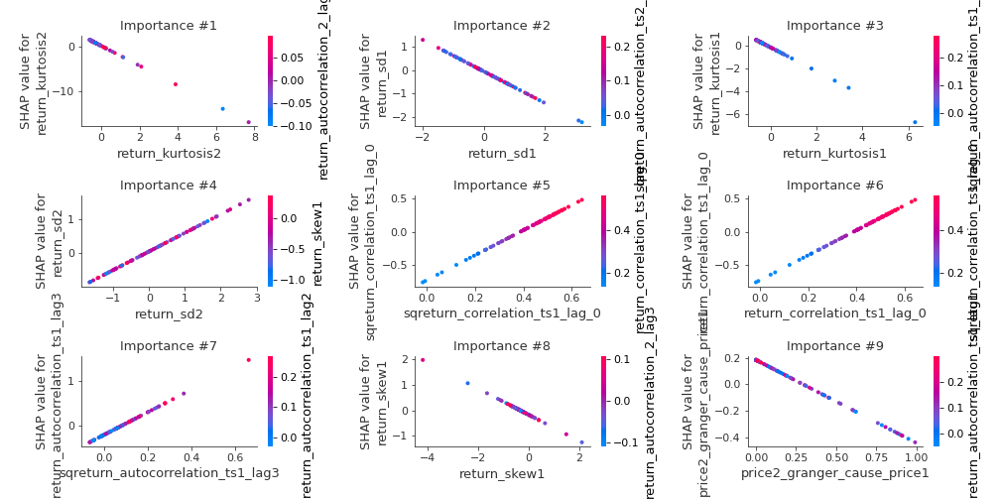

## SHAP Decision plots

### Top-10 Worst decisions for class 0 (Fold 1)
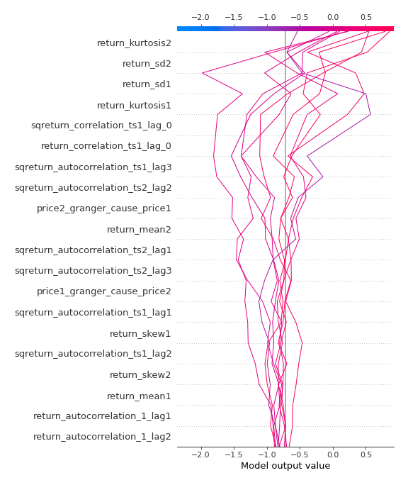
### Top-10 Best decisions for class 0 (Fold 1)
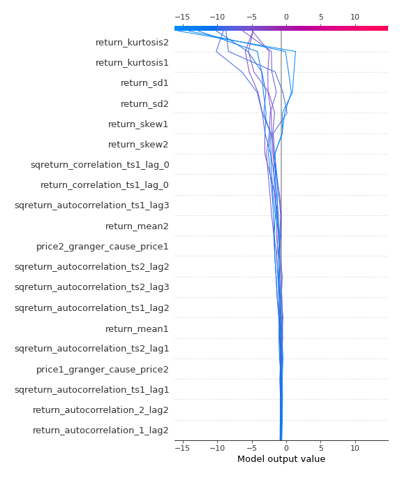
### Top-10 Worst decisions for class 1 (Fold 1)
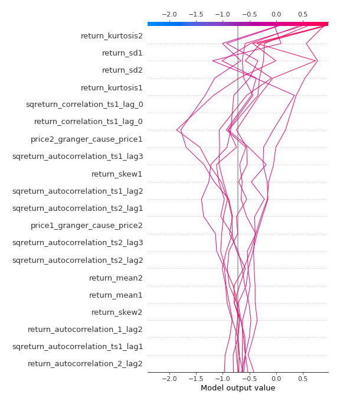
### Top-10 Best decisions for class 1 (Fold 1)
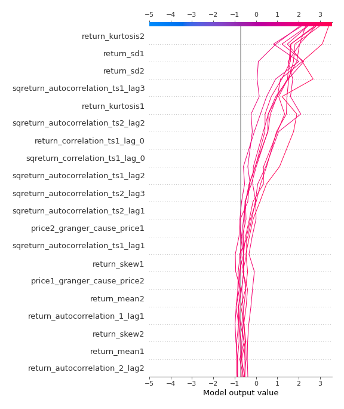

[<< Go back](../README.md)
