# Exploratory Data Analysis

[<< Go back](../README.md)
## Feature : target
- **Feature type** : categorical
- **Missing** : 0.0%
- **Unique** : 2
- **Count** :347
- **Unique** :2
- **Top** :real
- **Freq** :176

## Feature : return_mean1
- **Feature type** : continous
- **Missing** : 0.0%
- **Unique** : 347
- **Count** :347.0
- **Mean** :0.05036174192212297
- **Std** :0.1127254648350172
- **Min** :-0.297638839829253
- **25%th Percentile** : -0.017229212992195278
- **50%th Percentile** : 0.059238228099478006
- **75%th Percentile** : 0.1298605133289868
- **Max** :0.37114599775483653

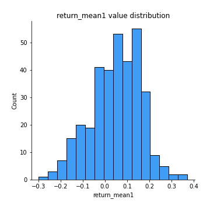
## Feature : return_mean2
- **Feature type** : continous
- **Missing** : 0.0%
- **Unique** : 347
- **Count** :347.0
- **Mean** :0.05051922592351643
- **Std** :0.10827837848875319
- **Min** :-0.3439835398279146
- **25%th Percentile** : -0.00923804390625257
- **50%th Percentile** : 0.05479358656026607
- **75%th Percentile** : 0.1164053242781776
- **Max** :0.6801605239983173

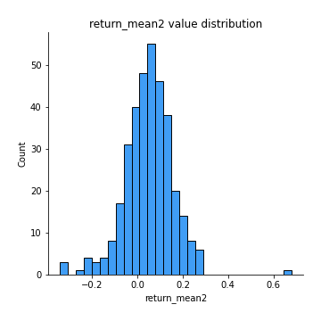
## Feature : return_sd1
- **Feature type** : continous
- **Missing** : 0.0%
- **Unique** : 347
- **Count** :347.0
- **Mean** :1.587552479900219
- **Std** :0.4945369359965792
- **Min** :0.4161922335073731
- **25%th Percentile** : 1.2459906836165016
- **50%th Percentile** : 1.5506595996995864
- **75%th Percentile** : 1.8360605276762856
- **Max** :3.332494027875222

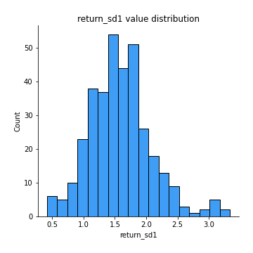
## Feature : return_sd2
- **Feature type** : continous
- **Missing** : 0.0%
- **Unique** : 347
- **Count** :347.0
- **Mean** :1.7863222599323452
- **Std** :0.5315727556704185
- **Min** :0.5805024564283243
- **25%th Percentile** : 1.418706937642039
- **50%th Percentile** : 1.7249211803731064
- **75%th Percentile** : 2.0979335604670384
- **Max** :4.59233049161685

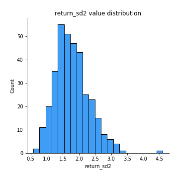
## Feature : return_skew1
- **Feature type** : continous
- **Missing** : 0.0%
- **Unique** : 347
- **Count** :347.0
- **Mean** :-0.3628772682527681
- **Std** :0.7148518198804147
- **Min** :-4.239645236578449
- **25%th Percentile** : -0.5888592327124856
- **50%th Percentile** : -0.3541667678926756
- **75%th Percentile** : -0.0833098265042908
- **Max** :2.1285977762978217

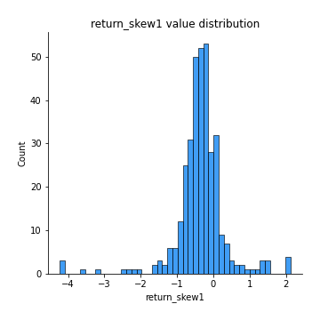
## Feature : return_skew2
- **Feature type** : continous
- **Missing** : 0.0%
- **Unique** : 347
- **Count** :347.0
- **Mean** :-0.35336148330336886
- **Std** :0.9681081537295447
- **Min** :-6.262899561987459
- **25%th Percentile** : -0.539988612801422
- **50%th Percentile** : -0.2374626607959604
- **75%th Percentile** : 0.005416475438270526
- **Max** :4.0310261345618

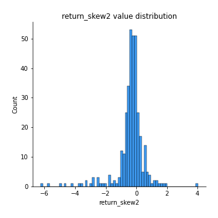
## Feature : return_kurtosis1
- **Feature type** : continous
- **Missing** : 0.0%
- **Unique** : 347
- **Count** :347.0
- **Mean** :3.5453816081725993
- **Std** :5.092639448989259
- **Min** :-0.16279575412319458
- **25%th Percentile** : 1.2693331002659378
- **50%th Percentile** : 2.001127736858773
- **75%th Percentile** : 3.8103343987230147
- **Max** :40.485294874464934

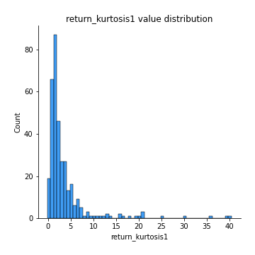
## Feature : return_kurtosis2
- **Feature type** : continous
- **Missing** : 0.0%
- **Unique** : 347
- **Count** :347.0
- **Mean** :4.826735614771929
- **Std** :8.388696497782714
- **Min** :-0.1693240760286967
- **25%th Percentile** : 1.168498008809443
- **50%th Percentile** : 2.1863687783335912
- **75%th Percentile** : 4.359531427956692
- **Max** :64.99818629655663

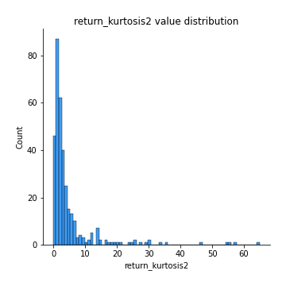
## Feature : return_autocorrelation_1_lag1
- **Feature type** : continous
- **Missing** : 0.0%
- **Unique** : 347
- **Count** :347.0
- **Mean** :-0.010526843111662965
- **Std** :0.07732751006009597
- **Min** :-0.21701353048496108
- **25%th Percentile** : -0.06297270533388136
- **50%th Percentile** : -0.011841111350130593
- **75%th Percentile** : 0.03627824203439129
- **Max** :0.25453567055313087

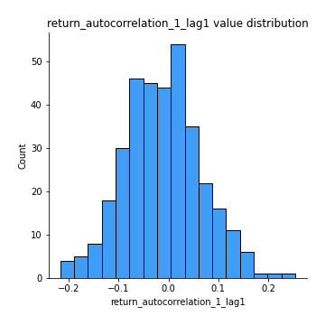
## Feature : return_autocorrelation_1_lag2
- **Feature type** : continous
- **Missing** : 0.0%
- **Unique** : 347
- **Count** :347.0
- **Mean** :-0.0090042754726458
- **Std** :0.07812489470578715
- **Min** :-0.2402083422632262
- **25%th Percentile** : -0.06043422915053767
- **50%th Percentile** : -0.009543140094656831
- **75%th Percentile** : 0.04490498552314151
- **Max** :0.2865417881059442

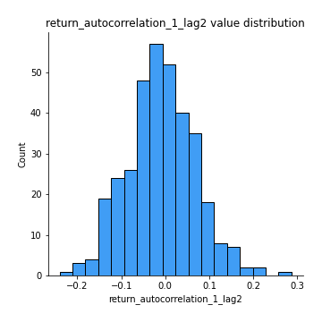
## Feature : return_autocorrelation_1_lag3
- **Feature type** : continous
- **Missing** : 0.0%
- **Unique** : 347
- **Count** :347.0
- **Mean** :0.010644998133317993
- **Std** :0.0697204419207385
- **Min** :-0.2443068853631313
- **25%th Percentile** : -0.03041500754592412
- **50%th Percentile** : 0.01951492752875879
- **75%th Percentile** : 0.052939394022637094
- **Max** :0.19348987508695575

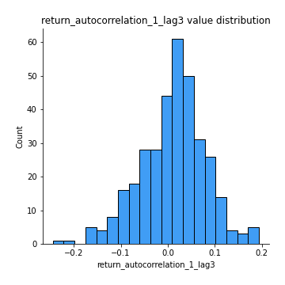
## Feature : return_autocorrelation_2_lag1
- **Feature type** : continous
- **Missing** : 0.0%
- **Unique** : 347
- **Count** :347.0
- **Mean** :-0.004242045775138441
- **Std** :0.07286810633530441
- **Min** :-0.2024543815727164
- **25%th Percentile** : -0.05362879598525859
- **50%th Percentile** : -0.005077659919524785
- **75%th Percentile** : 0.04505005870158253
- **Max** :0.20537021365971764

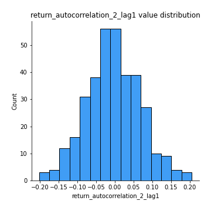
## Feature : return_autocorrelation_2_lag2
- **Feature type** : continous
- **Missing** : 0.0%
- **Unique** : 347
- **Count** :347.0
- **Mean** :-0.016706331324257133
- **Std** :0.07350708831179505
- **Min** :-0.22251044892083238
- **25%th Percentile** : -0.0660332728804232
- **50%th Percentile** : -0.016592088007812002
- **75%th Percentile** : 0.03185858511128292
- **Max** :0.22465361632794242

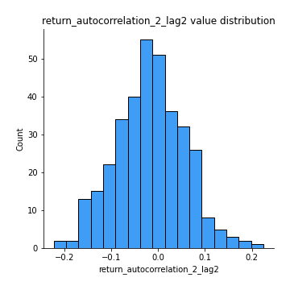
## Feature : return_autocorrelation_2_lag3
- **Feature type** : continous
- **Missing** : 0.0%
- **Unique** : 347
- **Count** :347.0
- **Mean** :0.0029887261872252324
- **Std** :0.06330812340760848
- **Min** :-0.1798960840760737
- **25%th Percentile** : -0.03531897976690644
- **50%th Percentile** : 0.004469989418574833
- **75%th Percentile** : 0.04695617667127136
- **Max** :0.16856729408475926

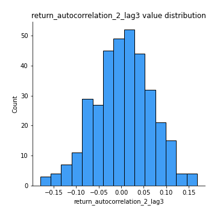
## Feature : return_correlation_ts1_lag_0
- **Feature type** : continous
- **Missing** : 0.0%
- **Unique** : 347
- **Count** :347.0
- **Mean** :0.410396547440762
- **Std** :0.1557518987252568
- **Min** :-0.10256711281206837
- **25%th Percentile** : 0.3372849253750275
- **50%th Percentile** : 0.4560705684853661
- **75%th Percentile** : 0.5187428528206248
- **Max** :0.9937227277077512

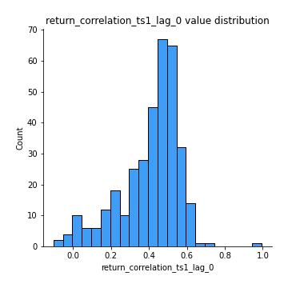
## Feature : return_correlation_ts1_lag_1
- **Feature type** : continous
- **Missing** : 0.0%
- **Unique** : 347
- **Count** :347.0
- **Mean** :-0.005440588216922064
- **Std** :0.07474723567535453
- **Min** :-0.24730284249309362
- **25%th Percentile** : -0.053058685968102585
- **50%th Percentile** : -0.0034556952514036778
- **75%th Percentile** : 0.04039724738416829
- **Max** :0.22824657333780743

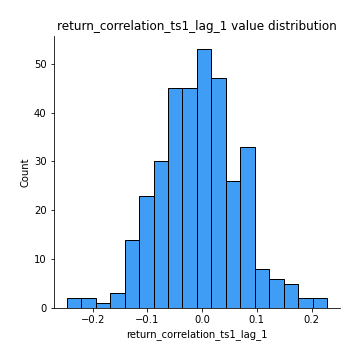
## Feature : return_correlation_ts1_lag_2
- **Feature type** : continous
- **Missing** : 0.0%
- **Unique** : 347
- **Count** :347.0
- **Mean** :-0.007408997922746978
- **Std** :0.07193499148104959
- **Min** :-0.26620183448814294
- **25%th Percentile** : -0.05798236720785892
- **50%th Percentile** : -0.00921790594478724
- **75%th Percentile** : 0.04387837818264592
- **Max** :0.2785163624971401

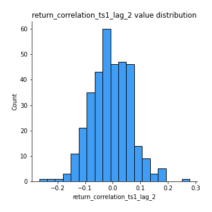
## Feature : return_correlation_ts1_lag_3
- **Feature type** : continous
- **Missing** : 0.0%
- **Unique** : 347
- **Count** :347.0
- **Mean** :0.002939461052113685
- **Std** :0.0743636567743318
- **Min** :-0.22146773589217006
- **25%th Percentile** : -0.04234578390555213
- **50%th Percentile** : 0.002932801328812627
- **75%th Percentile** : 0.05180626217875138
- **Max** :0.23808054096877584

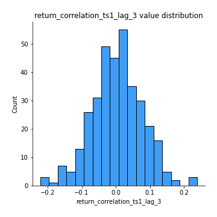
## Feature : return_correlation_ts2_lag_1
- **Feature type** : continous
- **Missing** : 0.0%
- **Unique** : 347
- **Count** :347.0
- **Mean** :0.0023718312683786735
- **Std** :0.07426000653906334
- **Min** :-0.19135073548859977
- **25%th Percentile** : -0.05152020466111966
- **50%th Percentile** : -0.0003055554868231035
- **75%th Percentile** : 0.04973514367765987
- **Max** :0.3425036902091001

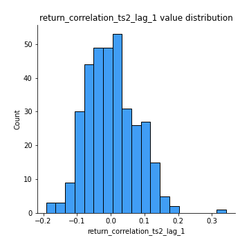
## Feature : return_correlation_ts2_lag_2
- **Feature type** : continous
- **Missing** : 0.0%
- **Unique** : 347
- **Count** :347.0
- **Mean** :-0.011290526305967202
- **Std** :0.07251447765471193
- **Min** :-0.2757460186107768
- **25%th Percentile** : -0.05223607108381602
- **50%th Percentile** : -0.009961533594060122
- **75%th Percentile** : 0.03448988805807511
- **Max** :0.19242639122604493

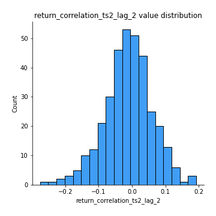
## Feature : return_correlation_ts2_lag_3
- **Feature type** : continous
- **Missing** : 0.0%
- **Unique** : 347
- **Count** :347.0
- **Mean** :0.011685085659324492
- **Std** :0.07254823743248927
- **Min** :-0.17324659348176644
- **25%th Percentile** : -0.03710204701164342
- **50%th Percentile** : 0.01387193197972959
- **75%th Percentile** : 0.06328489913373525
- **Max** :0.22846218382348057

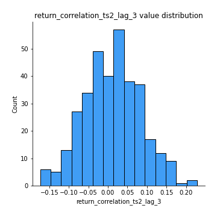
## Feature : sqreturn_autocorrelation_ts1_lag1
- **Feature type** : continous
- **Missing** : 0.0%
- **Unique** : 347
- **Count** :347.0
- **Mean** :0.11099600136329567
- **Std** :0.10810600992267776
- **Min** :-0.0641667707236835
- **25%th Percentile** : 0.023261919454261076
- **50%th Percentile** : 0.09415006993110435
- **75%th Percentile** : 0.17788971573785542
- **Max** :0.584403010531536

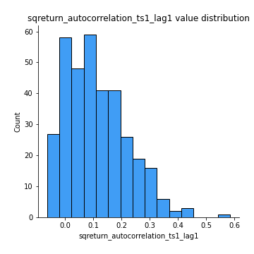
## Feature : sqreturn_autocorrelation_ts1_lag2
- **Feature type** : continous
- **Missing** : 0.0%
- **Unique** : 347
- **Count** :347.0
- **Mean** :0.103360026381793
- **Std** :0.1024850865281697
- **Min** :-0.08684405202664229
- **25%th Percentile** : 0.017400435552555188
- **50%th Percentile** : 0.09097381338636415
- **75%th Percentile** : 0.1614426813030373
- **Max** :0.424686216709823

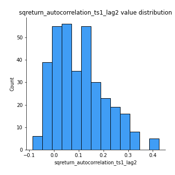
## Feature : sqreturn_autocorrelation_ts1_lag3
- **Feature type** : continous
- **Missing** : 0.0%
- **Unique** : 347
- **Count** :347.0
- **Mean** :0.0878801974534653
- **Std** :0.10886935092767591
- **Min** :-0.08711242405535644
- **25%th Percentile** : 0.006967944430671672
- **50%th Percentile** : 0.06190968835415674
- **75%th Percentile** : 0.14597819696280834
- **Max** :0.663006503599381

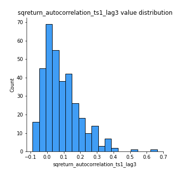
## Feature : sqreturn_autocorrelation_ts2_lag1
- **Feature type** : continous
- **Missing** : 0.0%
- **Unique** : 347
- **Count** :347.0
- **Mean** :0.10372052761123578
- **Std** :0.10130495536008469
- **Min** :-0.05338915539890472
- **25%th Percentile** : 0.026271757327135707
- **50%th Percentile** : 0.08476358493729769
- **75%th Percentile** : 0.15745966776711345
- **Max** :0.43666292790989825

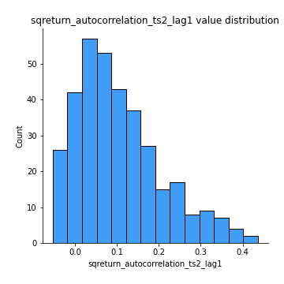
## Feature : sqreturn_autocorrelation_ts2_lag2
- **Feature type** : continous
- **Missing** : 0.0%
- **Unique** : 347
- **Count** :347.0
- **Mean** :0.09053364301568621
- **Std** :0.10110132315024385
- **Min** :-0.10054631197559977
- **25%th Percentile** : 0.010662704864296265
- **50%th Percentile** : 0.07411012230489739
- **75%th Percentile** : 0.14163828059528083
- **Max** :0.6281332716566994

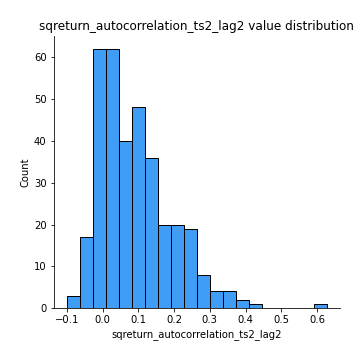
## Feature : sqreturn_autocorrelation_ts2_lag3
- **Feature type** : continous
- **Missing** : 0.0%
- **Unique** : 347
- **Count** :347.0
- **Mean** :0.07398565588868057
- **Std** :0.09617999402961123
- **Min** :-0.09756858950376449
- **25%th Percentile** : -0.0043194592664963505
- **50%th Percentile** : 0.05437551345414539
- **75%th Percentile** : 0.13497539404049433
- **Max** :0.38354560812912175

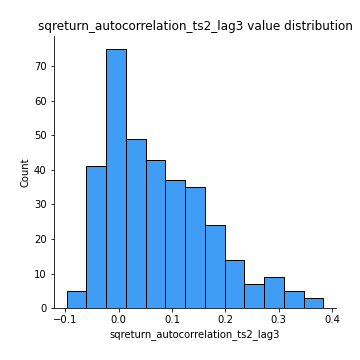
## Feature : sqreturn_correlation_ts1_lag_0
- **Feature type** : continous
- **Missing** : 0.0%
- **Unique** : 347
- **Count** :347.0
- **Mean** :0.410396547440762
- **Std** :0.1557518987252568
- **Min** :-0.10256711281206837
- **25%th Percentile** : 0.3372849253750275
- **50%th Percentile** : 0.4560705684853661
- **75%th Percentile** : 0.5187428528206248
- **Max** :0.9937227277077512

## Feature : sqreturn_correlation_ts1_lag_1
- **Feature type** : continous
- **Missing** : 0.0%
- **Unique** : 347
- **Count** :347.0
- **Mean** :-0.005440588216922064
- **Std** :0.07474723567535453
- **Min** :-0.24730284249309362
- **25%th Percentile** : -0.053058685968102585
- **50%th Percentile** : -0.0034556952514036778
- **75%th Percentile** : 0.04039724738416829
- **Max** :0.22824657333780743

## Feature : sqreturn_correlation_ts1_lag_2
- **Feature type** : continous
- **Missing** : 0.0%
- **Unique** : 347
- **Count** :347.0
- **Mean** :-0.007408997922746978
- **Std** :0.07193499148104959
- **Min** :-0.26620183448814294
- **25%th Percentile** : -0.05798236720785892
- **50%th Percentile** : -0.00921790594478724
- **75%th Percentile** : 0.04387837818264592
- **Max** :0.2785163624971401

## Feature : sqreturn_correlation_ts1_lag_3
- **Feature type** : continous
- **Missing** : 0.0%
- **Unique** : 347
- **Count** :347.0
- **Mean** :0.002939461052113685
- **Std** :0.0743636567743318
- **Min** :-0.22146773589217006
- **25%th Percentile** : -0.04234578390555213
- **50%th Percentile** : 0.002932801328812627
- **75%th Percentile** : 0.05180626217875138
- **Max** :0.23808054096877584

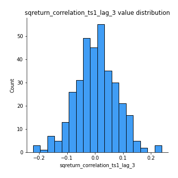
## Feature : sqreturn_correlation_ts2_lag_1
- **Feature type** : continous
- **Missing** : 0.0%
- **Unique** : 347
- **Count** :347.0
- **Mean** :0.0023718312683786735
- **Std** :0.07426000653906334
- **Min** :-0.19135073548859977
- **25%th Percentile** : -0.05152020466111966
- **50%th Percentile** : -0.0003055554868231035
- **75%th Percentile** : 0.04973514367765987
- **Max** :0.3425036902091001

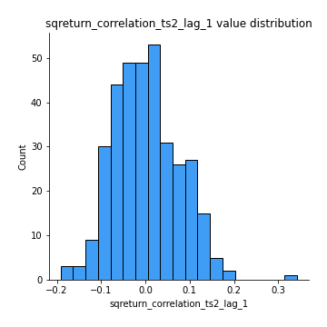
## Feature : sqreturn_correlation_ts2_lag_2
- **Feature type** : continous
- **Missing** : 0.0%
- **Unique** : 347
- **Count** :347.0
- **Mean** :-0.011290526305967202
- **Std** :0.07251447765471193
- **Min** :-0.2757460186107768
- **25%th Percentile** : -0.05223607108381602
- **50%th Percentile** : -0.009961533594060122
- **75%th Percentile** : 0.03448988805807511
- **Max** :0.19242639122604493

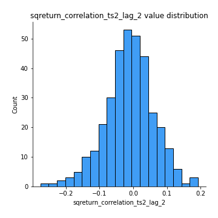
## Feature : sqreturn_correlation_ts2_lag_3
- **Feature type** : continous
- **Missing** : 0.0%
- **Unique** : 347
- **Count** :347.0
- **Mean** :0.011685085659324492
- **Std** :0.07254823743248927
- **Min** :-0.17324659348176644
- **25%th Percentile** : -0.03710204701164342
- **50%th Percentile** : 0.01387193197972959
- **75%th Percentile** : 0.06328489913373525
- **Max** :0.22846218382348057

## Feature : price2_granger_cause_price1
- **Feature type** : continous
- **Missing** : 0.0%
- **Unique** : 347
- **Count** :347.0
- **Mean** :0.26332982557022583
- **Std** :0.2834419060300509
- **Min** :2.9583382932626026e-10
- **25%th Percentile** : 0.01906842949809276
- **50%th Percentile** : 0.15960928540307853
- **75%th Percentile** : 0.4251156668453278
- **Max** :0.9906513522194527

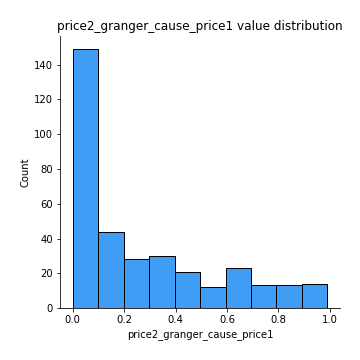
## Feature : price1_granger_cause_price2
- **Feature type** : continous
- **Missing** : 0.0%
- **Unique** : 347
- **Count** :347.0
- **Mean** :0.2796726408152574
- **Std** :0.3037075749772973
- **Min** :1.2012269232170316e-11
- **25%th Percentile** : 0.022199746619243482
- **50%th Percentile** : 0.15632909529383315
- **75%th Percentile** : 0.4729309112183179
- **Max** :0.9871292066441198

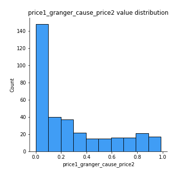

[<< Go back](../README.md)
