# Summary of 3_Linear

[<< Go back](../README.md)

## Logistic Regression (Linear)
- **n_jobs**: -1
- **explain_level**: 2

## Validation
 - **validation_type**: split
 - **train_ratio**: 0.75
 - **shuffle**: True
 - **stratify**: True

## Optimized metric
accuracy

## Training time

3.2 seconds

## Metric details
|           |    score |     threshold |
|:----------|---------:|--------------:|
| logloss   | 0.141095 | nan           |
| auc       | 0.999471 | nan           |
| f1        | 0.989011 |   0.67943     |
| accuracy  | 0.988506 |   0.714948    |
| precision | 1        |   0.944365    |
| recall    | 1        |   3.45441e-22 |
| mcc       | 0.977261 |   0.714948    |

## Confusion matrix (at threshold=0.714948)
|                      |   Predicted as real |   Predicted as simulated |
|:---------------------|--------------------:|-------------------------:|
| Labeled as real      |                  42 |                        0 |
| Labeled as simulated |                   1 |                       44 |

## Learning curves
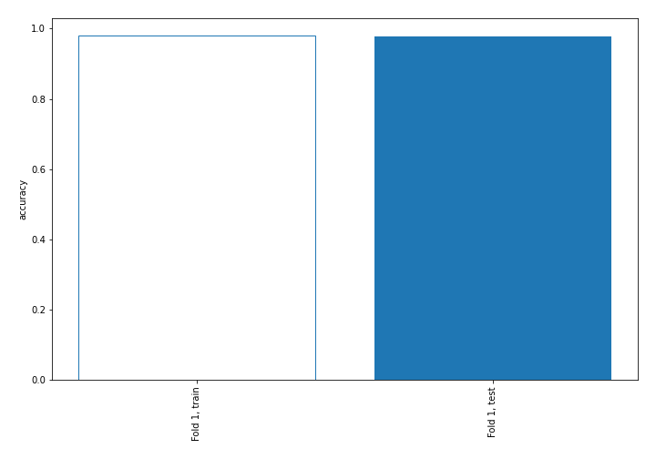

## Coefficients
| feature                           |   Learner_1 |
|:----------------------------------|------------:|
| return_skew1                      |  1.9875     |
| return_skew2                      |  0.979158   |
| return_autocorrelation_1_lag2     |  0.463512   |
| return_autocorrelation_1_lag1     |  0.441134   |
| sqreturn_correlation_ts1_lag_1    |  0.422      |
| return_correlation_ts1_lag_1      |  0.422      |
| return_autocorrelation_2_lag2     |  0.310744   |
| sqreturn_correlation_ts2_lag_1    |  0.273303   |
| return_correlation_ts2_lag_1      |  0.273303   |
| return_correlation_ts1_lag_2      |  0.252467   |
| sqreturn_correlation_ts1_lag_2    |  0.252467   |
| return_correlation_ts2_lag_2      |  0.160841   |
| sqreturn_correlation_ts2_lag_2    |  0.160841   |
| sqreturn_correlation_ts1_lag_3    |  0.150599   |
| return_correlation_ts1_lag_3      |  0.150599   |
| return_autocorrelation_2_lag1     |  0.102747   |
| return_correlation_ts2_lag_3      |  0.0953659  |
| sqreturn_correlation_ts2_lag_3    |  0.0953659  |
| return_autocorrelation_2_lag3     |  0.0356995  |
| price1_granger_cause_price2       |  0.0169889  |
| return_autocorrelation_1_lag3     |  0.00423782 |
| return_sd2                        | -0.0791673  |
| price2_granger_cause_price1       | -0.238956   |
| sqreturn_correlation_ts1_lag_0    | -0.282023   |
| return_correlation_ts1_lag_0      | -0.282023   |
| sqreturn_autocorrelation_ts1_lag3 | -0.417103   |
| return_mean1                      | -0.43055    |
| sqreturn_autocorrelation_ts2_lag3 | -0.43201    |
| sqreturn_autocorrelation_ts2_lag2 | -0.479206   |
| return_sd1                        | -0.510967   |
| sqreturn_autocorrelation_ts2_lag1 | -0.814865   |
| sqreturn_autocorrelation_ts1_lag1 | -0.865961   |
| sqreturn_autocorrelation_ts1_lag2 | -0.955433   |
| return_mean2                      | -1.03933    |
| intercept                         | -1.31668    |
| return_kurtosis2                  | -3.43013    |
| return_kurtosis1                  | -4.20902    |

## Permutation-based Importance
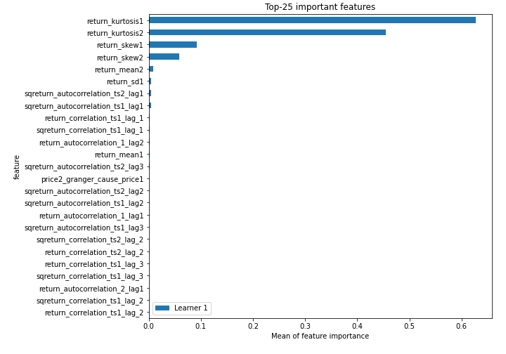
## Confusion Matrix

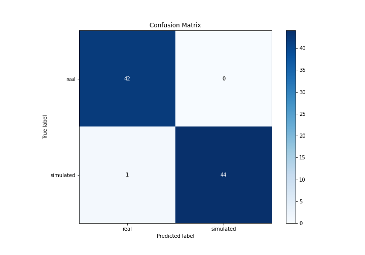

## Normalized Confusion Matrix

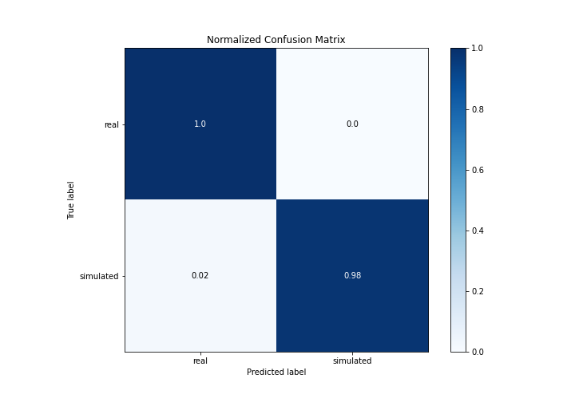

## ROC Curve

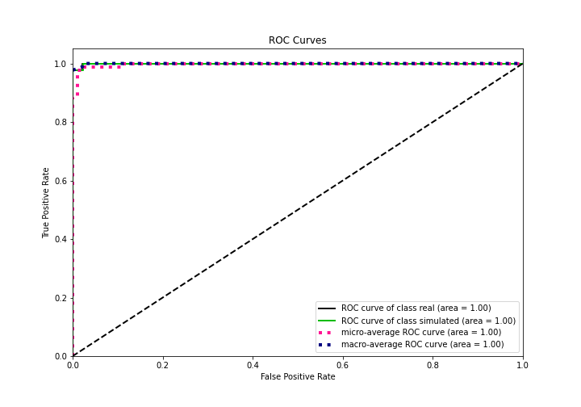

## Kolmogorov-Smirnov Statistic

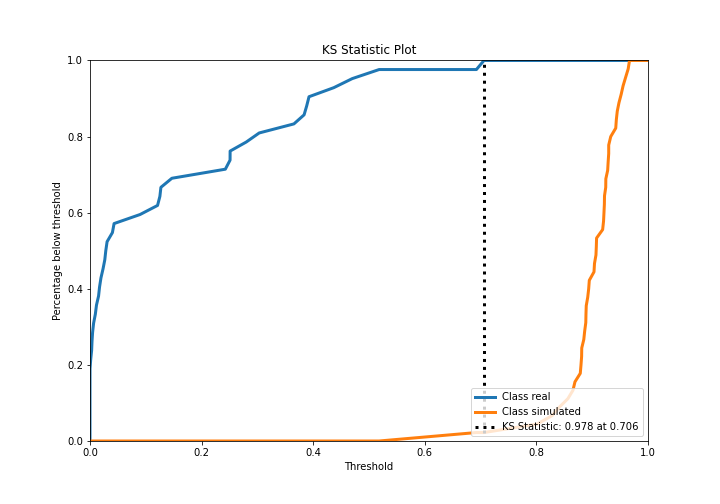

## Precision-Recall Curve

## Calibration Curve

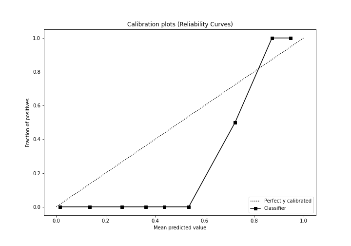

## Cumulative Gains Curve

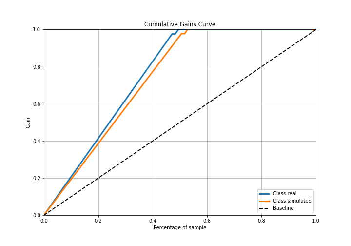

## Lift Curve

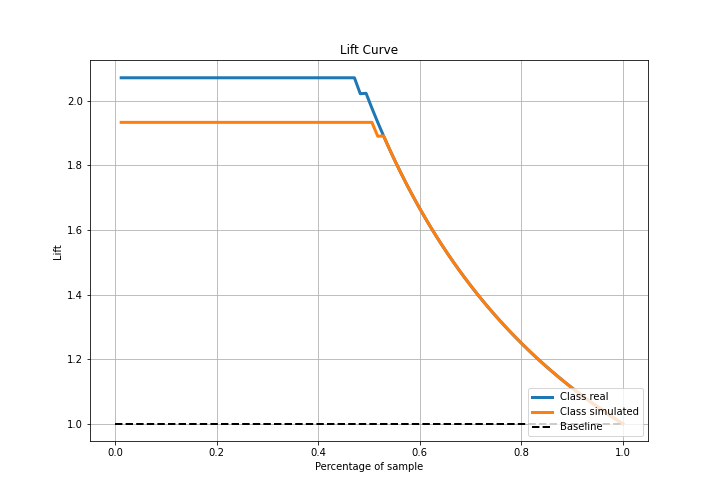

## SHAP Importance
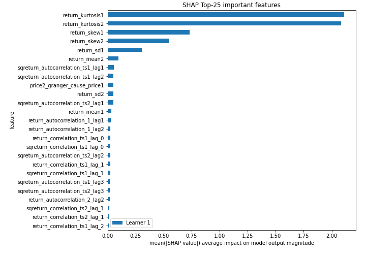

## SHAP Dependence plots

### Dependence (Fold 1)
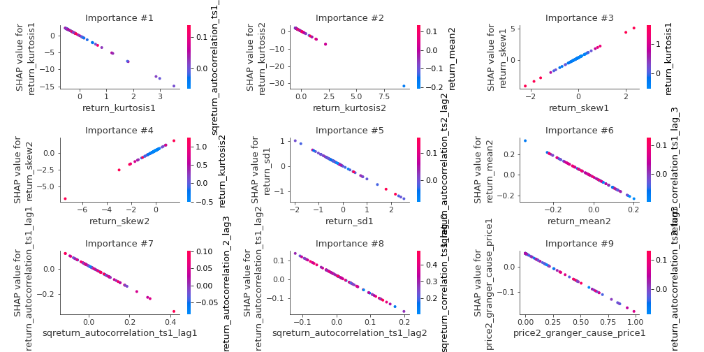

## SHAP Decision plots

### Top-10 Worst decisions for class 0 (Fold 1)
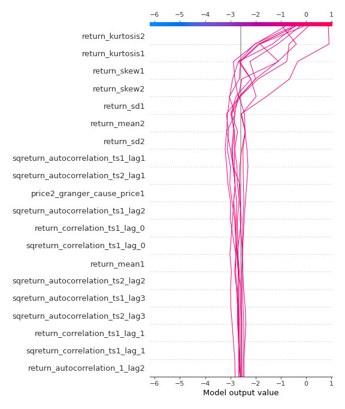
### Top-10 Best decisions for class 0 (Fold 1)
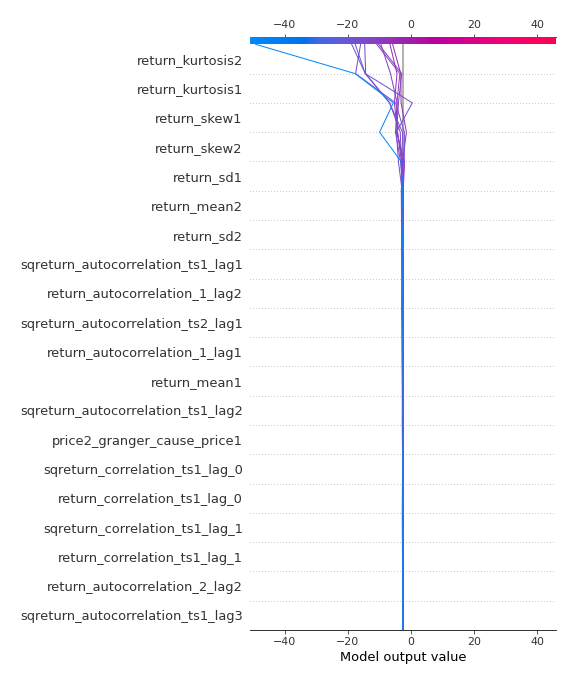
### Top-10 Worst decisions for class 1 (Fold 1)
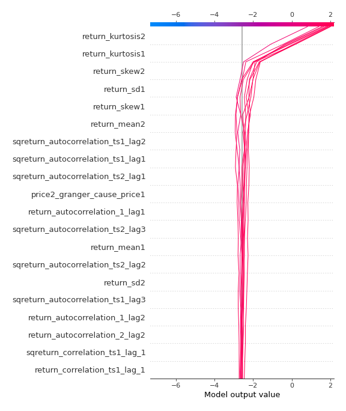
### Top-10 Best decisions for class 1 (Fold 1)
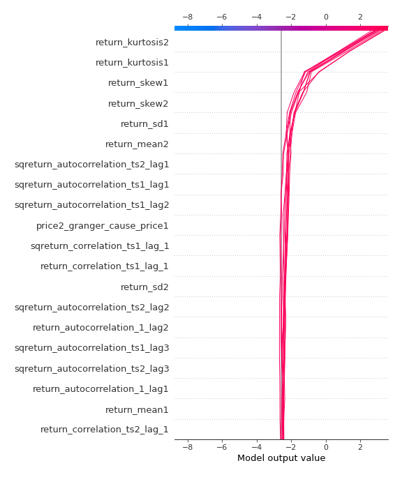

[<< Go back](../README.md)
