# Exploratory Data Analysis

[<< Go back](../README.md)
## Feature : target
- **Feature type** : categorical
- **Missing** : 0.0%
- **Unique** : 2
- **Count** :347
- **Unique** :2
- **Top** :simulated
- **Freq** :178

## Feature : return_mean1
- **Feature type** : continous
- **Missing** : 0.0%
- **Unique** : 347
- **Count** :347.0
- **Mean** :0.03143306204736385
- **Std** :0.10470468430727087
- **Min** :-0.26523419278874943
- **25%th Percentile** : -0.03289744695427041
- **50%th Percentile** : 0.03452913962316782
- **75%th Percentile** : 0.11431765937367824
- **Max** :0.3602793017097547

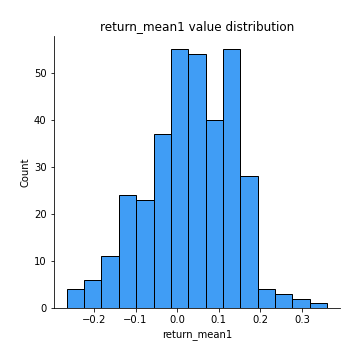
## Feature : return_mean2
- **Feature type** : continous
- **Missing** : 0.0%
- **Unique** : 347
- **Count** :347.0
- **Mean** :-0.013648752899040394
- **Std** :0.12105436281334062
- **Min** :-0.3393917268522109
- **25%th Percentile** : -0.09490081044322769
- **50%th Percentile** : -0.012016785186274973
- **75%th Percentile** : 0.06443998499068812
- **Max** :0.6801605239983173

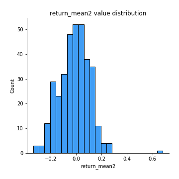
## Feature : return_sd1
- **Feature type** : continous
- **Missing** : 0.0%
- **Unique** : 347
- **Count** :347.0
- **Mean** :1.539359580321372
- **Std** :0.36346015049950536
- **Min** :0.8102430347636637
- **25%th Percentile** : 1.375216100784022
- **50%th Percentile** : 1.447253942466284
- **75%th Percentile** : 1.561085574169844
- **Max** :3.332494027875222

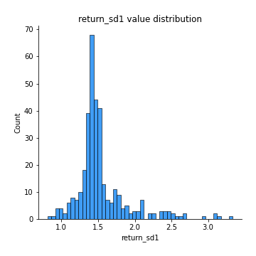
## Feature : return_sd2
- **Feature type** : continous
- **Missing** : 0.0%
- **Unique** : 347
- **Count** :347.0
- **Mean** :1.630505569782023
- **Std** :0.4015271561706693
- **Min** :0.9060171249911689
- **25%th Percentile** : 1.4872065871776718
- **50%th Percentile** : 1.5652166893824382
- **75%th Percentile** : 1.655169738919215
- **Max** :4.59233049161685

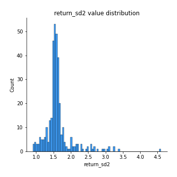
## Feature : return_skew1
- **Feature type** : continous
- **Missing** : 0.0%
- **Unique** : 347
- **Count** :347.0
- **Mean** :-0.16262276978521006
- **Std** :0.7217128880908574
- **Min** :-4.239645236578449
- **25%th Percentile** : -0.29964223374832333
- **50%th Percentile** : -0.07062087436265768
- **75%th Percentile** : 0.08986954181035614
- **Max** :2.351757728252051

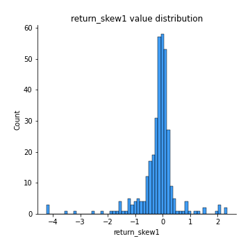
## Feature : return_skew2
- **Feature type** : continous
- **Missing** : 0.0%
- **Unique** : 347
- **Count** :347.0
- **Mean** :-0.2925826530223547
- **Std** :1.065748683175494
- **Min** :-7.3762354994385335
- **25%th Percentile** : -0.3670605176742122
- **50%th Percentile** : -0.08008485909491579
- **75%th Percentile** : 0.08706058614299357
- **Max** :4.1920266082732045

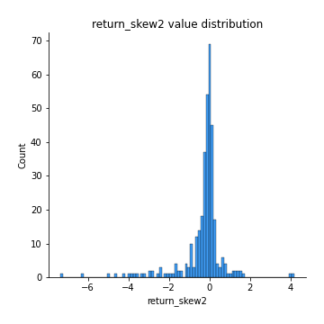
## Feature : return_kurtosis1
- **Feature type** : continous
- **Missing** : 0.0%
- **Unique** : 347
- **Count** :347.0
- **Mean** :2.5846492006246065
- **Std** :5.636682396932414
- **Min** :-0.5485227367285339
- **25%th Percentile** : -0.0886031330574717
- **50%th Percentile** : 0.4954204906332009
- **75%th Percentile** : 2.373444226909248
- **Max** :40.485294874464934

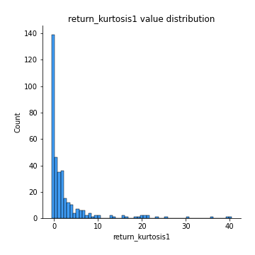
## Feature : return_kurtosis2
- **Feature type** : continous
- **Missing** : 0.0%
- **Unique** : 347
- **Count** :347.0
- **Mean** :4.357389960950172
- **Std** :10.039769212704952
- **Min** :-0.6277993843175547
- **25%th Percentile** : -0.046514885658768934
- **50%th Percentile** : 0.5968007948328369
- **75%th Percentile** : 3.8586921564822534
- **Max** :94.01659180149953

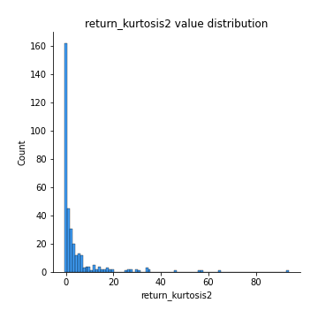
## Feature : return_autocorrelation_1_lag1
- **Feature type** : continous
- **Missing** : 0.0%
- **Unique** : 347
- **Count** :347.0
- **Mean** :-0.001983151428080377
- **Std** :0.06729447637116151
- **Min** :-0.2110198016529991
- **25%th Percentile** : -0.046617435002755406
- **50%th Percentile** : -0.0006243177732292048
- **75%th Percentile** : 0.042084238905702974
- **Max** :0.20132571463207988

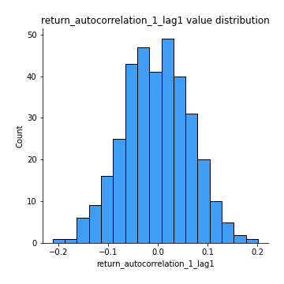
## Feature : return_autocorrelation_1_lag2
- **Feature type** : continous
- **Missing** : 0.0%
- **Unique** : 347
- **Count** :347.0
- **Mean** :0.0027228534368850922
- **Std** :0.06684115257107348
- **Min** :-0.18815240041143846
- **25%th Percentile** : -0.043828330643100835
- **50%th Percentile** : 0.002067576643026531
- **75%th Percentile** : 0.04959557973165342
- **Max** :0.21123611097039302

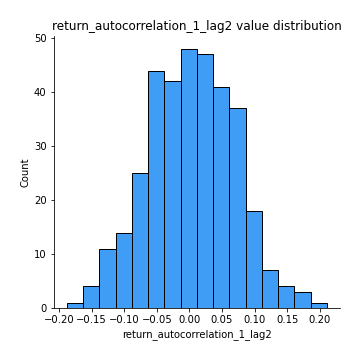
## Feature : return_autocorrelation_1_lag3
- **Feature type** : continous
- **Missing** : 0.0%
- **Unique** : 347
- **Count** :347.0
- **Mean** :0.015355139255402219
- **Std** :0.06251009908303486
- **Min** :-0.1817944619132489
- **25%th Percentile** : -0.02214800070175235
- **50%th Percentile** : 0.018896896398786927
- **75%th Percentile** : 0.052879430191314906
- **Max** :0.17514033413395239

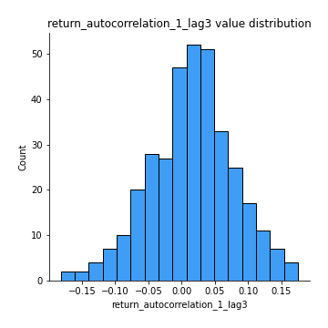
## Feature : return_autocorrelation_2_lag1
- **Feature type** : continous
- **Missing** : 0.0%
- **Unique** : 347
- **Count** :347.0
- **Mean** :0.011072440112547505
- **Std** :0.0677027181810226
- **Min** :-0.21476206695051284
- **25%th Percentile** : -0.03321462210200156
- **50%th Percentile** : 0.01203464190523633
- **75%th Percentile** : 0.058251486539753365
- **Max** :0.2245310988633657

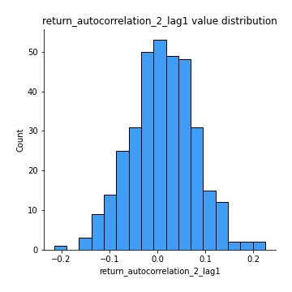
## Feature : return_autocorrelation_2_lag2
- **Feature type** : continous
- **Missing** : 0.0%
- **Unique** : 347
- **Count** :347.0
- **Mean** :0.0032930938304475557
- **Std** :0.07017630606403215
- **Min** :-0.18262428989359827
- **25%th Percentile** : -0.045523277556744485
- **50%th Percentile** : 0.004503901879969208
- **75%th Percentile** : 0.054929789317041094
- **Max** :0.1633768907277314

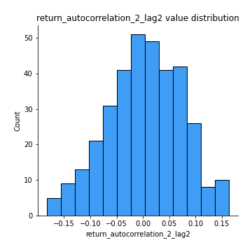
## Feature : return_autocorrelation_2_lag3
- **Feature type** : continous
- **Missing** : 0.0%
- **Unique** : 347
- **Count** :347.0
- **Mean** :0.016192201370891984
- **Std** :0.05983691857388427
- **Min** :-0.11972844498403541
- **25%th Percentile** : -0.02442363765020427
- **50%th Percentile** : 0.01727171760595732
- **75%th Percentile** : 0.058789672807183044
- **Max** :0.20205753622966244

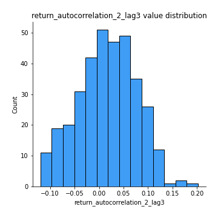
## Feature : return_correlation_ts1_lag_0
- **Feature type** : continous
- **Missing** : 0.0%
- **Unique** : 347
- **Count** :347.0
- **Mean** :0.33228893122442693
- **Std** :0.13389802180913232
- **Min** :-0.10256711281206837
- **25%th Percentile** : 0.2765614094158254
- **50%th Percentile** : 0.34049457320269366
- **75%th Percentile** : 0.3953260213940605
- **Max** :0.9937227277077512

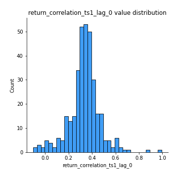
## Feature : return_correlation_ts1_lag_1
- **Feature type** : continous
- **Missing** : 0.0%
- **Unique** : 347
- **Count** :347.0
- **Mean** :0.010359035974323383
- **Std** :0.06485663443667873
- **Min** :-0.18856827637524448
- **25%th Percentile** : -0.03733574161400135
- **50%th Percentile** : 0.008933279316873242
- **75%th Percentile** : 0.05257133631800391
- **Max** :0.20506929672366836

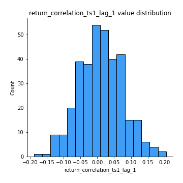
## Feature : return_correlation_ts1_lag_2
- **Feature type** : continous
- **Missing** : 0.0%
- **Unique** : 347
- **Count** :347.0
- **Mean** :0.006987002426876414
- **Std** :0.06555312359479928
- **Min** :-0.14326176299733834
- **25%th Percentile** : -0.034520596525102594
- **50%th Percentile** : 0.0047188732989363125
- **75%th Percentile** : 0.04906665553438383
- **Max** :0.24573067424550885

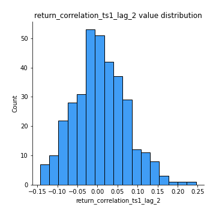
## Feature : return_correlation_ts1_lag_3
- **Feature type** : continous
- **Missing** : 0.0%
- **Unique** : 347
- **Count** :347.0
- **Mean** :0.01568805927982705
- **Std** :0.06778965151894871
- **Min** :-0.21147540839842804
- **25%th Percentile** : -0.03043600242287605
- **50%th Percentile** : 0.0172303456867529
- **75%th Percentile** : 0.05993701336005261
- **Max** :0.23808054096877584

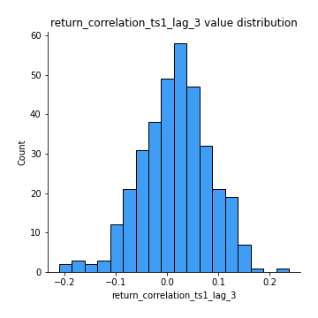
## Feature : return_correlation_ts2_lag_1
- **Feature type** : continous
- **Missing** : 0.0%
- **Unique** : 347
- **Count** :347.0
- **Mean** :0.01418943535153479
- **Std** :0.06857782086924796
- **Min** :-0.1363859619205903
- **25%th Percentile** : -0.032132499338302006
- **50%th Percentile** : 0.008649816317004348
- **75%th Percentile** : 0.06139425316373482
- **Max** :0.3425036902091001

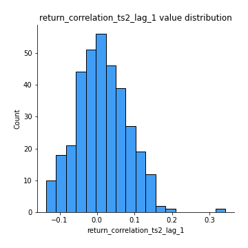
## Feature : return_correlation_ts2_lag_2
- **Feature type** : continous
- **Missing** : 0.0%
- **Unique** : 347
- **Count** :347.0
- **Mean** :0.002980930070262577
- **Std** :0.0667935997281476
- **Min** :-0.18381967289455395
- **25%th Percentile** : -0.04046173734286925
- **50%th Percentile** : 0.003989249794582641
- **75%th Percentile** : 0.04664410729716742
- **Max** :0.17095085417437145

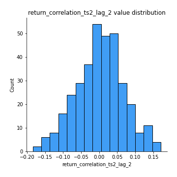
## Feature : return_correlation_ts2_lag_3
- **Feature type** : continous
- **Missing** : 0.0%
- **Unique** : 347
- **Count** :347.0
- **Mean** :0.017279321145000602
- **Std** :0.05769585580218524
- **Min** :-0.16395660834364476
- **25%th Percentile** : -0.02019735245040932
- **50%th Percentile** : 0.015675700851676796
- **75%th Percentile** : 0.05668243199658833
- **Max** :0.14501123761697993

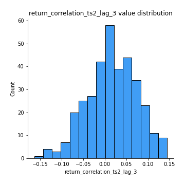
## Feature : sqreturn_autocorrelation_ts1_lag1
- **Feature type** : continous
- **Missing** : 0.0%
- **Unique** : 347
- **Count** :347.0
- **Mean** :0.03263898261794541
- **Std** :0.0831341750201465
- **Min** :-0.1168296083437272
- **25%th Percentile** : -0.018206678497673042
- **50%th Percentile** : 0.01516544588074159
- **75%th Percentile** : 0.07836149513030846
- **Max** :0.4170324090514868

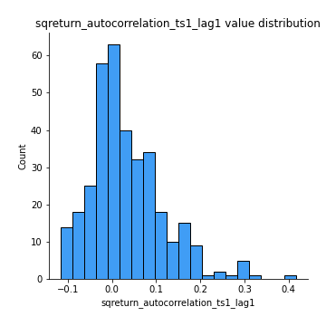
## Feature : sqreturn_autocorrelation_ts1_lag2
- **Feature type** : continous
- **Missing** : 0.0%
- **Unique** : 347
- **Count** :347.0
- **Mean** :0.01928290055646014
- **Std** :0.07382056392814615
- **Min** :-0.14028246502648978
- **25%th Percentile** : -0.02925731631096551
- **50%th Percentile** : 0.006363705846493107
- **75%th Percentile** : 0.06065702934021569
- **Max** :0.32836952056190194

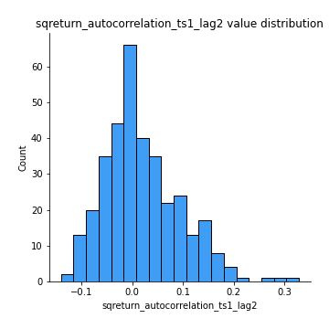
## Feature : sqreturn_autocorrelation_ts1_lag3
- **Feature type** : continous
- **Missing** : 0.0%
- **Unique** : 347
- **Count** :347.0
- **Mean** :0.012623049720412133
- **Std** :0.064443645213864
- **Min** :-0.16327983745132219
- **25%th Percentile** : -0.03004847845605344
- **50%th Percentile** : 0.006235958716423135
- **75%th Percentile** : 0.045312800445266935
- **Max** :0.23856108238097126

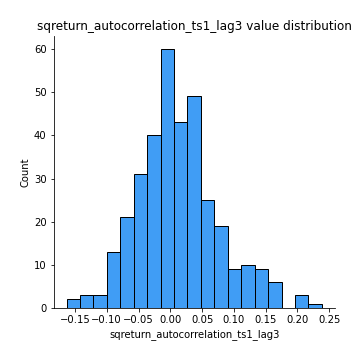
## Feature : sqreturn_autocorrelation_ts2_lag1
- **Feature type** : continous
- **Missing** : 0.0%
- **Unique** : 347
- **Count** :347.0
- **Mean** :0.023097431991245476
- **Std** :0.0771899790364101
- **Min** :-0.1521437457547337
- **25%th Percentile** : -0.022621367478710828
- **50%th Percentile** : 0.011093502016742833
- **75%th Percentile** : 0.05743114080197377
- **Max** :0.36991568023038357

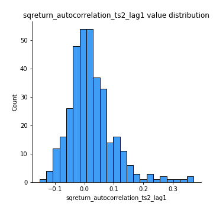
## Feature : sqreturn_autocorrelation_ts2_lag2
- **Feature type** : continous
- **Missing** : 0.0%
- **Unique** : 347
- **Count** :347.0
- **Mean** :0.0113929323697385
- **Std** :0.06078505505922798
- **Min** :-0.15278820246483835
- **25%th Percentile** : -0.025091896266415524
- **50%th Percentile** : 0.003127191381850507
- **75%th Percentile** : 0.03874914468138423
- **Max** :0.28672056150180414

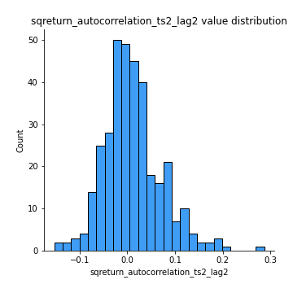
## Feature : sqreturn_autocorrelation_ts2_lag3
- **Feature type** : continous
- **Missing** : 0.0%
- **Unique** : 347
- **Count** :347.0
- **Mean** :0.005214160441652987
- **Std** :0.060303291722422755
- **Min** :-0.13221798996890805
- **25%th Percentile** : -0.031899930553641286
- **50%th Percentile** : -0.001836869546049562
- **75%th Percentile** : 0.037373214677588716
- **Max** :0.231605349758384

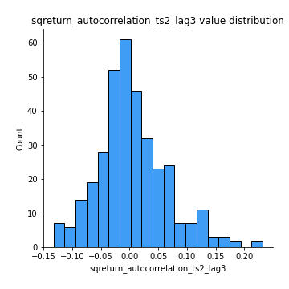
## Feature : sqreturn_correlation_ts1_lag_0
- **Feature type** : continous
- **Missing** : 0.0%
- **Unique** : 347
- **Count** :347.0
- **Mean** :0.33228893122442693
- **Std** :0.13389802180913232
- **Min** :-0.10256711281206837
- **25%th Percentile** : 0.2765614094158254
- **50%th Percentile** : 0.34049457320269366
- **75%th Percentile** : 0.3953260213940605
- **Max** :0.9937227277077512

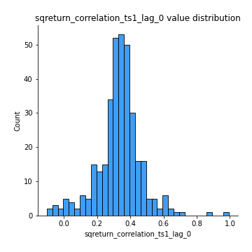
## Feature : sqreturn_correlation_ts1_lag_1
- **Feature type** : continous
- **Missing** : 0.0%
- **Unique** : 347
- **Count** :347.0
- **Mean** :0.010359035974323383
- **Std** :0.06485663443667873
- **Min** :-0.18856827637524448
- **25%th Percentile** : -0.03733574161400135
- **50%th Percentile** : 0.008933279316873242
- **75%th Percentile** : 0.05257133631800391
- **Max** :0.20506929672366836

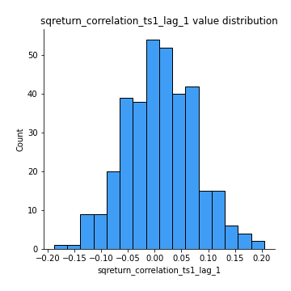
## Feature : sqreturn_correlation_ts1_lag_2
- **Feature type** : continous
- **Missing** : 0.0%
- **Unique** : 347
- **Count** :347.0
- **Mean** :0.006987002426876414
- **Std** :0.06555312359479928
- **Min** :-0.14326176299733834
- **25%th Percentile** : -0.034520596525102594
- **50%th Percentile** : 0.0047188732989363125
- **75%th Percentile** : 0.04906665553438383
- **Max** :0.24573067424550885

## Feature : sqreturn_correlation_ts1_lag_3
- **Feature type** : continous
- **Missing** : 0.0%
- **Unique** : 347
- **Count** :347.0
- **Mean** :0.01568805927982705
- **Std** :0.06778965151894871
- **Min** :-0.21147540839842804
- **25%th Percentile** : -0.03043600242287605
- **50%th Percentile** : 0.0172303456867529
- **75%th Percentile** : 0.05993701336005261
- **Max** :0.23808054096877584

## Feature : sqreturn_correlation_ts2_lag_1
- **Feature type** : continous
- **Missing** : 0.0%
- **Unique** : 347
- **Count** :347.0
- **Mean** :0.01418943535153479
- **Std** :0.06857782086924796
- **Min** :-0.1363859619205903
- **25%th Percentile** : -0.032132499338302006
- **50%th Percentile** : 0.008649816317004348
- **75%th Percentile** : 0.06139425316373482
- **Max** :0.3425036902091001

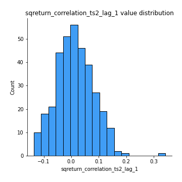
## Feature : sqreturn_correlation_ts2_lag_2
- **Feature type** : continous
- **Missing** : 0.0%
- **Unique** : 347
- **Count** :347.0
- **Mean** :0.002980930070262577
- **Std** :0.0667935997281476
- **Min** :-0.18381967289455395
- **25%th Percentile** : -0.04046173734286925
- **50%th Percentile** : 0.003989249794582641
- **75%th Percentile** : 0.04664410729716742
- **Max** :0.17095085417437145

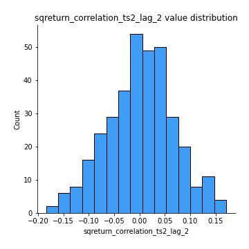
## Feature : sqreturn_correlation_ts2_lag_3
- **Feature type** : continous
- **Missing** : 0.0%
- **Unique** : 347
- **Count** :347.0
- **Mean** :0.017279321145000602
- **Std** :0.05769585580218524
- **Min** :-0.16395660834364476
- **25%th Percentile** : -0.02019735245040932
- **50%th Percentile** : 0.015675700851676796
- **75%th Percentile** : 0.05668243199658833
- **Max** :0.14501123761697993

## Feature : price2_granger_cause_price1
- **Feature type** : continous
- **Missing** : 0.0%
- **Unique** : 347
- **Count** :347.0
- **Mean** :0.25277313773691074
- **Std** :0.2810915299718318
- **Min** :2.4312048970873696e-09
- **25%th Percentile** : 0.019295127324834647
- **50%th Percentile** : 0.1316572284002982
- **75%th Percentile** : 0.42766043227064016
- **Max** :0.9902528379925452

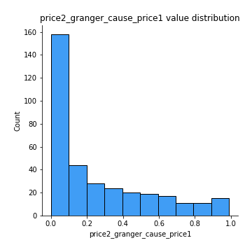
## Feature : price1_granger_cause_price2
- **Feature type** : continous
- **Missing** : 0.0%
- **Unique** : 347
- **Count** :347.0
- **Mean** :0.2784152875054167
- **Std** :0.2913107852165458
- **Min** :1.2012269232170316e-11
- **25%th Percentile** : 0.021636392837773397
- **50%th Percentile** : 0.16712137464977442
- **75%th Percentile** : 0.48597300131914467
- **Max** :0.9871292066441198

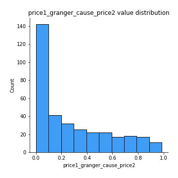

[<< Go back](../README.md)
