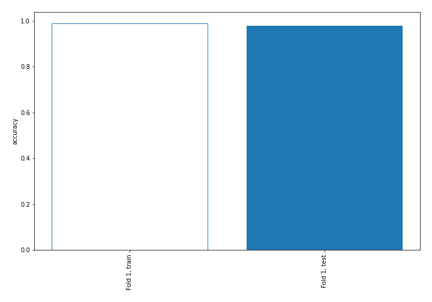
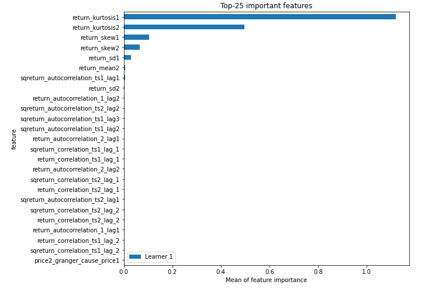
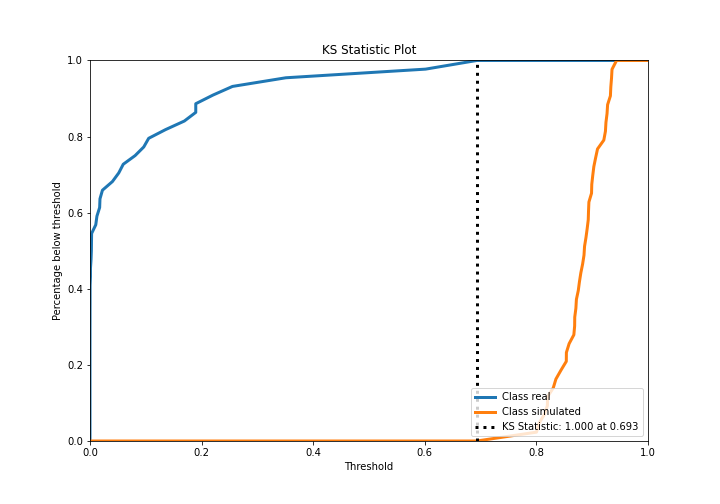
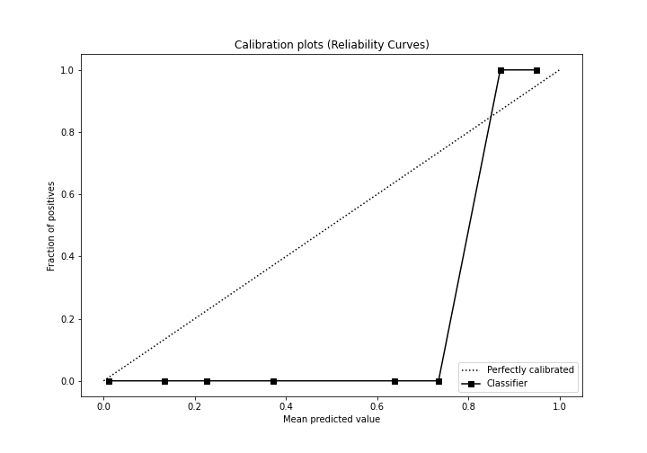
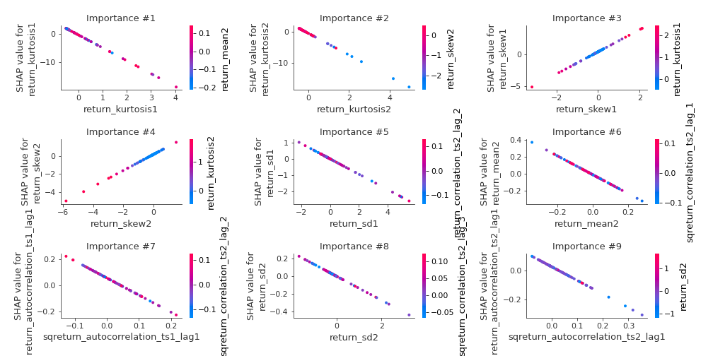
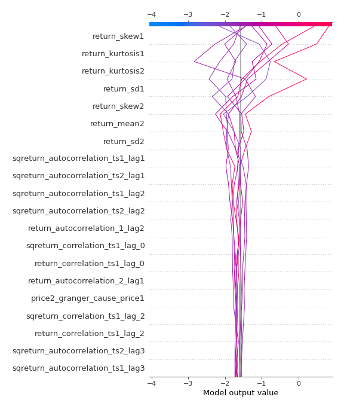
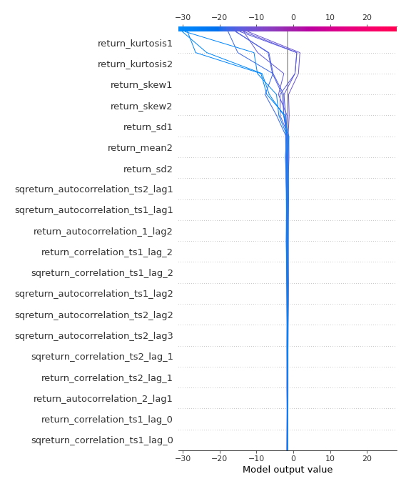
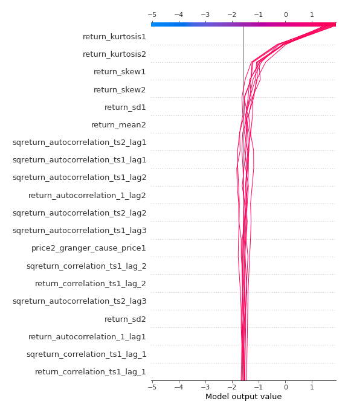
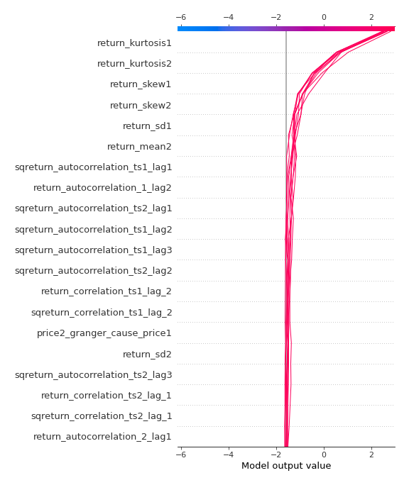

# Summary of 3_Linear

[<< Go back](../README.md)

## Logistic Regression (Linear)
- **n_jobs**: -1
- **explain_level**: 2

## Validation
 - **validation_type**: split
 - **train_ratio**: 0.75
 - **shuffle**: True
 - **stratify**: True

## Optimized metric
accuracy

## Training time

4.2 seconds

## Metric details
|           |    score |     threshold |
|:----------|---------:|--------------:|
| logloss   | 0.112504 | nan           |
| auc       | 1        | nan           |
| f1        | 1        |   0.768458    |
| accuracy  | 1        |   0.768458    |
| precision | 1        |   0.860588    |
| recall    | 1        |   7.66621e-14 |
| mcc       | 1        |   0.768458    |

## Confusion matrix (at threshold=0.768458)
|                      |   Predicted as real |   Predicted as simulated |
|:---------------------|--------------------:|-------------------------:|
| Labeled as real      |                  44 |                        0 |
| Labeled as simulated |                   0 |                       43 |

## Learning curves

## Coefficients
| feature                           |   Learner_1 |
|:----------------------------------|------------:|
| return_skew1                      |  1.7459     |
| return_skew2                      |  0.884709   |
| return_autocorrelation_1_lag2     |  0.636635   |
| return_correlation_ts1_lag_2      |  0.489626   |
| sqreturn_correlation_ts1_lag_2    |  0.489626   |
| return_correlation_ts1_lag_1      |  0.264396   |
| sqreturn_correlation_ts1_lag_1    |  0.264396   |
| return_autocorrelation_2_lag1     |  0.263708   |
| return_autocorrelation_2_lag2     |  0.260556   |
| return_correlation_ts2_lag_1      |  0.24268    |
| sqreturn_correlation_ts2_lag_1    |  0.24268    |
| return_autocorrelation_1_lag1     |  0.236984   |
| sqreturn_correlation_ts2_lag_3    |  0.170769   |
| return_correlation_ts2_lag_3      |  0.170769   |
| return_correlation_ts2_lag_2      |  0.154675   |
| sqreturn_correlation_ts2_lag_2    |  0.154675   |
| return_autocorrelation_2_lag3     |  0.106957   |
| sqreturn_correlation_ts1_lag_3    |  0.0218063  |
| return_correlation_ts1_lag_3      |  0.0218063  |
| return_autocorrelation_1_lag3     |  0.0175751  |
| price1_granger_cause_price2       |  0.00183041 |
| return_mean1                      | -0.0241681  |
| price2_granger_cause_price1       | -0.123627   |
| return_sd2                        | -0.134639   |
| sqreturn_correlation_ts1_lag_0    | -0.226968   |
| return_correlation_ts1_lag_0      | -0.226968   |
| sqreturn_autocorrelation_ts2_lag3 | -0.364764   |
| return_sd1                        | -0.474209   |
| sqreturn_autocorrelation_ts1_lag3 | -0.58158    |
| sqreturn_autocorrelation_ts2_lag2 | -0.706265   |
| sqreturn_autocorrelation_ts1_lag2 | -0.881747   |
| sqreturn_autocorrelation_ts2_lag1 | -0.956194   |
| return_mean2                      | -1.11976    |
| sqreturn_autocorrelation_ts1_lag1 | -1.30069    |
| intercept                         | -1.38081    |
| return_kurtosis2                  | -3.48975    |
| return_kurtosis1                  | -4.57239    |

## Permutation-based Importance

## Confusion Matrix

## Normalized Confusion Matrix

## ROC Curve

## Kolmogorov-Smirnov Statistic

## Precision-Recall Curve

## Calibration Curve

## Cumulative Gains Curve

## Lift Curve

## SHAP Importance

## SHAP Dependence plots

### Dependence (Fold 1)

## SHAP Decision plots

### Top-10 Worst decisions for class 0 (Fold 1)

### Top-10 Best decisions for class 0 (Fold 1)

### Top-10 Worst decisions for class 1 (Fold 1)

### Top-10 Best decisions for class 1 (Fold 1)

[<< Go back](../README.md)
