# Exploratory Data Analysis

[<< Go back](../README.md)
## Feature : target
- **Feature type** : categorical
- **Missing** : 0.0%
- **Unique** : 2
- **Count** :347
- **Unique** :2
- **Top** :real
- **Freq** :175

## Feature : return_mean1
- **Feature type** : continous
- **Missing** : 0.0%
- **Unique** : 347
- **Count** :347.0
- **Mean** :0.03890712159234849
- **Std** :0.10253748152858863
- **Min** :-0.297638839829253
- **25%th Percentile** : -0.024988537278182607
- **50%th Percentile** : 0.04458974141406391
- **75%th Percentile** : 0.11606110197978037
- **Max** :0.3602793017097547

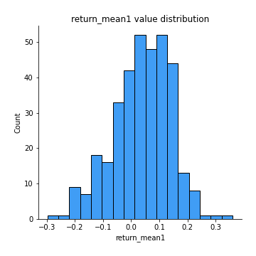
## Feature : return_mean2
- **Feature type** : continous
- **Missing** : 0.0%
- **Unique** : 347
- **Count** :347.0
- **Mean** :-0.014318133458067499
- **Std** :0.12288829306981011
- **Min** :-0.4616191857809312
- **25%th Percentile** : -0.08995460308935077
- **50%th Percentile** : -0.01598050645942487
- **75%th Percentile** : 0.06190407029977131
- **Max** :0.6801605239983173

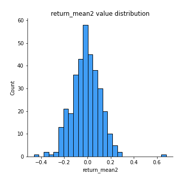
## Feature : return_sd1
- **Feature type** : continous
- **Missing** : 0.0%
- **Unique** : 347
- **Count** :347.0
- **Mean** :1.5439592590623576
- **Std** :0.3721758203097037
- **Min** :0.8102430347636637
- **25%th Percentile** : 1.3749990211070355
- **50%th Percentile** : 1.4581756432932778
- **75%th Percentile** : 1.5645737719990969
- **Max** :3.332494027875222

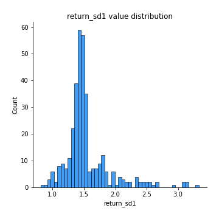
## Feature : return_sd2
- **Feature type** : continous
- **Missing** : 0.0%
- **Unique** : 347
- **Count** :347.0
- **Mean** :1.6464536172642847
- **Std** :0.41816060084300455
- **Min** :0.8198779632289204
- **25%th Percentile** : 1.4800829219361773
- **50%th Percentile** : 1.5724715502074285
- **75%th Percentile** : 1.6692111596007977
- **Max** :4.59233049161685

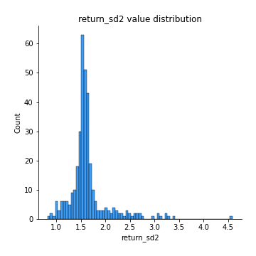
## Feature : return_skew1
- **Feature type** : continous
- **Missing** : 0.0%
- **Unique** : 347
- **Count** :347.0
- **Mean** :-0.19310827117170853
- **Std** :0.7222230360854512
- **Min** :-4.239645236578449
- **25%th Percentile** : -0.35109307106319926
- **50%th Percentile** : -0.10510007186456023
- **75%th Percentile** : 0.08027654876685802
- **Max** :2.3044235031125564

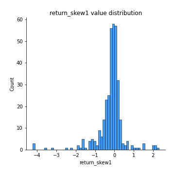
## Feature : return_skew2
- **Feature type** : continous
- **Missing** : 0.0%
- **Unique** : 347
- **Count** :347.0
- **Mean** :-0.3037876371891166
- **Std** :1.0555427664268817
- **Min** :-7.3762354994385335
- **25%th Percentile** : -0.3728005120088018
- **50%th Percentile** : -0.07519698844141612
- **75%th Percentile** : 0.09940495432132404
- **Max** :4.0310261345618

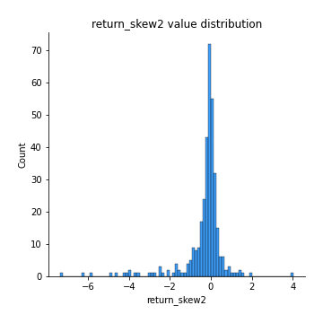
## Feature : return_kurtosis1
- **Feature type** : continous
- **Missing** : 0.0%
- **Unique** : 347
- **Count** :347.0
- **Mean** :2.6732968295683057
- **Std** :5.6042053295512675
- **Min** :-0.5526068183302004
- **25%th Percentile** : -0.05889226452554608
- **50%th Percentile** : 0.5680499175773401
- **75%th Percentile** : 2.627323675085121
- **Max** :40.485294874464934

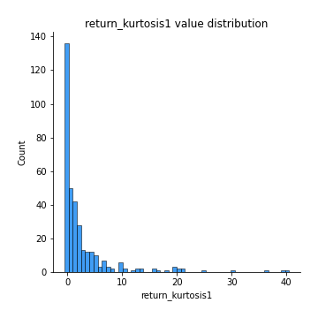
## Feature : return_kurtosis2
- **Feature type** : continous
- **Missing** : 0.0%
- **Unique** : 347
- **Count** :347.0
- **Mean** :4.059006835393974
- **Std** :9.96300285654756
- **Min** :-0.6142589579573632
- **25%th Percentile** : -7.239366532596492e-05
- **50%th Percentile** : 0.7824551175222099
- **75%th Percentile** : 3.3434029241276617
- **Max** :94.01659180149953

## Feature : return_autocorrelation_1_lag1
- **Feature type** : continous
- **Missing** : 0.0%
- **Unique** : 347
- **Count** :347.0
- **Mean** :-0.0008859500291605087
- **Std** :0.0647476597226436
- **Min** :-0.2110198016529991
- **25%th Percentile** : -0.04796943714066296
- **50%th Percentile** : 0.0038823750223166867
- **75%th Percentile** : 0.04517512362590527
- **Max** :0.1734427552476807

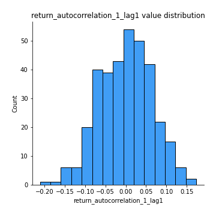
## Feature : return_autocorrelation_1_lag2
- **Feature type** : continous
- **Missing** : 0.0%
- **Unique** : 347
- **Count** :347.0
- **Mean** :-0.003552860204951237
- **Std** :0.06830330781089938
- **Min** :-0.18815240041143846
- **25%th Percentile** : -0.048754980078268464
- **50%th Percentile** : 9.036353244154763e-05
- **75%th Percentile** : 0.046021812898664395
- **Max** :0.21123611097039302

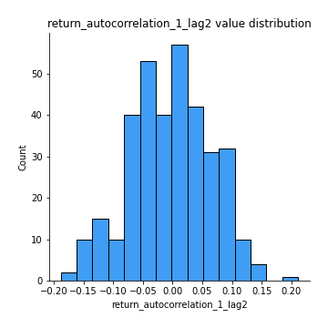
## Feature : return_autocorrelation_1_lag3
- **Feature type** : continous
- **Missing** : 0.0%
- **Unique** : 347
- **Count** :347.0
- **Mean** :0.01254699365650878
- **Std** :0.06211044169031131
- **Min** :-0.1817944619132489
- **25%th Percentile** : -0.029400783707881017
- **50%th Percentile** : 0.016673714214002176
- **75%th Percentile** : 0.056269063519115994
- **Max** :0.17514033413395239

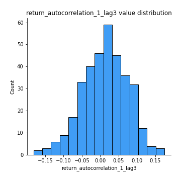
## Feature : return_autocorrelation_2_lag1
- **Feature type** : continous
- **Missing** : 0.0%
- **Unique** : 347
- **Count** :347.0
- **Mean** :0.007404615917134189
- **Std** :0.06679556560432344
- **Min** :-0.17778763204400128
- **25%th Percentile** : -0.0340898996476211
- **50%th Percentile** : 0.009847806611092674
- **75%th Percentile** : 0.05039923613088232
- **Max** :0.21837825051726792

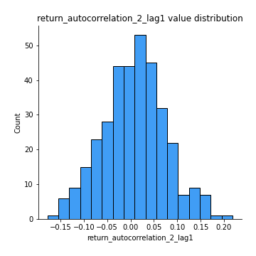
## Feature : return_autocorrelation_2_lag2
- **Feature type** : continous
- **Missing** : 0.0%
- **Unique** : 347
- **Count** :347.0
- **Mean** :0.0018565241314125007
- **Std** :0.06612719585025661
- **Min** :-0.1758721664122366
- **25%th Percentile** : -0.04688618181565811
- **50%th Percentile** : 0.0035949720263559687
- **75%th Percentile** : 0.05003604604777869
- **Max** :0.18304154656905722

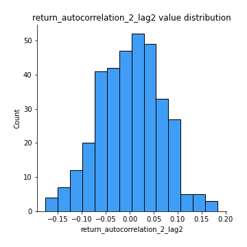
## Feature : return_autocorrelation_2_lag3
- **Feature type** : continous
- **Missing** : 0.0%
- **Unique** : 347
- **Count** :347.0
- **Mean** :0.017349552586978373
- **Std** :0.06198840702523851
- **Min** :-0.18085714621100837
- **25%th Percentile** : -0.02121242816446397
- **50%th Percentile** : 0.019582804841286158
- **75%th Percentile** : 0.058086471266209055
- **Max** :0.20205753622966244

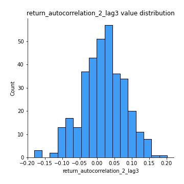
## Feature : return_correlation_ts1_lag_0
- **Feature type** : continous
- **Missing** : 0.0%
- **Unique** : 347
- **Count** :347.0
- **Mean** :0.3280076613600256
- **Std** :0.12540336402623542
- **Min** :-0.10256711281206837
- **25%th Percentile** : 0.27645049601162486
- **50%th Percentile** : 0.3378434761588759
- **75%th Percentile** : 0.3922390071728028
- **Max** :0.7227330027882508

## Feature : return_correlation_ts1_lag_1
- **Feature type** : continous
- **Missing** : 0.0%
- **Unique** : 347
- **Count** :347.0
- **Mean** :0.006848189751960782
- **Std** :0.06310906573739766
- **Min** :-0.1629215524681946
- **25%th Percentile** : -0.03947144471173295
- **50%th Percentile** : 0.009434248409792671
- **75%th Percentile** : 0.05079188768777508
- **Max** :0.1737541577236643

## Feature : return_correlation_ts1_lag_2
- **Feature type** : continous
- **Missing** : 0.0%
- **Unique** : 347
- **Count** :347.0
- **Mean** :0.0034926556950626193
- **Std** :0.06420313707002634
- **Min** :-0.172871336111873
- **25%th Percentile** : -0.03835853003156882
- **50%th Percentile** : 0.0022456175079795205
- **75%th Percentile** : 0.04869338644343016
- **Max** :0.18576127229846542

## Feature : return_correlation_ts1_lag_3
- **Feature type** : continous
- **Missing** : 0.0%
- **Unique** : 347
- **Count** :347.0
- **Mean** :0.010937832388660702
- **Std** :0.06409217669372881
- **Min** :-0.21147540839842804
- **25%th Percentile** : -0.02940139287545037
- **50%th Percentile** : 0.014080394600854513
- **75%th Percentile** : 0.05389189715591676
- **Max** :0.23808054096877584

## Feature : return_correlation_ts2_lag_1
- **Feature type** : continous
- **Missing** : 0.0%
- **Unique** : 347
- **Count** :347.0
- **Mean** :0.012476701294335093
- **Std** :0.0706800284043239
- **Min** :-0.17665751184419612
- **25%th Percentile** : -0.03527071704254067
- **50%th Percentile** : 0.013584503728983819
- **75%th Percentile** : 0.062498549957735135
- **Max** :0.3425036902091001

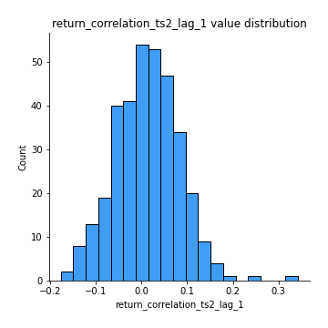
## Feature : return_correlation_ts2_lag_2
- **Feature type** : continous
- **Missing** : 0.0%
- **Unique** : 347
- **Count** :347.0
- **Mean** :0.00490343392139712
- **Std** :0.06686775739659755
- **Min** :-0.2757460186107768
- **25%th Percentile** : -0.03754174505102405
- **50%th Percentile** : 0.006969465309201096
- **75%th Percentile** : 0.05489956158108532
- **Max** :0.1668209648754713

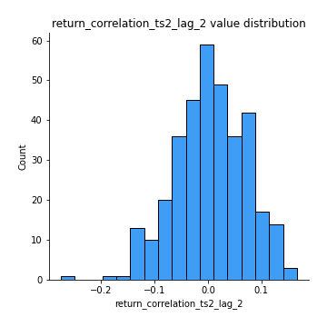
## Feature : return_correlation_ts2_lag_3
- **Feature type** : continous
- **Missing** : 0.0%
- **Unique** : 347
- **Count** :347.0
- **Mean** :0.01728564002155826
- **Std** :0.05791942304353347
- **Min** :-0.12158224719344908
- **25%th Percentile** : -0.0242397914701431
- **50%th Percentile** : 0.019353148520837957
- **75%th Percentile** : 0.05667101168329554
- **Max** :0.18227042221329348

## Feature : sqreturn_autocorrelation_ts1_lag1
- **Feature type** : continous
- **Missing** : 0.0%
- **Unique** : 347
- **Count** :347.0
- **Mean** :0.029474845371663217
- **Std** :0.08345521523239195
- **Min** :-0.15638810916948334
- **25%th Percentile** : -0.028104054509050822
- **50%th Percentile** : 0.017846705355337167
- **75%th Percentile** : 0.07887169318723897
- **Max** :0.4170324090514868

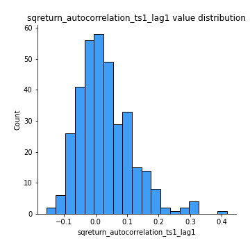
## Feature : sqreturn_autocorrelation_ts1_lag2
- **Feature type** : continous
- **Missing** : 0.0%
- **Unique** : 347
- **Count** :347.0
- **Mean** :0.019106840058525792
- **Std** :0.07126205374009414
- **Min** :-0.1317332951902623
- **25%th Percentile** : -0.030908544907134964
- **50%th Percentile** : 0.006363705846493107
- **75%th Percentile** : 0.05938252470313201
- **Max** :0.29415594530501293

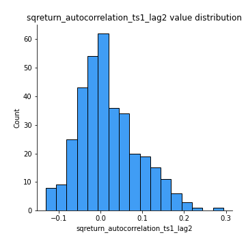
## Feature : sqreturn_autocorrelation_ts1_lag3
- **Feature type** : continous
- **Missing** : 0.0%
- **Unique** : 347
- **Count** :347.0
- **Mean** :0.007117536123582964
- **Std** :0.06511022542868483
- **Min** :-0.134032337911297
- **25%th Percentile** : -0.035946468260971025
- **50%th Percentile** : -0.0020846717599944183
- **75%th Percentile** : 0.03714251921433086
- **Max** :0.36579865351615615

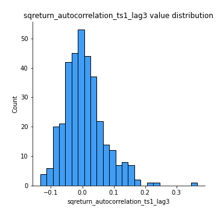
## Feature : sqreturn_autocorrelation_ts2_lag1
- **Feature type** : continous
- **Missing** : 0.0%
- **Unique** : 347
- **Count** :347.0
- **Mean** :0.028641693031633133
- **Std** :0.07497082528165618
- **Min** :-0.15735094959309637
- **25%th Percentile** : -0.020340043012420934
- **50%th Percentile** : 0.01756996895703358
- **75%th Percentile** : 0.06670065987668283
- **Max** :0.3533869018400006

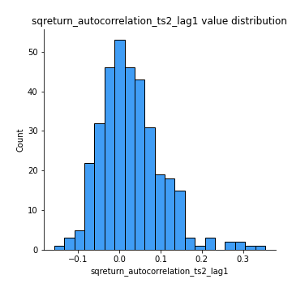
## Feature : sqreturn_autocorrelation_ts2_lag2
- **Feature type** : continous
- **Missing** : 0.0%
- **Unique** : 347
- **Count** :347.0
- **Mean** :0.011448899857030292
- **Std** :0.059656404480067704
- **Min** :-0.12862363418100484
- **25%th Percentile** : -0.02202004727859106
- **50%th Percentile** : 0.004294983025361343
- **75%th Percentile** : 0.04294411074350479
- **Max** :0.2357173664732939

## Feature : sqreturn_autocorrelation_ts2_lag3
- **Feature type** : continous
- **Missing** : 0.0%
- **Unique** : 347
- **Count** :347.0
- **Mean** :0.011992249985399894
- **Std** :0.06477264701954592
- **Min** :-0.1263548244286028
- **25%th Percentile** : -0.032553593853163046
- **50%th Percentile** : -0.0009880869875182146
- **75%th Percentile** : 0.04624515484125964
- **Max** :0.3463122340368414

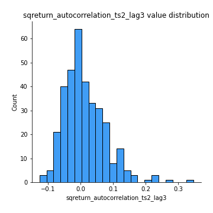
## Feature : sqreturn_correlation_ts1_lag_0
- **Feature type** : continous
- **Missing** : 0.0%
- **Unique** : 347
- **Count** :347.0
- **Mean** :0.3280076613600256
- **Std** :0.12540336402623542
- **Min** :-0.10256711281206837
- **25%th Percentile** : 0.27645049601162486
- **50%th Percentile** : 0.3378434761588759
- **75%th Percentile** : 0.3922390071728028
- **Max** :0.7227330027882508

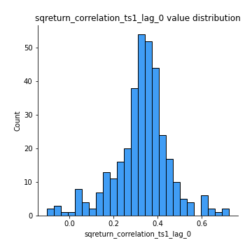
## Feature : sqreturn_correlation_ts1_lag_1
- **Feature type** : continous
- **Missing** : 0.0%
- **Unique** : 347
- **Count** :347.0
- **Mean** :0.006848189751960782
- **Std** :0.06310906573739766
- **Min** :-0.1629215524681946
- **25%th Percentile** : -0.03947144471173295
- **50%th Percentile** : 0.009434248409792671
- **75%th Percentile** : 0.05079188768777508
- **Max** :0.1737541577236643

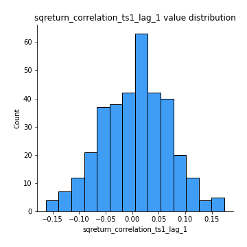
## Feature : sqreturn_correlation_ts1_lag_2
- **Feature type** : continous
- **Missing** : 0.0%
- **Unique** : 347
- **Count** :347.0
- **Mean** :0.0034926556950626193
- **Std** :0.06420313707002634
- **Min** :-0.172871336111873
- **25%th Percentile** : -0.03835853003156882
- **50%th Percentile** : 0.0022456175079795205
- **75%th Percentile** : 0.04869338644343016
- **Max** :0.18576127229846542

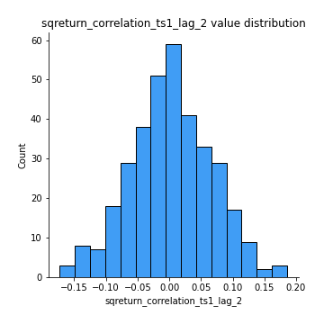
## Feature : sqreturn_correlation_ts1_lag_3
- **Feature type** : continous
- **Missing** : 0.0%
- **Unique** : 347
- **Count** :347.0
- **Mean** :0.010937832388660702
- **Std** :0.06409217669372881
- **Min** :-0.21147540839842804
- **25%th Percentile** : -0.02940139287545037
- **50%th Percentile** : 0.014080394600854513
- **75%th Percentile** : 0.05389189715591676
- **Max** :0.23808054096877584

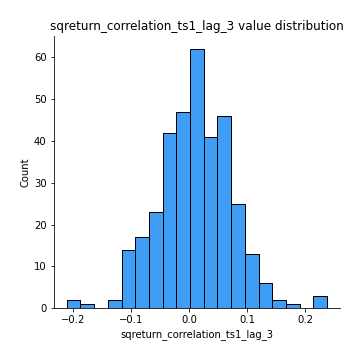
## Feature : sqreturn_correlation_ts2_lag_1
- **Feature type** : continous
- **Missing** : 0.0%
- **Unique** : 347
- **Count** :347.0
- **Mean** :0.012476701294335093
- **Std** :0.0706800284043239
- **Min** :-0.17665751184419612
- **25%th Percentile** : -0.03527071704254067
- **50%th Percentile** : 0.013584503728983819
- **75%th Percentile** : 0.062498549957735135
- **Max** :0.3425036902091001

## Feature : sqreturn_correlation_ts2_lag_2
- **Feature type** : continous
- **Missing** : 0.0%
- **Unique** : 347
- **Count** :347.0
- **Mean** :0.00490343392139712
- **Std** :0.06686775739659755
- **Min** :-0.2757460186107768
- **25%th Percentile** : -0.03754174505102405
- **50%th Percentile** : 0.006969465309201096
- **75%th Percentile** : 0.05489956158108532
- **Max** :0.1668209648754713

## Feature : sqreturn_correlation_ts2_lag_3
- **Feature type** : continous
- **Missing** : 0.0%
- **Unique** : 347
- **Count** :347.0
- **Mean** :0.01728564002155826
- **Std** :0.05791942304353347
- **Min** :-0.12158224719344908
- **25%th Percentile** : -0.0242397914701431
- **50%th Percentile** : 0.019353148520837957
- **75%th Percentile** : 0.05667101168329554
- **Max** :0.18227042221329348

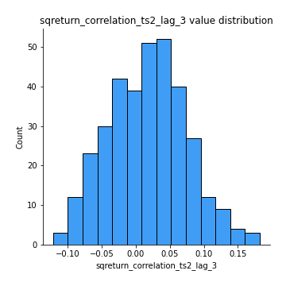
## Feature : price2_granger_cause_price1
- **Feature type** : continous
- **Missing** : 0.0%
- **Unique** : 347
- **Count** :347.0
- **Mean** :0.26909154194998963
- **Std** :0.2966785465739068
- **Min** :2.4312048970873696e-09
- **25%th Percentile** : 0.024365268508042062
- **50%th Percentile** : 0.1558422908279174
- **75%th Percentile** : 0.4247442463713301
- **Max** :0.981665068493865

## Feature : price1_granger_cause_price2
- **Feature type** : continous
- **Missing** : 0.0%
- **Unique** : 347
- **Count** :347.0
- **Mean** :0.2768284669877605
- **Std** :0.30127016388865785
- **Min** :1.2012269232170316e-11
- **25%th Percentile** : 0.016705089013506987
- **50%th Percentile** : 0.1494408803445349
- **75%th Percentile** : 0.4714466627150742
- **Max** :0.9871292066441198

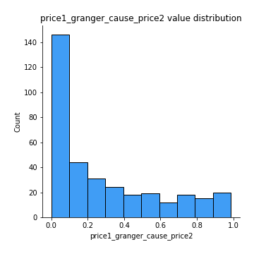

[<< Go back](../README.md)
