# Summary of 3_Linear

[<< Go back](../README.md)

## Logistic Regression (Linear)
- **n_jobs**: -1
- **explain_level**: 2

## Validation
 - **validation_type**: split
 - **train_ratio**: 0.75
 - **shuffle**: True
 - **stratify**: True

## Optimized metric
accuracy

## Training time

4.2 seconds

## Metric details
|           |    score |     threshold |
|:----------|---------:|--------------:|
| logloss   | 0.107402 | nan           |
| auc       | 1        | nan           |
| f1        | 1        |   0.679513    |
| accuracy  | 1        |   0.679513    |
| precision | 1        |   0.679513    |
| recall    | 1        |   1.61815e-14 |
| mcc       | 1        |   0.679513    |

## Confusion matrix (at threshold=0.679513)
|                      |   Predicted as real |   Predicted as simulated |
|:---------------------|--------------------:|-------------------------:|
| Labeled as real      |                  46 |                        0 |
| Labeled as simulated |                   0 |                       41 |

## Learning curves
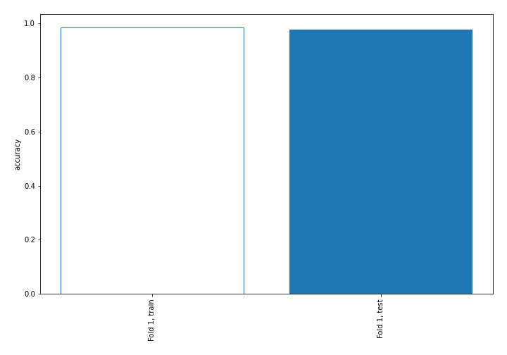

## Coefficients
| feature                           |   Learner_1 |
|:----------------------------------|------------:|
| return_skew1                      |  1.96999    |
| return_skew2                      |  1.23325    |
| return_autocorrelation_1_lag2     |  0.610169   |
| sqreturn_correlation_ts1_lag_2    |  0.48819    |
| return_correlation_ts1_lag_2      |  0.48819    |
| return_autocorrelation_2_lag2     |  0.395191   |
| return_correlation_ts1_lag_1      |  0.315708   |
| sqreturn_correlation_ts1_lag_1    |  0.315708   |
| return_correlation_ts2_lag_2      |  0.225379   |
| sqreturn_correlation_ts2_lag_2    |  0.225379   |
| return_autocorrelation_1_lag1     |  0.22254    |
| return_autocorrelation_1_lag3     |  0.192999   |
| return_autocorrelation_2_lag1     |  0.161186   |
| return_correlation_ts2_lag_1      |  0.0985623  |
| sqreturn_correlation_ts2_lag_1    |  0.0985623  |
| return_mean1                      |  0.0764006  |
| return_correlation_ts1_lag_3      |  0.0555469  |
| sqreturn_correlation_ts1_lag_3    |  0.0555469  |
| sqreturn_correlation_ts2_lag_3    |  0.0203559  |
| return_correlation_ts2_lag_3      |  0.0203559  |
| return_sd2                        |  0.0172706  |
| price2_granger_cause_price1       |  0.00214592 |
| return_autocorrelation_2_lag3     | -0.0904423  |
| return_correlation_ts1_lag_0      | -0.241006   |
| sqreturn_correlation_ts1_lag_0    | -0.241006   |
| sqreturn_autocorrelation_ts1_lag3 | -0.36026    |
| sqreturn_autocorrelation_ts2_lag3 | -0.39686    |
| return_sd1                        | -0.416981   |
| sqreturn_autocorrelation_ts1_lag2 | -0.435073   |
| price1_granger_cause_price2       | -0.477177   |
| sqreturn_autocorrelation_ts2_lag2 | -0.652345   |
| return_mean2                      | -0.707255   |
| sqreturn_autocorrelation_ts2_lag1 | -0.726706   |
| sqreturn_autocorrelation_ts1_lag1 | -0.835236   |
| intercept                         | -1.59591    |
| return_kurtosis2                  | -3.4498     |
| return_kurtosis1                  | -4.13337    |

## Permutation-based Importance
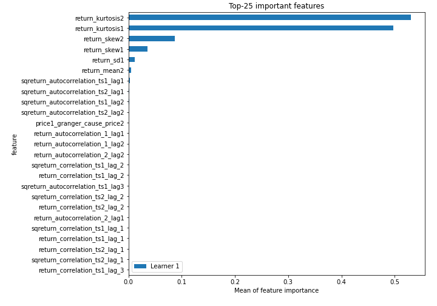
## Confusion Matrix

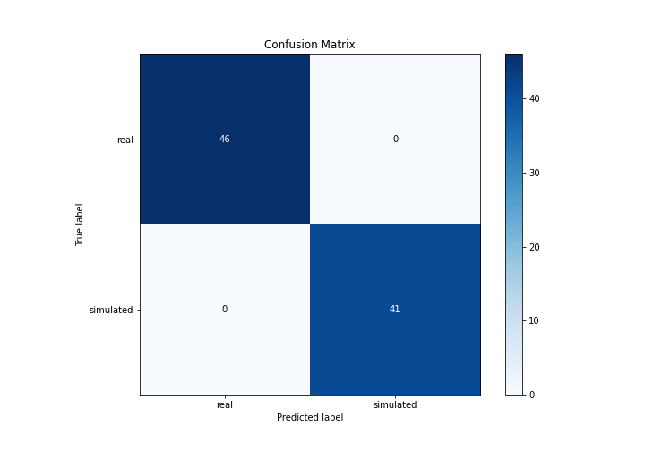

## Normalized Confusion Matrix

## ROC Curve

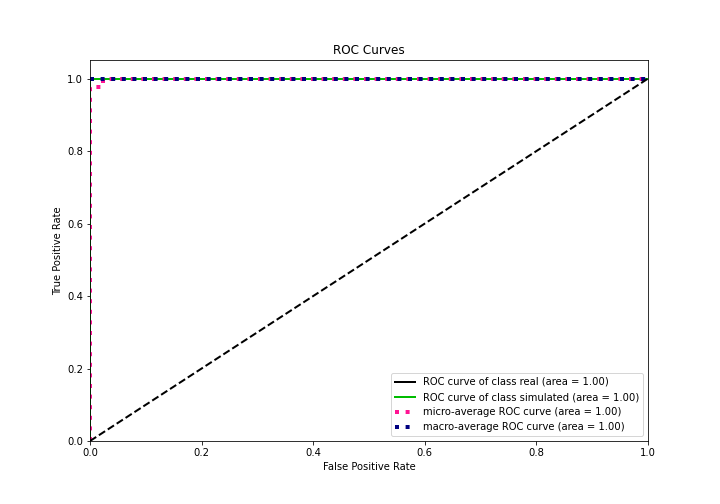

## Kolmogorov-Smirnov Statistic

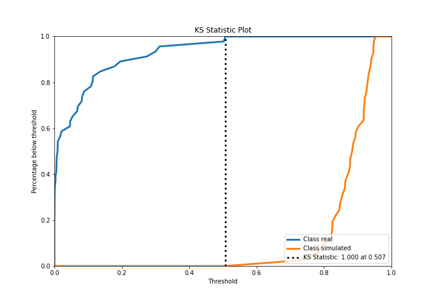

## Precision-Recall Curve

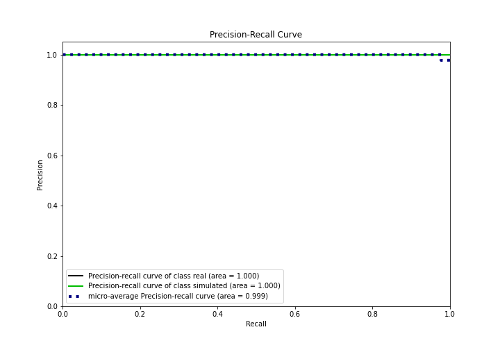

## Calibration Curve

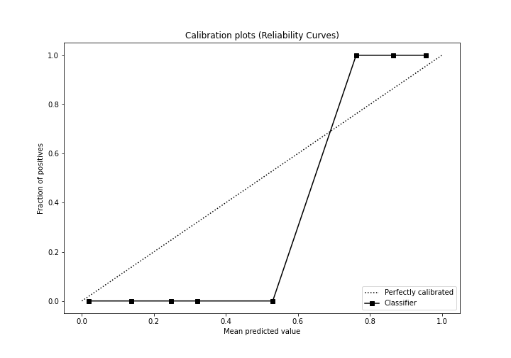

## Cumulative Gains Curve

## Lift Curve

## SHAP Importance
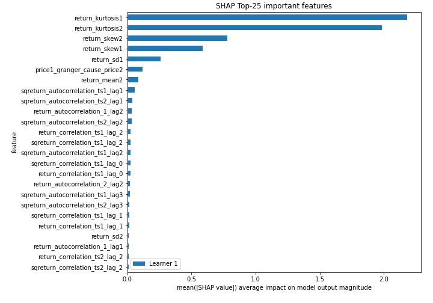

## SHAP Dependence plots

### Dependence (Fold 1)
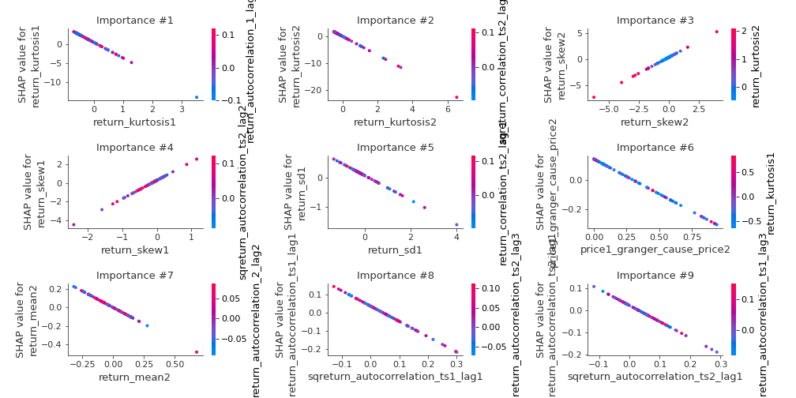

## SHAP Decision plots

### Top-10 Worst decisions for class 0 (Fold 1)
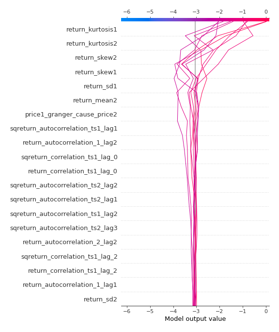
### Top-10 Best decisions for class 0 (Fold 1)
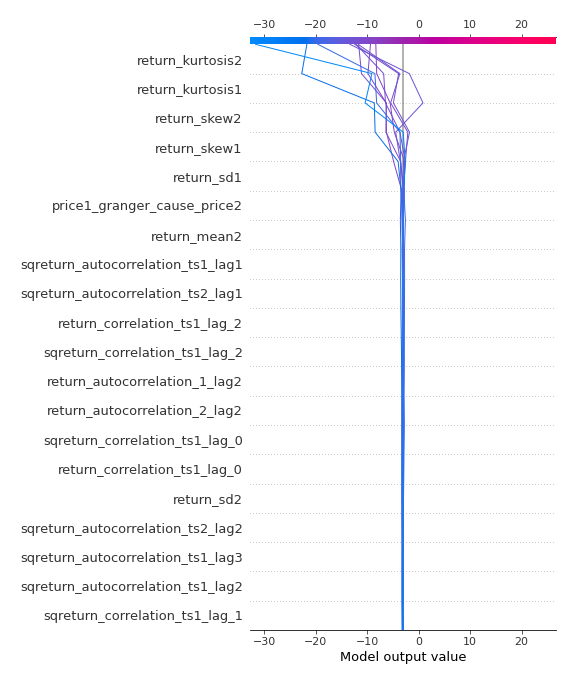
### Top-10 Worst decisions for class 1 (Fold 1)
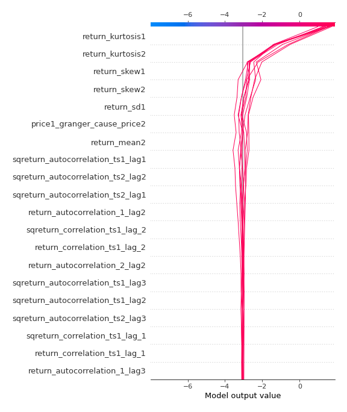
### Top-10 Best decisions for class 1 (Fold 1)
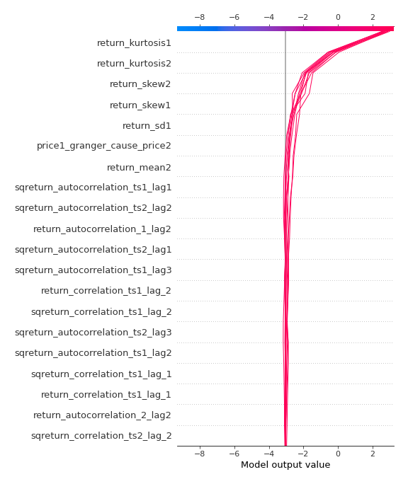

[<< Go back](../README.md)
