# Exploratory Data Analysis

[<< Go back](../README.md)
## Feature : target
- **Feature type** : categorical
- **Missing** : 0.0%
- **Unique** : 2
- **Count** :347
- **Unique** :2
- **Top** :real
- **Freq** :183

## Feature : return_mean1
- **Feature type** : continous
- **Missing** : 0.0%
- **Unique** : 347
- **Count** :347.0
- **Mean** :0.038382639391439
- **Std** :0.10945407224248331
- **Min** :-0.297638839829253
- **25%th Percentile** : -0.030194200384430762
- **50%th Percentile** : 0.0442313762926204
- **75%th Percentile** : 0.12177923975134654
- **Max** :0.3602793017097547

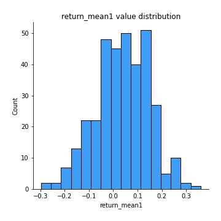
## Feature : return_mean2
- **Feature type** : continous
- **Missing** : 0.0%
- **Unique** : 347
- **Count** :347.0
- **Mean** :-0.006199143608562747
- **Std** :0.12793580313925876
- **Min** :-0.5214966421881327
- **25%th Percentile** : -0.09016939209535971
- **50%th Percentile** : -0.0029583569093686226
- **75%th Percentile** : 0.07895609039322984
- **Max** :0.6801605239983173

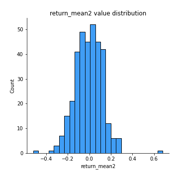
## Feature : return_sd1
- **Feature type** : continous
- **Missing** : 0.0%
- **Unique** : 347
- **Count** :347.0
- **Mean** :1.5512845732249223
- **Std** :0.37277241118377274
- **Min** :0.8733078831717243
- **25%th Percentile** : 1.3886159072336437
- **50%th Percentile** : 1.4653494442291832
- **75%th Percentile** : 1.5758536760488098
- **Max** :3.332494027875222

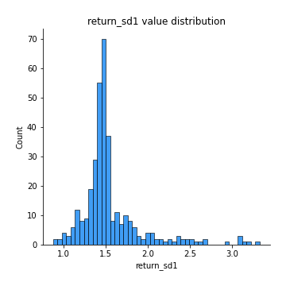
## Feature : return_sd2
- **Feature type** : continous
- **Missing** : 0.0%
- **Unique** : 347
- **Count** :347.0
- **Mean** :1.6499394831255711
- **Std** :0.4334855719032861
- **Min** :0.8198779632289204
- **25%th Percentile** : 1.4776895888694654
- **50%th Percentile** : 1.575605548585402
- **75%th Percentile** : 1.667419300384399
- **Max** :4.59233049161685

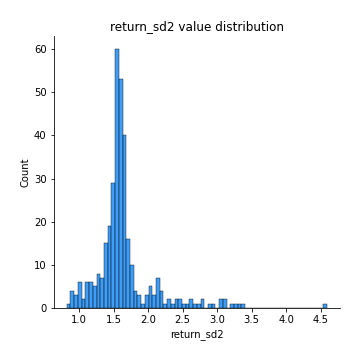
## Feature : return_skew1
- **Feature type** : continous
- **Missing** : 0.0%
- **Unique** : 347
- **Count** :347.0
- **Mean** :-0.11887558389613176
- **Std** :0.5733099079153307
- **Min** :-2.5068500114696386
- **25%th Percentile** : -0.3292255709530833
- **50%th Percentile** : -0.060693095817904774
- **75%th Percentile** : 0.1018408436626366
- **Max** :2.351757728252051

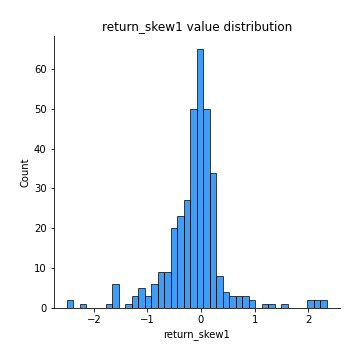
## Feature : return_skew2
- **Feature type** : continous
- **Missing** : 0.0%
- **Unique** : 347
- **Count** :347.0
- **Mean** :-0.276398750904764
- **Std** :1.0274425204276172
- **Min** :-7.3762354994385335
- **25%th Percentile** : -0.39532210765236386
- **50%th Percentile** : -0.06321003630245386
- **75%th Percentile** : 0.08658123849377675
- **Max** :4.1920266082732045

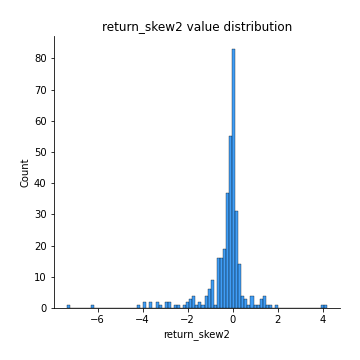
## Feature : return_kurtosis1
- **Feature type** : continous
- **Missing** : 0.0%
- **Unique** : 347
- **Count** :347.0
- **Mean** :2.2883857248725783
- **Std** :4.0630589360061045
- **Min** :-0.6001218675079447
- **25%th Percentile** : 0.0017060374744297668
- **50%th Percentile** : 0.7679472126931488
- **75%th Percentile** : 2.624353558208778
- **Max** :23.612665658846073

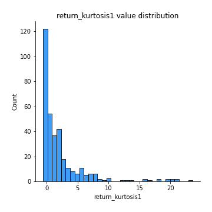
## Feature : return_kurtosis2
- **Feature type** : continous
- **Missing** : 0.0%
- **Unique** : 347
- **Count** :347.0
- **Mean** :4.222791468059112
- **Std** :9.434012425452842
- **Min** :-0.5976106300680248
- **25%th Percentile** : -0.020158368728837583
- **50%th Percentile** : 0.9966328054964189
- **75%th Percentile** : 3.6557789302663313
- **Max** :94.01659180149953

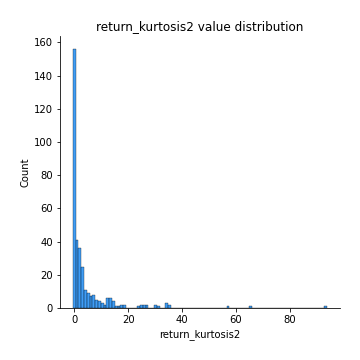
## Feature : return_autocorrelation_1_lag1
- **Feature type** : continous
- **Missing** : 0.0%
- **Unique** : 347
- **Count** :347.0
- **Mean** :-0.003980430315903211
- **Std** :0.06630823755792906
- **Min** :-0.2110198016529991
- **25%th Percentile** : -0.05156426420026254
- **50%th Percentile** : -0.006155312161085196
- **75%th Percentile** : 0.04201034913061403
- **Max** :0.20132571463207988

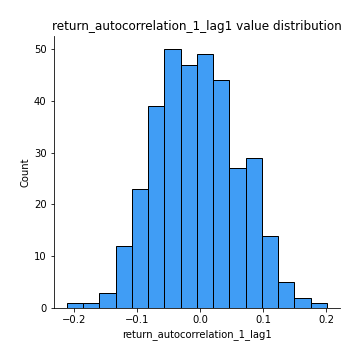
## Feature : return_autocorrelation_1_lag2
- **Feature type** : continous
- **Missing** : 0.0%
- **Unique** : 347
- **Count** :347.0
- **Mean** :0.0003668276893501347
- **Std** :0.06873836698389205
- **Min** :-0.18815240041143846
- **25%th Percentile** : -0.045813237594805406
- **50%th Percentile** : 0.0015095014394105263
- **75%th Percentile** : 0.047059758966083144
- **Max** :0.21123611097039302

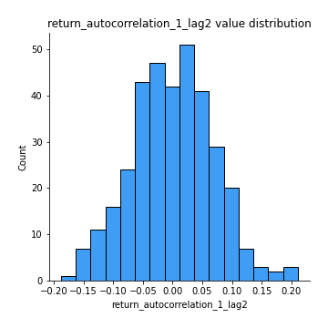
## Feature : return_autocorrelation_1_lag3
- **Feature type** : continous
- **Missing** : 0.0%
- **Unique** : 347
- **Count** :347.0
- **Mean** :0.015766493071600066
- **Std** :0.06383262802763849
- **Min** :-0.1817944619132489
- **25%th Percentile** : -0.023847594893702466
- **50%th Percentile** : 0.017358975149030818
- **75%th Percentile** : 0.05896767314610036
- **Max** :0.22738352648167545

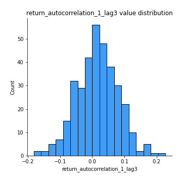
## Feature : return_autocorrelation_2_lag1
- **Feature type** : continous
- **Missing** : 0.0%
- **Unique** : 347
- **Count** :347.0
- **Mean** :0.011292730207566942
- **Std** :0.06752485145525328
- **Min** :-0.17778763204400128
- **25%th Percentile** : -0.034002724114124264
- **50%th Percentile** : 0.011646825117058477
- **75%th Percentile** : 0.05787355963743003
- **Max** :0.21380416986961773

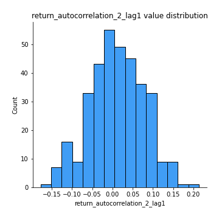
## Feature : return_autocorrelation_2_lag2
- **Feature type** : continous
- **Missing** : 0.0%
- **Unique** : 347
- **Count** :347.0
- **Mean** :0.0019970943513989065
- **Std** :0.06525935265768457
- **Min** :-0.16605020590117126
- **25%th Percentile** : -0.04158298626210112
- **50%th Percentile** : 0.004891891277022189
- **75%th Percentile** : 0.05159816087062121
- **Max** :0.1633768907277314

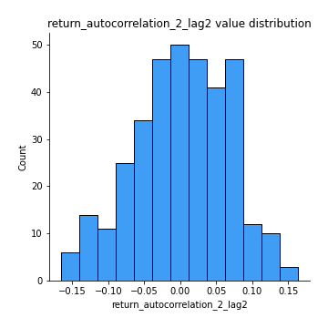
## Feature : return_autocorrelation_2_lag3
- **Feature type** : continous
- **Missing** : 0.0%
- **Unique** : 347
- **Count** :347.0
- **Mean** :0.015386338201372494
- **Std** :0.06317628668725071
- **Min** :-0.1794902936808312
- **25%th Percentile** : -0.02619610896545968
- **50%th Percentile** : 0.014728689473186039
- **75%th Percentile** : 0.05747849930828761
- **Max** :0.20205753622966244

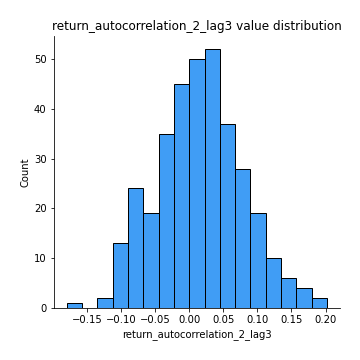
## Feature : return_correlation_ts1_lag_0
- **Feature type** : continous
- **Missing** : 0.0%
- **Unique** : 347
- **Count** :347.0
- **Mean** :0.3404646894657346
- **Std** :0.13221826788396857
- **Min** :-0.10256711281206837
- **25%th Percentile** : 0.28093770492937586
- **50%th Percentile** : 0.35217384989177974
- **75%th Percentile** : 0.4082888143941996
- **Max** :0.9937227277077512

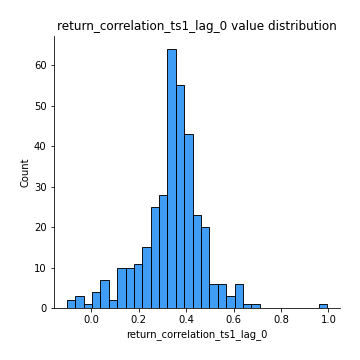
## Feature : return_correlation_ts1_lag_1
- **Feature type** : continous
- **Missing** : 0.0%
- **Unique** : 347
- **Count** :347.0
- **Mean** :0.00833225693081899
- **Std** :0.064895170207635
- **Min** :-0.18619436757832708
- **25%th Percentile** : -0.040423161545688216
- **50%th Percentile** : 0.009329391470907394
- **75%th Percentile** : 0.050443390660798657
- **Max** :0.17981645605055674

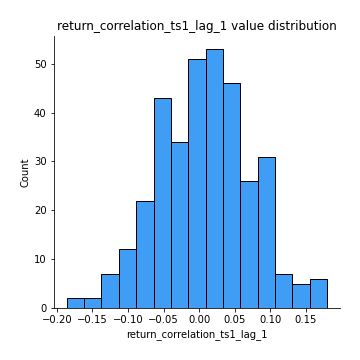
## Feature : return_correlation_ts1_lag_2
- **Feature type** : continous
- **Missing** : 0.0%
- **Unique** : 347
- **Count** :347.0
- **Mean** :0.008402236169963972
- **Std** :0.06662686676793972
- **Min** :-0.16038742223567365
- **25%th Percentile** : -0.0355439723186337
- **50%th Percentile** : 0.004170125249849598
- **75%th Percentile** : 0.05451629654983281
- **Max** :0.19255599047164756

## Feature : return_correlation_ts1_lag_3
- **Feature type** : continous
- **Missing** : 0.0%
- **Unique** : 347
- **Count** :347.0
- **Mean** :0.01786886047593013
- **Std** :0.06775706497607425
- **Min** :-0.21147540839842804
- **25%th Percentile** : -0.027045491819941793
- **50%th Percentile** : 0.02007902616571971
- **75%th Percentile** : 0.05810512663153619
- **Max** :0.23808054096877584

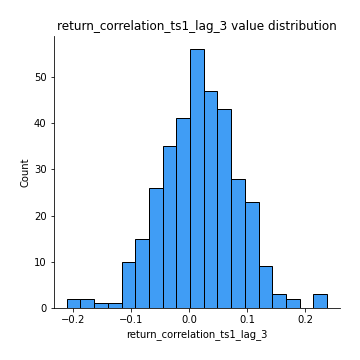
## Feature : return_correlation_ts2_lag_1
- **Feature type** : continous
- **Missing** : 0.0%
- **Unique** : 347
- **Count** :347.0
- **Mean** :0.010973529884090677
- **Std** :0.06929235450503061
- **Min** :-0.18061051920564153
- **25%th Percentile** : -0.0362449994586347
- **50%th Percentile** : 0.012682951687801763
- **75%th Percentile** : 0.05698796920373403
- **Max** :0.23783974915796094

## Feature : return_correlation_ts2_lag_2
- **Feature type** : continous
- **Missing** : 0.0%
- **Unique** : 347
- **Count** :347.0
- **Mean** :0.002205479216648153
- **Std** :0.06392974894784549
- **Min** :-0.2757460186107768
- **25%th Percentile** : -0.03384522905737762
- **50%th Percentile** : 0.003886520561515649
- **75%th Percentile** : 0.041118220576350936
- **Max** :0.17684819232931914

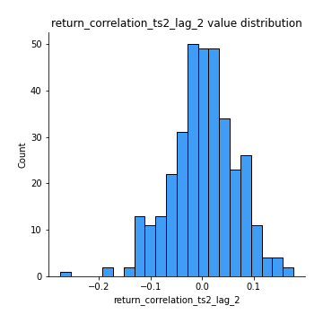
## Feature : return_correlation_ts2_lag_3
- **Feature type** : continous
- **Missing** : 0.0%
- **Unique** : 347
- **Count** :347.0
- **Mean** :0.016963584896483933
- **Std** :0.06219648724176641
- **Min** :-0.17697863431182184
- **25%th Percentile** : -0.025588773548745794
- **50%th Percentile** : 0.019381192822872307
- **75%th Percentile** : 0.06106093877247379
- **Max** :0.18227042221329348

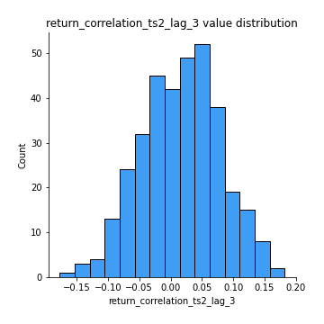
## Feature : sqreturn_autocorrelation_ts1_lag1
- **Feature type** : continous
- **Missing** : 0.0%
- **Unique** : 347
- **Count** :347.0
- **Mean** :0.040280939709311875
- **Std** :0.08625789960687141
- **Min** :-0.12801135018007043
- **25%th Percentile** : -0.019883464382136177
- **50%th Percentile** : 0.02373495074254076
- **75%th Percentile** : 0.09052469983512651
- **Max** :0.4170324090514868

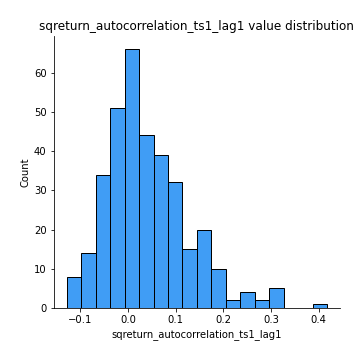
## Feature : sqreturn_autocorrelation_ts1_lag2
- **Feature type** : continous
- **Missing** : 0.0%
- **Unique** : 347
- **Count** :347.0
- **Mean** :0.022883015325417505
- **Std** :0.07029324620276312
- **Min** :-0.14675900986064983
- **25%th Percentile** : -0.026160375382684738
- **50%th Percentile** : 0.012066956645035964
- **75%th Percentile** : 0.058808312191136206
- **Max** :0.32836952056190194

## Feature : sqreturn_autocorrelation_ts1_lag3
- **Feature type** : continous
- **Missing** : 0.0%
- **Unique** : 347
- **Count** :347.0
- **Mean** :0.014095604445787613
- **Std** :0.06345344173931386
- **Min** :-0.16906759982370298
- **25%th Percentile** : -0.025945473252663553
- **50%th Percentile** : 0.007353003405796185
- **75%th Percentile** : 0.05289983458129733
- **Max** :0.23856108238097126

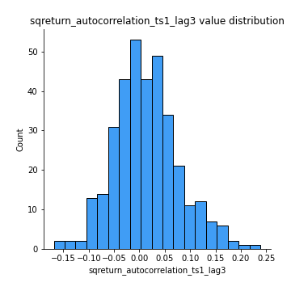
## Feature : sqreturn_autocorrelation_ts2_lag1
- **Feature type** : continous
- **Missing** : 0.0%
- **Unique** : 347
- **Count** :347.0
- **Mean** :0.02955428116334518
- **Std** :0.06962448642031822
- **Min** :-0.15541849337883937
- **25%th Percentile** : -0.0167685879105758
- **50%th Percentile** : 0.01979264457050937
- **75%th Percentile** : 0.06365972831736891
- **Max** :0.3459234668044924

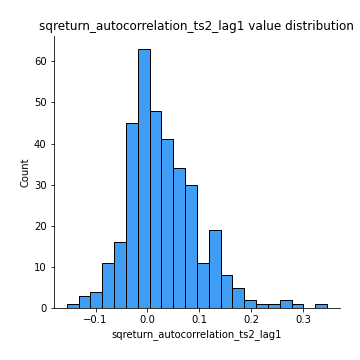
## Feature : sqreturn_autocorrelation_ts2_lag2
- **Feature type** : continous
- **Missing** : 0.0%
- **Unique** : 347
- **Count** :347.0
- **Mean** :0.011122218944784067
- **Std** :0.06309813284301428
- **Min** :-0.16101759069974383
- **25%th Percentile** : -0.026590741577617448
- **50%th Percentile** : 0.0023656530487693108
- **75%th Percentile** : 0.04400120530047538
- **Max** :0.25057436061622956

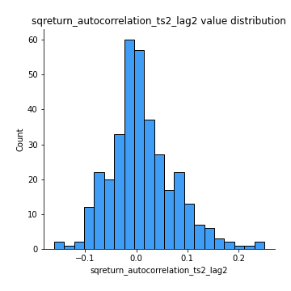
## Feature : sqreturn_autocorrelation_ts2_lag3
- **Feature type** : continous
- **Missing** : 0.0%
- **Unique** : 347
- **Count** :347.0
- **Mean** :0.011150330596182565
- **Std** :0.0639513202974723
- **Min** :-0.1409748995889729
- **25%th Percentile** : -0.028135473519429938
- **50%th Percentile** : -0.0015748611770392018
- **75%th Percentile** : 0.04161618836880322
- **Max** :0.3463122340368414

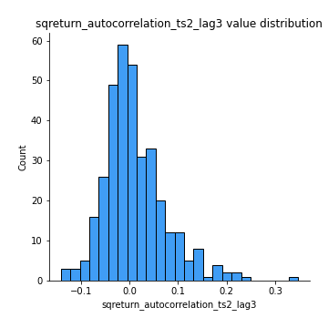
## Feature : sqreturn_correlation_ts1_lag_0
- **Feature type** : continous
- **Missing** : 0.0%
- **Unique** : 347
- **Count** :347.0
- **Mean** :0.3404646894657346
- **Std** :0.13221826788396857
- **Min** :-0.10256711281206837
- **25%th Percentile** : 0.28093770492937586
- **50%th Percentile** : 0.35217384989177974
- **75%th Percentile** : 0.4082888143941996
- **Max** :0.9937227277077512

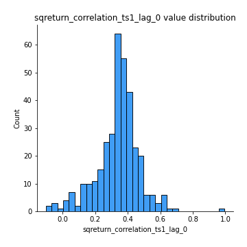
## Feature : sqreturn_correlation_ts1_lag_1
- **Feature type** : continous
- **Missing** : 0.0%
- **Unique** : 347
- **Count** :347.0
- **Mean** :0.00833225693081899
- **Std** :0.064895170207635
- **Min** :-0.18619436757832708
- **25%th Percentile** : -0.040423161545688216
- **50%th Percentile** : 0.009329391470907394
- **75%th Percentile** : 0.050443390660798657
- **Max** :0.17981645605055674

## Feature : sqreturn_correlation_ts1_lag_2
- **Feature type** : continous
- **Missing** : 0.0%
- **Unique** : 347
- **Count** :347.0
- **Mean** :0.008402236169963972
- **Std** :0.06662686676793972
- **Min** :-0.16038742223567365
- **25%th Percentile** : -0.0355439723186337
- **50%th Percentile** : 0.004170125249849598
- **75%th Percentile** : 0.05451629654983281
- **Max** :0.19255599047164756

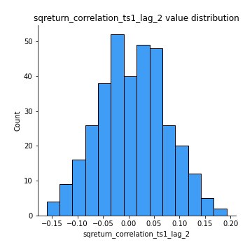
## Feature : sqreturn_correlation_ts1_lag_3
- **Feature type** : continous
- **Missing** : 0.0%
- **Unique** : 347
- **Count** :347.0
- **Mean** :0.01786886047593013
- **Std** :0.06775706497607425
- **Min** :-0.21147540839842804
- **25%th Percentile** : -0.027045491819941793
- **50%th Percentile** : 0.02007902616571971
- **75%th Percentile** : 0.05810512663153619
- **Max** :0.23808054096877584

## Feature : sqreturn_correlation_ts2_lag_1
- **Feature type** : continous
- **Missing** : 0.0%
- **Unique** : 347
- **Count** :347.0
- **Mean** :0.010973529884090677
- **Std** :0.06929235450503061
- **Min** :-0.18061051920564153
- **25%th Percentile** : -0.0362449994586347
- **50%th Percentile** : 0.012682951687801763
- **75%th Percentile** : 0.05698796920373403
- **Max** :0.23783974915796094

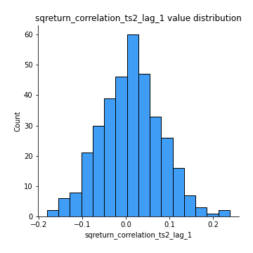
## Feature : sqreturn_correlation_ts2_lag_2
- **Feature type** : continous
- **Missing** : 0.0%
- **Unique** : 347
- **Count** :347.0
- **Mean** :0.002205479216648153
- **Std** :0.06392974894784549
- **Min** :-0.2757460186107768
- **25%th Percentile** : -0.03384522905737762
- **50%th Percentile** : 0.003886520561515649
- **75%th Percentile** : 0.041118220576350936
- **Max** :0.17684819232931914

## Feature : sqreturn_correlation_ts2_lag_3
- **Feature type** : continous
- **Missing** : 0.0%
- **Unique** : 347
- **Count** :347.0
- **Mean** :0.016963584896483933
- **Std** :0.06219648724176641
- **Min** :-0.17697863431182184
- **25%th Percentile** : -0.025588773548745794
- **50%th Percentile** : 0.019381192822872307
- **75%th Percentile** : 0.06106093877247379
- **Max** :0.18227042221329348

## Feature : price2_granger_cause_price1
- **Feature type** : continous
- **Missing** : 0.0%
- **Unique** : 347
- **Count** :347.0
- **Mean** :0.2815202949329851
- **Std** :0.30366811437568353
- **Min** :1.880168918368224e-08
- **25%th Percentile** : 0.02532727024763187
- **50%th Percentile** : 0.1558422908279174
- **75%th Percentile** : 0.4987485244765502
- **Max** :0.998791257058095

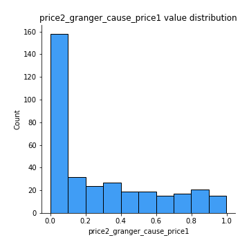
## Feature : price1_granger_cause_price2
- **Feature type** : continous
- **Missing** : 0.0%
- **Unique** : 347
- **Count** :347.0
- **Mean** :0.27407029802111066
- **Std** :0.2907710088956938
- **Min** :1.4216065703087939e-06
- **25%th Percentile** : 0.023728994193517608
- **50%th Percentile** : 0.1639796602305013
- **75%th Percentile** : 0.4612029738945872
- **Max** :0.9944316407986923

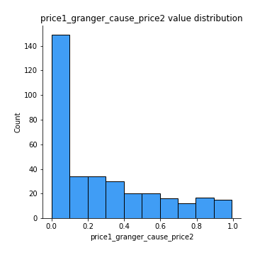

[<< Go back](../README.md)
