# Exploratory Data Analysis

[<< Go back](../README.md)
## Feature : target
- **Feature type** : categorical
- **Missing** : 0.0%
- **Unique** : 2
- **Count** :347
- **Unique** :2
- **Top** :simulated
- **Freq** :176

## Feature : return_mean1
- **Feature type** : continous
- **Missing** : 0.0%
- **Unique** : 347
- **Count** :347.0
- **Mean** :0.031096311274336767
- **Std** :0.10578963728454749
- **Min** :-0.3492782716231954
- **25%th Percentile** : -0.03353842165983407
- **50%th Percentile** : 0.03948606411387452
- **75%th Percentile** : 0.10846809582638059
- **Max** :0.3092704759865523

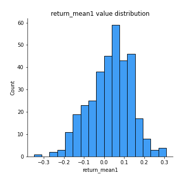
## Feature : return_mean2
- **Feature type** : continous
- **Missing** : 0.0%
- **Unique** : 347
- **Count** :347.0
- **Mean** :-0.011001335681998053
- **Std** :0.12703073311869212
- **Min** :-0.45321724239472094
- **25%th Percentile** : -0.09607525783930061
- **50%th Percentile** : -0.010368858627839131
- **75%th Percentile** : 0.07450013475800077
- **Max** :0.6801605239983173

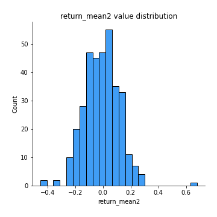
## Feature : return_sd1
- **Feature type** : continous
- **Missing** : 0.0%
- **Unique** : 347
- **Count** :347.0
- **Mean** :1.5509897652585924
- **Std** :0.36315172545711205
- **Min** :0.8102430347636637
- **25%th Percentile** : 1.3992070043341944
- **50%th Percentile** : 1.4623448113586779
- **75%th Percentile** : 1.5816241644264766
- **Max** :3.181425034216533

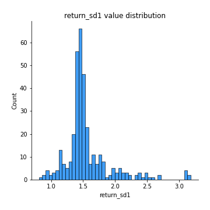
## Feature : return_sd2
- **Feature type** : continous
- **Missing** : 0.0%
- **Unique** : 347
- **Count** :347.0
- **Mean** :1.6287609357765007
- **Std** :0.38359430362148483
- **Min** :0.8198779632289204
- **25%th Percentile** : 1.4947228248117792
- **50%th Percentile** : 1.5739964490355112
- **75%th Percentile** : 1.6704957486537997
- **Max** :4.59233049161685

## Feature : return_skew1
- **Feature type** : continous
- **Missing** : 0.0%
- **Unique** : 347
- **Count** :347.0
- **Mean** :-0.1922488135873371
- **Std** :0.7032077626414998
- **Min** :-4.239645236578449
- **25%th Percentile** : -0.3662644202774442
- **50%th Percentile** : -0.06755034337006796
- **75%th Percentile** : 0.08332125090245392
- **Max** :2.351757728252051

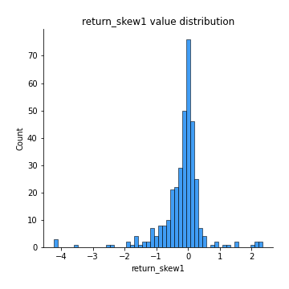
## Feature : return_skew2
- **Feature type** : continous
- **Missing** : 0.0%
- **Unique** : 347
- **Count** :347.0
- **Mean** :-0.22796252458016183
- **Std** :0.9811621649923148
- **Min** :-6.262899561987459
- **25%th Percentile** : -0.3173244450391665
- **50%th Percentile** : -0.04208824049747261
- **75%th Percentile** : 0.12085602932917305
- **Max** :4.1920266082732045

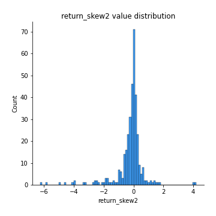
## Feature : return_kurtosis1
- **Feature type** : continous
- **Missing** : 0.0%
- **Unique** : 347
- **Count** :347.0
- **Mean** :2.5861692888250953
- **Std** :5.44688979444188
- **Min** :-0.7069345837565502
- **25%th Percentile** : -0.04371344283343159
- **50%th Percentile** : 0.5266385579192416
- **75%th Percentile** : 2.6990337880253565
- **Max** :40.485294874464934

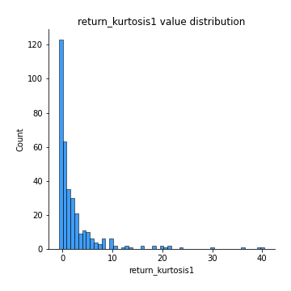
## Feature : return_kurtosis2
- **Feature type** : continous
- **Missing** : 0.0%
- **Unique** : 347
- **Count** :347.0
- **Mean** :3.738225863719401
- **Std** :8.296307546995132
- **Min** :-0.6330773406474077
- **25%th Percentile** : -0.07108206589950394
- **50%th Percentile** : 0.5240221342921272
- **75%th Percentile** : 3.3451525378866567
- **Max** :64.99818629655663

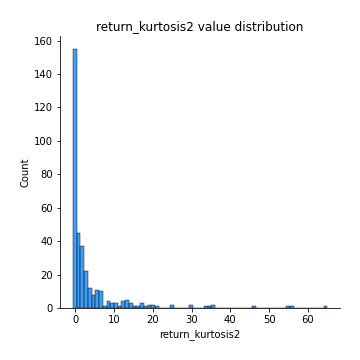
## Feature : return_autocorrelation_1_lag1
- **Feature type** : continous
- **Missing** : 0.0%
- **Unique** : 347
- **Count** :347.0
- **Mean** :0.0018265699933152013
- **Std** :0.06777285918564824
- **Min** :-0.2110198016529991
- **25%th Percentile** : -0.04380018856888828
- **50%th Percentile** : 0.0027867633689262483
- **75%th Percentile** : 0.04363550828426136
- **Max** :0.20132571463207988

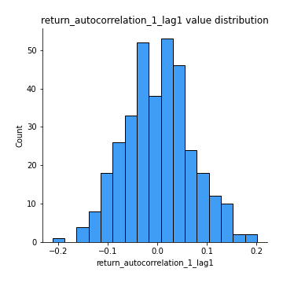
## Feature : return_autocorrelation_1_lag2
- **Feature type** : continous
- **Missing** : 0.0%
- **Unique** : 347
- **Count** :347.0
- **Mean** :-0.003089725108266918
- **Std** :0.0686265106937118
- **Min** :-0.1573520854620592
- **25%th Percentile** : -0.05103054355796987
- **50%th Percentile** : -0.004828227763522399
- **75%th Percentile** : 0.04527227065361242
- **Max** :0.2187028811432064

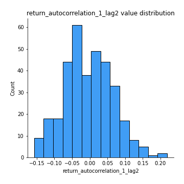
## Feature : return_autocorrelation_1_lag3
- **Feature type** : continous
- **Missing** : 0.0%
- **Unique** : 347
- **Count** :347.0
- **Mean** :0.017662510188322707
- **Std** :0.0633224651325075
- **Min** :-0.1654833157463618
- **25%th Percentile** : -0.024900232133958592
- **50%th Percentile** : 0.019880954734940712
- **75%th Percentile** : 0.061547678438795134
- **Max** :0.17514033413395239

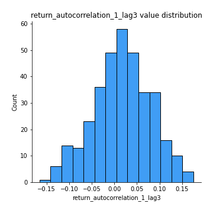
## Feature : return_autocorrelation_2_lag1
- **Feature type** : continous
- **Missing** : 0.0%
- **Unique** : 347
- **Count** :347.0
- **Mean** :0.005918702970672463
- **Std** :0.07043905194793966
- **Min** :-0.2364404317158175
- **25%th Percentile** : -0.03700893922302298
- **50%th Percentile** : 0.005786182197902849
- **75%th Percentile** : 0.052173270259802534
- **Max** :0.22431183843133004

## Feature : return_autocorrelation_2_lag2
- **Feature type** : continous
- **Missing** : 0.0%
- **Unique** : 347
- **Count** :347.0
- **Mean** :0.003793298066031407
- **Std** :0.06962085824301091
- **Min** :-0.1758721664122366
- **25%th Percentile** : -0.04462208422156882
- **50%th Percentile** : 0.0020578097902031233
- **75%th Percentile** : 0.05193412753931369
- **Max** :0.21886619281126282

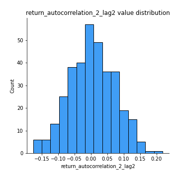
## Feature : return_autocorrelation_2_lag3
- **Feature type** : continous
- **Missing** : 0.0%
- **Unique** : 347
- **Count** :347.0
- **Mean** :0.01580886647052523
- **Std** :0.06178146313408529
- **Min** :-0.1794902936808312
- **25%th Percentile** : -0.02487588585893309
- **50%th Percentile** : 0.016254973733904367
- **75%th Percentile** : 0.05647523832437985
- **Max** :0.20205753622966244

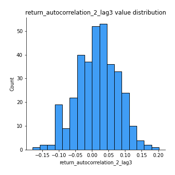
## Feature : return_correlation_ts1_lag_0
- **Feature type** : continous
- **Missing** : 0.0%
- **Unique** : 347
- **Count** :347.0
- **Mean** :0.3295244489994097
- **Std** :0.1328671070238276
- **Min** :-0.07366870340906873
- **25%th Percentile** : 0.2769719445877026
- **50%th Percentile** : 0.3356142774552462
- **75%th Percentile** : 0.3896268511174972
- **Max** :0.9937227277077512

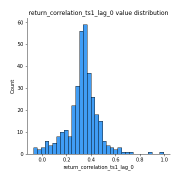
## Feature : return_correlation_ts1_lag_1
- **Feature type** : continous
- **Missing** : 0.0%
- **Unique** : 347
- **Count** :347.0
- **Mean** :0.007902978595752293
- **Std** :0.06748610152132359
- **Min** :-0.18856827637524448
- **25%th Percentile** : -0.041685489811680534
- **50%th Percentile** : 0.0075221280243619
- **75%th Percentile** : 0.0537707999189719
- **Max** :0.2376318943025859

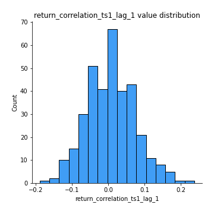
## Feature : return_correlation_ts1_lag_2
- **Feature type** : continous
- **Missing** : 0.0%
- **Unique** : 347
- **Count** :347.0
- **Mean** :0.004854961951087827
- **Std** :0.06753531878283073
- **Min** :-0.172871336111873
- **25%th Percentile** : -0.038132793935613064
- **50%th Percentile** : 0.003892095911325179
- **75%th Percentile** : 0.05115363241041078
- **Max** :0.19762079663381538

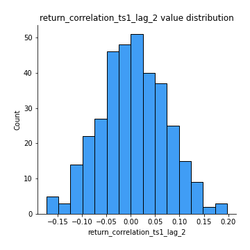
## Feature : return_correlation_ts1_lag_3
- **Feature type** : continous
- **Missing** : 0.0%
- **Unique** : 347
- **Count** :347.0
- **Mean** :0.013726252895546808
- **Std** :0.06797511797243246
- **Min** :-0.18059033867783728
- **25%th Percentile** : -0.03127051717546416
- **50%th Percentile** : 0.018215128694919206
- **75%th Percentile** : 0.05774411501627197
- **Max** :0.23808054096877584

## Feature : return_correlation_ts2_lag_1
- **Feature type** : continous
- **Missing** : 0.0%
- **Unique** : 347
- **Count** :347.0
- **Mean** :0.01872599325986827
- **Std** :0.06711552530183448
- **Min** :-0.17665751184419612
- **25%th Percentile** : -0.021633582533873694
- **50%th Percentile** : 0.015192791573893466
- **75%th Percentile** : 0.061838469807762184
- **Max** :0.3425036902091001

## Feature : return_correlation_ts2_lag_2
- **Feature type** : continous
- **Missing** : 0.0%
- **Unique** : 347
- **Count** :347.0
- **Mean** :0.006026259355949839
- **Std** :0.0663431939621827
- **Min** :-0.18793480063267962
- **25%th Percentile** : -0.036250535721069954
- **50%th Percentile** : 0.006136658473107882
- **75%th Percentile** : 0.05381323272913718
- **Max** :0.20811030880840364

## Feature : return_correlation_ts2_lag_3
- **Feature type** : continous
- **Missing** : 0.0%
- **Unique** : 347
- **Count** :347.0
- **Mean** :0.013192854664019014
- **Std** :0.0640917166595049
- **Min** :-0.1457867241800045
- **25%th Percentile** : -0.030053474768327017
- **50%th Percentile** : 0.01441244194728613
- **75%th Percentile** : 0.0620312013800967
- **Max** :0.18227042221329348

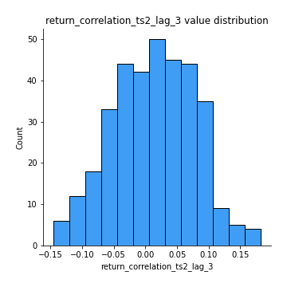
## Feature : sqreturn_autocorrelation_ts1_lag1
- **Feature type** : continous
- **Missing** : 0.0%
- **Unique** : 347
- **Count** :347.0
- **Mean** :0.03233880767079599
- **Std** :0.08385932449936807
- **Min** :-0.17439104373487946
- **25%th Percentile** : -0.025153333371621074
- **50%th Percentile** : 0.018081087962063556
- **75%th Percentile** : 0.07561532802707821
- **Max** :0.4170324090514868

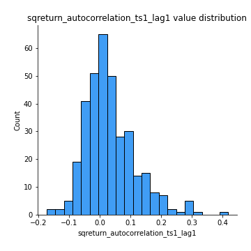
## Feature : sqreturn_autocorrelation_ts1_lag2
- **Feature type** : continous
- **Missing** : 0.0%
- **Unique** : 347
- **Count** :347.0
- **Mean** :0.015635558175203196
- **Std** :0.06989753731287057
- **Min** :-0.1852336326578522
- **25%th Percentile** : -0.02983568004252638
- **50%th Percentile** : 0.005936340518419642
- **75%th Percentile** : 0.05309780219247981
- **Max** :0.29415594530501293

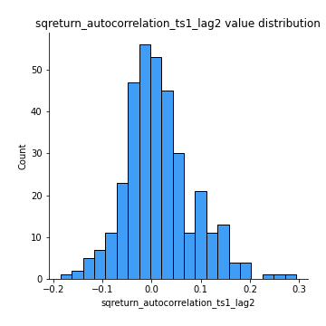
## Feature : sqreturn_autocorrelation_ts1_lag3
- **Feature type** : continous
- **Missing** : 0.0%
- **Unique** : 347
- **Count** :347.0
- **Mean** :0.01370045528266469
- **Std** :0.060708036589309004
- **Min** :-0.1486588989963082
- **25%th Percentile** : -0.023668790844004577
- **50%th Percentile** : 0.006986880195986891
- **75%th Percentile** : 0.04514059239736346
- **Max** :0.21054164854472524

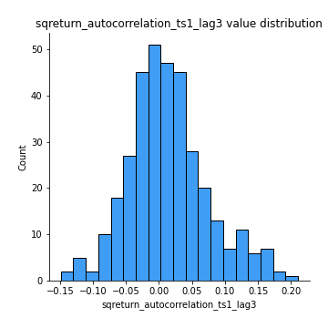
## Feature : sqreturn_autocorrelation_ts2_lag1
- **Feature type** : continous
- **Missing** : 0.0%
- **Unique** : 347
- **Count** :347.0
- **Mean** :0.027546468842616748
- **Std** :0.07888283228083777
- **Min** :-0.20164414768042677
- **25%th Percentile** : -0.02095138514765582
- **50%th Percentile** : 0.015601048769086976
- **75%th Percentile** : 0.06576269814710803
- **Max** :0.36991568023038357

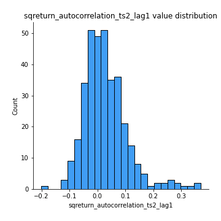
## Feature : sqreturn_autocorrelation_ts2_lag2
- **Feature type** : continous
- **Missing** : 0.0%
- **Unique** : 347
- **Count** :347.0
- **Mean** :0.00969281605637949
- **Std** :0.06267392284535403
- **Min** :-0.13422981929905242
- **25%th Percentile** : -0.02561213501429923
- **50%th Percentile** : 0.0023933982031619934
- **75%th Percentile** : 0.042378985049491
- **Max** :0.28672056150180414

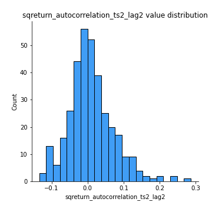
## Feature : sqreturn_autocorrelation_ts2_lag3
- **Feature type** : continous
- **Missing** : 0.0%
- **Unique** : 347
- **Count** :347.0
- **Mean** :0.009764399678462894
- **Std** :0.06257833237187944
- **Min** :-0.15037228172943665
- **25%th Percentile** : -0.027392566444056278
- **50%th Percentile** : 0.00026517371493618984
- **75%th Percentile** : 0.038595642941064365
- **Max** :0.3463122340368414

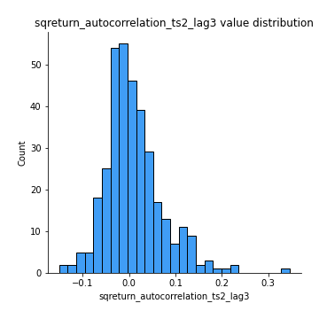
## Feature : sqreturn_correlation_ts1_lag_0
- **Feature type** : continous
- **Missing** : 0.0%
- **Unique** : 347
- **Count** :347.0
- **Mean** :0.3295244489994097
- **Std** :0.1328671070238276
- **Min** :-0.07366870340906873
- **25%th Percentile** : 0.2769719445877026
- **50%th Percentile** : 0.3356142774552462
- **75%th Percentile** : 0.3896268511174972
- **Max** :0.9937227277077512

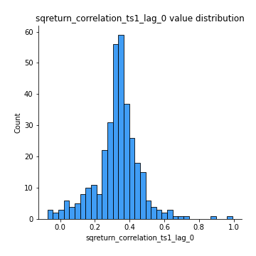
## Feature : sqreturn_correlation_ts1_lag_1
- **Feature type** : continous
- **Missing** : 0.0%
- **Unique** : 347
- **Count** :347.0
- **Mean** :0.007902978595752293
- **Std** :0.06748610152132359
- **Min** :-0.18856827637524448
- **25%th Percentile** : -0.041685489811680534
- **50%th Percentile** : 0.0075221280243619
- **75%th Percentile** : 0.0537707999189719
- **Max** :0.2376318943025859

## Feature : sqreturn_correlation_ts1_lag_2
- **Feature type** : continous
- **Missing** : 0.0%
- **Unique** : 347
- **Count** :347.0
- **Mean** :0.004854961951087827
- **Std** :0.06753531878283073
- **Min** :-0.172871336111873
- **25%th Percentile** : -0.038132793935613064
- **50%th Percentile** : 0.003892095911325179
- **75%th Percentile** : 0.05115363241041078
- **Max** :0.19762079663381538

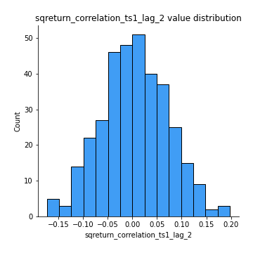
## Feature : sqreturn_correlation_ts1_lag_3
- **Feature type** : continous
- **Missing** : 0.0%
- **Unique** : 347
- **Count** :347.0
- **Mean** :0.013726252895546808
- **Std** :0.06797511797243246
- **Min** :-0.18059033867783728
- **25%th Percentile** : -0.03127051717546416
- **50%th Percentile** : 0.018215128694919206
- **75%th Percentile** : 0.05774411501627197
- **Max** :0.23808054096877584

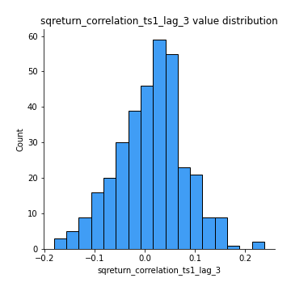
## Feature : sqreturn_correlation_ts2_lag_1
- **Feature type** : continous
- **Missing** : 0.0%
- **Unique** : 347
- **Count** :347.0
- **Mean** :0.01872599325986827
- **Std** :0.06711552530183448
- **Min** :-0.17665751184419612
- **25%th Percentile** : -0.021633582533873694
- **50%th Percentile** : 0.015192791573893466
- **75%th Percentile** : 0.061838469807762184
- **Max** :0.3425036902091001

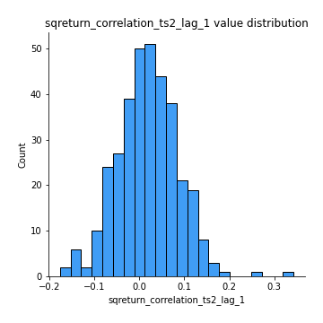
## Feature : sqreturn_correlation_ts2_lag_2
- **Feature type** : continous
- **Missing** : 0.0%
- **Unique** : 347
- **Count** :347.0
- **Mean** :0.006026259355949839
- **Std** :0.0663431939621827
- **Min** :-0.18793480063267962
- **25%th Percentile** : -0.036250535721069954
- **50%th Percentile** : 0.006136658473107882
- **75%th Percentile** : 0.05381323272913718
- **Max** :0.20811030880840364

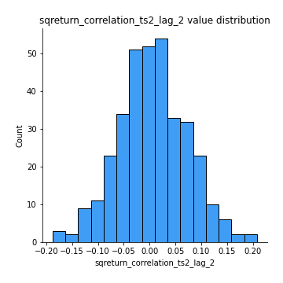
## Feature : sqreturn_correlation_ts2_lag_3
- **Feature type** : continous
- **Missing** : 0.0%
- **Unique** : 347
- **Count** :347.0
- **Mean** :0.013192854664019014
- **Std** :0.0640917166595049
- **Min** :-0.1457867241800045
- **25%th Percentile** : -0.030053474768327017
- **50%th Percentile** : 0.01441244194728613
- **75%th Percentile** : 0.0620312013800967
- **Max** :0.18227042221329348

## Feature : price2_granger_cause_price1
- **Feature type** : continous
- **Missing** : 0.0%
- **Unique** : 347
- **Count** :347.0
- **Mean** :0.25382708180799335
- **Std** :0.28883166478523176
- **Min** :2.4312048970873696e-09
- **25%th Percentile** : 0.020810406920049943
- **50%th Percentile** : 0.11443093570486396
- **75%th Percentile** : 0.4266366800255555
- **Max** :0.9898380228448623

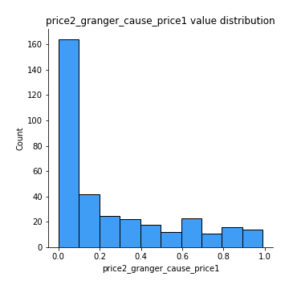
## Feature : price1_granger_cause_price2
- **Feature type** : continous
- **Missing** : 0.0%
- **Unique** : 347
- **Count** :347.0
- **Mean** :0.2523492513827081
- **Std** :0.27299512293087486
- **Min** :1.2012269232170316e-11
- **25%th Percentile** : 0.02470577469756259
- **50%th Percentile** : 0.1345363514220573
- **75%th Percentile** : 0.41315922919958503
- **Max** :0.9658863325568057

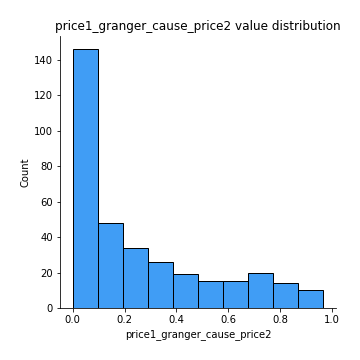

[<< Go back](../README.md)
