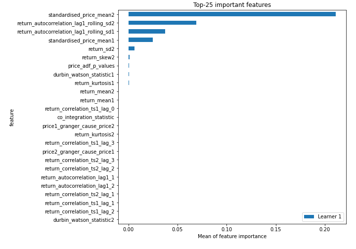
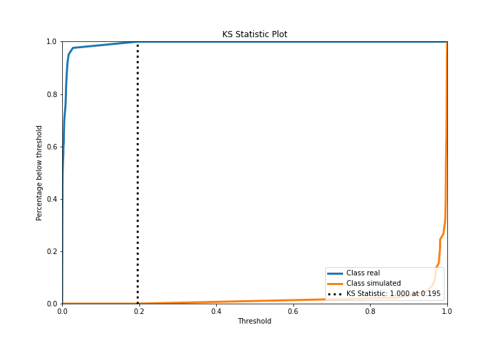
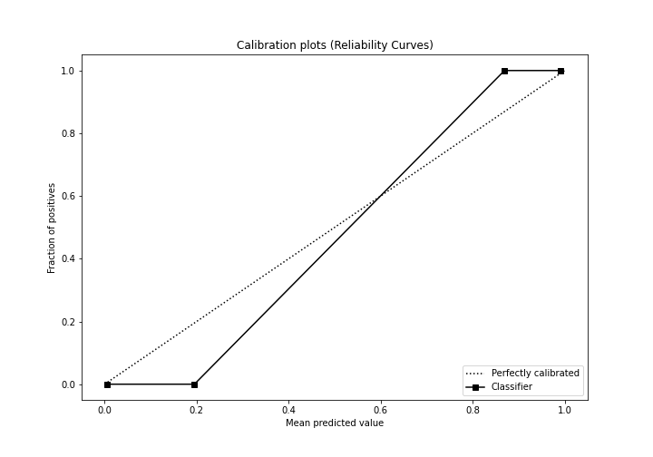
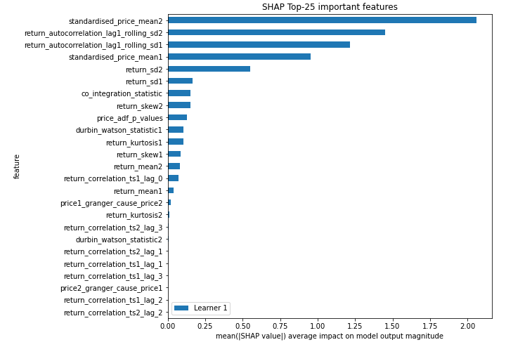
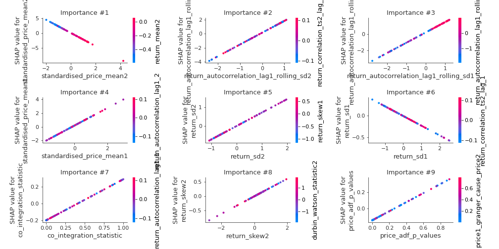
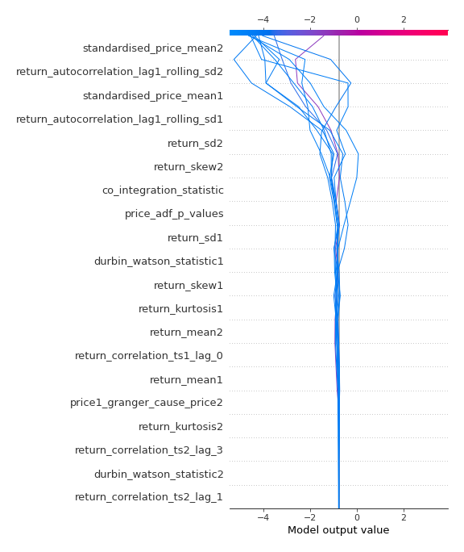
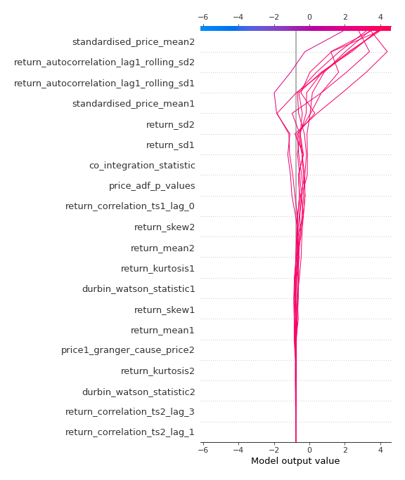
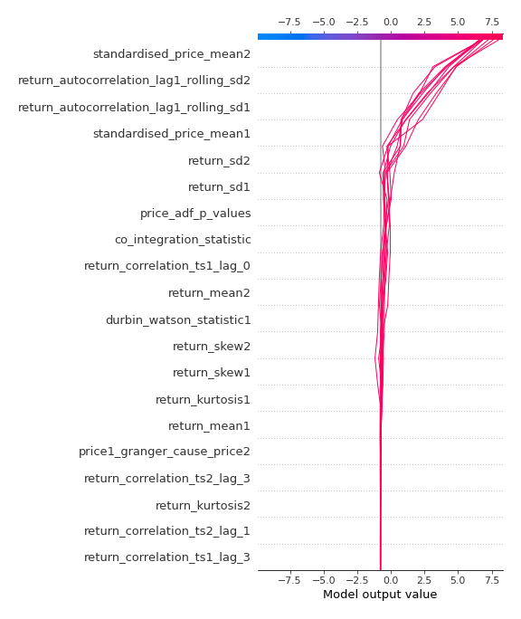

# Summary of 3_Linear

[<< Go back](../README.md)

## Logistic Regression (Linear)
- **n_jobs**: -1
- **explain_level**: 2

## Validation
 - **validation_type**: split
 - **train_ratio**: 0.75
 - **shuffle**: True
 - **stratify**: True

## Optimized metric
accuracy

## Training time

3.2 seconds

## Metric details
|           |     score |     threshold |
|:----------|----------:|--------------:|
| logloss   | 0.0108177 | nan           |
| auc       | 1         | nan           |
| f1        | 1         |   0.498384    |
| accuracy  | 1         |   0.498384    |
| precision | 1         |   0.987277    |
| recall    | 1         |   1.87122e-05 |
| mcc       | 1         |   0.498384    |

## Confusion matrix (at threshold=0.498384)
|                      |   Predicted as real |   Predicted as simulated |
|:---------------------|--------------------:|-------------------------:|
| Labeled as real      |                  42 |                        0 |
| Labeled as simulated |                   0 |                       45 |

## Learning curves

## Coefficients
| feature                                 |    Learner_1 |
|:----------------------------------------|-------------:|
| return_autocorrelation_lag1_rolling_sd2 |  1.68688     |
| standardised_price_mean1                |  1.2739      |
| return_autocorrelation_lag1_rolling_sd1 |  1.25111     |
| return_sd2                              |  0.727859    |
| price_adf_p_values                      |  0.55225     |
| co_integration_statistic                |  0.485986    |
| return_skew2                            |  0.305372    |
| return_mean1                            |  0.29222     |
| return_correlation_ts1_lag_0            |  0.0886015   |
| return_correlation_ts1_lag_1            |  0.0383047   |
| return_correlation_ts1_lag_2            |  0.0239196   |
| return_autocorrelation_lag1_2           |  0.0173264   |
| price2_granger_cause_price1             |  0.00945251  |
| return_autocorrelation_lag1_1           | -0.000531627 |
| durbin_watson_statistic2                | -0.0059601   |
| return_correlation_ts2_lag_2            | -0.0214874   |
| return_kurtosis2                        | -0.0321388   |
| return_correlation_ts1_lag_3            | -0.0351367   |
| return_correlation_ts2_lag_1            | -0.0531521   |
| price1_granger_cause_price2             | -0.114698    |
| return_correlation_ts2_lag_3            | -0.115381    |
| durbin_watson_statistic1                | -0.140325    |
| return_kurtosis1                        | -0.174693    |
| return_skew1                            | -0.189416    |
| return_sd1                              | -0.226045    |
| return_mean2                            | -0.408004    |
| intercept                               | -0.618223    |
| standardised_price_mean2                | -2.20979     |

## Permutation-based Importance

## Confusion Matrix

## Normalized Confusion Matrix

## ROC Curve

## Kolmogorov-Smirnov Statistic

## Precision-Recall Curve

## Calibration Curve

## Cumulative Gains Curve

## Lift Curve

## SHAP Importance

## SHAP Dependence plots

### Dependence (Fold 1)

## SHAP Decision plots

### Top-10 Worst decisions for class 0 (Fold 1)

### Top-10 Best decisions for class 0 (Fold 1)

### Top-10 Worst decisions for class 1 (Fold 1)

### Top-10 Best decisions for class 1 (Fold 1)

[<< Go back](../README.md)
