# Exploratory Data Analysis

[<< Go back](../README.md)
## Feature : target
- **Feature type** : categorical
- **Missing** : 0.0%
- **Unique** : 2
- **Count** :347
- **Unique** :2
- **Top** :simulated
- **Freq** :178

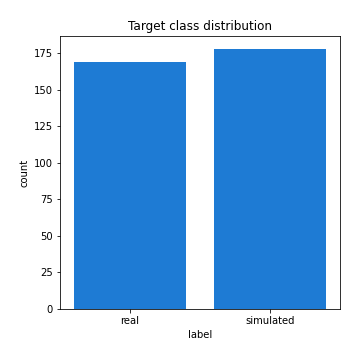
## Feature : standardised_price_mean1
- **Feature type** : continous
- **Missing** : 0.0%
- **Unique** : 347
- **Count** :347.0
- **Mean** :119.0895162078418
- **Std** :22.969483706502665
- **Min** :68.55248182131608
- **25%th Percentile** : 101.4583405741246
- **50%th Percentile** : 117.25705018643359
- **75%th Percentile** : 131.21024039528186
- **Max** :233.3506214152549

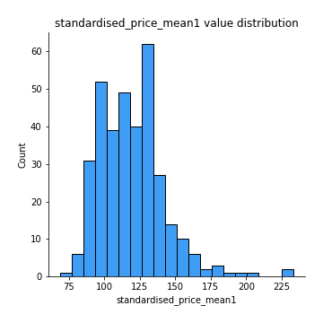
## Feature : standardised_price_mean2
- **Feature type** : continous
- **Missing** : 0.0%
- **Unique** : 347
- **Count** :347.0
- **Mean** :86.24588371890596
- **Std** :21.62984538826246
- **Min** :44.919113794088126
- **25%th Percentile** : 66.98684145626227
- **50%th Percentile** : 84.85209811156946
- **75%th Percentile** : 103.25779860589813
- **Max** :180.9892307692308

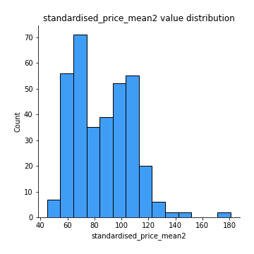
## Feature : return_mean1
- **Feature type** : continous
- **Missing** : 0.0%
- **Unique** : 347
- **Count** :347.0
- **Mean** :0.09312171344615845
- **Std** :0.16469802274924694
- **Min** :-0.3056964745781991
- **25%th Percentile** : -0.016599650333666758
- **50%th Percentile** : 0.08020254548245243
- **75%th Percentile** : 0.19395709663987085
- **Max** :0.8158418483963488

## Feature : return_mean2
- **Feature type** : continous
- **Missing** : 0.0%
- **Unique** : 347
- **Count** :347.0
- **Mean** :-0.21253335710916682
- **Std** :0.23136529385135177
- **Min** :-0.8848721428917693
- **25%th Percentile** : -0.378208223520466
- **50%th Percentile** : -0.16291914222223963
- **75%th Percentile** : -0.02143597179706212
- **Max** :0.4620006181587378

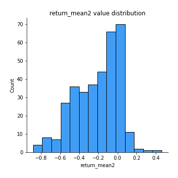
## Feature : return_sd1
- **Feature type** : continous
- **Missing** : 0.0%
- **Unique** : 347
- **Count** :347.0
- **Mean** :2.0358261622363747
- **Std** :0.7270867216667835
- **Min** :0.5385410399383485
- **25%th Percentile** : 1.5020658474924493
- **50%th Percentile** : 1.890257802345716
- **75%th Percentile** : 2.4693467511526
- **Max** :4.4034617122478314

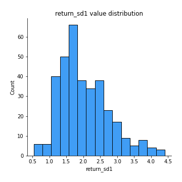
## Feature : return_sd2
- **Feature type** : continous
- **Missing** : 0.0%
- **Unique** : 347
- **Count** :347.0
- **Mean** :2.852294589428658
- **Std** :1.6966790847543658
- **Min** :0.9525251718032508
- **25%th Percentile** : 1.625047311749499
- **50%th Percentile** : 2.166163381293095
- **75%th Percentile** : 3.5883993559703606
- **Max** :10.557329323500868

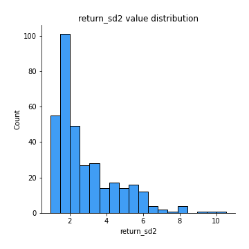
## Feature : return_skew1
- **Feature type** : continous
- **Missing** : 0.0%
- **Unique** : 347
- **Count** :347.0
- **Mean** :-0.3203260535770822
- **Std** :0.7281512847402312
- **Min** :-4.499550695415954
- **25%th Percentile** : -0.5957747613819465
- **50%th Percentile** : -0.2942405277911848
- **75%th Percentile** : -0.01291766578174508
- **Max** :3.972992894648776

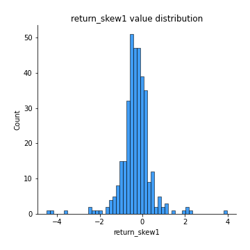
## Feature : return_skew2
- **Feature type** : continous
- **Missing** : 0.0%
- **Unique** : 347
- **Count** :347.0
- **Mean** :-0.5282707847933849
- **Std** :0.9980581407558806
- **Min** :-7.3762354994385335
- **25%th Percentile** : -0.7575416079085142
- **50%th Percentile** : -0.3920671638565335
- **75%th Percentile** : -0.1395207349602987
- **Max** :2.3516100629951677

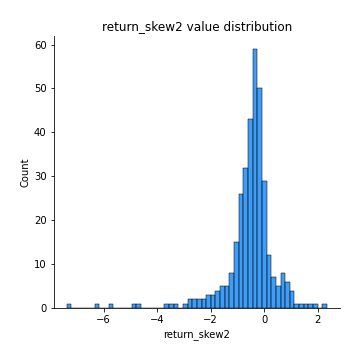
## Feature : return_kurtosis1
- **Feature type** : continous
- **Missing** : 0.0%
- **Unique** : 347
- **Count** :347.0
- **Mean** :3.7968282385094856
- **Std** :4.905689892792361
- **Min** :-0.026624449552693275
- **25%th Percentile** : 1.494262408173641
- **50%th Percentile** : 2.38001327856279
- **75%th Percentile** : 4.089647421901776
- **Max** :43.33367798924404

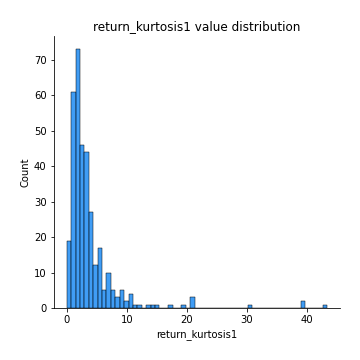
## Feature : return_kurtosis2
- **Feature type** : continous
- **Missing** : 0.0%
- **Unique** : 347
- **Count** :347.0
- **Mean** :5.427269031216503
- **Std** :8.752829197500727
- **Min** :0.024044458596995
- **25%th Percentile** : 1.8227854870711266
- **50%th Percentile** : 3.0546766323892722
- **75%th Percentile** : 5.2228875886507
- **Max** :94.01659180149953

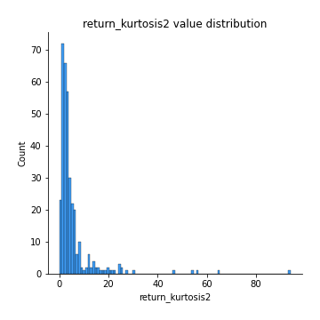
## Feature : return_autocorrelation_lag1_1
- **Feature type** : continous
- **Missing** : 0.0%
- **Unique** : 347
- **Count** :347.0
- **Mean** :-0.007603118355460125
- **Std** :0.07518559921400973
- **Min** :-0.2401280742974923
- **25%th Percentile** : -0.05255294904431676
- **50%th Percentile** : -0.007128441803621995
- **75%th Percentile** : 0.03684369661857767
- **Max** :0.20914408175893434

## Feature : return_autocorrelation_lag1_2
- **Feature type** : continous
- **Missing** : 0.0%
- **Unique** : 347
- **Count** :347.0
- **Mean** :-0.004540892943396233
- **Std** :0.07797172984370747
- **Min** :-0.21820335777470296
- **25%th Percentile** : -0.054685390864498896
- **50%th Percentile** : -0.004355202957026714
- **75%th Percentile** : 0.046337651184680834
- **Max** :0.23570255753644562

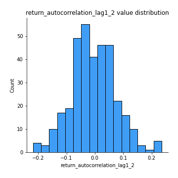
## Feature : return_autocorrelation_lag1_rolling_sd1
- **Feature type** : continous
- **Missing** : 0.0%
- **Unique** : 347
- **Count** :347.0
- **Mean** :0.9770619671136526
- **Std** :0.01680153251236106
- **Min** :0.9248211087908771
- **25%th Percentile** : 0.9646742941553826
- **50%th Percentile** : 0.9824586797173183
- **75%th Percentile** : 0.9911667533751727
- **Max** :0.9976218484717374

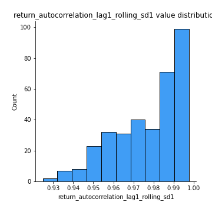
## Feature : return_autocorrelation_lag1_rolling_sd2
- **Feature type** : continous
- **Missing** : 0.0%
- **Unique** : 347
- **Count** :347.0
- **Mean** :0.9750685563353575
- **Std** :0.019939670449229775
- **Min** :0.8849206290342239
- **25%th Percentile** : 0.961520582459017
- **50%th Percentile** : 0.9829826984526165
- **75%th Percentile** : 0.9916479634965236
- **Max** :0.9976840562595931

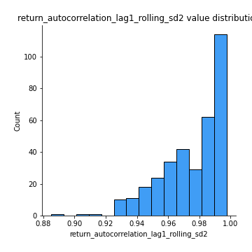
## Feature : price_adf_p_values
- **Feature type** : continous
- **Missing** : 0.0%
- **Unique** : 347
- **Count** :347.0
- **Mean** :0.250802706090527
- **Std** :0.2892750134065934
- **Min** :2.5539372737169943e-05
- **25%th Percentile** : 0.012317807999923318
- **50%th Percentile** : 0.11566787089777103
- **75%th Percentile** : 0.43106200018930624
- **Max** :0.9836936050221832

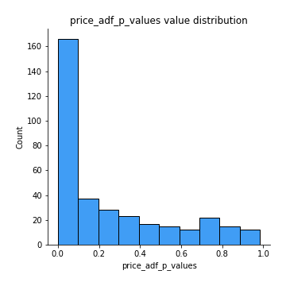
## Feature : return_correlation_ts1_lag_0
- **Feature type** : continous
- **Missing** : 0.0%
- **Unique** : 347
- **Count** :347.0
- **Mean** :0.5164545004343065
- **Std** :0.277009244951427
- **Min** :-0.6647735505076499
- **25%th Percentile** : 0.33277915471674463
- **50%th Percentile** : 0.5392648975376874
- **75%th Percentile** : 0.7687797517554957
- **Max** :0.9937227277077512

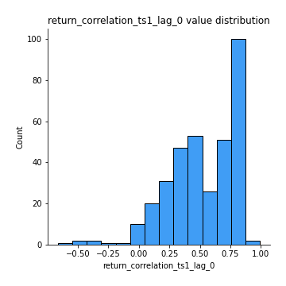
## Feature : return_correlation_ts1_lag_1
- **Feature type** : continous
- **Missing** : 0.0%
- **Unique** : 347
- **Count** :347.0
- **Mean** :0.0025130953696200645
- **Std** :0.07035748969894645
- **Min** :-0.20973314466891074
- **25%th Percentile** : -0.051407095664442536
- **50%th Percentile** : 0.011162404780276053
- **75%th Percentile** : 0.054035862253204434
- **Max** :0.2492373755427347

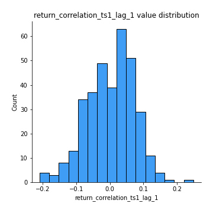
## Feature : return_correlation_ts1_lag_2
- **Feature type** : continous
- **Missing** : 0.0%
- **Unique** : 347
- **Count** :347.0
- **Mean** :-0.0016294126660753479
- **Std** :0.07668056044932568
- **Min** :-0.2331119942396334
- **25%th Percentile** : -0.04776851413886375
- **50%th Percentile** : -0.004641148615865841
- **75%th Percentile** : 0.05205114324712698
- **Max** :0.18550260198453583

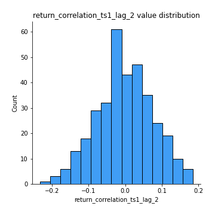
## Feature : return_correlation_ts1_lag_3
- **Feature type** : continous
- **Missing** : 0.0%
- **Unique** : 347
- **Count** :347.0
- **Mean** :0.007194148489465335
- **Std** :0.0748120374709982
- **Min** :-0.33808791618844297
- **25%th Percentile** : -0.04214060719433099
- **50%th Percentile** : 0.009948432814803546
- **75%th Percentile** : 0.06185325386001053
- **Max** :0.1920028593156834

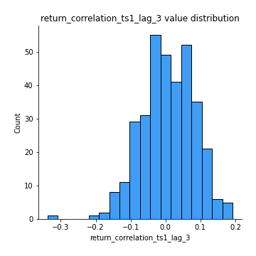
## Feature : return_correlation_ts2_lag_1
- **Feature type** : continous
- **Missing** : 0.0%
- **Unique** : 347
- **Count** :347.0
- **Mean** :0.003029959649424639
- **Std** :0.07439904814523741
- **Min** :-0.17558202942270704
- **25%th Percentile** : -0.0488811206774536
- **50%th Percentile** : 0.006354473383948113
- **75%th Percentile** : 0.04960086945006334
- **Max** :0.3425036902091001

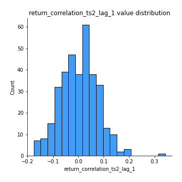
## Feature : return_correlation_ts2_lag_2
- **Feature type** : continous
- **Missing** : 0.0%
- **Unique** : 347
- **Count** :347.0
- **Mean** :-0.013033014747307527
- **Std** :0.07463862532255507
- **Min** :-0.29435775672833786
- **25%th Percentile** : -0.05598362887804613
- **50%th Percentile** : -0.013230417875448996
- **75%th Percentile** : 0.035121738923929405
- **Max** :0.21355229045833596

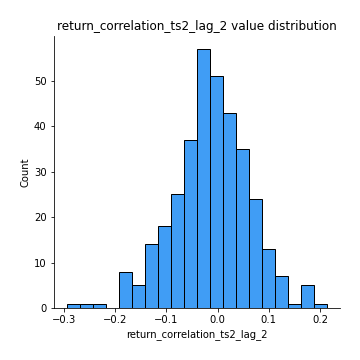
## Feature : return_correlation_ts2_lag_3
- **Feature type** : continous
- **Missing** : 0.0%
- **Unique** : 347
- **Count** :347.0
- **Mean** :0.008386669393224811
- **Std** :0.0714243851526341
- **Min** :-0.20205786975811663
- **25%th Percentile** : -0.033984704182382884
- **50%th Percentile** : 0.012771155921874416
- **75%th Percentile** : 0.05784096832439661
- **Max** :0.21443994242834458

## Feature : durbin_watson_statistic1
- **Feature type** : continous
- **Missing** : 0.0%
- **Unique** : 347
- **Count** :347.0
- **Mean** :1.9785221080374777
- **Std** :0.1089086705107821
- **Min** :1.6445678494807074
- **25%th Percentile** : 1.9245626112518588
- **50%th Percentile** : 1.9859735949556747
- **75%th Percentile** : 2.028040852709352
- **Max** :2.3077976830645213

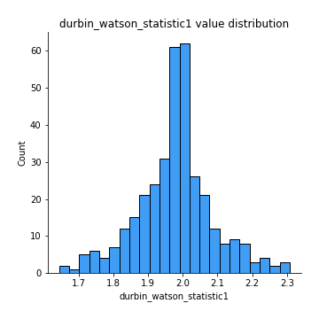
## Feature : durbin_watson_statistic2
- **Feature type** : continous
- **Missing** : 0.0%
- **Unique** : 347
- **Count** :347.0
- **Mean** :1.987131779512648
- **Std** :0.11294973946447386
- **Min** :1.6929615938189853
- **25%th Percentile** : 1.926314602176448
- **50%th Percentile** : 1.9883682626325867
- **75%th Percentile** : 2.0365614012423228
- **Max** :2.3817331307936813

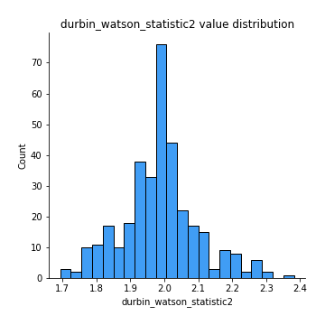
## Feature : co_integration_statistic
- **Feature type** : continous
- **Missing** : 0.0%
- **Unique** : 342
- **Count** :347.0
- **Mean** :0.3847688306624324
- **Std** :0.35610249404164657
- **Min** :7.478497249518302e-05
- **25%th Percentile** : 0.037099566345315166
- **50%th Percentile** : 0.26590585031359076
- **75%th Percentile** : 0.7117652705279255
- **Max** :1.0

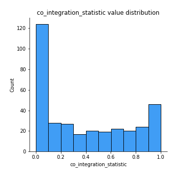
## Feature : price2_granger_cause_price1
- **Feature type** : continous
- **Missing** : 0.0%
- **Unique** : 347
- **Count** :347.0
- **Mean** :0.20860617800672582
- **Std** :0.2595551454092867
- **Min** :4.837825077860151e-14
- **25%th Percentile** : 0.01187316433704904
- **50%th Percentile** : 0.09373541244970589
- **75%th Percentile** : 0.33038123399753333
- **Max** :0.9899603106054258

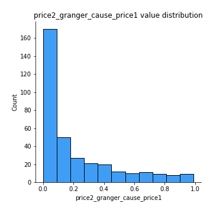
## Feature : price1_granger_cause_price2
- **Feature type** : continous
- **Missing** : 0.0%
- **Unique** : 347
- **Count** :347.0
- **Mean** :0.1906955248515911
- **Std** :0.24927930852495125
- **Min** :2.0196787316699703e-13
- **25%th Percentile** : 0.011820085860504821
- **50%th Percentile** : 0.07678884071992578
- **75%th Percentile** : 0.27646022158522443
- **Max** :0.996420614932667

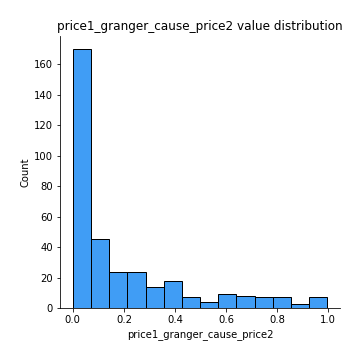

[<< Go back](../README.md)
