# Exploratory Data Analysis

[<< Go back](../README.md)
## Feature : target
- **Feature type** : categorical
- **Missing** : 0.0%
- **Unique** : 2
- **Count** :347
- **Unique** :2
- **Top** :simulated
- **Freq** :177

## Feature : standardised_price_mean1
- **Feature type** : continous
- **Missing** : 0.0%
- **Unique** : 347
- **Count** :347.0
- **Mean** :122.29790049446896
- **Std** :30.700659788659912
- **Min** :61.90028384066058
- **25%th Percentile** : 101.14007519578146
- **50%th Percentile** : 118.11597235854582
- **75%th Percentile** : 133.43900455449847
- **Max** :308.81612160863165

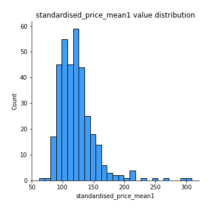
## Feature : standardised_price_mean2
- **Feature type** : continous
- **Missing** : 0.0%
- **Unique** : 347
- **Count** :347.0
- **Mean** :88.29702104363848
- **Std** :22.067840253214197
- **Min** :49.941013012044316
- **25%th Percentile** : 68.3087347093734
- **50%th Percentile** : 89.59114164510291
- **75%th Percentile** : 104.00766569251016
- **Max** :199.06718400188

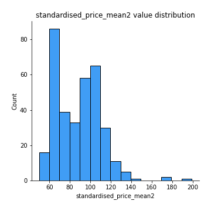
## Feature : return_mean1
- **Feature type** : continous
- **Missing** : 0.0%
- **Unique** : 347
- **Count** :347.0
- **Mean** :0.1012932389934437
- **Std** :0.18157735010589113
- **Min** :-0.31570612099423523
- **25%th Percentile** : -0.014634916374805355
- **50%th Percentile** : 0.06958637741136202
- **75%th Percentile** : 0.20267345013192628
- **Max** :0.8609424717739724

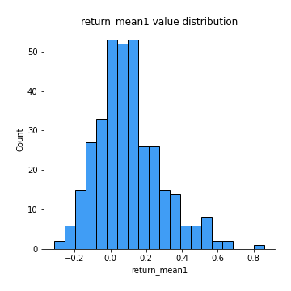
## Feature : return_mean2
- **Feature type** : continous
- **Missing** : 0.0%
- **Unique** : 347
- **Count** :347.0
- **Mean** :-0.20057698642984306
- **Std** :0.24350603377983418
- **Min** :-1.03577598665788
- **25%th Percentile** : -0.3820799463169937
- **50%th Percentile** : -0.1267262003020724
- **75%th Percentile** : -0.0165554304646237
- **Max** :0.4571343594242885

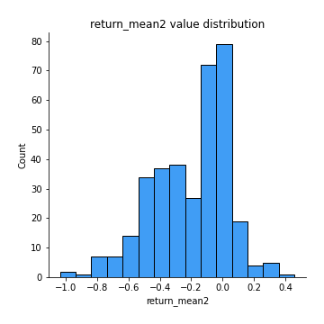
## Feature : return_sd1
- **Feature type** : continous
- **Missing** : 0.0%
- **Unique** : 347
- **Count** :347.0
- **Mean** :2.1154118874947723
- **Std** :0.8657720290688568
- **Min** :0.5672871242806441
- **25%th Percentile** : 1.4786245139873946
- **50%th Percentile** : 1.846848937178448
- **75%th Percentile** : 2.6132947410183194
- **Max** :5.720152604745475

## Feature : return_sd2
- **Feature type** : continous
- **Missing** : 0.0%
- **Unique** : 347
- **Count** :347.0
- **Mean** :3.00390031552337
- **Std** :2.0979251919057567
- **Min** :0.5755349262882387
- **25%th Percentile** : 1.5756104650612692
- **50%th Percentile** : 2.0143924256836585
- **75%th Percentile** : 3.772332902154382
- **Max** :11.549379113378546

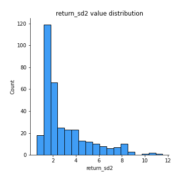
## Feature : return_skew1
- **Feature type** : continous
- **Missing** : 0.0%
- **Unique** : 347
- **Count** :347.0
- **Mean** :-0.30998820012938727
- **Std** :0.6341365209228007
- **Min** :-4.499550695415954
- **25%th Percentile** : -0.6050418345097672
- **50%th Percentile** : -0.2985803424294637
- **75%th Percentile** : -0.06634982071374074
- **Max** :2.3044235031125564

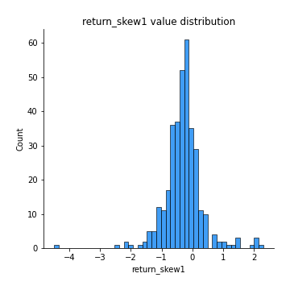
## Feature : return_skew2
- **Feature type** : continous
- **Missing** : 0.0%
- **Unique** : 347
- **Count** :347.0
- **Mean** :-0.4993666544288284
- **Std** :0.839900362290199
- **Min** :-7.3762354994385335
- **25%th Percentile** : -0.8726601873694679
- **50%th Percentile** : -0.41338668795947636
- **75%th Percentile** : -0.1283414675192997
- **Max** :2.3516100629951677

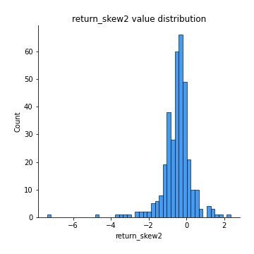
## Feature : return_kurtosis1
- **Feature type** : continous
- **Missing** : 0.0%
- **Unique** : 347
- **Count** :347.0
- **Mean** :3.3642853173900487
- **Std** :3.8684625697878086
- **Min** :-0.06794856850130815
- **25%th Percentile** : 1.4136973680807716
- **50%th Percentile** : 2.297760887964418
- **75%th Percentile** : 3.733367125696128
- **Max** :43.33367798924404

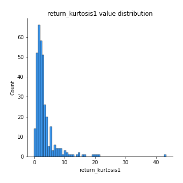
## Feature : return_kurtosis2
- **Feature type** : continous
- **Missing** : 0.0%
- **Unique** : 347
- **Count** :347.0
- **Mean** :4.833710329487882
- **Std** :6.935457674727023
- **Min** :-0.004312639536766749
- **25%th Percentile** : 1.7309205031755739
- **50%th Percentile** : 3.2396489670813042
- **75%th Percentile** : 5.4287389538413215
- **Max** :94.01659180149953

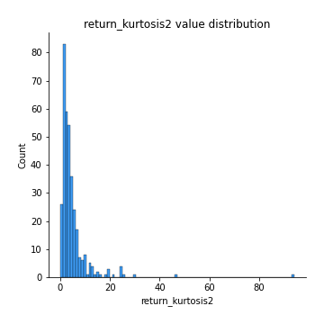
## Feature : return_autocorrelation_lag1_1
- **Feature type** : continous
- **Missing** : 0.0%
- **Unique** : 347
- **Count** :347.0
- **Mean** :-0.0040604797756967305
- **Std** :0.07313085155419187
- **Min** :-0.21059579222107805
- **25%th Percentile** : -0.05185427627028023
- **50%th Percentile** : -0.0019696810986134868
- **75%th Percentile** : 0.04329914787140744
- **Max** :0.22889285270339407

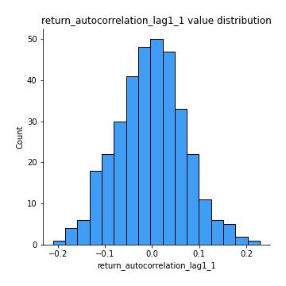
## Feature : return_autocorrelation_lag1_2
- **Feature type** : continous
- **Missing** : 0.0%
- **Unique** : 347
- **Count** :347.0
- **Mean** :-0.00013936882653877526
- **Std** :0.07590591730919859
- **Min** :-0.21084037605059958
- **25%th Percentile** : -0.05153603234858786
- **50%th Percentile** : -0.0002510032937979555
- **75%th Percentile** : 0.0502498969558505
- **Max** :0.2437153303986955

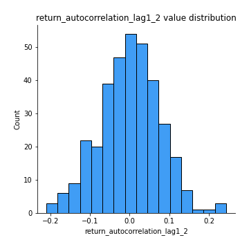
## Feature : return_autocorrelation_lag1_rolling_sd1
- **Feature type** : continous
- **Missing** : 0.0%
- **Unique** : 347
- **Count** :347.0
- **Mean** :0.9774468103795649
- **Std** :0.016351315145915195
- **Min** :0.9268739413055933
- **25%th Percentile** : 0.9648419975108438
- **50%th Percentile** : 0.9817301243941878
- **75%th Percentile** : 0.9916515861539348
- **Max** :0.9977745436588517

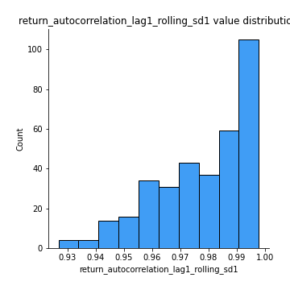
## Feature : return_autocorrelation_lag1_rolling_sd2
- **Feature type** : continous
- **Missing** : 0.0%
- **Unique** : 347
- **Count** :347.0
- **Mean** :0.9748606776805697
- **Std** :0.018848579250299886
- **Min** :0.9026917088648122
- **25%th Percentile** : 0.962326440901089
- **50%th Percentile** : 0.9791677904997562
- **75%th Percentile** : 0.9915211471769396
- **Max** :0.9980388206307037

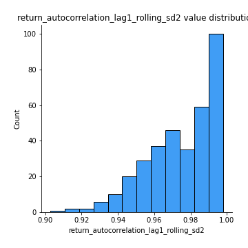
## Feature : price_adf_p_values
- **Feature type** : continous
- **Missing** : 0.0%
- **Unique** : 347
- **Count** :347.0
- **Mean** :0.26125008495449636
- **Std** :0.2953607851260805
- **Min** :4.663774584889525e-06
- **25%th Percentile** : 0.015106392897752018
- **50%th Percentile** : 0.11602032420604447
- **75%th Percentile** : 0.48546052406301377
- **Max** :0.9836936050221832

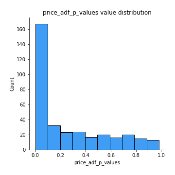
## Feature : return_correlation_ts1_lag_0
- **Feature type** : continous
- **Missing** : 0.0%
- **Unique** : 347
- **Count** :347.0
- **Mean** :0.5131081136893407
- **Std** :0.27939862966514645
- **Min** :-0.6177744790702736
- **25%th Percentile** : 0.3400024864757113
- **50%th Percentile** : 0.5466960783931738
- **75%th Percentile** : 0.7631873046291162
- **Max** :0.9937227277077512

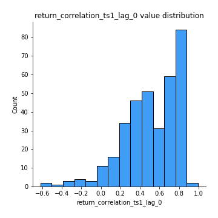
## Feature : return_correlation_ts1_lag_1
- **Feature type** : continous
- **Missing** : 0.0%
- **Unique** : 347
- **Count** :347.0
- **Mean** :0.00879373242914895
- **Std** :0.07004115843532052
- **Min** :-0.20546949485944582
- **25%th Percentile** : -0.03693859005105779
- **50%th Percentile** : 0.010519392233192218
- **75%th Percentile** : 0.05412366084447542
- **Max** :0.22226361266012784

## Feature : return_correlation_ts1_lag_2
- **Feature type** : continous
- **Missing** : 0.0%
- **Unique** : 347
- **Count** :347.0
- **Mean** :-0.00592643787576738
- **Std** :0.07222517074339958
- **Min** :-0.2409499105926999
- **25%th Percentile** : -0.054083266215970184
- **50%th Percentile** : -0.006870866712150058
- **75%th Percentile** : 0.03911503608776186
- **Max** :0.20154483632192904

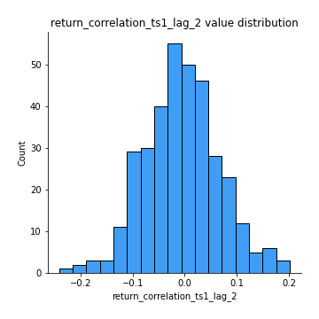
## Feature : return_correlation_ts1_lag_3
- **Feature type** : continous
- **Missing** : 0.0%
- **Unique** : 347
- **Count** :347.0
- **Mean** :0.0022037074436731894
- **Std** :0.07446191164643921
- **Min** :-0.2182407496396961
- **25%th Percentile** : -0.043164739430166466
- **50%th Percentile** : 0.001968039682068911
- **75%th Percentile** : 0.05215741374627977
- **Max** :0.22401161968432556

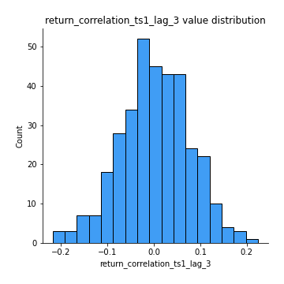
## Feature : return_correlation_ts2_lag_1
- **Feature type** : continous
- **Missing** : 0.0%
- **Unique** : 347
- **Count** :347.0
- **Mean** :0.009181959998942144
- **Std** :0.07600887205598685
- **Min** :-0.20476914290729245
- **25%th Percentile** : -0.044116035853069745
- **50%th Percentile** : 0.01315732656980283
- **75%th Percentile** : 0.05847807216175796
- **Max** :0.3425036902091001

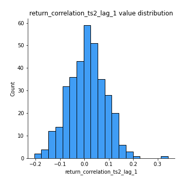
## Feature : return_correlation_ts2_lag_2
- **Feature type** : continous
- **Missing** : 0.0%
- **Unique** : 347
- **Count** :347.0
- **Mean** :-0.011070277286557993
- **Std** :0.07245801809650165
- **Min** :-0.21208798026305703
- **25%th Percentile** : -0.0582463158338629
- **50%th Percentile** : -0.010570658762733508
- **75%th Percentile** : 0.0332567275386292
- **Max** :0.2066760136389841

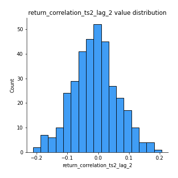
## Feature : return_correlation_ts2_lag_3
- **Feature type** : continous
- **Missing** : 0.0%
- **Unique** : 347
- **Count** :347.0
- **Mean** :0.003711453349523929
- **Std** :0.08251138140656222
- **Min** :-0.2865983946640045
- **25%th Percentile** : -0.04656798994721624
- **50%th Percentile** : 0.006547614993516044
- **75%th Percentile** : 0.0625642780476112
- **Max** :0.21443994242834458

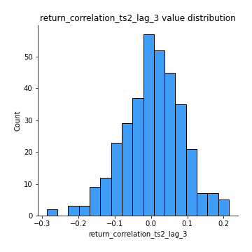
## Feature : durbin_watson_statistic1
- **Feature type** : continous
- **Missing** : 0.0%
- **Unique** : 347
- **Count** :347.0
- **Mean** :1.9793241219491544
- **Std** :0.09986416954072733
- **Min** :1.665775489079257
- **25%th Percentile** : 1.9360724760692172
- **50%th Percentile** : 1.9847671893281655
- **75%th Percentile** : 2.01692566771389
- **Max** :2.297476091935293

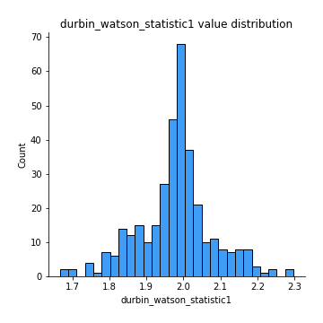
## Feature : durbin_watson_statistic2
- **Feature type** : continous
- **Missing** : 0.0%
- **Unique** : 347
- **Count** :347.0
- **Mean** :1.985706359411545
- **Std** :0.10522133049205816
- **Min** :1.699054249220666
- **25%th Percentile** : 1.9308375945732947
- **50%th Percentile** : 1.9929049986141374
- **75%th Percentile** : 2.0250861940124754
- **Max** :2.3332862938965913

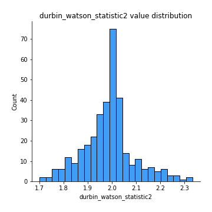
## Feature : co_integration_statistic
- **Feature type** : continous
- **Missing** : 0.0%
- **Unique** : 344
- **Count** :347.0
- **Mean** :0.3874588410009895
- **Std** :0.3523573824451023
- **Min** :2.697855095971856e-05
- **25%th Percentile** : 0.04145779124391684
- **50%th Percentile** : 0.3006461640822664
- **75%th Percentile** : 0.6945977799219148
- **Max** :1.0

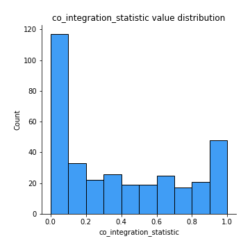
## Feature : price2_granger_cause_price1
- **Feature type** : continous
- **Missing** : 0.0%
- **Unique** : 347
- **Count** :347.0
- **Mean** :0.24890368676542793
- **Std** :0.2917326284008286
- **Min** :6.534451660999283e-11
- **25%th Percentile** : 0.010819968409740841
- **50%th Percentile** : 0.10879506448226955
- **75%th Percentile** : 0.3972244930226917
- **Max** :0.9924540167505913

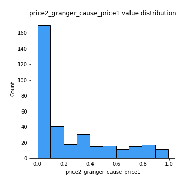
## Feature : price1_granger_cause_price2
- **Feature type** : continous
- **Missing** : 0.0%
- **Unique** : 347
- **Count** :347.0
- **Mean** :0.1977269406117235
- **Std** :0.25683560494734925
- **Min** :1.2012269232170316e-11
- **25%th Percentile** : 0.007353184616610659
- **50%th Percentile** : 0.06678124925553312
- **75%th Percentile** : 0.3140679333072086
- **Max** :0.9813994870423349

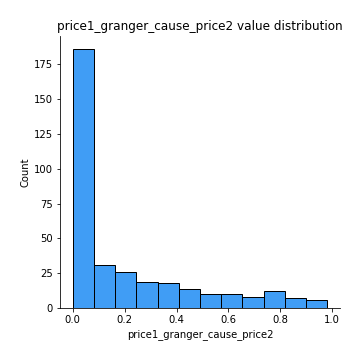

[<< Go back](../README.md)
