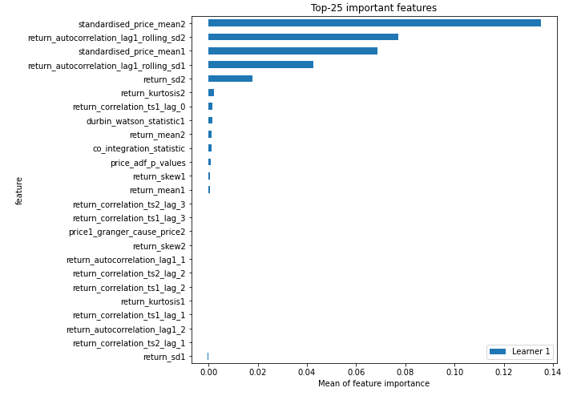
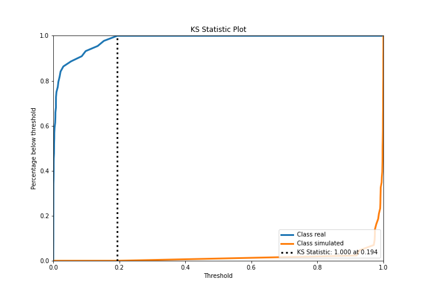
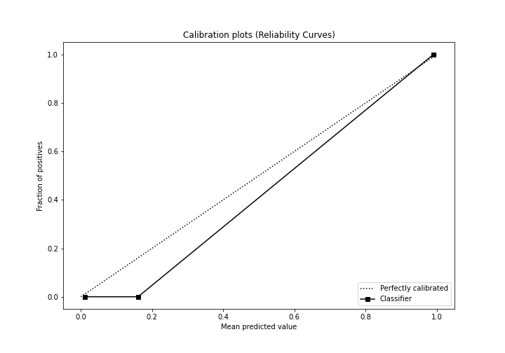
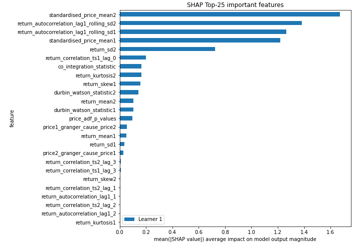
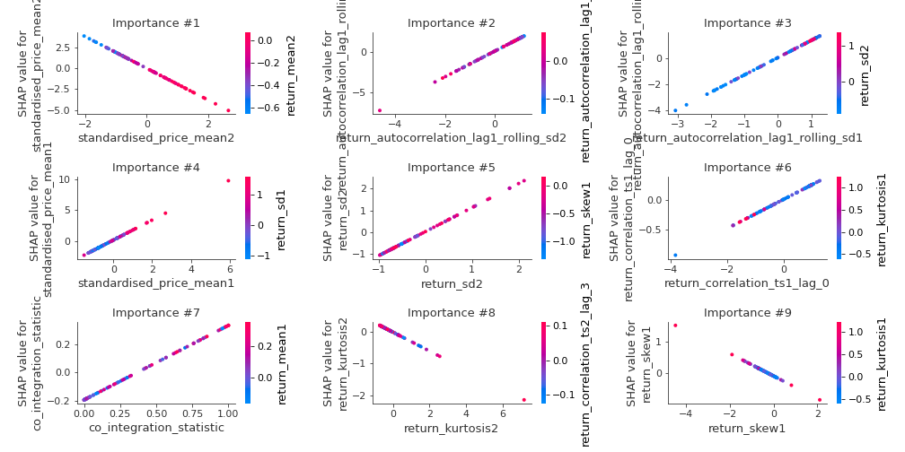
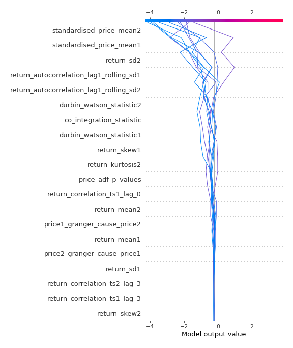
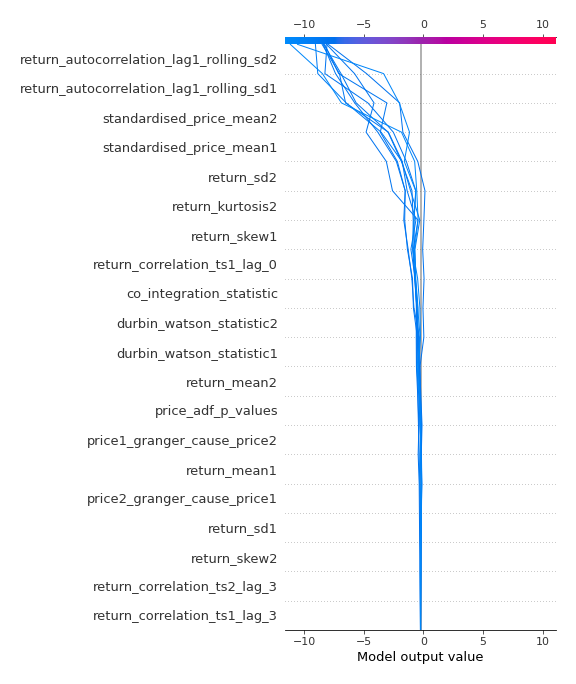
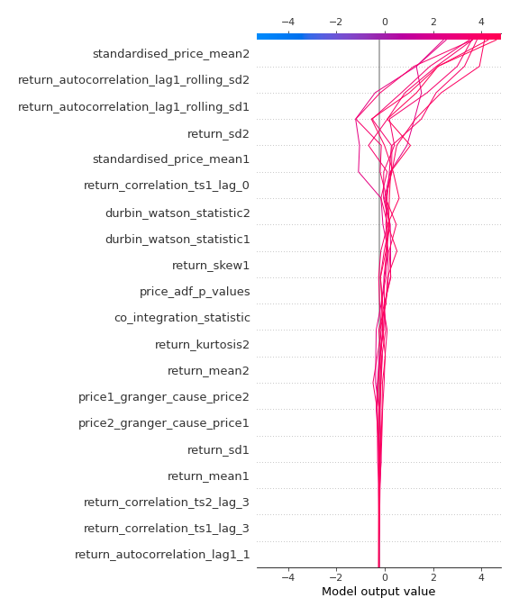
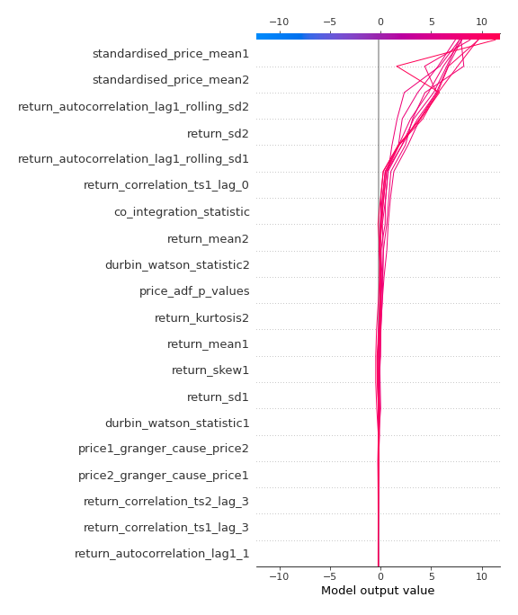

# Summary of 3_Linear

[<< Go back](../README.md)

## Logistic Regression (Linear)
- **n_jobs**: -1
- **explain_level**: 2

## Validation
 - **validation_type**: split
 - **train_ratio**: 0.75
 - **shuffle**: True
 - **stratify**: True

## Optimized metric
accuracy

## Training time

4.7 seconds

## Metric details
|           |     score |     threshold |
|:----------|----------:|--------------:|
| logloss   | 0.0157246 | nan           |
| auc       | 1         | nan           |
| f1        | 1         |   0.495922    |
| accuracy  | 1         |   0.495922    |
| precision | 1         |   0.495922    |
| recall    | 1         |   1.29016e-05 |
| mcc       | 1         |   0.495922    |

## Confusion matrix (at threshold=0.495922)
|                      |   Predicted as real |   Predicted as simulated |
|:---------------------|--------------------:|-------------------------:|
| Labeled as real      |                  44 |                        0 |
| Labeled as simulated |                   0 |                       43 |

## Learning curves

## Coefficients
| feature                                 |   Learner_1 |
|:----------------------------------------|------------:|
| standardised_price_mean1                |  1.62378    |
| return_autocorrelation_lag1_rolling_sd2 |  1.58725    |
| return_autocorrelation_lag1_rolling_sd1 |  1.3304     |
| return_sd2                              |  1.10359    |
| co_integration_statistic                |  0.528029   |
| price_adf_p_values                      |  0.406191   |
| return_mean1                            |  0.380661   |
| return_correlation_ts1_lag_0            |  0.247892   |
| durbin_watson_statistic2                |  0.179232   |
| return_autocorrelation_lag1_1           |  0.063483   |
| return_skew2                            |  0.0113704  |
| return_kurtosis1                        |  0.00102801 |
| return_correlation_ts1_lag_2            | -0.0040933  |
| return_correlation_ts1_lag_1            | -0.00761369 |
| return_autocorrelation_lag1_2           | -0.0139622  |
| return_correlation_ts2_lag_2            | -0.0485826  |
| return_sd1                              | -0.0488786  |
| return_correlation_ts2_lag_1            | -0.0585936  |
| return_correlation_ts1_lag_3            | -0.140055   |
| price2_granger_cause_price1             | -0.142192   |
| durbin_watson_statistic1                | -0.149675   |
| return_correlation_ts2_lag_3            | -0.177304   |
| price1_granger_cause_price2             | -0.275425   |
| return_kurtosis2                        | -0.295488   |
| intercept                               | -0.309162   |
| return_skew1                            | -0.355632   |
| return_mean2                            | -0.520919   |
| standardised_price_mean2                | -1.89905    |

## Permutation-based Importance

## Confusion Matrix

## Normalized Confusion Matrix

## ROC Curve

## Kolmogorov-Smirnov Statistic

## Precision-Recall Curve

## Calibration Curve

## Cumulative Gains Curve

## Lift Curve

## SHAP Importance

## SHAP Dependence plots

### Dependence (Fold 1)

## SHAP Decision plots

### Top-10 Worst decisions for class 0 (Fold 1)

### Top-10 Best decisions for class 0 (Fold 1)

### Top-10 Worst decisions for class 1 (Fold 1)

### Top-10 Best decisions for class 1 (Fold 1)

[<< Go back](../README.md)
