# Exploratory Data Analysis

[<< Go back](../README.md)
## Feature : target
- **Feature type** : categorical
- **Missing** : 0.0%
- **Unique** : 2
- **Count** :347
- **Unique** :2
- **Top** :real
- **Freq** :175

## Feature : standardised_price_mean1
- **Feature type** : continous
- **Missing** : 0.0%
- **Unique** : 347
- **Count** :347.0
- **Mean** :121.64202058272353
- **Std** :28.78368659241791
- **Min** :68.55248182131608
- **25%th Percentile** : 101.39582735484224
- **50%th Percentile** : 117.30637951311391
- **75%th Percentile** : 134.40344616451472
- **Max** :291.886080319453

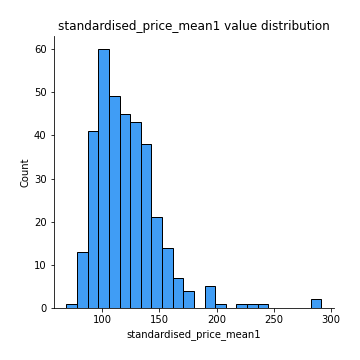
## Feature : standardised_price_mean2
- **Feature type** : continous
- **Missing** : 0.0%
- **Unique** : 347
- **Count** :347.0
- **Mean** :88.33704318986388
- **Std** :21.421996227073507
- **Min** :45.60728271663327
- **25%th Percentile** : 70.19366510537007
- **50%th Percentile** : 88.80315642995485
- **75%th Percentile** : 103.91387822427919
- **Max** :180.9892307692308

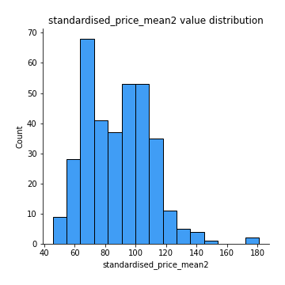
## Feature : return_mean1
- **Feature type** : continous
- **Missing** : 0.0%
- **Unique** : 347
- **Count** :347.0
- **Mean** :0.09636725892465829
- **Std** :0.1753466135598947
- **Min** :-0.3056964745781991
- **25%th Percentile** : -0.012543958745977109
- **50%th Percentile** : 0.06966264216895048
- **75%th Percentile** : 0.18638546298923686
- **Max** :0.8117160328780751

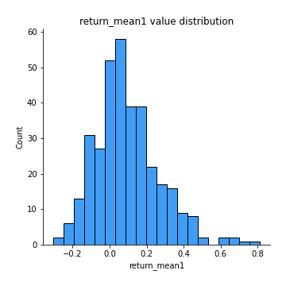
## Feature : return_mean2
- **Feature type** : continous
- **Missing** : 0.0%
- **Unique** : 347
- **Count** :347.0
- **Mean** :-0.20543041888848443
- **Std** :0.2496825437435849
- **Min** :-1.124585136403064
- **25%th Percentile** : -0.352496977349422
- **50%th Percentile** : -0.1409913735807956
- **75%th Percentile** : -0.018632068632475095
- **Max** :0.6905626376719886

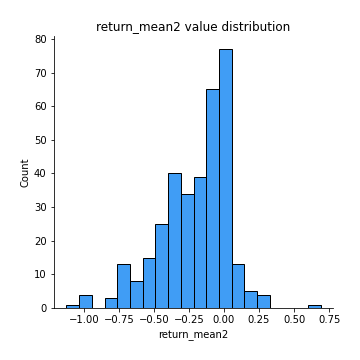
## Feature : return_sd1
- **Feature type** : continous
- **Missing** : 0.0%
- **Unique** : 347
- **Count** :347.0
- **Mean** :2.0837009381147995
- **Std** :0.8510328477846582
- **Min** :0.717874089704378
- **25%th Percentile** : 1.4793057095462907
- **50%th Percentile** : 1.8303601850388103
- **75%th Percentile** : 2.5565626167584683
- **Max** :5.244053591397115

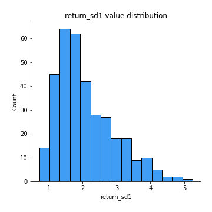
## Feature : return_sd2
- **Feature type** : continous
- **Missing** : 0.0%
- **Unique** : 347
- **Count** :347.0
- **Mean** :2.991567666733679
- **Std** :2.0324224817102543
- **Min** :0.752999580954845
- **25%th Percentile** : 1.5506539315032022
- **50%th Percentile** : 2.1819773542017558
- **75%th Percentile** : 3.763716694262592
- **Max** :10.09821887092339

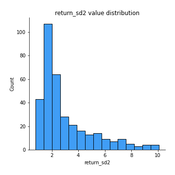
## Feature : return_skew1
- **Feature type** : continous
- **Missing** : 0.0%
- **Unique** : 347
- **Count** :347.0
- **Mean** :-0.36292711812352907
- **Std** :0.7107887443599222
- **Min** :-4.499550695415954
- **25%th Percentile** : -0.6203363969110021
- **50%th Percentile** : -0.33050478622035856
- **75%th Percentile** : -0.07256105383715844
- **Max** :3.972992894648776

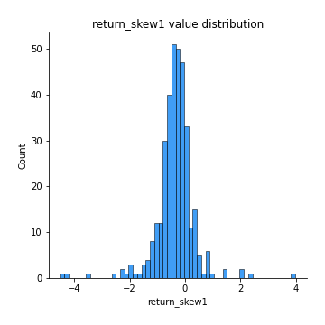
## Feature : return_skew2
- **Feature type** : continous
- **Missing** : 0.0%
- **Unique** : 347
- **Count** :347.0
- **Mean** :-0.47106489005559643
- **Std** :0.7884009271135942
- **Min** :-4.9381854573614286
- **25%th Percentile** : -0.7437020536907442
- **50%th Percentile** : -0.3955748034324061
- **75%th Percentile** : -0.13192333654809035
- **Max** :2.3516100629951677

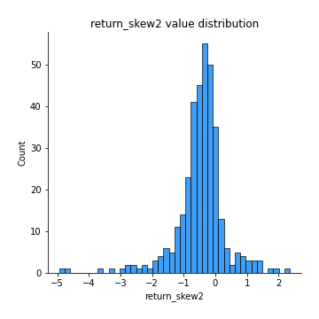
## Feature : return_kurtosis1
- **Feature type** : continous
- **Missing** : 0.0%
- **Unique** : 347
- **Count** :347.0
- **Mean** :3.7219172896919854
- **Std** :5.013515356127953
- **Min** :0.016552562445099284
- **25%th Percentile** : 1.3677106048859158
- **50%th Percentile** : 2.2216145341071076
- **75%th Percentile** : 4.0302785747279986
- **Max** :43.33367798924404

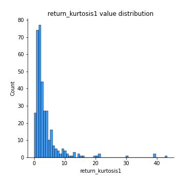
## Feature : return_kurtosis2
- **Feature type** : continous
- **Missing** : 0.0%
- **Unique** : 347
- **Count** :347.0
- **Mean** :4.732645015134095
- **Std** :5.87387553555687
- **Min** :0.15053529736159943
- **25%th Percentile** : 1.747575635000908
- **50%th Percentile** : 2.991381454089256
- **75%th Percentile** : 5.337178837749013
- **Max** :55.812326969767064

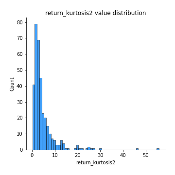
## Feature : return_autocorrelation_lag1_1
- **Feature type** : continous
- **Missing** : 0.0%
- **Unique** : 347
- **Count** :347.0
- **Mean** :-0.007314653164808335
- **Std** :0.07293293582513655
- **Min** :-0.21036490626189078
- **25%th Percentile** : -0.05715896444130957
- **50%th Percentile** : -0.004926597728338611
- **75%th Percentile** : 0.043959512926726854
- **Max** :0.26266548319320554

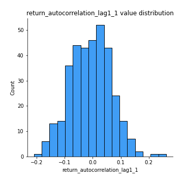
## Feature : return_autocorrelation_lag1_2
- **Feature type** : continous
- **Missing** : 0.0%
- **Unique** : 347
- **Count** :347.0
- **Mean** :-0.00318133946267244
- **Std** :0.07582672198999622
- **Min** :-0.2094809952617857
- **25%th Percentile** : -0.05032722100618349
- **50%th Percentile** : -0.0012901771984222086
- **75%th Percentile** : 0.04874413365476115
- **Max** :0.21666466214528196

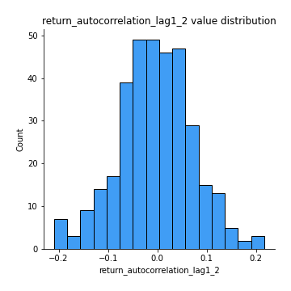
## Feature : return_autocorrelation_lag1_rolling_sd1
- **Feature type** : continous
- **Missing** : 0.0%
- **Unique** : 347
- **Count** :347.0
- **Mean** :0.9760839234415085
- **Std** :0.016534124840793644
- **Min** :0.9248211087908771
- **25%th Percentile** : 0.9639735558936112
- **50%th Percentile** : 0.9798925497016638
- **75%th Percentile** : 0.9907601919889248
- **Max** :0.9971355603626157

## Feature : return_autocorrelation_lag1_rolling_sd2
- **Feature type** : continous
- **Missing** : 0.0%
- **Unique** : 347
- **Count** :347.0
- **Mean** :0.9742319762739736
- **Std** :0.01959922823394072
- **Min** :0.8849206290342239
- **25%th Percentile** : 0.9603837381284834
- **50%th Percentile** : 0.9804999472912351
- **75%th Percentile** : 0.9912594102180174
- **Max** :0.9972794839769605

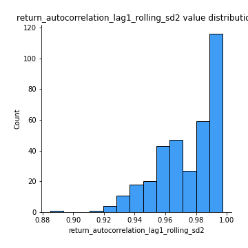
## Feature : price_adf_p_values
- **Feature type** : continous
- **Missing** : 0.0%
- **Unique** : 347
- **Count** :347.0
- **Mean** :0.2459619664773328
- **Std** :0.2865440698696451
- **Min** :2.5539372737169943e-05
- **25%th Percentile** : 0.01196251517912475
- **50%th Percentile** : 0.09849549660414558
- **75%th Percentile** : 0.4383974769365193
- **Max** :0.9851989097138601

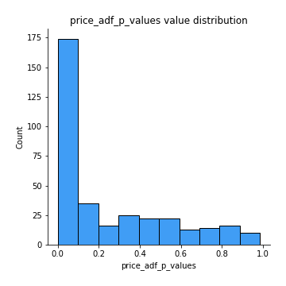
## Feature : return_correlation_ts1_lag_0
- **Feature type** : continous
- **Missing** : 0.0%
- **Unique** : 347
- **Count** :347.0
- **Mean** :0.5178263584784024
- **Std** :0.26660073790744426
- **Min** :-0.5315155939912914
- **25%th Percentile** : 0.33735902375176696
- **50%th Percentile** : 0.5304954233147269
- **75%th Percentile** : 0.7688909375138147
- **Max** :0.8872235971090535

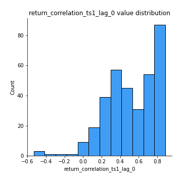
## Feature : return_correlation_ts1_lag_1
- **Feature type** : continous
- **Missing** : 0.0%
- **Unique** : 347
- **Count** :347.0
- **Mean** :0.002528120450504171
- **Std** :0.07133663094977526
- **Min** :-0.19659206813927912
- **25%th Percentile** : -0.044640057653970736
- **50%th Percentile** : 0.0057402729190531515
- **75%th Percentile** : 0.05444535537704785
- **Max** :0.17715143240592168

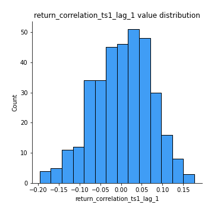
## Feature : return_correlation_ts1_lag_2
- **Feature type** : continous
- **Missing** : 0.0%
- **Unique** : 347
- **Count** :347.0
- **Mean** :-0.009365346568425142
- **Std** :0.06774496766442718
- **Min** :-0.19873106883431554
- **25%th Percentile** : -0.05243642666520351
- **50%th Percentile** : -0.011264420388374687
- **75%th Percentile** : 0.034862004184114406
- **Max** :0.21950989755520575

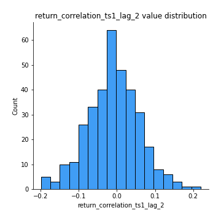
## Feature : return_correlation_ts1_lag_3
- **Feature type** : continous
- **Missing** : 0.0%
- **Unique** : 347
- **Count** :347.0
- **Mean** :0.0074282434159646926
- **Std** :0.07472256567698338
- **Min** :-0.23524884029815415
- **25%th Percentile** : -0.042424165624473154
- **50%th Percentile** : 0.008281613925356748
- **75%th Percentile** : 0.057696979702262535
- **Max** :0.21735789278723125

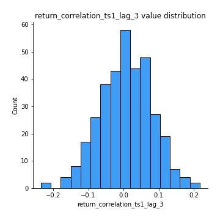
## Feature : return_correlation_ts2_lag_1
- **Feature type** : continous
- **Missing** : 0.0%
- **Unique** : 347
- **Count** :347.0
- **Mean** :0.0033765402897958656
- **Std** :0.07456066523674841
- **Min** :-0.18313864889232181
- **25%th Percentile** : -0.05188086452482416
- **50%th Percentile** : 0.011424873659503882
- **75%th Percentile** : 0.051445770337840854
- **Max** :0.3425036902091001

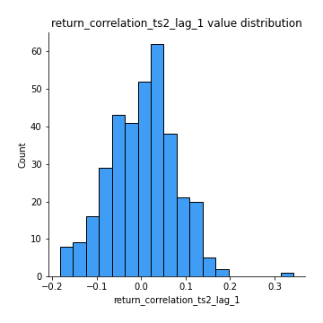
## Feature : return_correlation_ts2_lag_2
- **Feature type** : continous
- **Missing** : 0.0%
- **Unique** : 347
- **Count** :347.0
- **Mean** :-0.013321780139132046
- **Std** :0.07206668472886837
- **Min** :-0.20710087215139922
- **25%th Percentile** : -0.056675832696385625
- **50%th Percentile** : -0.013230417875448996
- **75%th Percentile** : 0.03537203722519813
- **Max** :0.21455671344703

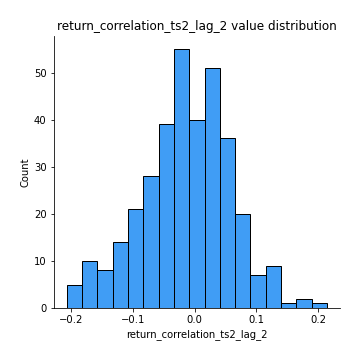
## Feature : return_correlation_ts2_lag_3
- **Feature type** : continous
- **Missing** : 0.0%
- **Unique** : 347
- **Count** :347.0
- **Mean** :0.011147006404858922
- **Std** :0.07517720250955537
- **Min** :-0.22934171384233148
- **25%th Percentile** : -0.03542909338947992
- **50%th Percentile** : 0.01379360684561047
- **75%th Percentile** : 0.06427221510511386
- **Max** :0.21443994242834458

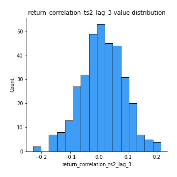
## Feature : durbin_watson_statistic1
- **Feature type** : continous
- **Missing** : 0.0%
- **Unique** : 347
- **Count** :347.0
- **Mean** :1.9780368434401534
- **Std** :0.10312534850146164
- **Min** :1.6837453550141128
- **25%th Percentile** : 1.920099192566537
- **50%th Percentile** : 1.9920515429000822
- **75%th Percentile** : 2.024909932078975
- **Max** :2.297476091935293

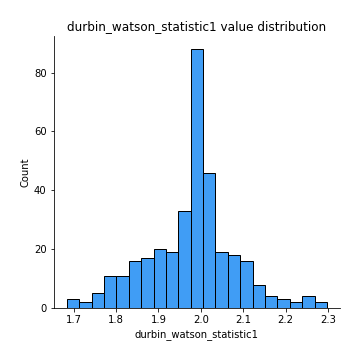
## Feature : durbin_watson_statistic2
- **Feature type** : continous
- **Missing** : 0.0%
- **Unique** : 347
- **Count** :347.0
- **Mean** :1.9782158234869036
- **Std** :0.10126722806246916
- **Min** :1.7140284721882426
- **25%th Percentile** : 1.9257644949092958
- **50%th Percentile** : 1.9925336876187156
- **75%th Percentile** : 2.0245631683735317
- **Max** :2.284393801661815

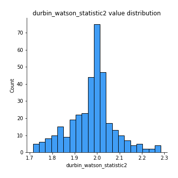
## Feature : co_integration_statistic
- **Feature type** : continous
- **Missing** : 0.0%
- **Unique** : 340
- **Count** :347.0
- **Mean** :0.3695096066515634
- **Std** :0.35047954090461747
- **Min** :7.478497249518302e-05
- **25%th Percentile** : 0.03162344419923889
- **50%th Percentile** : 0.2665430521745221
- **75%th Percentile** : 0.663833139878931
- **Max** :1.0

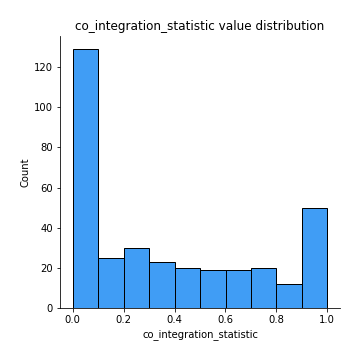
## Feature : price2_granger_cause_price1
- **Feature type** : continous
- **Missing** : 0.0%
- **Unique** : 347
- **Count** :347.0
- **Mean** :0.21380720234995312
- **Std** :0.26549883057693663
- **Min** :2.4312048970873696e-09
- **25%th Percentile** : 0.009261641806157184
- **50%th Percentile** : 0.08359219810259388
- **75%th Percentile** : 0.35466442172160295
- **Max** :0.9999249738809368

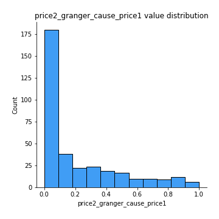
## Feature : price1_granger_cause_price2
- **Feature type** : continous
- **Missing** : 0.0%
- **Unique** : 347
- **Count** :347.0
- **Mean** :0.18487980823372333
- **Std** :0.26036350492068994
- **Min** :1.2012269232170316e-11
- **25%th Percentile** : 0.008355755765694202
- **50%th Percentile** : 0.058373613542142676
- **75%th Percentile** : 0.27242207546171365
- **Max** :0.9917187126775368

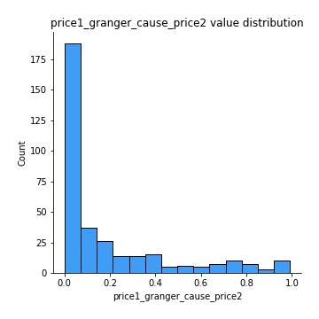

[<< Go back](../README.md)
