# Summary of 3_Linear

[<< Go back](../README.md)

## Logistic Regression (Linear)
- **n_jobs**: -1
- **explain_level**: 2

## Validation
 - **validation_type**: split
 - **train_ratio**: 0.75
 - **shuffle**: True
 - **stratify**: True

## Optimized metric
accuracy

## Training time

4.1 seconds

## Metric details
|           |     score |     threshold |
|:----------|----------:|--------------:|
| logloss   | 0.0493215 | nan           |
| auc       | 0.99894   | nan           |
| f1        | 0.987654  |   0.504719    |
| accuracy  | 0.988506  |   0.504719    |
| precision | 1         |   0.504719    |
| recall    | 1         |   2.00305e-05 |
| mcc       | 0.977165  |   0.504719    |

## Confusion matrix (at threshold=0.504719)
|                      |   Predicted as real |   Predicted as simulated |
|:---------------------|--------------------:|-------------------------:|
| Labeled as real      |                  46 |                        0 |
| Labeled as simulated |                   1 |                       40 |

## Learning curves

## Coefficients
| feature                                 |   Learner_1 |
|:----------------------------------------|------------:|
| return_autocorrelation_lag1_rolling_sd2 |   1.34235   |
| standardised_price_mean1                |   1.2934    |
| return_autocorrelation_lag1_rolling_sd1 |   1.27575   |
| return_sd2                              |   0.772168  |
| co_integration_statistic                |   0.635599  |
| price_adf_p_values                      |   0.560626  |
| return_mean1                            |   0.279433  |
| price2_granger_cause_price1             |   0.231281  |
| durbin_watson_statistic2                |   0.20752   |
| return_sd1                              |   0.204696  |
| return_skew2                            |   0.162826  |
| return_correlation_ts1_lag_0            |   0.130988  |
| return_autocorrelation_lag1_1           |   0.0474838 |
| return_autocorrelation_lag1_2           |   0.0415872 |
| return_correlation_ts1_lag_2            |   0.0414047 |
| return_correlation_ts1_lag_1            |   0.0398692 |
| return_correlation_ts2_lag_2            |   0.0371112 |
| return_correlation_ts2_lag_1            |   0.0148383 |
| return_kurtosis1                        |  -0.0239164 |
| return_correlation_ts1_lag_3            |  -0.0831963 |
| return_kurtosis2                        |  -0.0877314 |
| price1_granger_cause_price2             |  -0.0988896 |
| return_correlation_ts2_lag_3            |  -0.148281  |
| durbin_watson_statistic1                |  -0.215943  |
| return_skew1                            |  -0.307697  |
| return_mean2                            |  -0.449689  |
| intercept                               |  -0.909576  |
| standardised_price_mean2                |  -2.11149   |

## Permutation-based Importance
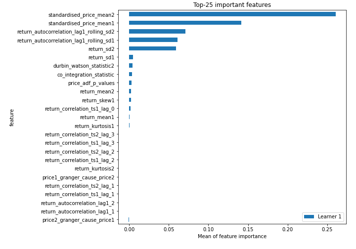
## Confusion Matrix

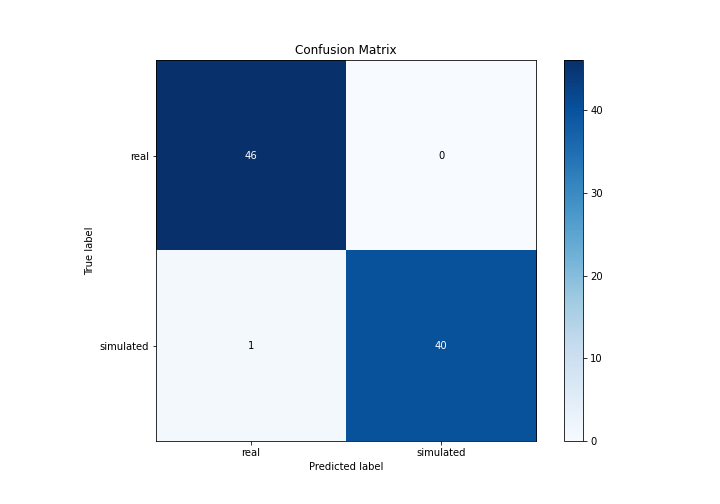

## Normalized Confusion Matrix

## ROC Curve

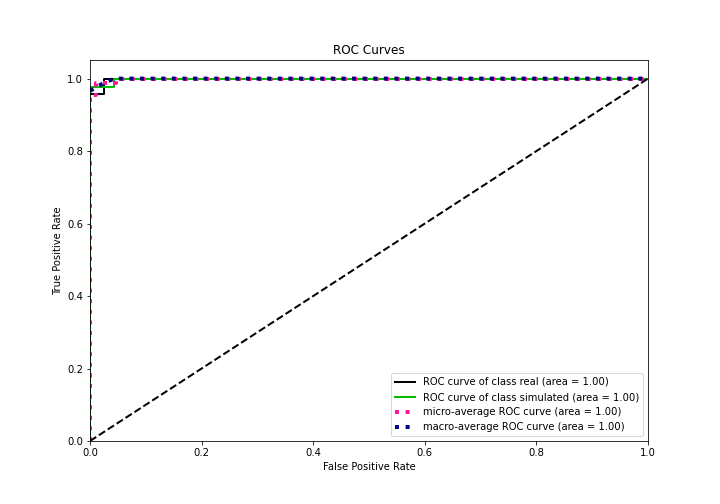

## Kolmogorov-Smirnov Statistic

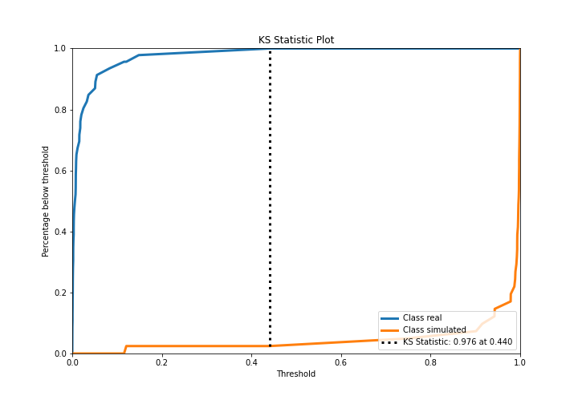

## Precision-Recall Curve

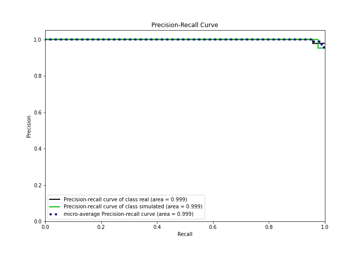

## Calibration Curve

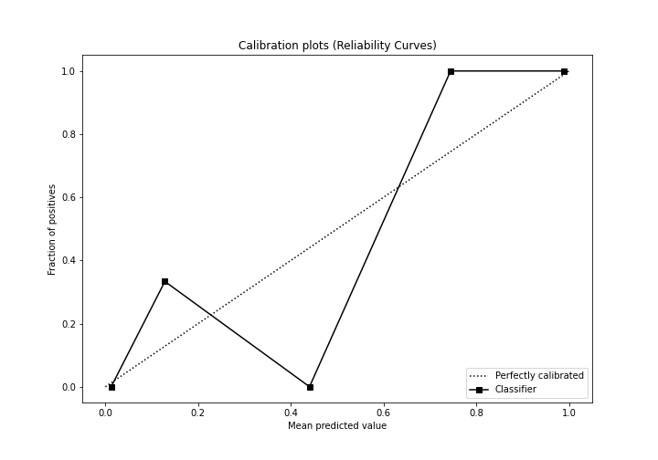

## Cumulative Gains Curve

## Lift Curve

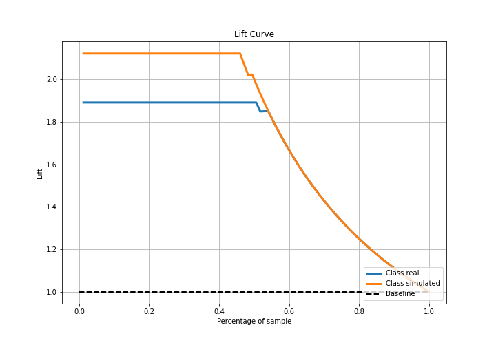

## SHAP Importance
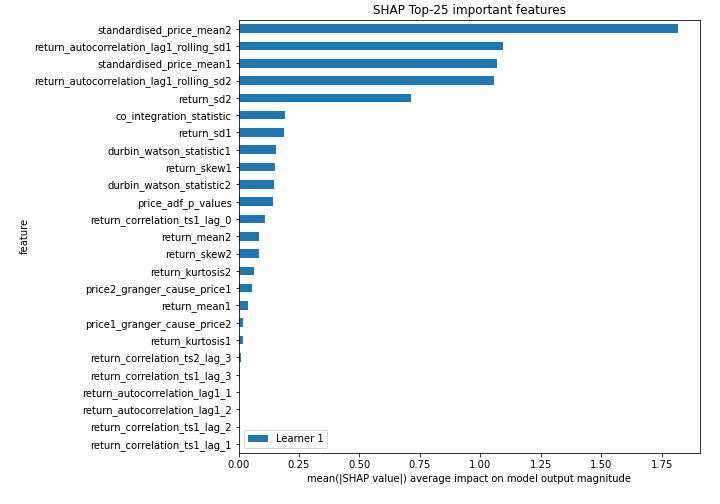

## SHAP Dependence plots

### Dependence (Fold 1)
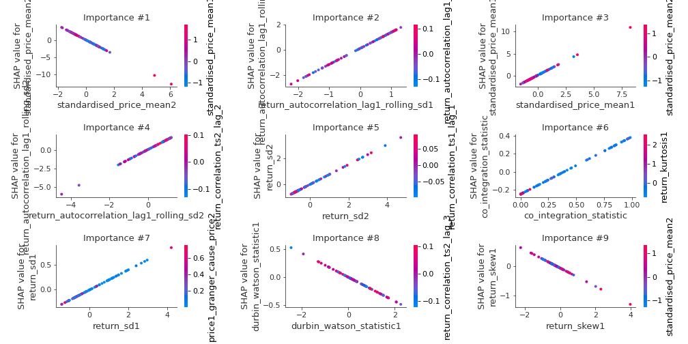

## SHAP Decision plots

### Top-10 Worst decisions for class 0 (Fold 1)
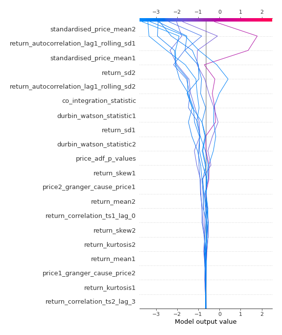
### Top-10 Best decisions for class 0 (Fold 1)
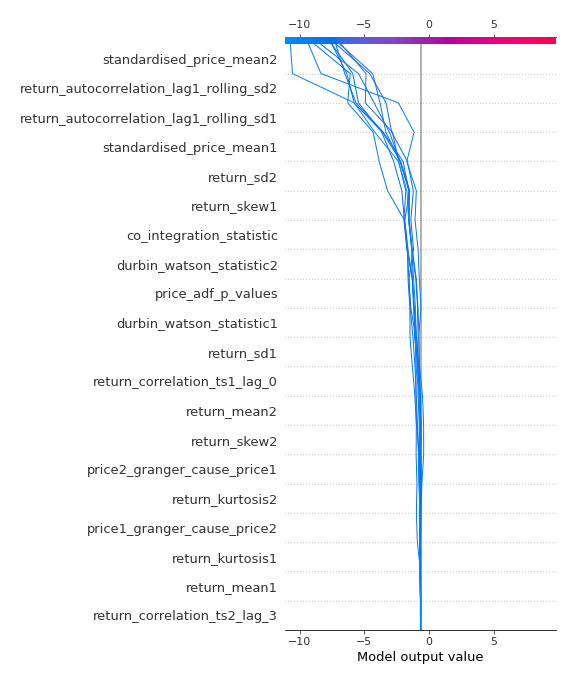
### Top-10 Worst decisions for class 1 (Fold 1)
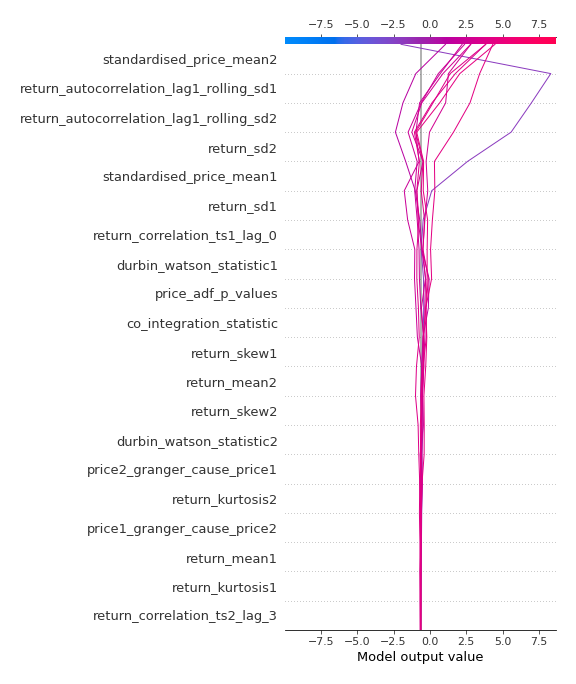
### Top-10 Best decisions for class 1 (Fold 1)
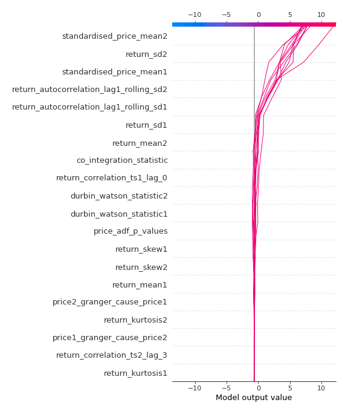

[<< Go back](../README.md)
