# Exploratory Data Analysis

[<< Go back](../README.md)
## Feature : target
- **Feature type** : categorical
- **Missing** : 0.0%
- **Unique** : 2
- **Count** :347
- **Unique** :2
- **Top** :real
- **Freq** :183

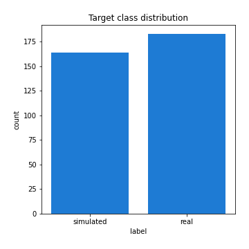
## Feature : standardised_price_mean1
- **Feature type** : continous
- **Missing** : 0.0%
- **Unique** : 347
- **Count** :347.0
- **Mean** :120.20149556580948
- **Std** :27.081403577486995
- **Min** :75.81744099743875
- **25%th Percentile** : 101.21210671578899
- **50%th Percentile** : 116.90112767834565
- **75%th Percentile** : 131.95874471984587
- **Max** :326.6524560205461

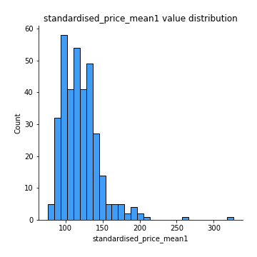
## Feature : standardised_price_mean2
- **Feature type** : continous
- **Missing** : 0.0%
- **Unique** : 347
- **Count** :347.0
- **Mean** :88.47708873718076
- **Std** :23.085484283988947
- **Min** :50.097798463947754
- **25%th Percentile** : 69.76386839834144
- **50%th Percentile** : 88.80315642995485
- **75%th Percentile** : 104.29876078319242
- **Max** :221.5229390975771

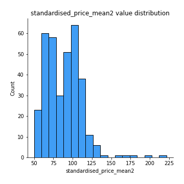
## Feature : return_mean1
- **Feature type** : continous
- **Missing** : 0.0%
- **Unique** : 347
- **Count** :347.0
- **Mean** :0.08505768808632297
- **Std** :0.166895789787817
- **Min** :-0.297638839829253
- **25%th Percentile** : -0.025783560072018666
- **50%th Percentile** : 0.058335362660922936
- **75%th Percentile** : 0.17652020760019377
- **Max** :0.7733592498895632

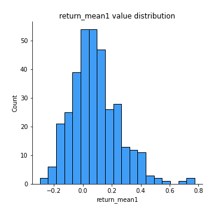
## Feature : return_mean2
- **Feature type** : continous
- **Missing** : 0.0%
- **Unique** : 347
- **Count** :347.0
- **Mean** :-0.20180217732711522
- **Std** :0.2415716857528075
- **Min** :-1.0154208458694705
- **25%th Percentile** : -0.3499272482248559
- **50%th Percentile** : -0.1314978607820964
- **75%th Percentile** : -0.017793259030697256
- **Max** :0.495873840123543

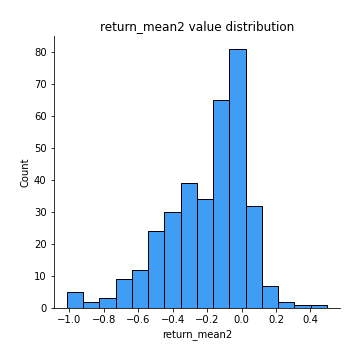
## Feature : return_sd1
- **Feature type** : continous
- **Missing** : 0.0%
- **Unique** : 347
- **Count** :347.0
- **Mean** :2.1110381395787
- **Std** :0.8192626883075553
- **Min** :0.663056758092688
- **25%th Percentile** : 1.5171429938331031
- **50%th Percentile** : 1.901054112977327
- **75%th Percentile** : 2.558730424818579
- **Max** :5.381244311671522

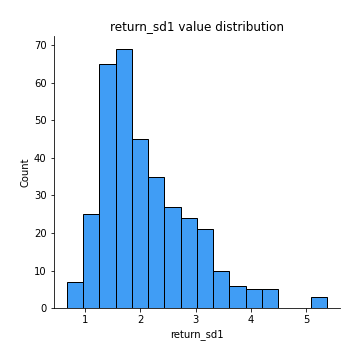
## Feature : return_sd2
- **Feature type** : continous
- **Missing** : 0.0%
- **Unique** : 347
- **Count** :347.0
- **Mean** :3.023292134396262
- **Std** :2.0564815198785165
- **Min** :0.9717084858119118
- **25%th Percentile** : 1.5402860080059388
- **50%th Percentile** : 2.1826092183102985
- **75%th Percentile** : 3.877390798181337
- **Max** :12.043651422162037

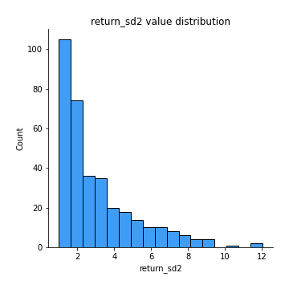
## Feature : return_skew1
- **Feature type** : continous
- **Missing** : 0.0%
- **Unique** : 347
- **Count** :347.0
- **Mean** :-0.2774495018718261
- **Std** :0.638282034913776
- **Min** :-3.5428904448811145
- **25%th Percentile** : -0.552086509848725
- **50%th Percentile** : -0.29676238427842067
- **75%th Percentile** : -0.0737066776215234
- **Max** :3.972992894648776

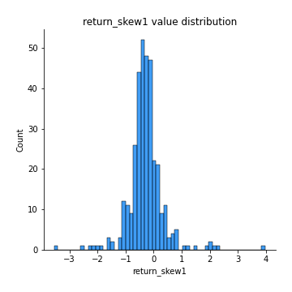
## Feature : return_skew2
- **Feature type** : continous
- **Missing** : 0.0%
- **Unique** : 347
- **Count** :347.0
- **Mean** :-0.49082675705868295
- **Std** :0.8733514391937736
- **Min** :-7.3762354994385335
- **25%th Percentile** : -0.752663861980194
- **50%th Percentile** : -0.39287883608797636
- **75%th Percentile** : -0.12302266889159176
- **Max** :1.9103960635271078

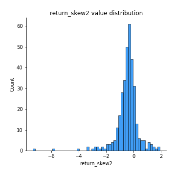
## Feature : return_kurtosis1
- **Feature type** : continous
- **Missing** : 0.0%
- **Unique** : 347
- **Count** :347.0
- **Mean** :3.4162648570188714
- **Std** :4.084587314906703
- **Min** :-0.04952351487835438
- **25%th Percentile** : 1.3752579615939629
- **50%th Percentile** : 2.1842419746695225
- **75%th Percentile** : 3.707284721833627
- **Max** :39.22170564796232

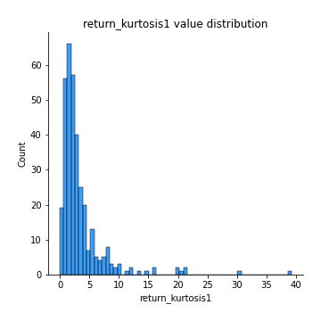
## Feature : return_kurtosis2
- **Feature type** : continous
- **Missing** : 0.0%
- **Unique** : 347
- **Count** :347.0
- **Mean** :4.870384164589105
- **Std** :7.286124527592979
- **Min** :0.024044458596995
- **25%th Percentile** : 1.5675984812174362
- **50%th Percentile** : 2.8508929901451547
- **75%th Percentile** : 5.388165934314919
- **Max** :94.01659180149953

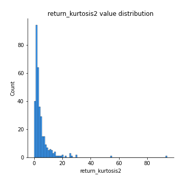
## Feature : return_autocorrelation_lag1_1
- **Feature type** : continous
- **Missing** : 0.0%
- **Unique** : 347
- **Count** :347.0
- **Mean** :-0.0013867530616213485
- **Std** :0.07824965950002424
- **Min** :-0.2965281819004524
- **25%th Percentile** : -0.05074090415342808
- **50%th Percentile** : 0.0018498938144400987
- **75%th Percentile** : 0.04700509189072624
- **Max** :0.24647977096958787

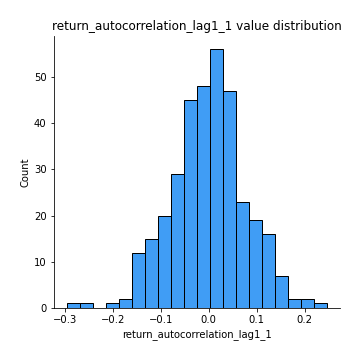
## Feature : return_autocorrelation_lag1_2
- **Feature type** : continous
- **Missing** : 0.0%
- **Unique** : 347
- **Count** :347.0
- **Mean** :0.0009876688821508174
- **Std** :0.07321540909323576
- **Min** :-0.2753733489410122
- **25%th Percentile** : -0.05003327086266407
- **50%th Percentile** : -0.0007535329807287612
- **75%th Percentile** : 0.0458353285201792
- **Max** :0.22573978691501695

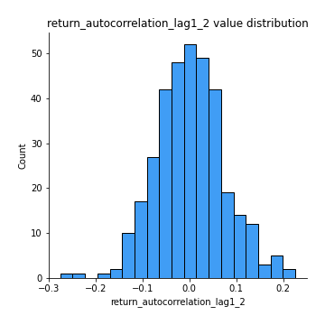
## Feature : return_autocorrelation_lag1_rolling_sd1
- **Feature type** : continous
- **Missing** : 0.0%
- **Unique** : 347
- **Count** :347.0
- **Mean** :0.9767928582540032
- **Std** :0.015848393946287738
- **Min** :0.9248211087908771
- **25%th Percentile** : 0.9646980700367436
- **50%th Percentile** : 0.9805785286594144
- **75%th Percentile** : 0.9911113643092047
- **Max** :0.9976392911093072

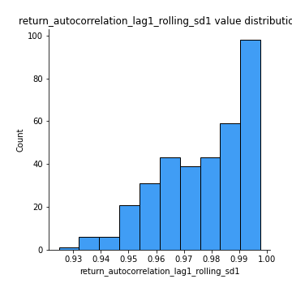
## Feature : return_autocorrelation_lag1_rolling_sd2
- **Feature type** : continous
- **Missing** : 0.0%
- **Unique** : 347
- **Count** :347.0
- **Mean** :0.9737333989783333
- **Std** :0.019788910066122677
- **Min** :0.8849206290342239
- **25%th Percentile** : 0.9605629793271526
- **50%th Percentile** : 0.9766758081061553
- **75%th Percentile** : 0.9918945063460545
- **Max** :0.997436609158347

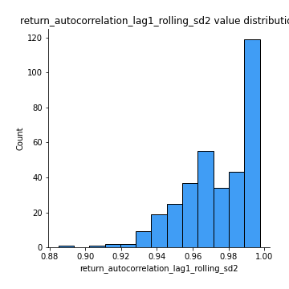
## Feature : price_adf_p_values
- **Feature type** : continous
- **Missing** : 0.0%
- **Unique** : 347
- **Count** :347.0
- **Mean** :0.2459327071802917
- **Std** :0.2928333759076314
- **Min** :4.663774584889525e-06
- **25%th Percentile** : 0.011437926250935284
- **50%th Percentile** : 0.09817795498357068
- **75%th Percentile** : 0.4422430019148341
- **Max** :0.9896812222025775

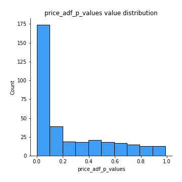
## Feature : return_correlation_ts1_lag_0
- **Feature type** : continous
- **Missing** : 0.0%
- **Unique** : 347
- **Count** :347.0
- **Mean** :0.5196551938140347
- **Std** :0.2625167845081059
- **Min** :-0.47084547315334085
- **25%th Percentile** : 0.3368316151126065
- **50%th Percentile** : 0.5015154297155643
- **75%th Percentile** : 0.7760640716856766
- **Max** :0.9937227277077512

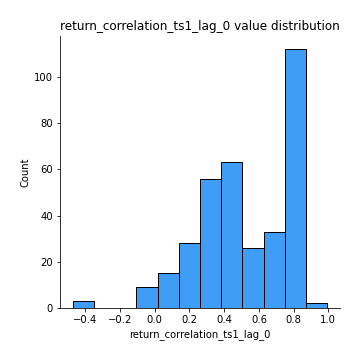
## Feature : return_correlation_ts1_lag_1
- **Feature type** : continous
- **Missing** : 0.0%
- **Unique** : 347
- **Count** :347.0
- **Mean** :0.00613191753596926
- **Std** :0.07279368004288918
- **Min** :-0.34438190131276525
- **25%th Percentile** : -0.04065683565956471
- **50%th Percentile** : 0.0057402729190531515
- **75%th Percentile** : 0.05369801883458743
- **Max** :0.1974857232678374

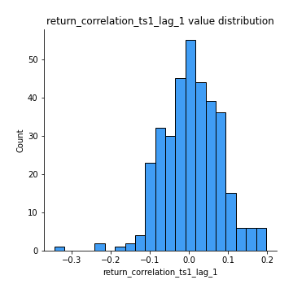
## Feature : return_correlation_ts1_lag_2
- **Feature type** : continous
- **Missing** : 0.0%
- **Unique** : 347
- **Count** :347.0
- **Mean** :-0.0014475141556850352
- **Std** :0.07281365175905187
- **Min** :-0.21537168300082926
- **25%th Percentile** : -0.046743601729077044
- **50%th Percentile** : -0.004641148615865841
- **75%th Percentile** : 0.04159799650139154
- **Max** :0.29037942441582615

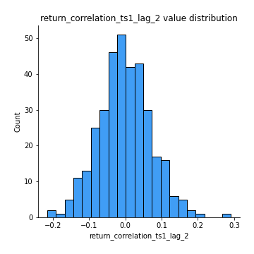
## Feature : return_correlation_ts1_lag_3
- **Feature type** : continous
- **Missing** : 0.0%
- **Unique** : 347
- **Count** :347.0
- **Mean** :0.004123368536998316
- **Std** :0.070744292163124
- **Min** :-0.19641174078655368
- **25%th Percentile** : -0.042469364133120885
- **50%th Percentile** : 0.005384923906508886
- **75%th Percentile** : 0.05050365090579705
- **Max** :0.2244990270368853

## Feature : return_correlation_ts2_lag_1
- **Feature type** : continous
- **Missing** : 0.0%
- **Unique** : 347
- **Count** :347.0
- **Mean** :0.010784654990403987
- **Std** :0.07298007676650323
- **Min** :-0.34010510834531216
- **25%th Percentile** : -0.033150926760718506
- **50%th Percentile** : 0.008219453703338524
- **75%th Percentile** : 0.05887459954989532
- **Max** :0.25289575613132603

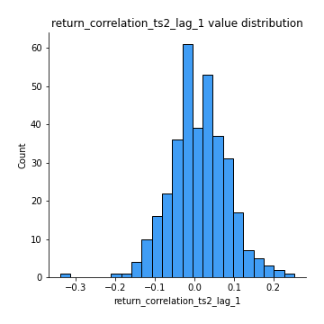
## Feature : return_correlation_ts2_lag_2
- **Feature type** : continous
- **Missing** : 0.0%
- **Unique** : 347
- **Count** :347.0
- **Mean** :-0.008736573865271421
- **Std** :0.07590921497853857
- **Min** :-0.1864270351209042
- **25%th Percentile** : -0.0553945397473476
- **50%th Percentile** : -0.00883836350331627
- **75%th Percentile** : 0.03777527617219238
- **Max** :0.3284349978754629

## Feature : return_correlation_ts2_lag_3
- **Feature type** : continous
- **Missing** : 0.0%
- **Unique** : 347
- **Count** :347.0
- **Mean** :0.00315506215926684
- **Std** :0.07372510488865862
- **Min** :-0.22482527040564462
- **25%th Percentile** : -0.05128784159922431
- **50%th Percentile** : 0.004258007690059118
- **75%th Percentile** : 0.04876600038831973
- **Max** :0.21443994242834458

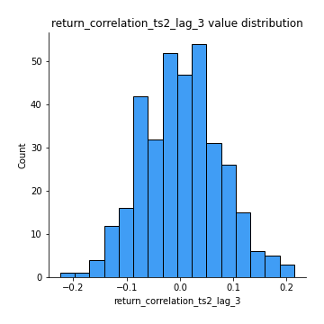
## Feature : durbin_watson_statistic1
- **Feature type** : continous
- **Missing** : 0.0%
- **Unique** : 347
- **Count** :347.0
- **Mean** :1.9766932584282888
- **Std** :0.10760451949464264
- **Min** :1.6837453550141128
- **25%th Percentile** : 1.9127475603321002
- **50%th Percentile** : 1.987137825996268
- **75%th Percentile** : 2.0333241124670995
- **Max** :2.297476091935293

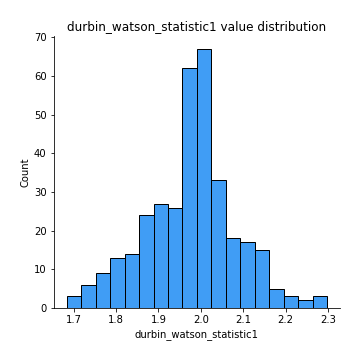
## Feature : durbin_watson_statistic2
- **Feature type** : continous
- **Missing** : 0.0%
- **Unique** : 347
- **Count** :347.0
- **Mean** :1.9853359984844758
- **Std** :0.10318440345797351
- **Min** :1.7140284721882426
- **25%th Percentile** : 1.9257644949092958
- **50%th Percentile** : 1.9951769847244407
- **75%th Percentile** : 2.03526161370782
- **Max** :2.2799466008048475

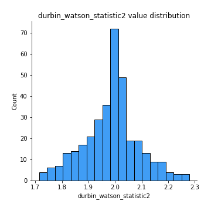
## Feature : co_integration_statistic
- **Feature type** : continous
- **Missing** : 0.0%
- **Unique** : 341
- **Count** :347.0
- **Mean** :0.35505096825131793
- **Std** :0.348155583273196
- **Min** :3.4251330940177255e-05
- **25%th Percentile** : 0.0274467025356573
- **50%th Percentile** : 0.2386902781498606
- **75%th Percentile** : 0.6323498759074225
- **Max** :1.0

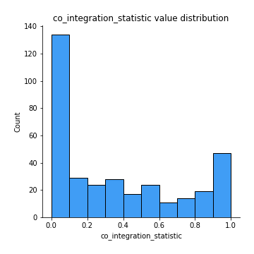
## Feature : price2_granger_cause_price1
- **Feature type** : continous
- **Missing** : 0.0%
- **Unique** : 347
- **Count** :347.0
- **Mean** :0.22746760251771797
- **Std** :0.2763589452566917
- **Min** :7.9540181104884915e-19
- **25%th Percentile** : 0.009922871746881438
- **50%th Percentile** : 0.0978903410549677
- **75%th Percentile** : 0.38246090217774953
- **Max** :0.9878403006943852

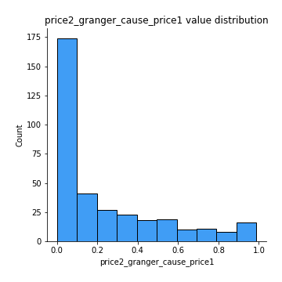
## Feature : price1_granger_cause_price2
- **Feature type** : continous
- **Missing** : 0.0%
- **Unique** : 347
- **Count** :347.0
- **Mean** :0.18630870858156787
- **Std** :0.2426587465667235
- **Min** :3.175629539732913e-20
- **25%th Percentile** : 0.009683918259544021
- **50%th Percentile** : 0.06520198020412991
- **75%th Percentile** : 0.29346220037723225
- **Max** :0.9813994870423349

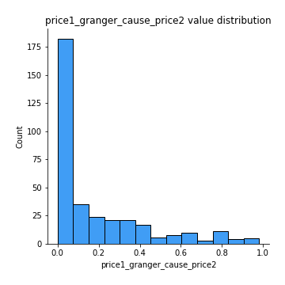

[<< Go back](../README.md)
