# Exploratory Data Analysis

[<< Go back](../README.md)
## Feature : target
- **Feature type** : categorical
- **Missing** : 0.0%
- **Unique** : 2
- **Count** :347
- **Unique** :2
- **Top** :simulated
- **Freq** :176

## Feature : standardised_price_mean1
- **Feature type** : continous
- **Missing** : 0.0%
- **Unique** : 347
- **Count** :347.0
- **Mean** :122.04966265451853
- **Std** :31.98052268979998
- **Min** :68.55248182131608
- **25%th Percentile** : 101.00281538209295
- **50%th Percentile** : 117.59343469762631
- **75%th Percentile** : 134.11221599208915
- **Max** :413.24603005372313

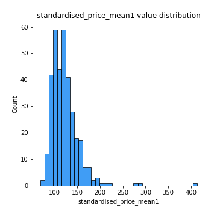
## Feature : standardised_price_mean2
- **Feature type** : continous
- **Missing** : 0.0%
- **Unique** : 347
- **Count** :347.0
- **Mean** :88.97183975005075
- **Std** :23.432018321459125
- **Min** :49.803794560516586
- **25%th Percentile** : 68.58621620347193
- **50%th Percentile** : 89.94794685496348
- **75%th Percentile** : 104.48136369845375
- **Max** :208.44737122172268

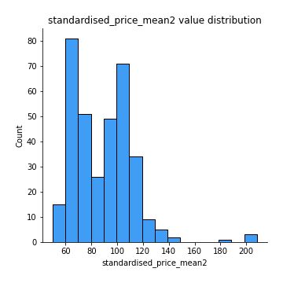
## Feature : return_mean1
- **Feature type** : continous
- **Missing** : 0.0%
- **Unique** : 347
- **Count** :347.0
- **Mean** :0.10179851143919681
- **Std** :0.18653032849309956
- **Min** :-0.3056964745781991
- **25%th Percentile** : -0.02544915020575516
- **50%th Percentile** : 0.07005078459877367
- **75%th Percentile** : 0.20471727911502474
- **Max** :0.9569601315328609

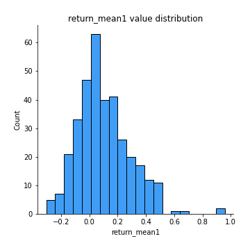
## Feature : return_mean2
- **Feature type** : continous
- **Missing** : 0.0%
- **Unique** : 347
- **Count** :347.0
- **Mean** :-0.1873498898486246
- **Std** :0.25044298820041233
- **Min** :-1.1830747243735604
- **25%th Percentile** : -0.3544325483603423
- **50%th Percentile** : -0.14132793851660408
- **75%th Percentile** : -0.010720067033798856
- **Max** :0.803170793492448

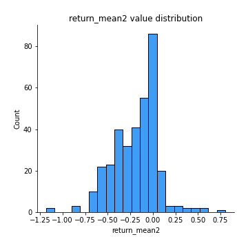
## Feature : return_sd1
- **Feature type** : continous
- **Missing** : 0.0%
- **Unique** : 347
- **Count** :347.0
- **Mean** :2.1682758202908676
- **Std** :0.8249557341304264
- **Min** :0.6197072147690552
- **25%th Percentile** : 1.5354808873849692
- **50%th Percentile** : 1.9431770986933607
- **75%th Percentile** : 2.6622224865629915
- **Max** :5.097360428920912

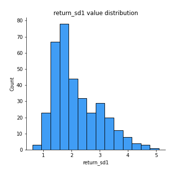
## Feature : return_sd2
- **Feature type** : continous
- **Missing** : 0.0%
- **Unique** : 347
- **Count** :347.0
- **Mean** :3.1422758051232202
- **Std** :2.1480391434078703
- **Min** :0.9110307827232375
- **25%th Percentile** : 1.5815102173131756
- **50%th Percentile** : 2.2256732290372394
- **75%th Percentile** : 4.186109032662149
- **Max** :11.471037908918168

## Feature : return_skew1
- **Feature type** : continous
- **Missing** : 0.0%
- **Unique** : 347
- **Count** :347.0
- **Mean** :-0.32239188216362974
- **Std** :0.7021934080749309
- **Min** :-4.499550695415954
- **25%th Percentile** : -0.5931342600578395
- **50%th Percentile** : -0.30384058436830236
- **75%th Percentile** : -0.08994916783145096
- **Max** :3.972992894648776

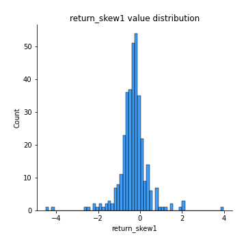
## Feature : return_skew2
- **Feature type** : continous
- **Missing** : 0.0%
- **Unique** : 347
- **Count** :347.0
- **Mean** :-0.5364815913749471
- **Std** :0.9821551520198694
- **Min** :-7.3762354994385335
- **25%th Percentile** : -0.7998026335986284
- **50%th Percentile** : -0.40127815788547927
- **75%th Percentile** : -0.1308614657405683
- **Max** :1.9103960635271078

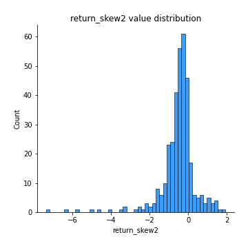
## Feature : return_kurtosis1
- **Feature type** : continous
- **Missing** : 0.0%
- **Unique** : 347
- **Count** :347.0
- **Mean** :3.736152560448978
- **Std** :4.88360394971495
- **Min** :0.21552594217650656
- **25%th Percentile** : 1.4373527361097644
- **50%th Percentile** : 2.2437702817893035
- **75%th Percentile** : 4.001463254230501
- **Max** :43.33367798924404

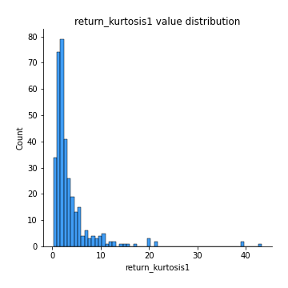
## Feature : return_kurtosis2
- **Feature type** : continous
- **Missing** : 0.0%
- **Unique** : 347
- **Count** :347.0
- **Mean** :5.307761902887167
- **Std** :8.70764905173603
- **Min** :0.06336313829977724
- **25%th Percentile** : 1.67031162785848
- **50%th Percentile** : 3.118482522856254
- **75%th Percentile** : 5.234719629029655
- **Max** :94.01659180149953

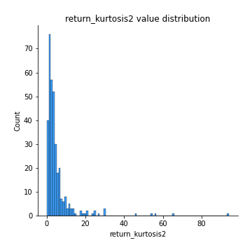
## Feature : return_autocorrelation_lag1_1
- **Feature type** : continous
- **Missing** : 0.0%
- **Unique** : 347
- **Count** :347.0
- **Mean** :-0.012764114317671275
- **Std** :0.0694889989839586
- **Min** :-0.18756193283808478
- **25%th Percentile** : -0.061261890445464554
- **50%th Percentile** : -0.013981042363745448
- **75%th Percentile** : 0.038449247546193874
- **Max** :0.193801230744594

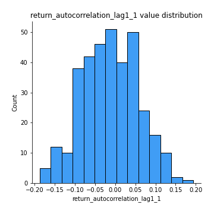
## Feature : return_autocorrelation_lag1_2
- **Feature type** : continous
- **Missing** : 0.0%
- **Unique** : 347
- **Count** :347.0
- **Mean** :-0.009780507314103019
- **Std** :0.07536434773431842
- **Min** :-0.21323954052008373
- **25%th Percentile** : -0.05557044330450929
- **50%th Percentile** : -0.005882577122842147
- **75%th Percentile** : 0.039757973008695484
- **Max** :0.27345898481335823

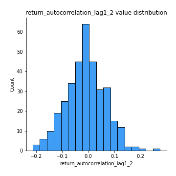
## Feature : return_autocorrelation_lag1_rolling_sd1
- **Feature type** : continous
- **Missing** : 0.0%
- **Unique** : 347
- **Count** :347.0
- **Mean** :0.9771495632922507
- **Std** :0.0165651798113792
- **Min** :0.9268739413055933
- **25%th Percentile** : 0.9651422261903955
- **50%th Percentile** : 0.9815625535340105
- **75%th Percentile** : 0.9915390163652926
- **Max** :0.9967503163520178

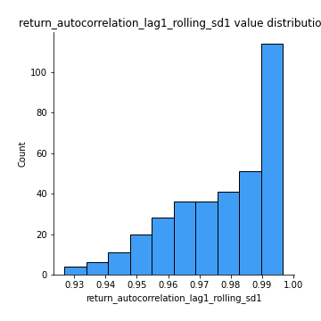
## Feature : return_autocorrelation_lag1_rolling_sd2
- **Feature type** : continous
- **Missing** : 0.0%
- **Unique** : 347
- **Count** :347.0
- **Mean** :0.9751647133127477
- **Std** :0.01916941162793553
- **Min** :0.8849206290342239
- **25%th Percentile** : 0.9629145227049041
- **50%th Percentile** : 0.9809441313010725
- **75%th Percentile** : 0.991646660985342
- **Max** :0.997834837395444

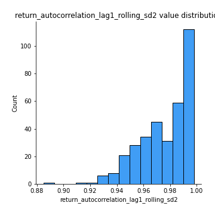
## Feature : price_adf_p_values
- **Feature type** : continous
- **Missing** : 0.0%
- **Unique** : 347
- **Count** :347.0
- **Mean** :0.2582743278399177
- **Std** :0.29717127711808516
- **Min** :4.663774584889525e-06
- **25%th Percentile** : 0.012735155020787321
- **50%th Percentile** : 0.1275894419987172
- **75%th Percentile** : 0.3969311664540346
- **Max** :0.9859008102854933

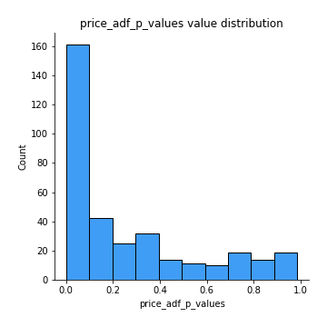
## Feature : return_correlation_ts1_lag_0
- **Feature type** : continous
- **Missing** : 0.0%
- **Unique** : 347
- **Count** :347.0
- **Mean** :0.537475427102593
- **Std** :0.26495044100197096
- **Min** :-0.5586179747269425
- **25%th Percentile** : 0.33916581696612225
- **50%th Percentile** : 0.5739342917033775
- **75%th Percentile** : 0.7765825141035583
- **Max** :0.9937227277077512

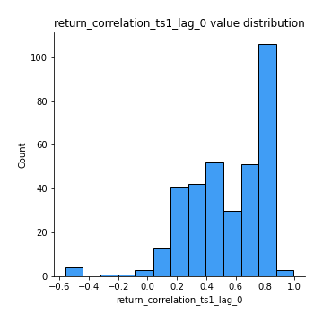
## Feature : return_correlation_ts1_lag_1
- **Feature type** : continous
- **Missing** : 0.0%
- **Unique** : 347
- **Count** :347.0
- **Mean** :-0.003456501303537658
- **Std** :0.06931682009206624
- **Min** :-0.1858696861607103
- **25%th Percentile** : -0.05800219450228511
- **50%th Percentile** : -0.004214886178495931
- **75%th Percentile** : 0.045875578862806854
- **Max** :0.24372374412465173

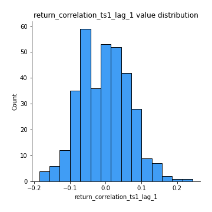
## Feature : return_correlation_ts1_lag_2
- **Feature type** : continous
- **Missing** : 0.0%
- **Unique** : 347
- **Count** :347.0
- **Mean** :-0.005558042406353677
- **Std** :0.07110647961783396
- **Min** :-0.23773287946028485
- **25%th Percentile** : -0.04594791653726718
- **50%th Percentile** : -0.003503575918819346
- **75%th Percentile** : 0.03913643603274233
- **Max** :0.2391521260689492

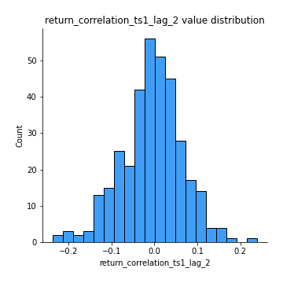
## Feature : return_correlation_ts1_lag_3
- **Feature type** : continous
- **Missing** : 0.0%
- **Unique** : 347
- **Count** :347.0
- **Mean** :0.016250112553772313
- **Std** :0.07829672457024357
- **Min** :-0.2612122752031743
- **25%th Percentile** : -0.033040229626072656
- **50%th Percentile** : 0.017641586809211393
- **75%th Percentile** : 0.06496460080656172
- **Max** :0.2787493100200034

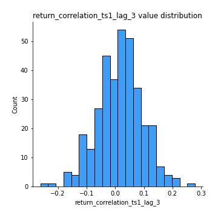
## Feature : return_correlation_ts2_lag_1
- **Feature type** : continous
- **Missing** : 0.0%
- **Unique** : 347
- **Count** :347.0
- **Mean** :-0.0014714866063654597
- **Std** :0.07183473073872056
- **Min** :-0.19706624897754305
- **25%th Percentile** : -0.04928468010653343
- **50%th Percentile** : 0.003783178842708509
- **75%th Percentile** : 0.04340627715334311
- **Max** :0.3425036902091001

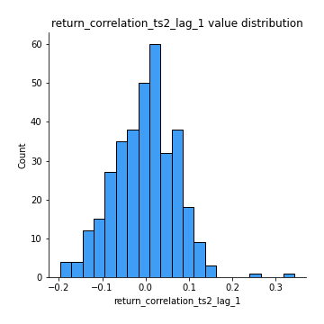
## Feature : return_correlation_ts2_lag_2
- **Feature type** : continous
- **Missing** : 0.0%
- **Unique** : 347
- **Count** :347.0
- **Mean** :-0.015258089655897625
- **Std** :0.07407235589124367
- **Min** :-0.25071567314310245
- **25%th Percentile** : -0.06485083133022762
- **50%th Percentile** : -0.01344094463792302
- **75%th Percentile** : 0.032175369967278225
- **Max** :0.20369712362149175

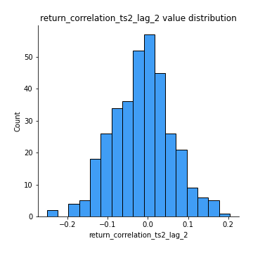
## Feature : return_correlation_ts2_lag_3
- **Feature type** : continous
- **Missing** : 0.0%
- **Unique** : 347
- **Count** :347.0
- **Mean** :0.016600057989989803
- **Std** :0.07588431874962856
- **Min** :-0.2296619425661262
- **25%th Percentile** : -0.0316555493903917
- **50%th Percentile** : 0.01857853448803866
- **75%th Percentile** : 0.0680119229480214
- **Max** :0.25742715027694224

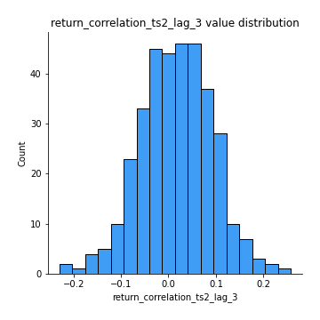
## Feature : durbin_watson_statistic1
- **Feature type** : continous
- **Missing** : 0.0%
- **Unique** : 347
- **Count** :347.0
- **Mean** :1.9942293931695827
- **Std** :0.10352045593276468
- **Min** :1.6826691132888938
- **25%th Percentile** : 1.9418373417106212
- **50%th Percentile** : 1.9973155885991347
- **75%th Percentile** : 2.049177449048621
- **Max** :2.297476091935293

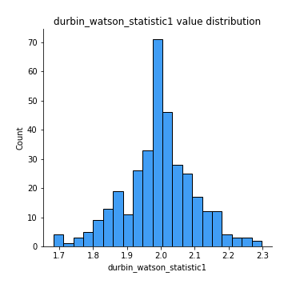
## Feature : durbin_watson_statistic2
- **Feature type** : continous
- **Missing** : 0.0%
- **Unique** : 347
- **Count** :347.0
- **Mean** :1.9864618696347436
- **Std** :0.10988951111180367
- **Min** :1.655083153874462
- **25%th Percentile** : 1.9316962486645208
- **50%th Percentile** : 1.9956221615551561
- **75%th Percentile** : 2.030402424628269
- **Max** :2.321841470633343

## Feature : co_integration_statistic
- **Feature type** : continous
- **Missing** : 0.0%
- **Unique** : 343
- **Count** :347.0
- **Mean** :0.3914316497887219
- **Std** :0.34680987977244243
- **Min** :3.4251330940177255e-05
- **25%th Percentile** : 0.05091317832438524
- **50%th Percentile** : 0.31127045057295866
- **75%th Percentile** : 0.7002037514724821
- **Max** :1.0

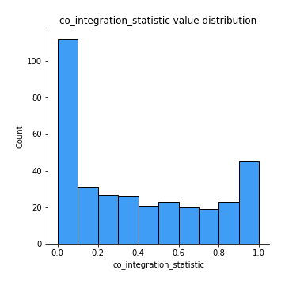
## Feature : price2_granger_cause_price1
- **Feature type** : continous
- **Missing** : 0.0%
- **Unique** : 347
- **Count** :347.0
- **Mean** :0.21858183738962705
- **Std** :0.27278144214382083
- **Min** :7.972255118254182e-15
- **25%th Percentile** : 0.009261641806157184
- **50%th Percentile** : 0.07751353127577607
- **75%th Percentile** : 0.3626643616477445
- **Max** :0.9965361100491491

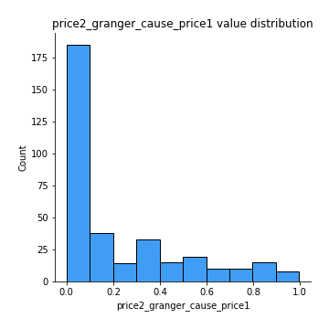
## Feature : price1_granger_cause_price2
- **Feature type** : continous
- **Missing** : 0.0%
- **Unique** : 347
- **Count** :347.0
- **Mean** :0.18336906288972551
- **Std** :0.252560383216698
- **Min** :9.762906491933244e-17
- **25%th Percentile** : 0.009166926437416355
- **50%th Percentile** : 0.06424311255389537
- **75%th Percentile** : 0.26568657443106314
- **Max** :0.9813994870423349

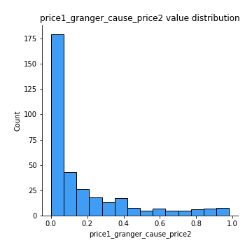

[<< Go back](../README.md)
