# Summary of 3_Linear

[<< Go back](../README.md)

## Logistic Regression (Linear)
- **n_jobs**: -1
- **explain_level**: 2

## Validation
 - **validation_type**: split
 - **train_ratio**: 0.75
 - **shuffle**: True
 - **stratify**: True

## Optimized metric
accuracy

## Training time

4.9 seconds

## Metric details
|           |     score |     threshold |
|:----------|----------:|--------------:|
| logloss   | 0.0756863 | nan           |
| auc       | 0.989958  | nan           |
| f1        | 0.988235  |   0.503108    |
| accuracy  | 0.988506  |   0.503108    |
| precision | 1         |   0.503108    |
| recall    | 1         |   4.50095e-05 |
| mcc       | 0.977261  |   0.503108    |

## Confusion matrix (at threshold=0.503108)
|                      |   Predicted as real |   Predicted as simulated |
|:---------------------|--------------------:|-------------------------:|
| Labeled as real      |                  44 |                        0 |
| Labeled as simulated |                   1 |                       42 |

## Learning curves
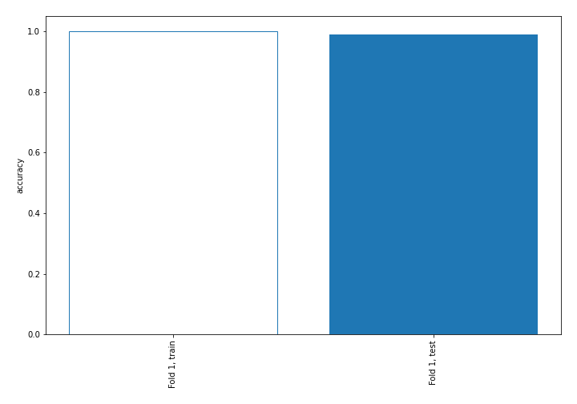

## Coefficients
| feature                                 |   Learner_1 |
|:----------------------------------------|------------:|
| return_autocorrelation_lag1_rolling_sd2 |  1.48755    |
| return_sd2                              |  1.40994    |
| return_autocorrelation_lag1_rolling_sd1 |  1.35264    |
| standardised_price_mean1                |  0.868777   |
| co_integration_statistic                |  0.659661   |
| price_adf_p_values                      |  0.586921   |
| return_sd1                              |  0.328487   |
| durbin_watson_statistic2                |  0.263976   |
| return_mean1                            |  0.248357   |
| price1_granger_cause_price2             |  0.103688   |
| price2_granger_cause_price1             |  0.076395   |
| return_autocorrelation_lag1_2           |  0.0429864  |
| return_correlation_ts1_lag_1            | -0.0044653  |
| return_skew2                            | -0.00522024 |
| return_correlation_ts1_lag_2            | -0.00822786 |
| return_autocorrelation_lag1_1           | -0.0279846  |
| return_correlation_ts2_lag_2            | -0.0416897  |
| return_correlation_ts2_lag_3            | -0.0456134  |
| return_correlation_ts1_lag_3            | -0.0484211  |
| return_correlation_ts2_lag_1            | -0.0632221  |
| return_kurtosis1                        | -0.126824   |
| return_kurtosis2                        | -0.133588   |
| durbin_watson_statistic1                | -0.146463   |
| return_mean2                            | -0.427898   |
| return_skew1                            | -0.432208   |
| return_correlation_ts1_lag_0            | -0.505213   |
| intercept                               | -0.677442   |
| standardised_price_mean2                | -1.9091     |

## Permutation-based Importance
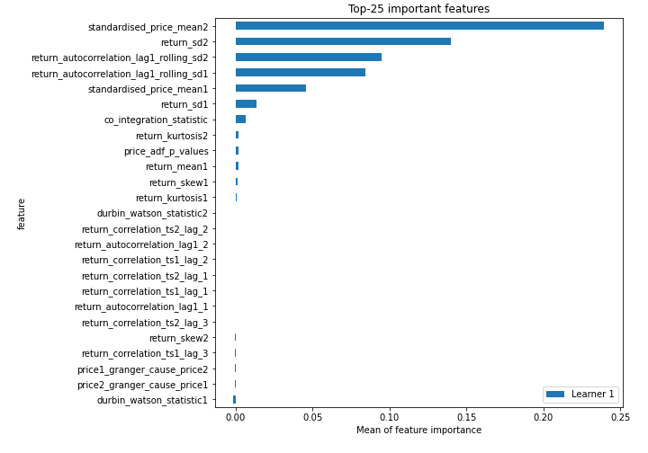
## Confusion Matrix

## Normalized Confusion Matrix

## ROC Curve

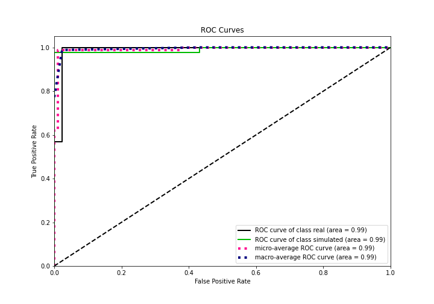

## Kolmogorov-Smirnov Statistic

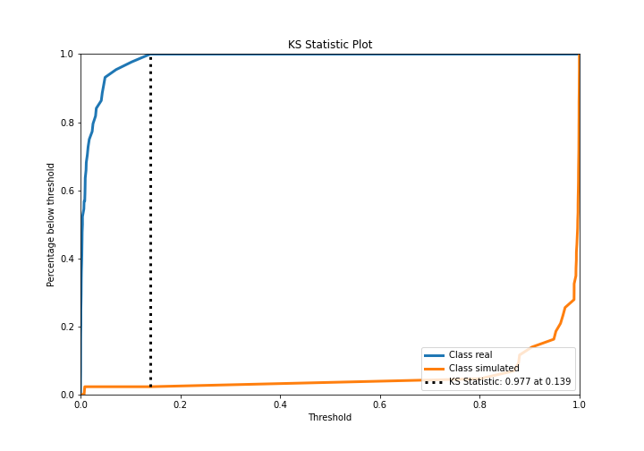

## Precision-Recall Curve

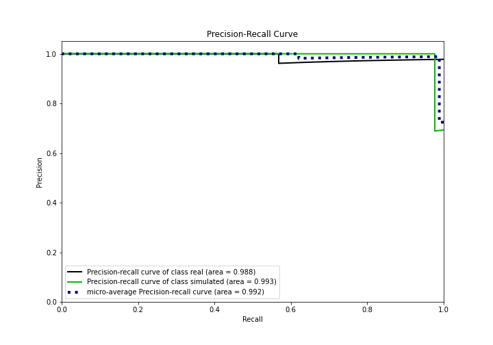

## Calibration Curve

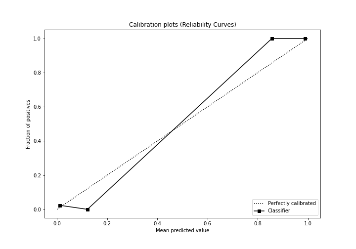

## Cumulative Gains Curve

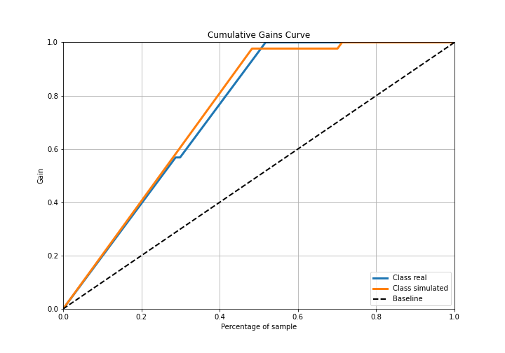

## Lift Curve

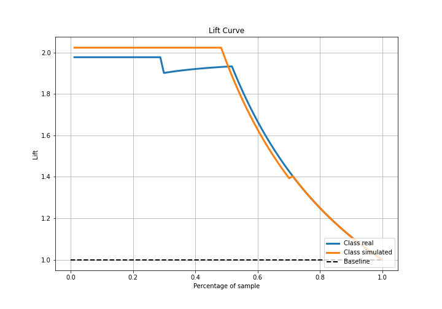

## SHAP Importance
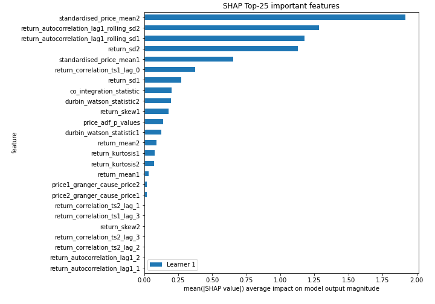

## SHAP Dependence plots

### Dependence (Fold 1)
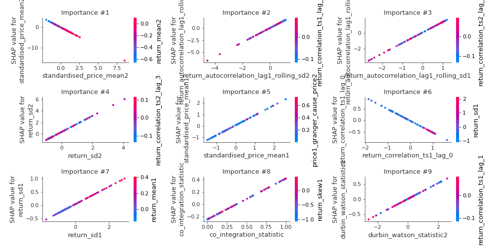

## SHAP Decision plots

### Top-10 Worst decisions for class 0 (Fold 1)
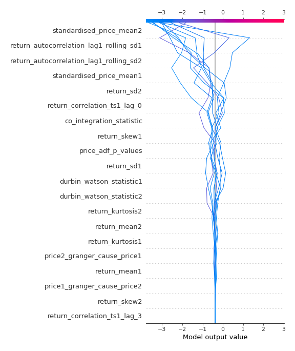
### Top-10 Best decisions for class 0 (Fold 1)
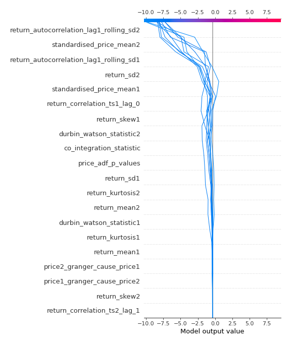
### Top-10 Worst decisions for class 1 (Fold 1)
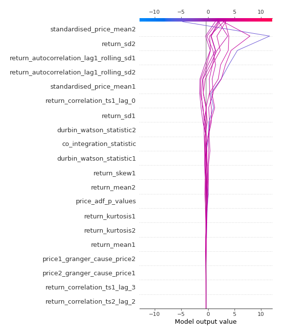
### Top-10 Best decisions for class 1 (Fold 1)
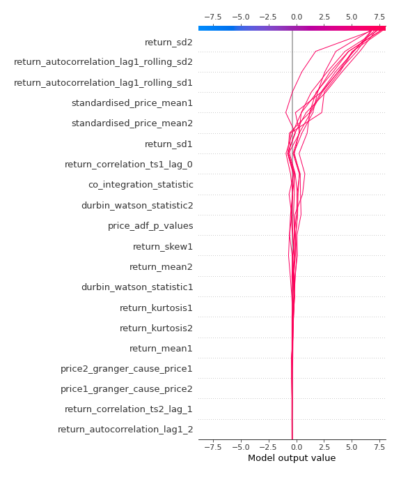

[<< Go back](../README.md)
