# Exploratory Data Analysis

[<< Go back](../README.md)
## Feature : target
- **Feature type** : categorical
- **Missing** : 0.0%
- **Unique** : 2
- **Count** :347
- **Unique** :2
- **Top** :real
- **Freq** :176

## Feature : standardised_price_mean1
- **Feature type** : continous
- **Missing** : 0.0%
- **Unique** : 347
- **Count** :347.0
- **Mean** :119.59699287097702
- **Std** :25.753221081571485
- **Min** :61.90028384066058
- **25%th Percentile** : 101.03560777853863
- **50%th Percentile** : 116.59694751713111
- **75%th Percentile** : 132.06256190695478
- **Max** :226.56755358572238

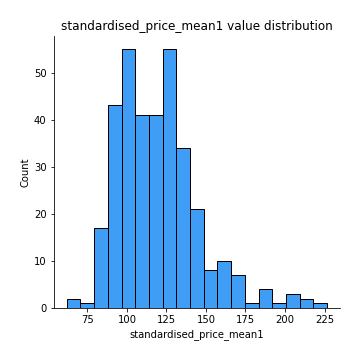
## Feature : standardised_price_mean2
- **Feature type** : continous
- **Missing** : 0.0%
- **Unique** : 347
- **Count** :347.0
- **Mean** :88.06422414607692
- **Std** :21.948007733034867
- **Min** :49.51544998783408
- **25%th Percentile** : 69.57662117036269
- **50%th Percentile** : 89.59114164510291
- **75%th Percentile** : 102.6867498107764
- **Max** :254.65009813135174

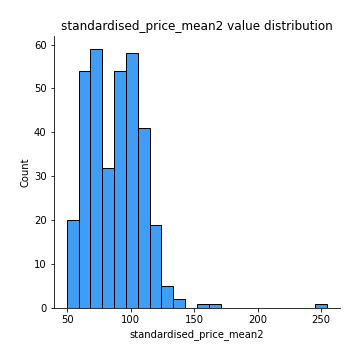
## Feature : return_mean1
- **Feature type** : continous
- **Missing** : 0.0%
- **Unique** : 347
- **Count** :347.0
- **Mean** :0.08744022555159904
- **Std** :0.18221071525563085
- **Min** :-0.31570612099423523
- **25%th Percentile** : -0.028335614521701948
- **50%th Percentile** : 0.06002412094022224
- **75%th Percentile** : 0.1815952244125203
- **Max** :0.6887107199034683

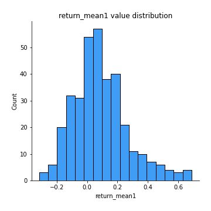
## Feature : return_mean2
- **Feature type** : continous
- **Missing** : 0.0%
- **Unique** : 347
- **Count** :347.0
- **Mean** :-0.20984977492530812
- **Std** :0.26262452093394906
- **Min** :-1.3258376979860673
- **25%th Percentile** : -0.37898704502098635
- **50%th Percentile** : -0.13409090985467434
- **75%th Percentile** : -0.01940168689772409
- **Max** :0.7484913460266786

## Feature : return_sd1
- **Feature type** : continous
- **Missing** : 0.0%
- **Unique** : 347
- **Count** :347.0
- **Mean** :2.124112070679715
- **Std** :0.835186964249741
- **Min** :0.3839820758642981
- **25%th Percentile** : 1.508495119062063
- **50%th Percentile** : 1.97555400184529
- **75%th Percentile** : 2.62985804644451
- **Max** :5.113544897462365

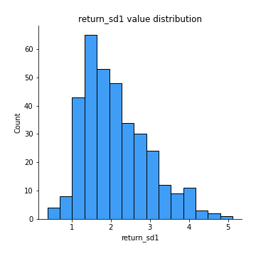
## Feature : return_sd2
- **Feature type** : continous
- **Missing** : 0.0%
- **Unique** : 347
- **Count** :347.0
- **Mean** :3.0425971034316732
- **Std** :2.0667122642943045
- **Min** :0.8198573277426641
- **25%th Percentile** : 1.5446307163415045
- **50%th Percentile** : 2.1603395046243152
- **75%th Percentile** : 3.9832487433772443
- **Max** :11.397106076475074

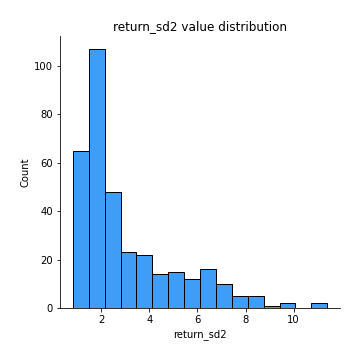
## Feature : return_skew1
- **Feature type** : continous
- **Missing** : 0.0%
- **Unique** : 347
- **Count** :347.0
- **Mean** :-0.3718877161111583
- **Std** :0.6826175512812062
- **Min** :-4.499550695415954
- **25%th Percentile** : -0.6113352208740918
- **50%th Percentile** : -0.3127997845134767
- **75%th Percentile** : -0.0817202534133501
- **Max** :2.0093706023588216

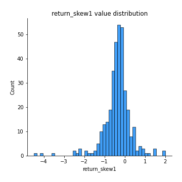
## Feature : return_skew2
- **Feature type** : continous
- **Missing** : 0.0%
- **Unique** : 347
- **Count** :347.0
- **Mean** :-0.5705836627167954
- **Std** :0.9727286157441636
- **Min** :-7.3762354994385335
- **25%th Percentile** : -0.839127135553013
- **50%th Percentile** : -0.47465813942838797
- **75%th Percentile** : -0.14750954996456
- **Max** :2.666344777655694

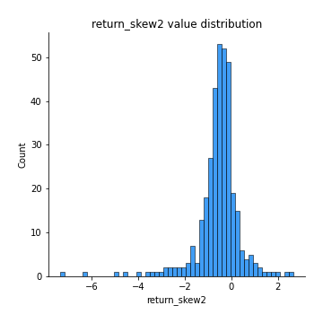
## Feature : return_kurtosis1
- **Feature type** : continous
- **Missing** : 0.0%
- **Unique** : 347
- **Count** :347.0
- **Mean** :3.715399576903722
- **Std** :4.5132824597490275
- **Min** :-0.04116168923354735
- **25%th Percentile** : 1.4810530256867978
- **50%th Percentile** : 2.3372312705032283
- **75%th Percentile** : 4.159197392785906
- **Max** :43.33367798924404

## Feature : return_kurtosis2
- **Feature type** : continous
- **Missing** : 0.0%
- **Unique** : 347
- **Count** :347.0
- **Mean** :5.352712098670461
- **Std** :8.346319889254431
- **Min** :0.024044458596995
- **25%th Percentile** : 1.751772866860258
- **50%th Percentile** : 3.061648720820695
- **75%th Percentile** : 5.860731661473454
- **Max** :94.01659180149953

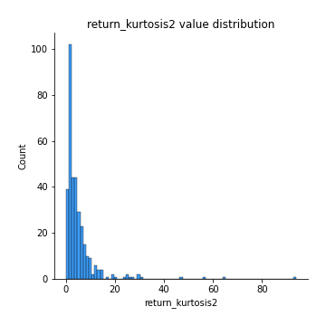
## Feature : return_autocorrelation_lag1_1
- **Feature type** : continous
- **Missing** : 0.0%
- **Unique** : 347
- **Count** :347.0
- **Mean** :-0.009089463060276831
- **Std** :0.07675213417327859
- **Min** :-0.22917402171899445
- **25%th Percentile** : -0.05430724197905861
- **50%th Percentile** : -0.007128441803621995
- **75%th Percentile** : 0.03674649239993963
- **Max** :0.2577090226395258

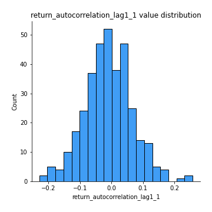
## Feature : return_autocorrelation_lag1_2
- **Feature type** : continous
- **Missing** : 0.0%
- **Unique** : 347
- **Count** :347.0
- **Mean** :-0.0054727867876547395
- **Std** :0.0803437388151823
- **Min** :-0.2200988958113095
- **25%th Percentile** : -0.05436705181728835
- **50%th Percentile** : -0.004355202957026714
- **75%th Percentile** : 0.046115906010354944
- **Max** :0.22958504787259576

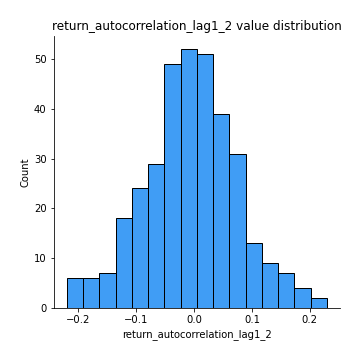
## Feature : return_autocorrelation_lag1_rolling_sd1
- **Feature type** : continous
- **Missing** : 0.0%
- **Unique** : 347
- **Count** :347.0
- **Mean** :0.976558338961246
- **Std** :0.01656968651611041
- **Min** :0.9268739413055933
- **25%th Percentile** : 0.9644418313574188
- **50%th Percentile** : 0.9805316921226083
- **75%th Percentile** : 0.9916807275769924
- **Max** :0.9971395225506112

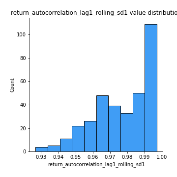
## Feature : return_autocorrelation_lag1_rolling_sd2
- **Feature type** : continous
- **Missing** : 0.0%
- **Unique** : 347
- **Count** :347.0
- **Mean** :0.9742087133074443
- **Std** :0.020092060090678
- **Min** :0.8849206290342239
- **25%th Percentile** : 0.9593316424663425
- **50%th Percentile** : 0.9804999472912351
- **75%th Percentile** : 0.9917612573715573
- **Max** :0.9980219580384151

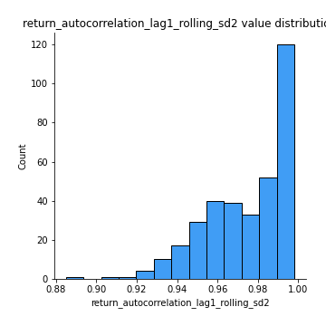
## Feature : price_adf_p_values
- **Feature type** : continous
- **Missing** : 0.0%
- **Unique** : 347
- **Count** :347.0
- **Mean** :0.25112422336422774
- **Std** :0.28666488198556256
- **Min** :4.663774584889525e-06
- **25%th Percentile** : 0.01214681506964942
- **50%th Percentile** : 0.1275894419987172
- **75%th Percentile** : 0.4390520210390775
- **Max** :0.9730269853943961

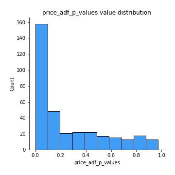
## Feature : return_correlation_ts1_lag_0
- **Feature type** : continous
- **Missing** : 0.0%
- **Unique** : 347
- **Count** :347.0
- **Mean** :0.5179632342595104
- **Std** :0.28703877145336215
- **Min** :-0.6669810891560876
- **25%th Percentile** : 0.32972240884107623
- **50%th Percentile** : 0.5392648975376874
- **75%th Percentile** : 0.7778464553356741
- **Max** :0.9937227277077512

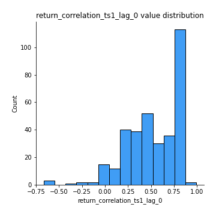
## Feature : return_correlation_ts1_lag_1
- **Feature type** : continous
- **Missing** : 0.0%
- **Unique** : 347
- **Count** :347.0
- **Mean** :0.0006904879678246756
- **Std** :0.07043869281073788
- **Min** :-0.19845571879738055
- **25%th Percentile** : -0.04648204463202163
- **50%th Percentile** : 0.0007982593805520722
- **75%th Percentile** : 0.04395142834885544
- **Max** :0.21183202270815574

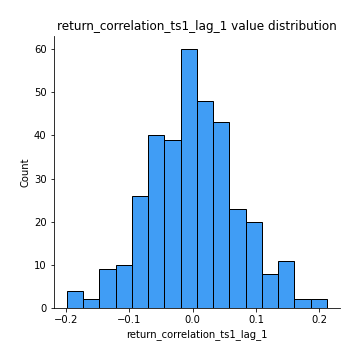
## Feature : return_correlation_ts1_lag_2
- **Feature type** : continous
- **Missing** : 0.0%
- **Unique** : 347
- **Count** :347.0
- **Mean** :-0.011421838077133702
- **Std** :0.07510159942798283
- **Min** :-0.30275439480788285
- **25%th Percentile** : -0.05444105961187609
- **50%th Percentile** : -0.0064971847165958664
- **75%th Percentile** : 0.03528984367699077
- **Max** :0.275253967636566

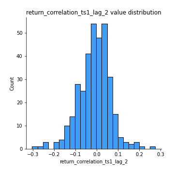
## Feature : return_correlation_ts1_lag_3
- **Feature type** : continous
- **Missing** : 0.0%
- **Unique** : 347
- **Count** :347.0
- **Mean** :0.011352938370418791
- **Std** :0.0791219547614924
- **Min** :-0.23215798857346542
- **25%th Percentile** : -0.03593909578056616
- **50%th Percentile** : 0.007856269467648365
- **75%th Percentile** : 0.06658807015625007
- **Max** :0.23738158434398743

## Feature : return_correlation_ts2_lag_1
- **Feature type** : continous
- **Missing** : 0.0%
- **Unique** : 347
- **Count** :347.0
- **Mean** :0.0032634094566440864
- **Std** :0.08032857650030614
- **Min** :-0.2630450780619017
- **25%th Percentile** : -0.05037253086314242
- **50%th Percentile** : 0.008219453703338524
- **75%th Percentile** : 0.05075079393632928
- **Max** :0.3425036902091001

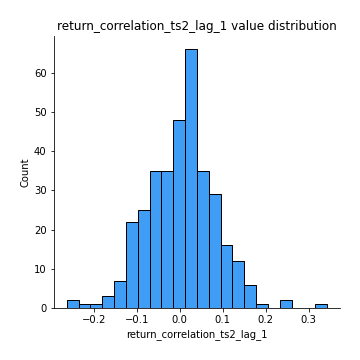
## Feature : return_correlation_ts2_lag_2
- **Feature type** : continous
- **Missing** : 0.0%
- **Unique** : 347
- **Count** :347.0
- **Mean** :-0.01676726001689386
- **Std** :0.07962316738405704
- **Min** :-0.2738821266937493
- **25%th Percentile** : -0.0629902050936629
- **50%th Percentile** : -0.014538451300807793
- **75%th Percentile** : 0.03259663990914786
- **Max** :0.3344136879303069

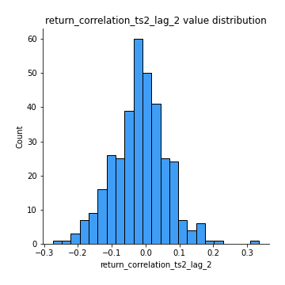
## Feature : return_correlation_ts2_lag_3
- **Feature type** : continous
- **Missing** : 0.0%
- **Unique** : 347
- **Count** :347.0
- **Mean** :0.0098202909100921
- **Std** :0.07244302408978888
- **Min** :-0.20012519642784943
- **25%th Percentile** : -0.03494206087530613
- **50%th Percentile** : 0.010527268755924905
- **75%th Percentile** : 0.06323389562757395
- **Max** :0.22104840901592931

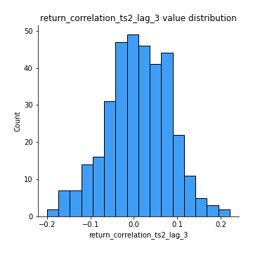
## Feature : durbin_watson_statistic1
- **Feature type** : continous
- **Missing** : 0.0%
- **Unique** : 347
- **Count** :347.0
- **Mean** :1.984895925556351
- **Std** :0.10225393459172952
- **Min** :1.6581618929622717
- **25%th Percentile** : 1.93480544099317
- **50%th Percentile** : 1.9896910903820928
- **75%th Percentile** : 2.032179825326014
- **Max** :2.2967797839453623

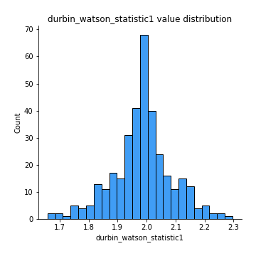
## Feature : durbin_watson_statistic2
- **Feature type** : continous
- **Missing** : 0.0%
- **Unique** : 347
- **Count** :347.0
- **Mean** :1.9848097672824734
- **Std** :0.10377103659800084
- **Min** :1.7127384028456627
- **25%th Percentile** : 1.9318614574115518
- **50%th Percentile** : 1.9931319574334219
- **75%th Percentile** : 2.027782919917545
- **Max** :2.331087464801888

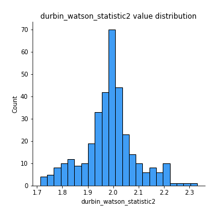
## Feature : co_integration_statistic
- **Feature type** : continous
- **Missing** : 0.0%
- **Unique** : 342
- **Count** :347.0
- **Mean** :0.3816409540415814
- **Std** :0.35493705573492834
- **Min** :3.4251330940177255e-05
- **25%th Percentile** : 0.03835376587953591
- **50%th Percentile** : 0.2741826568868472
- **75%th Percentile** : 0.7033959994151844
- **Max** :1.0

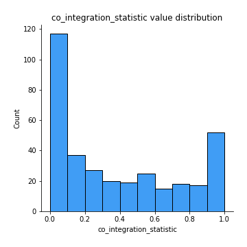
## Feature : price2_granger_cause_price1
- **Feature type** : continous
- **Missing** : 0.0%
- **Unique** : 347
- **Count** :347.0
- **Mean** :0.23408506877867344
- **Std** :0.2789558738234201
- **Min** :1.5461600909553565e-11
- **25%th Percentile** : 0.008591773777291721
- **50%th Percentile** : 0.0969315690642728
- **75%th Percentile** : 0.38934636242322374
- **Max** :0.9963809890528437

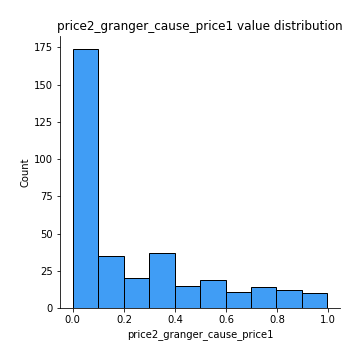
## Feature : price1_granger_cause_price2
- **Feature type** : continous
- **Missing** : 0.0%
- **Unique** : 347
- **Count** :347.0
- **Mean** :0.18428853466417214
- **Std** :0.24156146026812628
- **Min** :6.878679756083943e-14
- **25%th Percentile** : 0.01253353477792846
- **50%th Percentile** : 0.07450245110985576
- **75%th Percentile** : 0.26329781202657343
- **Max** :0.9971377517676575

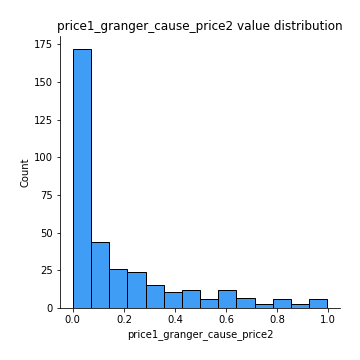

[<< Go back](../README.md)
