# Summary of 2_DecisionTree

[<< Go back](../README.md)

## Decision Tree
- **n_jobs**: -1
- **criterion**: gini
- **max_depth**: 3
- **explain_level**: 2

## Validation
 - **validation_type**: split
 - **train_ratio**: 0.75
 - **shuffle**: True
 - **stratify**: True

## Optimized metric
accuracy

## Training time

8.9 seconds

## Metric details
|           |    score |   threshold |
|:----------|---------:|------------:|
| logloss   | 0.328228 |  nan        |
| auc       | 0.977249 |  nan        |
| f1        | 0.977273 |    0.492647 |
| accuracy  | 0.977011 |    0.492647 |
| precision | 1        |    0.492647 |
| recall    | 0.955556 |    0        |
| mcc       | 0.95505  |    0.492647 |

## Confusion matrix (at threshold=0.492647)
|                      |   Predicted as real |   Predicted as simulated |
|:---------------------|--------------------:|-------------------------:|
| Labeled as real      |                  42 |                        0 |
| Labeled as simulated |                   2 |                       43 |

## Learning curves
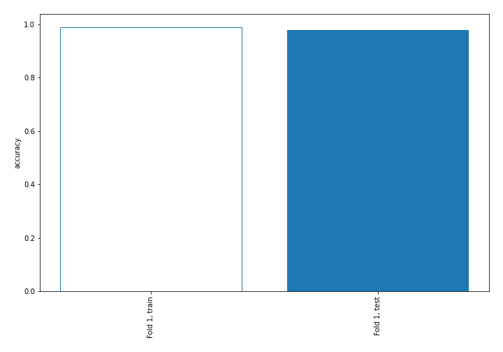

## Decision Tree 

### Tree #1
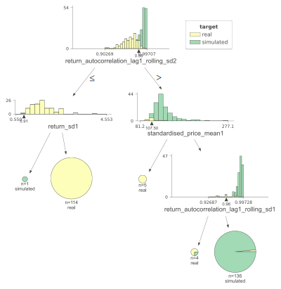

### Rules

if (return_autocorrelation_lag1_rolling_sd2 > 0.979) and (standardised_price_mean1 > 107.503) and (return_autocorrelation_lag1_rolling_sd1 > 0.963) then class: simulated (proba: 98.53%) | based on 136 samples

if (return_autocorrelation_lag1_rolling_sd2 <= 0.979) and (return_sd1 > 0.909) then class: real (proba: 100.0%) | based on 114 samples

if (return_autocorrelation_lag1_rolling_sd2 > 0.979) and (standardised_price_mean1 <= 107.503) then class: real (proba: 100.0%) | based on 5 samples

if (return_autocorrelation_lag1_rolling_sd2 > 0.979) and (standardised_price_mean1 > 107.503) and (return_autocorrelation_lag1_rolling_sd1 <= 0.963) then class: real (proba: 75.0%) | based on 4 samples

if (return_autocorrelation_lag1_rolling_sd2 <= 0.979) and (return_sd1 <= 0.909) then class: simulated (proba: 100.0%) | based on 1 samples

## Permutation-based Importance
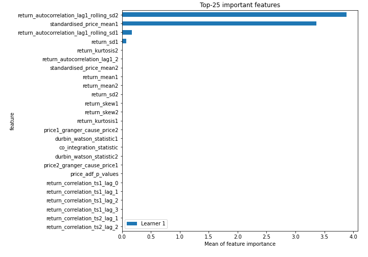
## Confusion Matrix

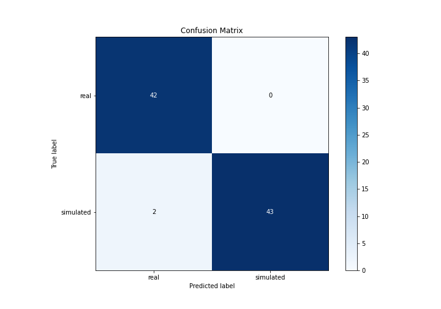

## Normalized Confusion Matrix

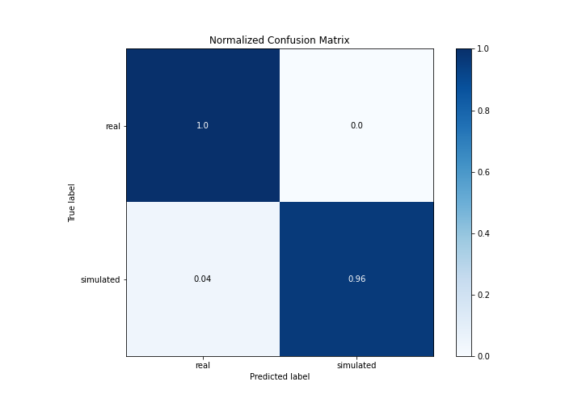

## ROC Curve

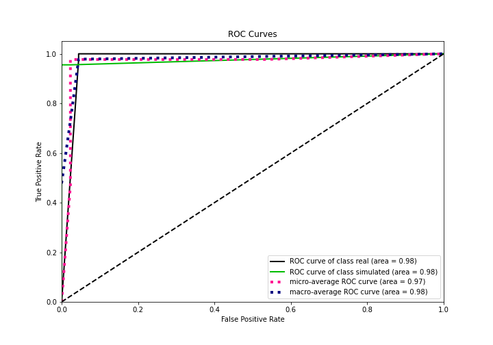

## Kolmogorov-Smirnov Statistic

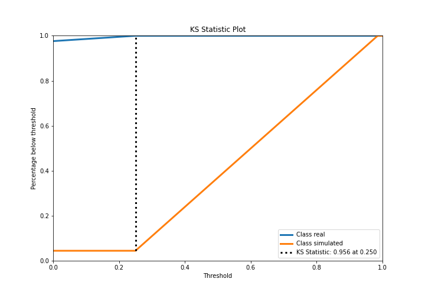

## Precision-Recall Curve

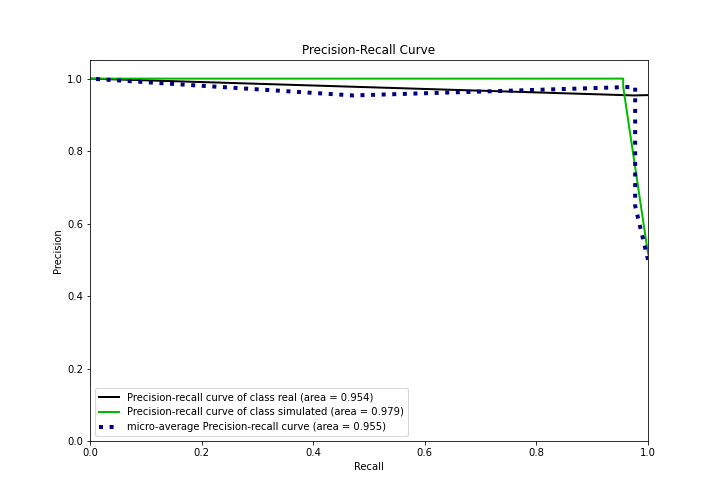

## Calibration Curve

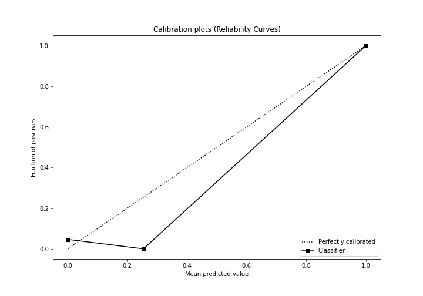

## Cumulative Gains Curve

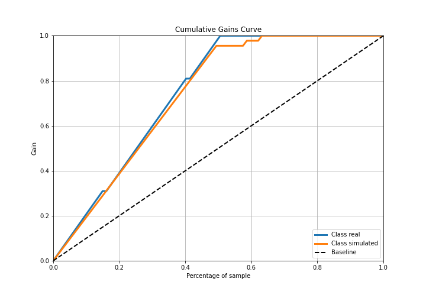

## Lift Curve

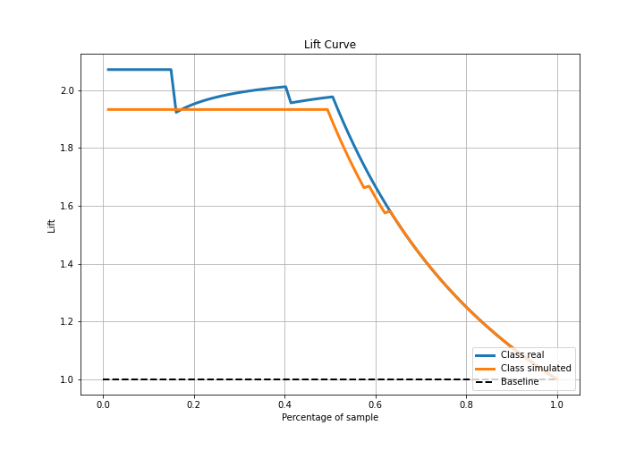

## SHAP Importance
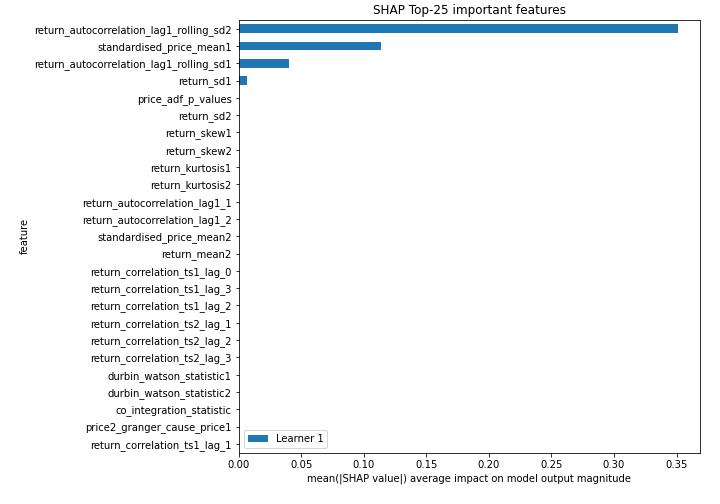

## SHAP Dependence plots

### Dependence (Fold 1)

## SHAP Decision plots

### Top-10 Worst decisions for class 0 (Fold 1)
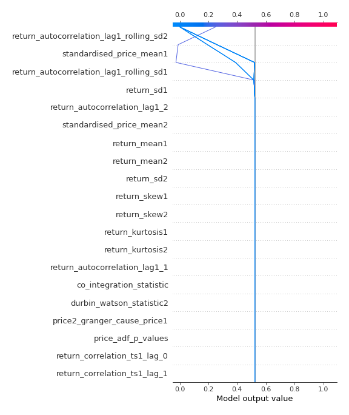
### Top-10 Best decisions for class 0 (Fold 1)
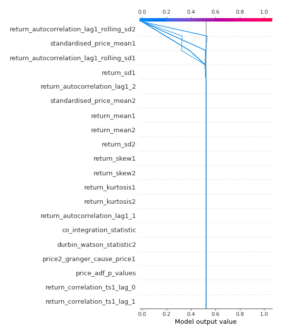
### Top-10 Worst decisions for class 1 (Fold 1)

### Top-10 Best decisions for class 1 (Fold 1)
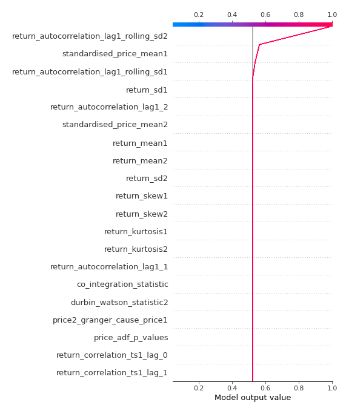

[<< Go back](../README.md)
