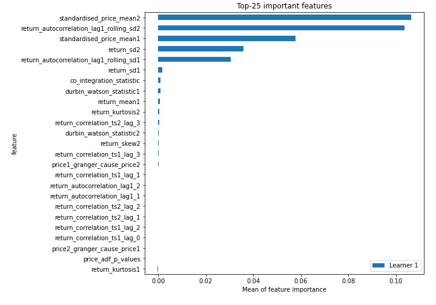
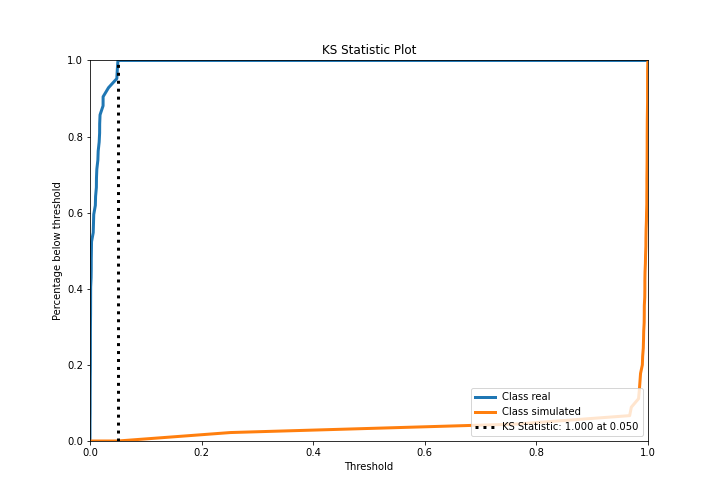
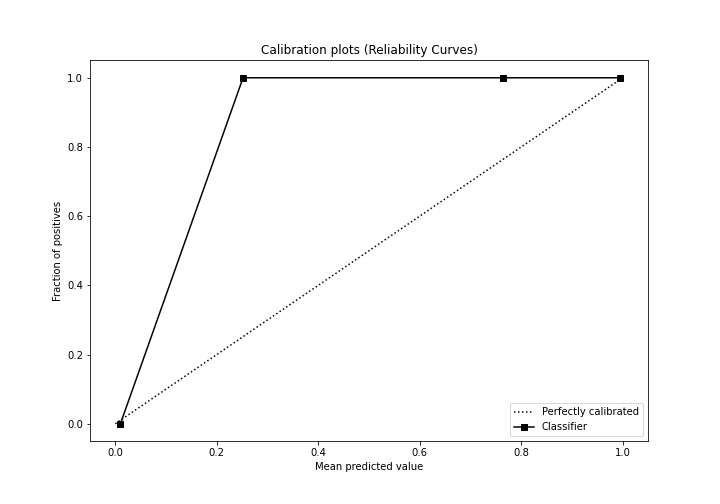
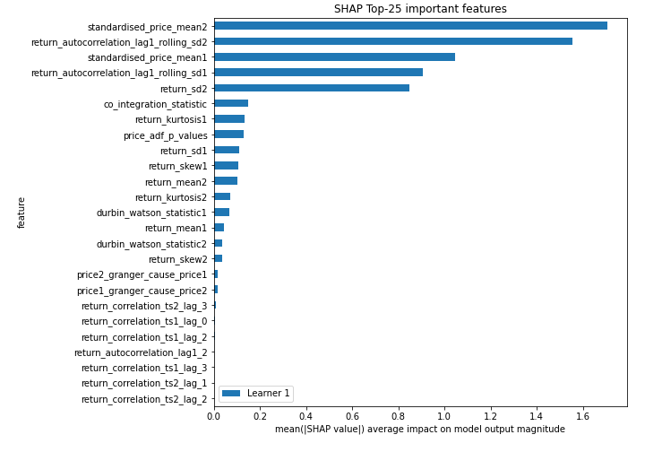
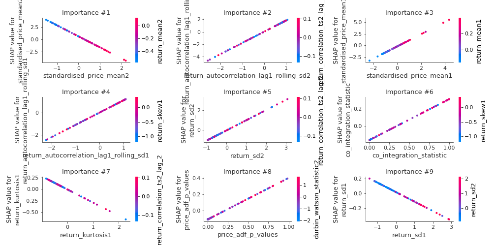
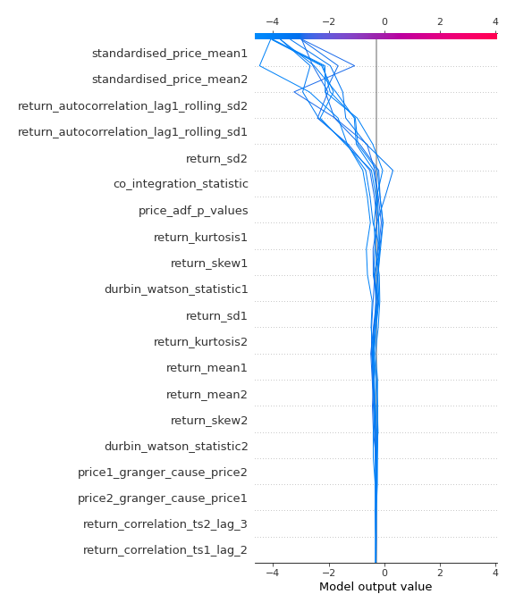
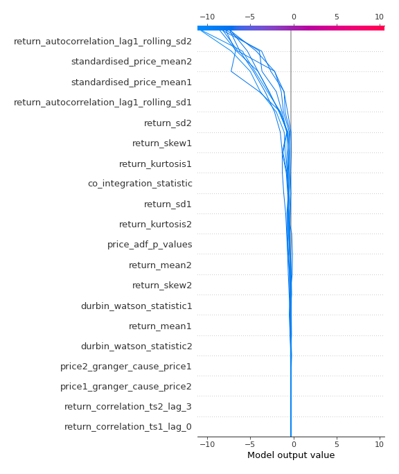
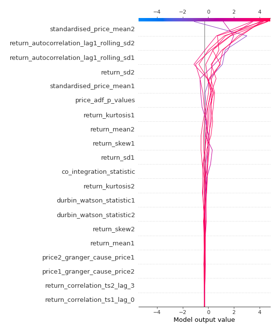

# Summary of 3_Linear

[<< Go back](../README.md)

## Logistic Regression (Linear)
- **n_jobs**: -1
- **explain_level**: 2

## Validation
 - **validation_type**: split
 - **train_ratio**: 0.75
 - **shuffle**: True
 - **stratify**: True

## Optimized metric
accuracy

## Training time

7.3 seconds

## Metric details
|           |     score |     threshold |
|:----------|----------:|--------------:|
| logloss   | 0.0268518 | nan           |
| auc       | 1         | nan           |
| f1        | 1         |   0.126268    |
| accuracy  | 1         |   0.126268    |
| precision | 1         |   0.521369    |
| recall    | 1         |   2.00821e-05 |
| mcc       | 1         |   0.126268    |

## Confusion matrix (at threshold=0.126268)
|                      |   Predicted as real |   Predicted as simulated |
|:---------------------|--------------------:|-------------------------:|
| Labeled as real      |                  42 |                        0 |
| Labeled as simulated |                   0 |                       45 |

## Learning curves

## Coefficients
| feature                                 |   Learner_1 |
|:----------------------------------------|------------:|
| return_autocorrelation_lag1_rolling_sd2 |  1.79681    |
| standardised_price_mean1                |  1.31548    |
| return_autocorrelation_lag1_rolling_sd1 |  1.11618    |
| return_sd2                              |  1.0416     |
| price_adf_p_values                      |  0.512489   |
| co_integration_statistic                |  0.472654   |
| return_mean1                            |  0.327529   |
| price2_granger_cause_price1             |  0.095761   |
| return_correlation_ts1_lag_2            |  0.0626969  |
| return_autocorrelation_lag1_2           |  0.0504278  |
| durbin_watson_statistic2                |  0.0478335  |
| return_correlation_ts2_lag_2            |  0.00804193 |
| return_correlation_ts1_lag_1            |  0.00735744 |
| return_correlation_ts1_lag_0            |  0.00712213 |
| return_autocorrelation_lag1_1           |  0.00569086 |
| return_correlation_ts2_lag_1            | -0.0387866  |
| return_correlation_ts1_lag_3            | -0.0534318  |
| return_skew2                            | -0.0756979  |
| price1_granger_cause_price2             | -0.0928672  |
| durbin_watson_statistic1                | -0.0996911  |
| return_sd1                              | -0.127379   |
| return_correlation_ts2_lag_3            | -0.162608   |
| return_kurtosis2                        | -0.173829   |
| return_skew1                            | -0.277825   |
| return_kurtosis1                        | -0.285894   |
| intercept                               | -0.371885   |
| return_mean2                            | -0.525711   |
| standardised_price_mean2                | -2.23212    |

## Permutation-based Importance

## Confusion Matrix

## Normalized Confusion Matrix

## ROC Curve

## Kolmogorov-Smirnov Statistic

## Precision-Recall Curve

## Calibration Curve

## Cumulative Gains Curve

## Lift Curve

## SHAP Importance

## SHAP Dependence plots

### Dependence (Fold 1)

## SHAP Decision plots

### Top-10 Worst decisions for class 0 (Fold 1)

### Top-10 Best decisions for class 0 (Fold 1)

### Top-10 Worst decisions for class 1 (Fold 1)

### Top-10 Best decisions for class 1 (Fold 1)

[<< Go back](../README.md)
