# Exploratory Data Analysis

[<< Go back](../README.md)
## Feature : target
- **Feature type** : categorical
- **Missing** : 0.0%
- **Unique** : 2
- **Count** :347
- **Unique** :2
- **Top** :simulated
- **Freq** :181

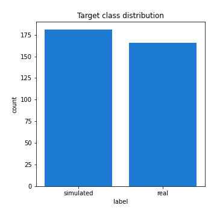
## Feature : standardised_price_mean1
- **Feature type** : continous
- **Missing** : 0.0%
- **Unique** : 347
- **Count** :347.0
- **Mean** :120.67690461734645
- **Std** :25.996998313931837
- **Min** :61.90028384066058
- **25%th Percentile** : 101.83734214200435
- **50%th Percentile** : 117.85008698246978
- **75%th Percentile** : 131.7106661368333
- **Max** :277.06873110822596

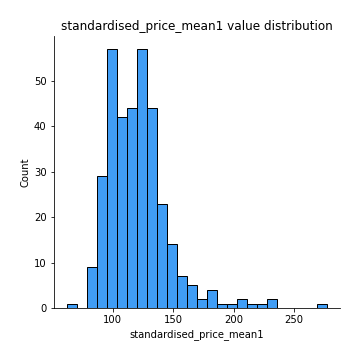
## Feature : standardised_price_mean2
- **Feature type** : continous
- **Missing** : 0.0%
- **Unique** : 347
- **Count** :347.0
- **Mean** :87.54388931597062
- **Std** :21.928937188224275
- **Min** :45.67831358850824
- **25%th Percentile** : 66.97581432139907
- **50%th Percentile** : 88.63751806743211
- **75%th Percentile** : 103.48944390419165
- **Max** :180.9892307692308

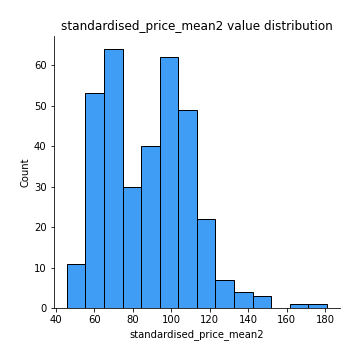
## Feature : return_mean1
- **Feature type** : continous
- **Missing** : 0.0%
- **Unique** : 347
- **Count** :347.0
- **Mean** :0.09258400999468583
- **Std** :0.16652992821225998
- **Min** :-0.31570612099423523
- **25%th Percentile** : -0.009772918809410364
- **50%th Percentile** : 0.06958637741136202
- **75%th Percentile** : 0.18523832943459081
- **Max** :0.804736244460184

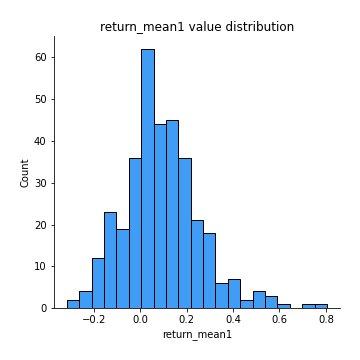
## Feature : return_mean2
- **Feature type** : continous
- **Missing** : 0.0%
- **Unique** : 347
- **Count** :347.0
- **Mean** :-0.21050424101182644
- **Std** :0.24328791825228924
- **Min** :-1.1539316645907338
- **25%th Percentile** : -0.402427385152542
- **50%th Percentile** : -0.1409913735807956
- **75%th Percentile** : -0.020466412897913115
- **Max** :0.6301188197801398

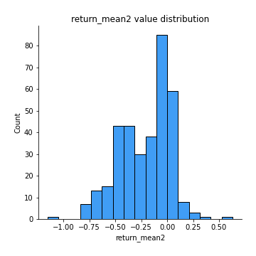
## Feature : return_sd1
- **Feature type** : continous
- **Missing** : 0.0%
- **Unique** : 347
- **Count** :347.0
- **Mean** :2.0535241855496524
- **Std** :0.8530640824969202
- **Min** :0.5499245356996356
- **25%th Percentile** : 1.394580646175109
- **50%th Percentile** : 1.8185850199359175
- **75%th Percentile** : 2.548129815286175
- **Max** :4.553254647490549

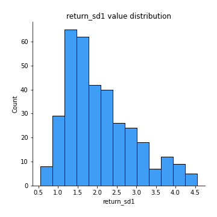
## Feature : return_sd2
- **Feature type** : continous
- **Missing** : 0.0%
- **Unique** : 347
- **Count** :347.0
- **Mean** :3.0830758629414032
- **Std** :2.1175940763593117
- **Min** :0.7711089600031484
- **25%th Percentile** : 1.592712535991303
- **50%th Percentile** : 2.134345481782014
- **75%th Percentile** : 4.029950068828056
- **Max** :10.821798983220699

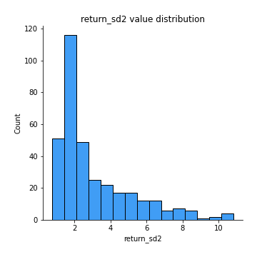
## Feature : return_skew1
- **Feature type** : continous
- **Missing** : 0.0%
- **Unique** : 347
- **Count** :347.0
- **Mean** :-0.32796910226601866
- **Std** :0.6375960879935108
- **Min** :-4.499550695415954
- **25%th Percentile** : -0.5706901113046464
- **50%th Percentile** : -0.2942405277911848
- **75%th Percentile** : -0.04089189346858606
- **Max** :2.3044235031125564

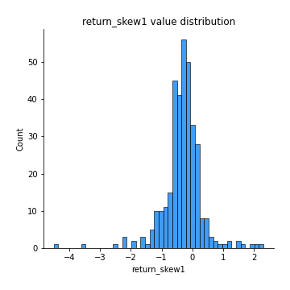
## Feature : return_skew2
- **Feature type** : continous
- **Missing** : 0.0%
- **Unique** : 347
- **Count** :347.0
- **Mean** :-0.534104960925957
- **Std** :0.9483837796499597
- **Min** :-7.3762354994385335
- **25%th Percentile** : -0.7603415742699217
- **50%th Percentile** : -0.39729548930223857
- **75%th Percentile** : -0.13367937186443152
- **Max** :2.3516100629951677

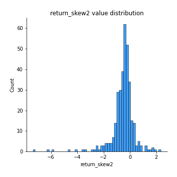
## Feature : return_kurtosis1
- **Feature type** : continous
- **Missing** : 0.0%
- **Unique** : 347
- **Count** :347.0
- **Mean** :3.3244691880162454
- **Std** :3.994847245573909
- **Min** :-0.24774895602504543
- **25%th Percentile** : 1.3837443992096723
- **50%th Percentile** : 2.2066656033809435
- **75%th Percentile** : 3.6569227335605152
- **Max** :43.33367798924404

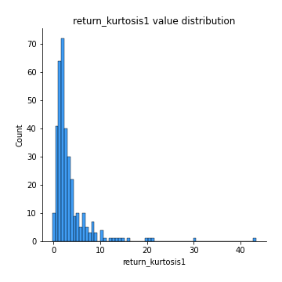
## Feature : return_kurtosis2
- **Feature type** : continous
- **Missing** : 0.0%
- **Unique** : 347
- **Count** :347.0
- **Mean** :5.129897128588658
- **Std** :8.18223897599523
- **Min** :-0.044018518901403514
- **25%th Percentile** : 1.7674128748615996
- **50%th Percentile** : 3.03724440162441
- **75%th Percentile** : 5.145007242520315
- **Max** :94.01659180149953

## Feature : return_autocorrelation_lag1_1
- **Feature type** : continous
- **Missing** : 0.0%
- **Unique** : 347
- **Count** :347.0
- **Mean** :-0.007815498597167592
- **Std** :0.07163468810286099
- **Min** :-0.19929527329460967
- **25%th Percentile** : -0.052737788400238746
- **50%th Percentile** : -0.011834839984454951
- **75%th Percentile** : 0.038213509623036816
- **Max** :0.22707870700865881

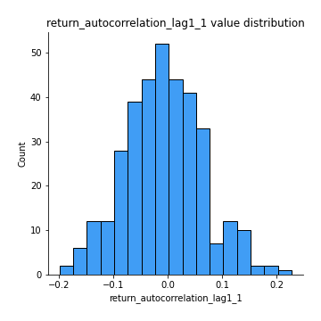
## Feature : return_autocorrelation_lag1_2
- **Feature type** : continous
- **Missing** : 0.0%
- **Unique** : 347
- **Count** :347.0
- **Mean** :-0.005651820419137855
- **Std** :0.08090622193547954
- **Min** :-0.25137594849502454
- **25%th Percentile** : -0.05486912328116157
- **50%th Percentile** : -0.0035728108497321727
- **75%th Percentile** : 0.040998545807321776
- **Max** :0.21709136669403284

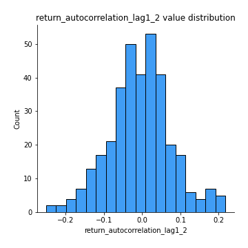
## Feature : return_autocorrelation_lag1_rolling_sd1
- **Feature type** : continous
- **Missing** : 0.0%
- **Unique** : 347
- **Count** :347.0
- **Mean** :0.9778111142231344
- **Std** :0.015732283045942288
- **Min** :0.9268739413055933
- **25%th Percentile** : 0.9667131905189352
- **50%th Percentile** : 0.9821342822444431
- **75%th Percentile** : 0.9913686354993727
- **Max** :0.9972826815940816

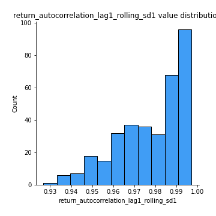
## Feature : return_autocorrelation_lag1_rolling_sd2
- **Feature type** : continous
- **Missing** : 0.0%
- **Unique** : 347
- **Count** :347.0
- **Mean** :0.9753115651379248
- **Std** :0.019200766727188016
- **Min** :0.9026917088648122
- **25%th Percentile** : 0.9622924717537313
- **50%th Percentile** : 0.9819671448237132
- **75%th Percentile** : 0.991546944072176
- **Max** :0.9970663059472165

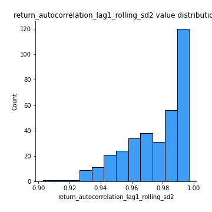
## Feature : price_adf_p_values
- **Feature type** : continous
- **Missing** : 0.0%
- **Unique** : 347
- **Count** :347.0
- **Mean** :0.24366391364254342
- **Std** :0.28498246980896413
- **Min** :4.663774584889525e-06
- **25%th Percentile** : 0.009409751949170835
- **50%th Percentile** : 0.09697665039732267
- **75%th Percentile** : 0.42983518506897866
- **Max** :0.9858503504136483

## Feature : return_correlation_ts1_lag_0
- **Feature type** : continous
- **Missing** : 0.0%
- **Unique** : 347
- **Count** :347.0
- **Mean** :0.5189416029805122
- **Std** :0.27114602443371055
- **Min** :-0.5551502834058232
- **25%th Percentile** : 0.34307623577330193
- **50%th Percentile** : 0.5304954233147269
- **75%th Percentile** : 0.7690932998329885
- **Max** :0.9937227277077512

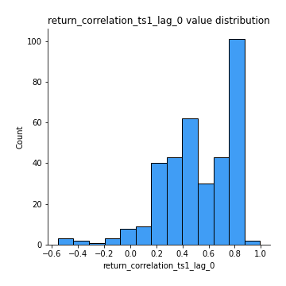
## Feature : return_correlation_ts1_lag_1
- **Feature type** : continous
- **Missing** : 0.0%
- **Unique** : 347
- **Count** :347.0
- **Mean** :0.00048452769165797157
- **Std** :0.07306883687171928
- **Min** :-0.20616984375661027
- **25%th Percentile** : -0.05113658181718921
- **50%th Percentile** : 0.0014402834880221293
- **75%th Percentile** : 0.04989791604473859
- **Max** :0.20244741963607857

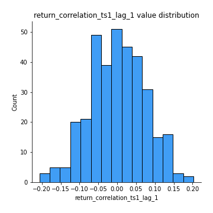
## Feature : return_correlation_ts1_lag_2
- **Feature type** : continous
- **Missing** : 0.0%
- **Unique** : 347
- **Count** :347.0
- **Mean** :-0.005321424332858658
- **Std** :0.07730118324762592
- **Min** :-0.26036426517484007
- **25%th Percentile** : -0.048887651203214436
- **50%th Percentile** : 0.0010926396004355707
- **75%th Percentile** : 0.047020928543832254
- **Max** :0.2680035836944033

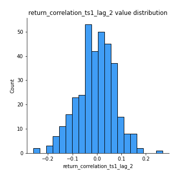
## Feature : return_correlation_ts1_lag_3
- **Feature type** : continous
- **Missing** : 0.0%
- **Unique** : 347
- **Count** :347.0
- **Mean** :0.007953735658911408
- **Std** :0.07592041835055655
- **Min** :-0.22929547150337884
- **25%th Percentile** : -0.045243388419984744
- **50%th Percentile** : 0.013795574232072566
- **75%th Percentile** : 0.06025880972827285
- **Max** :0.18640155552832768

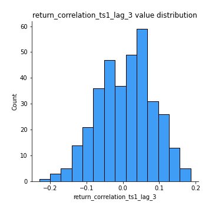
## Feature : return_correlation_ts2_lag_1
- **Feature type** : continous
- **Missing** : 0.0%
- **Unique** : 347
- **Count** :347.0
- **Mean** :0.0033503078888448886
- **Std** :0.07621472020885602
- **Min** :-0.21349669334253527
- **25%th Percentile** : -0.048346918701530794
- **50%th Percentile** : 0.004799355452673008
- **75%th Percentile** : 0.046266990849060594
- **Max** :0.3425036902091001

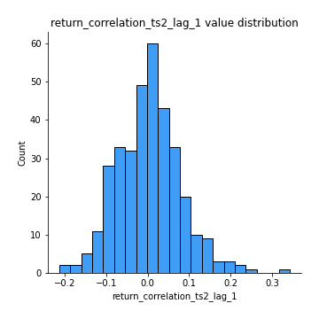
## Feature : return_correlation_ts2_lag_2
- **Feature type** : continous
- **Missing** : 0.0%
- **Unique** : 347
- **Count** :347.0
- **Mean** :-0.014166369270917424
- **Std** :0.0776594153143027
- **Min** :-0.2502186450346217
- **25%th Percentile** : -0.06086083694565947
- **50%th Percentile** : -0.014036237831801034
- **75%th Percentile** : 0.03460463046118263
- **Max** :0.2328045488119464

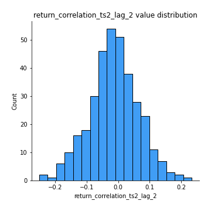
## Feature : return_correlation_ts2_lag_3
- **Feature type** : continous
- **Missing** : 0.0%
- **Unique** : 347
- **Count** :347.0
- **Mean** :0.0034807180934505414
- **Std** :0.07608429546296856
- **Min** :-0.2638973077005766
- **25%th Percentile** : -0.04349250958004799
- **50%th Percentile** : 0.00778225414888405
- **75%th Percentile** : 0.05456331499933356
- **Max** :0.21443994242834458

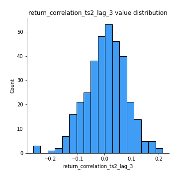
## Feature : durbin_watson_statistic1
- **Feature type** : continous
- **Missing** : 0.0%
- **Unique** : 347
- **Count** :347.0
- **Mean** :1.981846451872982
- **Std** :0.10104592623311073
- **Min** :1.6552028525275757
- **25%th Percentile** : 1.9288995010872352
- **50%th Percentile** : 1.9896910903820928
- **75%th Percentile** : 2.0313074853418183
- **Max** :2.297476091935293

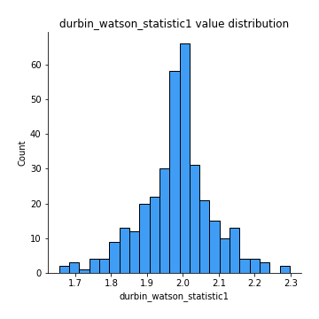
## Feature : durbin_watson_statistic2
- **Feature type** : continous
- **Missing** : 0.0%
- **Unique** : 347
- **Count** :347.0
- **Mean** :1.9869094889160028
- **Std** :0.10623875450396367
- **Min** :1.6889994022512262
- **25%th Percentile** : 1.928075575142173
- **50%th Percentile** : 1.9925361740277814
- **75%th Percentile** : 2.0386806763167877
- **Max** :2.344932357665653

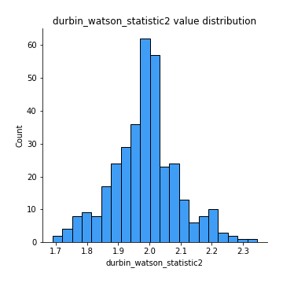
## Feature : co_integration_statistic
- **Feature type** : continous
- **Missing** : 0.0%
- **Unique** : 338
- **Count** :347.0
- **Mean** :0.3640578889013116
- **Std** :0.3555826715009747
- **Min** :3.4251330940177255e-05
- **25%th Percentile** : 0.03343642906539758
- **50%th Percentile** : 0.25175981192514674
- **75%th Percentile** : 0.7025812599462089
- **Max** :1.0

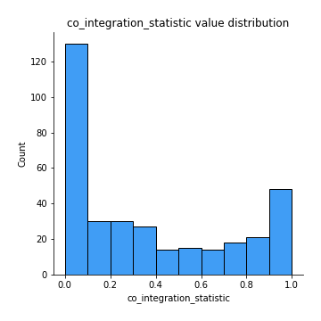
## Feature : price2_granger_cause_price1
- **Feature type** : continous
- **Missing** : 0.0%
- **Unique** : 347
- **Count** :347.0
- **Mean** :0.18828744641422654
- **Std** :0.2363216937564976
- **Min** :3.981718448644857e-13
- **25%th Percentile** : 0.009103596750483205
- **50%th Percentile** : 0.07771757542496101
- **75%th Percentile** : 0.30985376122992647
- **Max** :0.9970627030394051

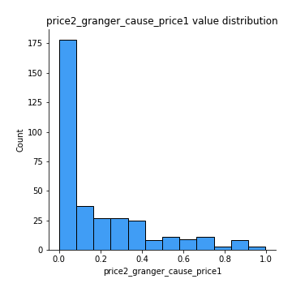
## Feature : price1_granger_cause_price2
- **Feature type** : continous
- **Missing** : 0.0%
- **Unique** : 347
- **Count** :347.0
- **Mean** :0.18055248559833675
- **Std** :0.2460546055554909
- **Min** :1.1843783552402782e-15
- **25%th Percentile** : 0.007283578263370234
- **50%th Percentile** : 0.06392755772704002
- **75%th Percentile** : 0.27545658331315737
- **Max** :0.9982703213806337

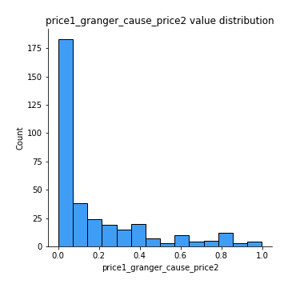

[<< Go back](../README.md)
