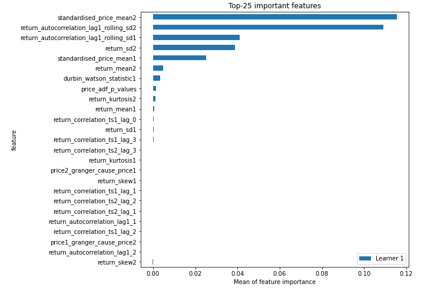
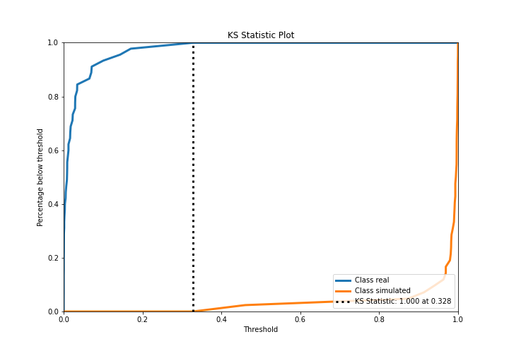
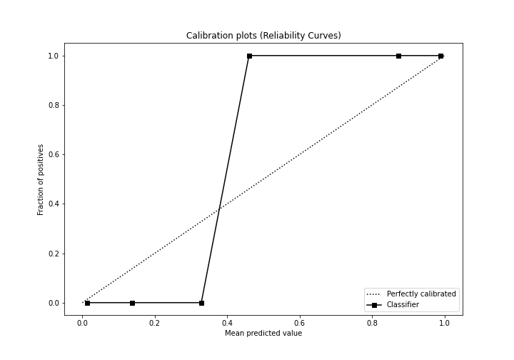
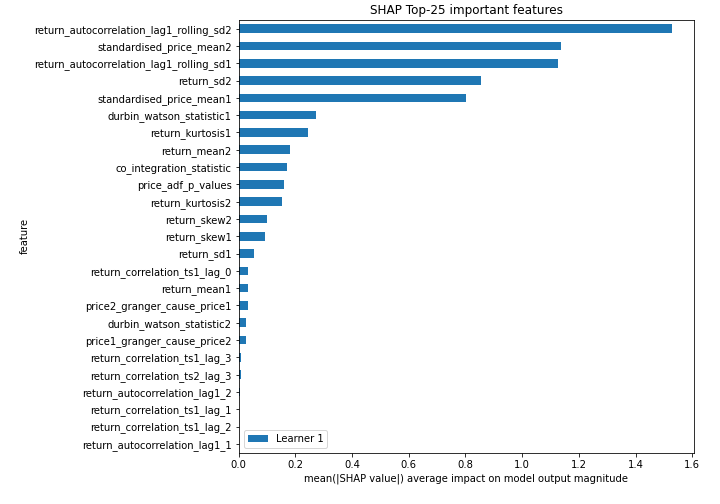
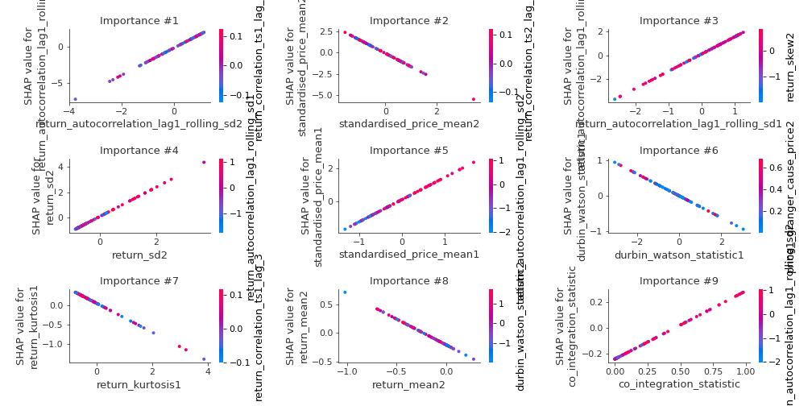
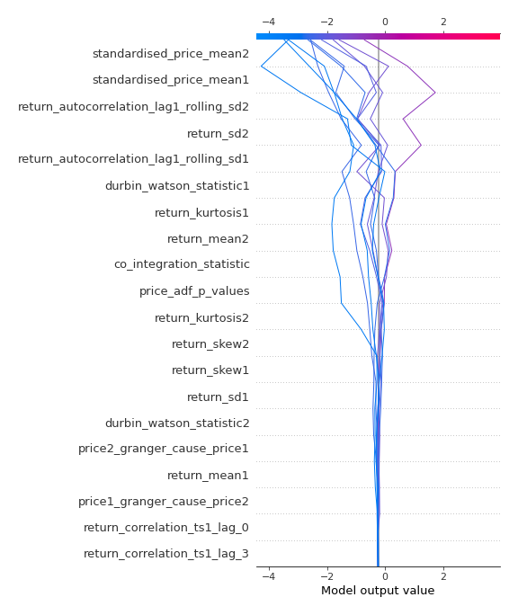
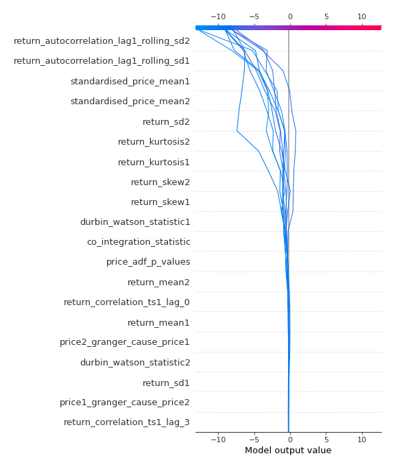
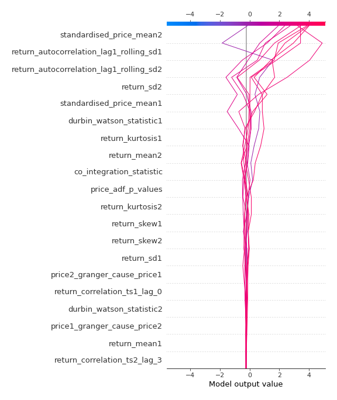
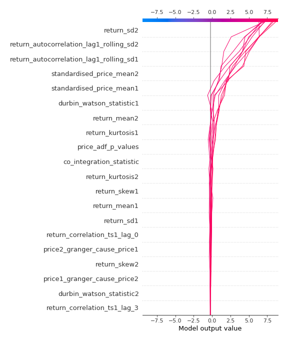

# Summary of 3_Linear

[<< Go back](../README.md)

## Logistic Regression (Linear)
- **n_jobs**: -1
- **explain_level**: 2

## Validation
 - **validation_type**: split
 - **train_ratio**: 0.75
 - **shuffle**: True
 - **stratify**: True

## Optimized metric
accuracy

## Training time

8.7 seconds

## Metric details
|           |     score |    threshold |
|:----------|----------:|-------------:|
| logloss   | 0.0322089 | nan          |
| auc       | 1         | nan          |
| f1        | 1         |   0.438121   |
| accuracy  | 1         |   0.438121   |
| precision | 1         |   0.502962   |
| recall    | 1         |   2.8056e-06 |
| mcc       | 1         |   0.438121   |

## Confusion matrix (at threshold=0.438121)
|                      |   Predicted as real |   Predicted as simulated |
|:---------------------|--------------------:|-------------------------:|
| Labeled as real      |                  45 |                        0 |
| Labeled as simulated |                   0 |                       42 |

## Learning curves

## Coefficients
| feature                                 |   Learner_1 |
|:----------------------------------------|------------:|
| return_autocorrelation_lag1_rolling_sd2 |  1.89012    |
| return_autocorrelation_lag1_rolling_sd1 |  1.44279    |
| standardised_price_mean1                |  1.37287    |
| return_sd2                              |  1.16453    |
| price_adf_p_values                      |  0.683921   |
| co_integration_statistic                |  0.533382   |
| return_mean1                            |  0.282203   |
| return_skew2                            |  0.143319   |
| return_autocorrelation_lag1_2           |  0.0718468  |
| return_correlation_ts1_lag_0            |  0.0494873  |
| return_correlation_ts2_lag_2            |  0.00129092 |
| return_correlation_ts2_lag_1            | -0.00642578 |
| return_autocorrelation_lag1_1           | -0.0066477  |
| return_correlation_ts1_lag_2            | -0.0199433  |
| durbin_watson_statistic2                | -0.0302736  |
| return_correlation_ts1_lag_1            | -0.031152   |
| return_sd1                              | -0.0682309  |
| return_correlation_ts2_lag_3            | -0.119998   |
| price1_granger_cause_price2             | -0.125907   |
| return_correlation_ts1_lag_3            | -0.130262   |
| price2_granger_cause_price1             | -0.136227   |
| return_kurtosis2                        | -0.158653   |
| return_skew1                            | -0.22303    |
| durbin_watson_statistic1                | -0.31116    |
| return_kurtosis1                        | -0.369208   |
| intercept                               | -0.812978   |
| return_mean2                            | -0.89801    |
| standardised_price_mean2                | -1.56439    |

## Permutation-based Importance

## Confusion Matrix

## Normalized Confusion Matrix

## ROC Curve

## Kolmogorov-Smirnov Statistic

## Precision-Recall Curve

## Calibration Curve

## Cumulative Gains Curve

## Lift Curve

## SHAP Importance

## SHAP Dependence plots

### Dependence (Fold 1)

## SHAP Decision plots

### Top-10 Worst decisions for class 0 (Fold 1)

### Top-10 Best decisions for class 0 (Fold 1)

### Top-10 Worst decisions for class 1 (Fold 1)

### Top-10 Best decisions for class 1 (Fold 1)

[<< Go back](../README.md)
