# Exploratory Data Analysis

[<< Go back](../README.md)
## Feature : target
- **Feature type** : categorical
- **Missing** : 0.0%
- **Unique** : 2
- **Count** :347
- **Unique** :2
- **Top** :real
- **Freq** :178

## Feature : standardised_price_mean1
- **Feature type** : continous
- **Missing** : 0.0%
- **Unique** : 347
- **Count** :347.0
- **Mean** :119.19524494429432
- **Std** :27.251304290044843
- **Min** :75.81744099743875
- **25%th Percentile** : 101.1057397536232
- **50%th Percentile** : 115.99816321728308
- **75%th Percentile** : 128.9772342623191
- **Max** :307.32928421497877

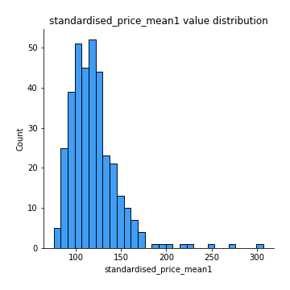
## Feature : standardised_price_mean2
- **Feature type** : continous
- **Missing** : 0.0%
- **Unique** : 347
- **Count** :347.0
- **Mean** :88.1752466992167
- **Std** :24.83004618090824
- **Min** :44.32305010430768
- **25%th Percentile** : 68.8495389694167
- **50%th Percentile** : 88.80315642995485
- **75%th Percentile** : 103.79817347109542
- **Max** :289.80680039062327

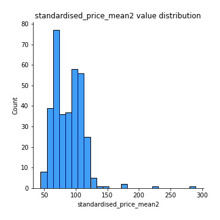
## Feature : return_mean1
- **Feature type** : continous
- **Missing** : 0.0%
- **Unique** : 347
- **Count** :347.0
- **Mean** :0.08125171735516087
- **Std** :0.16453701799511006
- **Min** :-0.297638839829253
- **25%th Percentile** : -0.02450878623129934
- **50%th Percentile** : 0.058335362660922936
- **75%th Percentile** : 0.1582528355491224
- **Max** :0.7408191365614175

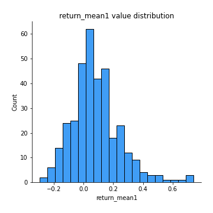
## Feature : return_mean2
- **Feature type** : continous
- **Missing** : 0.0%
- **Unique** : 347
- **Count** :347.0
- **Mean** :-0.2114312184114815
- **Std** :0.2568971511624638
- **Min** :-1.2823767430587705
- **25%th Percentile** : -0.3717590613869304
- **50%th Percentile** : -0.14132793851660408
- **75%th Percentile** : -0.017793259030697256
- **Max** :0.5731543683825912

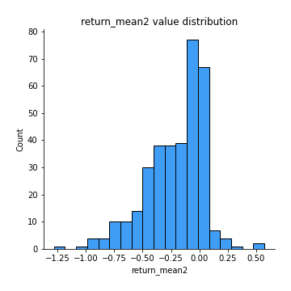
## Feature : return_sd1
- **Feature type** : continous
- **Missing** : 0.0%
- **Unique** : 347
- **Count** :347.0
- **Mean** :2.026901853240626
- **Std** :0.7738244099718038
- **Min** :0.6530503640696994
- **25%th Percentile** : 1.5109491233959425
- **50%th Percentile** : 1.80707078011646
- **75%th Percentile** : 2.427567790925834
- **Max** :5.54409485013739

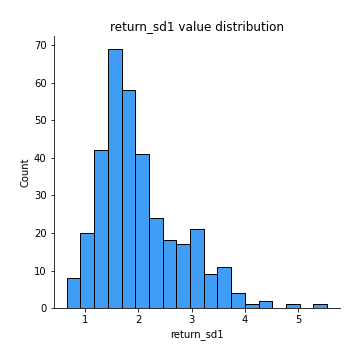
## Feature : return_sd2
- **Feature type** : continous
- **Missing** : 0.0%
- **Unique** : 347
- **Count** :347.0
- **Mean** :2.8879943621857485
- **Std** :1.9117053629107967
- **Min** :0.7148312091756684
- **25%th Percentile** : 1.5313959846704006
- **50%th Percentile** : 2.035717820346715
- **75%th Percentile** : 3.7341886031504328
- **Max** :11.465969456119602

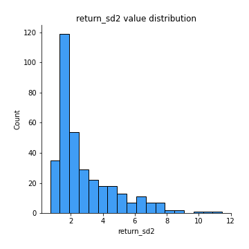
## Feature : return_skew1
- **Feature type** : continous
- **Missing** : 0.0%
- **Unique** : 347
- **Count** :347.0
- **Mean** :-0.30572418002898355
- **Std** :0.6498972774125115
- **Min** :-3.5428904448811145
- **25%th Percentile** : -0.5953153418040411
- **50%th Percentile** : -0.3094021815312072
- **75%th Percentile** : -0.08124662683982509
- **Max** :3.972992894648776

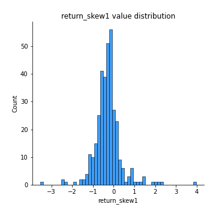
## Feature : return_skew2
- **Feature type** : continous
- **Missing** : 0.0%
- **Unique** : 347
- **Count** :347.0
- **Mean** :-0.5064584781082844
- **Std** :0.845829179483402
- **Min** :-7.3762354994385335
- **25%th Percentile** : -0.7693554680218646
- **50%th Percentile** : -0.4495836892853955
- **75%th Percentile** : -0.15180093631352898
- **Max** :2.3516100629951677

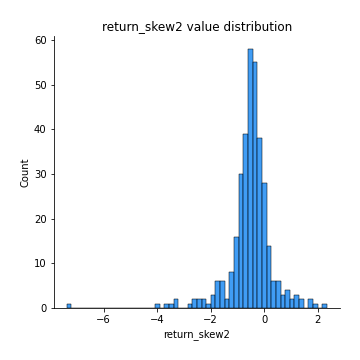
## Feature : return_kurtosis1
- **Feature type** : continous
- **Missing** : 0.0%
- **Unique** : 347
- **Count** :347.0
- **Mean** :3.4290539009646337
- **Std** :4.070928432147936
- **Min** :0.0026986256852348234
- **25%th Percentile** : 1.3581538641031194
- **50%th Percentile** : 2.2638642443907573
- **75%th Percentile** : 3.717182212570464
- **Max** :39.22170564796232

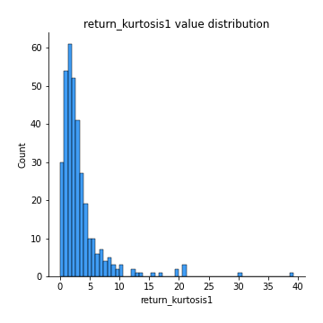
## Feature : return_kurtosis2
- **Feature type** : continous
- **Missing** : 0.0%
- **Unique** : 347
- **Count** :347.0
- **Mean** :4.98360308178872
- **Std** :6.918811506037138
- **Min** :0.024044458596995
- **25%th Percentile** : 1.7095116808852457
- **50%th Percentile** : 3.0253538273593574
- **75%th Percentile** : 5.6432859244919005
- **Max** :94.01659180149953

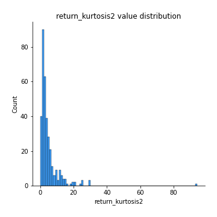
## Feature : return_autocorrelation_lag1_1
- **Feature type** : continous
- **Missing** : 0.0%
- **Unique** : 347
- **Count** :347.0
- **Mean** :-0.009899302131965737
- **Std** :0.07747261241167763
- **Min** :-0.25026327640135115
- **25%th Percentile** : -0.0582161683263707
- **50%th Percentile** : -0.011834839984454951
- **75%th Percentile** : 0.04162412456241543
- **Max** :0.3132777653361144

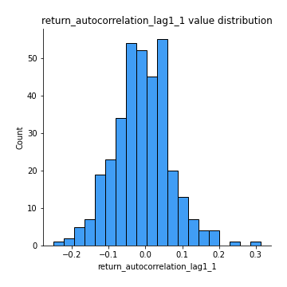
## Feature : return_autocorrelation_lag1_2
- **Feature type** : continous
- **Missing** : 0.0%
- **Unique** : 347
- **Count** :347.0
- **Mean** :-0.0014550360957584008
- **Std** :0.07452506175002406
- **Min** :-0.2861260020010381
- **25%th Percentile** : -0.046584573913862656
- **50%th Percentile** : -0.0009118496864324693
- **75%th Percentile** : 0.0481818866947251
- **Max** :0.23224152383202074

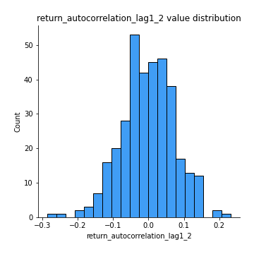
## Feature : return_autocorrelation_lag1_rolling_sd1
- **Feature type** : continous
- **Missing** : 0.0%
- **Unique** : 347
- **Count** :347.0
- **Mean** :0.9757384500165035
- **Std** :0.01628798968945382
- **Min** :0.9268739413055933
- **25%th Percentile** : 0.9645974543450611
- **50%th Percentile** : 0.9777308894255362
- **75%th Percentile** : 0.9904857977126266
- **Max** :0.9978789597262584

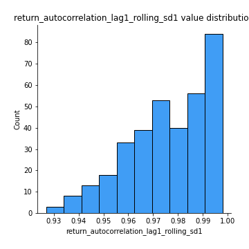
## Feature : return_autocorrelation_lag1_rolling_sd2
- **Feature type** : continous
- **Missing** : 0.0%
- **Unique** : 347
- **Count** :347.0
- **Mean** :0.9747048975150491
- **Std** :0.019045147401771555
- **Min** :0.8849206290342239
- **25%th Percentile** : 0.9614706540781842
- **50%th Percentile** : 0.9793872222084619
- **75%th Percentile** : 0.991297964885379
- **Max** :0.9973741543469732

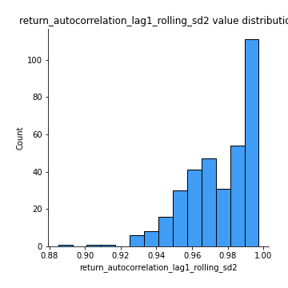
## Feature : price_adf_p_values
- **Feature type** : continous
- **Missing** : 0.0%
- **Unique** : 347
- **Count** :347.0
- **Mean** :0.26246609575685464
- **Std** :0.2974142536421458
- **Min** :4.663774584889525e-06
- **25%th Percentile** : 0.012360690615235337
- **50%th Percentile** : 0.1341780038987836
- **75%th Percentile** : 0.45074076185622836
- **Max** :0.9846999990566561

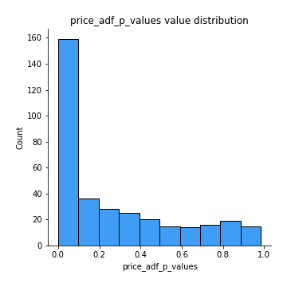
## Feature : return_correlation_ts1_lag_0
- **Feature type** : continous
- **Missing** : 0.0%
- **Unique** : 347
- **Count** :347.0
- **Mean** :0.5069003120317186
- **Std** :0.27897871331669927
- **Min** :-0.6711595914534224
- **25%th Percentile** : 0.3336696287155108
- **50%th Percentile** : 0.5217802769529113
- **75%th Percentile** : 0.7659314658607236
- **Max** :0.9937227277077512

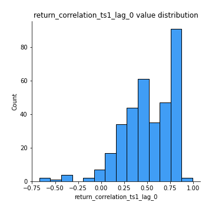
## Feature : return_correlation_ts1_lag_1
- **Feature type** : continous
- **Missing** : 0.0%
- **Unique** : 347
- **Count** :347.0
- **Mean** :0.0004922747827542133
- **Std** :0.06781727638870633
- **Min** :-0.2566029888499716
- **25%th Percentile** : -0.04665882609539779
- **50%th Percentile** : 0.0031720985003609323
- **75%th Percentile** : 0.0448009712162816
- **Max** :0.2260683897591041

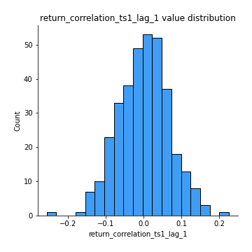
## Feature : return_correlation_ts1_lag_2
- **Feature type** : continous
- **Missing** : 0.0%
- **Unique** : 347
- **Count** :347.0
- **Mean** :-0.0028954799344228896
- **Std** :0.07499434839495082
- **Min** :-0.29253427628774364
- **25%th Percentile** : -0.0485730524609249
- **50%th Percentile** : -0.0060417155590806034
- **75%th Percentile** : 0.04179736207496886
- **Max** :0.23407933983072957

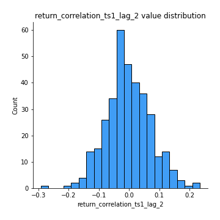
## Feature : return_correlation_ts1_lag_3
- **Feature type** : continous
- **Missing** : 0.0%
- **Unique** : 347
- **Count** :347.0
- **Mean** :0.007418489713840991
- **Std** :0.07210245031798904
- **Min** :-0.20110278628135125
- **25%th Percentile** : -0.03941981838999692
- **50%th Percentile** : 0.0015631609177970108
- **75%th Percentile** : 0.059049363259887466
- **Max** :0.18640155552832768

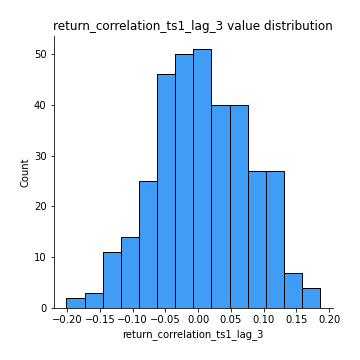
## Feature : return_correlation_ts2_lag_1
- **Feature type** : continous
- **Missing** : 0.0%
- **Unique** : 347
- **Count** :347.0
- **Mean** :0.008177294730353536
- **Std** :0.07480467179920629
- **Min** :-0.20069305714654953
- **25%th Percentile** : -0.037860809219815536
- **50%th Percentile** : 0.011320550909265476
- **75%th Percentile** : 0.053414600886803845
- **Max** :0.2811246337858347

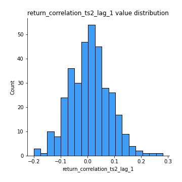
## Feature : return_correlation_ts2_lag_2
- **Feature type** : continous
- **Missing** : 0.0%
- **Unique** : 347
- **Count** :347.0
- **Mean** :-0.01302050675356806
- **Std** :0.07551903459688779
- **Min** :-0.1855935679612692
- **25%th Percentile** : -0.05705796997201043
- **50%th Percentile** : -0.011863129781879889
- **75%th Percentile** : 0.03507596526342778
- **Max** :0.2589913749223586

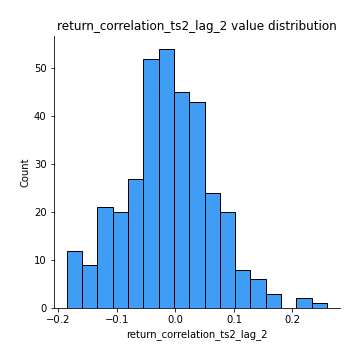
## Feature : return_correlation_ts2_lag_3
- **Feature type** : continous
- **Missing** : 0.0%
- **Unique** : 347
- **Count** :347.0
- **Mean** :0.011287332882434225
- **Std** :0.07774657913176973
- **Min** :-0.20084658381393738
- **25%th Percentile** : -0.03548891128951802
- **50%th Percentile** : 0.012469845369443615
- **75%th Percentile** : 0.06336286625053009
- **Max** :0.2673551684805047

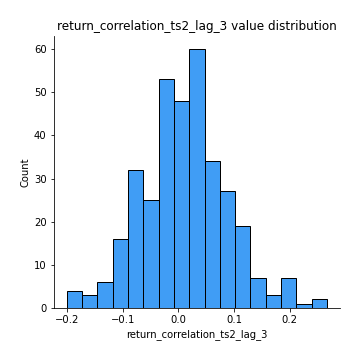
## Feature : durbin_watson_statistic1
- **Feature type** : continous
- **Missing** : 0.0%
- **Unique** : 347
- **Count** :347.0
- **Mean** :1.9805050112911458
- **Std** :0.10784216183983489
- **Min** :1.6607251710427402
- **25%th Percentile** : 1.9262086196663706
- **50%th Percentile** : 1.9884293703308753
- **75%th Percentile** : 2.030688594618515
- **Max** :2.311085615239326

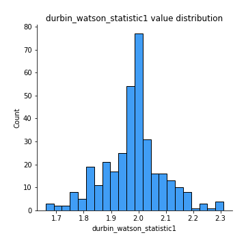
## Feature : durbin_watson_statistic2
- **Feature type** : continous
- **Missing** : 0.0%
- **Unique** : 347
- **Count** :347.0
- **Mean** :1.9841837605880106
- **Std** :0.10232014152838277
- **Min** :1.71033306929517
- **25%th Percentile** : 1.9281663161775657
- **50%th Percentile** : 1.9883682626325867
- **75%th Percentile** : 2.0305066339316644
- **Max** :2.321195960745307

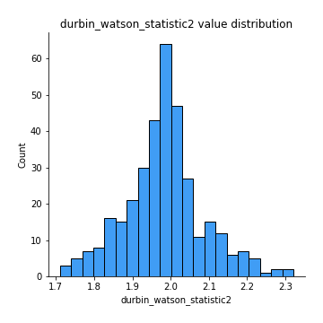
## Feature : co_integration_statistic
- **Feature type** : continous
- **Missing** : 0.0%
- **Unique** : 345
- **Count** :347.0
- **Mean** :0.3764319962516397
- **Std** :0.3496895871521006
- **Min** :3.4251330940177255e-05
- **25%th Percentile** : 0.037099566345315166
- **50%th Percentile** : 0.25872740859827575
- **75%th Percentile** : 0.6969857674607252
- **Max** :1.0

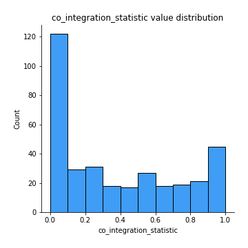
## Feature : price2_granger_cause_price1
- **Feature type** : continous
- **Missing** : 0.0%
- **Unique** : 347
- **Count** :347.0
- **Mean** :0.2332311881789325
- **Std** :0.28802224142172844
- **Min** :1.205443938076945e-11
- **25%th Percentile** : 0.011350099747795044
- **50%th Percentile** : 0.09109199934413768
- **75%th Percentile** : 0.3899801724199655
- **Max** :0.9664617582889883

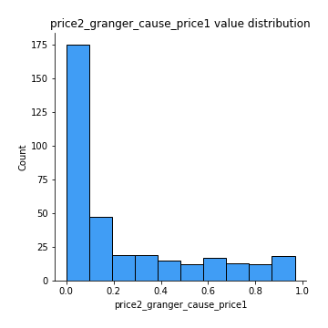
## Feature : price1_granger_cause_price2
- **Feature type** : continous
- **Missing** : 0.0%
- **Unique** : 347
- **Count** :347.0
- **Mean** :0.1858288427317152
- **Std** :0.24850296902239805
- **Min** :2.592122614681964e-14
- **25%th Percentile** : 0.012253905545208225
- **50%th Percentile** : 0.06787197977411984
- **75%th Percentile** : 0.27262109638997944
- **Max** :0.986018571266178

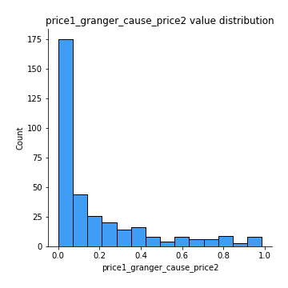

[<< Go back](../README.md)
