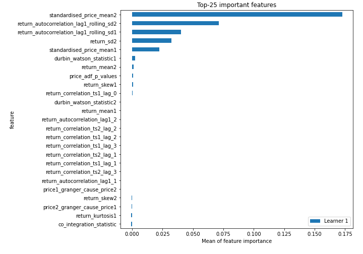
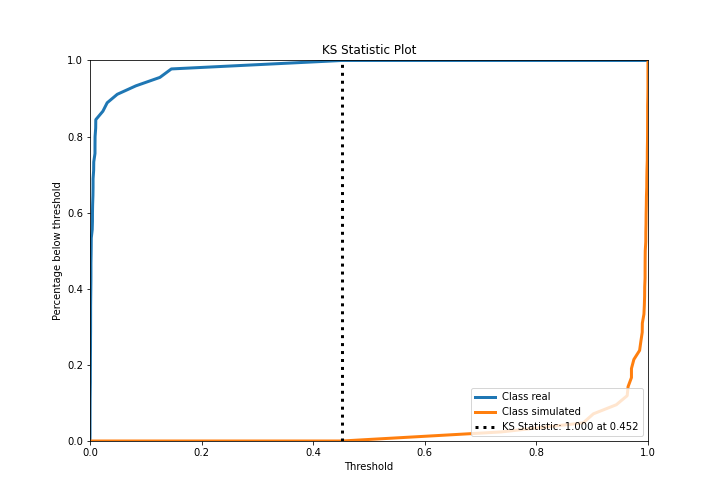
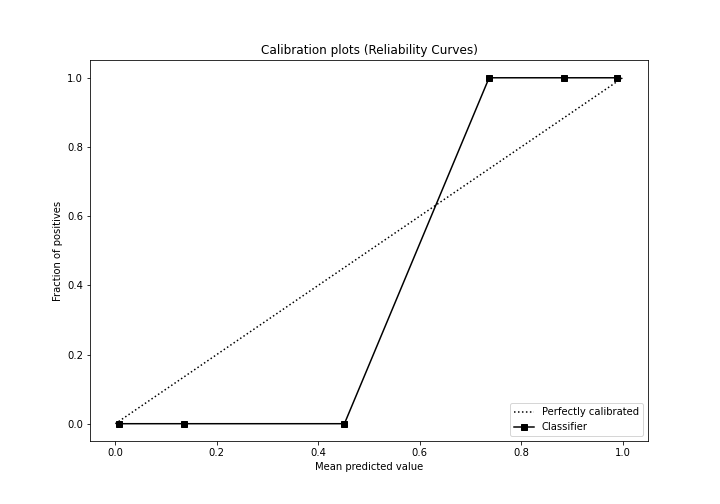
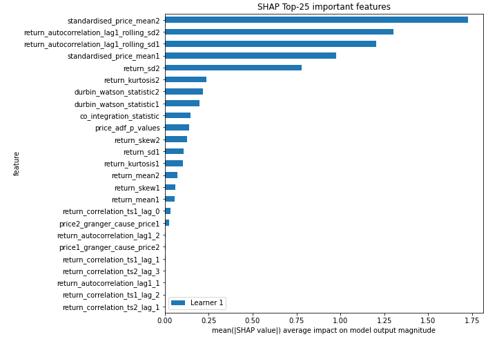
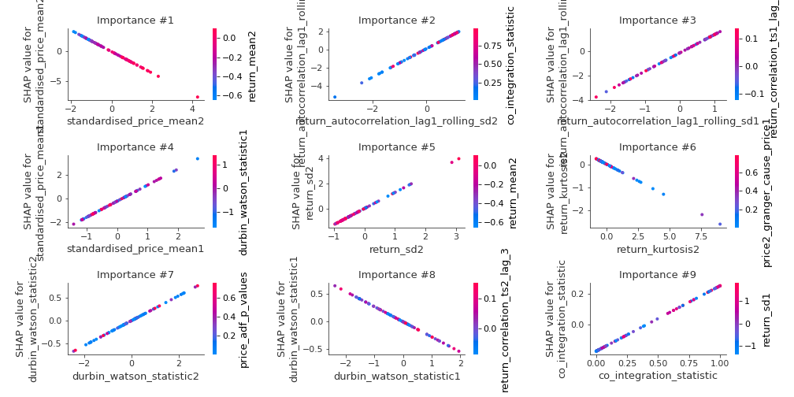
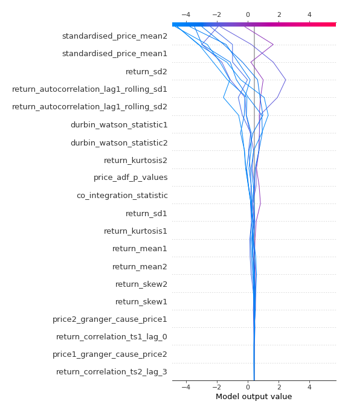
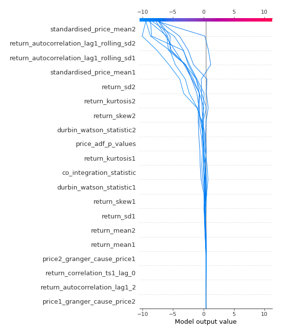
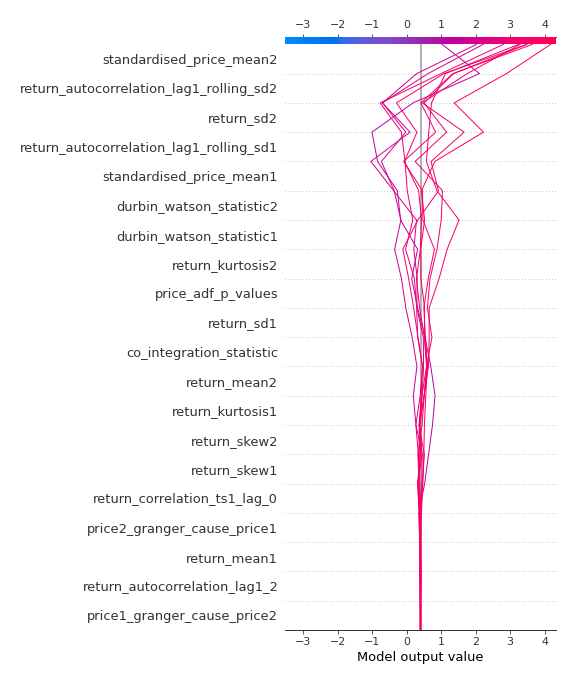
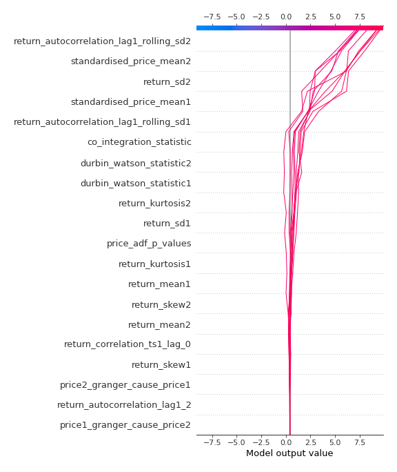

# Summary of 3_Linear

[<< Go back](../README.md)

## Logistic Regression (Linear)
- **n_jobs**: -1
- **explain_level**: 2

## Validation
 - **validation_type**: split
 - **train_ratio**: 0.75
 - **shuffle**: True
 - **stratify**: True

## Optimized metric
accuracy

## Training time

10.7 seconds

## Metric details
|           |     score |     threshold |
|:----------|----------:|--------------:|
| logloss   | 0.0239209 | nan           |
| auc       | 1         | nan           |
| f1        | 1         |   0.497841    |
| accuracy  | 1         |   0.497841    |
| precision | 1         |   0.497841    |
| recall    | 1         |   6.75693e-05 |
| mcc       | 1         |   0.497841    |

## Confusion matrix (at threshold=0.497841)
|                      |   Predicted as real |   Predicted as simulated |
|:---------------------|--------------------:|-------------------------:|
| Labeled as real      |                  45 |                        0 |
| Labeled as simulated |                   0 |                       42 |

## Learning curves

## Coefficients
| feature                                 |   Learner_1 |
|:----------------------------------------|------------:|
| return_autocorrelation_lag1_rolling_sd2 |  1.55264    |
| return_autocorrelation_lag1_rolling_sd1 |  1.49681    |
| standardised_price_mean1                |  1.37261    |
| return_sd2                              |  1.28503    |
| price_adf_p_values                      |  0.566424   |
| co_integration_statistic                |  0.422018   |
| return_mean1                            |  0.400586   |
| durbin_watson_statistic2                |  0.267712   |
| return_skew2                            |  0.151634   |
| return_sd1                              |  0.125305   |
| price2_granger_cause_price1             |  0.118259   |
| return_autocorrelation_lag1_2           |  0.0686849  |
| return_correlation_ts1_lag_1            |  0.0634001  |
| return_autocorrelation_lag1_1           |  0.0324561  |
| price1_granger_cause_price2             |  0.0202458  |
| return_correlation_ts1_lag_2            |  0.017236   |
| return_correlation_ts1_lag_3            |  0.00175907 |
| return_correlation_ts2_lag_2            | -0.00261492 |
| return_correlation_ts2_lag_1            | -0.00909429 |
| return_correlation_ts1_lag_0            | -0.0477153  |
| return_correlation_ts2_lag_3            | -0.0541992  |
| return_skew1                            | -0.159285   |
| return_kurtosis1                        | -0.223026   |
| durbin_watson_statistic1                | -0.272227   |
| return_kurtosis2                        | -0.28963    |
| return_mean2                            | -0.366038   |
| intercept                               | -0.527004   |
| standardised_price_mean2                | -1.75823    |

## Permutation-based Importance

## Confusion Matrix

## Normalized Confusion Matrix

## ROC Curve

## Kolmogorov-Smirnov Statistic

## Precision-Recall Curve

## Calibration Curve

## Cumulative Gains Curve

## Lift Curve

## SHAP Importance

## SHAP Dependence plots

### Dependence (Fold 1)

## SHAP Decision plots

### Top-10 Worst decisions for class 0 (Fold 1)

### Top-10 Best decisions for class 0 (Fold 1)

### Top-10 Worst decisions for class 1 (Fold 1)

### Top-10 Best decisions for class 1 (Fold 1)

[<< Go back](../README.md)
