# Exploratory Data Analysis

[<< Go back](../README.md)
## Feature : target
- **Feature type** : categorical
- **Missing** : 0.0%
- **Unique** : 2
- **Count** :347
- **Unique** :2
- **Top** :real
- **Freq** :178

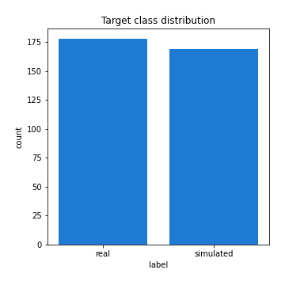
## Feature : standardised_price_mean1
- **Feature type** : continous
- **Missing** : 0.0%
- **Unique** : 347
- **Count** :347.0
- **Mean** :121.24315802400226
- **Std** :27.272187820956823
- **Min** :61.90028384066058
- **25%th Percentile** : 101.16059385858392
- **50%th Percentile** : 117.39548976815094
- **75%th Percentile** : 133.8002199039465
- **Max** :308.1816106631754

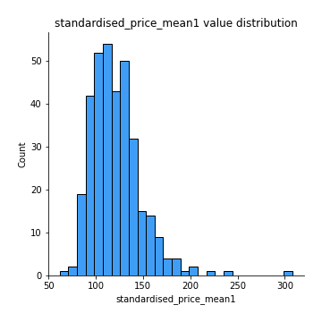
## Feature : standardised_price_mean2
- **Feature type** : continous
- **Missing** : 0.0%
- **Unique** : 347
- **Count** :347.0
- **Mean** :89.19956906139385
- **Std** :21.318224632663142
- **Min** :50.83202951213466
- **25%th Percentile** : 70.50207504093888
- **50%th Percentile** : 90.35780768403104
- **75%th Percentile** : 104.8693993009912
- **Max** :189.20110048991853

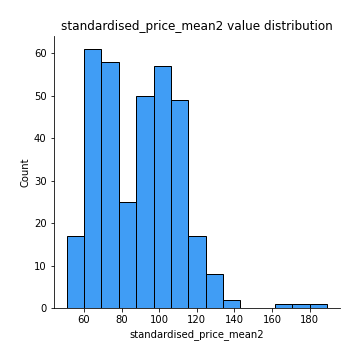
## Feature : return_mean1
- **Feature type** : continous
- **Missing** : 0.0%
- **Unique** : 347
- **Count** :347.0
- **Mean** :0.09638570776671679
- **Std** :0.17825466406966048
- **Min** :-0.31570612099423523
- **25%th Percentile** : -0.009856059370594146
- **50%th Percentile** : 0.07060088680586993
- **75%th Percentile** : 0.19011733015711182
- **Max** :0.7437510424473737

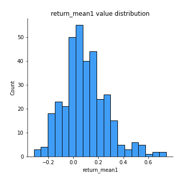
## Feature : return_mean2
- **Feature type** : continous
- **Missing** : 0.0%
- **Unique** : 347
- **Count** :347.0
- **Mean** :-0.19561300873036727
- **Std** :0.2501328604015238
- **Min** :-1.076824633912512
- **25%th Percentile** : -0.3752207982933633
- **50%th Percentile** : -0.10520152920345377
- **75%th Percentile** : -0.005854873904145802
- **Max** :0.6726818151942362

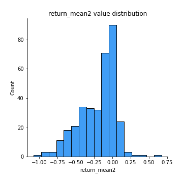
## Feature : return_sd1
- **Feature type** : continous
- **Missing** : 0.0%
- **Unique** : 347
- **Count** :347.0
- **Mean** :2.1003264906144583
- **Std** :0.799380350609223
- **Min** :0.5935251711792113
- **25%th Percentile** : 1.5212128840275456
- **50%th Percentile** : 1.9136818178281376
- **75%th Percentile** : 2.556459085656458
- **Max** :4.9492261560797015

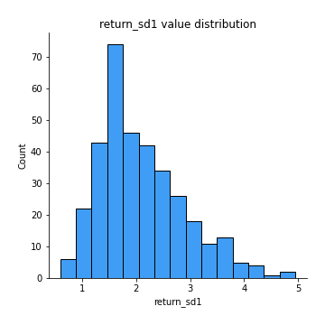
## Feature : return_sd2
- **Feature type** : continous
- **Missing** : 0.0%
- **Unique** : 347
- **Count** :347.0
- **Mean** :3.017694640690775
- **Std** :2.0384002387526974
- **Min** :0.7721299769852383
- **25%th Percentile** : 1.5563404540658448
- **50%th Percentile** : 2.096115472705746
- **75%th Percentile** : 4.088122430005599
- **Max** :11.354611816253058

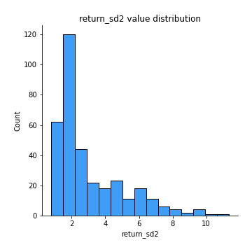
## Feature : return_skew1
- **Feature type** : continous
- **Missing** : 0.0%
- **Unique** : 347
- **Count** :347.0
- **Mean** :-0.35022112644089604
- **Std** :0.6634674879623226
- **Min** :-4.499550695415954
- **25%th Percentile** : -0.5908381273844321
- **50%th Percentile** : -0.3194839017071702
- **75%th Percentile** : -0.04555533927629325
- **Max** :3.972992894648776

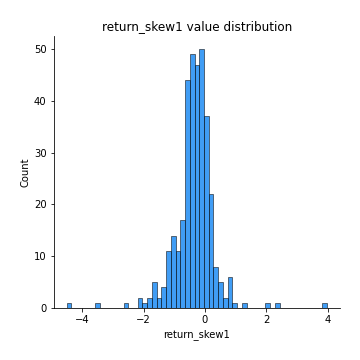
## Feature : return_skew2
- **Feature type** : continous
- **Missing** : 0.0%
- **Unique** : 347
- **Count** :347.0
- **Mean** :-0.5043062477234074
- **Std** :0.852409932669879
- **Min** :-6.262899561987459
- **25%th Percentile** : -0.7953578636496828
- **50%th Percentile** : -0.4037827261267131
- **75%th Percentile** : -0.12098057426249437
- **Max** :2.3516100629951677

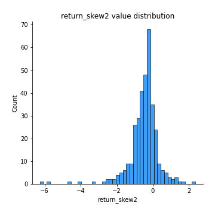
## Feature : return_kurtosis1
- **Feature type** : continous
- **Missing** : 0.0%
- **Unique** : 347
- **Count** :347.0
- **Mean** :3.51179406735179
- **Std** :4.41260288991719
- **Min** :-0.2570982527969732
- **25%th Percentile** : 1.4778690401478587
- **50%th Percentile** : 2.2066656033809435
- **75%th Percentile** : 3.900950747517495
- **Max** :43.33367798924404

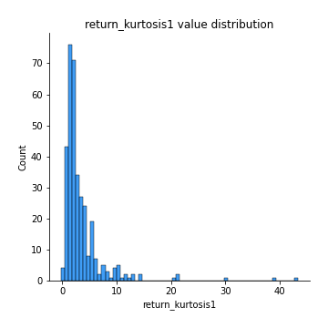
## Feature : return_kurtosis2
- **Feature type** : continous
- **Missing** : 0.0%
- **Unique** : 347
- **Count** :347.0
- **Mean** :4.844305428587808
- **Std** :6.522523660722054
- **Min** :0.023613986823165956
- **25%th Percentile** : 1.7422230396372596
- **50%th Percentile** : 3.0292756815281527
- **75%th Percentile** : 5.5746425334085945
- **Max** :64.99818629655663

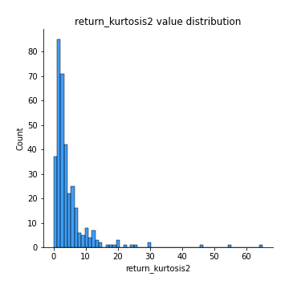
## Feature : return_autocorrelation_lag1_1
- **Feature type** : continous
- **Missing** : 0.0%
- **Unique** : 347
- **Count** :347.0
- **Mean** :-0.007442324207983469
- **Std** :0.07668360525609189
- **Min** :-0.25022202947735506
- **25%th Percentile** : -0.05476027430928008
- **50%th Percentile** : -0.005152969101061236
- **75%th Percentile** : 0.04298369310687475
- **Max** :0.2441014264736189

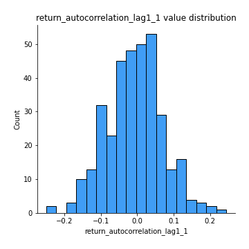
## Feature : return_autocorrelation_lag1_2
- **Feature type** : continous
- **Missing** : 0.0%
- **Unique** : 347
- **Count** :347.0
- **Mean** :-0.0010143568163237103
- **Std** :0.08207308479341517
- **Min** :-0.2758829838522007
- **25%th Percentile** : -0.05226321658585702
- **50%th Percentile** : -0.0009118496864324693
- **75%th Percentile** : 0.052138551327436264
- **Max** :0.4421018173302361

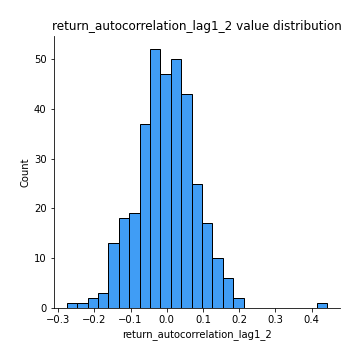
## Feature : return_autocorrelation_lag1_rolling_sd1
- **Feature type** : continous
- **Missing** : 0.0%
- **Unique** : 347
- **Count** :347.0
- **Mean** :0.9766735150821843
- **Std** :0.016916859699019533
- **Min** :0.9248211087908771
- **25%th Percentile** : 0.9637676469036358
- **50%th Percentile** : 0.9806704011030902
- **75%th Percentile** : 0.9918346479392358
- **Max** :0.9972902553464578

## Feature : return_autocorrelation_lag1_rolling_sd2
- **Feature type** : continous
- **Missing** : 0.0%
- **Unique** : 347
- **Count** :347.0
- **Mean** :0.9751181763314924
- **Std** :0.01871404921543054
- **Min** :0.9111096023575987
- **25%th Percentile** : 0.9612466063606622
- **50%th Percentile** : 0.980210942703061
- **75%th Percentile** : 0.9918398404268703
- **Max** :0.9975106476881139

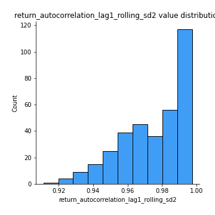
## Feature : price_adf_p_values
- **Feature type** : continous
- **Missing** : 0.0%
- **Unique** : 347
- **Count** :347.0
- **Mean** :0.25736036202867835
- **Std** :0.3049648718776793
- **Min** :2.5539372737169943e-05
- **25%th Percentile** : 0.010026905761525087
- **50%th Percentile** : 0.09916628751845946
- **75%th Percentile** : 0.47345264939826903
- **Max** :0.9958279852265163

## Feature : return_correlation_ts1_lag_0
- **Feature type** : continous
- **Missing** : 0.0%
- **Unique** : 347
- **Count** :347.0
- **Mean** :0.514263942362083
- **Std** :0.2818107920338334
- **Min** :-0.7262440508722152
- **25%th Percentile** : 0.32972240884107623
- **50%th Percentile** : 0.5379700456097098
- **75%th Percentile** : 0.7702757774668179
- **Max** :0.9937227277077512

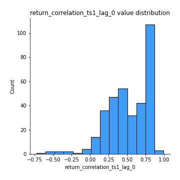
## Feature : return_correlation_ts1_lag_1
- **Feature type** : continous
- **Missing** : 0.0%
- **Unique** : 347
- **Count** :347.0
- **Mean** :0.0019132309571737323
- **Std** :0.07009197341459006
- **Min** :-0.24354514701083943
- **25%th Percentile** : -0.04195511652776679
- **50%th Percentile** : 0.005079084290495197
- **75%th Percentile** : 0.049340823642851916
- **Max** :0.27543553019495

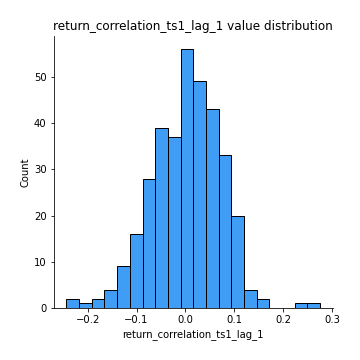
## Feature : return_correlation_ts1_lag_2
- **Feature type** : continous
- **Missing** : 0.0%
- **Unique** : 347
- **Count** :347.0
- **Mean** :-0.0013992980819013579
- **Std** :0.07436732178042646
- **Min** :-0.29418529310619224
- **25%th Percentile** : -0.044885395375238404
- **50%th Percentile** : 0.00024003998153431086
- **75%th Percentile** : 0.040144445591595176
- **Max** :0.1967878608277794

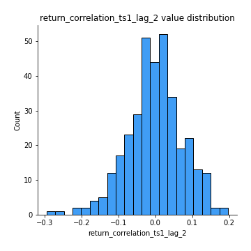
## Feature : return_correlation_ts1_lag_3
- **Feature type** : continous
- **Missing** : 0.0%
- **Unique** : 347
- **Count** :347.0
- **Mean** :0.016065725767456865
- **Std** :0.07280490366969909
- **Min** :-0.21210980055115372
- **25%th Percentile** : -0.03153434231225735
- **50%th Percentile** : 0.017456713032193767
- **75%th Percentile** : 0.06351939197610074
- **Max** :0.2458419195394638

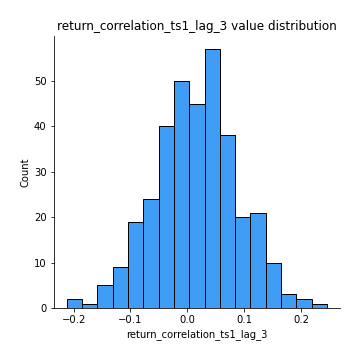
## Feature : return_correlation_ts2_lag_1
- **Feature type** : continous
- **Missing** : 0.0%
- **Unique** : 347
- **Count** :347.0
- **Mean** :0.004106757033668524
- **Std** :0.07701403782051375
- **Min** :-0.2294364427854764
- **25%th Percentile** : -0.04865252728620191
- **50%th Percentile** : 0.011324769547562761
- **75%th Percentile** : 0.05389330182313628
- **Max** :0.3425036902091001

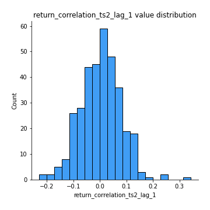
## Feature : return_correlation_ts2_lag_2
- **Feature type** : continous
- **Missing** : 0.0%
- **Unique** : 347
- **Count** :347.0
- **Mean** :-0.008494211073174626
- **Std** :0.07398388677849155
- **Min** :-0.23051140720494157
- **25%th Percentile** : -0.05525738375126203
- **50%th Percentile** : -0.009961533594060122
- **75%th Percentile** : 0.040193711745489566
- **Max** :0.25309737065250654

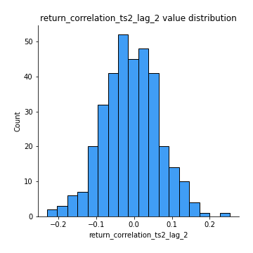
## Feature : return_correlation_ts2_lag_3
- **Feature type** : continous
- **Missing** : 0.0%
- **Unique** : 347
- **Count** :347.0
- **Mean** :0.011655689780039084
- **Std** :0.07046548080734771
- **Min** :-0.19164677309640532
- **25%th Percentile** : -0.02898232374357059
- **50%th Percentile** : 0.011204260925358325
- **75%th Percentile** : 0.05569853595313401
- **Max** :0.19919660404177986

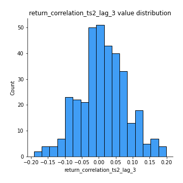
## Feature : durbin_watson_statistic1
- **Feature type** : continous
- **Missing** : 0.0%
- **Unique** : 347
- **Count** :347.0
- **Mean** :1.9799092015883788
- **Std** :0.10652905736572574
- **Min** :1.6837453550141128
- **25%th Percentile** : 1.9254150666121583
- **50%th Percentile** : 1.9867383250353028
- **75%th Percentile** : 2.0342547412752356
- **Max** :2.305954273639013

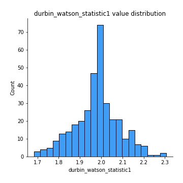
## Feature : durbin_watson_statistic2
- **Feature type** : continous
- **Missing** : 0.0%
- **Unique** : 347
- **Count** :347.0
- **Mean** :1.9773283672551907
- **Std** :0.10718234813793315
- **Min** :1.7140284721882426
- **25%th Percentile** : 1.9210039289386263
- **50%th Percentile** : 1.9840946466629876
- **75%th Percentile** : 2.024431784829616
- **Max** :2.340933343035795

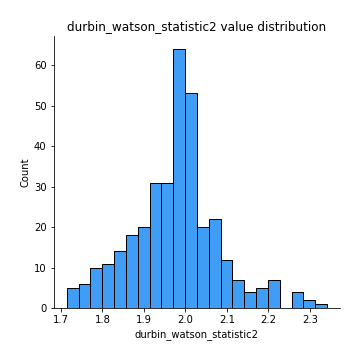
## Feature : co_integration_statistic
- **Feature type** : continous
- **Missing** : 0.0%
- **Unique** : 340
- **Count** :347.0
- **Mean** :0.37339656256781073
- **Std** :0.35681929526594763
- **Min** :7.478497249518302e-05
- **25%th Percentile** : 0.041847535709943914
- **50%th Percentile** : 0.24609732602217899
- **75%th Percentile** : 0.6999575709516387
- **Max** :1.0

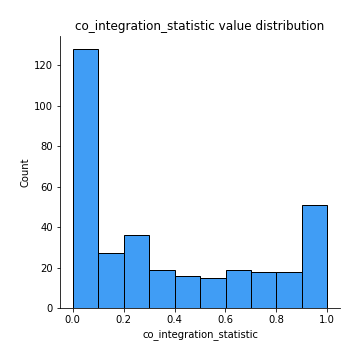
## Feature : price2_granger_cause_price1
- **Feature type** : continous
- **Missing** : 0.0%
- **Unique** : 347
- **Count** :347.0
- **Mean** :0.2321936545658542
- **Std** :0.28193790471551783
- **Min** :1.4438250873353532e-08
- **25%th Percentile** : 0.01085560629464608
- **50%th Percentile** : 0.1053163747473016
- **75%th Percentile** : 0.3634683730521977
- **Max** :0.9959564388106814

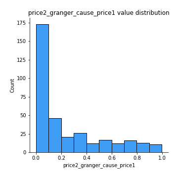
## Feature : price1_granger_cause_price2
- **Feature type** : continous
- **Missing** : 0.0%
- **Unique** : 347
- **Count** :347.0
- **Mean** :0.193178461391977
- **Std** :0.2576434634985033
- **Min** :1.2012269232170316e-11
- **25%th Percentile** : 0.01189215537292866
- **50%th Percentile** : 0.06811434818616183
- **75%th Percentile** : 0.27914104689514585
- **Max** :0.9618686005732009

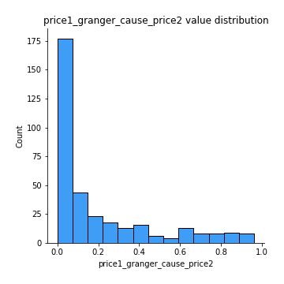

[<< Go back](../README.md)
